# VoiceOS v2 — Volume 1

## Core Voice Architecture

**Status:** Engineering Specification (Living Document)
**Audience:** Senior backend / ML / distributed-systems engineers
**Scope:** The VoiceOS v2 real-time voice runtime — from telephony ingress to synthesized audio egress.
**Authority:** This document treats the supplied VoiceOS v2 architecture as the source of truth. It expands, it does not redesign. Where an inconsistency in the source is found, it is flagged inline under a **⚠ Inconsistency** callout rather than silently corrected.

---

## How to read this document

This is an implementation handbook, not an overview. Each subsystem chapter (Ch 3–22) follows a fixed 20-section template so that a senior engineer can build the subsystem in isolation, against defined contracts, without further clarification:

1. Purpose · 2. Responsibilities · 3. Design Goals · 4. Non-Goals · 5. Inputs · 6. Outputs · 7. Public Interfaces · 8. Internal Components · 9. Data Flow · 10. Sequence Diagram · 11. State Diagram · 12. Algorithms · 13. Configuration · 14. Performance Targets · 15. Failure Modes · 16. Recovery Strategy · 17. Observability · 18. Security Notes · 19. Scalability Notes · 20. Future Improvements

Chapters 1, 2, 23, 24 and 25 are cross-cutting and do not follow the per-subsystem template.

Interface signatures are given in a Python-flavored pseudocode with explicit types. They define **contracts**, not the mandated implementation language. Latencies are stated as budgets (targets the implementation must meet), not measurements.

---

## Table of Contents

| # | Chapter | Template | Source mapping |
|---|---------|----------|----------------|
| 1 | Vision, Principles & Architectural Philosophy | cross-cutting | — |
| 2 | Complete End-to-End Voice Pipeline | cross-cutting | §1–18 |
| 3 | Media Gateway | subsystem | §1 |
| 4 | Audio Session Manager | subsystem | §2 |
| 5 | Audio Preprocessing | subsystem | §3 |
| 6 | Incoming VAD & Endpointing | subsystem | §4, §5 |
| 7 | GPU Scheduler | subsystem | §6 |
| 8 | Speech-to-Text | subsystem | §7 |
| 9 | Dialogue Manager | subsystem | §8 |
| 10 | Conversation Engine | subsystem | §9 + §19 (Intent/Strategy/Risk) |
| 11 | Memory & Customer Context | subsystem | §10 + §21 (Relationship Memory) |
| 12 | Prompt Builder | subsystem | §11 |
| 13 | LLM Runtime | subsystem | §12 |
| 14 | Output Validator | subsystem | §13 |
| 15 | Speech Rendering Layer | subsystem | §14 |
| 16 | Voice Style Layer | subsystem | §15 + §20 (Emotion intel) |
| 17 | Veena Streaming TTS | subsystem | §16 |
| 18 | True Streaming Pipeline | cross-cutting | spans §7–18 |
| 19 | Emotion Intelligence | subsystem | §20 |
| 20 | Adaptive Prosody Engine | subsystem | §14/§15 extension |
| 21 | Playback Scheduler | subsystem | §18 (reconstructed) |
| 22 | Audio Output (SOXR / μ-law) | subsystem | §17 (reconstructed) |
| 23 | End-to-End Latency Budget | cross-cutting | — |
| 24 | Failure Modes (consolidated) | cross-cutting | — |
| 25 | Architectural Decision Records | cross-cutting | — |

**⚠ Source reconciliation note.** The supplied architecture numbered components §1–§21 but skipped §18 and cut off §17 mid-definition; it also introduced the "Intelligence Layer (Intent/Strategy/Risk)," "Emotion Intelligence," and "Relationship Memory" as appended sections §19–§21 rather than inline pipeline stages. Volume 1 preserves all of this content but reorganizes it into a linear, buildable chapter sequence. The mapping column above is the authoritative crosswalk. No component is dropped; two (output resampling and outbound media) are reconstructed and labeled as such in Chapters 21–22.

---
---

# Chapter 1 — Vision, Principles & Architectural Philosophy

## 1.1 Vision

VoiceOS v2 is a real-time, full-duplex spoken-dialogue runtime for outbound and inbound telephony, initially specialized for regulated financial collections in Indian-language (Hindi / Hinglish / English) markets. The system conducts natural, low-latency, compliant voice conversations with customers over standard telephony (8 kHz μ-law/A-law) while keeping all business logic, all model choices, and all telephony providers independently replaceable.

The defining engineering constraint is **conversational latency under adversarial network conditions**: the system must begin a spoken response within **1.5 seconds** of the customer finishing their utterance (Chapter 23 decomposes this budget), while remaining correct, compliant, and interruptible.

## 1.2 Architectural Philosophy

The architecture is organized around four load-bearing commitments. Every later chapter can be traced back to one of these.

**P1 — Strict separation of *transport*, *cognition*, and *delivery*.** The pipeline is partitioned into three planes: the **media plane** (Ch 3–6, 21–22) moves and conditions audio; the **cognition plane** (Ch 9–14) decides what to say; the **delivery plane** (Ch 15–17, 19–20) decides how it sounds. A change in one plane must not require edits in another. The Conversation Engine (Ch 10) never sees a byte of PCM; the Media Gateway (Ch 3) never sees a business rule.

**P2 — The LLM decides *how* to phrase, never *what is allowed*.** Policy, compliance, state transitions, and money are owned by deterministic components (Conversation Engine, Output Validator). The LLM is a constrained natural-language renderer operating inside a decision envelope computed before generation. This is a safety property, not a stylistic one: a hallucinating model must not be able to make a promise, quote an amount, or breach a regulation, because it is never the authority for those facts.

**P3 — Streaming end-to-end, with the clause as the unit of commitment.** Latency is won or lost at stage boundaries. Every stage that *can* stream, *must* stream: partial STT hypotheses, token-level LLM output, incremental TTS synthesis, and paced playout. The smallest independently speakable unit — a **clause** — is the scheduling quantum that lets synthesis begin before generation completes (Ch 18).

**P4 — Interruption is a first-class control signal, not an exception.** Barge-in (the customer speaking over the agent) is expected on every turn. The entire delivery plane must be flushable within tens of milliseconds, and the system must reconcile "what was actually played" against "what was generated" so the dialogue state reflects reality, not intent.

## 1.3 Design Goals

- **G1 (Latency):** p50 ≤ 1.1 s, p95 ≤ 1.5 s from end-of-user-speech to first-audible-agent-audio.
- **G2 (Provider independence):** STT, LLM, TTS, and telephony are swappable behind stable interfaces; swapping any one is a config + adapter change, not a redesign.
- **G3 (Compliance by construction):** No generated audio can reach the caller without passing the Output Validator (Ch 14). Validation is in the critical path, not advisory.
- **G4 (Determinism where it matters):** State transitions, amounts, consent, and escalation are reproducible given the same inputs. Stochasticity is confined to phrasing and prosody.
- **G5 (Graceful degradation):** Every external dependency (GPU, model server, TTS socket, telephony leg) has a defined fallback that preserves either the call or a clean teardown — never a silent hang.
- **G6 (Observability):** Every turn emits a structured, replayable trace sufficient to reconstruct the decision and the audio timeline post-hoc.

## 1.4 Non-Goals (Volume 1)

- **Not** an offline batch-transcription or analytics system (that is Volume 2).
- **Not** multi-party conferencing; v2 is strictly 1 agent ↔ 1 caller per session.
- **Not** a model-training or fine-tuning pipeline; model artifacts are treated as immutable inputs.
- **Not** a CRM, dialer campaign manager, or telephony carrier; VoiceOS consumes a media leg that something else originated.
- **Not** a general IVR/DTMF menu system, though DTMF capture is supported as a side channel (Ch 3).

## 1.5 VoiceOS Principles (operating rules for contributors)

1. **No business logic outside the Conversation Engine.** If a rule mentions money, consent, regulation, or state, it lives in Ch 10 — full stop.
2. **No blocking calls on the media thread.** The RTP/audio path is real-time; anything that can stall (model inference, DB, network) is dispatched to a worker and rejoined asynchronously.
3. **Every cross-stage message is versioned and typed.** Schemas evolve additively; consumers tolerate unknown fields.
4. **Fail toward a clean teardown.** When in doubt, end the call with a compliant closing line and a logged reason, never an open dead-air socket.
5. **Measure at the boundary.** Each stage stamps ingress/egress timestamps on the turn trace; latency regressions are caught per-stage, not just end-to-end.

---
---

# Chapter 2 — Complete End-to-End Voice Pipeline

## 2.1 Purpose

This chapter defines the canonical data path of a single conversational turn, names every stage, justifies its existence, and assigns it a slice of the latency budget. It is the map every other chapter zooms into.

## 2.2 The pipeline, stage by stage

A turn flows down the **inbound (perception)** path, across the **cognition** core, and back up the **outbound (delivery)** path:

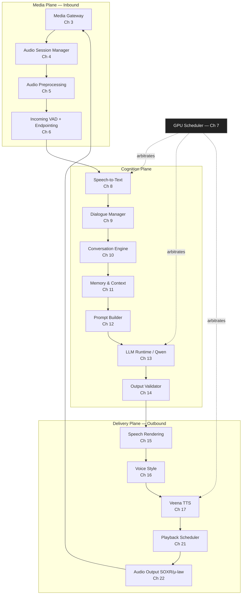

The **GPU Scheduler (Ch 7)** is drawn off to the side because it is a *control-plane* arbiter, not a data-plane stage: STT, LLM, and TTS each request GPU time from it but audio does not flow *through* it.

## 2.3 Why each stage exists (the justification table)

| Stage | Exists because… | If removed… |
|-------|-----------------|-------------|
| Media Gateway | Carriers speak SIP/RTP/Media-Streams, not application objects | No call connectivity |
| Audio Session Manager | IP networks reorder, drop, and jitter RTP | Audio glitches, desync, no reconnect |
| Audio Preprocessing | Phone audio has echo, noise, level swings; ASR wants clean 16 kHz | STT WER spikes, barge-in false-fires on echo |
| Incoming VAD + Endpointing | Must know *when the caller is speaking* and *when they're done* | Either cut callers off or wait forever |
| GPU Scheduler | Three hungry models contend for finite VRAM | OOM crashes, head-of-line latency spikes |
| STT | Convert speech → text the cognition plane can reason over | No language understanding |
| Dialogue Manager | Conversation mechanics (turn-taking, barge-in, retries) are orthogonal to business rules | Logic tangled with timing; brittle |
| Conversation Engine | Deterministic owner of state, compliance, money | Unsafe, non-reproducible decisions |
| Memory & Context | The model needs grounded customer facts, not guesses | Hallucinated balances and history |
| Prompt Builder | Deterministic, versioned assembly of the model's input | Unauditable prompts; silent drift |
| LLM Runtime | Generate the natural-language phrasing | No fluent response |
| Output Validator | Last deterministic gate before audio | Non-compliant speech reaches caller |
| Speech Rendering | Text → speakable form (numbers, Hinglish, lexicon) | Mispronounced amounts, broken TTS |
| Voice Style | Compose voice/emotion/delivery prompt | Flat, robotic, tone-deaf delivery |
| Veena TTS | Synthesize streaming audio | No voice |
| Playback Scheduler | Pace audio, handle flush on barge-in | Overruns, talk-over, desync |
| Audio Output | Resample 24 k→8 k, encode μ-law, packetize | Telephony can't play the audio |

## 2.4 End-to-end latency budget (summary)

Full decomposition is Chapter 23; the headline allocation against the **1.5 s p95** target:

```mermaid
gantt
    title Turn latency budget (ms, post end-of-speech)
    dateFormat X
    axisFormat %s
    section Perception
    Endpoint confirm      :0, 120
    section STT
    Final transcript      :120, 300
    section Cognition
    Context + Prompt      :300, 90
    LLM TTFT              :390, 350
    section Delivery
    Validate first clause :740, 40
    TTS first chunk       :780, 250
    Resample + packetize  :1030, 30
    First audio out       :milestone, 1060, 0
```

The milestone at ~**1.06 s** is first-audible-audio at p50; the remaining ~440 ms is jitter headroom to keep p95 under 1.5 s. The single largest line item is **LLM TTFT**, which is why streaming-from-first-clause (Ch 18) is non-negotiable: the system must *not* wait for the full LLM response before starting TTS.

## 2.5 Threading & process model (orientation)

- **Media thread (per call):** real-time, lock-light, owns RTP I/O, jitter buffer, VAD frame loop. Never blocks.
- **Cognition worker(s):** async tasks handling STT finalization, Conversation Engine, prompt build, LLM stream consumption.
- **Delivery worker(s):** consume LLM token stream → clause builder → TTS socket → playback queue.
- **GPU Scheduler:** a node-level (not per-call) service arbitrating model execution across all active calls.

Backpressure flows upward: if the playback queue saturates (caller barge-in, slow leg), the delivery worker signals the LLM consumer to pause token pull, which is cheap because vLLM holds generation state in the KV cache (Ch 13).

## 2.6 Future evolution

The linear pipeline is the v2 baseline. The intended v2.x evolution (previewed in later chapters) is **speculative delivery**: begin TTS on a high-confidence partial transcript before endpointing fully confirms, then cancel-and-rollback if the caller continues. This trades wasted GPU cycles for latency and is gated behind the GPU Scheduler's spare-capacity signal.

---
---

# Chapter 3 — Media Gateway

## 3.1 Purpose

The Media Gateway is the telephony boundary. It terminates whatever transport the carrier offers — Twilio Media Streams (WebSocket), native SIP/RTP, or WebRTC — and presents the rest of VoiceOS a single, uniform, provider-agnostic **bidirectional audio session** plus call-control events. It is the only component that knows a vendor's name.

## 3.2 Responsibilities

- Terminate inbound signaling and media for the supported transports.
- Authenticate and authorize every incoming connection.
- Normalize heterogeneous media (μ-law/A-law, 8 kHz, vendor framing) into a canonical internal frame format.
- Demultiplex control (call start/stop, DTMF, hold) from media.
- Emit audio frames upward to the Audio Session Manager and accept synthesized frames downward for transmission.
- Maintain the carrier-facing socket's liveness (keepalive, timeout, graceful close).

## 3.3 Design Goals

- A new transport is added by implementing one `TransportAdapter`, with zero changes above the Gateway.
- Per-frame overhead is bounded and allocation-free on the hot path.
- Authentication failure is rejected before any media buffer is allocated.

## 3.4 Non-Goals

- Does **not** originate calls (the dialer/CRM does).
- Does **not** perform DSP (that is Ch 5) beyond codec decode.
- Does **not** interpret DTMF semantically; it forwards DTMF events.

## 3.5 Inputs

| Input | Source | Format |
|-------|--------|--------|
| Inbound signaling | Carrier / Twilio / SIP proxy | SIP INVITE, or Twilio `start` WS frame, or WebRTC SDP offer |
| Inbound media | Carrier | RTP packets (μ-law/A-law, 8 kHz, 20 ms) or Twilio base64 media frames |
| Outbound media | Audio Output (Ch 22) | Canonical 8 kHz μ-law frames |
| Control commands | Audio Session Manager | `hangup`, `play_buffer`, `flush` |

## 3.6 Outputs

| Output | Destination | Format |
|--------|-------------|--------|
| Canonical audio frames | Audio Session Manager | `AudioFrame{pcm16le_8k, seq, rtp_ts, recv_ts}` |
| Call-control events | Session Manager / Conversation Engine | `CallEvent{started, ended, dtmf, hold, resume}` |
| Encoded media | Carrier | RTP / Twilio WS frames |

## 3.7 Public Interfaces

```python
class TransportAdapter(Protocol):
    async def accept(self, conn: RawConn) -> CallContext: ...
    async def recv_media(self) -> AsyncIterator[InboundFrame]: ...      # decoded → PCM16 @ 8k
    async def send_media(self, frame: OutboundFrame) -> None: ...        # encodes to wire codec
    async def control_events(self) -> AsyncIterator[CallEvent]: ...
    async def close(self, reason: HangupReason) -> None: ...

class MediaGateway:
    def register(self, scheme: str, adapter_factory: Callable[[], TransportAdapter]) -> None: ...
    async def serve(self) -> None: ...   # binds listeners for each registered transport
```

`InboundFrame` is already PCM16/8 k at this boundary; codec decode (μ-law→PCM) happens *inside* the adapter so nothing above the Gateway ever sees a wire codec.

## 3.8 Internal Components

```mermaid
flowchart LR
    L[Listener pool<br/>SIP:5060 / WS / WebRTC] --> AU[AuthN/AuthZ]
    AU --> AD[Transport Adapter<br/>Twilio | SIP | WebRTC]
    AD --> DEC[Codec decode<br/>μ-law/A-law → PCM16]
    DEC --> NRM[Frame normalizer<br/>seq, rtp_ts, recv_ts]
    NRM --> UP[(Upstream: Session Mgr)]
    DN[(Downstream: Audio Out)] --> ENC[Codec encode<br/>PCM16 → μ-law]
    ENC --> AD
    AD --> CTL[Control demux<br/>DTMF / hold / bye]
```

## 3.9 Data Flow

1. Listener accepts a connection; **AuthN/AuthZ** runs before buffers are allocated (§3.18).
2. The matching **Transport Adapter** completes the handshake (SIP 200/ACK, Twilio `start`, or WebRTC ICE/DTLS) and yields a `CallContext`.
3. Inbound packets are decoded to PCM16/8 k, normalized into `AudioFrame`s with monotonic `seq` and carrier `rtp_ts`, stamped with local `recv_ts`, and pushed upstream.
4. Downstream PCM frames from Audio Output are encoded to the leg's codec and transmitted on the carrier's cadence (20 ms).
5. Control events (DTMF, hold, BYE) are demuxed and emitted as `CallEvent`s.

## 3.10 Sequence Diagram

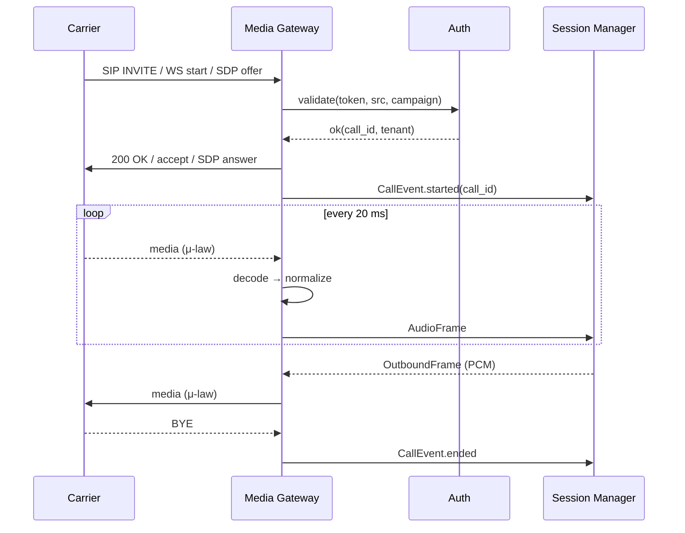

## 3.11 State Diagram

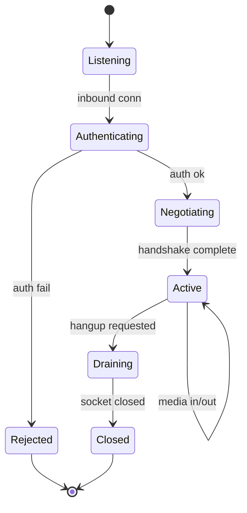

## 3.12 Algorithms

- **Codec transcode:** table-driven μ-law/A-law ↔ PCM16 (256-entry LUT, branch-free) to keep per-frame cost in the low microseconds.
- **DTMF detection (if carrier sends in-band):** Goertzel filters at the eight DTMF frequencies over 20 ms windows, with a two-window debounce to reject talk-off. Out-of-band (RFC 2833 / Twilio events) is preferred and bypasses Goertzel.
- **Twilio sequencing:** Twilio media frames carry no RTP timestamp; the adapter synthesizes `rtp_ts` from a 8 kHz sample counter and uses the WS arrival order for `seq`.

## 3.13 Configuration

```yaml
media_gateway:
  transports:
    twilio:   { enabled: true,  ws_path: /twilio/media }
    sip:      { enabled: true,  bind: 0.0.0.0:5060, rtp_port_range: [16384, 32768] }
    webrtc:   { enabled: false }
  auth:
    mode: hmac            # hmac | mtls | jwt
    clock_skew_sec: 30
  codec:
    inbound:  [PCMU, PCMA]
    frame_ms: 20
  limits:
    max_concurrent_calls: 5000
    handshake_timeout_ms: 4000
```

## 3.14 Performance Targets

- Decode+normalize per frame: **< 200 µs** p99.
- Handshake → first upstream frame: **< 250 ms** (SIP), **< 150 ms** (Twilio WS).
- Added one-way media latency through the Gateway: **< 5 ms**.

## 3.15 Failure Modes

| Failure | Detection | Effect |
|---------|-----------|--------|
| Auth failure | Token/HMAC invalid | Reject pre-allocation; audit log |
| Handshake timeout | Timer | Close leg, emit `ended(reason=handshake_timeout)` |
| Codec mismatch | SDP negotiation | Reject with 488, or transcode if supported |
| Carrier RTP silence | No packets > N ms | Mark leg stalled → Session Manager reconnect logic |
| WS disconnect (Twilio) | Socket close | Attempt resume window, else teardown |

## 3.16 Recovery Strategy

- **SIP:** rely on Session Manager re-INVITE / RTP re-anchoring (Ch 4).
- **Twilio WS:** honor a short resume window; if Twilio reconnects with the same `call_sid`, reattach to the existing session; otherwise tear down cleanly.
- All teardowns emit a structured `HangupReason` so the Conversation Engine can record disposition.

## 3.17 Observability

- Per-leg metrics: `frames_in`, `frames_out`, `decode_us_p99`, `handshake_ms`, `rtp_gap_events`.
- Structured logs keyed by `call_id`/`tenant`.
- Optional lawful, consented **media tap** to object storage for QA (PII-gated, Ch 24/Vol 2).

## 3.18 Security Notes

- **Auth before allocation:** no media buffer, no session object, no upstream channel is created until AuthN/AuthZ passes — a DoS-hardening property.
- Transport security: SIP over TLS + SRTP, Twilio over WSS, WebRTC DTLS-SRTP. Plaintext RTP only allowed on a trusted private interconnect, gated by config.
- Tenancy: `call_id` carries a `tenant` claim; all upstream messages are tenant-scoped to prevent cross-tenant leakage.
- DTMF may carry sensitive digits (e.g., partial card/OTP); DTMF events are flagged `sensitive=true` and never logged in clear.

## 3.19 Scalability Notes

- Stateless except for per-leg sockets; scales horizontally behind an L4 load balancer with SIP/WS affinity.
- 5,000 concurrent legs/node is the design point; media I/O is the binding resource, not CPU.
- WebRTC, when enabled, needs a TURN deployment — sized separately.

## 3.20 Future Improvements

- Native carrier Opus (where offered) to skip 8 kHz narrowband on the first hop.
- Pluggable media recording with on-the-fly PII redaction.
- Per-tenant codec policy and SRTP cipher pinning.

---
---

# Chapter 4 — Audio Session Manager

## 4.1 Purpose

The Audio Session Manager (ASM) owns the **lifecycle and temporal integrity** of a call's media. It turns the Gateway's possibly-disordered, possibly-lossy frame stream into a clean, monotonically-clocked PCM stream suitable for DSP and ASR, and it is the authority on "is this call still alive, and what is its clock?"

## 4.2 Responsibilities

- Maintain per-call session state and the canonical call clock.
- Run the **adaptive jitter buffer**: reorder by `seq`/`rtp_ts`, absorb network jitter, conceal loss.
- Detect and recover from leg interruptions (RTP gaps, reconnects).
- Provide a steady, fixed-cadence PCM frame feed downstream (Ch 5/6) regardless of upstream irregularity.
- Coordinate teardown and disposition with the Conversation Engine.

## 4.3 Design Goals

- Smooth playout under realistic mobile jitter (tens of ms) and ≤ 5% packet loss without audible artifacts on the perception path.
- Bounded, tunable added latency (the jitter buffer is the main controllable latency knob on the inbound path).
- Deterministic clocking so downstream VAD/STT timestamps are trustworthy.

## 4.4 Non-Goals

- No spectral DSP (echo/noise) — that is Ch 5.
- No speech/non-speech decision — that is Ch 6.
- No codec handling — that is Ch 3.

## 4.5 Inputs

- `AudioFrame{pcm16_8k, seq, rtp_ts, recv_ts}` from the Gateway.
- `CallEvent`s (started/ended/hold).
- Outbound playout requests (for symmetric handling of the agent leg's pacing handoff to Ch 21).

## 4.6 Outputs

- A **continuous** 8 kHz PCM frame stream (fixed 20 ms cadence) downstream, each frame tagged with a session-monotonic `play_ts`.
- Session lifecycle signals (`session_active`, `session_lost`, `session_closed`).
- Loss/jitter telemetry.

## 4.7 Public Interfaces

```python
class AudioSessionManager:
    def open(self, call_id: CallId, clock_rate: int = 8000) -> Session: ...
    def ingest(self, frame: AudioFrame) -> None: ...           # non-blocking enqueue
    def pull(self) -> PcmFrame: ...                            # called by media loop at cadence
    def on_event(self, ev: CallEvent) -> None: ...
    def close(self, reason: HangupReason) -> SessionStats: ...
```

`ingest` and `pull` are decoupled: `ingest` runs on receipt, `pull` runs on a fixed timer. The jitter buffer lives between them.

## 4.8 Internal Components

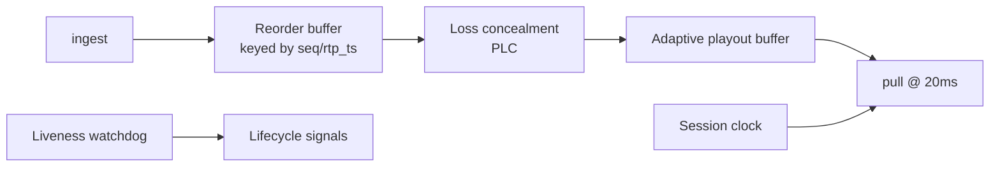

## 4.9 Data Flow

`ingest` places frames into the reorder buffer indexed by sequence. On each 20 ms `pull` tick, the playout buffer releases the next in-order frame at the current target depth; missing frames trigger PLC; the session clock advances by 160 samples. The liveness watchdog tracks inter-arrival time and raises `session_lost` after a configurable gap.

## 4.10 Sequence Diagram

```mermaid
sequenceDiagram
    participant GW as Gateway
    participant ASM
    participant Loop as Media Loop (20ms)
    participant DSP as Preprocessing
    GW->>ASM: ingest(frame seq=n)
    GW->>ASM: ingest(frame seq=n+2)  %% n+1 late
    Loop->>ASM: pull()
    ASM->>ASM: release seq=n
    Loop->>ASM: pull()
    ASM->>ASM: seq=n+1 missing → PLC conceal
    GW->>ASM: ingest(frame seq=n+1)  %% too late, dropped
    Loop->>ASM: pull()
    ASM->>DSP: release seq=n+2
```

## 4.11 State Diagram

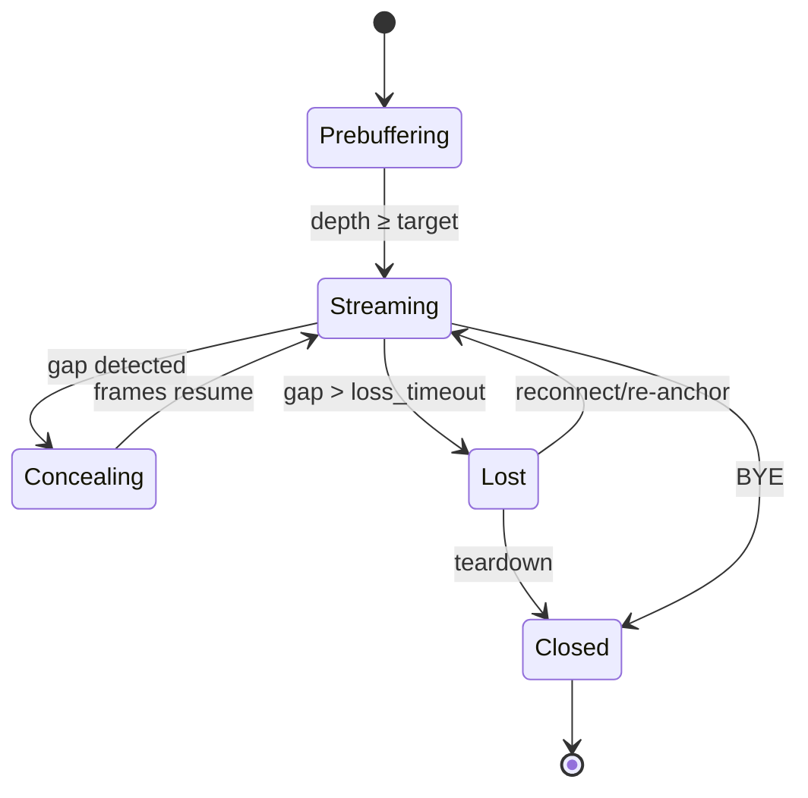

## 4.12 Algorithms

**Adaptive jitter buffer (playout delay estimation).** Maintain a running estimate of inter-arrival jitter `J` via the RFC 3550 EWMA:
`J ← J + (|D(i-1,i)| − J) / 16`, where `D` is the inter-arrival deviation. Target playout depth = `clamp(base_ms + k·J, min_ms, max_ms)`. The buffer grows by inserting concealment frames during silence and shrinks by time-scaling (dropping a frame during silence or sub-frame WSOLA compaction) to avoid audible pitch shifts.

**Packet-loss concealment (PLC).** For ≤ 1 lost frame: repeat-with-decay of the last frame plus pitch-synchronous extrapolation. For bursts > 60 ms: fade to comfort noise to avoid robotic artifacts. PLC frames are flagged so the VAD (Ch 6) can discount them.

**Re-anchoring after reconnect.** On Lost→Streaming, detect a `rtp_ts` discontinuity; reset the session clock offset rather than the monotonic `play_ts`, so downstream timestamps stay continuous across the reconnect.

## 4.13 Configuration

```yaml
audio_session:
  jitter:
    base_ms: 40
    min_ms: 20
    max_ms: 120
    k_jitter: 2.0
  loss:
    plc_max_frames: 3
    loss_timeout_ms: 2000
  liveness:
    rtp_gap_warn_ms: 500
    rtp_gap_lost_ms: 2000
```

## 4.14 Performance Targets

- Added inbound latency = current playout depth, target **40–60 ms** under normal jitter, capped at 120 ms.
- PLC decision per tick: **< 50 µs**.
- Reconnect re-anchor: **< 200 ms** to resume clean streaming.

## 4.15 Failure Modes

| Failure | Detection | Effect |
|---------|-----------|--------|
| Sustained reorder beyond buffer | seq far ahead | Late frames dropped, counted |
| Burst loss > PLC budget | gap length | Comfort noise, possible `session_lost` |
| Clock drift (carrier vs local) | `rtp_ts` vs `recv_ts` slope | Slow resample/skew correction |
| Leg lost | gap > loss_timeout | `session_lost` → Dialogue Mgr handles dead-air policy |

## 4.16 Recovery Strategy

- Short gaps: PLC, no escalation.
- `session_lost`: notify Dialogue Manager, which may emit a "are you still there?" prompt (Ch 9) and start a teardown timer.
- Reconnect within window: re-anchor and resume; otherwise clean teardown with `reason=media_lost`.

## 4.17 Observability

- `jitter_ms`, `playout_depth_ms`, `loss_pct`, `plc_frames`, `reanchor_count`, `session_duration`.
- Per-call timeline of buffer depth for post-hoc latency forensics.

## 4.18 Security Notes

- PCM buffers carry voice (sensitive); buffers are zeroed on session close, never pooled across tenants without wipe.
- No content is logged; only metrics.

## 4.19 Scalability Notes

- Per-call state is small (buffers + counters); the binding cost is the number of 20 ms timers. Use a single shared timer wheel per worker, not a timer per call.
- Sessions are sharded by `call_id`; no cross-session coordination needed.

## 4.20 Future Improvements

- ML-based PLC (neural concealment) for long bursts.
- FEC/RED ingestion when carriers provide redundancy.
- Dynamic `base_ms` learned per-route from historical jitter.

---
---

# Chapter 5 — Audio Preprocessing

## 5.1 Purpose

Convert the clean-but-raw 8 kHz telephone PCM stream from the ASM into a conditioned 16 kHz stream optimized for ASR accuracy and reliable barge-in detection. This stage removes the agent's own echo, suppresses noise, normalizes level, and resamples.

## 5.2 Responsibilities

- **Acoustic Echo Cancellation (AEC):** remove the agent's outbound audio from the inbound mic path so the system does not "hear itself" and false-trigger barge-in.
- **Noise suppression (NS):** attenuate stationary/non-stationary noise (traffic, fans, hum).
- **Automatic Gain Control (AGC):** normalize speaker level for consistent STT input.
- **High-pass filtering:** remove sub-80 Hz rumble/DC.
- **Resampling:** 8 kHz → 16 kHz for the ASR front-end.

## 5.3 Design Goals

- Echo return loss enhancement sufficient that residual echo never crosses the VAD speech threshold during agent speech.
- Frame-synchronous, fixed 10 ms internal processing aligned to WebRTC APM expectations.
- Deterministic, low-latency (no look-ahead beyond one frame where avoidable).

## 5.4 Non-Goals

- Not speech detection (Ch 6).
- Not dereverberation beyond what AEC3/NS provide.
- Not speaker separation / diarization.

## 5.5 Inputs

- Near-end PCM (caller) 8 kHz from ASM.
- **Far-end reference** PCM (the agent's outbound audio) from the Playback path (Ch 21) — required for AEC.

## 5.6 Outputs

- Conditioned 16 kHz PCM frames to VAD (Ch 6) and STT (Ch 8).
- Per-frame metadata: estimated SNR, echo-active flag, AGC gain applied.

## 5.7 Public Interfaces

```python
class AudioPreprocessor:
    def __init__(self, cfg: ApmConfig): ...
    def push_far_end(self, ref: PcmFrame) -> None: ...        # agent audio for AEC alignment
    def process(self, near: PcmFrame) -> ProcessedFrame: ...  # returns 16k conditioned frame + meta
```

The far-end reference **must** be time-aligned with the near-end; misalignment is the dominant cause of AEC failure, so the Playback Scheduler (Ch 21) stamps reference frames with the same `play_ts` clock.

## 5.8 Internal Components

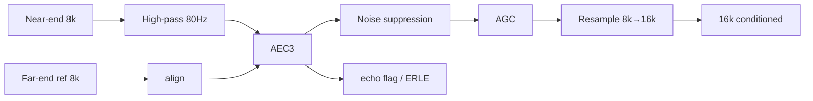

## 5.9 Data Flow

Near-end frames are high-passed, then echo-cancelled against the aligned far-end reference, then noise-suppressed, gain-controlled, and resampled to 16 kHz. Metadata (echo-active, SNR, gain) rides alongside for VAD to consume.

## 5.10 Sequence Diagram

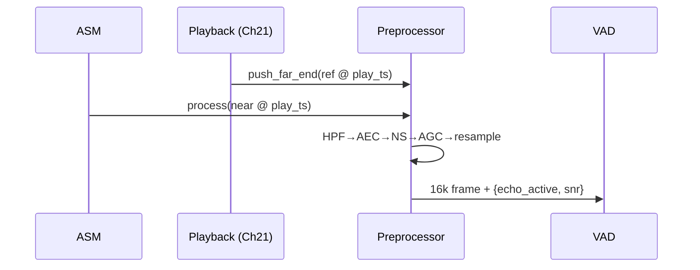

## 5.11 State Diagram

Not applicable (stateless per-frame except adaptive filter coefficients, which are internal to AEC/NS/AGC and converge continuously).

## 5.12 Algorithms

- **AEC:** WebRTC **AEC3** — partitioned-block frequency-domain adaptive filter with a nonlinear residual-echo suppressor and a delay estimator. The delay estimator tolerates the variable Gateway↔Playback path delay; we pin a coarse delay hint from `play_ts` alignment to speed convergence.
- **NS:** WebRTC noise suppressor (Wiener-filter style, per-band gain from a noise-PSD estimate).
- **AGC:** digital AGC targeting a fixed RMS (e.g., −18 dBFS) with limiter to prevent clipping; attack/release tuned to avoid pumping on speech.
- **Resampler:** polyphase FIR 8 k→16 k (SOXR or speex-resampler), VHQ-ish quality, low latency.

## 5.13 Configuration

```yaml
preprocessing:
  hpf_hz: 80
  aec3: { enabled: true, delay_hint_from_playout: true, residual_suppression: aggressive }
  ns:   { enabled: true, level: high }
  agc:  { target_dbfs: -18, max_gain_db: 24, limiter: true }
  resample: { in_hz: 8000, out_hz: 16000, quality: high }
```

## 5.14 Performance Targets

- Total stage latency: **< 12 ms** (one APM block + resample).
- ERLE during double-talk: sufficient to keep residual below VAD threshold (validated empirically per build).
- CPU: real-time factor ≪ 1 on a single core per call.

## 5.15 Failure Modes

| Failure | Detection | Effect |
|---------|-----------|--------|
| Far-end reference missing/misaligned | no `push_far_end` / drift | AEC diverges → echo leaks → false barge-in |
| Over-aggressive NS | low output energy | Clipped speech onsets, higher STT WER |
| AGC pumping | rapid gain swings | Distorted level; STT degradation |

## 5.16 Recovery Strategy

- If reference is absent (e.g., agent silent), AEC runs in pass-through with frozen coefficients.
- Misalignment detected → reset AEC delay estimator using the `play_ts` hint.
- NS/AGC have safe fallbacks (bypass) toggled by config flags without restart.

## 5.17 Observability

- `erle_db`, `echo_active_pct`, `snr_db`, `agc_gain_db`, `aec_diverged_events`.

## 5.18 Security Notes

- Conditioned audio remains sensitive PCM; same zero-on-close and no-content-logging rules as Ch 4.

## 5.19 Scalability Notes

- Pure CPU/SIMD; scales with core count. AEC is the heaviest term; budget cores accordingly at high concurrency.

## 5.20 Future Improvements

- DNN noise suppression (e.g., RNNoise-class) for non-stationary noise.
- Joint AEC+NS neural front-end.
- Per-call adaptation of NS aggressiveness from measured STT confidence.

---
---

# Chapter 6 — Incoming VAD & Endpointing

## 6.1 Purpose

Decide, in real time, **when the caller is speaking**, **when an utterance has ended** (endpointing), and **when the caller is interrupting the agent** (barge-in). This stage gates STT, drives turn-taking, and is the trigger for flushing agent playback. It merges the source architecture's §4 (VAD) and §5 (Endpoint Detector).

## 6.2 Responsibilities

- Frame-level speech probability (Silero VAD).
- Robust speech **onset** and **offset** detection with hangover.
- **Endpoint** (end-of-utterance) decision combining acoustic silence with adaptive pause modeling.
- **Barge-in** detection while the agent is speaking, coordinated with the echo flag from Ch 5.
- Emit clean turn boundaries to the Dialogue Manager.

## 6.3 Design Goals

- Don't cut callers off mid-thought (avoid premature endpoint) **and** don't make them wait (avoid late endpoint). This is the central tension; the endpointer is adaptive, not a fixed timeout.
- Barge-in detection latency low enough to flush agent audio within one human reaction window (~150–250 ms perceived).
- Resistant to residual echo, breaths, clicks, and backchannels ("haan", "ok", "hmm").

## 6.4 Non-Goals

- Not transcription or word-level alignment (Ch 8).
- Not semantic turn completion (that refinement lives in the Dialogue Manager, Ch 9, which may override on syntactic/semantic cues).

## 6.5 Inputs

- 16 kHz conditioned frames + metadata (`echo_active`, `snr`) from Ch 5.
- Agent-speaking flag from Playback Scheduler (Ch 21) — needed to arm barge-in logic.

## 6.6 Outputs

- `SpeechEvent{onset|offset|endpoint, ts, confidence}`.
- `BargeIn{ts, confidence}` when caller speech overlaps agent speech.
- A gated audio segment handed to STT (from confirmed onset to endpoint).

## 6.7 Public Interfaces

```python
class Endpointer:
    def set_agent_speaking(self, active: bool) -> None: ...
    def push(self, frame: ProcessedFrame) -> list[SpeechEvent]: ...
    def reset(self) -> None: ...   # at turn boundaries
```

## 6.8 Internal Components

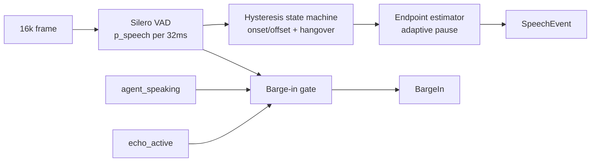

## 6.9 Data Flow

Silero yields a speech probability per ~32 ms frame. A hysteresis state machine converts the noisy probability into stable onset/offset with separate on/off thresholds and hangover. The endpoint estimator measures trailing silence and compares it against an adaptive pause threshold. In parallel, when `agent_speaking` is true and `echo_active` is false, sustained caller speech raises a barge-in.

## 6.10 Sequence Diagram

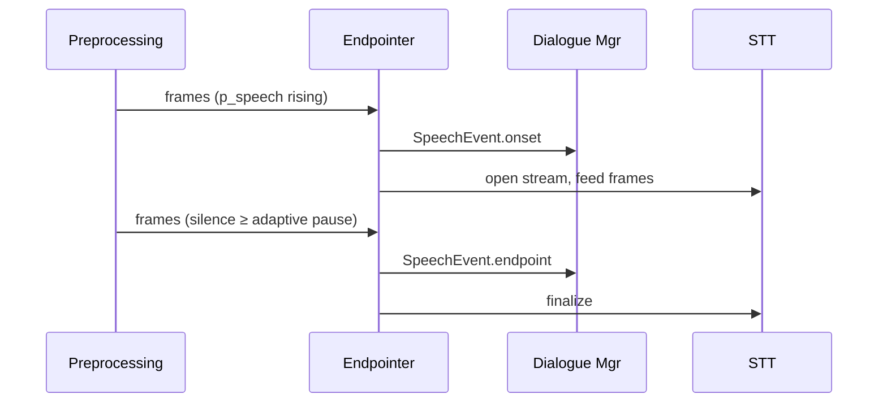

## 6.11 State Diagram

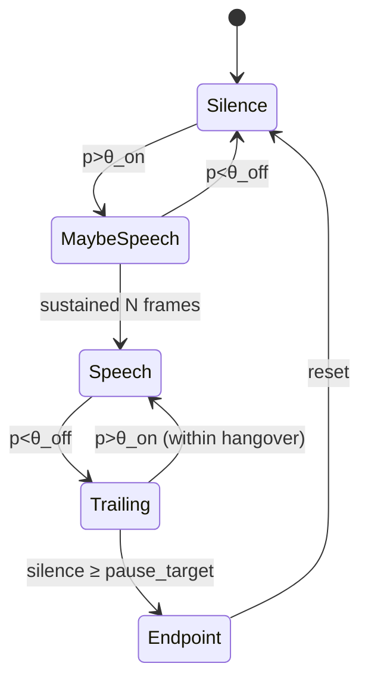

## 6.12 Algorithms

**Hysteresis + hangover.** Use distinct `θ_on > θ_off`. Require `N_on` consecutive frames above `θ_on` to declare onset (kills clicks), and a hangover of `H` ms below `θ_off` before offset (kills inter-word gaps).

**Adaptive endpointing.** The trailing-silence threshold `pause_target` is not fixed. It adapts on:
- **Recent speech rate / rhythm** (slower speakers get longer thresholds).
- **Syntactic hint** from incremental STT (if the partial ends mid-clause — e.g., trailing conjunction — extend the threshold).
- **Dialogue state** (Ch 9 may request a longer threshold when expecting a number/long answer, shorter for yes/no).

Formally: `pause_target = base + α·speaker_rate_factor + β·incompleteness(partial)`, clamped to `[min_pause, max_pause]`.

**Barge-in.** Arm only when `agent_speaking ∧ ¬echo_active`. Require sustained caller speech (≥ `B_on` ms, higher bar than normal onset to avoid backchannel false-fires) before firing `BargeIn`, which immediately triggers a playback flush (Ch 21) and a turn yield (Ch 9).

**Backchannel discrimination.** Very short (< 300 ms) high-confidence speech bursts during agent speech are classified as backchannels ("haan/ok"), logged, and (by policy) do *not* interrupt unless they extend.

## 6.13 Configuration

```yaml
vad:
  model: silero
  frame_ms: 32
  theta_on: 0.6
  theta_off: 0.35
  onset_frames: 3
  hangover_ms: 240
endpoint:
  base_pause_ms: 500
  min_pause_ms: 280
  max_pause_ms: 1200
  alpha_rate: 1.0
  beta_incompleteness: 1.0
bargein:
  arm_on_agent_speech: true
  min_speech_ms: 280
  ignore_backchannel_ms: 300
```

## 6.14 Performance Targets

- VAD inference per frame: **< 3 ms** (CPU) — Silero is light; runs on CPU off the GPU scheduler.
- Endpoint decision added latency: **≈ pause_target** (this is the dominant tunable inbound latency after the jitter buffer; see Ch 23).
- Barge-in fire → flush issued: **< 50 ms**.

## 6.15 Failure Modes

| Failure | Detection | Effect |
|---------|-----------|--------|
| Premature endpoint | endpoint then immediate new onset | Truncated utterance, bad STT; mitigated by re-merge in Ch 9 |
| Late endpoint | long trailing silence | Sluggish turn; user perceives lag |
| Echo-driven false barge-in | barge-in while echo_active | Suppressed by gating; if AEC weak, agent self-interrupts |
| Backchannel false interrupt | short burst | Suppressed by min_speech_ms |

## 6.16 Recovery Strategy

- **Re-merge:** if a new onset arrives within a short window after an endpoint, the Dialogue Manager (Ch 9) can re-open the turn and concatenate, treating the prior endpoint as spurious.
- If barge-in proves spurious (caller goes silent immediately after flush), the agent resumes from the flushed position via the Playback Scheduler's checkpoint (Ch 21).

## 6.17 Observability

- `endpoint_latency_ms`, `false_endpoint_rate` (proxied by re-merge count), `bargein_count`, `bargein_false_rate`, `vad_speech_ratio`.

## 6.18 Security Notes

- Emits only timestamps/flags, no content; safe to log fully.

## 6.19 Scalability Notes

- CPU-bound and light; one VAD instance per call, pooled threads. Deliberately kept off the GPU Scheduler so endpointing never queues behind STT/LLM/TTS.

## 6.20 Future Improvements

- **Semantic endpointing:** a tiny end-of-turn classifier over the STT partial (predicting turn-final vs turn-medial) to shrink `pause_target` safely.
- Speaker-adaptive thresholds learned within the call.
- Joint VAD/barge-in model conditioned on the far-end reference for echo-robustness.

---

*End of Batch 1 (front matter + Chapters 1–6). Batch 2 will cover Ch 7 (GPU Scheduler) → Ch 12 (Prompt Builder).*
