# VoiceOS v2 — Volume 2

## Conversation Intelligence Architecture

**Status:** Engineering Specification (Living Document)
**Audience:** Senior AI engineers, distributed-systems engineers, conversational-AI researchers
**Scope:** The reasoning, planning, negotiation, memory, emotion, and learning layer that operates **on top of** the Volume 1 Core Voice Architecture.
**Authority:** Volume 1 is the immutable foundation. Volume 2 does not redesign or duplicate it; it specifies the *internals* of the intelligence components Volume 1 exposed as sockets.

---

## Relationship to Volume 1 (read first)

Volume 1 defined a linear runtime: media in → STT → **Dialogue Manager** → **Conversation Engine** → **Memory & Context** → **Prompt Builder** → **LLM Runtime** → **Output Validator** → speech rendering → TTS → media out. Several intelligence concerns were named there but deliberately left as **contracts to be filled by Volume 2**:

| Volume 1 socket | Volume 2 chapter(s) that fill it |
|---|---|
| Dialogue Manager (Vol 1 Ch 9) — emits turn input | Consumes its output; Ch 2, 16 |
| Conversation Engine (Vol 1 Ch 10) — owns state/business logic | Ch 3 (Intent), 4 (Strategy), 5 (Negotiation), 7 (Goals), 8 (Policy), 12 (State Intelligence) |
| Memory & Context (Vol 1 Ch 11) | Ch 9 (Relationship), 10 (Working), 11 (Entities), 20 (Retrieval) |
| Prompt Builder (Vol 1 Ch 12) | Ch 15 (Response Plan), 19 (Prompt Intelligence) |
| LLM Runtime (Vol 1 Ch 13) | Consumer of the plan; Ch 21 (Prediction) |
| Output Validator (Vol 1 Ch 14) | Ch 6 (Risk), 17 (Output Evaluation) |
| Voice Style / Emotion (Vol 1 Ch 16/19) | Ch 13 (Emotion), 14 (Empathy) |

**The spine of Volume 2** is a single immutable, versioned object — the **`ResponsePlan`** — produced by the intelligence layer and consumed by the Volume 1 Prompt Builder. The plan says *what must happen and within what constraints*; the LLM decides *only the wording*. This is the load-bearing invariant of the entire volume (see Ch 1 and Ch 2).

---

## How to read this document

Each chapter follows the fixed 20-section template:

1. Purpose · 2. Responsibilities · 3. Design Goals · 4. Non-Goals · 5. Inputs · 6. Outputs · 7. Public Interfaces · 8. Internal Components · 9. Data Flow · 10. Sequence Diagram · 11. State Diagram · 12. Algorithms · 13. Prompt Strategy · 14. Decision Logic · 15. Failure Modes · 16. Recovery Strategy · 17. Observability · 18. Security Notes · 19. Scalability · 20. Future Improvements

Interface signatures are typed pseudocode defining contracts, not mandated languages. "The model" means the Volume 1 LLM Runtime (Qwen-3 8B on vLLM) unless stated otherwise. A "turn" is one caller-utterance → agent-response cycle as bounded by Volume 1 Ch 6 endpointing.

---

## Table of Contents

| # | Chapter | Role |
|---|---------|------|
| 1 | Intelligence Philosophy | cross-cutting |
| 2 | Conversation Intelligence Layer | architecture spine |
| 3 | Intent Engine | perception |
| 4 | Strategy Engine | planning |
| 5 | Negotiation Engine | planning (collections) |
| 6 | Risk Engine | governance |
| 7 | Goal Planner | planning |
| 8 | Dialogue Policy Engine | governance |
| 9 | Relationship Memory | memory (long-term) |
| 10 | Working Memory | memory (runtime) |
| 11 | Entity Extraction Engine | perception |
| 12 | Conversation State Intelligence | state |
| 13 | Emotion Intelligence | perception |
| 14 | Empathy Planner | delivery planning |
| 15 | Response Planning Engine | plan assembly |
| 16 | Adaptive Conversation Engine | mechanics |
| 17 | Output Evaluation Engine | governance |
| 18 | Learning Layer | offline/online improvement |
| 19 | Prompt Intelligence | plan → prompt |
| 20 | Knowledge & Retrieval Intelligence | memory/grounding |
| 21 | Predictive Response Engine | latency |
| 22 | Conversation Quality Scoring | evaluation |
| 23 | Future Multi-Agent Architecture | evolution |
| 24 | Architectural Decisions | rationale |

---
---

# Chapter 1 — Intelligence Philosophy

## 1.1 Purpose

Define what "intelligence" means inside VoiceOS, the hierarchy by which decisions are made, and the single most important boundary in the system: the line between **reasoning** (deterministic, owned, auditable) and **language generation** (stochastic, constrained, disposable). Every later chapter is an application of the principles fixed here.

## 1.2 Responsibilities

- Establish the decision hierarchy and who owns each decision class.
- Define the deterministic-vs-LLM split as a hard architectural law, not a guideline.
- Establish the `ResponsePlan` as the contract between reasoning and generation.
- Define what "human-like" means operationally (it is a set of behaviors, not a vibe).

## 1.3 Design Goals

- **Auditability:** every consequential decision (state change, money, consent, escalation, policy) is traceable to a deterministic rule and inputs, replayable offline.
- **Safety by construction:** no stochastic component can be the *authority* for a regulated fact.
- **Separability:** reasoning quality and language quality can be improved independently.
- **Latency-awareness:** intelligence runs inside a ~300–400 ms cognition budget (Vol 1 Ch 23), so reasoning is mostly cheap, parallel, and precomputed — not a chain of LLM calls.

## 1.4 Non-Goals

- Not a chatbot framework where the LLM "decides everything."
- Not artificial general reasoning; the system reasons within a bounded collections domain.
- Not a place to relitigate Volume 1's runtime; this volume assumes those contracts.

## 1.5 The decision hierarchy

VoiceOS makes four classes of decision, in strict precedence. Higher classes override lower ones; a lower class can never violate a higher one.

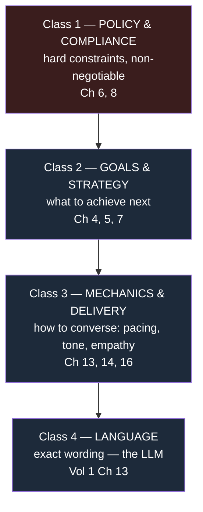

- **Class 1 (Policy/Compliance)** is deterministic and absolute. It can *veto* anything below it. Owned by the Risk Engine (Ch 6) and Dialogue Policy Engine (Ch 8).
- **Class 2 (Goals/Strategy)** is deterministic planning over the current state. Owned by Goal Planner (Ch 7), Strategy Engine (Ch 4), Negotiation Engine (Ch 5).
- **Class 3 (Mechanics/Delivery)** shapes *how* the chosen action is conveyed (tone, empathy, pacing). Mostly deterministic with model-derived features (emotion).
- **Class 4 (Language)** is the only class delegated to the LLM, and only within the envelope the upper classes computed.

## 1.6 Deterministic vs LLM reasoning — the hard law

> **Law of Authority:** The LLM is never the source of truth for any fact that is regulated, monetary, identity-related, state-changing, or persisted. For those, the LLM is a *renderer* of values computed deterministically and injected into its prompt.

Concretely:
- The LLM may **say** "your EMI of ₹4,500 is overdue," but the **₹4,500 and the "overdue" status come from Memory/Context (Vol 1 Ch 11)**, not the model.
- The LLM may **phrase** a settlement offer, but **whether an offer is permitted, and its floor, come from the Negotiation Engine (Ch 5)**.
- The LLM may **acknowledge** a promise-to-pay, but **recording the promise is done by the Conversation Engine** after the Entity Engine (Ch 11) extracts it and the Output Evaluator (Ch 17) confirms consistency.

What the LLM *is* trusted with: fluency, register, disambiguation phrasing, empathy expression, code-switching (Hindi/Hinglish/English) — all of which are corrected or rejected post-hoc by the Output Evaluation Engine (Ch 17) if they drift.

## 1.7 Human-like reasoning, operationally defined

"Human-like" is decomposed into measurable behaviors, each owned by a named component:

| Behavior | Owner |
|---|---|
| Doesn't repeat questions already answered | Working Memory (Ch 10) + Slots |
| Remembers prior calls and preferences | Relationship Memory (Ch 9) |
| Reads the room (anger, confusion) | Emotion Intelligence (Ch 13) → Empathy Planner (Ch 14) |
| Adjusts plan when the customer pushes back | Strategy/Negotiation (Ch 4/5) |
| Knows when to stop talking / yield | Adaptive Conversation Engine (Ch 16) |
| Stays on objective without being robotic | Goal Planner (Ch 7) + Mechanics |

## 1.8 Sequence Diagram — one reasoning turn

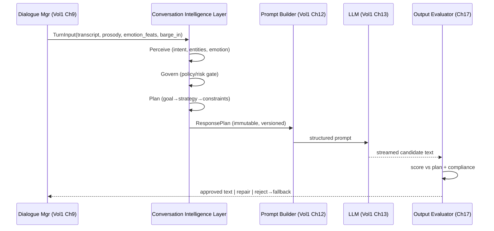

## 1.9 Algorithms / Decision Logic

The philosophy mandates a **perceive → govern → plan → render → evaluate** loop per turn, not a single LLM call. Perception, governance, and planning are deterministic or small-model tasks that run mostly in parallel within the cognition budget; the LLM call is the only large-latency item, which is why prediction (Ch 21) precomputes likely plans before the caller finishes speaking.

## 1.10 Failure Modes & Recovery (philosophy-level)

| Failure | Principle violated | Guardrail |
|---|---|---|
| LLM invents an amount | Law of Authority | Output Evaluator cross-checks every number against injected facts (Ch 17) |
| Model negotiates beyond floor | Class precedence | Negotiation envelope is a hard constraint in the plan; violations rejected (Ch 5/17) |
| Policy bypassed under pressure | Class 1 supremacy | Risk Engine veto is non-overridable (Ch 6) |

## 1.11 Observability, Security, Scalability, Future

- **Observability:** every turn emits the full `ResponsePlan`, the perception outputs, the governance verdicts, and the evaluator scores — a complete decision record.
- **Security:** reasoning operates on tenant-scoped, minimized context; the LLM never receives raw PII it doesn't need to render (Ch 19 redaction).
- **Scalability:** deterministic reasoning is cheap and horizontally trivial; the LLM is the only scaling constraint, governed by Vol 1's GPU Scheduler (Ch 7).
- **Future:** the four-class hierarchy is also the seam along which the future multi-agent design (Ch 23) splits.

---
---

# Chapter 2 — Conversation Intelligence Layer

## 2.1 Purpose

Specify the layer that sits between the Dialogue Manager and the Prompt Builder: its sub-components, their ownership boundaries, the data contract they collectively produce (`ResponsePlan`), and the orchestration that turns a `TurnInput` into that plan inside the cognition budget.

## 2.2 Responsibilities

- Orchestrate perception (intent, entities, emotion), governance (policy, risk), and planning (goal, strategy, negotiation, empathy) into one `ResponsePlan` per turn.
- Enforce ownership boundaries: **the LLM never owns business logic**; this layer owns it.
- Guarantee the plan is **complete, consistent, and policy-valid** before the Prompt Builder is invoked.
- Provide a stable, versioned contract to Volume 1's Prompt Builder and Output Validator.

## 2.3 Design Goals

- **Single source of intent for the turn:** one assembled plan, not scattered side-effects.
- **Parallelism:** perception and retrieval run concurrently; planning consumes their results.
- **Determinism with graceful softness:** hard constraints deterministic; soft choices (tone) tunable.
- **Budget adherence:** assemble a plan in **≤ 120 ms** p95 excluding retrieval round-trips that are prefetched.

## 2.4 Non-Goals

- Not the LLM call itself (Vol 1 Ch 13), nor prompt string assembly (Vol 1 Ch 12 + Ch 19 here).
- Not audio or turn-taking timing (Vol 1 Ch 6/9).

## 2.5 Inputs

`TurnInput` from the Dialogue Manager:
```python
class TurnInput:
    call_id: CallId
    final_transcript: str
    partials: list[str]            # for prediction (Ch 21)
    prosody: ProsodyFeatures       # pitch/energy/rate from Vol1 front-end
    barge_in: bool
    silence_ms: int                # trailing silence at endpoint
    turn_index: int
```
Plus ambient context: current conversation state, working memory, relationship memory, retrieval handles.

## 2.6 Outputs

The **`ResponsePlan`** — the spine object:
```python
class ResponsePlan:
    version: str
    call_id: CallId
    turn_index: int
    # perception
    intents: list[ScoredIntent]            # Ch 3
    entities: list[Entity]                 # Ch 11
    emotion: EmotionState                  # Ch 13
    # governance
    policy_constraints: list[Constraint]   # Ch 8 (hard)
    risk_flags: list[RiskFlag]             # Ch 6
    # plan
    goal: GoalRef                          # Ch 7
    strategy: StrategyAction               # Ch 4 / Ch 5
    negotiation_envelope: Envelope | None  # Ch 5 (floors/ceilings)
    delivery: DeliveryDirective            # Ch 14 (tone, empathy, brevity, authority)
    # grounding
    facts: dict[str, Any]                  # injected truths (amounts, dates) — Law of Authority
    retrieval: list[Snippet]               # Ch 20
    # guidance for generation
    must_say: list[str]                    # semantic obligations
    must_not_say: list[str]                # forbidden content
    expected_entities: list[EntityType]    # what to listen for next (Ch 21)
```
The plan is **immutable** once emitted and **versioned**; the Prompt Builder, LLM, and Output Evaluator all read the same plan, which is what makes evaluation possible ("did the output satisfy the plan?").

## 2.7 Public Interfaces

```python
class ConversationIntelligenceLayer:
    async def plan_turn(self, ti: TurnInput, ctx: TurnContext) -> ResponsePlan: ...
    async def prefetch(self, partials: list[str], ctx: TurnContext) -> None: ...  # Ch 21
```

## 2.8 Internal Components

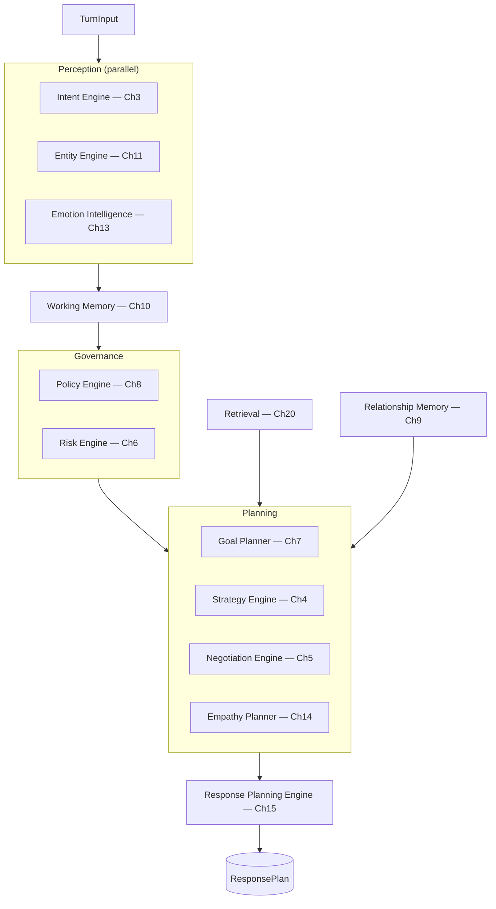

## 2.9 Data Flow

`TurnInput` fans out to the three perception engines in parallel; their outputs update Working Memory (slots, intent/entity history). Governance evaluates policy/risk against the updated state, producing hard constraints and veto flags. Planning selects a goal, derives a strategy (or a negotiation move), and a delivery directive, all bounded by the constraints. The Response Planning Engine (Ch 15) assembles the immutable `ResponsePlan`. Retrieval and Relationship Memory are prefetched on partials (Ch 21) so they're warm by assembly time.

## 2.10 Sequence Diagram

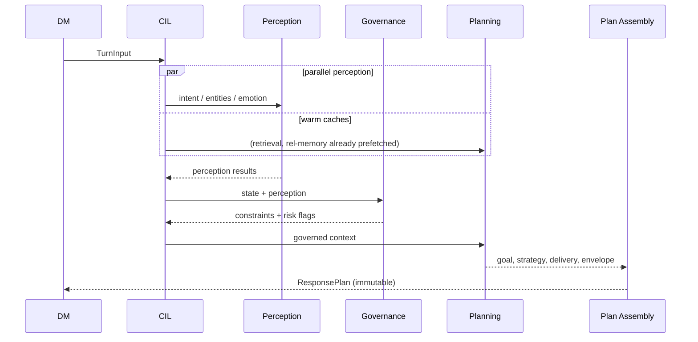

## 2.11 State Diagram

The layer is stateless per call *invocation* but reads/writes the conversation's evolving state (Ch 12). See Ch 12 for the state machine itself.

## 2.12 Algorithms

Orchestration is a **bounded DAG executor**: perception nodes run concurrently with a per-node deadline; governance and planning are sequential because each depends on the prior. If a non-critical node misses its deadline (e.g., emotion), the layer proceeds with a safe default and flags degraded mode rather than blowing the budget.

## 2.13 Prompt Strategy

This layer does **not** build prompt strings; it produces the structured `ResponsePlan` that Ch 19 deterministically renders into the layered prompt. The separation means prompt-format changes never touch reasoning, and reasoning changes never silently alter prompt wiring.

## 2.14 Decision Logic

Ownership rule, enforced in code review and at runtime: any field that influences money, state, consent, or compliance must be set by a Class 1/2 component (Ch 4–8), never inferred downstream. The assembler asserts that `facts`, `policy_constraints`, and `negotiation_envelope` were populated by their authoritative owners (provenance-tagged) before emitting the plan.

## 2.15 Failure Modes

| Failure | Effect | Handling |
|---|---|---|
| Perception node timeout | Missing intent/emotion | Safe default + degraded flag; never block |
| Governance veto with no legal action | No allowed strategy | Fall to safe-closing plan (Ch 16) |
| Plan assembled incomplete | Contract breach | Assembler rejects, emits fallback plan |

## 2.16 Recovery Strategy

A always-available **fallback plan** (compliant clarification or safe closing) is precomputed each turn so the layer can emit *something valid* even if planning fails. The Output Evaluator (Ch 17) is the backstop if a bad plan still produces bad text.

## 2.17 Observability

Emit the full DAG timing per turn, every node's output, the assembled plan, and provenance tags. This is the primary artifact for the Learning Layer (Ch 18) and Quality Scoring (Ch 22).

## 2.18 Security Notes

Plan carries minimized, tenant-scoped facts. PII in `facts` is tagged and selectively redacted before reaching the LLM (Ch 19). Plans are retained per data-retention policy, not indefinitely.

## 2.19 Scalability

Deterministic, CPU-bound, embarrassingly parallel across calls. The only shared, contended resource is retrieval/memory backends (Ch 9/20), which are cached and prefetched.

## 2.20 Future Improvements

- Replace the static DAG with a learned scheduler that skips perception nodes when prediction (Ch 21) is highly confident.
- Plan-diffing across turns to reuse unchanged sub-plans and cut latency.

---
---

# Chapter 3 — Intent Engine

## 3.1 Purpose

Convert the caller's utterance (final transcript + prosody) into a **scored, possibly multi-label intent distribution** over the collections-domain intent set, track how intent evolves across the call, and resolve conflicts into the primary intent that drives planning.

## 3.2 Responsibilities

- Classify each turn into one or more domain intents with calibrated confidence.
- Maintain intent **history** and detect **transitions** (e.g., refusal → negotiation).
- Resolve **multi-intent** and **priority** conflicts deterministically.
- Provide a robust **fallback** ("unknown/other") rather than forcing a wrong label.

## 3.3 Design Goals

- Calibrated confidence (a 0.7 means ~70% empirical accuracy) so downstream thresholds are meaningful.
- Low latency (**< 30 ms**), so it cannot rely on a large LLM call on the hot path.
- Robust to ASR noise, code-switching, and short backchannels.

## 3.4 Non-Goals

- Not entity extraction (Ch 11) — "I'll pay 5000 on Friday" yields intent `PROMISE_TO_PAY`; the 5000/Friday are entities.
- Not deciding what to *do* about the intent (Ch 4/5).

## 3.5 Inputs

- `final_transcript`, recent `partials`, `prosody`, `emotion` (Ch 13), current state (Ch 12), intent history (Ch 10).

## 3.6 Outputs

```python
class ScoredIntent:
    label: IntentLabel
    confidence: float        # calibrated [0,1]
    spans: list[TextSpan]    # evidence
class IntentResult:
    intents: list[ScoredIntent]   # sorted, multi-label
    primary: IntentLabel
    transition: IntentTransition | None
```

## 3.7 Public Interfaces

```python
class IntentEngine:
    def classify(self, ti: TurnInput, state: ConvState, hist: IntentHistory) -> IntentResult: ...
```

## 3.8 Internal Components

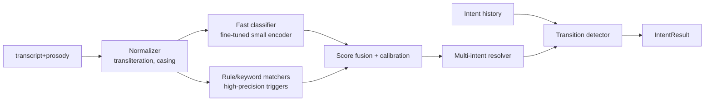

## 3.9 Data Flow

The transcript is normalized (Hinglish transliteration, number-word handling) then scored by two parallel paths: a fine-tuned small encoder classifier (primary) and high-precision rule matchers (for unambiguous triggers like explicit abuse or "wrong number"). Scores are fused and calibrated; the multi-intent resolver applies priority rules; the transition detector compares against history.

## 3.10 Sequence Diagram

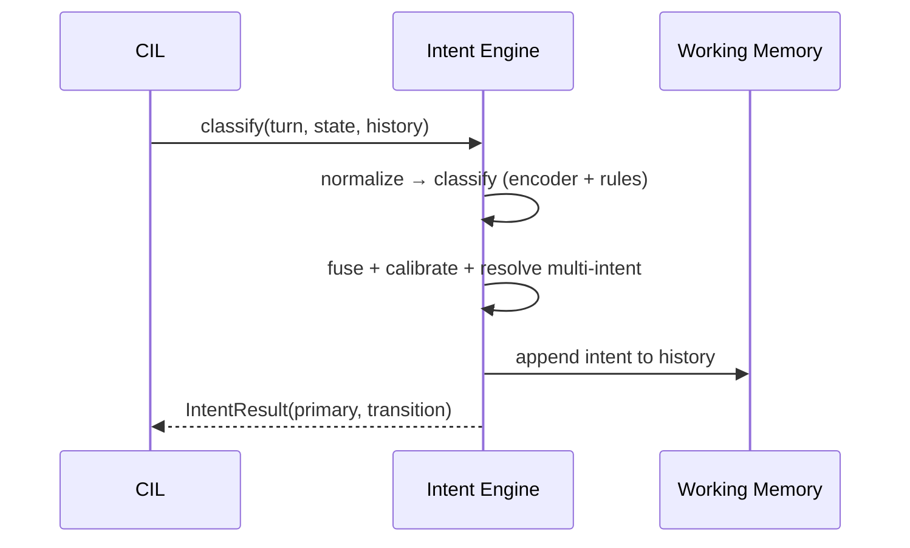

## 3.11 State Diagram — intent transitions (illustrative)

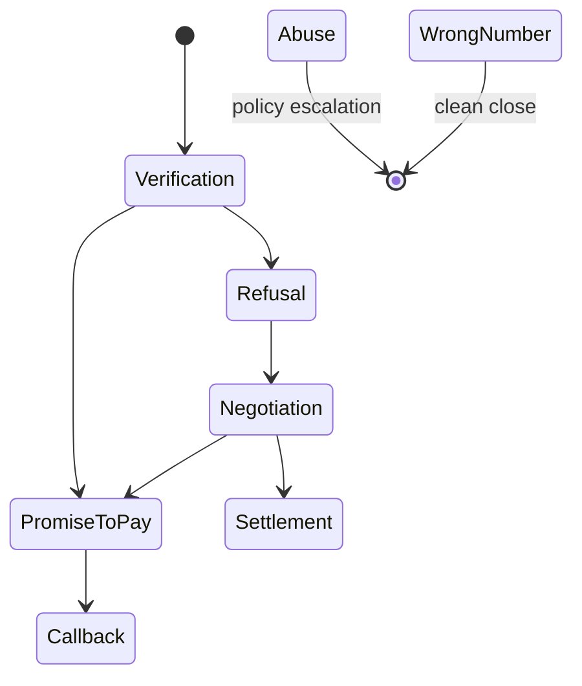

## 3.12 Algorithms

- **Primary classifier:** a fine-tuned multilingual small encoder (e.g., a distilled transformer) with a multi-label head over the intent set: `PAYMENT`, `PROMISE_TO_PAY`, `SETTLEMENT`, `HARDSHIP`, `WRONG_NUMBER`, `ABUSE`, `CALLBACK`, `REFUSAL`, `NEGOTIATION`, `VERIFICATION`, `SILENCE`, `SMALL_TALK`, `OTHER`.
- **Calibration:** temperature scaling fit on a held-out set so confidences are usable as probabilities.
- **Multi-intent resolution:** keep all labels above τ; the **primary** is chosen by a priority lattice, not raw score — safety/compliance-relevant intents (`ABUSE`, `WRONG_NUMBER`, `HARDSHIP`) outrank transactional ones even at slightly lower confidence, because mishandling them is costlier.
- **Transition detection:** a small finite-state model over the intent history flags meaningful shifts (e.g., `REFUSAL→NEGOTIATION` arms the Negotiation Engine).
- **Silence handling:** when `TurnInput` indicates only trailing silence with no transcript, emit `SILENCE` (drives Ch 16 silence recovery).

## 3.13 Prompt Strategy

The Intent Engine is **not** LLM-based on the hot path (latency + determinism). However, the LLM may be used **offline** (Ch 18) to mine new intent patterns and to generate weakly-labeled training data for the encoder. The intent result is injected into the prompt as a structured hint ("caller intent: NEGOTIATION (0.82)") so the LLM's phrasing aligns, but the LLM cannot override the label that planning consumes.

## 3.14 Decision Logic

`primary = argmax over priority_lattice(intents above τ)`. If max confidence < τ_floor → `OTHER`, which routes to clarification (Ch 16) rather than a guessed action. Safety intents short-circuit: `ABUSE`/threat detection immediately raises a risk flag (Ch 6) regardless of downstream planning.

## 3.15 Failure Modes

| Failure | Effect | Handling |
|---|---|---|
| Misclassification | Wrong plan | Calibrated low confidence → clarify instead of act |
| ASR garble | Spurious intent | Rule path requires clean triggers; encoder robust-trained on ASR noise |
| Novel phrasing | `OTHER` | Logged for Learning Layer mining (Ch 18) |

## 3.16 Recovery Strategy

Low-confidence or `OTHER` → Adaptive Conversation Engine (Ch 16) issues a clarification turn; the re-asked answer usually resolves intent. Persistent ambiguity → escalate per policy (Ch 8).

## 3.17 Observability

Per-turn: full intent distribution, chosen primary, calibration bucket, transition events, `OTHER` rate (a key drift signal).

## 3.18 Security Notes

Operates on transcript text; no extra PII surface. Abuse/threat flags are sensitive and routed to compliance logging.

## 3.19 Scalability

Small-encoder inference is cheap and batchable; can run CPU or share a small GPU slice via Vol 1 Ch 7. Stateless per turn.

## 3.20 Future Improvements

- Joint intent+entity model to share encoding.
- Confidence-aware early-exit feeding Ch 21 prediction.
- Per-tenant intent taxonomies.

---
---

# Chapter 4 — Strategy Engine

## 4.1 Purpose

Decide **what should happen next** in the conversation, given the current goal, state, intent, risk, and memory. The Strategy Engine is the planner of Class 2: it selects the next high-level **action** (ask, verify, negotiate, escalate, transfer, close, reassure) that best advances the active goal within all hard constraints.

## 4.2 Responsibilities

- Select the next conversational action from a bounded action space.
- Prioritize among competing objectives (collect vs. comply vs. de-escalate).
- Decide *whether* to hand off to the Negotiation Engine (Ch 5) for a money move.
- Decide when to **stop** (close) or **transfer** (human escalation).

## 4.3 Design Goals

- Deterministic and explainable: every action choice has a traceable reason.
- Constraint-respecting: never selects an action a policy/risk gate forbids.
- Goal-progressing: measurably advances the active goal or de-risks the call.

## 4.4 Non-Goals

- Not the *wording* (LLM) and not the *money math* (Ch 5).
- Not goal selection itself (Ch 7 owns goals; Strategy executes toward the active goal).

## 4.5 Inputs

Active goal (Ch 7), `IntentResult` (Ch 3), conversation state (Ch 12), risk flags + policy constraints (Ch 6/8), emotion/empathy directive (Ch 13/14), working + relationship memory (Ch 9/10).

## 4.6 Outputs

```python
class StrategyAction:
    action: Action            # ASK | VERIFY | NEGOTIATE | REASSURE | ESCALATE | TRANSFER | CLOSE | CONFIRM
    target: Slot | None       # e.g., which field to ask for
    rationale: str            # auditable
    handoff: NegotiationRequest | None
```

## 4.7 Public Interfaces

```python
class StrategyEngine:
    def plan(self, goal: GoalRef, intent: IntentResult, state: ConvState,
             constraints: list[Constraint], risk: list[RiskFlag]) -> StrategyAction: ...
```

## 4.8 Internal Components

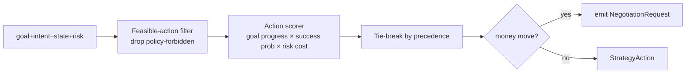

## 4.9 Data Flow

The full action space is filtered to those allowed by current constraints (a forbidden action is simply not a candidate). Remaining actions are scored by expected goal progress, success probability (informed by relationship memory and prediction Ch 21), and risk cost. The top action is selected; if it's a money move, a `NegotiationRequest` is emitted to Ch 5.

## 4.10 Sequence Diagram

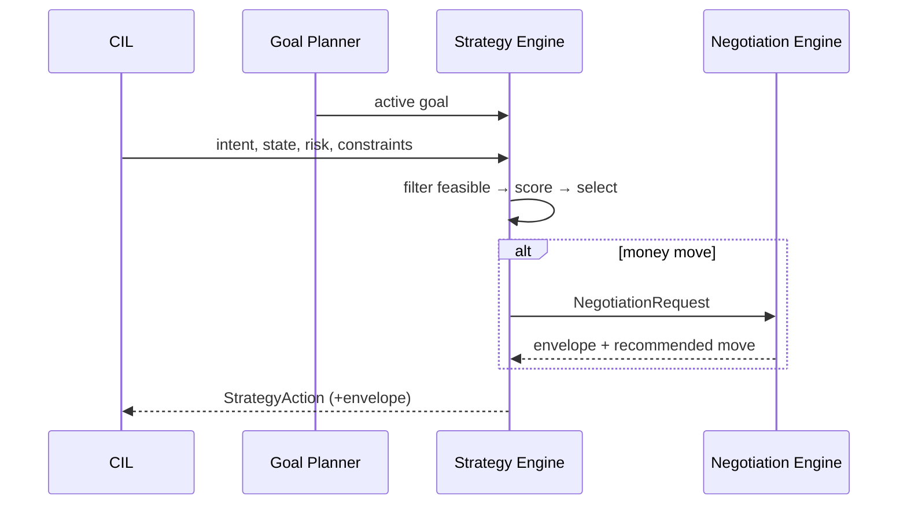

## 4.11 State Diagram

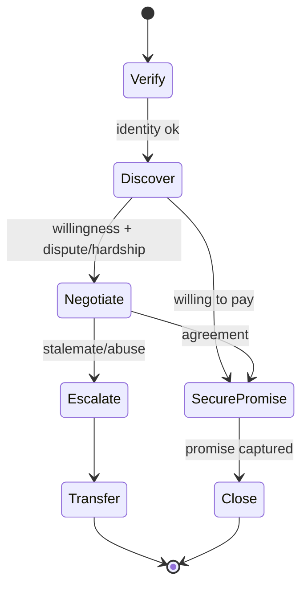

## 4.12 Algorithms

A **constrained utility-maximizing policy** over a small action space:
`score(a) = w_g·goal_progress(a) + w_p·P(success | a, memory) − w_r·risk_cost(a)`, maximized over feasible `a`. Weights are configured per campaign/tenant. Because the action space is tiny and bounded, this is exhaustive enumeration, not search — fully deterministic and sub-millisecond. A **lookahead** variant (depth-2) can be enabled where `P(success)` uses Ch 21 predictions of the customer's likely reply.

## 4.13 Prompt Strategy

The chosen action is injected as a directive in the plan (`strategy.action = ASK target=callback_time`), and Ch 15/19 translate it into a `must_say` obligation ("ask for a specific callback time"). The LLM renders the ask naturally; it cannot substitute a different action.

## 4.14 Decision Logic

Precedence on ties: **de-escalate > comply > verify > collect**. So if the customer is angry (Ch 13) *and* unverified *and* willing to pay, the engine reassures/de-escalates before pushing collection — matching how a skilled human agent behaves and reducing compliance risk.

## 4.15 Failure Modes

| Failure | Effect | Handling |
|---|---|---|
| No feasible action | Dead end | Default to safe CLOSE or TRANSFER |
| Oscillation between actions | Loops | Anti-oscillation: penalize recently-taken actions; loop detector in Ch 16 |
| Over-aggressive collection | Compliance risk | Risk cost term + Ch 6 veto |

## 4.16 Recovery Strategy

Loop/stall detection (Ch 16) forces a strategy change or escalation. If scoring is degenerate (all near-equal), fall to the goal's default action defined by Ch 7.

## 4.17 Observability

Per-turn: candidate actions, scores, chosen action + rationale, precedence applied, oscillation counters.

## 4.18 Security Notes

Pure logic over already-governed inputs; no new data surface. Rationale strings must not embed raw PII.

## 4.19 Scalability

O(|actions|) per turn, trivial. Stateless aside from anti-oscillation counters in working memory.

## 4.20 Future Improvements

- Learned weights via offline policy evaluation on logged calls (Ch 18).
- Deeper, prediction-driven lookahead gated on spare latency.
- Per-segment strategy priors (e.g., early-delinquency vs. chronic).

---
---

# Chapter 5 — Negotiation Engine

## 5.1 Purpose

Own the **money decisions** in a collections call: what partial payment, settlement, promise-to-pay, extension, or callback the agent may offer or accept, within hard financial and regulatory boundaries. The Strategy Engine decides *that* we negotiate; the Negotiation Engine decides *the numbers and the move*.

## 5.2 Responsibilities

- Compute the **negotiation envelope** (floors, ceilings, allowed instruments) from account data + policy.
- Select the next negotiation move (offer, counter, accept, hold, decline) given the customer's position.
- Capture and validate **promise-to-pay** terms (amount, date, channel).
- Enforce that no offer crosses a policy floor or makes an unauthorized commitment.

## 5.3 Design Goals

- **Never** offer beyond authority; the floor is a hard constraint, not a suggestion.
- Maximize expected recovery while respecting hardship and fairness rules.
- Fully auditable: every number traceable to account data + policy + the move algorithm.

## 5.4 Non-Goals

- Not the phrasing of the offer (LLM renders it from the move).
- Not recording the agreement to systems of record (Conversation Engine / Vol 1 Ch 10 does, post-validation).

## 5.5 Inputs

`NegotiationRequest` from Ch 4; account facts (balance, DPD, min acceptable, prior settlements) from Memory/Context (Vol 1 Ch 11); policy envelope params (Ch 8); customer position (extracted offer/hardship via Ch 11/3); relationship negotiation style (Ch 9).

## 5.6 Outputs

```python
class Envelope:
    min_acceptable: Money
    settlement_floor_pct: float
    max_extension_days: int
    allowed: set[Instrument]    # PARTIAL | SETTLEMENT | PTP | EXTENSION | CALLBACK
class NegotiationMove:
    move: Move                  # OFFER | COUNTER | ACCEPT | HOLD | DECLINE | PROPOSE_PTP
    instrument: Instrument
    amount: Money | None
    date: Date | None
    envelope: Envelope          # carried for the validator
    rationale: str
```

## 5.7 Public Interfaces

```python
class NegotiationEngine:
    def envelope(self, account: AccountFacts, policy: PolicyParams) -> Envelope: ...
    def next_move(self, req: NegotiationRequest, env: Envelope,
                  customer_pos: CustomerPosition, style: NegStyle) -> NegotiationMove: ...
```

## 5.8 Internal Components

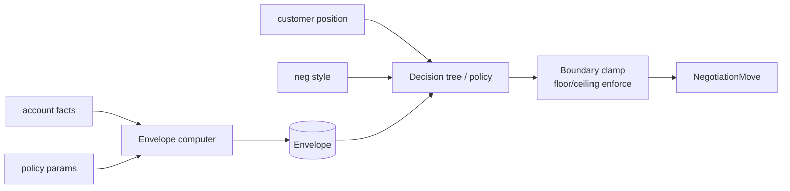

## 5.9 Data Flow

The envelope computer derives hard boundaries from account facts and policy. The decision logic maps the customer's current position (their offer, stated hardship, history) to a move, which is then **clamped** to the envelope — clamping is a separate, non-bypassable step so no path can emit an out-of-bounds number.

## 5.10 Sequence Diagram

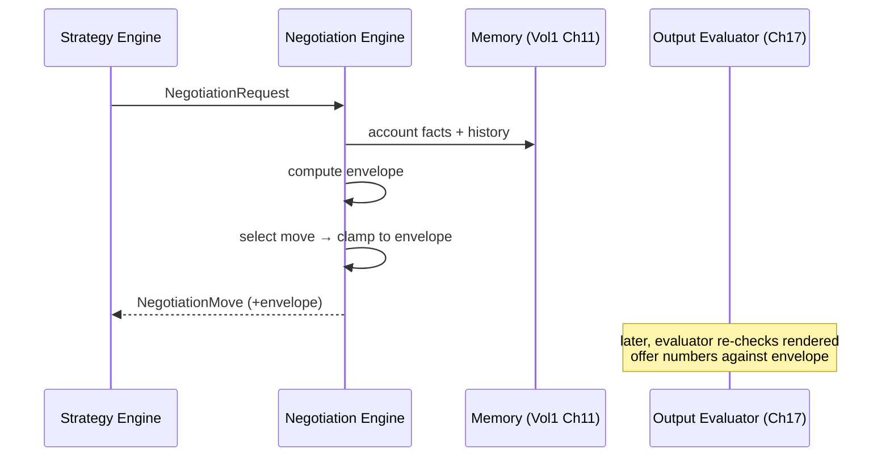

## 5.11 State Diagram — negotiation sub-dialogue

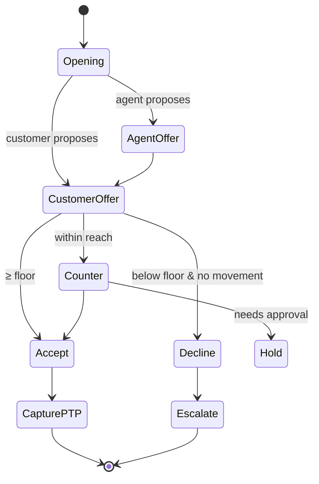

## 5.12 Algorithms

- **Envelope computation:** `min_acceptable = max(policy_floor(account), regulatory_min)`, `settlement_floor = balance × settlement_floor_pct`, instruments filtered by eligibility (e.g., settlement only past a DPD threshold).
- **Move selection:** a **decision tree / tabular policy** keyed on (customer offer vs. floor, hardship flag, attempts so far, relationship style). Example logic: if customer offer ≥ floor → `ACCEPT`; if within `concession_step` of floor → `COUNTER` at midpoint, decaying concession each round; if hardship verified → open `EXTENSION`/`PTP` instruments; if below floor after N rounds → `DECLINE`/`ESCALATE`.
- **Concession schedule:** monotonic, bounded number of concession rounds with shrinking steps to avoid bidding against ourselves; the schedule is policy-configured, not model-driven.
- **Boundary clamp:** final, unconditional `clamp(amount, floor, ceiling)`; if clamping would change an `ACCEPT` into a violation, the move becomes `DECLINE`.

## 5.13 Prompt Strategy

The move is injected as structured facts + obligations: `facts.offer_amount = ₹X`, `must_say = ["offer settlement of ₹X payable by <date>"]`, `must_not_say = ["any amount below floor", "guarantees of waiver not authorized"]`. The LLM phrases it empathetically; it can never originate the number.

## 5.14 Decision Logic

Hard precedence: **regulatory floor > policy floor > recovery maximization**. Hardship, once verified, expands instruments but does **not** lower the regulatory floor. Promise-to-pay capture requires explicit, unambiguous amount + date; ambiguity routes back to a clarification ask (Ch 16) rather than recording a vague promise.

## 5.15 Failure Modes

| Failure | Effect | Handling |
|---|---|---|
| Stale/missing account facts | Wrong envelope | Refuse to negotiate; verify/defer; never guess numbers |
| Customer ambiguous offer | Bad PTP capture | Clarify before commit |
| Model renders unauthorized number | Compliance breach | Output Evaluator re-checks numbers vs. envelope → reject (Ch 17) |
| Concession loop | Erodes recovery | Bounded rounds → escalate |

## 5.16 Recovery Strategy

If account facts are unavailable, the engine returns `HOLD` with a directive to verify/defer ("I'll need to confirm and call you back") — a safe non-commitment. Stalemate → `ESCALATE`/`TRANSFER` per policy.

## 5.17 Observability

Per negotiation: envelope, each move, customer positions, concession round count, final disposition, and a flag if the clamp ever activated (a signal of upstream logic error).

## 5.18 Security Notes

Financial facts are highly sensitive; the engine receives only the minimal fields needed and tags amounts as PII for redaction control (Ch 19). All moves and envelopes are audit-logged immutably for regulatory review.

## 5.19 Scalability

Tabular/tree logic is trivial compute; the cost is the account-facts fetch, which is prefetched (Ch 21) and cached in Working Memory (Ch 10).

## 5.20 Future Improvements

- Offline-learned concession schedules optimized for recovery-vs-goodwill per segment (evaluated via Ch 18/22), always re-clamped to hard floors.
- Affordability-aware offers using (consented) cash-flow signals.
- Multi-instrument bundling (partial now + PTP for remainder) as a first-class move.

---

*End of Vol 2 — Batch 1 (front matter + Chapters 1–5). Batch 2 will cover Ch 6 (Risk Engine) → Ch 11 (Entity Extraction).*
