# VoiceOS v2 — Volume 3

## Reliability & Distributed Systems Architecture

**Status:** Engineering Specification (Living Document)
**Audience:** Principal backend engineers, distributed-systems engineers, SREs, platform engineers, infrastructure architects
**Scope:** Everything required to run the (frozen) Volume 1 runtime and Volume 2 intelligence layer as an enterprise-grade platform: fault tolerance, durability, distribution, scale, recovery, and operations.
**Authority:** Volumes 1 and 2 are **immutable**. Volume 3 does not redesign them; it specifies the reliability substrate beneath and around them.

---

## Relationship to Volumes 1 & 2 (read first)

Volume 1 defined the real-time voice runtime (Media Gateway → … → Audio Output) and its contracts. Volume 2 defined the intelligence layer that turns a `TurnInput` into a sealed, immutable `ResponsePlan`, wrapping every engine output in a `DecisionEnvelope` accumulated into a per-turn **decision lineage**, all under the **Law of Authority** and the **Four-Class Decision Hierarchy**.

Volume 3 takes those as given and answers a different question: *how does this survive thousands of concurrent calls, hardware failures, network partitions, and dependency outages — with zero data loss and graceful recovery?* The load-bearing reuse:

| Vol 1/2 concept | Vol 3 role |
|---|---|
| `DecisionEnvelope` lineage (Vol 2 Ch 15) | The **event-sourced log** of a call; replay source of truth (Ch 3, 6, 7) |
| `ResponsePlan` (immutable, versioned) | A persisted, replayable artifact; never reconstructed differently (Ch 5, 6) |
| Working Memory (Vol 2 Ch 10) | Checkpointed durable runtime state (Ch 6) |
| Relationship Memory (Vol 2 Ch 9) | Durable store with backup/DR (Ch 5, 18) |
| GPU Scheduler (Vol 1 Ch 7) | The arbiter that Vol 3 makes multi-GPU/multi-node and backpressure-aware (Ch 9, 10, 13) |
| Audio offsets / playback checkpoint (Vol 1 Ch 21) | Persisted streaming state for mid-call recovery (Ch 6, 7) |
| Law of Authority | Constrains recovery: replay restores *derived* state; authoritative facts/floors/policy are re-read from systems of record, never reconstructed by inference (Ch 7) |

**Core invariant added by Volume 3:** *every state-changing decision in VoiceOS is an immutable, ordered, replayable event.* Durable state is a fold over events; recovery is deterministic replay; idempotency keys make external effects exactly-once. This is the spine of Chapters 3, 6, 7, and 8.

---

## How to read this document

Each chapter follows the fixed 20-section template:

1. Purpose · 2. Responsibilities · 3. Design Goals · 4. Non-Goals · 5. Inputs · 6. Outputs · 7. Public Interfaces · 8. Internal Components · 9. Data Flow · 10. Component Diagram · 11. Sequence Diagram · 12. Algorithms · 13. Configuration · 14. Performance Targets · 15. Failure Modes · 16. Recovery Strategy · 17. Observability · 18. Security Notes · 19. Scalability · 20. Future Improvements

Interface signatures are typed pseudocode (contracts, not mandated languages). "Node" means a deployable process/host; "service" means a logical component that may be one or many nodes. Latencies are budgets. The reliability targets the platform commits to: **zero data loss of committed events, ≥ 99.95% call-availability, and deterministic recovery** — are justified per-chapter and consolidated in Ch 19/22.

---

## Table of Contents

| # | Chapter | Theme |
|---|---------|-------|
| 1 | Reliability Philosophy | principles |
| 2 | Distributed System Architecture | topology |
| 3 | Event Bus Architecture | event sourcing |
| 4 | Redis Architecture | hot state |
| 5 | Persistent Storage | durable state |
| 6 | State Persistence | checkpointing |
| 7 | Crash Recovery | deterministic replay |
| 8 | Idempotency | exactly-once effects |
| 9 | Concurrency Architecture | execution model |
| 10 | Queue Management | work distribution |
| 11 | Service Discovery | routing |
| 12 | Health Monitoring | probes |
| 13 | Failover Architecture | degradation |
| 14 | Circuit Breakers | resilience |
| 15 | Observability (Metrics) | Prometheus/Grafana |
| 16 | Logging Architecture | structured logs |
| 17 | Tracing | OpenTelemetry |
| 18 | Backup & Disaster Recovery | snapshots/PITR |
| 19 | Performance Engineering | budgets |
| 20 | Stress Testing Framework | chaos/soak |
| 21 | Deployment Architecture | Docker/K8s |
| 22 | Capacity Planning | sizing/cost |
| 23 | Reliability Runbooks | operations |
| 24 | Architecture Decision Records | rationale |

---
---

# Chapter 1 — Reliability Philosophy

## 1.1 Purpose

Establish the reliability principles that govern every later chapter. VoiceOS is a soft-real-time system holding live phone calls: a failure is not an abstract error budget line, it is a human on a call hearing dead air. The philosophy here makes failure a designed-for, recoverable event rather than an exception.

## 1.2 Responsibilities

- Define the non-negotiable reliability invariants (zero committed-event loss, deterministic recovery, graceful degradation).
- Establish event sourcing and immutable events as the durability foundation.
- Define what "available" and "degraded" mean for a real-time voice system.
- Set the ownership and consistency model used platform-wide.

## 1.3 Design Goals

- **Failure as normal:** every component assumes its dependencies will fail and defines its behavior when they do.
- **Zero data loss of committed events:** once an event is acknowledged as committed, it survives any single-node failure.
- **Deterministic recovery:** given the event log, recovered state is identical to pre-failure state (for derived state) — no guessing.
- **Graceful degradation over hard failure:** a degraded call (fallback model, higher latency) beats a dropped call; a clean compliant teardown beats a hang.

## 1.4 Non-Goals

- Not changing any Vol 1/2 behavior; reliability wraps, never alters, the runtime/intelligence semantics.
- Not pursuing strong global consistency where it would break real-time latency; we choose availability + eventual consistency for non-authoritative state (and strong consistency only for authoritative effects, Ch 8).
- Not zero-downtime for *individual in-flight call audio* across a node loss in v2 — we target fast, bounded recovery, and flag true mid-call seamless failover as future (Ch 7/13).

## 1.5 Inputs

The frozen Vol 1 runtime events (call start/stop, audio offsets, STT/TTS lifecycle) and Vol 2 decisions (`DecisionEnvelope` lineage, sealed `ResponsePlan`s, eval verdicts, memory writes).

## 1.6 Outputs

Platform-wide invariants and contracts consumed by all later chapters: the event model (Ch 3), the durability tiers (Ch 4/5/6), the recovery contract (Ch 7), and the degradation policy (Ch 13/14).

## 1.7 Public Interfaces

Philosophy-level; the concrete interfaces appear in their owning chapters. The one cross-cutting contract introduced here:

```python
class Recoverable(Protocol):
    def checkpoint(self) -> Snapshot: ...                 # incremental, cheap
    def restore(self, snapshot: Snapshot, events: EventStream) -> None: ...  # snapshot + replay tail
```

Every stateful service implements `Recoverable`: restore = load last snapshot, replay the event tail.

## 1.8 Internal Components

The reliability stack as layers:

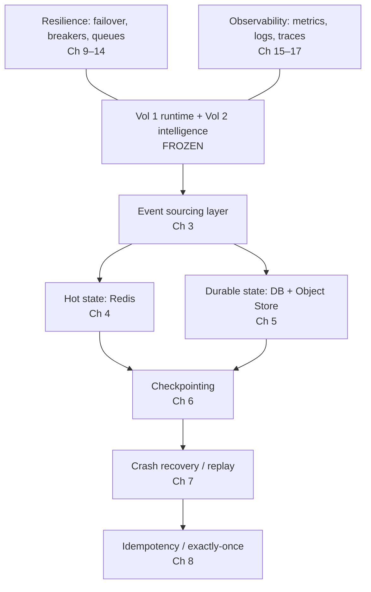

## 1.9 Data Flow

Application actions emit immutable domain events (Ch 3). Events update hot state (Redis, Ch 4) for low-latency reads and are durably appended (Ch 5). Periodic checkpoints (Ch 6) snapshot derived state so replay is bounded. On failure, recovery (Ch 7) restores from snapshot + event tail; idempotency (Ch 8) ensures replayed external effects don't double-fire. Resilience and observability are cross-cutting.

## 1.10 Component Diagram

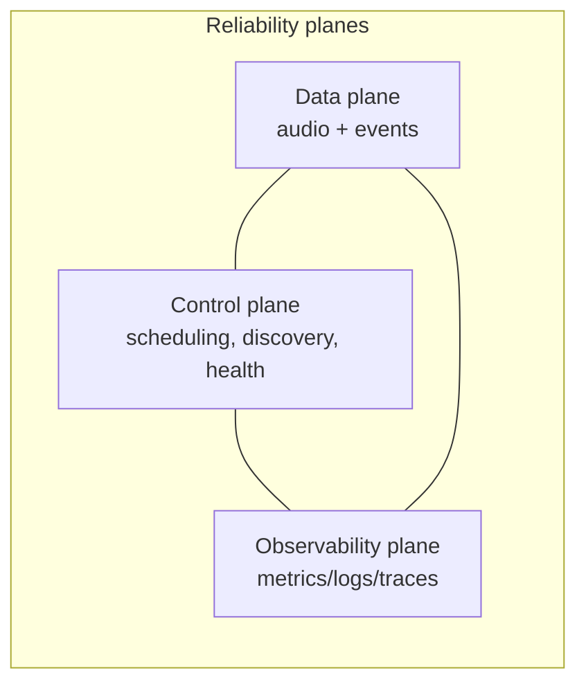

## 1.11 Sequence Diagram — a committed action survives a crash

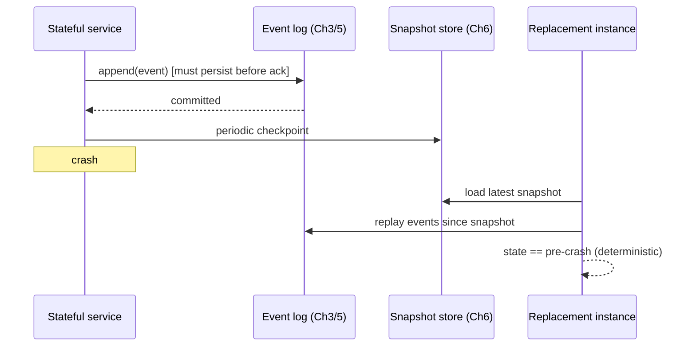

## 1.12 Algorithms

- **Commit-before-act:** no externally-visible effect (speak, record a promise, send a notification) is performed before its causing event is committed to the durable log; this makes replay safe.
- **Snapshot + tail replay:** recovery cost is bounded to (snapshot load + events since last checkpoint), not full history.
- **Degradation ladder:** each dependency defines an ordered fallback chain (primary → degraded → safe-exit); the system always moves down the ladder, never to undefined behavior (Ch 13).

## 1.13 Configuration

```yaml
reliability:
  durability:
    commit_before_act: true
    event_ack: "fsync" | "quorum"
  recovery:
    snapshot_interval_events: 50
    max_replay_events: 5000
  availability_target: 0.9995
  degradation: "ladder"   # never hard-fail a call without a defined step
```

## 1.14 Performance Targets

- Committed-event durability: **0 loss** under any single-node failure.
- Recovery of a call's derived state: **< 2 s** from snapshot + tail (Ch 7 refines).
- Degradation decision (primary→fallback): **< 250 ms** (Ch 13/14).

## 1.15 Failure Modes

| Failure class | Philosophy response |
|---|---|
| Node/process crash | Replay from log; bounded recovery |
| Dependency outage | Degrade down the ladder; never hang |
| Network partition | Favor availability for non-authoritative; fence authoritative effects (Ch 8) |
| Data corruption | Detect via checksums; restore from backup/PITR (Ch 18) |

## 1.16 Recovery Strategy

Deterministic replay is the universal recovery primitive; idempotency the universal safety net for effects; graceful teardown the universal floor when recovery isn't possible within budget. These three appear in every later chapter.

## 1.17 Observability

Reliability is measurable: every invariant has a metric (committed-event loss = 0, recovery time, degradation rate, availability). The observability plane (Ch 15–17) is treated as a first-class subsystem, not an add-on.

## 1.18 Security Notes

Reliability mechanisms touch the most sensitive data (event logs, snapshots, recordings). Encryption, tenant isolation, and retention apply uniformly to durability and recovery artifacts (detailed per chapter). The Law of Authority extends into recovery: authoritative facts are re-fetched from systems of record on replay, never re-derived, so recovery cannot manufacture a fact.

## 1.19 Scalability

Horizontal by default: services are stateless where possible and event-sourced where stateful, so capacity scales by adding nodes. State is sharded by `call_id`/`tenant`; no global lock sits on the hot path.

## 1.20 Future Improvements

- Seamless mid-call audio failover (live media-leg migration) — future (Ch 7/13).
- Multi-region active-active with conflict-free replicated memory.
- Formal verification of the replay-determinism property.

---
---

# Chapter 2 — Distributed System Architecture

## 2.1 Purpose

Define the complete production topology — the node types, data services, networking edges, and how they compose from a single node to multi-region — that hosts the frozen Vol 1/2 application.

## 2.2 Responsibilities

- Enumerate node roles (CPU, GPU, edge/telephony) and their placement.
- Define the data services (Redis, primary DB, object storage, message broker, monitoring) and their roles.
- Define ingress (load balancer, API gateway, telephony gateway) and east-west service communication.
- Specify the deployment tiers: single-node, multi-node, multi-region, and the path to Kubernetes.

## 2.3 Design Goals

- **Separation of CPU and GPU planes:** real-time media/orchestration (CPU) is isolated from model inference (GPU) so each scales and fails independently.
- **Shared-nothing per call:** a call's hot state is owned by one CPU node + Redis shard; no cross-node coordination on the audio path.
- **Topology-portable:** the same components run as one box (dev) or many regions (prod) by config, not redesign.

## 2.4 Non-Goals

- Not prescribing a specific cloud; abstractions (object store, managed DB) are vendor-portable.
- Not the K8s manifests themselves (Ch 21); this chapter defines the logical topology K8s realizes.

## 2.5 Inputs

Carrier media (Vol 1 Media Gateway), client/API requests, model artifacts (Qwen/Whisper/Veena), configuration.

## 2.6 Outputs

A running platform: telephony in/out, durable data, observability signals.

## 2.7 Public Interfaces

```python
class NodeRole(Enum): EDGE; CPU_WORKER; GPU_WORKER; DATA; CONTROL; OBSERVABILITY
class ServiceEndpoint:
    name: str; role: NodeRole; address: Address; capabilities: set[Capability]
```

## 2.8 Internal Components

Roles and the services they host:
- **Edge nodes:** Load Balancer (L4/L7), API Gateway, Telephony Gateway (Vol 1 Media Gateway adapters: Twilio WS / SIP / WebRTC).
- **CPU worker nodes:** the media plane (Vol 1 Ch 3–6, 21–22), the intelligence orchestration (Vol 2 deterministic engines), event publishing, checkpointing.
- **GPU worker nodes:** STT (Whisper), LLM (Qwen/vLLM), TTS (Veena), governed by the GPU Scheduler (Vol 1 Ch 7).
- **Data services:** Redis (hot state, Ch 4), primary DB (Postgres for relational/authoritative + MongoDB for document/lineage, Ch 5), Object Storage (recordings, snapshots, backups), Message Broker / event log (Ch 3).
- **Control plane:** service discovery (Ch 11), health (Ch 12), config.
- **Observability plane:** Prometheus, Grafana, log store, tracing collector (Ch 15–17).

## 2.9 Data Flow

Carrier → Edge (LB → Telephony Gateway) → a CPU worker that owns the call session. The CPU worker runs the media + orchestration loop, calling GPU workers (via the scheduler) for STT/LLM/TTS, reading/writing Redis hot state, emitting events to the broker/log, and checkpointing to durable storage. Audio returns CPU → Telephony Gateway → carrier.

## 2.10 Component Diagram

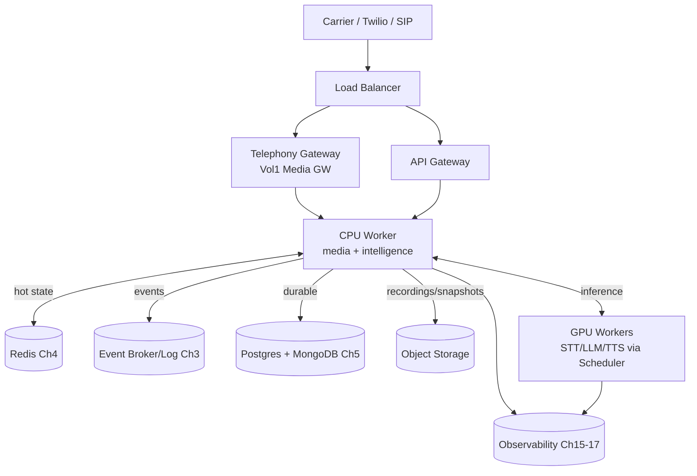

## 2.11 Sequence Diagram — call placement

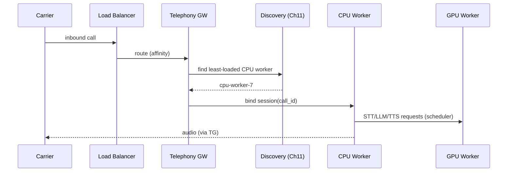

## 2.12 Algorithms

- **Call routing:** the Telephony Gateway routes a new call to a CPU worker selected by the discovery/health service using least-active-calls + capability + locality; the chosen worker becomes the call's owner (session affinity).
- **CPU/GPU decoupling:** CPU workers never block on GPU; requests go through the scheduler's async queue (Vol 1 Ch 7, extended in Ch 9/10).
- **Region selection:** multi-region routing pins a call to the region nearest the carrier PoP; cross-region is only for async replication (memory, backups), never the audio path.

## 2.13 Configuration

```yaml
topology:
  tier: single | multi_node | multi_region
  edge: { lb: l7, telephony: [twilio, sip], api_gateway: true }
  cpu_workers: { min: 4, max: 200, calls_per_node: 250 }
  gpu_workers: { stt: 2, llm: 4, tts: 2, scheduler: shared }
  data: { redis: cluster, db: {postgres: ha, mongo: replicaset}, object_store: s3_compatible }
  regions: [ "ap-south-1", "ap-south-2" ]
```

## 2.14 Performance Targets

- Call placement (inbound → bound worker): **< 150 ms**.
- East-west CPU→GPU request overhead (excl. inference): **< 5 ms** intra-AZ.
- No audio-path cross-region hop (hard constraint).

## 2.15 Failure Modes

| Failure | Effect | Handling |
|---|---|---|
| CPU worker down | Its calls drop | Recovery (Ch 7); LB stops routing to it (Ch 12) |
| GPU worker down | Inference unavailable on it | Scheduler reroutes; failover (Ch 13) |
| Data service down | State unavailable | Failover/replica (Ch 4/5/13) |
| Edge/LB down | Ingress loss | Redundant LB; health-checked (Ch 12) |
| Region down | Regional outage | Multi-region routing + DR (Ch 18) |

## 2.16 Recovery Strategy

Each tier has redundancy (N+1 edges, worker pools, HA data services). Lost workers are replaced and their recoverable calls restored (Ch 7); routing avoids unhealthy nodes (Ch 11/12). Regional failure triggers DR procedures (Ch 18).

## 2.17 Observability

Per-node role metrics (calls, utilization), topology-level dashboards (calls per region/node, GPU saturation), and discovery/health state. Detailed in Ch 15.

## 2.18 Security Notes

Network segmentation: edge (public) ↔ CPU (private) ↔ GPU/data (most restricted). mTLS east-west, TLS/SRTP at the edge. Tenant isolation enforced from the gateway down. Secrets via a managed secret store, never in images/config.

## 2.19 Scalability

CPU workers scale with concurrent calls (≈250/node design point, Ch 22); GPU workers scale with inference load; data services scale by sharding/replication. Multi-region scales geographically with per-region full stacks.

## 2.20 Future Improvements

- Full Kubernetes operator-managed deployment (Ch 21).
- Active-active multi-region with replicated hot state.
- GPU disaggregation (separate STT/LLM/TTS pools auto-scaled independently).

---
---

# Chapter 3 — Event Bus Architecture

## 3.1 Purpose

Define the internal event-driven backbone: the immutable **domain events** that record every state change, their contracts and versioning, ordering and delivery guarantees, replay, dead-lettering, and auditing. This is the durability and recovery foundation (Ch 6/7) and the integration seam between Vol 1 runtime events and Vol 2 decisions.

## 3.2 Responsibilities

- Define the domain event schema and the canonical event taxonomy.
- Guarantee ordering (per call) and delivery (at-least-once) with idempotent consumers (Ch 8).
- Provide durable append + replay (the event log) and pub/sub fan-out to consumers.
- Manage versioning, dead-letter queues (DLQ), and an immutable audit trail.

## 3.3 Design Goals

- **Immutable, ordered, replayable:** the per-call event stream is the source of truth for derived state.
- **Per-call total order; cross-call parallelism:** strict ordering within a `call_id`, none required across calls (enables sharding).
- **Contract-stable & versioned:** events evolve additively; old consumers tolerate new fields.

## 3.4 Non-Goals

- Not a general analytics pipeline (events feed it, but BI is downstream).
- Not authoritative for external financial truth — events *record* that a promise was captured; the system of record commits it (Ch 8).

## 3.5 Inputs

State-changing actions from Vol 1 (call lifecycle, audio offsets, STT/TTS lifecycle) and Vol 2 (`DecisionEnvelope`s, sealed `ResponsePlan`s, eval verdicts, memory writes).

## 3.6 Outputs

Durable, ordered event streams; pub/sub notifications; DLQ entries; the audit log.

## 3.7 Public Interfaces

```python
class DomainEvent:
    event_id: ULID                 # globally unique, time-ordered
    type: EventType                # see taxonomy
    schema_version: str
    call_id: CallId
    tenant: TenantId
    seq: int                       # per-call monotonic sequence
    occurred_at: Timestamp
    correlation_id: str            # the turn/request
    causation_id: str | None       # the event that caused this one
    payload: dict                  # typed per event
class EventBus:
    def append(self, ev: DomainEvent) -> CommitToken: ...     # durable, ordered
    def subscribe(self, types: set[EventType], group: str) -> Iterator[DomainEvent]: ...
    def replay(self, call_id: CallId, from_seq: int = 0) -> Iterator[DomainEvent]: ...
    def dlq(self, ev: DomainEvent, reason: str) -> None: ...
```

## 3.8 Internal Components

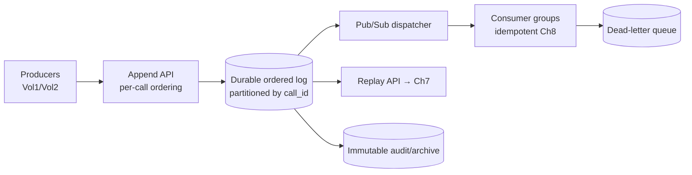

## 3.9 Data Flow

Producers append events keyed by `call_id`; the log assigns/validates the per-call `seq` and durably persists before acknowledging (commit-before-act, Ch 1). The dispatcher fans events to consumer groups (state updaters, projections, observability). Consumers are idempotent; poison messages go to the DLQ. The replay API serves recovery (Ch 7); the log is archived immutably for audit.

## 3.10 Component Diagram

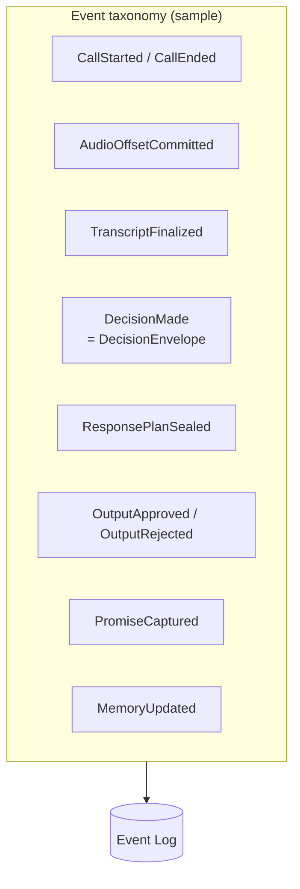

`DecisionMade` carries a Vol 2 `DecisionEnvelope` as payload; `ResponsePlanSealed` carries the sealed plan id + hash. Thus the Vol 2 lineage **is** the event stream — no parallel structure.

## 3.11 Sequence Diagram — turn events

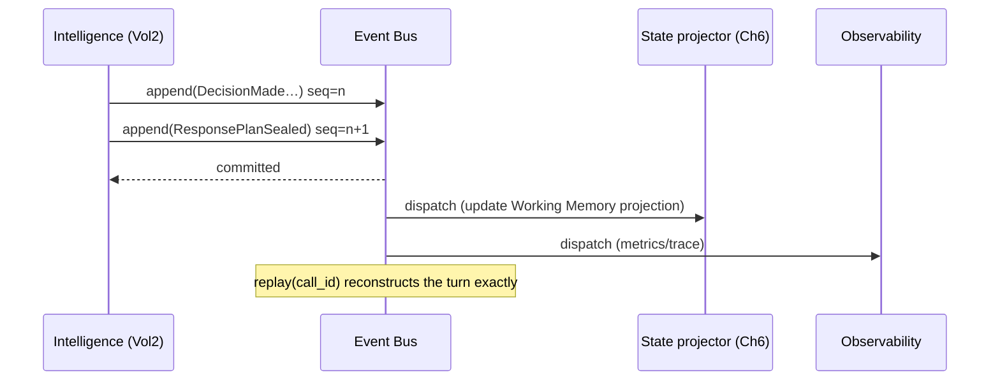

## 3.12 Algorithms

- **Per-call ordering:** events partition by `call_id`; within a partition `seq` is a gap-free monotonic counter (optimistic check on append; conflict → retry with next seq).
- **Delivery:** at-least-once with consumer-side idempotency (Ch 8) via `event_id` dedup — simpler and more robust than exactly-once delivery.
- **Versioning:** additive schema evolution; an `upcaster` transforms old event versions to current on read, so replay across schema changes stays deterministic.
- **DLQ policy:** after N processing failures, route to DLQ with full context; DLQ is monitored and replayable after fix.
- **Causation/correlation:** `correlation_id` = turn; `causation_id` links cause→effect, enabling exact lineage reconstruction (and Vol 2 explainability over the wire).

## 3.13 Configuration

```yaml
event_bus:
  backend: redis_streams | kafka         # see ADR Ch24
  partition_key: call_id
  durability: quorum_ack
  delivery: at_least_once
  dlq: { max_retries: 5, ttl_days: 14 }
  retention: { hot_days: 7, archive_days: 2555 }   # 7y audit for regulated events
  schema_registry: true
```

## 3.14 Performance Targets

- Append commit latency: **< 5 ms** p99 (hot path emits events synchronously before acting on regulated effects).
- Dispatch fan-out lag: **< 50 ms** p99 for observability consumers.
- Replay throughput: **≥ 10k events/s** per call-shard for fast recovery.

## 3.15 Failure Modes

| Failure | Effect | Handling |
|---|---|---|
| Log node down | Append blocked on shard | Quorum/replica failover (Ch 13) |
| Consumer lag | Stale projections | Backpressure + scale consumers (Ch 9/10) |
| Poison event | Consumer stuck | DLQ after retries |
| Schema mismatch | Consumer error | Upcaster; reject unknown major versions |

## 3.16 Recovery Strategy

The event log is itself replicated (quorum); a lost consumer resumes from its committed offset (at-least-once + idempotency makes reprocessing safe). Recovery of application state is replay (Ch 7). DLQ entries are fixed and re-injected.

## 3.17 Observability

Per stream: append rate, commit latency, partition lag, consumer-group offsets, DLQ depth, replay rate. Event-flow health is a top-line reliability dashboard.

## 3.18 Security Notes

Events contain PII (transcripts, amounts, decisions): encrypted at rest, tenant-partitioned, field-level redaction for non-privileged consumers. Regulated events (`PromiseCaptured`, consent, disclosures) are retained per compliance (years) in immutable, access-controlled archive — this is the legal audit trail.

## 3.19 Scalability

Partitioned by `call_id` → linear horizontal scale; cross-call parallelism is unbounded. Consumer groups scale independently. Hot vs archive tiers bound cost.

## 3.20 Future Improvements

- Exactly-once consumer transactions where a backend supports them (reduce idempotency burden).
- Streaming projections materialized incrementally for sub-ms recovery.
- Cross-region event replication for active-active (Ch 18).

---
---

# Chapter 4 — Redis Architecture

## 4.1 Purpose

Define Redis's role as the **hot-state** tier: low-latency, ephemeral-but-recoverable state that the real-time path reads/writes every turn — conversation/session state, locks, rate limits, presence, streaming buffers, and pub/sub — and, crucially, **what does not belong in Redis**.

## 4.2 Responsibilities

- Hold per-call hot state (current `ConvState`, Working-Memory projection, audio offsets) for fast access.
- Provide distributed **locks** (single-owner per call), **rate limiting**, **presence/heartbeats**, and short-lived **streaming buffers**.
- Back the event bus (Redis Streams) and pub/sub where configured (Ch 3).
- Enforce **TTL discipline** so Redis never becomes a system of record.

## 4.3 Design Goals

- Sub-millisecond hot reads/writes on the turn path.
- **Recoverable, not authoritative:** Redis is a cache/coordination layer; its loss must be survivable via the event log + durable store.
- Bounded memory via TTLs and explicit eviction policy.

## 4.4 Non-Goals

- **Not** durable storage of authoritative data (promises, payments, customer records — those are Ch 5).
- Not long-term memory (Relationship Memory persists in the DB; Redis only caches it).
- Not large blobs (recordings/snapshots → object storage).

## 4.5 Inputs

Hot-state writes from the call owner (CPU worker), lock/rate/presence requests, stream appends.

## 4.6 Outputs

Fast reads of hot state; lock grants; rate decisions; pub/sub messages; stream entries.

## 4.7 Public Interfaces

```python
class HotState:
    def get_session(self, call_id: CallId) -> SessionState | None: ...
    def put_session(self, call_id: CallId, s: SessionState, ttl_s: int) -> None: ...
    def acquire_lock(self, key: str, owner: NodeId, ttl_ms: int) -> bool: ...   # single-owner
    def release_lock(self, key: str, owner: NodeId) -> None: ...
    def rate_limit(self, key: str, limit: int, window_s: int) -> bool: ...
    def heartbeat(self, node: NodeId, ttl_s: int) -> None: ...
```

## 4.8 Internal Components

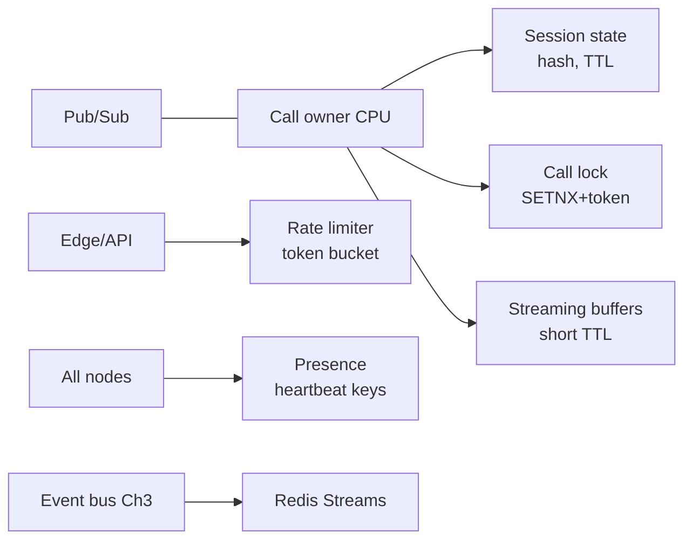

## 4.9 Data Flow

The call owner keeps the call's hot session in a Redis hash with a sliding TTL refreshed each turn; it holds a per-call lock (fencing token) to guarantee single ownership. Rate limiters guard ingress and per-tenant quotas. Presence keys track node liveness. Streaming buffers hold transient partials/audio chunks with short TTLs. All of this is reconstructable from the event log if Redis is lost.

## 4.10 Component Diagram

```mermaid
flowchart TB
    subgraph Redis["Redis (cluster)"]
        H[Hot session state]
        L[Locks + fencing tokens]
        R[Rate limits]
        P[Presence/heartbeats]
        S[Streams (events) Ch3]
        B[Streaming buffers]
    end
    DUR[(Durable DB Ch5)] -. rehydrate on miss .-> H
    LOG[(Event log Ch3)] -. replay rebuilds .-> H
```

## 4.11 Sequence Diagram — single-owner with fencing

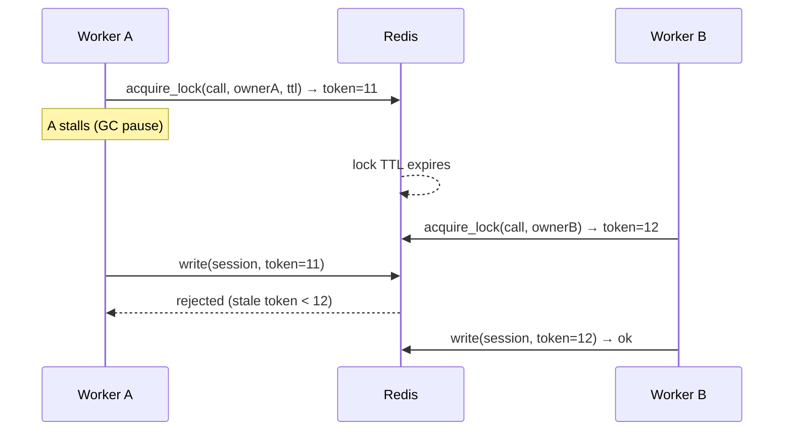

## 4.12 Algorithms

- **Distributed lock with fencing:** `SET key owner NX PX ttl` + a monotonically increasing fencing token; writers must present the current token, so a stalled old owner cannot corrupt state after takeover (the classic Redlock-fencing fix).
- **TTL strategy:** every hot key has a TTL; session TTL is refreshed per turn (sliding), buffers get short TTLs, locks get short TTLs with owner-side renewal. TTLs guarantee automatic cleanup on crashes.
- **Rate limiting:** token-bucket via atomic Lua scripts for ingress, per-tenant, and per-dependency (protecting GPUs).
- **Cache-aside:** on a hot-state miss (e.g., Redis restart), rehydrate from durable store + event replay, then repopulate.
- **Presence:** heartbeat keys with TTL; absence = node considered down (feeds discovery/health Ch 11/12).

## 4.13 Configuration

```yaml
redis:
  mode: cluster
  persistence: aof_everysec      # AOF for crash-survivable hot tier
  maxmemory_policy: volatile-ttl
  ttl:
    session_s: 120
    lock_ms: 5000
    buffer_s: 10
    presence_s: 6
  rate_limits:
    ingress_per_tenant_rps: 200
    gpu_admission_rps: tuned
```

## 4.14 Performance Targets

- Hot get/put: **< 1 ms** p99 intra-AZ.
- Lock acquire: **< 2 ms** p99.
- Rehydrate-on-miss (rebuild a call's hot state): **< 1.5 s** (bounded replay, Ch 7).

## 4.15 Failure Modes

| Failure | Effect | Handling |
|---|---|---|
| Redis node down | Hot state slice unavailable | Cluster failover; rehydrate from log/DB |
| Full Redis restart | All hot state lost | Cache-aside rebuild from event log (Ch 7) — survivable by design |
| Lock TTL too short | Premature takeover | Owner-side renewal; fencing prevents corruption |
| Memory pressure | Evictions | volatile-ttl policy; size per Ch 22 |

## 4.16 Recovery Strategy

Because Redis is explicitly non-authoritative, its loss degrades latency (rehydration) but never loses committed data — the event log + durable store are the truth. Cluster failover handles single-node loss; full loss triggers mass rehydration throttled to protect the DB.

## 4.17 Observability

Hit/miss rate, memory, evictions, command latency, lock contention, rate-limit rejections, stream lag. Redis health feeds failover (Ch 13).

## 4.18 Security Notes

Hot state contains PII; Redis is in the private network, TLS-enabled, AUTH/ACL per service, tenant-namespaced keys. No durable secrets in Redis. AOF files are encrypted at rest.

## 4.19 Scalability

Redis Cluster shards by key (call_id hash-tag) → linear scale with calls. Rate-limit and presence keys are lightweight. Streams scale per Ch 3.

## 4.20 Future Improvements

- Redis-on-flash / tiering for cheaper large hot sets.
- Client-side caching for read-hot config.
- CRDT-based session replication for cross-region hot state (Ch 18).

---
---

# Chapter 5 — Persistent Storage

## 5.1 Purpose

Define the durable storage tier — the systems of record for customer data, conversation history, `DecisionEnvelope`/`ResponsePlan` history, metrics, audit logs, and call metadata — including schemas, indexing, and retention. This is where authoritative truth lives (Law of Authority) and where the event log is materialized for query.

## 5.2 Responsibilities

- Persist authoritative relational data (customers, accounts, promises, consent) in Postgres.
- Persist document/append-heavy data (lineage, sealed plans, transcripts, call metadata) in MongoDB.
- Materialize event-sourced projections for query; store audit logs immutably.
- Define schemas, indexes, partitioning, and retention/erasure policies (incl. DPDP).

## 5.3 Design Goals

- **Right store for the shape:** strong-consistency relational for authoritative effects; document store for high-volume append-mostly lineage.
- **Auditable & reproducible:** every plan/decision retrievable by id with its versions and provenance.
- **Compliant retention:** per-data-class retention, legal hold, and right-to-erasure.

## 5.4 Non-Goals

- Not hot-path state (Ch 4) and not large binaries (recordings/snapshots → object storage, referenced by URI).
- Not analytics warehouse (fed downstream from the event log).

## 5.5 Inputs

Committed events (Ch 3) projected to tables/collections; direct authoritative writes (promise capture, consent) under idempotency (Ch 8).

## 5.6 Outputs

Queryable durable records; audit exports; retention/erasure actions.

## 5.7 Public Interfaces

```python
class DurableStore:
    def commit_authoritative(self, rec: AuthoritativeRecord, idem: IdempotencyKey) -> CommitResult: ...
    def upsert_projection(self, proj: Projection) -> None: ...     # from events
    def get_plan(self, plan_id: PlanId) -> ResponsePlan: ...
    def get_lineage(self, call_id: CallId) -> list[DecisionEnvelope]: ...
    def query(self, spec: QuerySpec) -> Page: ...
```

## 5.8 Internal Components

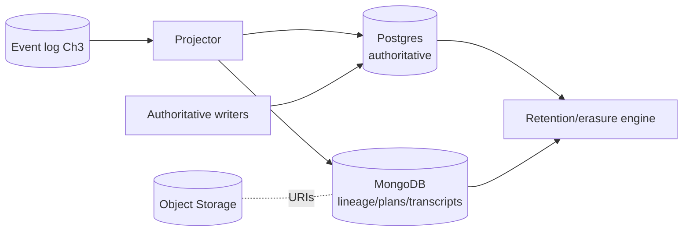

## 5.9 Data Flow

Committed events are projected by a consumer into query-optimized tables (Postgres) and collections (MongoDB). Authoritative effects (promise/consent/payment intent) are written transactionally to Postgres under an idempotency key. Large blobs live in object storage; the DB stores URIs + metadata. A retention engine ages/erases data per policy.

## 5.10 Component Diagram

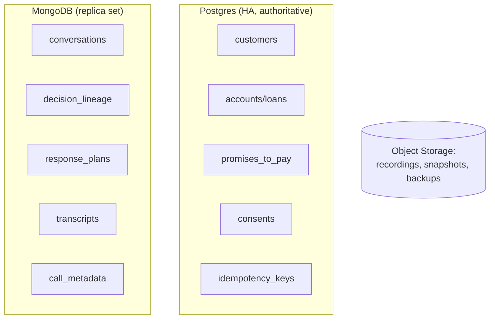

## 5.11 Sequence Diagram — authoritative write + projection

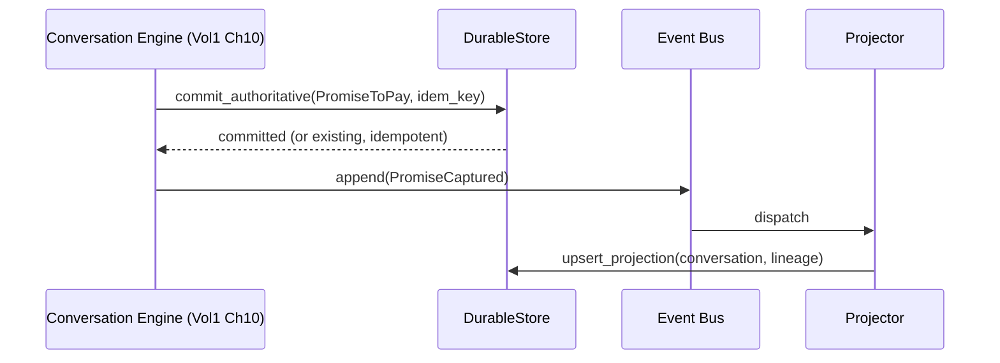

## 5.12 Algorithms / Schemas

- **Authoritative (Postgres) — selected schemas:**
  - `customers(customer_id PK, tenant_id, name_enc, phone_enc, lang_pref, created_at, …)`
  - `accounts(account_id PK, customer_id FK, balance, dpd, status, …)`
  - `promises_to_pay(ptp_id PK, account_id FK, amount, due_date, channel, captured_call_id, idem_key UNIQUE, status, created_at)`
  - `consents(consent_id PK, customer_id FK, type, granted_at, call_id, expires_at)`
  - `idempotency_keys(key PK, scope, result_ref, created_at, ttl)`
- **Document (MongoDB) — selected collections:**
  - `decision_lineage{ call_id, turn_index, envelopes:[DecisionEnvelope], plan_id }` (the persisted Vol 2 lineage)
  - `response_plans{ plan_id, call_id, turn_index, plan, policy_version, sealed_at }` (immutable)
  - `transcripts{ call_id, turns:[{role, text, ts}] }`
  - `call_metadata{ call_id, tenant, started_at, ended_at, disposition, region }`
- **Indexing:** Postgres B-tree on PKs/FKs + `promises_to_pay(idem_key)` unique; partial indexes on `status`. Mongo compound indexes on `{call_id, turn_index}`, `{tenant, started_at}`; TTL indexes for retention-limited collections.
- **Partitioning:** time-partition high-volume tables/collections (by month) for cheap retention drops; shard Mongo by `call_id`.
- **Retention/erasure:** per-class TTL; regulated records (promises, consent, disclosures) retained for the compliance window (e.g., 7y) under legal-hold awareness; DPDP right-to-erasure removes/【tombstones】PII while preserving non-PII audit aggregates.

## 5.13 Configuration

```yaml
storage:
  postgres: { ha: true, sync_replicas: 1, pitr: true }
  mongodb: { replica_set: 3, read_pref: primaryPreferred }
  retention:
    transcripts_days: 180
    lineage_days: 365
    plans_days: 365
    promises_years: 7
    recordings_days: 90
  erasure: { dpdp_right_to_erasure: true }
```

## 5.14 Performance Targets

- Authoritative commit (Postgres, sync replica): **< 20 ms** p99.
- Lineage/plan upsert (Mongo): **< 15 ms** p99 (off the audio path, async from events).
- Plan/lineage point-read: **< 10 ms** p99.

## 5.15 Failure Modes

| Failure | Effect | Handling |
|---|---|---|
| Postgres primary down | Authoritative writes blocked | Sync-replica failover (Ch 13); writes fence (Ch 8) |
| Mongo primary down | Projection writes lag | Replica-set election; projector resumes from offset |
| Projection lag | Stale query views | Reads can fall back to event replay for a call |
| Disk full / corruption | Data risk | Quotas, checksums, PITR restore (Ch 18) |

## 5.16 Recovery Strategy

Authoritative data uses synchronous replication + PITR (Ch 18); document projections are rebuildable by replaying the event log (they are derived, not primary). Lost projections are simply re-projected — the event log is the truth, consistent with Ch 1/3.

## 5.17 Observability

Write/read latencies, replication lag, projection lag, storage growth vs forecast (Ch 22), retention-job results, erasure audits. Replication lag is a failover trigger (Ch 13).

## 5.18 Security Notes

PII columns encrypted (app-level + at-rest); strict tenant scoping on every query; access audited. Authoritative and audit data have the strongest controls. Erasure honors DPDP while preserving immutable regulated audit (resolved via PII tombstoning, keeping the event of record without the personal data where law permits).

## 5.19 Scalability

Postgres scales via read replicas + partitioning (authoritative write volume is modest — only real effects); MongoDB scales via sharding for the high-volume lineage/transcripts. Object storage is effectively unbounded.

## 5.20 Future Improvements

- CDC from Postgres into the event log for unified change streams.
- Columnar offload of historical lineage for analytics.
- Per-tenant encryption keys (BYOK) and crypto-shredding for erasure.

---

---
---

# Chapter 6 — State Persistence

## 6.1 Purpose

Make a live call's runtime state **durable and recoverable** without compromising the real-time path: persist call state, Working Memory, active goals/strategy, the sealed `ResponsePlan`, audio offsets, pending STT/TTS, and streaming state via cheap incremental checkpoints plus the event log, so any instance can restore a call deterministically (Vol 1 `Recoverable`, Appendix E).

## 6.2 Responsibilities

- Implement `Recoverable` (Vol 1) for every stateful call component: `checkpoint()` → `Snapshot`, `restore(snapshot, events)`.
- Persist **derived** runtime state incrementally (snapshot + event tail) so replay is bounded (Ch 1/7).
- Capture the **played-offset checkpoint** (Vol 1 Ch 21) and streaming pipeline state (Vol 1 Ch 18) for mid-call recovery.
- Keep persistence **off the media thread** (RI-1) and never let it stall the call.

## 6.3 Design Goals

- **Bounded recovery:** restore = last snapshot + replay since its `seq` (≤ `snapshot_interval` events).
- **Cheap, incremental:** checkpoints are small deltas, not full dumps, written async.
- **Authority-safe:** snapshots hold *derived* state only; authoritative facts are re-read from the system of record on restore (RI-5).

## 6.4 Non-Goals

- Not authoritative effect storage (Ch 5 owns promises/consent) and not blobs (object storage).
- Not the recovery orchestration itself (Ch 7) — this chapter produces the artifacts recovery consumes.

## 6.5 Inputs

Per-turn state mutations (Working Memory writes Vol 2 Ch 10, goal/strategy/state transitions Vol 2 Ch 7/12, sealed plans Vol 2 Ch 15), audio offsets (Vol 1 Ch 21), pending STT/TTS request state (Vol 1 Ch 8/17/18).

## 6.6 Outputs

```python
class Snapshot:
    call_id: CallId; seq: int                 # event seq this snapshot reflects
    conv_state: ConvState                     # Vol1 Ch10 / Vol2 Ch12
    working_memory: WorkingMemory             # Vol2 Ch10 (bounded)
    goal_state: GoalState; strategy: StrategyAction | None
    last_plan_id: PlanId | None
    audio_offset: PlayedOffset                # Vol1 Ch21
    pending: PendingIO                        # in-flight STT/TTS request ids/state
    streaming_state: StreamingState           # Vol1 Ch18 buffers (metadata, not audio)
    taken_at: Timestamp
```

## 6.7 Public Interfaces

```python
class StatePersistence:
    def checkpoint(self, call_id: CallId) -> Snapshot: ...           # incremental, async write
    def load_latest(self, call_id: CallId) -> Snapshot | None: ...
    def restore(self, snap: Snapshot, tail: EventStream) -> CallState: ...
    def on_event(self, ev: DomainEvent) -> None: ...                 # triggers interval checkpoint
```

## 6.8 Internal Components

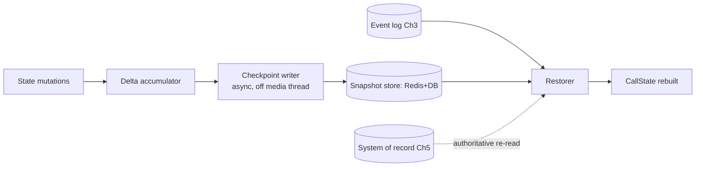

## 6.9 Data Flow

State mutations accumulate as deltas; every `snapshot_interval` events (or on key transitions), the checkpoint writer asynchronously persists a `Snapshot` (Redis for hot/fast, DB for durable). On restore, the latest snapshot is loaded and the event tail since its `seq` is replayed to reach the exact pre-failure derived state; authoritative facts are re-fetched from the SoR (never replayed from inference) per RI-5.

## 6.10 Component Diagram

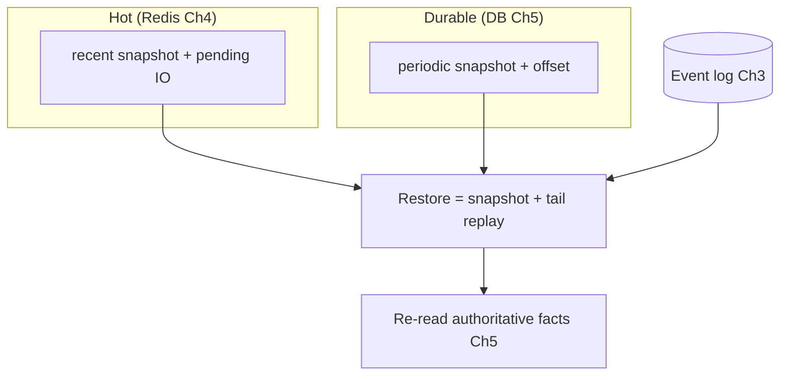

## 6.11 Sequence Diagram

```mermaid
sequenceDiagram
    participant CIL as Runtime (Vol1/2)
    participant SP as State Persistence
    participant SNAP as Snapshot store
    participant LOG as Event log (Ch3)
    CIL->>SP: on_event(seq=n)
    alt interval reached
        SP->>SNAP: checkpoint(snapshot@n) [async]
    end
    Note over CIL: crash
    SP->>SNAP: load_latest → snapshot@k
    SP->>LOG: replay seq>k
    SP->>SP: rebuild derived state; re-read authoritative facts
    SP-->>CIL: CallState restored (== pre-crash)
```

## 6.12 Algorithms

- **Incremental checkpointing:** snapshot every `N` events; between snapshots, recovery replays ≤ `N` events — trading snapshot frequency (write cost) against replay length (recovery time). Key transitions (verification, PTP capture, escalation) force an immediate checkpoint.
- **Delta encoding:** snapshots store Working-Memory deltas + current state, not full history (Working Memory is already bounded, Vol 2 Ch 10).
- **Pending-IO capture:** in-flight STT/TTS request ids + positions are recorded so recovery can re-issue or resume them (Ch 7).
- **Authority re-read on restore (RI-5):** the restorer fetches account facts/consent fresh from the SoR (Ch 5) rather than trusting snapshot copies, so recovery cannot resurrect a stale or fabricated fact.

## 6.13 Configuration

```yaml
state_persistence:
  snapshot_interval_events: 50
  force_checkpoint_on: [verified, ptp_captured, escalated]
  hot_store: redis
  durable_store: db
  reread_authoritative_on_restore: true
```

## 6.14 Performance Targets

- Checkpoint write (async): **< 10 ms**, never on the media thread.
- Restore (snapshot + ≤50-event tail): **< 2 s** (Ch 7 budget).
- Added latency to the live path from persistence: **~0** (async).

## 6.15 Failure Modes

| Failure | Detection | Effect |
|---|---|---|
| Snapshot store down | write error | Fall back to event-log-only replay (slower) |
| Snapshot stale | seq gap | Replay longer tail; still correct |
| Pending-IO lost | missing in snapshot | Re-issue STT/TTS on restore (Ch 7) |
| Authoritative re-read fails | SoR down | Defer/verify; never proceed on guessed facts (RI-5) |

## 6.16 Recovery Strategy

Snapshots are an optimization over pure event replay; if snapshots are unavailable, recovery replays from the last durable snapshot or from the call's event origin (bounded by retention). Authoritative facts always come from the SoR on restore. Detailed orchestration is Ch 7.

## 6.17 Observability

Checkpoint frequency/latency, snapshot size, replay tail length distribution, restore time, authoritative re-read success. Restore time is the headline recovery SLO (Ch 7/19).

## 6.18 Security Notes

Snapshots contain PII (Working Memory, plans); encrypted at rest, tenant-scoped, TTL'd in the hot store, retained per policy in durable. Audio is never in snapshots (only offsets/metadata). Erasure (DPDP) cascades to snapshots (Ch 5/18).

## 6.19 Scalability

Per-call snapshots are small; sharded by `call_id`. Async writes amortize cost. Scales with concurrent calls; the binding resource is snapshot-store IOPS (sized in Ch 22).

## 6.20 Future Improvements

- Continuous (per-turn) micro-checkpoints for sub-second recovery.
- Copy-on-write snapshots to cut write amplification.
- Live state replication to a standby for seamless mid-call failover (Ch 7/13).

---
---

# Chapter 7 — Crash Recovery

## 7.1 Purpose

Define how VoiceOS deterministically recovers from every class of failure — CPU/GPU crash, Redis/DB restart, Twilio/carrier reconnect, network partition, process restart, node failure — using **snapshot + event-tail replay** (Ch 6) and **idempotent effects** (Ch 8), restoring derived state exactly while re-reading authoritative facts (RI-5) and never double-acting (RI-4).

## 7.2 Responsibilities

- Detect failures and orchestrate recovery per failure class.
- Restore a call's derived state via `restore(snapshot, tail)` (Ch 6) on a replacement instance.
- Re-establish external legs (carrier reconnect) and re-issue pending inference (STT/TTS) where possible.
- Guarantee **exactly-once external effects** across replay via idempotency (Ch 8).

## 7.3 Design Goals

- **Deterministic replay:** recovered derived state is identical to pre-failure.
- **Bounded recovery time:** < 2 s for a call's derived state (Ch 6).
- **No double effects:** replayed promises/notifications never re-fire (RI-4 + Ch 8).

## 7.4 Non-Goals

- Not seamless *mid-call audio* continuity across a node loss in v2 (flagged future, Ch 1/13) — v2 targets fast bounded recovery, and clean teardown when recovery can't complete in budget.
- Not the in-call degradation ladders (Vol 1 Ch 24) — this is durable crash recovery.

## 7.5 Inputs

Failure signals (health Ch 12, presence Ch 4), the latest `Snapshot` (Ch 6), the event tail (Ch 3), idempotency state (Ch 8), carrier reconnect events (Vol 1 Ch 3/4).

## 7.6 Outputs

A restored, running call (or a clean, logged teardown); recovery telemetry.

## 7.7 Public Interfaces

```python
class RecoveryOrchestrator:
    def on_failure(self, f: FailureSignal) -> RecoveryPlan: ...
    def recover_call(self, call_id: CallId, target: NodeId) -> RecoveryResult: ...
    def reattach_leg(self, call_id: CallId, leg: LegInfo) -> bool: ...   # carrier reconnect
```

## 7.8 Internal Components

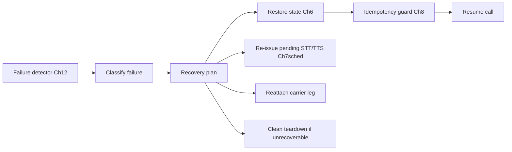

## 7.9 Data Flow

A failure is detected and classified; a recovery plan selects actions. For a CPU-worker loss, a replacement restores the call's derived state (snapshot + tail), re-reads authoritative facts, re-issues pending inference, and reattaches the carrier leg if within the reconnect window. The idempotency guard ensures replayed effects don't duplicate. If the media leg is gone or recovery exceeds budget, the call is torn down cleanly with a logged reason.

## 7.10 Component Diagram

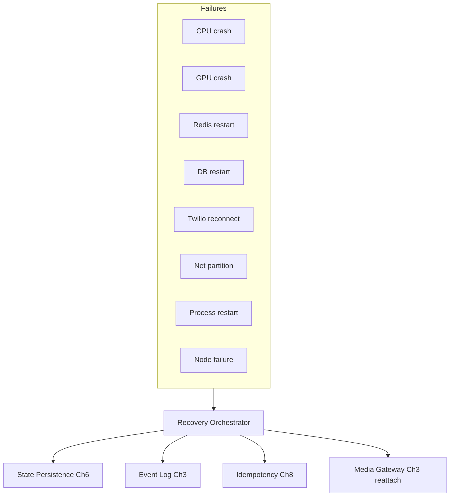

## 7.11 Sequence Diagram — CPU worker recovery

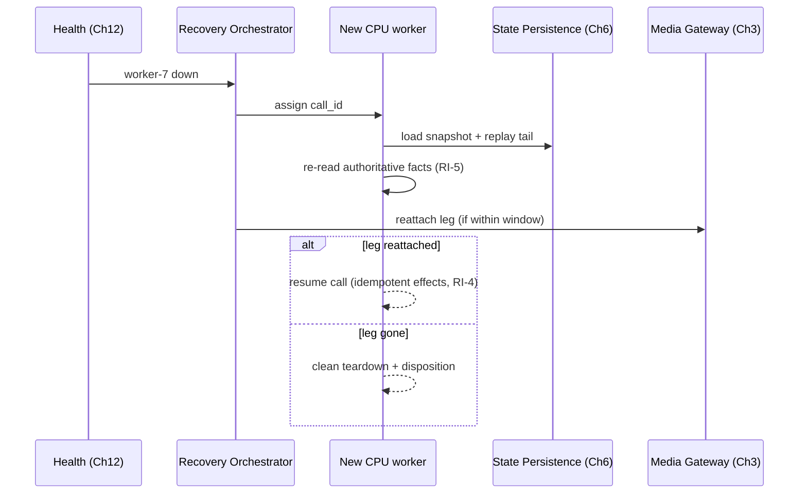

## 7.12 Algorithms

- **Failure-class playbooks:**
  - *CPU crash / process / node failure:* restore call on a healthy worker (Ch 6); reattach leg if possible.
  - *GPU crash:* reroute inference to another GPU/executor (Vol 1 Ch 7 / Ch 13 failover); in-flight requests fail and are re-issued or fall back.
  - *Redis restart:* rehydrate hot state from durable + event replay (Vol 3 Ch 4 cache-aside).
  - *DB restart:* failover to replica (Ch 5/13); projections resume from offset.
  - *Twilio/carrier reconnect:* honor the resume window, reattach to the existing session (Vol 1 Ch 3).
  - *Network partition:* fence authoritative effects (Ch 8) to prevent split-brain double-commit; favor availability for non-authoritative reads.
- **Deterministic replay:** replay is pure over derived state; non-deterministic inputs (model outputs) are *recorded as events* (the `DecisionEnvelope` lineage, Ch 3), so replay reuses recorded decisions rather than re-inferring — this is what makes recovery deterministic despite a stochastic LLM.
- **Idempotent resume (RI-4):** every external effect carries an idempotency key (Ch 8); replay re-executes effects but the key dedups, so no promise/notification double-fires.

## 7.13 Configuration

```yaml
crash_recovery:
  recover_call_budget_ms: 2000
  carrier_reconnect_window_ms: 5000
  gpu_failover: reroute
  redis_recovery: cache_aside_rebuild
  db_failover: replica
  partition_policy: fence_authoritative
```

## 7.14 Performance Targets

- Derived-state restore: **< 2 s**.
- Carrier reattach (within window): **< 500 ms**.
- Double-effect rate after recovery: **0** (idempotency).

## 7.15 Failure Modes

| Failure | Effect | Handling |
|---|---|---|
| Leg lost during recovery | Can't resume audio | Clean teardown + disposition |
| Snapshot + log both unavailable | Can't restore | Teardown; alert (data-integrity incident, Ch 18) |
| Split-brain (partition) | Double-commit risk | Fence authoritative writes (Ch 8) |
| Replay non-determinism | Divergent state | Recorded decisions in event log eliminate it |

## 7.16 Recovery Strategy

Recovery itself is the strategy; its floor is a clean, compliant teardown with a logged `HangupReason` (Vol 1 Ch 24) when a call cannot be restored in budget or its media leg is gone. Data-integrity failures (no snapshot/log) escalate to DR (Ch 18).

## 7.17 Observability

Recovery counts by failure class, restore time, reattach success rate, double-effect rate (must be 0), teardown-on-recovery rate. These are core reliability SLOs (Ch 19).

## 7.18 Security Notes

Recovery touches snapshots/events/PII; same encryption/tenant-scope/audit as Ch 5/6. Reattachment re-validates the carrier session to prevent hijack. Fencing tokens (Ch 4/8) prevent a recovered-from instance from acting after takeover.

## 7.19 Scalability

Recovery work is per-call and parallel; mass-failure (node loss) recovery is throttled to protect the DB/SoR during snapshot rehydration. Standby pools size per Ch 22.

## 7.20 Future Improvements

- **Seamless mid-call failover:** live state replication + media-leg migration so a node loss doesn't drop in-flight audio (future).
- Predictive evacuation (drain a degrading node before it fails).
- Cross-region call recovery (Ch 18).

---
---

# Chapter 8 — Idempotency

## 8.1 Purpose

Guarantee **exactly-once external effects** despite at-least-once event delivery (Ch 3), retries, and recovery replay (Ch 7): no duplicate calls, payments, promises-to-pay, callbacks, escalations, or notifications. Idempotency is the safety net that makes commit-before-act (RI-4) and deterministic replay safe.

## 8.2 Responsibilities

- Define idempotency keys for every external/authoritative effect.
- Provide a durable dedup store so a repeated effect returns the prior result instead of re-executing.
- Provide replay protection and message dedup (`event_id`) for consumers (Ch 3).
- Fence authoritative writes under partition/takeover (Ch 4/7).

## 8.3 Design Goals

- **Exactly-once effects** even under retries, replay, and partition.
- **Deterministic keys:** the same logical effect always maps to the same key.
- Low overhead on the hot path.

## 8.4 Non-Goals

- Not exactly-once *delivery* (we use at-least-once + idempotency — simpler/robuster, ADR Ch 24).
- Not business validation (Vol 1 Ch 10 decides *whether* to capture a promise; idempotency ensures it's captured once).

## 8.5 Inputs

Effect requests (capture PTP, send notification, schedule callback, escalate, initiate payment) each with a derivable idempotency key; consumer messages with `event_id`.

## 8.6 Outputs

```python
class IdempotencyKey:
    scope: EffectScope          # PTP | PAYMENT | CALLBACK | ESCALATION | NOTIFICATION | CALL
    natural_key: str            # deterministic from inputs (e.g., call_id+turn+account)
class IdemResult:
    status: Literal["EXECUTED","DEDUP_HIT"]
    result_ref: Ref
```

## 8.7 Public Interfaces

```python
class IdempotencyGuard:
    def execute_once(self, key: IdempotencyKey, op: Callable[[], Ref]) -> IdemResult: ...
    def seen(self, event_id: ULID) -> bool: ...                 # consumer dedup
    def fence(self, call_id: CallId, token: int) -> bool: ...   # reject stale-owner writes
```

## 8.8 Internal Components

```mermaid
flowchart LR
    REQ[effect request] --> KEY[Key derivation<br/>deterministic]
    KEY --> STORE{key seen?}
    STORE -- no --> EXEC[execute op] --> REC[record key+result]
    STORE -- yes --> HIT[return prior result]
    EVID[event_id] --> DEDUP[Consumer dedup set]
    FENCE[fencing token Ch4] --> GUARD[Write fence]
```

## 8.9 Data Flow

Before executing an effect, the guard derives its deterministic key and checks the durable dedup store (the `idempotency_keys` table, Vol 3 Ch 5). If unseen, it executes and records (key → result) **atomically** with the effect; if seen, it returns the prior result without re-executing. Consumers dedup by `event_id`. Authoritative writes additionally present a fencing token so a stale prior owner cannot write after takeover (Ch 4/7).

## 8.10 Component Diagram

```mermaid
flowchart TB
    subgraph Guard["Idempotency Guard"]
        K[Key derivation]
        D[(Dedup store: idempotency_keys Ch5)]
        F[Fencing check Ch4]
    end
    CE[Conversation Engine Ch10] --> Guard
    NOTIF[Notification sender] --> Guard
    PAY[Payment initiator] --> Guard
    Guard --> EFFECT[(External effect committed once)]
```

## 8.11 Sequence Diagram

```mermaid
sequenceDiagram
    participant CE as Conversation Engine (Vol1 Ch10)
    participant IG as Idempotency Guard
    participant DB as Dedup store (Ch5)
    CE->>IG: execute_once(PTP key, op)
    IG->>DB: insert key if absent (atomic)
    alt new
        DB-->>IG: inserted
        IG->>IG: run op (commit PTP)
        IG-->>CE: EXECUTED(ref)
    else replay/duplicate
        DB-->>IG: exists
        IG-->>CE: DEDUP_HIT(prior ref)
    end
```

## 8.12 Algorithms

- **Deterministic key derivation:** e.g., PTP key = `hash(account_id, call_id, turn_index)`; notification key = `hash(call_id, template_id, recipient)`. The same logical action always yields the same key, so replay/retry collide on it.
- **Atomic execute-and-record:** the effect and its key insertion are committed in one transaction (Postgres, Ch 5) so a crash between executing and recording can't create a duplicate (either both happen or neither).
- **Consumer dedup:** an `event_id` set (TTL'd) makes at-least-once consumers idempotent (Ch 3).
- **Fencing:** monotonically increasing per-call token (Ch 4); writes from a token lower than current are rejected — prevents a paused-then-resumed old owner from double-committing after takeover (Ch 7).

## 8.13 Configuration

```yaml
idempotency:
  key_ttl_days: 30
  event_dedup_ttl_hours: 48
  atomic_with_effect: true
  fencing: true
```

## 8.14 Performance Targets

- `execute_once` overhead: **< 10 ms** (one indexed upsert).
- Duplicate effect rate: **0**.
- Dedup check: **< 2 ms**.

## 8.15 Failure Modes

| Failure | Effect | Handling |
|---|---|---|
| Dedup store down | Can't guarantee once | Block authoritative effect (fail closed) until restored |
| Key collision (bad derivation) | Wrong dedup | Deterministic, scoped keys + tests |
| Non-atomic record | Duplicate window | Transactional execute+record (Ch 5) |
| Stale-owner write | Double-commit | Fencing token rejects it |

## 8.16 Recovery Strategy

Because keys are durable and atomic with effects, recovery/replay (Ch 7) re-runs effects safely — duplicates become `DEDUP_HIT`s returning the original result. If the dedup store is unavailable, authoritative effects fail closed (defer) rather than risk a duplicate payment/promise.

## 8.17 Observability

Dedup hit rate (a proxy for retries/replays), duplicate-effect rate (must be 0), fencing rejections, key-store latency. A nonzero duplicate rate is a sev incident.

## 8.18 Security Notes

The `idempotency_keys` table gates money-moving effects; access-controlled, tenant-scoped, audited. Keys avoid embedding raw PII (use hashed identifiers). Fencing is a security control against split-brain double-spend.

## 8.19 Scalability

Single indexed upsert per effect; effect volume is modest (only real actions). The dedup set (events) is higher volume but TTL'd and shardable. Scales easily.

## 8.20 Future Improvements

- Exactly-once consumer transactions where the broker supports them (reduce the dedup set).
- Idempotency for outbound third-party calls (payment gateways) with provider keys.
- Sagas/compensation for multi-step effects (partial-payment + remainder PTP).

---
---

# Chapter 9 — Concurrency Architecture

## 9.1 Purpose

Define the execution model that runs **thousands of simultaneous calls** safely and efficiently on shared CPU/GPU resources: thread ownership, async orchestration, resource isolation, GPU scheduling, queue prioritization, fair scheduling, and backpressure — all consistent with the Vol 1 runtime invariants (RI-1/2/3).

## 9.2 Responsibilities

- Provide the per-call concurrency model (media thread + cognition/delivery workers + GPU pool).
- Enforce thread safety via single-writer state and message passing (RI-2), not shared locks on the hot path.
- Isolate resources per call/tenant and apply fair scheduling + backpressure under load.
- Integrate the GPU Scheduler (Vol 1 Ch 7) as the inference arbiter.

## 9.3 Design Goals

- **Scale to thousands of calls/node-pool** without head-of-line blocking.
- **Real-time safety:** the media thread never blocks (RI-1).
- **Fairness + backpressure:** no call or tenant starves others; overload sheds gracefully.

## 9.4 Non-Goals

- Not GPU admission internals (Vol 1 Ch 7) and not queue data structures (Ch 10) — this composes them.
- Not cluster scheduling (Ch 11 routing + Vol 3 Ch 2 topology).

## 9.5 Inputs

Per-call work (media frames, turn events), inference requests, load signals (queue depths, GPU spare-capacity Vol 1 Ch 7).

## 9.6 Outputs

Executed work under fairness/backpressure; admission/shed decisions; isolation guarantees.

## 9.7 Public Interfaces

```python
class ConcurrencyRuntime:
    def spawn_call(self, call_id: CallId) -> CallExecutor: ...   # media thread + worker handles
    def submit(self, task: Task, prio: Priority) -> Future: ...  # cognition/delivery work
    def backpressure(self, queue: QueueId) -> Pressure: ...
class CallExecutor:                                              # per call
    media_thread: ThreadHandle
    cognition: AsyncRuntime
    delivery: AsyncRuntime
```

## 9.8 Internal Components

```mermaid
flowchart LR
    subgraph PerCall["Per-call executor"]
        MT[Media thread RI-1]
        CW[Cognition async]
        DW[Delivery async]
    end
    MT -- bounded queue --> CW
    CW -- bounded queue --> DW
    DW -- bounded queue --> MT
    GPOOL[GPU pool via Scheduler Ch7-Vol1]
    CW --> GPOOL
    DW --> GPOOL
    SHED[Load shedder / fair scheduler] --- GPOOL
```

## 9.9 Data Flow

Each call gets a real-time media thread plus async cognition/delivery work, communicating only through bounded queues (RI-2/RI-3). CPU-bound deterministic work runs on worker pools; inference goes to the GPU pool via the scheduler (Vol 1 Ch 7), which applies fair-share + priority. Backpressure from any saturated queue throttles its producer (e.g., playback backpressure throttles the LLM token pull, Vol 1 Ch 18). Under sustained overload, the shedder drops speculative/low-priority work first.

## 9.10 Component Diagram

```mermaid
flowchart TB
    LB[Ingress Ch2] --> SPAWN[spawn_call per call]
    SPAWN --> EX[CallExecutor pool]
    EX --> CPU[(CPU worker pools)]
    EX --> GPU[(GPU Scheduler Ch7-Vol1)]
    LOAD[Load signals] --> FAIR[Fair scheduler + shedder]
    FAIR --> CPU
    FAIR --> GPU
```

## 9.11 Sequence Diagram — backpressure under load

```mermaid
sequenceDiagram
    participant DW as Delivery worker
    participant PB as Playback (Vol1 Ch21)
    participant LLM as LLM pull (Vol1 Ch13/18)
    PB->>DW: audio buffer high-water
    DW->>LLM: pause token pull (backpressure)
    Note over LLM: KV holds generation state (cheap pause)
    PB->>DW: buffer low-water
    DW->>LLM: resume token pull
```

## 9.12 Algorithms

- **Thread model:** one real-time media thread per call (shared timer wheel, not timer-per-call); async cognition/delivery tasks on shared worker pools; the GPU pool arbitrated by the scheduler (Vol 1 Ch 7).
- **Single-writer safety (RI-2):** each call-state object is owned by one task; concurrency bugs are designed out by message passing, not locks.
- **Fair scheduling:** weighted fair-share across calls/tenants on both CPU pools and the GPU scheduler so no call monopolizes; per-tenant quotas (Vol 3 Ch 4 rate limits).
- **Backpressure (RI-3):** every queue is bounded; high-water marks throttle producers (the LLM pull pause is the canonical example, Vol 1 Ch 18); this bounds memory and prevents collapse.
- **Load shedding:** under overload, shed in order: speculative work (Vol 2 Ch 21) → low-priority tasks → reject new calls at ingress (admission control) — never crash, never starve in-flight calls.

## 9.13 Configuration

```yaml
concurrency:
  calls_per_cpu_node: 250
  cognition_pool_threads: tuned
  delivery_pool_threads: tuned
  fair_share: weighted
  per_tenant_quota: true
  shed_order: [speculative, low_priority, new_calls]
  shared_timer_wheel: true
```

## 9.14 Performance Targets

- Sustained: **thousands of concurrent calls** across the pool (≈250/CPU node, Ch 22).
- Media-thread jitter: bounded (RI-1; no blocking).
- Graceful behavior at 100%+ load (shed, not collapse).

## 9.15 Failure Modes

| Failure | Effect | Handling |
|---|---|---|
| Overload | Latency/queue growth | Fair-share + shed (speculative first) |
| Hot tenant | Starves others | Per-tenant quotas/rate limits |
| Media-thread stall | Audio glitch | RI-1 forbids blocking; offending work is async by design |
| Queue unbounded | OOM | RI-3: all queues bounded |

## 9.16 Recovery Strategy

Overload self-corrects via shedding + admission control; once load drops, shed classes (speculative) re-enable. Per-call failures are isolated (one call's crash doesn't take the node — RI-2 isolation) and recovered per Ch 7.

## 9.17 Observability

Per-pool queue depths/wait, GPU fair-share, per-tenant utilization, backpressure events, shed counts, media-thread jitter. Backpressure/shed rates are key load indicators (Ch 19/22).

## 9.18 Security Notes

Per-call/tenant isolation prevents cross-tenant interference and resource-exhaustion attacks; per-tenant rate limits (Vol 3 Ch 4) are a DoS control. No shared mutable state across tenants.

## 9.19 Scalability

Horizontal: add CPU workers for more calls, GPU workers for more inference; fair-share keeps utilization high without starvation. The model is the basis for Ch 22 capacity math.

## 9.20 Future Improvements

- Work-stealing across worker pools for better tail latency.
- Priority inheritance for latency-critical chains (endpoint→STT→TTS).
- Adaptive per-tenant quotas from historical load.

---
---

# Chapter 10 — Queue Management

## 10.1 Purpose

Specify the queueing fabric that decouples producers from consumers across the platform: work queues, GPU queues, retry queues, delayed queues, priority queues, and dead-letter queues — with the retry, backoff, and DLQ policies that make at-least-once processing safe and bounded.

## 10.2 Responsibilities

- Provide bounded, typed queues for each work class with defined overflow policy (RI-3).
- Implement priority and delayed scheduling, retry with backoff, and DLQ routing.
- Integrate with the GPU Scheduler queues (Vol 1 Ch 7) and the event bus DLQ (Vol 3 Ch 3).
- Enforce idempotent consumption (Ch 8) so retries are safe.

## 10.3 Design Goals

- **Bounded & backpressured** (RI-3): no queue grows without limit.
- **Safe retries:** bounded attempts, exponential backoff + jitter, then DLQ.
- **Priority-correct:** latency-critical work preempts bulk.

## 10.4 Non-Goals

- Not the GPU admission policy (Vol 1 Ch 7) — it consumes the GPU queue abstraction.
- Not business retry semantics (idempotency Ch 8 makes retries safe; this owns the mechanics).

## 10.5 Inputs

Tasks/messages from producers (turn work, inference, notifications, projections), each with class, priority, and optional delay/deadline.

## 10.6 Outputs

Ordered, prioritized delivery to consumers; retries; DLQ entries; queue telemetry.

## 10.7 Public Interfaces

```python
class QueueManager:
    def enqueue(self, q: QueueId, msg: Message, prio: Priority = NORMAL, delay_ms: int = 0) -> None: ...
    def consume(self, q: QueueId, group: str) -> Iterator[Message]: ...
    def retry(self, msg: Message, policy: RetryPolicy) -> None: ...
    def dead_letter(self, msg: Message, reason: str) -> None: ...
```

## 10.8 Internal Components

```mermaid
flowchart LR
    P[Producers] --> PRI[Priority queues]
    P --> DLY[Delayed queue<br/>time-wheel]
    PRI --> CONS[Consumers<br/>idempotent Ch8]
    DLY --> PRI
    CONS -- fail --> RETRY[Retry queue<br/>backoff+jitter]
    RETRY --> PRI
    RETRY -- max attempts --> DLQ[(Dead-letter queue)]
    GPUQ[GPU queues Ch7-Vol1] --- PRI
```

## 10.9 Data Flow

Producers enqueue typed messages with priority/delay. Priority queues serve consumers (idempotent, Ch 8); delayed messages wait in a time-wheel until due. A failed message goes to the retry queue with exponential backoff + jitter; after `max_attempts` it is dead-lettered with full context for inspection and later replay. GPU work uses the scheduler's queues (Vol 1 Ch 7) under the same priority semantics.

## 10.10 Component Diagram

```mermaid
flowchart TB
    subgraph Queues
        WQ[Work queues]
        GQ[GPU queues Ch7-Vol1]
        RQ[Retry queues]
        DQ[Delayed queues]
        PQ[Priority lanes]
        DL[(DLQ)]
    end
    PROD[Producers] --> Queues
    Queues --> CONS[Consumers]
    CONS --> DL
```

## 10.11 Sequence Diagram — retry → DLQ

```mermaid
sequenceDiagram
    participant C as Consumer
    participant Q as Queue Manager
    participant DLQ as Dead-letter
    C->>Q: process(msg) fails
    Q->>Q: retry attempt 1 (backoff 100ms+jitter)
    C->>Q: fails
    Q->>Q: retry attempt 2 (200ms)
    C->>Q: fails (max attempts)
    Q->>DLQ: dead_letter(msg, reason, context)
    Note over DLQ: monitored; replayable after fix
```

## 10.12 Algorithms

- **Priority lanes:** strict priority with fair-share within a lane; latency-critical (turn/inference) > bulk (projections/notifications). Starvation avoided via aging.
- **Delayed queue:** a time-wheel (or sorted set, Vol 3 Ch 4 Redis) releases messages at their due time (callbacks, scheduled retries).
- **Retry policy:** exponential backoff with jitter, capped attempts; `next_delay = min(base · 2^attempt, cap) ± jitter`. Idempotency (Ch 8) makes retries side-effect-safe.
- **DLQ:** after max attempts, route to DLQ with the message, error, and stack/context; DLQ depth is alarmed; entries are fixable and re-injectable.
- **Overflow (RI-3):** bounded queues; overflow policy per class — backpressure (turn work), shed (speculative), or block-with-alarm (authoritative).

## 10.13 Configuration

```yaml
queues:
  classes:
    turn:        { priority: high,   bounded: 10000, overflow: backpressure }
    inference:   { priority: high,   via: gpu_scheduler }
    notification:{ priority: normal, retry: {max: 5, base_ms: 200, cap_ms: 30000} }
    projection:  { priority: low,    bounded: 50000, overflow: backpressure }
  delayed: { backend: redis_zset }
  dlq: { max_retries: 5, ttl_days: 14, alarm_depth: 100 }
```

## 10.14 Performance Targets

- Enqueue/dequeue overhead: **< 2 ms**.
- Priority inversion: none (aging-bounded).
- DLQ rate: **< 0.1%** of messages (higher = systemic issue).

## 10.15 Failure Modes

| Failure | Effect | Handling |
|---|---|---|
| Poison message | Consumer stuck | Retry cap → DLQ |
| Queue overflow | Backpressure/loss | Bounded + per-class overflow policy |
| Retry storm | Load amplification | Backoff + jitter + caps |
| DLQ backlog | Lost work | Alarm + ops runbook (Ch 23) |

## 10.16 Recovery Strategy

Failed work retries with backoff, then dead-letters (not lost). DLQ entries are inspected, fixed, and re-injected. Idempotency (Ch 8) guarantees re-injection doesn't duplicate effects. Backpressure protects the system from overflow-induced collapse.

## 10.17 Observability

Per queue: depth, enqueue/dequeue rate, wait time, retry rate, DLQ depth/rate, priority-lane occupancy. DLQ depth and retry rate are primary health signals (Ch 23 runbooks).

## 10.18 Security Notes

Messages carry PII; queues encrypted, tenant-scoped, TTL'd; DLQ access restricted (it holds failed payloads). No PII in queue metadata/metrics.

## 10.19 Scalability

Queues shard by key/tenant; consumers scale per group (Vol 3 Ch 3). Delayed/retry queues are lightweight. Scales with load; the binding resource is the broker (Ch 22).

## 10.20 Future Improvements

- Adaptive backoff from downstream health signals.
- Priority-aware autoscaling of consumer groups.
- DLQ auto-triage/clustering (with Vol 2 Ch 18 failure mining).

---
---

# Chapter 11 — Service Discovery

## 11.1 Purpose

Let services find and route to one another dynamically as instances start, stop, scale, and fail: registration, heartbeat-based health, a service registry, capability discovery, and dynamic routing — the control-plane glue that makes the distributed topology (Ch 2) elastic and self-healing.

## 11.2 Responsibilities

- Register/deregister service instances with their roles and capabilities.
- Track liveness via heartbeats/presence (Vol 3 Ch 4) and expose health to routers (Ch 12).
- Provide capability discovery (e.g., "GPU worker with Veena loaded") and dynamic routing (e.g., choose the CPU worker to own a new call, Ch 2).
- Avoid routing to unhealthy/draining instances.

## 11.3 Design Goals

- **Fast convergence:** failures/additions reflected in routing within seconds.
- **No single point of failure:** the registry is replicated/HA.
- **Capability-aware:** route by what an instance can do, not just that it exists.

## 11.4 Non-Goals

- Not health *checks* themselves (Ch 12 defines probes; discovery consumes their results) and not load balancing of carrier media (Vol 3 Ch 2 edge LB).
- Not the GPU scheduler (Vol 1 Ch 7) — discovery finds GPU *workers*; the scheduler arbitrates *within/across* them.

## 11.5 Inputs

Instance registrations/heartbeats, health states (Ch 12), capability descriptors, routing queries.

## 11.6 Outputs

```python
class ServiceInstance:
    id: NodeId; role: NodeRole; capabilities: set[Capability]
    address: Address; health: Health; load: LoadMetric; state: LifecycleState  # UP|DRAINING|DOWN
class Registry:
    def register(self, inst: ServiceInstance) -> Lease: ...
    def heartbeat(self, id: NodeId, lease: Lease) -> None: ...
    def discover(self, role: NodeRole, caps: set[Capability]) -> list[ServiceInstance]: ...
    def route(self, query: RouteQuery) -> ServiceInstance: ...      # least-load + capable + healthy
```

## 11.7 Public Interfaces

(Defined above; `discover` for capability lookup, `route` for selection.)

## 11.8 Internal Components

```mermaid
flowchart LR
    INST[Instances] --> REG[Registration + lease]
    INST --> HB[Heartbeat]
    HB --> PRES[(Presence Ch4 / registry store)]
    REG --> PRES
    HEALTH[Health Ch12] --> PRES
    PRES --> ROUTE[Router<br/>capability + least-load + healthy]
    ROUTE --> CALLER[Callers: Telephony GW, schedulers]
```

## 11.9 Data Flow

Instances register with a lease and emit heartbeats (presence keys, Vol 3 Ch 4); missing heartbeats expire the lease → instance marked DOWN. Health (Ch 12) and load decorate registry entries. Routers query by role + capabilities and select a healthy, least-loaded, UP instance (e.g., the Telephony Gateway choosing a CPU worker to own a new call, Ch 2).

## 11.10 Component Diagram

```mermaid
flowchart TB
    subgraph Registry["Service Registry (HA)"]
        E[Instance entries: role, caps, health, load, state]
    end
    GW[Telephony GW Ch2] --> Registry
    SCHED[Schedulers] --> Registry
    Registry --> ROUTING[Dynamic routing decisions]
    H[Health Ch12] --> Registry
    P[Presence Ch4] --> Registry
```

## 11.11 Sequence Diagram — call placement via discovery

```mermaid
sequenceDiagram
    participant W as New CPU worker
    participant R as Registry
    participant GW as Telephony GW (Ch2)
    W->>R: register(role=CPU, caps, lease)
    loop heartbeat
        W->>R: heartbeat(lease)
    end
    GW->>R: route(CPU worker, least-load, healthy)
    R-->>GW: cpu-worker-7
    GW->>W: bind new call
    Note over W,R: missed heartbeats → lease expires → DOWN → not routed
```

## 11.12 Algorithms

- **Lease + heartbeat:** registration grants a TTL lease (presence key, Vol 3 Ch 4); heartbeats renew it; expiry marks the instance DOWN and removes it from routing — automatic failure detection.
- **Capability matching:** instances advertise capabilities (model loaded, codecs, region); `discover` filters by required caps.
- **Routing selection:** among healthy, capable, UP instances, pick by least active-load + locality; `DRAINING` instances accept no new work but finish in-flight (graceful scale-down/deploy, Ch 21 there).
- **Convergence:** short heartbeat TTLs (seconds) for fast failure detection, balanced against false positives (a couple of missed beats before DOWN).

## 11.13 Configuration

```yaml
service_discovery:
  registry: ha_store         # e.g., consul/etcd or redis-backed
  heartbeat_interval_s: 2
  lease_ttl_s: 6
  route_policy: least_load_capable_healthy
  drain_on_deploy: true
```

## 11.14 Performance Targets

- Failure detection (missed heartbeats → DOWN): **< 6 s**.
- Route query: **< 5 ms**.
- New-instance availability in routing: **< 3 s** after register.

## 11.15 Failure Modes

| Failure | Effect | Handling |
|---|---|---|
| Registry down | No routing | HA replication; cached last-known routes |
| Heartbeat flapping | Route churn | Hysteresis (N missed before DOWN) |
| Stale capability info | Misroute | Capabilities re-advertised on heartbeat |
| Network partition | Split views | Favor not routing to uncertain instances; fencing on effects (Ch 8) |

## 11.16 Recovery Strategy

The registry is HA; on partial outage, routers use cached last-known-good entries (briefly) and prefer recently-confirmed-healthy instances. Lease expiry auto-removes failed instances; recovered/new instances re-register and rejoin within seconds.

## 11.17 Observability

Instance counts by role/state, heartbeat health, route latency, route distribution (load balance), DOWN/flap events. Routing skew is a load-balance signal (Ch 22).

## 11.18 Security Notes

Registration is authenticated (instances present credentials); the registry is access-controlled and tenant-aware where relevant. Capability descriptors avoid leaking sensitive deployment detail beyond the trust boundary. mTLS for registry traffic (Vol 3 Ch 2).

## 11.19 Scalability

The registry scales as an HA store; heartbeat volume is modest (one key/instance). Routing is read-mostly and cacheable. Supports multi-region (per-region registries with cross-region awareness for DR, Ch 18).

## 11.20 Future Improvements

- Latency-aware routing (route by measured RTT, not just load).
- Predictive scaling hooks (pre-register capacity ahead of forecast load, Ch 22).
- Service-mesh integration (mTLS, traffic policy) for east-west calls.

---

---
---

# Chapter 12 — Health Monitoring

## 12.1 Purpose

Continuously determine whether each instance and dependency is **alive, ready, and healthy**, and publish that signal to service discovery (Ch 11), failover (Ch 13), and circuit breakers (Ch 14). Health is the control-plane truth that routing and resilience decisions depend on.

## 12.2 Responsibilities

- Expose **liveness** (is the process alive?) and **readiness** (can it accept work?) for every service.
- Probe **dependency health**: GPU, Redis, DB, and the model executors (STT/LLM/TTS).
- Aggregate component health into an instance health verdict and publish it.
- Distinguish transient blips from real degradation (hysteresis) to avoid flapping.

## 12.3 Design Goals

- **Actionable, not noisy:** health reflects ability to serve, not raw metrics; hysteresis prevents flapping.
- **Fast detection** of real failures (seconds) without false positives.
- **Dependency-aware:** an instance is unready if a hard dependency is down.

## 12.4 Non-Goals

- Not metrics/dashboards (Ch 15) — health is a derived boolean/enum, not a time series.
- Not the failover action (Ch 13) — health is the trigger, not the response.

## 12.5 Inputs

Process self-checks, dependency probe results (GPU/Redis/DB/model executors), recent error rates/latencies (Ch 15), heartbeat state (Ch 4/11).

## 12.6 Outputs

```python
class Health(Enum): HEALTHY; DEGRADED; UNREADY; DOWN
class HealthReport:
    instance: NodeId
    liveness: bool; readiness: bool
    dependencies: dict[Dependency, Health]   # GPU|REDIS|DB|STT|LLM|TTS
    overall: Health; since: Timestamp
```

## 12.7 Public Interfaces

```python
class HealthService:
    def liveness(self) -> bool: ...                 # /healthz
    def readiness(self) -> bool: ...                # /readyz
    def report(self) -> HealthReport: ...
    def probe(self, dep: Dependency) -> Health: ...
```

## 12.8 Internal Components

```mermaid
flowchart LR
    SELF[Self checks: event loop, queues] --> AGG[Health aggregator]
    GPU[GPU probe Ch7-Vol1] --> AGG
    REDIS[Redis probe Ch4] --> AGG
    DB[DB probe Ch5] --> AGG
    MODELS[STT/LLM/TTS probes Ch8/13/17-Vol1] --> AGG
    AGG --> HYS[Hysteresis/debounce]
    HYS --> PUB[Publish → Discovery Ch11 / Breakers Ch14]
```

## 12.9 Data Flow

Each instance runs self-checks (event-loop responsiveness, queue health) and periodic dependency probes. The aggregator combines them into an overall verdict with hysteresis (N consecutive failures before DEGRADED/DOWN). Readiness is false if a hard dependency is unhealthy. The verdict is published to discovery (removes unready instances from routing) and to breakers (Ch 14).

## 12.10 Component Diagram

```mermaid
flowchart TB
    subgraph Instance
        L[/healthz liveness/]
        R[/readyz readiness/]
        DEP[Dependency probes]
        AGG2[Aggregator + hysteresis]
    end
    AGG2 --> DISC[Discovery Ch11]
    AGG2 --> FAIL[Failover Ch13]
    AGG2 --> METRICS[Metrics Ch15]
```

## 12.11 Sequence Diagram

```mermaid
sequenceDiagram
    participant HS as Health Service
    participant GPU as GPU (Ch7-Vol1)
    participant DISC as Discovery (Ch11)
    loop interval
        HS->>GPU: probe (VRAM, executor alive)
        GPU-->>HS: degraded (executor unresponsive)
    end
    HS->>HS: hysteresis (3 fails) → DEGRADED
    HS->>DISC: publish readiness=false
    Note over DISC: stop routing new calls here
```

## 12.12 Algorithms

- **Liveness:** lightweight — process up + event loop progressing (a watchdog timer the loop must pet). Failure → restart (Vol 3 Ch 7).
- **Readiness:** liveness ∧ all *hard* dependencies HEALTHY ∧ load below cap. Soft-dependency degradation lowers to DEGRADED (serve, but signal).
- **Dependency probes:** GPU (executor responds + VRAM headroom), Redis (PING + latency), DB (lightweight query + replication lag), model executors (a tiny synthetic inference / warm check).
- **Hysteresis:** require N consecutive failures to mark DOWN and M consecutive successes to recover, preventing flapping that would churn routing.

## 12.13 Configuration

```yaml
health:
  probe_interval_s: 2
  fail_threshold: 3
  recover_threshold: 2
  hard_dependencies: [gpu, redis, db]
  soft_dependencies: [stt_fallback, tts_fallback]
  liveness_watchdog_ms: 1000
```

## 12.14 Performance Targets

- Probe overhead: **< 5 ms** each; negligible aggregate.
- Detection latency (real failure → DOWN): **< 6 s** (aligned to discovery TTL, Ch 11).
- False-positive rate: low (hysteresis-bounded).

## 12.15 Failure Modes

| Failure | Effect | Handling |
|---|---|---|
| Probe false positive | Needless removal | Hysteresis + recover threshold |
| Liveness deadlock | Process stuck | Watchdog → restart |
| Dependency flap | Health churn | Debounce; soft vs hard distinction |
| Health service itself down | No signal | Treated as instance DOWN by discovery TTL |

## 12.16 Recovery Strategy

A failed liveness watchdog restarts the process (Ch 7); readiness recovers when dependencies return and the recover threshold is met, re-admitting the instance to routing (Ch 11). The health service failing is itself a DOWN signal (lease expiry, Ch 11).

## 12.17 Observability

Health state transitions, probe latencies/failures per dependency, time-in-DEGRADED, flap counts. Health timelines correlate with incidents (Ch 23 runbooks).

## 12.18 Security Notes

Health endpoints expose no sensitive data (booleans/enums); they are on the private network, optionally authenticated, and rate-limited to prevent probing-based recon.

## 12.19 Scalability

One health service per instance; probe load is constant per instance. Aggregated fleet health is a cheap rollup. Scales with instances.

## 12.20 Future Improvements

- Predictive health (degradation trend detection before hard failure → proactive drain, Ch 7).
- Synthetic end-to-end call probes (canary calls) as a holistic readiness signal.
- Dependency-graph-aware health (cascade reasoning).

---
---

# Chapter 13 — Failover Architecture

## 13.1 Purpose

Define how the platform **fails over** each dependency and node to preserve service: STT/LLM/TTS model fallback, Redis/DB/GPU failover, and node failover — always as **graceful degradation** down a defined ladder (Vol 1 Ch 24), never a hard drop. This is the action layer that health (Ch 12) and breakers (Ch 14) trigger.

## 13.2 Responsibilities

- Implement per-dependency fallback chains (the degradation ladders from Vol 1 Ch 24).
- Reroute inference on GPU/executor failure (with the GPU Scheduler, Vol 1 Ch 7).
- Fail over data services (Redis cluster, DB replica) transparently.
- Trigger node failover + call recovery (Ch 7) on instance loss.

## 13.3 Design Goals

- **Graceful only:** every failover step preserves the call (degraded) or ends it cleanly; never undefined behavior.
- **Fast switchover:** within the relevant latency budget (e.g., model fallback mid-turn).
- **Automatic + observable:** failover is triggered by health/breakers, logged, and reversible when the primary recovers.

## 13.4 Non-Goals

- Not detection (Ch 12) or the breaker mechanics (Ch 14) — this executes the response.
- Not in-call recovery hooks (Vol 1 Ch 24) beyond dependency failover.

## 13.5 Inputs

Health verdicts (Ch 12), breaker-open signals (Ch 14), failure errors from executors/data services.

## 13.6 Outputs

Rerouted/degraded service; failover events; recovery-to-primary when healthy.

## 13.7 Public Interfaces

```python
class FailoverController:
    def failover(self, dep: Dependency, reason: str) -> FailoverResult: ...
    def fallback_chain(self, dep: Dependency) -> list[Provider]: ...
    def restore_primary(self, dep: Dependency) -> None: ...
```

## 13.8 Internal Components

```mermaid
flowchart LR
    HEALTH[Health Ch12] --> CTRL[Failover Controller]
    BREAK[Breakers Ch14] --> CTRL
    CTRL --> MODELS[Model fallback: STT/LLM/TTS Ch8/13/17-Vol1]
    CTRL --> DATA[Data failover: Redis Ch4 / DB Ch5]
    CTRL --> GPUF[GPU reroute Ch7-Vol1]
    CTRL --> NODEF[Node failover → Recovery Ch7]
```

## 13.9 Data Flow

A health/breaker signal triggers the controller, which selects the next provider in the dependency's fallback chain and switches traffic. Model fallbacks are per-call (degrade that call's STT/LLM/TTS); data failovers are cluster-level (Redis election, DB replica promotion); GPU failures reroute to other executors; node loss triggers call recovery (Ch 7). When the primary recovers (Ch 12), traffic is restored.

## 13.10 Component Diagram

```mermaid
flowchart TB
    subgraph Ladders["Degradation ladders (Vol1 Ch24)"]
        STT[STT: primary→secondary→repeat]
        LLM[LLM: primary→smaller→safe line]
        TTS[TTS: primary→fallback voice→prerecorded]
        REDIS[Redis: node→cluster failover→rehydrate]
        DB[DB: primary→replica]
        GPUL[GPU: executor→other GPU→queue]
    end
    CTRL[Failover Controller] --> Ladders
```

## 13.11 Sequence Diagram — LLM fallback mid-turn

```mermaid
sequenceDiagram
    participant LLM as LLM primary (Vol1 Ch13)
    participant BR as Breaker (Ch14)
    participant FO as Failover Controller
    participant ALT as LLM fallback
    LLM-->>BR: errors / slow TTFT
    BR->>FO: open(LLM)
    FO->>ALT: route generation
    ALT-->>FO: tokens (degraded fluency)
    Note over FO: primary recovers → restore_primary
```

## 13.12 Algorithms

- **Fallback chains (per Vol 1 Ch 24):** ordered providers; on failure/breaker-open, advance to the next; the last rung is always a safe floor (repeat request / safe line / pre-recorded / clean teardown).
- **Data failover:** Redis Cluster auto-failover (replica promotion) + cache-aside rehydration (Ch 4/7); DB synchronous-replica promotion (Ch 5) with write fencing (Ch 8) to avoid split-brain.
- **GPU reroute:** failed executor's requests fail fast (Vol 1 Ch 7) and are re-submitted to another executor/GPU; if none, queue + raise latency, shedding speculative first.
- **Restore-to-primary:** hysteresis-gated (Ch 12) to avoid flapping back to a still-unstable primary.

## 13.13 Configuration

```yaml
failover:
  stt_chain: [whisper_fp8, secondary_stt, repeat_request]
  llm_chain: [qwen_vllm, small_local, safe_template]
  tts_chain: [veena, fallback_voice, prerecorded]
  redis: cluster_auto
  db: replica_promote
  gpu: reroute_then_queue
  restore_requires_healthy_for_s: 30
```

## 13.14 Performance Targets

- Model fallback switch: within the turn budget (no dropped turn).
- Data failover: **< 10 s** (Redis), **< 30 s** (DB promotion) — transparent to calls via retries/recovery.
- Zero hard call drops from a single dependency failure.

## 13.15 Failure Modes

| Failure | Effect | Handling |
|---|---|---|
| All providers in chain fail | Can't serve dependency | Safe floor (teardown for that capability) |
| Flapping primary | Churn | Restore hysteresis |
| Split-brain on DB | Double-commit risk | Fencing (Ch 8) |
| Fallback overload | Secondary saturates | Shed + admission (Ch 9/14) |

## 13.16 Recovery Strategy

Failover *is* the recovery for dependency loss; its floor is graceful teardown (Vol 1 Ch 24) when a chain is exhausted. Primaries are restored only after sustained health. Node loss hands off to call recovery (Ch 7).

## 13.17 Observability

Failover events by dependency, time-on-fallback, fallback success/latency, restore events, exhausted-chain incidents. Time-on-fallback is a key reliability/quality signal (degraded experience).

## 13.18 Security Notes

Fallback providers (e.g., secondary STT/TTS) must meet the same tenant-isolation/PII controls; failover does not relax security. DB promotion preserves encryption/access controls. Fencing prevents unauthorized stale writes.

## 13.19 Scalability

Fallback capacity must be provisioned (a secondary that can't absorb load isn't a failover) — sized in Ch 22. Data failover scales with the cluster/replica topology.

## 13.20 Future Improvements

- Active-active multi-region failover (Ch 18).
- Capacity-aware fallback (route to the fallback with headroom).
- Seamless mid-call node failover (Ch 7 future).

---
---

# Chapter 14 — Circuit Breakers

## 14.1 Purpose

Protect the platform from cascading failure and overload via resilience primitives: circuit breakers, retry budgets, timeouts, bulkheads, rate limiting, and load shedding. Breakers stop hammering a failing dependency (giving it room to recover and triggering failover, Ch 13); bulkheads and shedding contain blast radius.

## 14.2 Responsibilities

- Wrap every external/cross-service call (GPU executors, data services, third parties) in a breaker with timeout + retry budget.
- Trip to OPEN on sustained failures; probe via HALF_OPEN; close on recovery.
- Enforce bulkheads (isolated resource pools) and per-tenant rate limits (Vol 3 Ch 4).
- Shed load under overload (with Ch 9) before the system collapses.

## 14.3 Design Goals

- **Fail fast** when a dependency is down (don't queue behind a black hole).
- **Bounded retries** (a retry budget, not unlimited) to avoid retry storms.
- **Contained blast radius** via bulkheads so one failing dependency can't exhaust shared resources.

## 14.4 Non-Goals

- Not detection/health (Ch 12) and not the failover action (Ch 13) — breakers are the protective valve that triggers both.
- Not queue mechanics (Ch 10) — breakers gate calls; queues buffer work.

## 14.5 Inputs

Per-call results (success/failure/latency) to wrapped dependencies, load signals, tenant identity.

## 14.6 Outputs

```python
class BreakerState(Enum): CLOSED; OPEN; HALF_OPEN
class BreakerDecision:
    allow: bool; state: BreakerState; reason: str
```

## 14.7 Public Interfaces

```python
class CircuitBreaker:
    def call(self, op: Callable[[], T], timeout_ms: int) -> T: ...   # raises if OPEN
    def state(self) -> BreakerState: ...
class Bulkhead:
    def acquire(self, pool: PoolId) -> Permit | None: ...           # bounded concurrency
class RateLimiter:
    def allow(self, key: str) -> bool: ...                          # token bucket (Ch4)
class LoadShedder:
    def admit(self, req: Request, load: LoadSignal) -> bool: ...
```

## 14.8 Internal Components

```mermaid
flowchart LR
    CALL[outbound call] --> BRK{Breaker state}
    BRK -- CLOSED --> TO[Timeout-wrapped op]
    BRK -- OPEN --> FAST[fail fast → failover Ch13]
    BRK -- HALF_OPEN --> PROBE[probe op]
    TO --> RES[record success/failure]
    RES --> BRK
    BH[Bulkhead pools] --- TO
    RL[Rate limiter Ch4] --- CALL
    LS[Load shedder Ch9] --- CALL
```

## 14.9 Data Flow

Each outbound call goes through its breaker: CLOSED → execute with a timeout, recording the result; sustained failures/timeouts trip OPEN → subsequent calls fail fast (and trigger failover, Ch 13). After a cooldown, HALF_OPEN admits a probe; success closes the breaker, failure re-opens it. Bulkheads cap concurrency per dependency pool; rate limiters and the shedder gate admission under load.

## 14.10 Component Diagram

```mermaid
flowchart TB
    subgraph Resilience
        B[Breakers per dependency]
        BK[Bulkheads: isolated pools]
        RL2[Rate limiters Ch4]
        SH[Load shedder Ch9]
        RB[Retry budgets Ch10]
    end
    SVC[Service calls] --> Resilience
    Resilience --> DEP[Dependencies: GPU/Redis/DB/3p]
```

## 14.11 Sequence Diagram — breaker trip + probe

```mermaid
sequenceDiagram
    participant S as Service
    participant B as Breaker
    participant D as Dependency
    S->>B: call(op)
    B->>D: execute (timeout)
    D-->>B: failures × threshold
    B->>B: trip OPEN
    S->>B: call(op)
    B-->>S: fail fast (→ failover Ch13)
    Note over B: cooldown → HALF_OPEN
    S->>B: call(op) [probe]
    B->>D: execute
    D-->>B: success → CLOSE
```

## 14.12 Algorithms

- **Breaker:** rolling failure-rate/latency window; trip to OPEN when failures exceed threshold within the window; cooldown timer → HALF_OPEN single-probe; success → CLOSED, failure → OPEN. Per-dependency, per-instance.
- **Retry budget:** retries draw from a bounded budget (e.g., ≤ 10% of requests may retry) so retries can't amplify load during an incident; combined with backoff+jitter (Ch 10).
- **Timeouts:** every call has a deadline aligned to the latency budget (Vol 1 Ch 23) — a slow dependency fails fast rather than blowing the turn.
- **Bulkheads:** separate bounded concurrency pools per dependency so exhaustion in one (e.g., a slow third party) can't starve GPU/Redis calls.
- **Load shedding:** under overload, reject lowest-value work at admission (speculative → low-priority → new calls), coordinated with Ch 9.

## 14.13 Configuration

```yaml
circuit_breakers:
  default: { failure_rate_threshold: 0.5, window_s: 10, cooldown_s: 5, timeout_ms: budget_aligned }
  per_dependency:
    gpu_executor: { timeout_ms: 800 }
    redis: { timeout_ms: 50 }
    db: { timeout_ms: 200 }
    third_party_payment: { timeout_ms: 3000, bulkhead: 20 }
  retry_budget_pct: 10
  bulkheads: { gpu: 200, redis: 500, db: 100, third_party: 20 }
```

## 14.14 Performance Targets

- Fail-fast when OPEN: **< 1 ms** (no dependency call).
- Breaker overhead when CLOSED: **< 0.5 ms**.
- No retry storms (budget-enforced).

## 14.15 Failure Modes

| Failure | Effect | Handling |
|---|---|---|
| Breaker too sensitive | Needless trips | Tuned thresholds + windows |
| Breaker too lax | Slow cascade | Latency + failure-rate triggers |
| Bulkhead too small | Throttles healthy load | Sized per Ch 22 |
| Shedding healthy traffic | Lost work | Shed by value/priority order |

## 14.16 Recovery Strategy

Breakers self-heal via HALF_OPEN probes once a dependency recovers; bulkheads/limiters relax as load drops. Breaker-open is the trigger for failover (Ch 13), so protection and recovery are coupled.

## 14.17 Observability

Breaker state transitions per dependency, trip counts, fail-fast rate, retry-budget consumption, bulkhead saturation, shed counts. Breaker-open events are leading incident indicators (Ch 23).

## 14.18 Security Notes

Rate limiting + shedding are DoS controls. Breakers prevent a compromised/failing dependency from exhausting resources. Bulkheads contain blast radius including security incidents. No sensitive data in breaker state.

## 14.19 Scalability

Breakers/bulkheads are per-instance, per-dependency, cheap. Rate limits coordinate via Redis (Ch 4) for cross-instance fairness. Scales with services.

## 14.20 Future Improvements

- Adaptive breaker thresholds from historical baselines.
- Coordinated (cluster-wide) breakers for shared dependencies.
- Priority-aware shedding tied to per-call value (collections ROI).

---
---

# Chapter 15 — Observability (Metrics)

## 15.1 Purpose

Define the **metrics** subsystem: the time-series signals that quantify performance, capacity, and reliability — TTFT, tokens/sec, STT/LLM/TTS latency, queue depth, GPU utilization/VRAM, CPU/memory, packet loss, audio gaps, call quality, and error rate — exported to Prometheus and visualized in Grafana, with SLOs derived from the Vol 1 latency budget (Ch 23).

## 15.2 Responsibilities

- Instrument every stage with the metrics that matter (latency, throughput, saturation, errors — the "USE/RED" signals).
- Export to Prometheus; provide Grafana dashboards and SLO/alerting rules.
- Tie metrics to the latency budget (Vol 1 Ch 23) and capacity model (Ch 22).

## 15.3 Design Goals

- **Budget-aligned:** the headline metrics are exactly the Ch 23 budget lines, measured at stage boundaries.
- **Low overhead:** metrics collection must not perturb the real-time path.
- **Actionable SLOs:** alerts fire on user-visible degradation, not noise.

## 15.4 Non-Goals

- Not logs (Ch 16) or traces (Ch 17) — metrics are aggregate time series, not per-event records.
- Not the business/quality scoring (Vol 2 Ch 22) — though some metrics feed it.

## 15.5 Inputs

Stage timing stamps (RI per Vol 1 Ch 1), resource counters (GPU/CPU/mem), queue depths (Ch 10), media stats (Vol 1 Ch 3/4), error counts.

## 15.6 Outputs

Prometheus metrics; Grafana dashboards; alerts.

## 15.7 Public Interfaces

```python
class Metrics:
    def histogram(self, name: str, value: float, labels: dict) -> None: ...   # latencies
    def counter(self, name: str, inc: float, labels: dict) -> None: ...       # errors/throughput
    def gauge(self, name: str, value: float, labels: dict) -> None: ...       # utilization/depth
```

## 15.8 Internal Components

```mermaid
flowchart LR
    STAGES[Instrumented stages Vol1/2/3] --> SDK[Metrics SDK]
    SDK --> EXP[Prometheus exporter /metrics]
    EXP --> PROM[(Prometheus)]
    PROM --> GRAF[Grafana dashboards]
    PROM --> ALERT[Alertmanager → on-call]
```

## 15.9 Data Flow

Stages record histograms/counters/gauges via the SDK; each instance exposes `/metrics`; Prometheus scrapes; Grafana visualizes; Alertmanager fires SLO-based alerts to on-call (linking to runbooks, Ch 23).

## 15.10 Component Diagram

```mermaid
flowchart TB
    subgraph Signals
        L[Latency: TTFT, STT, LLM, TTS, e2e]
        T[Throughput: tokens/s, calls/s]
        S[Saturation: GPU util, VRAM, CPU, mem, queue depth]
        Q[Quality: packet loss, audio gaps, call quality]
        E[Errors: rate by stage]
    end
    Signals --> PROM[(Prometheus)] --> GRAF[Grafana] 
    PROM --> ALERT[Alerts/SLOs]
```

## 15.11 Sequence Diagram

```mermaid
sequenceDiagram
    participant ST as Stage (e.g., LLM Vol1 Ch13)
    participant M as Metrics SDK
    participant P as Prometheus
    participant A as Alertmanager
    ST->>M: histogram(ttft_ms, labels)
    P->>ST: scrape /metrics
    P->>P: evaluate SLO (p95 ttft < 600ms)
    alt breach
        P->>A: fire alert
        A->>A: page on-call (runbook link Ch23)
    end
```

## 15.12 Algorithms / Metric catalog

Core metrics (labels: tenant, region, model, stage):
- **Latency histograms:** `ttft_ms`, `stt_finalize_ms`, `llm_gen_ms`, `tts_first_chunk_ms`, `e2e_first_audio_ms` (the Ch 23 budget lines), `bargein_flush_ms`.
- **Throughput counters:** `tokens_per_sec`, `calls_started/ended`, `turns_total`.
- **Saturation gauges:** `gpu_util`, `vram_used/reserved`, `cpu_util`, `mem_used`, `queue_depth{queue}`, `playout_depth_ms`.
- **Media quality:** `packet_loss_pct`, `jitter_ms`, `audio_gaps`, `plc_frames`, `call_quality_mos` (estimated).
- **Errors:** `errors_total{stage,type}`, `fallback_active{dependency}`, `breaker_open{dependency}`, `dlq_depth`.
- **SLOs (alerting):** e2e first-audio p95 < 1.5 s (Ch 23); TTFT p95 < 600 ms; error rate < threshold; duplicate-effect rate = 0 (Ch 8); availability ≥ 99.95%.

## 15.13 Configuration

```yaml
metrics:
  exporter: prometheus
  scrape_interval_s: 15
  histograms: { buckets: budget_aligned }
  dashboards: grafana
  slos:
    e2e_first_audio_p95_ms: 1500
    ttft_p95_ms: 600
    availability: 0.9995
```

## 15.14 Performance Targets

- Metrics overhead: **< 1%** CPU; no media-path impact.
- Scrape cardinality: bounded (labels controlled to avoid explosion).
- Alert latency: **< 1 min** from breach.

## 15.15 Failure Modes

| Failure | Effect | Handling |
|---|---|---|
| Cardinality explosion | Prometheus OOM | Label discipline; limits |
| Scrape gaps | Blind spots | HA Prometheus; staleness alerts |
| Alert fatigue | Ignored pages | SLO-based, deduped alerts |
| Metric overhead | Latency impact | Async, sampled where needed |

## 15.16 Recovery Strategy

Metrics are observability, not the serving path — their loss degrades visibility, not service. HA Prometheus + remote write for durability; staleness alerts flag scrape failures.

## 15.17 Observability

Meta-observability: Prometheus/Grafana/Alertmanager health, scrape success, alert volume. The system observes its own observability.

## 15.18 Security Notes

Metrics carry no PII (aggregates + non-sensitive labels — never raw transcripts/amounts as labels). `/metrics` is private-network, authenticated. Tenant labels enable per-tenant SLOs without exposing content.

## 15.19 Scalability

Prometheus federation/sharding + remote-write to long-term storage for scale. Cardinality is the binding constraint — controlled by label policy. Per-region Prometheus with global rollups.

## 15.20 Future Improvements

- Exemplars linking metrics → traces (Ch 17).
- SLO burn-rate alerting (multi-window).
- Auto-derived capacity signals feeding Ch 22.

---
---

# Chapter 16 — Logging Architecture

## 16.1 Purpose

Define **structured logging**: correlation/trace IDs, decision lineage references, JSON logs, retention, sampling, and security redaction — so engineers can reconstruct what happened on any call without exposing PII or drowning in volume.

## 16.2 Responsibilities

- Emit structured JSON logs keyed by `call_id`, `correlation_id` (turn), and `trace_id` (Ch 17).
- Reference the **decision lineage** (Vol 2 `DecisionEnvelope`s / Vol 3 Ch 3 events) rather than duplicating it.
- Apply sampling (keep all errors, sample routine info) and PII redaction.
- Enforce retention per data class (Ch 5).

## 16.3 Design Goals

- **Correlatable:** every log line joins to its call/turn/trace and to the lineage.
- **PII-safe by default:** redaction at emission, not as an afterthought.
- **Cost-bounded:** sampling + retention keep volume sane without losing signal.

## 16.4 Non-Goals

- Not metrics (Ch 15) or traces (Ch 17) — logs are discrete, structured events; they *link* to traces.
- Not the authoritative audit trail (that is the immutable event log, Ch 3/5) — logs are operational, lineage is authoritative.

## 16.5 Inputs

Log events from all stages with context (IDs, stage, level, fields).

## 16.6 Outputs

Structured JSON logs to the log store; redaction + sampling applied.

## 16.7 Public Interfaces

```python
class Logger:
    def log(self, level: Level, msg: str, *, call_id: CallId, correlation_id: str,
            trace_id: str, fields: dict) -> None: ...     # auto-redacts, auto-samples
```

## 16.8 Internal Components

```mermaid
flowchart LR
    EV[log events] --> CTX[Context injector<br/>call/corr/trace ids]
    CTX --> RED[PII redactor]
    RED --> SAMP[Sampler]
    SAMP --> FMT[JSON formatter]
    FMT --> SHIP[Shipper → log store]
    LINEAGE[Decision lineage Ch3/Vol2] -. referenced by id .- FMT
```

## 16.9 Data Flow

A log call is enriched with correlation/trace/call IDs, redacted for PII, sampled by level/rate, formatted as JSON, and shipped to the central store. It references the decision lineage by id (not by copying it), so logs stay light while remaining joinable to the authoritative record.

## 16.10 Component Diagram

```mermaid
flowchart TB
    APP[All services] --> LOGSDK[Logging SDK]
    LOGSDK --> STORE[(Log store: indexed JSON)]
    STORE --> SEARCH[Search/UI]
    STORE --> RET[Retention/erasure Ch5/18]
    LOGSDK -.trace_id.- TRACE[Tracing Ch17]
```

## 16.11 Sequence Diagram

```mermaid
sequenceDiagram
    participant S as Stage
    participant LG as Logger
    participant ST as Log store
    S->>LG: log(INFO, "plan sealed", call_id, corr, trace, {plan_id})
    LG->>LG: inject ids → redact PII → sample
    LG->>ST: JSON line (refs lineage by plan_id)
    Note over ST: joinable to trace (Ch17) + lineage (Ch3)
```

## 16.12 Algorithms

- **Structured emission:** every line is JSON with mandatory fields (`ts, level, call_id, correlation_id, trace_id, stage, msg`) + typed `fields`.
- **Redaction:** field-level rules mask PII (names, phones, amounts, account numbers) at emission; allow-list non-PII fields. Lineage is referenced by id, so raw decisions aren't duplicated into logs.
- **Sampling:** keep 100% of WARN/ERROR; sample INFO/DEBUG by rate (and always keep logs for sampled-in traces, Ch 17, for coherence).
- **Retention:** per-class TTL (Ch 5); error logs retained longer; DPDP erasure cascades.

## 16.13 Configuration

```yaml
logging:
  format: json
  mandatory_fields: [ts, level, call_id, correlation_id, trace_id, stage]
  redaction: { mask: [name, phone, amount, account], strategy: hash_or_last4 }
  sampling: { error: 1.0, warn: 1.0, info: 0.1, debug: 0.01 }
  retention_days: { error: 90, info: 14 }
```

## 16.14 Performance Targets

- Log emission overhead: **< 0.5 ms**; async shipping (never blocks media thread, RI-1).
- Volume: bounded by sampling; predictable per call.
- Search latency: seconds over recent windows.

## 16.15 Failure Modes

| Failure | Effect | Handling |
|---|---|---|
| Log store down | Lost operational logs | Local buffer + async retry; service unaffected |
| Over-logging | Cost/noise | Sampling + level discipline |
| PII leak in logs | Privacy breach | Emission-time redaction + allow-list + audits |
| Missing correlation id | Hard to debug | Context injection mandatory |

## 16.16 Recovery Strategy

Logs are operational, not serving-path; loss degrades debuggability, not service. Local ring buffers + async retry tolerate store outages. The authoritative record (event log, Ch 3) is separate and durable.

## 16.17 Observability

Log volume by level/stage, drop/sample rates, store health, redaction-rule coverage. Sudden volume spikes often precede incidents.

## 16.18 Security Notes

Redaction is the central control; default-deny for unknown fields containing potential PII. Log access is RBAC'd and audited. Logs are *not* the compliance audit trail (that's the immutable lineage, Ch 3/5) — they intentionally hold less.

## 16.19 Scalability

Sampling + retention bound volume; the log store scales horizontally (indexed). Per-tenant/region partitioning. Async shipping decouples from services.

## 16.20 Future Improvements

- Dynamic sampling (raise rate around anomalies/incidents).
- Log-to-trace exemplar linking (Ch 17).
- Automated PII-leak detection in the log pipeline.

---
---

# Chapter 17 — Tracing

## 17.1 Purpose

Provide **distributed tracing** (OpenTelemetry) that follows a single call/turn across every hop — Twilio → Media Gateway → Dialogue Manager → Conversation Intelligence → LLM → TTS → Playback — so latency and failures can be localized to a span, and so the trace joins to the decision lineage (Vol 2 / Ch 3) and logs (Ch 16).

## 17.2 Responsibilities

- Propagate trace context (`trace_id`, `span_id`) across thread/async/network boundaries and into GPU work.
- Emit a span per stage with timing + key attributes, nested into the turn trace.
- Link traces to the decision lineage and logs; export via OpenTelemetry to a tracing backend.

## 17.3 Design Goals

- **End-to-end coverage:** one trace per turn spanning media → cognition → delivery → audio out.
- **Budget localization:** spans map to the Ch 23 latency lines, so a regression points to a stage.
- **Low overhead:** sampled, async export; no media-path impact (RI-1).

## 17.4 Non-Goals

- Not aggregate metrics (Ch 15) or full logs (Ch 16) — tracing is per-request causal timing.
- Not the authoritative lineage (Ch 3) — traces *link* to it.

## 17.5 Inputs

Trace context from ingress (or generated at call start), span start/stop at each stage, attributes (ids, model, sizes).

## 17.6 Outputs

OTel spans/traces to the backend; trace↔lineage↔log links.

## 17.7 Public Interfaces

```python
class Tracer:
    def start_span(self, name: str, parent: Context, attrs: dict) -> Span: ...
    def inject(self, ctx: Context, carrier: dict) -> None: ...    # cross-boundary propagation
    def extract(self, carrier: dict) -> Context: ...
```

## 17.8 Internal Components

```mermaid
flowchart LR
    INGRESS[Ingress: generate/extract trace] --> PROP[Context propagation<br/>thread/async/net/GPU]
    PROP --> SPANS[Per-stage spans]
    SPANS --> OTLP[OTel exporter]
    OTLP --> BACKEND[(Tracing backend)]
    SPANS -. links .- LINEAGE[Lineage Ch3]
    SPANS -. trace_id .- LOGS[Logs Ch16]
```

## 17.9 Data Flow

A trace begins at call/turn ingress; context propagates across the media thread → cognition/delivery workers (across async boundaries) → GPU executors (attached to inference requests). Each stage opens a child span with timing + attributes. Spans export via OTLP; the trace links to the turn's lineage and shares `trace_id` with logs.

## 17.10 Component Diagram

```mermaid
flowchart TB
    T[Twilio] --> MG[Media Gateway]
    MG --> DM[Dialogue Mgr]
    DM --> CI[Conversation Intelligence Vol2]
    CI --> LLM[LLM]
    LLM --> TTS[TTS]
    TTS --> PB[Playback]
    subgraph Trace["One trace per turn (spans)"]
        MG --- DM --- CI --- LLM --- TTS --- PB
    end
```

## 17.11 Sequence Diagram — turn trace

```mermaid
sequenceDiagram
    participant GW as Media Gateway
    participant DM as Dialogue Mgr
    participant CI as Intelligence (Vol2)
    participant LLM
    participant TTS
    participant PB as Playback
    GW->>DM: span(endpoint→turn) [trace_id]
    DM->>CI: span(plan) [child]
    CI->>LLM: span(generate) [child]
    LLM->>TTS: span(synthesize) [child]
    TTS->>PB: span(playback) [child]
    Note over GW,PB: spans nest → e2e latency localized per stage
```

## 17.12 Algorithms

- **Context propagation:** W3C Trace Context across HTTP/gRPC/WS; in-process propagation across thread/async hops (the media→worker→GPU boundaries) so the trace isn't broken by RI-1/RI-2 handoffs — inference requests (Vol 1 Ch 7) carry trace context.
- **Span design:** one span per Ch 23 budget line (endpoint, STT, prompt, LLM TTFT, validate, TTS first chunk, resample) with attributes (model, token counts, cache hit, sizes); barge-in emits a span event.
- **Sampling:** head-based sampling (e.g., 10%) + tail-based "keep all slow/errored traces" so anomalies are always captured; sampled-in traces pull their logs (Ch 16).
- **Linking:** spans carry `plan_id`/`event_id` links to the lineage (Ch 3) and share `trace_id` with logs.

## 17.13 Configuration

```yaml
tracing:
  provider: opentelemetry
  exporter: otlp
  propagation: w3c_tracecontext
  sampling: { head_pct: 10, tail_keep: [slow, error] }
  span_per_budget_line: true
```

## 17.14 Performance Targets

- Span overhead: **< 0.2 ms** each; async export.
- Trace completeness: ≥ 99% of sampled turns fully connected (no broken spans).
- No media-path impact (RI-1).

## 17.15 Failure Modes

| Failure | Effect | Handling |
|---|---|---|
| Broken propagation | Disconnected spans | Enforce context across every boundary; tests |
| Backend down | Lost traces | Local buffer + async retry; service unaffected |
| Over-sampling | Cost/overhead | Head + tail sampling |
| Missing GPU spans | Blind on inference | Propagate context into scheduler requests |

## 17.16 Recovery Strategy

Tracing is observability — loss degrades diagnosability, not service. Buffer + async export tolerate backend outages. Tail sampling guarantees slow/errored traces survive for post-incident analysis.

## 17.17 Observability

Trace completeness, span counts, export success, sampling rates. Traces are *the* tool for latency-budget forensics (Ch 23) and incident RCA.

## 17.18 Security Notes

Span attributes carry no raw PII (ids, sizes, model names — not transcripts/amounts). Trace backend access is RBAC'd. Trace context propagation does not cross tenant boundaries.

## 17.19 Scalability

Sampling bounds trace volume; the backend scales horizontally. Per-region collectors with global query. GPU-span propagation adds negligible overhead.

## 17.20 Future Improvements

- Metric exemplars + log links for one-click metric→trace→log pivots.
- Continuous profiling correlated with traces.
- Automated latency-regression attribution from trace diffs (feeding Ch 23/19).

---

---
---

# Chapter 18 — Backup & Disaster Recovery

## 18.1 Purpose

Protect against data loss and regional outage: scheduled snapshots, point-in-time recovery (PITR), tested restore procedures, cross-region replication, and DR playbooks — so that beyond single-node recovery (Ch 7), the platform survives storage corruption, accidental deletion, and whole-region failure with bounded RPO/RTO.

## 18.2 Responsibilities

- Back up the authoritative stores (Postgres, MongoDB, object storage) and the event log on defined schedules.
- Provide PITR for authoritative relational data (Ch 5).
- **Validate** restores regularly (a backup is only real if a restore has been tested).
- Replicate critical data cross-region and define DR playbooks with RPO/RTO targets.

## 18.3 Design Goals

- **Bounded RPO/RTO:** RPO ≤ minutes for authoritative data (PITR + replication); RTO ≤ tens of minutes for regional failover.
- **Tested, not assumed:** automated restore validation on a cadence.
- **Compliance-aware:** backups honor retention + erasure (DPDP) and immutable-audit requirements (Ch 5).

## 18.4 Non-Goals

- Not in-call/crash recovery (Ch 6/7) — DR is the catastrophic-loss / regional layer.
- Not backup of *derived* state that is cheaply rebuildable from the event log (projections, snapshots) — those are re-projected, not backed up.

## 18.5 Inputs

The authoritative stores + event log, backup schedules/policies, region topology (Ch 2), retention/erasure rules (Ch 5).

## 18.6 Outputs

```python
class Backup:
    id: BackupId; scope: BackupScope    # PG_FULL | PG_WAL | MONGO | OBJECT | EVENTLOG
    taken_at: Timestamp; region: Region; encrypted: bool; verified: bool
class RestorePoint:
    timestamp: Timestamp; rpo_s: int
```

## 18.7 Public Interfaces

```python
class BackupDR:
    def snapshot(self, scope: BackupScope) -> Backup: ...
    def restore(self, scope: BackupScope, to: Timestamp) -> RestoreResult: ...   # PITR
    def validate_restore(self, backup: Backup) -> ValidationReport: ...
    def failover_region(self, to: Region) -> DRResult: ...
```

## 18.8 Internal Components

```mermaid
flowchart LR
    PG[(Postgres Ch5)] --> WAL[Continuous WAL archive → PITR]
    PG --> FULL[Periodic full backups]
    MG[(MongoDB Ch5)] --> MSNAP[Snapshots]
    OBJ[(Object storage)] --> OREP[Cross-region replication]
    LOG[(Event log Ch3)] --> LREP[Replication/archive]
    WAL --> VAULT[(Backup vault: encrypted, cross-region)]
    FULL --> VAULT; MSNAP --> VAULT
    VAULT --> VALID[Restore validation jobs]
    VAULT --> DR[DR / region failover]
```

## 18.9 Data Flow

Postgres streams WAL for PITR plus periodic fulls; MongoDB and object storage snapshot/replicate; the event log replicates cross-region. Backups land encrypted in a cross-region vault. Validation jobs restore backups into an isolated environment and assert integrity. On regional disaster, the DR playbook promotes the standby region.

## 18.10 Component Diagram

```mermaid
flowchart TB
    subgraph RegionA["Region A (primary)"]
        PGA[(Postgres)]; MGA[(Mongo)]; OBJA[(Object)]; LOGA[(Event log)]
    end
    subgraph RegionB["Region B (DR standby)"]
        PGB[(Postgres replica)]; MGB[(Mongo)]; OBJB[(Object replica)]; LOGB[(Event log)]
    end
    RegionA -. async replication .-> RegionB
    VAULT[(Encrypted backup vault)]
    RegionA --> VAULT
```

## 18.11 Sequence Diagram — regional failover

```mermaid
sequenceDiagram
    participant OPS as On-call / automation
    participant DR as BackupDR
    participant B as Region B
    OPS->>DR: failover_region(B) [Region A down]
    DR->>B: promote DB replicas (PITR consistent point)
    DR->>B: activate stack + discovery (Ch11)
    DR->>OPS: DNS/traffic shift to B
    Note over B: new calls served from B (RPO ≤ minutes)
```

## 18.12 Algorithms

- **PITR:** continuous WAL archiving lets restore to any timestamp within the window — recovers from logical corruption/accidental deletes, not just hardware loss.
- **3-2-1 backups:** ≥3 copies, 2 media/locations, 1 off-region; encrypted; immutable for the regulated retention window.
- **Restore validation:** scheduled automated restore into a sandbox + integrity assertions (row counts, checksums, sample queries); a backup unverified is treated as failed.
- **Regional failover:** async cross-region replication keeps Region B warm; DR promotes replicas to a consistent point and shifts traffic. Event-log replication means derived state is re-projectable in B.
- **Erasure/retention:** backups respect DPDP erasure (crypto-shredding / tombstones, Ch 5) and immutable-audit retention.

## 18.13 Configuration

```yaml
backup_dr:
  postgres: { wal_archive: true, full_backup: daily, pitr_window_days: 7 }
  mongodb: { snapshot: every_6h }
  object_store: { cross_region_replication: true }
  event_log: { cross_region: true }
  vault: { encrypted: true, immutable_regulated: true, copies: 3 }
  restore_validation: weekly
  rpo_target_s: 300
  rto_target_min: 30
```

## 18.14 Performance Targets

- **RPO:** ≤ 5 min (authoritative data) via WAL + replication.
- **RTO:** ≤ 30 min (regional failover).
- Restore-validation pass rate: 100% (any failure is a sev incident).

## 18.15 Failure Modes

| Failure | Effect | Handling |
|---|---|---|
| Backup corruption | Unrecoverable point | Multiple copies + validation catches early |
| Replication lag | RPO breach | Monitor lag; alert; throttle if needed |
| Untested backup fails on restore | False security | Scheduled restore validation |
| Region loss | Outage | DR failover to standby |

## 18.16 Recovery Strategy

PITR for logical/corruption recovery; replica promotion for hardware/region loss; the event log re-projects derived state in the recovered region. DR playbooks (Ch 23) make regional failover a rehearsed procedure, not an improvisation.

## 18.17 Observability

Backup success/age, replication lag (RPO proxy), restore-validation results, DR drill outcomes. Replication lag and backup age are leading RPO-risk indicators.

## 18.18 Security Notes

Backups are encrypted (often a separate key domain), access-tightly-controlled, and immutable for regulated data. The backup vault is a high-value target — strict RBAC + audit. Erasure obligations extend into backups (crypto-shredding).

## 18.19 Scalability

Backup/replication volume scales with data growth (Ch 22 forecasts it). Object storage replication is effectively unbounded; DB backup windows are managed via incremental/WAL.

## 18.20 Future Improvements

- Active-active multi-region (eliminate failover RTO).
- Continuous data protection (near-zero RPO).
- Automated DR drills (game days) with scored RTO/RPO.

---
---

# Chapter 19 — Performance Engineering

## 19.1 Purpose

Define the **performance budgets and methodology** that keep VoiceOS within its latency and throughput targets under production load: the consolidated budget hierarchy (latency, throughput, memory, GPU), how budgets are allocated and enforced, and how regressions are caught — building directly on the Vol 1 latency budget (Ch 23).

## 19.2 Responsibilities

- Own the platform's performance budgets: latency (Vol 1 Ch 23), throughput, memory, GPU/VRAM, queue depths.
- Define capacity-planning inputs (Ch 22) and the SLO→budget mapping.
- Establish performance gates (CI perf tests, canary perf checks) so regressions are caught before prod.

## 19.3 Design Goals

- **Budgets are contracts:** each stage has a numeric budget; exceeding it is a regression, not a surprise.
- **Headroom-aware:** plan to operate below saturation so tails stay bounded.
- **Continuously validated:** perf is tested in CI + stress (Ch 20) + observed in prod (Ch 15).

## 19.4 Non-Goals

- Not the stress-test harness (Ch 20) or capacity math (Ch 22) — this defines the budgets they validate/size against.
- Not algorithm-level optimization of individual stages (those live in Vol 1 chapters).

## 19.5 Inputs

Vol 1 latency budget (Ch 23), measured metrics (Ch 15), stress results (Ch 20), capacity model (Ch 22).

## 19.6 Outputs

The consolidated budget set; perf gates; regression reports.

## 19.7 Public Interfaces

```python
class PerformanceBudgets:
    def latency(self, stage: Stage) -> Budget: ...     # p50/p95 ms (from Vol1 Ch23)
    def throughput(self, resource: Resource) -> Budget: ...
    def memory(self, component: Component) -> Budget: ...
    def check_regression(self, run: PerfRun) -> RegressionReport: ...
```

## 19.8 Internal Components

```mermaid
flowchart LR
    V1[Vol1 latency budget Ch23] --> BUD[Budget registry]
    CAP[Capacity model Ch22] --> BUD
    BUD --> GATE[Perf gates: CI + canary]
    STRESS[Stress results Ch20] --> GATE
    PROM[Prod metrics Ch15] --> REG[Regression detector]
    BUD --> REG
```

## 19.9 Data Flow

The budget registry consolidates latency (from Vol 1 Ch 23), throughput, memory, and GPU budgets. Perf gates check CI/canary runs against budgets; the regression detector compares prod metrics (Ch 15) and stress results (Ch 20) to budgets, flagging breaches per stage.

## 19.10 Component Diagram

```mermaid
flowchart TB
    subgraph Budgets
        L[Latency: Vol1 Ch23 lines]
        T[Throughput: tokens/s, calls/node]
        M[Memory: per-component caps]
        G[GPU: VRAM budget, util target]
        Q[Queue depth caps]
    end
    Budgets --> ENF[Enforcement: gates + alerts]
```

## 19.11 Sequence Diagram — perf gate in CI/canary

```mermaid
sequenceDiagram
    participant CI as CI/Canary
    participant PB as Perf Budgets
    participant DEP as Deploy
    CI->>PB: submit PerfRun (latencies, throughput)
    PB->>PB: compare vs budgets
    alt within budget
        PB-->>DEP: pass → promote
    else regression
        PB-->>CI: fail (stage X exceeds p95) → block
    end
```

## 19.12 Algorithms

- **Budget hierarchy:** the e2e first-audio budget (≤1.5 s p95) decomposes into per-stage budgets (Vol 1 Ch 23); throughput budgets (tokens/sec, calls/CPU-node ≈250, calls/GPU per Ch 22); memory budgets (bounded Working Memory, bounded buffers RI-3); GPU budget (VRAM ledger, ≥80% util target, Vol 1 Ch 7).
- **Allocation:** budgets are set with headroom (operate below saturation) so p95 tails stay bounded (the non-additive p95 argument, Vol 1 Ch 23 §23.4).
- **Regression detection:** compare run vs budget per stage with statistical significance; block promotion on regression; alert on prod drift.

## 19.13 Configuration

```yaml
performance:
  latency_budgets_ms: { ttft_p95: 600, tts_first_chunk_p95: 380, e2e_first_audio_p95: 1500 }
  throughput: { calls_per_cpu_node: 250, tokens_per_sec_min: realtime }
  memory: { working_memory_max_kb: bounded, buffers: bounded }
  gpu: { vram_budget_mb: 40000, util_target: 0.8 }
  perf_gate: { ci: true, canary: true, block_on_regression: true }
```

## 19.14 Performance Targets

(This chapter *defines* the targets; the headline ones are the Vol 1 Ch 23 budget + ≥99.95% availability + 0 duplicate effects.) Operating point: below saturation with defined headroom.

## 19.15 Failure Modes

| Failure | Effect | Handling |
|---|---|---|
| Silent regression | Latency creep | CI/canary perf gates + prod regression detection |
| Budget set too tight | False alarms | Headroom-calibrated budgets |
| Saturation | Tail blowup | Operate below saturation; autoscale (Ch 21/22) |

## 19.16 Recovery Strategy

A detected regression blocks promotion (CI/canary) or triggers rollback (prod, Ch 21) and an investigation via traces (Ch 17). Saturation triggers autoscaling (Ch 22) and shedding (Ch 9/14).

## 19.17 Observability

Per-stage budget adherence (from Ch 15 metrics), regression reports, headroom (current vs saturation). Budget burn is a leading capacity signal.

## 19.18 Security Notes

Perf data is non-sensitive aggregates. Performance gates must not be bypassable without review (a perf regression can be a reliability/security risk under load).

## 19.19 Scalability

Budgets are the contract that capacity planning (Ch 22) sizes the fleet against; the methodology scales the platform predictably.

## 19.20 Future Improvements

- Automated budget derivation from SLOs + load.
- Per-tenant performance budgets.
- Continuous-profiling-driven optimization targeting.

---
---

# Chapter 20 — Stress Testing Framework

## 20.1 Purpose

Provide the **production validation framework** that proves the platform meets its budgets and recovers from failures under realistic and adversarial conditions: an audio-injection call simulator, soak tests, GPU saturation, packet-loss/jitter injection, mass concurrency, chaos engineering, and recovery testing — with explicit acceptance criteria.

## 20.2 Responsibilities

- Simulate realistic calls at scale (audio injection through the real media path).
- Inject adversarial network conditions (loss, jitter, partition) and resource pressure (GPU saturation, OOM).
- Run soak (long-duration) tests for leaks/drift and chaos tests for resilience.
- Validate recovery (kill components, assert deterministic restore + zero data/effect loss).
- Define and enforce **acceptance criteria** as release gates.

## 20.3 Design Goals

- **Realistic:** drive the actual pipeline (Vol 1) with injected audio, not mocks.
- **Adversarial:** reproduce the conditions that break voice systems (loss/jitter/barge-in/saturation).
- **Gating:** acceptance criteria are pass/fail release gates, not informational.

## 20.4 Non-Goals

- Not unit/integration correctness tests (separate); this is system-level performance/resilience validation.
- Not the budgets themselves (Ch 19) — it validates against them.

## 20.5 Inputs

Synthetic call corpora (audio + expected behaviors), load profiles, fault scenarios, target budgets (Ch 19).

## 20.6 Outputs

Pass/fail acceptance reports, latency/throughput distributions under load, recovery validation results.

## 20.7 Public Interfaces

```python
class StressFramework:
    def run_load(self, profile: LoadProfile) -> LoadReport: ...        # mass concurrency
    def inject_audio(self, calls: int, corpus: Corpus) -> None: ...    # simulator
    def inject_network(self, loss_pct: float, jitter_ms: int) -> None: ...
    def chaos(self, scenario: ChaosScenario) -> ChaosReport: ...        # kill components
    def soak(self, duration_h: int) -> SoakReport: ...
    def assert_acceptance(self, report: Report) -> AcceptanceResult: ...
```

## 20.8 Internal Components

```mermaid
flowchart LR
    SIM[Audio injection simulator] --> GW[Real Media Gateway Ch3-Vol1]
    NET[Network fault injector<br/>loss/jitter/partition] --> GW
    LOAD[Load generator<br/>mass concurrency] --> SIM
    CHAOS[Chaos: kill CPU/GPU/Redis/DB] --> SYS[Running platform]
    SOAK[Soak driver] --> SYS
    SYS --> COLLECT[Metrics/traces collector Ch15/17]
    COLLECT --> ACCEPT[Acceptance evaluator]
```

## 20.9 Data Flow

The simulator injects audio through the real Media Gateway at the target concurrency; the network injector degrades conditions; chaos kills components mid-call; soak runs for hours. Metrics/traces (Ch 15/17) are collected and evaluated against acceptance criteria, producing pass/fail.

## 20.10 Component Diagram

```mermaid
flowchart TB
    subgraph Drivers
        S[Simulator]; N[Net faults]; L[Load]; C[Chaos]; K[Soak]
    end
    Drivers --> PLAT[Real platform under test]
    PLAT --> OBS[Observability Ch15-17]
    OBS --> GATE[Acceptance gate]
```

## 20.11 Sequence Diagram — chaos recovery test

```mermaid
sequenceDiagram
    participant SF as Stress Framework
    participant SYS as Platform
    participant OBS as Observability
    SF->>SYS: run 1000 concurrent calls
    SF->>SYS: chaos: kill a CPU worker
    SYS->>SYS: recover affected calls (Ch7)
    SF->>OBS: collect: recovery time, dropped calls, duplicate effects
    SF->>SF: assert (RTO<2s, drops=0 recoverable, dup_effects=0)
```

## 20.12 Algorithms & Acceptance Criteria

- **Audio injection:** replay corpus audio (incl. barge-in, code-switching, noise) through the real path; assert correct transcription/behavior + latency budgets.
- **Mass concurrency:** ramp to target (e.g., 5k calls); assert e2e p95 ≤ 1.5 s, no OOM, fair-share holds.
- **Network faults:** ≤5% loss + jitter; assert PLC/jitter-buffer keep call quality (MOS) above threshold (Vol 1 Ch 4/5).
- **GPU saturation:** drive inference beyond capacity; assert no OOM (admission control, Vol 1 Ch 7), graceful latency rise + shedding (Ch 9/14), no crashes.
- **Chaos:** kill CPU/GPU/Redis/DB instances mid-load; assert recovery time, **zero recoverable-call drops**, **zero duplicate effects** (Ch 8), deterministic restore (Ch 7).
- **Soak:** 24–72 h at steady load; assert no memory leak/FD leak/latency drift.
- **Acceptance gate:** all criteria pass → release; any fail → block.

## 20.13 Configuration

```yaml
stress:
  load_profiles: { ramp_to: 5000, hold_min: 60 }
  network: { loss_pct: [1, 5], jitter_ms: [20, 60] }
  chaos_scenarios: [kill_cpu, kill_gpu, restart_redis, failover_db, partition]
  soak_hours: 48
  acceptance:
    e2e_first_audio_p95_ms: 1500
    oom_events: 0
    recoverable_call_drops: 0
    duplicate_effects: 0
    mos_min: 3.8
    leak: none
```

## 20.14 Performance Targets

The framework's job is to *verify* the targets (Ch 19); its own targets: reproduce production-scale load, deterministic/repeatable scenarios, clear pass/fail.

## 20.15 Failure Modes

| Failure (of testing) | Effect | Handling |
|---|---|---|
| Unrealistic load | False confidence | Real-path injection + production-like corpora |
| Flaky scenarios | Noise | Deterministic, seeded scenarios |
| Test env ≠ prod | Misleading results | Prod-parity staging; periodic prod game-days |

## 20.16 Recovery Strategy

Stress is validation, not serving. Recovery testing *is* a core scenario class — it validates Ch 7/13's recovery against zero-loss criteria before prod.

## 20.17 Observability

Reuses Ch 15/17 (metrics/traces) plus per-run acceptance reports and trend tracking across releases (regression vs prior runs).

## 20.18 Security Notes

Synthetic corpora avoid real PII; if prod-like data is needed, it is de-identified. Chaos/load runs are isolated from prod tenants. Game-days in prod are scoped and consented.

## 20.19 Scalability

The framework itself must scale to generate prod-level load (distributed load generators). Runs are parallelized; results aggregated.

## 20.20 Future Improvements

- Continuous chaos in prod (steady-state resilience verification).
- Adversarial-audio fuzzing for STT/endpointing robustness.
- Auto-generated load profiles from real traffic shapes.

---
---

# Chapter 21 — Deployment Architecture

## 21.1 Purpose

Define how VoiceOS is packaged and rolled out with zero downtime: Docker images, Docker Compose (dev/single-node), Kubernetes (prod), and the rollout strategies — rolling, blue/green, canary — with drain-aware updates and fast rollback, integrated with service discovery (Ch 11), versioned artifacts (prompts/models, Vol 2 Ch 18/19), and perf gates (Ch 19).

## 21.2 Responsibilities

- Package services as immutable, versioned container images.
- Run single-node (Compose) and clustered (K8s) topologies from the same images.
- Execute zero-downtime rollouts (rolling/blue-green/canary) with health-gated promotion and instant rollback.
- Drain in-flight calls gracefully on update/scale-down (with Ch 11 `DRAINING`).

## 21.3 Design Goals

- **Zero downtime / zero dropped calls** during deploys (drain, don't kill).
- **Reversible:** any deploy rolls back fast (versioned images + config).
- **Progressive:** canary + perf/health gates before full rollout.

## 21.4 Non-Goals

- Not the logical topology (Ch 2) — this realizes it. Not capacity sizing (Ch 22).
- Not model/prompt versioning internals (Vol 2 Ch 18/19) — deployment consumes those artifacts.

## 21.5 Inputs

Versioned images, config/secrets, deployment manifests, health (Ch 12) + perf gates (Ch 19), discovery (Ch 11).

## 21.6 Outputs

Running, health-gated deployments; rollout/rollback events.

## 21.7 Public Interfaces

```python
class Deployer:
    def rollout(self, version: Version, strategy: Strategy) -> RolloutResult: ...   # rolling|blue_green|canary
    def drain(self, instance: NodeId) -> None: ...        # stop new calls, finish in-flight
    def rollback(self, to: Version) -> None: ...
    def promote_canary(self, pct: int) -> None: ...
```

## 21.8 Internal Components

```mermaid
flowchart LR
    IMG[Versioned images] --> ORCH[Orchestrator: K8s / Compose]
    ORCH --> CANARY[Canary cohort]
    CANARY --> GATE[Health Ch12 + Perf Ch19 gates]
    GATE -- pass --> PROMOTE[Progressive promotion]
    GATE -- fail --> RB[Rollback]
    ORCH --> DRAIN[Drain-aware updates Ch11]
```

## 21.9 Data Flow

A new version deploys to a canary cohort; health (Ch 12) and perf (Ch 19) gates evaluate it on live (limited) traffic; passing canaries promote progressively (rolling/blue-green), with old instances drained (finish in-flight calls, accept no new ones) before termination. A gate failure triggers rollback to the prior version.

## 21.10 Component Diagram

```mermaid
flowchart TB
    subgraph Strategies
        ROLL[Rolling]
        BG[Blue/Green]
        CAN[Canary + gates]
    end
    Strategies --> ORCH[Orchestrator]
    ORCH --> DISC[Discovery Ch11: route to healthy/new, drain old]
    ORCH --> RBK[Rollback]
```

## 21.11 Sequence Diagram — canary with drain

```mermaid
sequenceDiagram
    participant D as Deployer
    participant C as Canary instances
    participant G as Health/Perf gates
    participant O as Old instances
    D->>C: deploy vN+1 (5% traffic)
    G->>C: evaluate (health Ch12, perf Ch19)
    alt pass
        D->>D: promote 25%→50%→100%
        D->>O: drain (finish in-flight, no new)
        O-->>D: idle → terminate
    else fail
        D->>D: rollback to vN
    end
```

## 21.12 Algorithms

- **Drain-aware update:** mark instance `DRAINING` (Ch 11) → discovery routes no new calls there → wait for in-flight calls to complete (bounded by max call duration / timeout) → terminate. This yields zero dropped calls on deploy.
- **Canary gating:** route a small % to the new version; auto-evaluate health + perf budgets (Ch 12/19) over a window; promote on pass, rollback on fail.
- **Blue/green:** stand up the new version fully (green), shift traffic atomically, keep blue warm for instant rollback.
- **Rollback:** images + config are versioned/immutable; rollback is redeploying the prior version (and prior prompt/model versions, Vol 2 Ch 18/19) — fast and deterministic.

## 21.13 Configuration

```yaml
deployment:
  packaging: docker
  dev: docker_compose
  prod: kubernetes
  strategy: canary           # rolling | blue_green | canary
  canary_steps_pct: [5, 25, 50, 100]
  gates: [health, perf]
  drain_timeout_s: 1800      # ≥ max call duration
  rollback: instant
```

## 21.14 Performance Targets

- Dropped calls during deploy: **0** (drain).
- Canary→full rollout: gated, typically < 1 h.
- Rollback time: **< 5 min**.

## 21.15 Failure Modes

| Failure | Effect | Handling |
|---|---|---|
| Bad version | Regression on canary | Gate fails → rollback (limited blast radius) |
| Drain timeout exceeded | Lingering calls | Bounded drain; then recover/teardown (Ch 7) |
| Config drift | Inconsistent behavior | Immutable, versioned config |
| Rollout stuck | Partial state | Blue/green fallback; rollback |

## 21.16 Recovery Strategy

Canary limits blast radius; failed gates auto-rollback. Blue/green keeps the prior version instantly available. Drain prevents call loss; any straggler calls are recovered/torn down via Ch 7.

## 21.17 Observability

Rollout progress, canary health/perf deltas, drain durations, rollback events, version distribution. Canary perf delta vs baseline is the key promotion signal.

## 21.18 Security Notes

Images are signed + scanned; secrets via a managed store (never baked into images); least-privilege service accounts. Supply-chain integrity (provenance) for model/image artifacts. Network policies enforce the Ch 2 segmentation.

## 21.19 Scalability

K8s (HPA/cluster-autoscaler) scales CPU/GPU pools with load (Ch 22 signals); deployment strategy is independent of scale. Multi-region deploys per-region with coordinated versioning.

## 21.20 Future Improvements

- GitOps/operator-driven deploys with automated canary analysis.
- Progressive delivery tied to SLO burn-rate (auto-pause on regression).
- Per-tenant deployment rings.

---

---
---

# Chapter 22 — Capacity Planning

## 22.1 Purpose

Model the resources required to serve a target call volume at SLO, and the cost of doing so: calls per GPU, calls per CPU node, Redis/DB sizing, storage/bandwidth growth, and multi-region scaling — turning the performance budgets (Ch 19) into a concrete, costed fleet.

## 22.2 Responsibilities

- Model per-resource capacity (GPU inference, CPU calls, data-store throughput/size).
- Forecast storage/bandwidth growth from call volume + retention (Ch 5/18).
- Produce sizing + cost models for single- and multi-region deployments.
- Feed autoscaling thresholds (Ch 21) and procurement.

## 22.3 Design Goals

- **Headroom-correct:** size for peak + buffer so SLOs hold at the tail (Ch 19).
- **Cost-transparent:** explicit cost per call / per concurrent call.
- **Forecast-driven:** growth modeled, not reacted to.

## 22.4 Non-Goals

- Not the deployment mechanics (Ch 21) or budgets (Ch 19) — this sizes against them.

## 22.5 Inputs

Target concurrency/throughput, per-stage costs (GPU time per inference, CPU per call), data sizes, retention (Ch 5), cloud unit costs.

## 22.6 Outputs

```python
class CapacityModel:
    gpu_nodes: int; cpu_nodes: int
    redis_shards: int; db_size_gb: int
    storage_growth_gb_per_day: float; bandwidth_gbps: float
    cost_per_concurrent_call: float; monthly_cost: float
```

## 22.7 Public Interfaces

```python
class CapacityPlanner:
    def size(self, target: WorkloadTarget) -> CapacityModel: ...
    def forecast(self, growth: GrowthAssumptions, horizon_months: int) -> Forecast: ...
    def cost(self, model: CapacityModel) -> CostBreakdown: ...
```

## 22.8 Internal Components

```mermaid
flowchart LR
    TGT[Workload target: concurrent calls] --> GPUM[GPU model: calls/GPU]
    TGT --> CPUM[CPU model: calls/node ≈250]
    TGT --> DATAM[Data model: Redis/DB sizing]
    GPUM --> SUM[Capacity summation + headroom]
    CPUM --> SUM
    DATAM --> SUM
    SUM --> COST[Cost model]
    GROW[Growth assumptions] --> FORE[Forecast]
```

## 22.9 Data Flow

From a target concurrency, the GPU model derives required GPU nodes (from per-call inference time across STT/LLM/TTS and the VRAM budget, Vol 1 Ch 7), the CPU model derives CPU nodes (~250 calls/node, Ch 9), and the data model sizes Redis/DB. Headroom is added; the cost model prices it; growth assumptions produce a forecast.

## 22.10 Component Diagram

```mermaid
flowchart TB
    subgraph Models
        G[Calls/GPU: f(inference time, batching, VRAM)]
        C[Calls/CPU node ≈250]
        R[Redis: hot state × calls]
        D[DB: authoritative + lineage growth]
        S[Storage: recordings + snapshots + retention]
        B[Bandwidth: media × calls]
    end
    Models --> COSTM[Cost model + headroom]
```

## 22.11 Sequence Diagram — sizing a target

```mermaid
sequenceDiagram
    participant P as Planner
    participant M as Models
    P->>M: target = 5000 concurrent calls
    M->>M: GPU: 5000/(calls per GPU) → N GPUs
    M->>M: CPU: 5000/250 → 20 nodes (+headroom)
    M->>M: Redis/DB/storage/bandwidth sizing
    M-->>P: CapacityModel + cost_per_concurrent_call
```

## 22.12 Algorithms / Models

- **Calls per GPU:** bounded by aggregate inference time. Per turn, STT + LLM (TTFT + decode) + TTS consume GPU-seconds; with vLLM continuous batching (Vol 1 Ch 13) and the latency-class scheduler (Vol 1 Ch 7), `calls_per_gpu ≈ gpu_throughput / per_call_inference_load` at the target latency. VRAM caps concurrent KV/contexts (Vol 1 Ch 7).
- **Calls per CPU node:** ≈250 (Ch 9 design point) — media + orchestration; bounded by media I/O + worker throughput, not raw CPU.
- **Redis sizing:** hot state per call × concurrent calls × replication, + streams/presence; TTL-bounded (Vol 3 Ch 4).
- **DB sizing:** authoritative tables (modest — only real effects) + lineage/transcripts/plans growth (high-volume, partitioned/sharded, retention-bounded, Ch 5).
- **Storage growth:** recordings (size × duration × calls × retention) + snapshots + backups; the dominant long-term term (object storage).
- **Bandwidth:** media bitrate × concurrent calls × 2 (bidirectional) + replication.
- **Cost model:** sum of GPU + CPU + data + storage + bandwidth + egress; expressed as cost/concurrent-call and monthly.
- **Headroom:** size to peak × (1 + buffer) so SLO tails hold (Ch 19).

## 22.13 Configuration

```yaml
capacity:
  target_concurrent_calls: 5000
  calls_per_cpu_node: 250
  gpu_headroom_pct: 25
  cpu_headroom_pct: 20
  retention: { recordings_days: 90, lineage_days: 365 }
  multi_region: true
```

## 22.14 Performance Targets

- Sizing accuracy: provisioned capacity meets SLO at peak with defined headroom.
- Forecast horizon: 6–12 months with growth assumptions.
- Cost transparency: per-concurrent-call cost reported.

## 22.15 Failure Modes

| Failure | Effect | Handling |
|---|---|---|
| Under-provision | SLO breach / shedding | Headroom + autoscale (Ch 21) |
| Over-provision | Wasted cost | Right-size from real metrics (Ch 15) |
| Bad growth assumption | Forecast miss | Re-forecast from observed trends |
| Hot resource ignored | Bottleneck | Model all resources (GPU/CPU/data/storage/bw) |

## 22.16 Recovery Strategy

Autoscaling (Ch 21/HPA) absorbs short-term variance within provisioned bounds; capacity is re-planned from observed metrics (Ch 15) on a cadence. Sustained under-provision triggers procurement/scale-out.

## 22.17 Observability

Utilization vs capacity per resource, headroom remaining, cost/call trend, growth vs forecast. Headroom burn is the leading procurement signal.

## 22.18 Security Notes

Capacity/cost data is internal-sensitive (reveals scale); access-controlled. No PII. Multi-region capacity must satisfy data-residency (Ch 5/18).

## 22.19 Scalability

The model *is* the scalability plan; it parameterizes horizontal scale across regions and feeds autoscaling thresholds.

## 22.20 Future Improvements

- Real-time capacity recommendations from live metrics.
- Spot/preemptible GPU modeling for cost (with resilience caveats).
- Per-tenant cost attribution and chargeback.

---
---

# Chapter 23 — Reliability Runbooks

## 23.1 Purpose

Provide step-by-step operational procedures for the most common production incidents, so on-call engineers respond consistently and quickly. Each runbook lists detection signals, immediate mitigation, diagnosis, resolution, and post-incident actions, linked to the metrics/alerts (Ch 15), traces (Ch 17), failover (Ch 13), and recovery (Ch 7) mechanisms.

## 23.2 Format

Every runbook follows: **Signal → Immediate mitigation → Diagnose → Resolve → Post-incident.** Mitigation is always first (stop the bleeding), diagnosis second.

---

### Runbook R1 — GPU failure / GPU worker down
- **Signal:** `breaker_open{gpu}`, health DEGRADED for a GPU node (Ch 12), inference errors/latency spike, `fallback_active{llm|stt|tts}`.
- **Immediate mitigation:** confirm failover engaged (Ch 13) — traffic rerouted to other GPU executors; if not auto-engaged, trip the breaker manually and drain the node (Ch 11/21).
- **Diagnose:** GPU health (nvidia-smi/exporter), VRAM, executor logs (Ch 16), scheduler queue depth (Vol 1 Ch 7).
- **Resolve:** restart executor / reschedule pod; if hardware, cordon the node and replace; verify VRAM ledger reconciled.
- **Post-incident:** confirm no OOM (should be impossible, Vol 1 Ch 7 — if it occurred, file a sev bug); review capacity headroom (Ch 22).

### Runbook R2 — Redis outage / failover
- **Signal:** `redis` health DOWN, hot-state miss spike, lock/rate-limit errors.
- **Immediate mitigation:** Redis Cluster auto-failover should promote a replica (Ch 4/13); verify. Calls degrade to rehydration (Ch 7), not failure.
- **Diagnose:** cluster state, memory/evictions, network.
- **Resolve:** restore the failed node/shard; mass rehydration is throttled to protect the DB (Ch 7).
- **Post-incident:** check no committed data lost (Redis is non-authoritative by design, Ch 4); review eviction policy/sizing (Ch 22).

### Runbook R3 — Database outage
- **Signal:** `db` health DOWN, authoritative-write failures, projection lag.
- **Immediate mitigation:** confirm replica promotion (Ch 5/13); authoritative effects fence (Ch 8) — they fail closed rather than risk duplicates. Verify no split-brain.
- **Diagnose:** replication lag, connections, disk, locks.
- **Resolve:** promote/repair; projector resumes from offset (Ch 5); if data loss suspected, initiate PITR (Ch 18).
- **Post-incident:** verify zero duplicate effects (Ch 8); validate the restore point.

### Runbook R4 — Twilio / carrier outage
- **Signal:** inbound call drop-off, gateway handshake failures, leg-lost spikes (Vol 1 Ch 3/4).
- **Immediate mitigation:** confirm it's carrier-side (status page); failover to secondary trunk/SIP if configured; honor reconnect windows (Vol 1 Ch 3).
- **Diagnose:** gateway logs/traces (Ch 17), carrier status.
- **Resolve:** await carrier recovery / shift to backup carrier; reattach in-flight legs within window (Ch 7).
- **Post-incident:** review multi-carrier redundancy.

### Runbook R5 — High latency (e2e first-audio SLO breach)
- **Signal:** `e2e_first_audio_p95 > 1500ms` alert (Ch 15), TTFT or TTS-first-chunk regression.
- **Immediate mitigation:** check which budget line regressed via traces (Ch 17); if GPU-bound, shed speculative work (Ch 9/14) and scale GPU (Ch 21); if a bad deploy, rollback (Ch 21).
- **Diagnose:** per-stage spans vs Vol 1 Ch 23 budget; prefix-cache hit rate (Vol 1 Ch 12/13); queue depths.
- **Resolve:** scale the bottleneck resource; restore cache hit rate; rollback regressions.
- **Post-incident:** add perf-gate coverage for the regression (Ch 19).

### Runbook R6 — Memory leak
- **Signal:** steadily rising `mem_used` (Ch 15), eventual OOM-kill restarts, soak-test drift (Ch 20).
- **Immediate mitigation:** rolling-restart affected instances (drain-aware, Ch 21) to reclaim; scale out if needed.
- **Diagnose:** heap/alloc profiles, check for unbounded structures (RI-3 violation — every buffer must be bounded).
- **Resolve:** fix the leak; verify with soak (Ch 20).
- **Post-incident:** add the leak signature to soak acceptance criteria.

### Runbook R7 — OOM (host/process)
- **Signal:** OOM-killer events, process restarts.
- **Immediate mitigation:** restart/recover (Ch 7); reduce per-node call cap temporarily (Ch 9); scale out.
- **Diagnose:** which component; bounded-buffer audit (RI-3); GPU VRAM is separate (should never OOM — Vol 1 Ch 7).
- **Resolve:** fix sizing/leak; enforce limits.
- **Post-incident:** confirm RI-3 compliance; adjust capacity (Ch 22).

### Runbook R8 — Queue backlog / DLQ growth
- **Signal:** `queue_depth` rising, `dlq_depth` alarm (Ch 10/15).
- **Immediate mitigation:** scale the consumer group (Ch 10); if a poison-message storm, inspect DLQ; apply backpressure (already bounded, RI-3).
- **Diagnose:** which queue/consumer; downstream dependency health (Ch 12); retry-budget consumption (Ch 14).
- **Resolve:** fix the downstream cause; replay DLQ after fix (idempotent, Ch 8).
- **Post-incident:** tune consumer scaling/backoff.

### Runbook R9 — STT degraded
- **Signal:** STT errors/latency, WER-proxy drop, `fallback_active{stt}`.
- **Immediate mitigation:** confirm STT fallback engaged (Ch 13 / Vol 1 Ch 8); for transient GPU issues, see R1.
- **Diagnose:** executor health, audio-quality upstream (loss/jitter, Vol 1 Ch 4), language mix.
- **Resolve:** restore primary STT; if audio-quality root cause, address network (R4-like).
- **Post-incident:** review fallback accuracy impact (Vol 2 Ch 22).

### Runbook R10 — TTS degraded
- **Signal:** TTS first-chunk latency, WS disconnects, `fallback_active{tts}`, playback underruns (Vol 1 Ch 21).
- **Immediate mitigation:** confirm TTS fallback voice engaged (Ch 13 / Vol 1 Ch 17); playback comfort-silence covers brief underruns.
- **Diagnose:** Veena WS/executor health, scheduler TTS queue (Vol 1 Ch 7).
- **Resolve:** restore primary TTS; reconnect WS.
- **Post-incident:** review voice-quality/UX impact.

## 23.3 Cross-cutting procedures

- **Escalation:** sev levels by user impact (call drops > latency > degraded quality); page on-call → incident commander for sev-1.
- **Comms:** status updates; post-incident review (blameless) for every sev-1/2 with action items feeding Learning (Vol 2 Ch 18) and perf gates (Ch 19).
- **Always-true invariants to verify post-incident:** zero committed-event loss, zero duplicate effects (Ch 8), Law of Authority intact (no fabricated facts, RI-5).

## 23.4 Observability hooks

Every runbook's signals map to specific alerts (Ch 15), traces (Ch 17), and logs (Ch 16); mitigations map to specific controls (Ch 13/14/21). Runbooks are living docs, updated after each incident.

---
---

# Chapter 24 — Architecture Decision Records (Volume 3)

Format: Decision · Context · Alternatives (and why rejected) · Selected approach · Benefits · Trade-offs · Risks · Future evolution. Immutable once accepted.

### ADR-V3-001 — Why Redis (hot state + coordination)
- **Context.** The real-time path needs sub-ms state access, locks, rate limits, presence, and streams. **Alternatives.** DB for hot state (too slow); in-process only (no cross-instance coordination/recovery). **Decision.** Redis as a recoverable, **non-authoritative** hot tier (Ch 4). **Benefits.** Sub-ms; coordination primitives; survivable (rehydrate from log/DB). **Trade-offs.** Another system; must enforce "not a system of record." **Risks.** Misuse as authoritative (mitigated by Ch 4 boundaries). **Future.** Tiering/CRDT replication.

### ADR-V3-002 — Why checkpointing (snapshot + tail replay)
- **Context.** Pure event replay from origin is too slow for sub-2s recovery. **Alternatives.** Full replay; full-state dumps. **Decision.** Incremental snapshots + bounded tail replay (Ch 6). **Benefits.** Bounded recovery time. **Trade-offs.** Snapshot write cost/storage. **Risks.** Snapshot/state divergence (deltas + tests). **Future.** Continuous micro-checkpoints.

### ADR-V3-003 — Why event sourcing (lineage = event log)
- **Context.** Need durable, ordered, replayable truth + auditability. **Alternatives.** Mutable-state CRUD + audit logging. **Decision.** Event sourcing where the **Vol 2 `DecisionEnvelope` lineage IS the event log** (Ch 3). **Benefits.** Deterministic replay, audit, reuse of an existing object (no parallel structure). **Trade-offs.** Event-schema governance; projection lag. **Risks.** Replay determinism (recorded decisions ensure it). **Future.** Streaming projections; CDC.

### ADR-V3-004 — Why idempotency (keys + atomic record + fencing)
- **Context.** At-least-once delivery + replay can double-fire effects (payments!). **Alternatives.** Exactly-once delivery (complex/fragile); best-effort dedup. **Decision.** Deterministic keys, atomic execute-and-record, fencing tokens (Ch 8). **Benefits.** Exactly-once external effects; safe replay. **Trade-offs.** Dedup store + key discipline. **Risks.** Bad key derivation (tests). **Future.** Provider-side keys; sagas.

### ADR-V3-005 — Why deterministic replay
- **Context.** Recovery must reproduce pre-failure derived state despite a stochastic LLM. **Alternatives.** Re-infer on replay (non-deterministic); accept divergence. **Decision.** Record decisions as events; replay reuses them; re-read authoritative facts (RI-5) (Ch 7). **Benefits.** Identical recovered state; no fabricated facts. **Trade-offs.** Must record all decision events. **Risks.** Missing events (coverage tests). **Future.** Formal determinism verification.

### ADR-V3-006 — Why distributed tracing (OpenTelemetry)
- **Context.** Latency/failures span many async/GPU hops; metrics alone can't localize. **Alternatives.** Logs-only correlation; metrics-only. **Decision.** OTel traces, one span per Ch 23 budget line, context propagated across RI-1/2 boundaries (Ch 17). **Benefits.** Per-stage latency localization; RCA. **Trade-offs.** Propagation discipline; overhead. **Risks.** Broken spans (boundary enforcement). **Future.** Metric/log exemplar linking.

### ADR-V3-007 — Why circuit breakers
- **Context.** A failing dependency can cascade and exhaust resources. **Alternatives.** Naive retries; unbounded queues. **Decision.** Breakers + retry budgets + bulkheads + shedding (Ch 14). **Benefits.** Fail-fast, contained blast radius, no retry storms; triggers failover. **Trade-offs.** Tuning thresholds. **Risks.** Too sensitive/lax (calibration). **Future.** Adaptive thresholds.

### ADR-V3-008 — Why dead-letter queues
- **Context.** Poison messages must not block consumers or be silently lost. **Alternatives.** Infinite retry; drop on failure. **Decision.** Bounded retries (backoff+jitter) → DLQ with context, replayable (Ch 10). **Benefits.** No stuck consumers, no lost work, safe replay (idempotent). **Trade-offs.** DLQ monitoring/ops. **Risks.** DLQ backlog (alarms + runbook R8). **Future.** Auto-triage.

### ADR-V3-009 — Why health probes (liveness/readiness + dependency)
- **Context.** Routing/failover need a truth signal for "can this serve?" **Alternatives.** Metric-threshold inference; no probes. **Decision.** Liveness/readiness + dependency probes with hysteresis (Ch 12). **Benefits.** Fast, actionable, flap-resistant failure detection. **Trade-offs.** Probe maintenance. **Risks.** False positives (hysteresis). **Future.** Predictive health; canary-call probes.

### ADR-V3-010 — Why graceful degradation (ladders, never hard-fail)
- **Context.** A live call must not hear dead air on a dependency failure. **Alternatives.** Fail the call on any error. **Decision.** Per-dependency degradation ladders (Vol 1 Ch 24) executed by failover (Ch 13); floor = clean compliant teardown. **Benefits.** Resilient UX; bounded, defined behavior under every failure. **Trade-offs.** More fallback machinery + capacity. **Risks.** Fallback under-provisioned (Ch 22). **Future.** Seamless mid-call failover.

---
---

# Final Cross-Volume Consistency Audit — Volume 3

A full pass across Vol 3 (Ch 1–24) and against the frozen Vol 1 (Appendices A/B/E) and complete Vol 2. Findings and resolutions:

1. **Event log ↔ decision lineage.** Vol 3 Ch 3 defines the event log as carrying the Vol 2 `DecisionEnvelope` lineage; Vol 1 Ch 10 emits state events + commits effects idempotently (RI-4). *Resolution:* consistent — one object, three roles (Vol 2 explainability, Vol 3 durability/replay, Vol 1 audit). No parallel structure introduced. Documented in Ch 3/24 (ADR-V3-003).

2. **`Recoverable` interface.** Vol 1 Appendix E defines `checkpoint()/restore(snapshot, events)`; Vol 3 Ch 6 implements it. *Resolution:* signatures align; Vol 3 Ch 6's `Snapshot` carries exactly the derived state Vol 1/2 own (Working Memory, ConvState, played-offset, streaming state). Consistent.

3. **RI-4 / RI-5 enforcement.** Vol 1 invariants (commit-before-act; Law of Authority in recovery) are operationalized by Vol 3 Ch 8 (idempotency) and Ch 7 (re-read authoritative facts on restore). *Resolution:* consistent — Vol 3 is the implementation of Vol 1's stated invariants, not a redefinition.

4. **RI-1/2/3 in concurrency.** Vol 3 Ch 9 builds the execution model directly on Vol 1's real-time-thread-purity / single-writer / bounded-buffer invariants, reusing the playback-backpressure-throttles-LLM example from Vol 1 Ch 18. *Resolution:* consistent; same invariants, distributed realization.

5. **GPU Scheduler seam.** Vol 1 Ch 7 is the node-local arbiter with `spare_capacity`; Vol 3 Ch 9/10/13 extend it to multi-GPU/pool failover without changing its interface. *Resolution:* consistent — interface stable, backing scaled (as predicted in Vol 1 Ch 7.19).

6. **Degradation ladders.** Vol 3 Ch 13 executes exactly the ladders enumerated in Vol 1 Ch 24; Ch 23 runbooks reference them. *Resolution:* single source (Vol 1 Ch 24); Vol 3 implements, doesn't redefine.

7. **Latency budget ↔ metrics/SLOs.** Vol 3 Ch 15 metric catalog and Ch 19 budgets are anchored to the Vol 1 Ch 23 budget lines (TTFT, TTS first chunk, e2e first-audio p95 ≤ 1.5 s). *Resolution:* identical numbers; Vol 3 measures/enforces what Vol 1 specifies.

8. **Idempotency store ↔ schema.** Vol 3 Ch 8 uses the `idempotency_keys` table defined in Vol 3 Ch 5, written via Vol 1 Ch 10 `commit_effect(idem)`. *Resolution:* consistent end to end (one table, one write path, fencing in Ch 4/7/8).

9. **Played-offset checkpoint.** Produced by Vol 1 Ch 21, persisted by Vol 3 Ch 6 (`Snapshot.audio_offset`), used in recovery (Ch 7) and reconciliation (Vol 1 Ch 9 / Vol 2 Ch 16). *Resolution:* consistent chain; compliance-relevance preserved (disclosure-heard proof).

10. **Logging vs authoritative audit.** Vol 3 Ch 16 logs reference the lineage by id and are explicitly *not* the audit trail; the immutable event log (Ch 3/5) is. *Resolution:* clean separation, no duplication of the authoritative record.

11. **Health/discovery/failover loop.** Ch 12 (health) → Ch 11 (discovery routing) → Ch 13 (failover) → Ch 14 (breakers) form a consistent control loop with no overlapping ownership (detection vs routing vs action vs protection cleanly separated). *Resolution:* no duplicated responsibilities.

12. **Mermaid & terminology.** Component + sequence diagrams present in every chapter per the Vol 3 template; terms (`DomainEvent`, `Snapshot`, `IdempotencyKey`, `BreakerState`, RPO/RTO, RI-1..8) used consistently; cross-volume references (Vol 1 Ch N / Vol 2 Ch N) verified against their ToCs.

**Residual notes (by design):** Vol 3 deliberately treats Redis as non-authoritative and the DB/event-log as authoritative — the single most important boundary to preserve when Vols are revised. The `DecisionEnvelope`/`Envelope` word-overload noted in the Vol 2 audit also applies here (distinct types); Vol 3 only references `DecisionEnvelope` (events), never the negotiation `Envelope`.

**Audit result:** Volume 3 is internally consistent (Ch 1–24) and consistent with the frozen Volume 1 (Appendices A/B/E) and complete Volume 2. It implements Vol 1's runtime invariants (RI-1…RI-8) and Vol 2's lineage/`ResponsePlan` contracts without redefining them; no conflicting interfaces, data models, event definitions, recovery semantics, or ownership remain.

---

## Volume 3 — Status: COMPLETE

Volume 3 (Reliability & Distributed Systems Architecture) is complete: 24 chapters + cross-volume audit. Together with Volume 1 (Core Voice Architecture, frozen) and Volume 2 (Conversation Intelligence Architecture, complete), this constitutes the full **VoiceOS v2 engineering specification**:

- **Volume 1** — the real-time voice runtime and its contracts (the immutable foundation).
- **Volume 2** — the reasoning/planning/negotiation/memory/learning intelligence layer (`ResponsePlan`, `DecisionEnvelope`, Law of Authority, Four-Class Hierarchy).
- **Volume 3** — the reliability substrate that keeps them alive at scale: event sourcing, durable state + deterministic recovery, idempotent effects, concurrency, resilience (health/failover/breakers), observability (metrics/logs/traces), DR, performance, deployment, capacity, and runbooks.

*End of Volume 3 — Reliability & Distributed Systems Architecture.*
