# VoiceOS v2 — Volume 5

## SaaS Platform & Business Systems Architecture

**Status:** Engineering Specification (Living Document)
**Audience:** Principal software/platform/SaaS/product/enterprise/backend engineers
**Scope:** The commercial multi-tenant SaaS platform — customer platform, collections platform, campaign & contact-center platform, billing & metering, analytics & reporting, administration, integrations, API platform, workflow automation, customer success, marketplace, white-label, BI, enterprise, and SaaS operations — built *around* the AI runtime defined in Volumes 1–4.
**Authority:** Volumes 1–4 are **immutable**. Volume 5 does not redesign runtime, intelligence, reliability, compliance, or security. The AI runtime is solved; this volume designs the business platform that productizes it for hundreds-to-thousands of financial institutions.

---

## Relationship to Volumes 1–4 (read first)

The AI conversation engine is complete. Volume 5 is the **business platform** that turns it into a SaaS product: it provides the *system of record* (customers, loans, campaigns), the *commercial layer* (billing, metering, plans), the *operational surfaces* (admin, contact center, analytics), and the *enterprise/extensibility* features (SSO/SCIM, integrations, marketplace, white-label). It consumes Vols 1–4 as services and reuses their primitives rather than duplicating them:

| Vol 1–4 primitive | Vol 5 role |
|---|---|
| **Tenant isolation invariant** (Vol 4 Ch 6; Vol 3 Ch 4/9) | The foundation of multi-tenancy (Ch 1, 2) — Vol 5 builds the tenant *hierarchy/model*, never weakens isolation |
| **Policy Engine** (Vol 4 Ch 4) | Hosts tenant/plan/feature policies + entitlements (Ch 13, 20, 23) |
| **Authn/Authz** (Vol 4 Ch 5/6) | Underpins user/org management, SSO/SCIM (Ch 8, 22) |
| **Immutable event log** (Vol 3 Ch 3) | Source for metering, analytics, BI, and workflow triggers (Ch 10, 11, 17, 21) |
| **Metrics stack** (Vol 3 Ch 15) | Feeds usage metering + technical KPIs (Ch 10, 11) |
| **Audit** (Vol 4 Ch 11) | Audit exports + admin-action records (Ch 13, 22) |
| **`CustomerContext`** (Vol 1 Ch 11) | **Vol 5 is the system of record that populates it** — authoritative loan/customer facts (Law of Authority, Vol 4 Ch 3) |
| **`DecisionEnvelope` lineage** (Vol 2 Ch 15 / Vol 3 Ch 3) | The substrate for AI-quality analytics + call-outcome attribution (Ch 11, 21) |
| **Campaign/dialer → Media Gateway** (Vol 1 Ch 3) | Vol 5 campaign management drives outbound/inbound into the runtime (Ch 6) |
| **DPD / PTP / settlement / callback / escalation** (Vol 2 Ch 4/5/16) | Vol 5 owns the **business records + workflow state**; Vol 2 owns the **conversational reasoning** over them (Ch 5) |
| **Human oversight / takeover** (Vol 4 Ch 15) | Surfaced through the contact-center platform (Ch 7) |
| **AI config artifacts** (prompts Vol 2 Ch 19; voices Vol 1 Ch 16; models) | Managed/versioned by the AI Configuration Platform (Ch 14) |

**Core boundary principle:** Volume 5 owns **business state and commercial/operational surfaces**; Volumes 1–4 own **the conversation and its trust layer**. Where they meet — authoritative facts, campaign initiation, AI configuration, analytics — Vol 5 *supplies inputs* and *consumes outputs/lineage*, but never reaches inside the runtime. The Law of Authority (Vol 4 Ch 3) depends on Vol 5 being a correct system of record: loan facts spoken by the agent originate here, deterministically.

---

## How to read this document

Each chapter follows the fixed 20-section template (note §12 is **Data Models** — typed schemas):

1. Purpose · 2. Responsibilities · 3. Design Goals · 4. Non-Goals · 5. Inputs · 6. Outputs · 7. Public Interfaces · 8. Internal Components · 9. Data Flow · 10. Component Diagram · 11. Sequence Diagram · 12. Data Models · 13. Configuration · 14. Performance Targets · 15. Failure Modes · 16. Recovery Strategy · 17. Observability · 18. Security Notes · 19. Scalability · 20. Future Improvements

Interfaces and data models are typed pseudocode (contracts, not mandated languages/ORMs). "Tenant" = a customer financial institution (NBFC/bank/agency); "customer"/"borrower" = the tenant's end customer (the debtor). Every entity is tenant-scoped (Vol 4 Ch 6). Domain terms (DPD, EMI, PTP, RPC) carry their collections meanings throughout.

---

## Table of Contents

| # | Chapter | Domain |
|---|---------|--------|
| 1 | SaaS Philosophy | principles |
| 2 | Multi-Tenant Architecture | tenancy |
| 3 | Tenant Lifecycle | tenancy ops |
| 4 | Customer Management Platform (CRM) | system of record |
| 5 | Loan & Collections Management | system of record |
| 6 | Campaign Management | engagement |
| 7 | Contact Center Platform | blended AI+human |
| 8 | User & Organization Management | identity |
| 9 | Billing Platform | commercial |
| 10 | Usage Metering | commercial |
| 11 | Analytics Platform | insight |
| 12 | Reporting Platform | insight |
| 13 | Administration Portal | control |
| 14 | AI Configuration Platform | control |
| 15 | Integration Platform | connectivity |
| 16 | API Platform | connectivity |
| 17 | Workflow Automation | automation |
| 18 | Customer Success Platform | growth |
| 19 | Marketplace Architecture | extensibility |
| 20 | White-Label Platform | extensibility |
| 21 | Business Intelligence Platform | insight |
| 22 | Enterprise Platform | enterprise |
| 23 | SaaS Operations | platform ops |
| 24 | Architecture Decision Records | rationale |

---
---

# Chapter 1 — SaaS Philosophy

## 1.1 Purpose

Establish the principles that turn VoiceOS from a powerful AI runtime into a commercial multi-tenant SaaS platform: multi-tenancy, tenant isolation, platform-first architecture, configuration over customization, self-service onboarding, API-first design, domain-driven design, and event-driven SaaS. Every later chapter applies these.

## 1.2 Responsibilities

- Define the SaaS tenets and how they constrain platform design.
- Establish the boundary between business platform (Vol 5) and AI runtime + trust layer (Vols 1–4).
- Set the domain model approach (DDD bounded contexts) the platform is organized around.

## 1.3 Design Goals

- **One platform, many tenants:** a single, shared, horizontally-scaled platform serves all tenants with strict isolation — not per-tenant forks.
- **Configurable, not customized:** tenant differences are configuration + policy (Vol 4 Ch 4), not bespoke code.
- **Self-service + API-first:** tenants onboard and operate via APIs/portals; everything the UI does, the API does.

## 1.4 Non-Goals

- Not redesigning the runtime/intelligence/reliability/security (Vols 1–4) — Vol 5 wraps them.
- Not per-tenant code branches (anti-pattern) — divergence lives in config/policy/white-label, never forks.

## 1.5 Inputs

The Vols 1–4 architecture + contracts, business/commercial requirements (plans, billing, collections workflows), tenant onboarding needs.

## 1.6 Outputs

The platform principles, the bounded-context map, and the platform↔runtime boundary consumed by all later chapters.

## 1.7 Public Interfaces

Philosophy-level; the cross-cutting platform contract is that every capability is exposed API-first and tenant-scoped:

```python
class PlatformCapability(Protocol):
    def for_tenant(self, tenant: TenantId) -> ScopedCapability: ...   # always tenant-scoped (Vol4 Ch6)
    def via_api(self) -> APIContract: ...                             # API-first (Ch 16)
```

## 1.8 Internal Components

The platform as bounded contexts around the runtime:

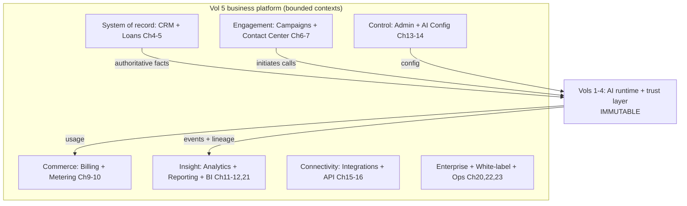

## 1.9 Data Flow

The system of record (Ch 4–5) supplies authoritative customer/loan facts to the runtime (Vol 1 Ch 11); engagement (Ch 6–7) initiates calls into the runtime; the runtime emits events + lineage (Vol 3 Ch 3) that feed metering/billing (Ch 9–10) and analytics/BI (Ch 11/21); control surfaces (Ch 13–14) configure the runtime via supported config; everything is tenant-scoped and policy-governed (Vol 4).

## 1.10 Component Diagram

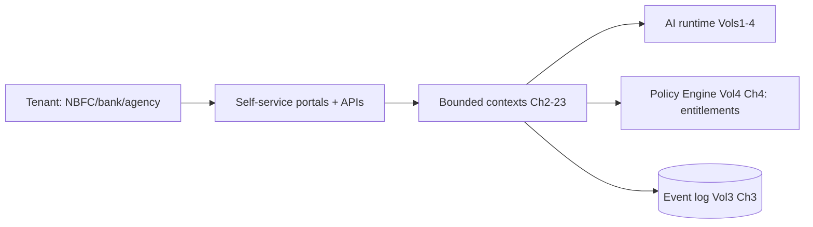

## 1.11 Sequence Diagram — platform mediates a collections call

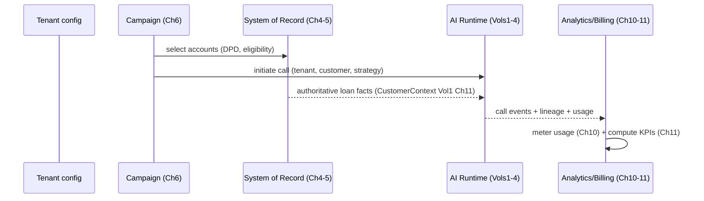

## 1.12 Data Models

```python
class Tenant:
    tenant_id: TenantId; name: str; type: TenantType   # SINGLE | ENTERPRISE | WHITE_LABEL
    plan: PlanId; status: TenantStatus; region: Region
    created_at: Timestamp

class BoundedContext:                  # conceptual organization
    name: str                          # CRM, Loans, Campaigns, Billing, ...
    owns: list[Entity]; events: list[EventType]; apis: list[APIContract]
```

## 1.13 Configuration

```yaml
saas_philosophy:
  multi_tenancy: shared_platform_strict_isolation
  customization: config_and_policy_only      # no per-tenant code forks
  onboarding: self_service
  api_first: true
  design: domain_driven_bounded_contexts
  integration: event_driven
```

## 1.14 Performance Targets

- Platform overhead over the runtime: minimal; the runtime's SLOs (Vol 1 Ch 23) are preserved.
- Self-service onboarding: minutes to a working sandbox (Ch 3).
- API parity: 100% of portal actions available via API.

## 1.15 Failure Modes

| Failure | Effect | Handling |
|---|---|---|
| Per-tenant fork creep | Unmaintainable | Config/policy-only divergence (enforced) |
| Platform couples into runtime internals | Breaks immutability | Strict boundary: supply inputs / consume outputs only |
| Isolation assumed not enforced | Cross-tenant risk | Reuse Vol 4 Ch 6 isolation invariant |

## 1.16 Recovery Strategy

Architectural: divergence is refactored back to configuration; any platform reach into runtime internals is removed in favor of the supported contracts. Isolation failures are critical incidents (Vol 4 Ch 17).

## 1.17 Observability

Tenant count/types, config-vs-fork ratio (should be 100% config), API-vs-UI usage, onboarding funnel, runtime-SLO preservation. The platform watches that it isn't degrading the runtime.

## 1.18 Security Notes

The platform inherits the Vol 4 trust layer wholesale: every tenant-scoped, every action authz'd + audited, every isolation boundary preserved. The platform must never become a path around Vol 4 controls (it sits *outside* the runtime, calling in through governed contracts).

## 1.19 Scalability

Shared multi-tenant platform scales horizontally with tenants; per-tenant overhead is data + config, not infrastructure. The design supports single-NBFC to global-enterprise on the same codebase.

## 1.20 Future Improvements

- Tenant-tier-aware resource pooling for cost efficiency.
- Platform extensibility via the marketplace (Ch 19).
- Edge/region expansion driven by residency (Ch 22).

---
---

# Chapter 2 — Multi-Tenant Architecture

## 2.1 Purpose

Define the multi-tenant model: the tenant hierarchy (organization → business unit → branch), the isolation guarantees across data/compute/storage/resource, and the supported deployment shapes — single tenant, enterprise tenant, and white-label — all built on the Vol 4 Ch 6 tenant-isolation invariant (never weakening it).

## 2.2 Responsibilities

- Define the tenant hierarchy and organizational model (org, business units, branches).
- Enforce isolation across data, compute, storage, and resources (reusing Vol 3 Ch 4/9 + Vol 4 Ch 6).
- Support single, enterprise (hierarchical), and white-label tenant shapes on one platform.
- Provide the tenant-context that scopes every platform operation.

## 2.3 Design Goals

- **Strict isolation by construction:** no tenant can access another's data/compute/config (Vol 4 invariant).
- **Hierarchy where needed:** enterprises model org/branch structure; small tenants stay flat.
- **One platform, many shapes:** single/enterprise/white-label differ by config, not deployment forks (except optional private deployments, Ch 22).

## 2.4 Non-Goals

- Not the isolation *mechanism* (Vol 4 Ch 6 / Vol 3 Ch 4/9 own it) — this defines the tenant *model* over it.
- Not tenant lifecycle (Ch 3) — this is the structural model.

## 2.5 Inputs

Tenant definitions, org/branch structure, isolation policies (Vol 4 Ch 6), deployment shape (single/enterprise/white-label/private).

## 2.6 Outputs

```python
class TenantContext:
    tenant_id: TenantId; org_id: OrgId
    hierarchy_path: list[NodeId]      # org → BU → branch
    isolation: IsolationProfile; region: Region; plan: PlanId
```

## 2.7 Public Interfaces

```python
class TenancyService:
    def resolve(self, request: Request) -> TenantContext: ...      # every request scoped
    def hierarchy(self, tenant: TenantId) -> OrgTree: ...
    def isolation_profile(self, tenant: TenantId) -> IsolationProfile: ...
```

## 2.8 Internal Components

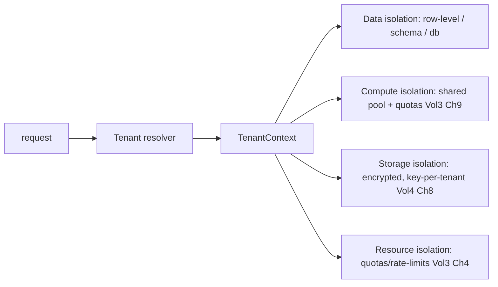

## 2.9 Data Flow

Every request resolves to a `TenantContext` (org/BU/branch path, region, plan, isolation profile). All downstream data access is tenant-scoped (row-level by default; schema/DB isolation for higher tiers); compute uses shared pools with per-tenant quotas + fair-share (Vol 3 Ch 9); storage is encrypted with per-tenant keys (Vol 4 Ch 8); resources are quota/rate-limited (Vol 3 Ch 4).

## 2.10 Component Diagram

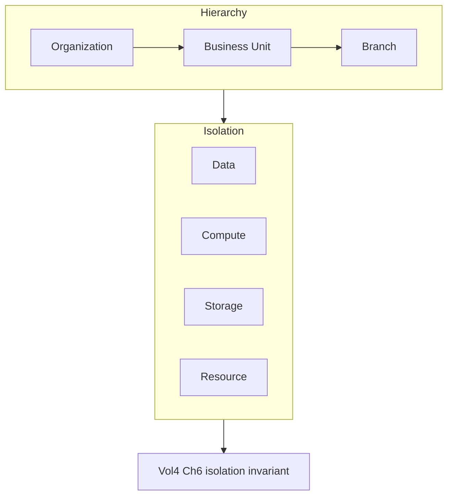

## 2.11 Sequence Diagram — tenant-scoped data access

```mermaid
sequenceDiagram
    participant API as Platform API
    participant TS as Tenancy Service
    participant DB as Data store
    API->>TS: resolve(request)
    TS-->>API: TenantContext(tenant, hierarchy, isolation)
    API->>DB: query (tenant_id predicate enforced)
    Note over DB: row-level isolation; cross-tenant impossible (Vol4 Ch6)
    DB-->>API: tenant-scoped results only
```

## 2.12 Data Models

```python
class Organization:
    org_id: OrgId; tenant_id: TenantId; name: str
    business_units: list[BusinessUnitId]; settings: OrgSettings

class BusinessUnit:
    bu_id: BusinessUnitId; org_id: OrgId; name: str; branches: list[BranchId]

class Branch:
    branch_id: BranchId; bu_id: BusinessUnitId; name: str; location: str
    agents: list[UserId]; campaigns: list[CampaignId]

class IsolationProfile:
    data: Literal["row_level","schema","dedicated_db"]
    compute: Literal["shared_quota","dedicated_pool"]
    storage_key: Literal["per_tenant","per_org"]
    tier: TenantTier   # standard | enterprise | white_label | private
```

## 2.13 Configuration

```yaml
multi_tenant:
  default_isolation: { data: row_level, compute: shared_quota, storage_key: per_tenant }
  enterprise_isolation: { data: schema, compute: dedicated_pool_option }
  hierarchy: [organization, business_unit, branch]
  shapes: [single, enterprise, white_label, private]
  cross_tenant_access: denied_default   # Vol4 Ch6
```

## 2.14 Performance Targets

- Tenant resolution: **< 2 ms** (cached).
- Isolation enforcement overhead: negligible (predicate/scoping).
- Hierarchy queries: **< 10 ms**.

## 2.15 Failure Modes

| Failure | Effect | Handling |
|---|---|---|
| Missing tenant predicate | Cross-tenant leak | Framework-enforced scoping; tests (Vol 4 Ch 21) |
| Noisy neighbor | Resource contention | Per-tenant quotas + fair-share (Vol 3 Ch 9) |
| Hierarchy misconfig | Wrong access scope | Validated org tree; audit |
| Key mixup | Cross-tenant decrypt | Per-tenant keys (Vol 4 Ch 8) |

## 2.16 Recovery Strategy

Isolation gaps are critical incidents (Vol 4 Ch 17) with immediate containment. Noisy-neighbor issues throttle via quotas. Hierarchy errors roll back to validated config. Tenant scoping is framework-default (hard to omit).

## 2.17 Observability

Per-tenant resource usage, isolation-violation attempts (target 0), hierarchy integrity, quota utilization, noisy-neighbor signals. Cross-tenant attempts are top security signals (Vol 4 Ch 16).

## 2.18 Security Notes

Tenant isolation is *the* security invariant (Vol 4 Ch 6) — Vol 5's hierarchy never weakens it; sub-tenant (BU/branch) scoping refines, never broadens. Per-tenant encryption (Vol 4 Ch 8) + crypto-shred enable clean tenant deletion (Ch 3). Pen-tested (Vol 4 Ch 21).

## 2.19 Scalability

Row-level isolation scales to many tenants cheaply; schema/dedicated isolation for high tiers; compute is shared-pool with quotas (Vol 3 Ch 9). Scales single-NBFC → thousands of tenants on one platform.

## 2.20 Future Improvements

- Tenant-tier-adaptive isolation (auto-promote heavy tenants to schema/dedicated).
- Cell-based architecture for blast-radius containment at scale.
- Cross-region tenant placement by residency (Ch 22).

---
---

# Chapter 3 — Tenant Lifecycle

## 3.1 Purpose

Manage a tenant from first touch to deletion: trial, sandbox, production, suspension, reactivation, cancellation, migration, backup, and tenant deletion — each a well-defined state with controlled transitions, honoring billing (Ch 9), data residency (Ch 22), and the Vol 4 erasure/audit obligations.

## 3.2 Responsibilities

- Provision tenants (self-service trial/sandbox → production) and manage state transitions.
- Handle suspension (non-payment/policy)/reactivation, cancellation, and compliant deletion (crypto-shred, Vol 4 Ch 8/9).
- Support tenant migration (region/tier) and per-tenant backup/restore (on Vol 3 Ch 18).
- Enforce that each state gates capabilities (e.g., trial limits, suspended = read-only).

## 3.3 Design Goals

- **Self-service fast path:** trial/sandbox in minutes; production on plan activation.
- **Clean, reversible-where-appropriate transitions:** suspension is reversible; deletion is final + compliant.
- **Data-safe:** migration/backup/deletion preserve integrity, residency, and audit.

## 3.4 Non-Goals

- Not the tenant structural model (Ch 2) or billing logic (Ch 9) — it orchestrates lifecycle using them.

## 3.5 Inputs

Signup/trial requests, plan activations, payment status (Ch 9), policy/compliance triggers (Vol 4), migration/deletion requests.

## 3.6 Outputs

```python
class TenantLifecycleState:
    tenant_id: TenantId
    state: Literal["TRIAL","SANDBOX","PRODUCTION","SUSPENDED","CANCELLED","DELETING","DELETED"]
    entered_at: Timestamp; reason: str | None; capabilities: Entitlements
```

## 3.7 Public Interfaces

```python
class TenantLifecycle:
    def provision(self, signup: Signup) -> TenantContext: ...           # trial/sandbox
    def activate(self, tenant: TenantId, plan: PlanId) -> None: ...     # → production
    def suspend(self, tenant: TenantId, reason: str) -> None: ...
    def reactivate(self, tenant: TenantId) -> None: ...
    def cancel(self, tenant: TenantId) -> None: ...
    def migrate(self, tenant: TenantId, target: MigrationTarget) -> MigrationResult: ...
    def delete(self, tenant: TenantId, confirmation: Confirmation) -> DeletionResult: ...
```

## 3.8 Internal Components

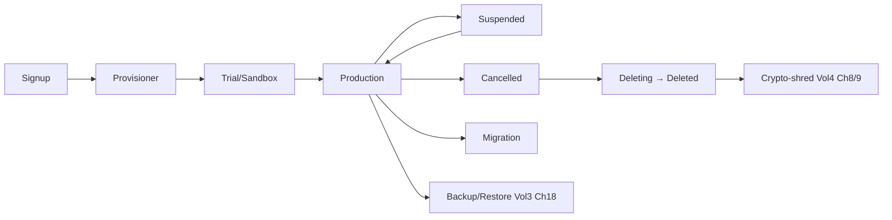

## 3.9 Data Flow

Self-service signup provisions a trial/sandbox tenant (isolated, limited entitlements). Plan activation (Ch 9) promotes to production. Non-payment/policy triggers suspension (read-only, reversible); reactivation restores. Cancellation begins a retention-window countdown, then deletion crypto-shreds tenant data (Vol 4 Ch 8/9) while tombstoning audit (Vol 4 Ch 11). Migration moves a tenant across region/tier; backup/restore uses Vol 3 Ch 18.

## 3.10 Component Diagram

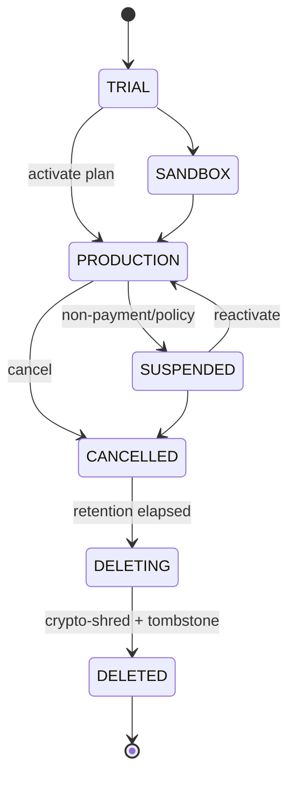

## 3.11 Sequence Diagram — compliant tenant deletion

```mermaid
sequenceDiagram
    participant ADM as Tenant admin
    participant TL as Tenant Lifecycle
    participant ENC as Encryption (Vol4 Ch8)
    participant AUD as Audit (Vol4 Ch11)
    ADM->>TL: delete(tenant, confirmation)
    TL->>TL: enter DELETING; stop processing; final export offered
    TL->>ENC: crypto_shred(tenant keys) → data unrecoverable
    TL->>AUD: tombstone PII refs; retain non-PII audit (regulated)
    TL-->>ADM: DeletionResult(verified)
```

## 3.12 Data Models

```python
class TenantProvisioning:
    tenant_id: TenantId; shape: TenantType; region: Region
    trial_expires_at: Timestamp | None; sandbox: bool

class MigrationTarget:
    region: Region | None; tier: TenantTier | None
class MigrationResult:
    moved: bool; data_integrity_verified: bool; downtime_ms: int

class DeletionResult:
    tenant_id: TenantId; method: Literal["crypto_shred_plus_tombstone"]
    stores_covered: list[Store]; audit_retained: bool; verified: bool
```

## 3.13 Configuration

```yaml
tenant_lifecycle:
  trial: { duration_days: 14, limits: { minutes: 500, users: 5 } }
  sandbox: { isolated: true, synthetic_data_ok: true }
  suspension: read_only
  cancellation: { retention_window_days: 30, final_export: offered }
  deletion: { method: crypto_shred_plus_tombstone, verify: true }
  migration: { supported: [region, tier], minimize_downtime: true }
```

## 3.14 Performance Targets

- Trial/sandbox provisioning: **< 5 min** (self-service).
- Suspension/reactivation: near-instant (entitlement toggle).
- Deletion: crypto-shred completes promptly; verified within SLA (Vol 4 Ch 9).

## 3.15 Failure Modes

| Failure | Effect | Handling |
|---|---|---|
| Provisioning partial | Broken tenant | Idempotent provisioning (Vol 3 Ch 8); rollback |
| Deletion incomplete | Compliance risk | Crypto-shred covers all stores incl. backups; verified |
| Migration data loss | Integrity risk | Verified copy + cutover; rollback to source |
| Wrong suspension | Service disruption | Reversible; audited; approval for mass actions |

## 3.16 Recovery Strategy

Provisioning is idempotent + rollback-able. Migration verifies integrity before cutover and can roll back to the source. Deletion is verified (crypto-shred proof + tombstone). Backups (Vol 3 Ch 18) enable restore of accidentally-cancelled tenants within the retention window.

## 3.17 Observability

State distribution (trial/prod/suspended/…), provisioning success/time, trial→paid conversion, suspension/churn rates, deletion verification, migration outcomes. Conversion + churn feed customer success (Ch 18) and BI (Ch 21).

## 3.18 Security Notes

Lifecycle actions are powerful (suspend/delete) — authz'd (Vol 4 Ch 6), audited (Vol 4 Ch 11), and confirmation-gated for destructive ops. Deletion is compliant erasure (crypto-shred + tombstone, Vol 4 Ch 9) — reconciling right-to-erasure with regulated audit retention. Sandbox uses synthetic/de-identified data.

## 3.19 Scalability

Lifecycle operations are per-tenant and async where heavy (migration/deletion). Self-service provisioning scales onboarding without ops involvement. Scales with tenant volume.

## 3.20 Future Improvements

- Zero-downtime live tenant migration.
- Automated trial-to-paid nurturing (with Ch 18).
- Self-service region migration honoring residency (Ch 22).

---
---

# Chapter 4 — Customer Management Platform (CRM)

## 4.1 Purpose

Provide the tenant's **system of record** for the people and relationships in collections: customers/borrowers, co-borrowers, guarantors, their loans/accounts/products, contact history, and the relationship graph among them. This CRM is the authoritative source of the customer facts the AI agent uses (Law of Authority, Vol 4 Ch 3 / Vol 1 Ch 11).

## 4.2 Responsibilities

- Maintain authoritative records of customers, co-borrowers, guarantors, and their relationships.
- Link parties to loans/accounts/products (Ch 5 owns loan financials; CRM owns the parties + linkage).
- Record complete contact history (every call/SMS/interaction outcome).
- Serve authoritative customer context to the runtime and enforce PII protection (Vol 4 Ch 10).

## 4.3 Design Goals

- **Authoritative + accurate:** CRM is the source of truth for party data the agent speaks — accuracy is a Law-of-Authority dependency.
- **Relationship-aware:** model the borrower/co-borrower/guarantor graph that collections strategy needs.
- **Privacy-first:** PII minimized, classified, protected (Vol 4 Ch 9/10) from capture.

## 4.4 Non-Goals

- Not loan financials/schedules/workflows (Ch 5) — CRM links to them.
- Not the conversation (Vols 1–2) — CRM supplies context, consumes outcomes.

## 4.5 Inputs

Customer/party data (imports, integrations Ch 15, API Ch 16), contact outcomes (from runtime events Vol 3 Ch 3), relationship definitions.

## 4.6 Outputs

```python
class CustomerRecord:
    customer_id: CustomerId; tenant_id: TenantId
    party_type: PartyType          # BORROWER | CO_BORROWER | GUARANTOR
    profile: PartyProfile          # name, contacts (tokenized Vol4 Ch10), language, prefs
    loans: list[LoanId]; relationships: list[Relationship]
    contact_history: list[ContactEventRef]; consent: ConsentState  # Vol4 Ch2
```

## 4.7 Public Interfaces

```python
class CRM:
    def get_customer(self, id: CustomerId, subject: Subject) -> CustomerRecord: ...   # authz Vol4 Ch6
    def context_for_call(self, customer_id: CustomerId) -> CustomerContext: ...        # → Vol1 Ch11
    def record_contact(self, event: ContactEvent) -> None: ...                          # from runtime
    def upsert(self, record: CustomerRecord, source: Source) -> None: ...
    def relationships(self, customer_id: CustomerId) -> RelationshipGraph: ...
```

## 4.8 Internal Components

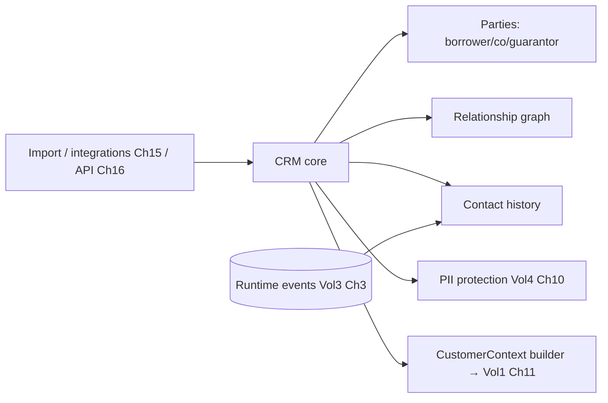

## 4.9 Data Flow

Party data enters via import/integration/API, is PII-protected (Vol 4 Ch 10) and tenant-scoped, and linked into the relationship graph + loans (Ch 5). When a call is initiated, the CRM assembles the authoritative `CustomerContext` (Vol 1 Ch 11) — profile, loans, history, consent — that the runtime uses (and the Law of Authority depends on). Runtime contact outcomes flow back into contact history.

## 4.10 Component Diagram

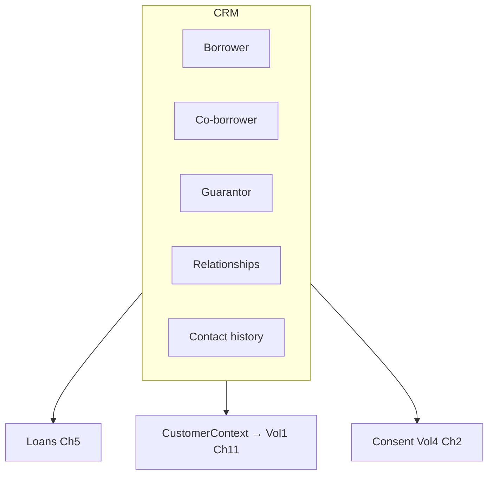

## 4.11 Sequence Diagram — assembling call context

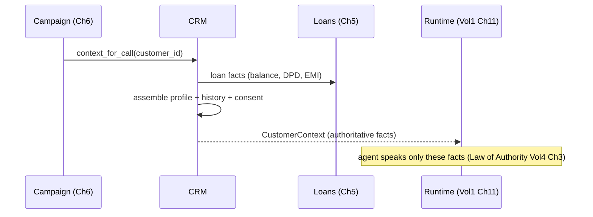

## 4.12 Data Models

```python
class PartyProfile:
    name: str; contacts: list[TokenizedContact]   # phone/email tokenized (Vol4 Ch10)
    language_pref: Language; timezone: str; best_time: TimeWindow

class Relationship:
    from_party: CustomerId; to_party: CustomerId
    kind: Literal["CO_BORROWER","GUARANTOR","SPOUSE","REFERENCE"]; loan_id: LoanId

class ContactEvent:
    event_id: ULID; customer_id: CustomerId; channel: Channel    # VOICE|SMS|WHATSAPP|EMAIL
    outcome: ContactOutcome   # RPC|NO_ANSWER|PTP|REFUSED|CALLBACK|...
    call_id: CallId | None; lineage_ref: LineageRef | None; at: Timestamp

class LoanProduct:
    product_id: ProductId; tenant_id: TenantId; name: str
    type: Literal["PERSONAL","AUTO","HOME","CREDIT_CARD","BUSINESS"]; terms: ProductTerms
```

## 4.13 Configuration

```yaml
crm:
  party_types: [borrower, co_borrower, guarantor, reference]
  pii_protection: tokenize_contacts   # Vol4 Ch10
  contact_history: full_immutable_refs
  context_assembly: { include: [profile, loans, history, consent], freshness_s: 60 }
  relationship_graph: enabled
```

## 4.14 Performance Targets

- Context assembly for a call: **< 50 ms** (feeds Vol 1 Ch 11 prefetch).
- Customer lookup: **< 20 ms**.
- Import throughput: bulk (tenant onboarding).

## 4.15 Failure Modes

| Failure | Effect | Handling |
|---|---|---|
| Stale customer facts | Agent speaks wrong info | Freshness TTL + authoritative re-read (Vol 1 RI-5) |
| Missing consent | Can't legally contact | Consent gate (Vol 4 Ch 2) blocks |
| PII in clear | Privacy breach | Tokenization at capture (Vol 4 Ch 10) |
| Bad import | Data quality | Validation + dedup on import |

## 4.16 Recovery Strategy

The CRM is authoritative — facts are re-read fresh for each call (Vol 1 RI-5); stale cache is revalidated. Bad imports are validated/quarantined. Consent gaps block contact (fail closed). CRM data is backed up (Vol 3 Ch 18) and tenant-deletion crypto-shreds it (Ch 3).

## 4.17 Observability

Record counts, context-assembly latency, data-quality metrics (completeness, duplicates), consent coverage, contact-history volume. Data quality directly affects AI accuracy (feeds Ch 11/21).

## 4.18 Security Notes

CRM holds the most sensitive PII (party + contact data) — tokenized (Vol 4 Ch 10), encrypted (Vol 4 Ch 8), tenant-isolated (Vol 4 Ch 6), access-audited (Vol 4 Ch 11). As the system of record for spoken facts, its integrity is a Law-of-Authority dependency (Vol 4 Ch 3). Erasure crypto-shreds party data (Vol 4 Ch 9).

## 4.19 Scalability

Tenant-sharded; relationship graph per-tenant; contact history partitioned by time/tenant. Scales to millions of customers per large tenant.

## 4.20 Future Improvements

- Entity resolution/dedup across imports + sources.
- Householding (relationship-aware collections across linked parties).
- Contact-preference learning (best channel/time) feeding strategy (Vol 2 Ch 4).

---
---

# Chapter 5 — Loan & Collections Management

## 5.1 Purpose

Own the collections **business state and workflows**: EMI schedules, DPD tracking, promise-to-pay (PTP), settlement, callback, and escalation workflows, plus agent assignment and campaign participation. This is the system of record for loan financials and collections state; Vol 2 reasons *over* it conversationally, but the authoritative numbers and workflow state live here.

## 5.2 Responsibilities

- Maintain loan accounts: EMI schedules, balances, DPD (days-past-due) buckets, payment history.
- Own collections workflows: PTP capture/tracking, settlement, callback scheduling, escalation — as durable, auditable state machines.
- Manage agent assignment and which accounts participate in which campaigns (Ch 6).
- Supply authoritative loan facts to the runtime and record collections outcomes from it.

## 5.3 Design Goals

- **Authoritative financials:** balances/DPD/EMI are computed deterministically here — the agent never invents them (Law of Authority, Vol 4 Ch 3).
- **Durable workflows:** PTP/settlement/callback/escalation are persisted state machines (idempotent, Vol 3 Ch 8), not conversation-only.
- **Closed loop with the runtime:** outcomes (PTP made, payment promised) captured authoritatively + idempotently.

## 5.4 Non-Goals

- Not the negotiation *reasoning* (Vol 2 Ch 5) — Vol 5 owns the PTP/settlement *records + bounds*; Vol 2 negotiates within them.
- Not payment *processing* (Ch 15 integrates a gateway) — it records intent/outcome and reconciles.

## 5.5 Inputs

Loan data (from LMS via integrations Ch 15), payment updates, runtime collections outcomes (PTP/settlement signals via events Vol 3 Ch 3), campaign assignments (Ch 6).

## 5.6 Outputs

```python
class LoanAccount:
    loan_id: LoanId; tenant_id: TenantId; customer_id: CustomerId; product_id: ProductId
    principal: Money; outstanding: Money; emi: Money
    dpd: int; bucket: DPDBucket           # 0 | 1-30 | 31-60 | 61-90 | 90+
    schedule: list[EMIInstallment]; status: LoanStatus
    collections_state: CollectionsState

class PromiseToPay:
    ptp_id: PtpId; loan_id: LoanId; amount: Money; promised_date: Date
    captured_at: Timestamp; call_id: CallId; status: PtpStatus   # OPEN|KEPT|BROKEN|PARTIAL
    idempotency_key: IdempotencyKey       # Vol3 Ch8
```

## 5.7 Public Interfaces

```python
class CollectionsManagement:
    def loan_facts(self, loan_id: LoanId) -> LoanFacts: ...           # authoritative → CustomerContext
    def capture_ptp(self, ptp: PromiseToPay) -> CommitResult: ...     # idempotent (Vol3 Ch8)
    def open_settlement(self, loan_id: LoanId, offer: SettlementOffer) -> Settlement: ...
    def schedule_callback(self, cb: Callback) -> None: ...
    def escalate(self, loan_id: LoanId, reason: EscalationReason) -> Escalation: ...
    def assign_agent(self, loan_id: LoanId, agent: UserId) -> None: ...
```

## 5.8 Internal Components

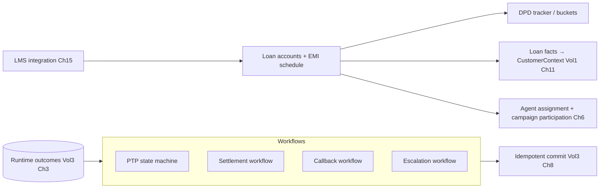

## 5.9 Data Flow

Loan data syncs from the tenant's LMS (Ch 15); DPD is computed daily from schedule vs. payments. When a call runs, authoritative loan facts feed the runtime (Vol 1 Ch 11). Conversational outcomes — a PTP, a settlement agreement, a callback request, an escalation — are captured here as durable, idempotent workflow state (Vol 3 Ch 8). PTP kept/broken is reconciled against payments; broken PTPs re-enter campaigns (Ch 6).

## 5.10 Component Diagram

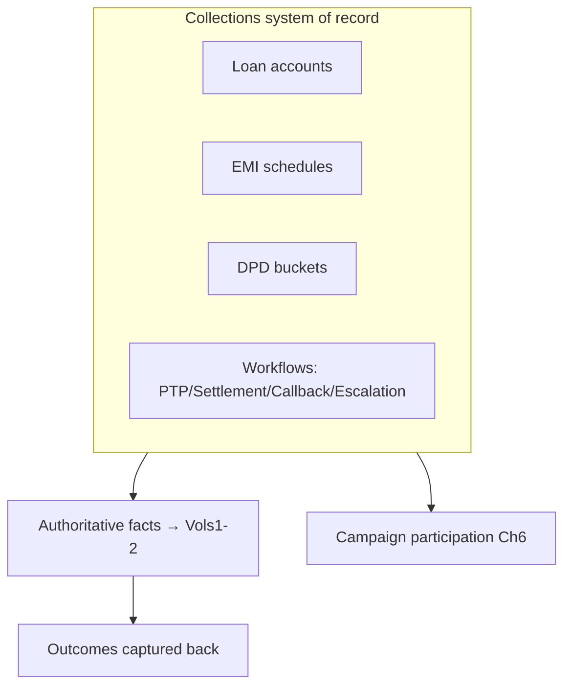

## 5.11 Sequence Diagram — PTP capture from a call

```mermaid
sequenceDiagram
    participant RT as Runtime (Vol2 Ch5 negotiation)
    participant CM as Collections Mgmt
    participant IDEM as Idempotency (Vol3 Ch8)
    participant AUD as Audit (Vol4 Ch11)
    RT->>CM: capture_ptp(loan, amount, date, call_id, idem_key)
    CM->>IDEM: execute_once(ptp_key)
    alt new
        CM->>CM: persist PTP (OPEN); update collections_state
        CM->>AUD: record (authoritative, accountable)
        CM-->>RT: committed
    else duplicate (retry/replay)
        CM-->>RT: dedup hit (same PTP)
    end
```

## 5.12 Data Models

```python
class EMIInstallment:
    seq: int; due_date: Date; amount: Money; principal: Money; interest: Money
    status: Literal["PAID","DUE","OVERDUE","PARTIAL"]

class CollectionsState:
    stage: Literal["CURRENT","SOFT","HARD","LEGAL","SETTLED","WRITTEN_OFF"]
    last_contact: Timestamp | None; open_ptp: PtpId | None
    open_settlement: SettlementId | None; assigned_agent: UserId | None
    campaign_ids: list[CampaignId]

class Settlement:
    settlement_id: SettlementId; loan_id: LoanId; offered: Money; approved: Money | None
    requires_approval: bool; status: SettlementStatus   # Vol4 Ch15 human approval if above threshold

class Callback:
    callback_id: CallbackId; loan_id: LoanId; requested_for: Timestamp; reason: str

class Escalation:
    escalation_id: EscalationId; loan_id: LoanId; reason: EscalationReason
    to: Literal["HUMAN_AGENT","SUPERVISOR","LEGAL"]; at: Timestamp
```

## 5.13 Configuration

```yaml
collections:
  dpd_buckets: [0, "1-30", "31-60", "61-90", "90+"]
  dpd_recompute: daily
  ptp: { idempotent: true, reconcile_with_payments: true, broken_requeues_campaign: true }
  settlement: { approval_threshold: 50000, requires_human: true }   # Vol4 Ch15/Ch3
  escalation_targets: [human_agent, supervisor, legal]
  facts_authoritative: true   # Law of Authority dependency
```

## 5.14 Performance Targets

- Loan-facts read: **< 20 ms** (feeds CRM context assembly Ch 4).
- PTP/settlement capture: **< 50 ms** idempotent commit.
- DPD recompute: batch daily across the portfolio.

## 5.15 Failure Modes

| Failure | Effect | Handling |
|---|---|---|
| Stale loan facts | Wrong amounts spoken | Authoritative re-read (Vol 1 RI-5); LMS sync freshness |
| Duplicate PTP | Double-counted promise | Idempotency (Vol 3 Ch 8) |
| Settlement over-authority | Unapproved discount | Approval threshold → human (Vol 4 Ch 15); envelope bounds (Vol 2 Ch 5) |
| LMS sync lag | Outdated state | Sync SLAs + reconciliation; mark staleness |

## 5.16 Recovery Strategy

Loan facts are authoritative + re-read fresh (Vol 1 RI-5); LMS sync reconciles. Workflow commits are idempotent (Vol 3 Ch 8) — retries/replays don't duplicate PTPs/settlements. Settlements above threshold require human approval (Vol 4 Ch 15) and stay within the negotiation envelope (Vol 2 Ch 5). State machines are durable + recoverable (Vol 3 Ch 6/7).

## 5.17 Observability

DPD distribution, PTP rates/kept-vs-broken, settlement volumes/approvals, callback adherence, escalation rates, portfolio roll-rates. These are the core collections KPIs (feed Ch 11/21) and tie outcomes to AI performance via lineage.

## 5.18 Security Notes

Loan financials are sensitive + authoritative — encrypted (Vol 4 Ch 8), tenant-isolated (Vol 4 Ch 6), access-audited (Vol 4 Ch 11). As the source of spoken financial facts, integrity here is a **Law-of-Authority** cornerstone (Vol 4 Ch 3) — a wrong balance is both a quality and a compliance failure. PTP/settlement commits are authoritative effects (commit-before-act, Vol 1 RI-4).

## 5.19 Scalability

Portfolio-scale: tenant-sharded loans, partitioned schedules/history, batch DPD recompute. Workflows are per-loan state machines. Scales to millions of accounts per large tenant.

## 5.20 Future Improvements

- Predictive DPD/roll-rate modeling to prioritize campaigns (with Ch 21).
- Risk-based settlement-authority automation within tighter envelopes.
- Real-time LMS sync (event-driven) replacing batch where available.

---

---
---

# Chapter 6 — Campaign Management

## 6.1 Purpose

Drive engagement at scale: define and run outbound and inbound campaigns with rules, priorities, scheduling, retry policies, voice selection, AI-strategy selection, and A/B testing. Campaigns select which accounts (Ch 5) to contact when, choose how the agent behaves (voice + strategy), and initiate calls into the runtime (Vol 1 Ch 3) within regulatory windows (Vol 4 Ch 2).

## 6.2 Responsibilities

- Define campaigns: audience (account selection from Ch 5), schedule, priority, retry policy, channel.
- Select voice profile (Vol 1 Ch 16) and AI conversation strategy (Vol 2 Ch 4) per campaign/segment.
- Initiate outbound calls (dialer → Vol 1 Ch 3) and route inbound to the right campaign context.
- Run A/B tests across voice/strategy/script variants and measure outcomes (Ch 11).

## 6.3 Design Goals

- **Compliant by construction:** scheduling respects RBI call windows/frequency (Vol 4 Ch 2) — campaigns cannot violate them.
- **Outcome-driven:** retry/priority/strategy adapt to outcomes (PTP, RPC) and feed A/B learning.
- **Config-not-code:** new campaigns are configuration, not deployments.

## 6.4 Non-Goals

- Not the conversation itself (Vols 1–2) — campaigns initiate + parametrize it.
- Not the dialer transport (Vol 1 Ch 3) — campaigns request calls; the gateway places them.

## 6.5 Inputs

Account selections (Ch 5 DPD/eligibility), campaign config, voice/strategy catalogs (Ch 14), compliance windows (Vol 4 Ch 2), outcomes (runtime events Vol 3 Ch 3).

## 6.6 Outputs

```python
class Campaign:
    campaign_id: CampaignId; tenant_id: TenantId; name: str
    type: Literal["OUTBOUND","INBOUND"]; status: CampaignStatus
    audience: AudienceQuery; schedule: Schedule; priority: int
    retry_policy: RetryPolicy; voice: VoiceProfileId; strategy: StrategyId
    ab_test: ABTestConfig | None
```

## 6.7 Public Interfaces

```python
class CampaignManagement:
    def create(self, campaign: Campaign) -> CampaignId: ...
    def enqueue_targets(self, campaign_id: CampaignId) -> int: ...     # select accounts → call queue
    def next_call(self, campaign_id: CampaignId) -> CallRequest | None: ...   # → Vol1 Ch3 dialer
    def record_outcome(self, call_id: CallId, outcome: ContactOutcome) -> None: ...
    def ab_assign(self, campaign_id: CampaignId, target: TargetId) -> Variant: ...
```

## 6.8 Internal Components

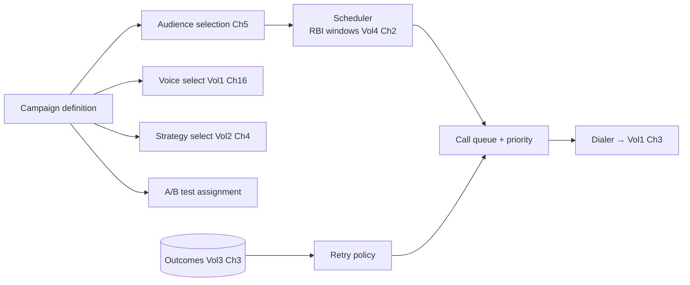

## 6.9 Data Flow

A campaign selects an audience (Ch 5 query: DPD bucket, eligibility, consent Vol 4 Ch 2), schedules within compliant windows, and enqueues targets by priority. The dialer pulls the next call and places it (Vol 1 Ch 3), parametrized with the chosen voice (Vol 1 Ch 16) + strategy (Vol 2 Ch 4) + A/B variant. Outcomes flow back; retry policy requeues per rules (e.g., no-answer → retry later; PTP → suppress; broken-PTP → re-add). A/B results feed analytics (Ch 11).

## 6.10 Component Diagram

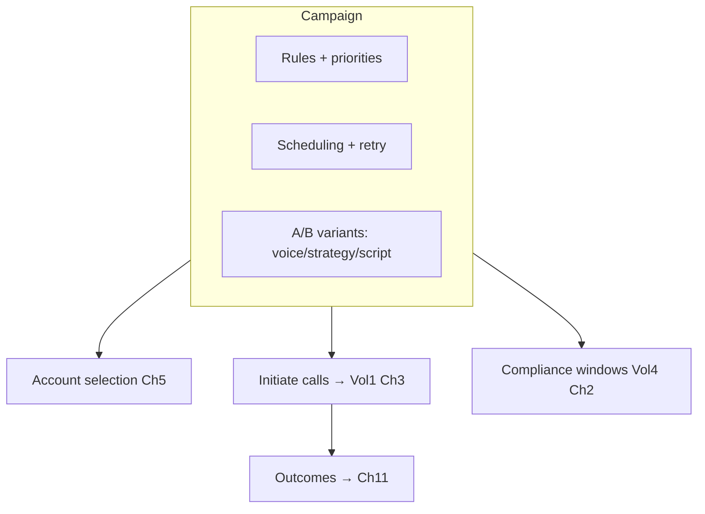

## 6.11 Sequence Diagram — outbound call placement

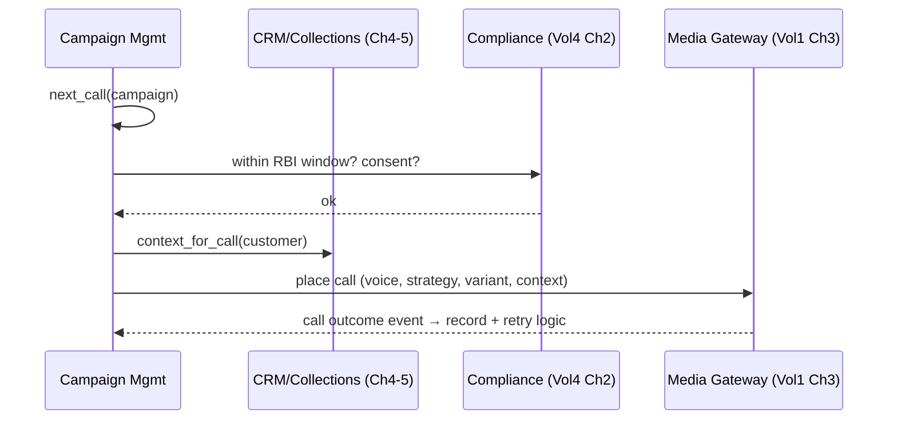

## 6.12 Data Models

```python
class Schedule:
    windows: list[TimeWindow]          # within RBI permitted hours (Vol4 Ch2)
    timezone: str; days: list[Weekday]; max_attempts_per_day: int

class RetryPolicy:
    on_no_answer: RetryRule; on_busy: RetryRule; on_rpc_no_ptp: RetryRule
    max_attempts: int; cooldown: Duration; suppress_on: list[ContactOutcome]   # e.g., PTP, REFUSED

class ABTestConfig:
    test_id: TestId; dimension: Literal["VOICE","STRATEGY","SCRIPT","TIME"]
    variants: list[Variant]; split: list[float]; metric: str   # e.g., ptp_rate
    min_sample: int; status: ABStatus

class CallRequest:
    call_id: CallId; campaign_id: CampaignId; customer_id: CustomerId
    voice: VoiceProfileId; strategy: StrategyId; variant: Variant | None
```

## 6.13 Configuration

```yaml
campaign_management:
  types: [outbound, inbound]
  scheduling: { respect_rbi_windows: true, timezone_aware: true }   # Vol4 Ch2
  priority: weighted   # DPD bucket, balance, propensity
  retry: { max_attempts: 5, cooldown_h: 24, suppress_on: [ptp, refused, settled] }
  voice_selection: per_campaign_or_segment
  strategy_selection: per_campaign_or_segment   # Vol2 Ch4
  ab_testing: { enabled: true, auto_promote_winner: false }
```

## 6.14 Performance Targets

- Audience selection: bulk (portfolio-scale) within minutes.
- Next-call dispatch: **< 50 ms** (keeps dialer saturated).
- A/B significance: tracked to `min_sample` before conclusions.

## 6.15 Failure Modes

| Failure | Effect | Handling |
|---|---|---|
| Window violation | Compliance breach | Scheduler enforces RBI windows (Vol 4 Ch 2); fail closed |
| Over-calling | Harassment / RBI breach | Frequency caps + suppression rules |
| Dialer overload | Dropped calls | Backpressure from gateway (Vol 1 Ch 3) + capacity (Ch 23) |
| Biased A/B split | Wrong conclusion | Proper randomization + min sample |

## 6.16 Recovery Strategy

Scheduling is compliance-gated (no out-of-window calls). Retry/suppression prevent over-contact. Dialer respects gateway backpressure. A/B tests require significance before promotion. Campaign state is durable (Vol 3 Ch 6/7); outcomes are idempotent (Vol 3 Ch 8).

## 6.17 Observability

Campaign throughput, contact/RPC/PTP rates per campaign + variant, retry distributions, window-compliance (0 violations), A/B results. These are primary collections-performance signals (Ch 11/21).

## 6.18 Security Notes

Campaigns operate on sensitive audiences — tenant-isolated (Vol 4 Ch 6), consent-gated (Vol 4 Ch 2), audited (Vol 4 Ch 11). Frequency/window enforcement is a regulatory control (RBI anti-harassment). Voice/strategy selection feeds the runtime but never bypasses its safety (Vol 4 Ch 14).

## 6.19 Scalability

Audience selection is batch + sharded; call queues scale per campaign/tenant; dialing scales with runtime capacity (Vol 3 Ch 22). Supports millions of targets across many concurrent campaigns.

## 6.20 Future Improvements

- Propensity-to-pay modeling for audience prioritization (with Ch 21).
- Auto-optimizing campaigns (multi-armed bandit over variants).
- Best-time-to-call prediction per customer (with Ch 4 preferences).

---
---

# Chapter 7 — Contact Center Platform

## 7.1 Purpose

Provide the blended AI + human contact-center surface: call queues, agent queues, live transfer, supervisor join, and human takeover — the operational layer where AI agents and human agents work together on the same calls and queues, built on the Vol 4 Ch 15 human-oversight primitives.

## 7.2 Responsibilities

- Manage call queues and agent queues (skills/availability-based routing).
- Enable live transfer (AI → human, human → human), supervisor join/monitor, and human takeover (Vol 4 Ch 15).
- Orchestrate blended workflows: AI handles volume, humans handle exceptions/escalations/high-value.
- Surface live context (transcript, lineage, customer/loan data) to agents during takeover/transfer.

## 7.3 Design Goals

- **Seamless blend:** AI↔human handoffs preserve full context (no "start over").
- **Skills-based routing:** the right human (language/skill/seniority) gets the right call.
- **Supervisor control:** monitor, whisper, join, or take over any call (Vol 4 Ch 15).

## 7.4 Non-Goals

- Not the takeover *mechanism* (Vol 4 Ch 15 owns suspend/bridge) — this is the contact-center surface over it.
- Not workforce management/scheduling (future/Ch 18-adjacent).

## 7.5 Inputs

Escalations/transfers (Vol 2 Ch 16 / Vol 4 Ch 15), agent availability/skills (Ch 8), live call context (transcript + lineage Vol 3 Ch 3), inbound calls (Vol 1 Ch 3).

## 7.6 Outputs

```python
class QueuedCall:
    call_id: CallId; tenant_id: TenantId; queue: QueueId
    priority: int; required_skills: list[Skill]; context_ref: ContextRef
    state: Literal["AI_HANDLING","QUEUED_FOR_HUMAN","WITH_HUMAN","SUPERVISOR_MONITORING"]
```

## 7.7 Public Interfaces

```python
class ContactCenter:
    def route(self, call: QueuedCall) -> Routing: ...                    # to AI or human queue
    def transfer(self, call_id: CallId, to: AgentTarget) -> TransferResult: ...
    def takeover(self, call_id: CallId, agent: UserId) -> None: ...       # → Vol4 Ch15
    def supervisor_join(self, call_id: CallId, supervisor: UserId, mode: JoinMode) -> None: ...  # monitor|whisper|barge
    def agent_state(self, agent: UserId, state: AgentState) -> None: ...
```

## 7.8 Internal Components

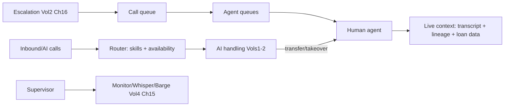

## 7.9 Data Flow

Calls are handled by AI by default; on escalation/transfer (Vol 2 Ch 16 / Vol 4 Ch 15) they enter a call queue and route to an agent queue by skills/availability. The human receives full live context (transcript, decision lineage, customer/loan data from Ch 4–5). Supervisors can monitor, whisper (coach the agent), or barge/take over. Takeover suspends AI turn-taking (Vol 1 Ch 9 via Vol 4 Ch 15) and bridges the human; handback resumes AI.

## 7.10 Component Diagram

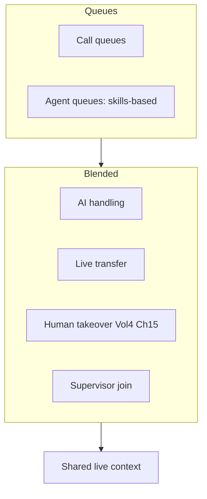

## 7.11 Sequence Diagram — AI → human transfer with context

```mermaid
sequenceDiagram
    participant AI as AI agent (Vols1-2)
    participant CC as Contact Center
    participant AG as Human agent
    AI->>CC: escalate (complex hardship case)
    CC->>CC: route by skills (language, seniority)
    CC->>AG: assign + push live context (transcript, lineage, loan)
    CC->>AI: suspend AI (Vol4 Ch15)
    AG->>AG: continue call with full context (no restart)
    Note over AG: handback to AI possible after resolution
```

## 7.12 Data Models

```python
class AgentState:
    agent_id: UserId; status: Literal["AVAILABLE","ON_CALL","WRAP_UP","AWAY"]
    skills: list[Skill]; languages: list[Language]; current_call: CallId | None

class Queue:
    queue_id: QueueId; tenant_id: TenantId; type: Literal["CALL","AGENT"]
    routing: RoutingPolicy   # skills_based | round_robin | priority
    sla_target_s: int

class TransferResult:
    call_id: CallId; from_: Party; to: Party; context_preserved: bool; at: Timestamp
```

## 7.13 Configuration

```yaml
contact_center:
  routing: skills_based
  queues: { call: priority, agent: skills_based }
  transfer: { preserve_context: true }
  takeover: via_vol4_ch15
  supervisor: { modes: [monitor, whisper, barge] }
  blended: { ai_default: true, human_for: [escalation, high_value, complaint, hardship] }
```

## 7.14 Performance Targets

- Transfer/takeover context push: **< 2 s** (Vol 4 Ch 15 budget).
- Routing decision: **< 100 ms**.
- Queue SLA adherence: per-tenant targets.

## 7.15 Failure Modes

| Failure | Effect | Handling |
|---|---|---|
| No agent available | Escalation stalls | Overflow queue / callback (Ch 5) / safe AI continuation |
| Context loss on transfer | Poor handoff | Context preservation guaranteed (lineage + loan data) |
| Takeover fails | Can't intervene | Vol 4 Ch 15 fallback (clean handoff / safe AI) |
| Queue overload | Long waits | Priority + overflow + callback |

## 7.16 Recovery Strategy

Unavailable agents → overflow/callback/safe AI continuation (never a dropped customer). Context is always preserved across handoffs (the lineage makes this reliable). Takeover failures fall back per Vol 4 Ch 15. Queue state is durable (Vol 3 Ch 6).

## 7.17 Observability

Queue depths/wait/SLA, transfer/takeover rates + durations, agent occupancy/utilization, supervisor interventions, blended AI-vs-human ratio. High human-handoff rates signal AI-quality opportunities (Ch 11/21).

## 7.18 Security Notes

Live transfer/takeover bridge humans to customer calls — authz'd by role (Ch 8 / Vol 4 Ch 6), consented, audited (Vol 4 Ch 11). Agents see only their tenant's data (isolation). Supervisor barge/whisper are powerful + audited. Context push respects PII protection (Vol 4 Ch 10).

## 7.19 Scalability

Queues + routing scale per tenant; agent pools scale with workforce; AI handles the volume so human capacity is reserved for exceptions. Scales from a single team to enterprise contact centers.

## 7.20 Future Improvements

- AI-assist for human agents (real-time suggestions during takeover).
- Predictive routing (match customer to best-fit agent).
- Unified omnichannel queues (voice + chat + WhatsApp, Ch 15).

---
---

# Chapter 8 — User & Organization Management

## 8.1 Purpose

Manage the tenant's internal users and org structure: organizations, teams, departments, and the role spectrum (managers, supervisors, agents, administrators) with permissions — all built on the Vol 4 Ch 5/6 authentication + RBAC/ABAC, scoped to the Ch 2 tenant hierarchy.

## 8.2 Responsibilities

- Manage users and their assignment to org/team/department within the tenant hierarchy (Ch 2).
- Define roles + permissions (reusing Vol 4 Ch 6 RBAC/ABAC) scoped to org/BU/branch.
- Handle user lifecycle (invite, activate, deactivate, offboard) with access revocation (Vol 4 Ch 6/7).
- Support manager/supervisor hierarchies for oversight (Ch 7) and approvals (Vol 4 Ch 15).

## 8.3 Design Goals

- **Hierarchy-aware access:** permissions scope to org/BU/branch; a branch manager sees only their branch.
- **Least privilege:** roles grant minimum needed (Vol 4 Ch 6); JIT for elevation.
- **Self-service admin:** tenant admins manage their own users (within entitlements).

## 8.4 Non-Goals

- Not authn/authz mechanics (Vol 4 Ch 5/6) — it defines the user/org *model* over them.
- Not enterprise identity federation (Ch 22 SSO/SCIM) — this is the native model; Ch 22 federates it.

## 8.5 Inputs

User definitions, role assignments, org/team/department structure (Ch 2), invitations, offboarding triggers.

## 8.6 Outputs

```python
class PlatformUser:
    user_id: UserId; tenant_id: TenantId
    org_scope: list[NodeId]          # org/BU/branch they belong to
    roles: list[Role]; permissions: PermissionSet   # via Vol4 Ch6
    manager: UserId | None; status: UserStatus; skills: list[Skill]
```

## 8.7 Public Interfaces

```python
class UserOrgManagement:
    def invite(self, invite: UserInvite) -> UserId: ...
    def assign_role(self, user: UserId, role: Role, scope: NodeId) -> None: ...
    def deactivate(self, user: UserId) -> None: ...     # → revoke (Vol4 Ch6/7)
    def org_structure(self, tenant: TenantId) -> OrgChart: ...
    def reports_to(self, user: UserId) -> UserId | None: ...
```

## 8.8 Internal Components

```mermaid
flowchart LR
    INVITE[Invite] --> USER[User record]
    USER --> SCOPE[Org/team/dept scope Ch2]
    USER --> ROLES[Roles + permissions Vol4 Ch6]
    USER --> MGR[Manager hierarchy]
    USER --> LIFE[Lifecycle: activate/deactivate]
    LIFE --> REVOKE[Access revocation Vol4 Ch6/7]
```

## 8.9 Data Flow

A tenant admin invites a user, assigning roles scoped to org/BU/branch (Ch 2). Permissions derive from roles via Vol 4 Ch 6 (RBAC + ABAC), enforced at every access. The manager hierarchy supports oversight (Ch 7 supervisor relationships) and approvals (Vol 4 Ch 15). Offboarding deactivates the user and revokes access (Vol 4 Ch 6/7) + invalidates sessions.

## 8.10 Component Diagram

```mermaid
flowchart TB
    subgraph OrgModel
        ORG[Organization]
        TEAM[Teams]
        DEPT[Departments]
    end
    subgraph Roles
        ADMIN[Administrator]
        SUP[Supervisor]
        MGR2[Manager]
        AGENT[Agent]
    end
    OrgModel --> Roles
    Roles --> RBAC[Vol4 Ch6 RBAC/ABAC]
```

## 8.11 Sequence Diagram — scoped role assignment

```mermaid
sequenceDiagram
    participant ADM as Tenant Admin
    participant UO as User/Org Mgmt
    participant AZ as Authz (Vol4 Ch6)
    participant AUD as Audit (Vol4 Ch11)
    ADM->>UO: assign_role(user, supervisor, branch=B)
    UO->>AZ: bind role scoped to branch B
    UO->>AUD: record assignment
    Note over AZ: user can act only within branch B (hierarchy-scoped)
```

## 8.12 Data Models

```python
class Role:
    role_id: RoleId; name: Literal["ADMIN","SUPERVISOR","MANAGER","AGENT","AUDITOR","BILLING_ADMIN"]
    permissions: list[Permission]; scope_type: Literal["ORG","BU","BRANCH"]

class Team:
    team_id: TeamId; tenant_id: TenantId; name: str; members: list[UserId]; lead: UserId

class UserInvite:
    email: str; tenant_id: TenantId; roles: list[Role]; scope: NodeId; expires_at: Timestamp
```

## 8.13 Configuration

```yaml
user_org:
  roles: [admin, supervisor, manager, agent, auditor, billing_admin]
  scope_types: [org, business_unit, branch]
  rbac: via_vol4_ch6
  invite: { expiry_days: 7, requires_email_verify: true }
  offboarding: { revoke_access: true, invalidate_sessions: true }
  self_service_admin: within_entitlements
```

## 8.14 Performance Targets

- Permission check: **< 10 ms** (Vol 4 Ch 6 PDP-cached).
- User provisioning: near-instant.
- Org-chart queries: **< 20 ms**.

## 8.15 Failure Modes

| Failure | Effect | Handling |
|---|---|---|
| Over-broad scope | Excess access | Hierarchy-scoped roles + least privilege |
| Orphaned access post-offboard | Lingering access | Revocation + session invalidation (Vol 4 Ch 6/7) |
| Role explosion | Hard to manage | Standard role templates + ABAC for edge cases |
| Wrong manager mapping | Bad oversight | Validated hierarchy |

## 8.16 Recovery Strategy

Offboarding revokes + invalidates immediately (Vol 4 Ch 6/7). Access recertification (Vol 4 Ch 6) catches drift. Role/scope errors roll back via audited changes. User data is tenant-scoped + backed up (Vol 3 Ch 18).

## 8.17 Observability

User counts by role/scope, active vs. inactive, permission-check rates, access changes, offboarding completeness. Access changes feed the audit (Vol 4 Ch 11) and security monitoring (Vol 4 Ch 16).

## 8.18 Security Notes

User/org management sits directly on Vol 4 authn/authz — every action authz'd + audited; hierarchy scoping enforces tenant + sub-tenant isolation (a branch user can't see the org). Privileged roles (admin/billing) require stronger auth (Vol 4 Ch 5 step-up). Offboarding is a security-critical revocation path.

## 8.19 Scalability

Tenant-scoped users; role/permission data is small + cached. Org hierarchies are per-tenant trees. Scales from a few users to enterprise org charts with thousands.

## 8.20 Future Improvements

- Delegated administration (sub-tenant admins).
- Attribute-driven dynamic teams.
- Federation-native model (deeper SSO/SCIM, Ch 22).

---
---

# Chapter 9 — Billing Platform

## 9.1 Purpose

Monetize the platform: subscription plans, usage-based billing (minutes, AI inference, GPU), add-ons, invoices, credits, taxes, and discounts, including enterprise contracts. Billing consumes metered usage (Ch 10) and entitlements (Vol 4 Ch 4 policy) to produce accurate, auditable invoices.

## 9.2 Responsibilities

- Define plans (subscription + usage tiers) and entitlements; gate features by plan (Vol 4 Ch 4).
- Rate metered usage (Ch 10) into charges; apply add-ons, credits, discounts, and taxes.
- Generate invoices, handle payment, and support enterprise contracts (committed-use, custom rates).
- Drive lifecycle billing events (trial→paid, suspension on non-payment, Ch 3).

## 9.3 Design Goals

- **Accurate + auditable:** every charge traces to metered events (Ch 10) and an immutable record (Vol 4 Ch 11).
- **Flexible pricing:** subscription + usage + add-ons + enterprise custom, by config.
- **Trustworthy:** no surprise bills — usage transparency (Ch 10) + credits/limits.

## 9.4 Non-Goals

- Not metering (Ch 10 measures; billing rates/invoices) — clean separation.
- Not payment-gateway internals (Ch 15 integrates one) — billing records intent + reconciles.

## 9.5 Inputs

Metered usage (Ch 10), plan/contract definitions, tax rules, discounts/credits, payment events (Ch 15), tenant lifecycle (Ch 3).

## 9.6 Outputs

```python
class Invoice:
    invoice_id: InvoiceId; tenant_id: TenantId; period: BillingPeriod
    line_items: list[LineItem]; subtotal: Money; discounts: Money; tax: Money; total: Money
    credits_applied: Money; status: InvoiceStatus; due_date: Date
```

## 9.7 Public Interfaces

```python
class Billing:
    def rate_usage(self, tenant: TenantId, period: BillingPeriod) -> list[LineItem]: ...   # from Ch10
    def generate_invoice(self, tenant: TenantId, period: BillingPeriod) -> Invoice: ...
    def apply_credit(self, tenant: TenantId, credit: Credit) -> None: ...
    def entitlements(self, tenant: TenantId) -> Entitlements: ...     # plan → features (Vol4 Ch4)
    def record_payment(self, payment: Payment) -> None: ...
```

## 9.8 Internal Components

```mermaid
flowchart LR
    USAGE[Metered usage Ch10] --> RATE[Rating engine]
    PLAN[Plans + contracts] --> RATE
    RATE --> CHARGES[Charges + line items]
    CHARGES --> DISC[Discounts/credits]
    DISC --> TAX[Tax engine]
    TAX --> INV[Invoice generation]
    INV --> PAY[Payment Ch15]
    PLAN --> ENT[Entitlements → Vol4 Ch4]
```

## 9.9 Data Flow

Metered usage (Ch 10) for a period is rated against the tenant's plan/contract into line items; add-ons, discounts, and credits adjust; taxes apply by jurisdiction. An invoice is generated (immutable, audited), payment is collected (Ch 15), and reconciled. Plans define entitlements projected into the Policy Engine (Vol 4 Ch 4) so features are gated by what the tenant pays for. Non-payment triggers suspension (Ch 3).

## 9.10 Component Diagram

```mermaid
flowchart TB
    subgraph Pricing
        SUB[Subscription plans]
        USAGEB[Usage: minutes, inference, GPU]
        ADDON[Add-ons]
        ENT2[Enterprise contracts]
    end
    Pricing --> RATING[Rating + invoicing]
    RATING --> CREDITS[Credits/discounts/taxes]
    RATING --> ENTITLE[Entitlements Vol4 Ch4]
```

## 9.11 Sequence Diagram — monthly invoice

```mermaid
sequenceDiagram
    participant B as Billing
    participant M as Metering (Ch10)
    participant T as Tax engine
    participant AUD as Audit (Vol4 Ch11)
    B->>M: usage(tenant, period)
    M-->>B: calls/minutes/tokens/GPU/storage
    B->>B: rate vs plan + add-ons; apply credits/discounts
    B->>T: compute tax (jurisdiction)
    B->>B: generate invoice (immutable)
    B->>AUD: record invoice + charges
```

## 9.12 Data Models

```python
class Plan:
    plan_id: PlanId; name: str; tier: PlanTier
    base_price: Money; included: dict[Meter, Quantity]   # included minutes/tokens
    overage_rates: dict[Meter, Money]; entitlements: Entitlements

class LineItem:
    description: str; meter: Meter | None; quantity: Quantity; unit_price: Money; amount: Money

class EnterpriseContract:
    contract_id: ContractId; tenant_id: TenantId; committed_use: dict[Meter, Quantity]
    custom_rates: dict[Meter, Money]; term: DateRange; minimum: Money

class Credit:
    credit_id: CreditId; amount: Money; reason: str; expires_at: Date | None
```

## 9.13 Configuration

```yaml
billing:
  models: [subscription, usage, hybrid, enterprise_contract]
  meters: [minutes, llm_tokens, stt_minutes, tts_chars, gpu_seconds, storage_gb, api_requests]
  taxes: jurisdiction_based   # GST etc.
  invoicing: monthly
  non_payment: { grace_days: 7, then: suspend }   # Ch3
  enterprise: { committed_use: true, custom_rates: true, minimums: true }
```

## 9.14 Performance Targets

- Invoice generation: minutes per tenant (batch monthly).
- Rating accuracy: 100% reconcilable to metered events (Ch 10).
- Entitlement check: **< 5 ms** (Vol 4 Ch 4 cached).

## 9.15 Failure Modes

| Failure | Effect | Handling |
|---|---|---|
| Usage/billing mismatch | Wrong invoice | Reconcile to immutable metered events (Ch 10) |
| Tax error | Compliance/financial | Jurisdiction tax engine + review |
| Double-charge | Customer trust | Idempotent rating (Vol 3 Ch 8) |
| Entitlement drift | Feature mis-gating | Plan→policy projection (Vol 4 Ch 4) |

## 9.16 Recovery Strategy

Every charge reconciles to immutable metered events (Ch 10) — disputes are resolvable from the record. Rating is idempotent (no double-charge). Invoice corrections issue credits (auditable). Entitlements derive from plans deterministically. Billing data is backed up (Vol 3 Ch 18).

## 9.17 Observability

Revenue, invoice accuracy, usage-vs-included, overage trends, payment success, credit issuance, plan distribution, MRR/ARR. Feeds BI (Ch 21) and customer success (Ch 18 — usage approaching limits).

## 9.18 Security Notes

Billing handles financial data — tenant-isolated (Vol 4 Ch 6), access-restricted (billing_admin role, Ch 8), audited (Vol 4 Ch 11). Payment data flows through a compliant gateway (Ch 15 / PCI, Vol 4 Ch 2) — VoiceOS minimizes card-data scope. Invoices are immutable records.

## 9.19 Scalability

Rating is batch + parallel per tenant; metering aggregates (Ch 10) keep volume manageable. Scales to thousands of tenants with diverse plans.

## 9.20 Future Improvements

- Real-time usage-based billing + prepaid wallets.
- Outcome-based pricing (per successful recovery) tied to Ch 5 outcomes.
- Self-service plan changes + usage forecasting (Ch 18).

---
---

# Chapter 10 — Usage Metering

## 10.1 Purpose

Measure everything billable and quota-relevant accurately and tenant-attributably: calls, minutes, tokens, STT/LLM/TTS usage, storage, API requests, and concurrent sessions — producing the immutable, reconcilable usage record that billing (Ch 9), entitlements (Vol 4 Ch 4), and analytics (Ch 11) depend on. Metering reuses the Vol 3 Ch 15 metrics + event log, attributed per tenant.

## 10.2 Responsibilities

- Capture usage events per tenant from the runtime (Vol 3 Ch 3 events / Ch 15 metrics): calls/minutes, LLM tokens, STT seconds, TTS chars, GPU-seconds (Vol 1 Ch 7), storage, API requests (Vol 4 Ch 12), concurrent sessions.
- Aggregate into immutable, tenant-attributed usage records.
- Enforce quotas/limits in real time (with Vol 3 Ch 4) and provide tenant usage reports.
- Be the single source of truth billing (Ch 9) rates against.

## 10.3 Design Goals

- **Accurate + attributable:** every unit of usage is correctly attributed to a tenant (no leakage/loss).
- **Immutable + reconcilable:** usage is recorded immutably (Vol 3 Ch 3) so billing is disputable-proof.
- **Real-time + aggregate:** real-time for quotas/limits; aggregated for billing/reporting.

## 10.4 Non-Goals

- Not rating/pricing (Ch 9) — metering measures; billing prices.
- Not the underlying metrics infra (Vol 3 Ch 15) — it consumes + attributes it per tenant.

## 10.5 Inputs

Runtime usage signals (Vol 3 Ch 3 events: call lifecycle, token counts from Vol 1 Ch 13, STT/TTS from Vol 1 Ch 8/17, GPU-seconds from Vol 1 Ch 7), storage stats, API request logs (Vol 4 Ch 12).

## 10.6 Outputs

```python
class UsageRecord:
    tenant_id: TenantId; period: BillingPeriod
    meters: dict[Meter, Quantity]    # calls, minutes, llm_tokens, stt_minutes, tts_chars, gpu_seconds, storage_gb, api_requests, peak_concurrent
    immutable_ref: EventRef          # reconcilable to event log (Vol3 Ch3)
```

## 10.7 Public Interfaces

```python
class UsageMetering:
    def record(self, event: UsageEvent) -> None: ...                 # from runtime
    def usage(self, tenant: TenantId, period: BillingPeriod) -> UsageRecord: ...   # → Ch9
    def check_quota(self, tenant: TenantId, meter: Meter) -> QuotaStatus: ...       # real-time
    def report(self, tenant: TenantId, range: DateRange) -> UsageReport: ...
```

## 10.8 Internal Components

```mermaid
flowchart LR
    RT[(Runtime events Vol3 Ch3/Ch15)] --> CAPTURE[Usage capture + tenant attribution]
    CAPTURE --> METERS[Per-meter counters]
    METERS --> AGG[Aggregation: real-time + periodic]
    AGG --> STORE[(Immutable usage records)]
    STORE --> BILL[Billing Ch9]
    METERS --> QUOTA[Quota enforcement Vol3 Ch4]
    STORE --> REPORTS[Tenant usage reports]
```

## 10.9 Data Flow

Runtime emits usage signals (call ended → minutes; generation → tokens; inference → GPU-seconds, etc.), each tagged with tenant (and campaign/call for drill-down). Metering attributes + counts per meter, aggregates in real time (for quotas) and periodically (for billing), and stores immutable records reconcilable to the event log. Quotas/limits enforce in real time (Vol 3 Ch 4); reports surface usage to tenants (transparency).

## 10.10 Component Diagram

```mermaid
flowchart TB
    subgraph Meters
        CALLS[Calls/minutes]
        TOKENS[LLM tokens]
        STT[STT minutes]
        TTS[TTS chars]
        GPU[GPU seconds Vol1 Ch7]
        STORAGE[Storage GB]
        API[API requests Vol4 Ch12]
        CONC[Concurrent sessions]
    end
    Meters --> METERING[Metering engine]
    METERING --> BILLING[Billing Ch9]
    METERING --> QUOTAS[Quotas Vol3 Ch4]
    METERING --> ANALYTICS[Analytics Ch11]
```

## 10.11 Sequence Diagram — call usage capture

```mermaid
sequenceDiagram
    participant RT as Runtime (call ended)
    participant UM as Usage Metering
    participant EL as Event log (Vol3 Ch3)
    participant Q as Quota (Vol3 Ch4)
    RT->>UM: usage event (tenant, minutes, tokens, gpu_s, stt, tts)
    UM->>EL: append immutable usage event
    UM->>UM: increment per-tenant meters
    UM->>Q: update real-time consumption
    alt quota exceeded
        Q-->>RT: enforce (throttle/notify) per plan
    end
```

## 10.12 Data Models

```python
class UsageEvent:
    event_id: ULID; tenant_id: TenantId; call_id: CallId | None; campaign_id: CampaignId | None
    meter: Meter; quantity: Quantity; at: Timestamp

class QuotaStatus:
    meter: Meter; used: Quantity; limit: Quantity | None; remaining: Quantity | None
    action_on_exceed: Literal["BLOCK","THROTTLE","OVERAGE_BILL","NOTIFY"]

class UsageReport:
    tenant_id: TenantId; range: DateRange; by_meter: dict[Meter, Quantity]
    by_campaign: dict[CampaignId, dict[Meter, Quantity]]; trend: TimeSeries
```

## 10.13 Configuration

```yaml
usage_metering:
  meters: [calls, minutes, llm_tokens, stt_minutes, tts_chars, gpu_seconds, storage_gb, api_requests, peak_concurrent]
  attribution: per_tenant + per_campaign + per_call
  immutable_record: event_log   # Vol3 Ch3
  realtime_quota: true
  aggregation: { realtime: counters, billing: periodic }
  reports: tenant_self_service
```

## 10.14 Performance Targets

- Usage capture: async, **< 5 ms**, no runtime-path impact (RI-1).
- Real-time quota check: **< 5 ms**.
- Aggregation accuracy: 100% (no lost/double-counted usage).

## 10.15 Failure Modes

| Failure | Effect | Handling |
|---|---|---|
| Lost usage event | Under-billing/quota gap | At-least-once + idempotent counting (Vol 3 Ch 8) |
| Double-count | Over-billing | Idempotent (event_id dedup, Vol 3 Ch 8) |
| Misattribution | Wrong tenant billed | Tenant-tagged at source; isolation (Vol 4 Ch 6) |
| Quota race | Over-consumption | Atomic counters (Vol 3 Ch 4) |

## 10.16 Recovery Strategy

Usage events are at-least-once + idempotently counted (Vol 3 Ch 8) — no loss, no double-count. Records are immutable + reconcilable (disputes resolvable). Quota counters are atomic (Vol 3 Ch 4). Metering can be replayed from the event log (Vol 3 Ch 3) if aggregates are corrupted.

## 10.17 Observability

Per-tenant usage by meter, quota utilization, usage trends, metering accuracy (reconciliation checks), attribution completeness. Usage-approaching-limit triggers customer-success outreach (Ch 18) and feeds billing (Ch 9).

## 10.18 Security Notes

Usage data is tenant-isolated (Vol 4 Ch 6) and sensitive (reveals tenant scale/behavior); access-controlled + audited. Metering is billing-critical — its integrity is financially material, so it's reconciled + immutable. No PII in usage records (counts + ids only).

## 10.19 Scalability

Counter-based aggregation over the scalable event log (Vol 3 Ch 3); real-time counters in Redis (Vol 3 Ch 4). Scales with call/usage volume across all tenants.

## 10.20 Future Improvements

- Real-time usage dashboards + alerts for tenants.
- Predictive usage forecasting (with Ch 21) for capacity + budgeting.
- Finer-grained cost attribution (per-campaign ROI).

---
---

# Chapter 11 — Analytics Platform

## 11.1 Purpose

Turn the runtime's events + lineage and the business system-of-record into actionable dashboards: business KPIs (collection rate, PTP rate, callback success, RPC rate, conversion, cost per recovery, average handling time) and technical KPIs (latency, reliability, AI quality, GPU utilization) — per tenant, campaign, and agent. Analytics joins the `DecisionEnvelope` lineage (Vol 2/3) with collections outcomes (Ch 5) to attribute results to AI behavior.

## 11.2 Responsibilities

- Compute business + technical KPIs from collections outcomes (Ch 5), contact history (Ch 4), usage (Ch 10), and runtime events/lineage (Vol 3 Ch 3).
- Provide tenant/campaign/agent-scoped dashboards with drill-down to calls + lineage.
- Attribute outcomes to AI decisions (via lineage) for AI-quality insight and A/B evaluation (Ch 6).
- Feed reporting (Ch 12), BI (Ch 21), and optimization loops (Vol 2 Ch 18 learning).

## 11.3 Design Goals

- **Outcome-attributed:** join AI decisions (lineage) to business outcomes (PTP kept, recovery) — not just call-level vanity metrics.
- **Multi-grain:** tenant → campaign → agent → call, with drill-to-evidence.
- **Trustworthy:** every KPI traces to immutable source data (Vol 3 Ch 3 / Vol 4 Ch 11).

## 11.4 Non-Goals

- Not report *delivery* (Ch 12) or executive *BI/forecasting* (Ch 21) — this computes the core KPIs both consume.
- Not the metrics infra (Vol 3 Ch 15) — it builds business analytics on top.

## 11.5 Inputs

Collections outcomes (Ch 5), contact history (Ch 4), usage (Ch 10), runtime events + `DecisionEnvelope` lineage (Vol 3 Ch 3), technical metrics (Vol 3 Ch 15), A/B assignments (Ch 6).

## 11.6 Outputs

```python
class KPISet:
    scope: AnalyticsScope            # tenant | campaign | agent | call
    business: dict[BusinessKPI, float]   # collection_rate, ptp_rate, rpc_rate, callback_success, conversion, cost_per_recovery, aht
    technical: dict[TechnicalKPI, float] # latency_p95, availability, ai_quality, gpu_util
    period: DateRange; drilldown: DrilldownRef
```

## 11.7 Public Interfaces

```python
class Analytics:
    def kpis(self, scope: AnalyticsScope, period: DateRange) -> KPISet: ...
    def funnel(self, campaign_id: CampaignId) -> Funnel: ...          # contact→RPC→PTP→kept→recovered
    def ai_quality(self, scope: AnalyticsScope) -> AIQualityReport: ...  # from lineage + Vol2 Ch22
    def ab_result(self, test_id: TestId) -> ABResult: ...
```

## 11.8 Internal Components

```mermaid
flowchart LR
    OUT[Collections outcomes Ch5] --> ETL[ETL / stream processing]
    HIST[Contact history Ch4] --> ETL
    USAGE[Usage Ch10] --> ETL
    LIN[(Lineage + events Vol3 Ch3)] --> ETL
    TECH[Technical metrics Vol3 Ch15] --> ETL
    ETL --> WARE[(Analytics warehouse: tenant-scoped)]
    WARE --> KPI[KPI engine]
    KPI --> DASH[Dashboards: tenant/campaign/agent]
    KPI --> ATTR[Outcome attribution via lineage]
```

## 11.9 Data Flow

Outcomes, history, usage, lineage, and technical metrics stream/ETL into a tenant-scoped analytics warehouse. The KPI engine computes business + technical metrics at each grain. Outcome attribution joins the `DecisionEnvelope` lineage to results (e.g., which strategy/variant produced the best PTP rate). Dashboards present per tenant/campaign/agent with drill-down to individual calls + their lineage; A/B results and AI-quality reports feed Ch 6 and Vol 2 Ch 18.

## 11.10 Component Diagram

```mermaid
flowchart TB
    subgraph BusinessKPIs
        CR[Collection rate]
        PTP[PTP rate]
        RPC[RPC rate]
        CBS[Callback success]
        CONV[Conversion]
        CPR[Cost per recovery]
        AHT[Avg handling time]
    end
    subgraph TechnicalKPIs
        LAT[Latency]
        REL[Reliability]
        AIQ[AI quality]
        GPU[GPU utilization]
    end
    BusinessKPIs --> DASH2[Dashboards + drilldown]
    TechnicalKPIs --> DASH2
    LIN2[Lineage Vol2/3] --> ATTR2[Attribution]
```

## 11.11 Sequence Diagram — outcome attribution

```mermaid
sequenceDiagram
    participant AN as Analytics
    participant W as Warehouse
    participant L as Lineage (Vol2/3)
    AN->>W: query campaign outcomes (PTP, recovery)
    AN->>L: join decisions (strategy, variant) per call
    AN->>AN: attribute outcomes to AI decisions
    AN-->>AN: "strategy A → 18% PTP vs B → 12%"
    Note over AN: feeds A/B (Ch6) + learning (Vol2 Ch18)
```

## 11.12 Data Models

```python
class Funnel:
    campaign_id: CampaignId
    contacted: int; rpc: int; ptp: int; ptp_kept: int; recovered: Money
    rates: dict[str, float]   # rpc_rate, ptp_rate, kept_rate, conversion

class AIQualityReport:
    scope: AnalyticsScope
    quality_score: float        # from Vol2 Ch22 Quality Scoring
    compliance_rate: float; escalation_rate: float; csat_proxy: float
    by_strategy: dict[StrategyId, float]

class CostPerRecovery:
    recovered: Money; cost: Money    # from usage (Ch10) + billing (Ch9)
    ratio: float; by_campaign: dict[CampaignId, float]
```

## 11.13 Configuration

```yaml
analytics:
  grains: [tenant, campaign, agent, call]
  business_kpis: [collection_rate, ptp_rate, rpc_rate, callback_success, conversion, cost_per_recovery, aht]
  technical_kpis: [latency_p95, availability, ai_quality, gpu_util]
  outcome_attribution: via_lineage   # Vol2/3
  warehouse: tenant_scoped
  freshness: { realtime: operational, batch: deep_kpis }
```

## 11.14 Performance Targets

- Dashboard load: **< 2 s** (pre-aggregated).
- KPI freshness: near-real-time (operational) + batch (deep).
- Drill-to-call+lineage: **< 3 s**.

## 11.15 Failure Modes

| Failure | Effect | Handling |
|---|---|---|
| ETL lag | Stale KPIs | Freshness indicators; streaming for operational |
| Attribution error | Wrong AI insight | Lineage-grounded joins; validation |
| Cross-tenant leak in warehouse | Privacy breach | Tenant-scoped warehouse + isolation (Vol 4 Ch 6) |
| Metric inconsistency | Distrust | Single source (immutable events); reconciliation |

## 11.16 Recovery Strategy

KPIs derive from immutable sources (Vol 3 Ch 3 / Ch 5) — recomputable on ETL failure (replay). Tenant scoping prevents cross-tenant exposure. Numbers reconcile to source events (drill-to-evidence). Warehouse is backed up (Vol 3 Ch 18).

## 11.17 Observability

KPI freshness, ETL health, query latency, dashboard usage, attribution coverage. Meta: analytics monitors its own pipeline. The KPIs themselves are the business observability of the platform.

## 11.18 Security Notes

Analytics warehouses sensitive outcome + PII-adjacent data — tenant-scoped (Vol 4 Ch 6), aggregated (no raw PII in dashboards), drill-down to PII authz'd + audited (Vol 4 Ch 10/11). Cross-tenant benchmarking (Ch 21) uses anonymized aggregates only. AI-quality data feeds learning under governance (Vol 4 Ch 3).

## 11.19 Scalability

Warehouse + stream processing scale horizontally; pre-aggregation bounds query cost; per-tenant partitioning. Scales to large portfolios across many tenants.

## 11.20 Future Improvements

- Real-time outcome prediction (likely-to-keep-PTP scoring).
- Causal analysis (which AI behaviors *cause* better recovery).
- Self-serve custom metric builder (with Ch 12).

---

---
---

# Chapter 12 — Reporting Platform

## 12.1 Purpose

Deliver data out of the platform in the formats stakeholders and regulators need: scheduled reports, custom (self-serve) reports, CSV/Excel/PDF exports, API exports, regulatory reports, and executive dashboards — built on the analytics KPIs (Ch 11) and the immutable audit (Vol 4 Ch 11), tenant-scoped and access-controlled.

## 12.2 Responsibilities

- Generate scheduled + on-demand + custom reports across business/technical/compliance data.
- Export in CSV, Excel, PDF, and via API; deliver by download, email, or webhook (Ch 15/16).
- Produce regulatory reports (RBI/DPDP formats) and executive dashboards.
- Enforce that reports respect tenant isolation, PII protection, and access control.

## 12.3 Design Goals

- **Self-serve + scheduled:** tenants build/save custom reports and schedule recurring ones without engineering.
- **Multi-format, faithful:** the same data renders correctly to CSV/Excel/PDF/API.
- **Regulator-ready:** prebuilt regulatory report templates from authoritative sources.

## 12.4 Non-Goals

- Not KPI computation (Ch 11) or BI/forecasting (Ch 21) — it packages + delivers their outputs.
- Not the audit record (Vol 4 Ch 11) — it exports from it (audit exports, Ch 22).

## 12.5 Inputs

KPIs + datasets (Ch 11), audit data (Vol 4 Ch 11), report definitions/schedules, regulatory templates, delivery targets.

## 12.6 Outputs

```python
class Report:
    report_id: ReportId; tenant_id: TenantId; type: ReportType   # SCHEDULED|CUSTOM|REGULATORY|EXECUTIVE
    format: Literal["CSV","EXCEL","PDF","API"]; dataset: DatasetRef
    generated_at: Timestamp; delivery: DeliveryTarget; status: ReportStatus
```

## 12.7 Public Interfaces

```python
class Reporting:
    def define(self, definition: ReportDefinition) -> ReportId: ...
    def schedule(self, report_id: ReportId, schedule: Schedule) -> None: ...
    def generate(self, report_id: ReportId, params: Params) -> Report: ...
    def export(self, report_id: ReportId, format: ExportFormat) -> ExportRef: ...
    def regulatory(self, regime: Regime, period: DateRange) -> Report: ...
```

## 12.8 Internal Components

```mermaid
flowchart LR
    DEF[Report definitions] --> ENGINE[Report engine]
    KPI[Analytics Ch11] --> ENGINE
    AUDIT[Audit Vol4 Ch11] --> ENGINE
    REGT[Regulatory templates] --> ENGINE
    ENGINE --> FMT[Formatters: CSV/Excel/PDF/API]
    FMT --> DELIVER[Delivery: download/email/webhook Ch15/16]
    SCHED[Scheduler] --> ENGINE
```

## 12.9 Data Flow

Report definitions (prebuilt or custom) bind to datasets from analytics (Ch 11) or audit (Vol 4 Ch 11). The engine generates the report (scheduled or on-demand), renders to the requested format, and delivers via download/email/webhook. Regulatory reports use authoritative templates over authoritative data. All generation is tenant-scoped + access-controlled + audited.

## 12.10 Component Diagram

```mermaid
flowchart TB
    subgraph ReportTypes
        SCH[Scheduled]
        CUST[Custom self-serve]
        REG[Regulatory RBI/DPDP]
        EXEC[Executive dashboards]
    end
    ReportTypes --> ENGINE2[Report engine]
    ENGINE2 --> FORMATS[CSV/Excel/PDF/API]
    FORMATS --> TARGETS[Tenants/regulators/execs]
```

## 12.11 Sequence Diagram — scheduled regulatory report

```mermaid
sequenceDiagram
    participant S as Scheduler
    participant R as Reporting
    participant A as Analytics/Audit (Ch11/Vol4 Ch11)
    participant D as Delivery (Ch15)
    S->>R: monthly RBI report due
    R->>A: pull authoritative data (period)
    R->>R: render to regulatory template (PDF)
    R->>D: deliver (secure channel)
    Note over R: generation audited (Vol4 Ch11)
```

## 12.12 Data Models

```python
class ReportDefinition:
    report_id: ReportId; tenant_id: TenantId; name: str
    dataset: DatasetSpec; columns: list[Column]; filters: list[Filter]
    grouping: list[Field]; format_default: ExportFormat; schedule: Schedule | None

class RegulatoryReport:
    regime: Regime; template_id: TemplateId; period: DateRange
    fields: dict[str, Value]   # mapped from authoritative sources

class DeliveryTarget:
    method: Literal["DOWNLOAD","EMAIL","WEBHOOK","SFTP"]; destination: str; encrypted: bool
```

## 12.13 Configuration

```yaml
reporting:
  types: [scheduled, custom, regulatory, executive]
  formats: [csv, excel, pdf, api]
  delivery: [download, email, webhook, sftp]
  regulatory_templates: [rbi_collections, dpdp_rights]
  self_serve_builder: true
  tenant_scoped: true
```

## 12.14 Performance Targets

- On-demand report: seconds–minutes (size-dependent).
- Scheduled reports: reliably on schedule.
- Large exports: async with notification on completion.

## 12.15 Failure Modes

| Failure | Effect | Handling |
|---|---|---|
| Large export OOM | Failed report | Streaming/paged generation; async |
| Stale data | Wrong report | Bound to analytics freshness (Ch 11) |
| PII in export | Privacy breach | PII controls (Vol 4 Ch 10); access-gated |
| Delivery failure | Missing report | Retry (Vol 3 Ch 10) + notification |

## 12.16 Recovery Strategy

Reports are regenerable (derived from durable sources). Large exports stream/page to avoid OOM. Delivery retries with backoff (Vol 3 Ch 10). Regulatory reports draw from authoritative + immutable data, so they're reproducible for any past period.

## 12.17 Observability

Report generation volume/latency/failures, schedule adherence, export sizes, delivery success, regulatory-report completeness. Failed regulatory reports are compliance-significant (Vol 4 Ch 16).

## 12.18 Security Notes

Reports can contain sensitive + PII data — tenant-scoped (Vol 4 Ch 6), PII-controlled (Vol 4 Ch 10), access-gated (Ch 8), encrypted in delivery (Vol 4 Ch 8), and generation audited (Vol 4 Ch 11). Regulatory/audit exports (Ch 22) are especially sensitive. Export access is itself a data-access event.

## 12.19 Scalability

Report generation scales via async workers + streaming; definitions are lightweight; per-tenant. Scales with report volume + dataset size.

## 12.20 Future Improvements

- Natural-language report building.
- Embedded/white-label report widgets (Ch 20).
- Real-time streaming reports.

---
---

# Chapter 13 — Administration Portal

## 13.1 Purpose

Provide the unified control surface for tenant administrators: tenant settings, voice settings, prompt settings, policy settings, campaign settings, user management, billing management, and integrations — a single portal (and equivalent API, Ch 16) that orchestrates the other platform contexts under proper authorization.

## 13.2 Responsibilities

- Surface and manage tenant configuration across all domains (settings, voice/prompt/policy via Ch 14, campaigns via Ch 6, users via Ch 8, billing via Ch 9, integrations via Ch 15).
- Enforce that all changes are authz'd (Vol 4 Ch 6), validated, versioned, and audited (Vol 4 Ch 11).
- Route AI-affecting settings through the AI Configuration Platform (Ch 14) so they apply safely (no code changes, governed).

## 13.3 Design Goals

- **One pane, many domains:** admins manage everything from one place, consistently.
- **Safe changes:** every change validated + previewable + reversible + audited; AI changes go through Ch 14 governance.
- **API parity:** everything the portal does is available via API (Ch 16).

## 13.4 Non-Goals

- Not the domain logic itself (Ch 6/8/9/14/15 own it) — the portal is the orchestration/UX surface.
- Not runtime configuration internals (Ch 14 owns safe AI config) — the portal routes through it.

## 13.5 Inputs

Admin actions (settings changes), current config state (from each domain), entitlements (Ch 9 / Vol 4 Ch 4), authz (Vol 4 Ch 6).

## 13.6 Outputs

Applied, validated, versioned, audited configuration changes; config state views.

## 13.7 Public Interfaces

```python
class AdminPortal:
    def get_settings(self, tenant: TenantId, domain: SettingsDomain) -> Settings: ...
    def update_settings(self, change: SettingsChange, actor: Subject) -> ChangeResult: ...  # validate+authz+audit
    def preview(self, change: SettingsChange) -> PreviewResult: ...
    def history(self, tenant: TenantId, domain: SettingsDomain) -> list[ChangeRecord]: ...
```

## 13.8 Internal Components

```mermaid
flowchart LR
    ADMIN[Tenant admin] --> PORTAL[Admin portal / API Ch16]
    PORTAL --> AUTHZ[Authz Vol4 Ch6]
    AUTHZ --> ROUTE[Route by domain]
    ROUTE --> AICFG[AI config Ch14]
    ROUTE --> CAMP[Campaigns Ch6]
    ROUTE --> USERS[Users Ch8]
    ROUTE --> BILL[Billing Ch9]
    ROUTE --> INTEG[Integrations Ch15]
    ROUTE --> POL[Policy Vol4 Ch4]
    PORTAL --> AUDIT[Audit Vol4 Ch11]
```

## 13.9 Data Flow

An admin action is authenticated + authorized (Vol 4 Ch 5/6) and routed to the owning domain. AI-affecting changes (voice/prompt/strategy/models) go through the AI Configuration Platform (Ch 14) for safe, versioned application; policy changes through the Policy Engine (Vol 4 Ch 4); others to their domains. Every change is validated, optionally previewed, versioned, and audited (Vol 4 Ch 11).

## 13.10 Component Diagram

```mermaid
flowchart TB
    subgraph Settings
        TEN[Tenant settings]
        VOICE[Voice settings → Ch14]
        PROMPT[Prompt settings → Ch14]
        POLICY[Policy settings → Vol4 Ch4]
        CAMPS[Campaign settings → Ch6]
        USERSM[User mgmt → Ch8]
        BILLM[Billing mgmt → Ch9]
        INTEGM[Integrations → Ch15]
    end
    Settings --> GOVERNED[Validated + versioned + audited]
```

## 13.11 Sequence Diagram — safe prompt-setting change

```mermaid
sequenceDiagram
    participant ADM as Admin
    participant P as Admin Portal
    participant AC as AI Config (Ch14)
    participant AUD as Audit (Vol4 Ch11)
    ADM->>P: update prompt setting
    P->>P: authz (Vol4 Ch6) + validate
    P->>AC: apply via AI config (versioned, governed)
    AC-->>P: new version (safe, no code change)
    P->>AUD: record change (actor, before/after)
    P-->>ADM: applied (+ rollback available)
```

## 13.12 Data Models

```python
class SettingsChange:
    tenant_id: TenantId; domain: SettingsDomain   # TENANT|VOICE|PROMPT|POLICY|CAMPAIGN|USER|BILLING|INTEGRATION
    before: Settings; after: Settings; actor: UserId; at: Timestamp

class ChangeRecord:
    change_id: ChangeId; domain: SettingsDomain; diff: Diff
    actor: UserId; at: Timestamp; version: int; reversible: bool

class SettingsDomain(Enum):
    TENANT; VOICE; PROMPT; POLICY; CAMPAIGN; USER; BILLING; INTEGRATION
```

## 13.13 Configuration

```yaml
admin_portal:
  domains: [tenant, voice, prompt, policy, campaign, user, billing, integration]
  changes: { validate: true, preview: true, versioned: true, audited: true }
  ai_changes_via: ch14   # governed, no code
  api_parity: true
  authz: vol4_ch6
```

## 13.14 Performance Targets

- Settings read/write: **< 100 ms** (excl. heavy AI config apply).
- Change validation: **< 50 ms**.
- Config propagation: seconds (to runtime via Ch 14).

## 13.15 Failure Modes

| Failure | Effect | Handling |
|---|---|---|
| Bad config applied | Runtime misbehavior | Validation + preview + versioned rollback (Ch 14) |
| Unauthorized change | Security risk | Authz (Vol 4 Ch 6) + audit |
| Partial change | Inconsistent state | Transactional/atomic apply per domain |
| Entitlement bypass | Feature misuse | Entitlement check (Ch 9 / Vol 4 Ch 4) |

## 13.16 Recovery Strategy

Every change is versioned + reversible (rollback to prior config, esp. AI config via Ch 14). Validation + preview prevent most bad changes. Unauthorized attempts are blocked + audited. Config state is durable + backed up (Vol 3 Ch 18).

## 13.17 Observability

Config-change volume/by-domain, validation failures, rollbacks, unauthorized attempts, change-to-effect latency. Config changes are audited (Vol 4 Ch 11) and can correlate with AI-quality shifts (Ch 11).

## 13.18 Security Notes

The admin portal is a powerful surface — strong authn (step-up for sensitive, Vol 4 Ch 5), authz by role (Ch 8), every change audited (Vol 4 Ch 11). AI-affecting changes are governed through Ch 14 (can't bypass safety/Law of Authority). Privileged actions (billing, policy, integrations with secrets) need elevated roles + approval (Vol 4 Ch 15).

## 13.19 Scalability

Stateless portal over domain services; per-tenant config. Scales with admin activity (low volume relative to calls).

## 13.20 Future Improvements

- Config-as-code / GitOps for tenant settings.
- Change approval workflows for sensitive settings.
- Guided configuration wizards (with Ch 18 onboarding).

---
---

# Chapter 14 — AI Configuration Platform

## 14.1 Purpose

Let tenants configure AI behavior **without code changes**: STT/LLM/TTS model selection, voice profiles, emotion profiles, conversation strategies, prompt versions, and knowledge bases — all versioned, validated, governed (Vol 4), and applied to the runtime through its *supported configuration surfaces only*. This is the safe bridge between business configuration and the immutable runtime.

## 14.2 Responsibilities

- Manage tenant-scoped AI configuration: model choices (within approved set, Vol 1 Ch 8/13/17), voice profiles (Vol 1 Ch 16), emotion profiles (Vol 1 Ch 19/Vol 2 Ch 13), strategies (Vol 2 Ch 4), prompt versions (Vol 2 Ch 19), knowledge bases (Vol 2 Ch 20).
- Version every artifact and apply via supported config (never code/runtime internals).
- Validate + govern changes (safety, Law of Authority, compliance) before activation (Vol 4 Ch 3/14).
- Support staged rollout (test → canary → full) + rollback of AI config.

## 14.3 Design Goals

- **No code changes:** all AI behavior tuning is configuration + versioned artifacts.
- **Safe by governance:** AI config changes pass safety/compliance checks (Vol 4) — a tenant can't configure an unsafe agent.
- **Versioned + reversible:** every change is a new version; rollback is instant; prompts stay deterministic (Vol 1 Ch 12).

## 14.4 Non-Goals

- Not the runtime models/prompt-builder themselves (Vols 1–2 own them) — it configures them via supported inputs.
- Not training (Vol 2 Ch 18 owns learning) — it manages config/versions, optionally consuming learned artifacts.

## 14.5 Inputs

Config changes (from admin portal Ch 13 / API Ch 16), the approved model/voice/strategy catalog, prompt/knowledge artifacts, governance checks (Vol 4 Ch 3/14).

## 14.6 Outputs

```python
class AIConfiguration:
    tenant_id: TenantId; version: int
    stt_model: ModelId; llm_model: ModelId; tts_model: ModelId   # from approved set
    voice_profiles: list[VoiceProfileId]; emotion_profile: EmotionProfileId
    strategies: list[StrategyId]; prompt_version: PromptVersionId; knowledge_base: KnowledgeBaseId
    status: Literal["DRAFT","TESTING","CANARY","ACTIVE","ROLLED_BACK"]
```

## 14.7 Public Interfaces

```python
class AIConfigPlatform:
    def update(self, change: AIConfigChange) -> AIConfiguration: ...      # validated + governed
    def validate(self, change: AIConfigChange) -> ValidationReport: ...    # safety/compliance/determinism
    def rollout(self, version: int, stage: RolloutStage) -> None: ...      # test→canary→full
    def rollback(self, tenant: TenantId, to_version: int) -> None: ...
    def prompt_version(self, tenant: TenantId) -> PromptVersionId: ...     # deterministic (Vol1 Ch12)
```

## 14.8 Internal Components

```mermaid
flowchart LR
    CHANGE[AI config change Ch13/Ch16] --> VALIDATE[Validate: catalog + determinism + safety]
    VALIDATE --> GOVERN[Govern: Vol4 Ch3/Ch14]
    GOVERN --> VERSION[Version artifact]
    VERSION --> ROLLOUT[Staged rollout: test→canary→full]
    ROLLOUT --> APPLY[Apply via supported config → runtime]
    APPLY --> RT[(Runtime Vols1-2)]
    VERSION --> ROLLBACK[Rollback]
```

## 14.9 Data Flow

A config change (e.g., new prompt version, different strategy, new voice) is validated against the approved catalog + determinism rules (prompts must keep the Vol 1 Ch 12 determinism contract) and governed for safety/compliance (Vol 4 Ch 3/14). It becomes a new version, rolled out in stages (test → canary on a fraction of calls → full), applied via the runtime's supported config surfaces. Rollback restores a prior version instantly.

## 14.10 Component Diagram

```mermaid
flowchart TB
    subgraph Configurable
        MODELS[STT/LLM/TTS models Vol1 Ch8/13/17]
        VOICES[Voice profiles Vol1 Ch16]
        EMOTION[Emotion profiles Vol1 Ch19/Vol2 Ch13]
        STRAT[Strategies Vol2 Ch4]
        PROMPTS[Prompt versions Vol2 Ch19]
        KB[Knowledge bases Vol2 Ch20]
    end
    Configurable --> GOVCFG[Governed + versioned config]
    GOVCFG --> RUNTIME[Applied to runtime, no code]
```

## 14.11 Sequence Diagram — governed prompt rollout

```mermaid
sequenceDiagram
    participant ADM as Admin (Ch13)
    participant AC as AI Config Platform
    participant GOV as Governance (Vol4 Ch3/14)
    participant RT as Runtime (Vol1 Ch12)
    ADM->>AC: new prompt version
    AC->>AC: validate determinism (Vol1 Ch12) + catalog
    AC->>GOV: safety/compliance check
    GOV-->>AC: approved
    AC->>RT: canary (5% calls) → monitor (Ch11)
    AC->>RT: promote to full (or rollback)
```

## 14.12 Data Models

```python
class AIConfigChange:
    tenant_id: TenantId; field: AIConfigField; new_value: ConfigValue; actor: UserId

class PromptVersion:
    version_id: PromptVersionId; tenant_id: TenantId; template_ref: TemplateRef
    deterministic_hash: Hash    # Vol1 Ch12 (RI-7)
    governance_status: Literal["APPROVED","BLOCKED"]; created_at: Timestamp

class VoiceProfile:
    profile_id: VoiceProfileId; voice_id: VoiceId; tone_defaults: ToneSettings   # Vol1 Ch16 (clamped)
    language: Language

class KnowledgeBase:
    kb_id: KnowledgeBaseId; tenant_id: TenantId; documents: list[DocRef]   # Vol2 Ch20 retrieval
    version: int
```

## 14.13 Configuration

```yaml
ai_config_platform:
  configurable: [stt_model, llm_model, tts_model, voice_profiles, emotion_profile, strategies, prompt_version, knowledge_base]
  model_catalog: approved_set_only   # Vol1 Ch8/13/17
  no_code_changes: true
  validation: { catalog: true, prompt_determinism: true, safety: true }   # Vol1 Ch12 + Vol4 Ch3/14
  rollout: [test, canary, full]
  versioned: true
  rollback: instant
```

## 14.14 Performance Targets

- Config validation: **< 200 ms**.
- Rollout propagation: seconds–minutes (staged).
- Rollback: **< 1 min**.

## 14.15 Failure Modes

| Failure | Effect | Handling |
|---|---|---|
| Non-deterministic prompt | Breaks RI-7 | Determinism validation blocks it (Vol 1 Ch 12) |
| Unsafe config | Unsafe agent | Governance check blocks (Vol 4 Ch 3/14) |
| Bad rollout | Quality regression | Canary + monitor (Ch 11) → rollback |
| Unapproved model | Unsupported behavior | Catalog restriction |

## 14.16 Recovery Strategy

Every config is versioned + instantly reversible; canary + monitoring (Ch 11) catch regressions before full rollout. Validation + governance block unsafe/non-deterministic changes at the door. Config state is durable + backed up (Vol 3 Ch 18). Prompts always satisfy the determinism contract (Vol 1 Ch 12 / RI-7).

## 14.17 Observability

Config versions in use per tenant, rollout status, validation/governance rejections, canary quality deltas (Ch 11), rollback frequency. Config-to-quality correlation is key for safe tuning.

## 14.18 Security Notes

AI config directly shapes agent behavior — so changes are governed (Vol 4 Ch 3/14: can't configure an unsafe/non-compliant agent), authz'd (Ch 8 / Vol 4 Ch 6), versioned, and audited (Vol 4 Ch 11). Prompts contain no secrets (policy, not credentials). Knowledge bases are tenant-isolated (no cross-tenant retrieval). This platform must never become a path to bypass Vol 4 AI safety.

## 14.19 Scalability

Per-tenant config + versioned artifacts; staged rollout reuses Vol 3 Ch 21 deployment patterns. Scales with tenants × config-change frequency (low relative to calls).

## 14.20 Future Improvements

- Auto-optimized config (learned best strategy/voice per segment, with Vol 2 Ch 18).
- Config marketplace (prompt/voice/knowledge packs, Ch 19).
- Simulation/eval of config changes against historical calls before rollout.

---
---

# Chapter 15 — Integration Platform

## 15.1 Purpose

Connect VoiceOS to the tenant's ecosystem: CRMs, Loan Management Systems (LMS), payment gateways, SMS/email/WhatsApp providers, ERP systems, generic REST APIs, and webhooks — through a connector/adapter framework that normalizes external systems into the platform's contracts (Ch 4–5) while honoring security + compliance (Vol 4).

## 15.2 Responsibilities

- Provide connectors/adapters for common systems (LMS sync → Ch 5, CRM sync → Ch 4, payment → Ch 9, messaging channels).
- Define a normalized adapter interface so new integrations are config + adapter, not platform changes.
- Handle inbound (data sync into the platform) and outbound (events/actions to external systems via webhooks).
- Secure integration credentials (Vol 4 Ch 7) and enforce data mapping + validation.

## 15.3 Design Goals

- **Adapter-normalized:** external systems map to internal contracts via adapters; the platform core stays integration-agnostic.
- **Reliable sync:** integrations are resilient (retry/idempotent, Vol 3 Ch 8/10), with clear freshness/staleness.
- **Secure:** credentials vaulted (Vol 4 Ch 7), data tenant-isolated, PCI-scoped for payments (Vol 4 Ch 2).

## 15.4 Non-Goals

- Not the business records (Ch 4–5 own them) — integrations populate/sync them.
- Not the public API the platform *exposes* (Ch 16) — this *consumes/connects* external systems.

## 15.5 Inputs

External system data (LMS loans, CRM customers, payment events), connector configs + credentials, webhook subscriptions, outbound events (Vol 3 Ch 3).

## 15.6 Outputs

```python
class Integration:
    integration_id: IntegrationId; tenant_id: TenantId; type: IntegrationType   # LMS|CRM|PAYMENT|SMS|EMAIL|WHATSAPP|ERP|REST|WEBHOOK
    adapter: AdapterId; config: IntegrationConfig; credentials_ref: SecretRef   # Vol4 Ch7
    direction: Literal["INBOUND","OUTBOUND","BIDIRECTIONAL"]; status: IntegrationStatus
```

## 15.7 Public Interfaces

```python
class IntegrationPlatform:
    def connect(self, integration: Integration) -> ConnectionResult: ...
    def sync(self, integration_id: IntegrationId) -> SyncResult: ...        # inbound data
    def dispatch(self, event: OutboundEvent, target: IntegrationId) -> None: ...  # outbound/webhook
    def adapter_interface(self) -> AdapterSpec: ...                          # contract for new adapters
```

## 15.8 Internal Components

```mermaid
flowchart LR
    EXT[External systems] --> ADAPTER[Adapters: normalize to internal contracts]
    ADAPTER --> MAP[Data mapping + validation]
    MAP --> SOR[CRM/Loans Ch4-5]
    EVENTS[(Platform events Vol3 Ch3)] --> WEBHOOK[Webhook dispatch]
    WEBHOOK --> EXT
    CREDS[Credentials Vol4 Ch7] --> ADAPTER
    PAY[Payment gateway] --> PCI[PCI-scoped handling Vol4 Ch2]
```

## 15.9 Data Flow

Inbound: an adapter pulls/receives external data (LMS loans, CRM updates), maps + validates it into internal contracts (Ch 4–5), and syncs (idempotently). Outbound: platform events (Vol 3 Ch 3) dispatch to external systems via webhooks/connectors (e.g., send SMS, post to CRM). Payment integrations route card capture to a compliant gateway (PCI-scoped, Vol 4 Ch 2). Credentials come from the vault (Vol 4 Ch 7).

## 15.10 Component Diagram

```mermaid
flowchart TB
    subgraph Connectors
        LMS[LMS]
        CRM[CRM]
        PAYG[Payment gateways]
        MSG[SMS/Email/WhatsApp]
        ERP[ERP]
        REST[REST/Webhooks]
    end
    Connectors --> ADAPTERFW[Adapter framework]
    ADAPTERFW --> INTERNAL[Internal contracts Ch4-5]
    ADAPTERFW --> SECURE[Vaulted creds Vol4 Ch7 + PCI Vol4 Ch2]
```

## 15.11 Sequence Diagram — LMS inbound sync

```mermaid
sequenceDiagram
    participant LMS as Tenant LMS
    participant IP as Integration Platform
    participant AD as LMS Adapter
    participant CM as Collections (Ch5)
    IP->>AD: sync(integration)
    AD->>LMS: fetch loans/payments (vaulted creds Vol4 Ch7)
    AD->>AD: map + validate to LoanAccount (Ch5)
    AD->>CM: upsert (idempotent Vol3 Ch8)
    CM-->>IP: SyncResult (counts, freshness)
```

## 15.12 Data Models

```python
class AdapterSpec:
    adapter_id: AdapterId; system: str
    inbound_map: FieldMapping; outbound_map: FieldMapping
    auth: AuthType; rate_limits: RateLimit; capabilities: list[Capability]

class SyncResult:
    integration_id: IntegrationId; records_synced: int; errors: int
    last_sync: Timestamp; freshness: Duration

class WebhookSubscription:
    sub_id: SubId; tenant_id: TenantId; events: list[EventType]
    target_url: str; secret_ref: SecretRef; retry_policy: RetryPolicy   # Vol3 Ch10
```

## 15.13 Configuration

```yaml
integration_platform:
  connectors: [lms, crm, payment, sms, email, whatsapp, erp, rest, webhook]
  adapter_framework: normalized_interface
  credentials: vault   # Vol4 Ch7
  payment: pci_scoped_gateway   # Vol4 Ch2
  sync: { idempotent: true, retry: vol3_ch10, freshness_tracked: true }
  webhooks: { signed: true, retry: true }
```

## 15.14 Performance Targets

- Inbound sync: per-integration SLAs (real-time webhook or scheduled batch).
- Webhook dispatch: **< 1 s** + retries.
- Adapter overhead: minimal; mapping is cheap.

## 15.15 Failure Modes

| Failure | Effect | Handling |
|---|---|---|
| External system down | Stale data | Retry + freshness flags; degrade gracefully |
| Mapping error | Bad data | Validation + quarantine; alert |
| Credential expiry | Sync fails | Vault rotation (Vol 4 Ch 7) + alerts |
| Webhook delivery fail | Lost notification | Retry + DLQ (Vol 3 Ch 10) |
| Duplicate sync | Double records | Idempotent upsert (Vol 3 Ch 8) |

## 15.16 Recovery Strategy

Syncs are idempotent + retried (Vol 3 Ch 8/10); failures flag staleness rather than corrupt data. Webhooks retry with backoff → DLQ. Credential issues trigger rotation (Vol 4 Ch 7). External outages degrade gracefully (the platform keeps running on last-synced data with staleness indicators).

## 15.17 Observability

Sync success/freshness per integration, mapping error rates, webhook delivery success, credential health, external-system latency. Stale critical integrations (LMS) affect data accuracy (and Law of Authority — Ch 5).

## 15.18 Security Notes

Integration credentials are vaulted (Vol 4 Ch 7), never exposed; connections use TLS/mTLS (Vol 4 Ch 8); webhooks are signed (verify authenticity). Payment integrations are PCI-scoped (Vol 4 Ch 2) — card data routes to the compliant gateway, minimizing VoiceOS scope. Inbound data is validated (don't trust external systems). Tenant-isolated throughout.

## 15.19 Scalability

Adapter framework scales connectors independently; syncs are per-tenant + parallel; webhooks scale via the queue (Vol 3 Ch 10). Scales with integration count + data volume.

## 15.20 Future Improvements

- Integration marketplace (Ch 19) with certified connectors.
- Low-code adapter builder for custom systems.
- Real-time bidirectional sync (CDC) where supported.

---
---

# Chapter 16 — API Platform

## 16.1 Purpose

Expose VoiceOS as a programmable platform: public REST APIs, WebSockets, webhooks, and SDKs, with authentication, rate limiting, and versioning — so tenants and partners can build on VoiceOS programmatically, with the same security as the internal platform (Vol 4 Ch 12) and full API parity with the portals (Ch 13).

## 16.2 Responsibilities

- Provide versioned public REST + WebSocket APIs covering all platform capabilities (API-first, Ch 1).
- Manage API authentication (Vol 4 Ch 5: OAuth2/keys), rate limiting (Vol 4 Ch 12 / Vol 3 Ch 4), and versioning.
- Provide webhooks (outbound events) and SDKs (client libraries) for developer experience.
- Enforce that public APIs go through the full Vol 4 Ch 12 security pipeline.

## 16.3 Design Goals

- **API-first parity:** everything the UI does, the API does (Ch 1).
- **Stable + versioned:** backward-compatible evolution; clear deprecation.
- **Secure + fair:** authn + rate-limit + quota per tenant (Vol 4 Ch 12), no API as a bypass.

## 16.4 Non-Goals

- Not the API *security mechanics* (Vol 4 Ch 12 owns them) — this is the public API product surface over them.
- Not external-system connectors (Ch 15) — this exposes VoiceOS; Ch 15 consumes others.

## 16.5 Inputs

API requests (REST/WS), webhook subscriptions, SDK calls, API keys/tokens (Vol 4 Ch 5), version selectors.

## 16.6 Outputs

```python
class APIEndpoint:
    path: str; method: HTTPMethod; version: APIVersion   # e.g., v1, v2
    auth: AuthRequirement; rate_limit: RateLimit; scopes: list[Scope]
    request_schema: Schema; response_schema: Schema; deprecated: bool
```

## 16.7 Public Interfaces

```python
class APIPlatform:
    def route(self, request: APIRequest) -> APIResponse: ...        # via Vol4 Ch12 pipeline
    def subscribe_webhook(self, sub: WebhookSubscription) -> SubId: ...
    def versions(self) -> list[APIVersion]: ...
    def sdk(self, language: Language) -> SDKArtifact: ...
```

## 16.8 Internal Components

```mermaid
flowchart LR
    CLIENT[Tenant/partner client] --> GW[API gateway Vol4 Ch12]
    GW --> AUTHN[Authn Vol4 Ch5]
    AUTHN --> RL[Rate limit Vol4 Ch12/Vol3 Ch4]
    RL --> VER[Version router]
    VER --> HANDLERS[Capability handlers → platform contexts]
    HANDLERS --> RESP[Response]
    EVENTS[(Events Vol3 Ch3)] --> WH[Webhook dispatch Ch15]
```

## 16.9 Data Flow

A client request enters the API gateway (Vol 4 Ch 12 pipeline: authn → validate → rate-limit → replay → authz), routes by version to the capability handler (which calls the relevant platform context), and returns a schema-validated response. WebSockets serve real-time needs (e.g., live call events); webhooks push events to subscribers (Ch 15). SDKs wrap the API for developer convenience.

## 16.10 Component Diagram

```mermaid
flowchart TB
    subgraph Surfaces
        REST[REST APIs versioned]
        WS[WebSockets]
        WEBHOOK[Webhooks]
        SDK[SDKs]
    end
    Surfaces --> SECURITY[Vol4 Ch12 security pipeline]
    SECURITY --> CAPABILITIES[All platform capabilities Ch2-23]
```

## 16.11 Sequence Diagram — versioned API call

```mermaid
sequenceDiagram
    participant C as Client
    participant GW as API Gateway (Vol4 Ch12)
    participant H as Handler
    C->>GW: GET /v1/campaigns (API key)
    GW->>GW: authn + rate-limit + authz (tenant scope)
    GW->>H: route to Campaign context (Ch6)
    H-->>GW: campaigns (tenant-scoped)
    GW-->>C: 200 (v1 schema)
    Note over GW: v2 available; v1 deprecation announced
```

## 16.12 Data Models

```python
class APIVersion:
    version: str; status: Literal["CURRENT","SUPPORTED","DEPRECATED","SUNSET"]
    released: Date; sunset: Date | None

class APIKey:
    key_id: KeyId; tenant_id: TenantId; scopes: list[Scope]
    rate_limit: RateLimit; created: Timestamp; rotatable: bool   # Vol4 Ch7

class WebhookEvent:
    event_type: EventType; payload: dict; signature: Sig; delivered_at: Timestamp | None
```

## 16.13 Configuration

```yaml
api_platform:
  protocols: [rest, websocket, webhook]
  versioning: { scheme: url_path, support_window_months: 12, deprecation_notice: true }
  auth: [oauth2, api_key]   # Vol4 Ch5
  rate_limits: per_tenant_per_key   # Vol4 Ch12
  sdks: [python, java, node, dotnet]
  api_parity: true
```

## 16.14 Performance Targets

- API gateway overhead: **< 8 ms** (Vol 4 Ch 12).
- API availability: ≥ 99.95% (inherits Vol 3 SLO).
- Webhook delivery: **< 1 s** + retries.

## 16.15 Failure Modes

| Failure | Effect | Handling |
|---|---|---|
| Breaking change | Client breakage | Versioning + deprecation window |
| Rate-limit abuse | Unfair usage / DoS | Per-tenant limits (Vol 4 Ch 12) |
| Auth bypass attempt | Security risk | Full Vol 4 Ch 12 pipeline |
| Webhook failures | Lost events | Retry + DLQ (Vol 3 Ch 10) |

## 16.16 Recovery Strategy

Versioning insulates clients from change; deprecated versions sunset on schedule with notice. Rate-limit/abuse handled by Vol 4 Ch 12 + shedding (Vol 3 Ch 14). Webhooks retry → DLQ. The API inherits the runtime's availability + recovery (Vol 3).

## 16.17 Observability

API request rates/latency/errors by endpoint + version, rate-limit hits, auth failures, webhook delivery, SDK adoption, deprecated-version usage. API usage feeds metering/billing (Ch 9–10) and developer success (Ch 18).

## 16.18 Security Notes

Public APIs are a primary external surface — fully protected by Vol 4 Ch 12 (authn + validation + rate-limit + replay + authz), tenant-scoped, audited (Vol 4 Ch 11). API keys are vaulted + rotatable (Vol 4 Ch 7), scoped (least privilege). The API must never bypass platform authz/isolation. Pen-tested (Vol 4 Ch 21).

## 16.19 Scalability

Stateless gateway + handlers scale horizontally; per-tenant rate limits coordinate via Redis (Vol 3 Ch 4); webhooks scale via queue. Scales with API + partner volume.

## 16.20 Future Improvements

- GraphQL for flexible querying.
- Partner/developer portal with self-serve keys + docs.
- API-level usage-based monetization (Ch 9).

---
---

# Chapter 17 — Workflow Automation

## 17.1 Purpose

Let tenants automate business processes without code: a workflow engine with a visual builder, conditional routing, campaign automation, approval flows, event triggers, and scheduled jobs — orchestrating the platform's contexts (campaigns, collections, contact center, integrations) in response to events (Vol 3 Ch 3) under proper authorization.

## 17.2 Responsibilities

- Provide a workflow engine: triggers (events/schedules) → conditions → actions across platform contexts.
- Offer a visual builder for tenants to compose workflows (no code).
- Support conditional routing, campaign automation, approval flows (Vol 4 Ch 15), and scheduled jobs.
- Execute workflows reliably (durable, idempotent, Vol 3 Ch 6/8) and audited (Vol 4 Ch 11).

## 17.3 Design Goals

- **No-code automation:** business users build workflows visually.
- **Event-driven:** workflows react to platform events (Vol 3 Ch 3) in near-real-time.
- **Reliable + safe:** durable execution, idempotent actions, authz'd, audited; approvals for sensitive actions.

## 17.4 Non-Goals

- Not the AI conversation flow (Vol 2 owns dialogue) — this automates *business* processes around calls.
- Not replacing campaign logic (Ch 6) — it can orchestrate/trigger campaigns.

## 17.5 Inputs

Workflow definitions (visual builder), platform events (Vol 3 Ch 3), schedules, conditions, action targets (platform contexts), approvals (Vol 4 Ch 15).

## 17.6 Outputs

```python
class Workflow:
    workflow_id: WorkflowId; tenant_id: TenantId; name: str
    trigger: Trigger              # EVENT | SCHEDULE | MANUAL
    steps: list[WorkflowStep]     # condition / action / approval / wait
    status: WorkflowStatus; version: int
```

## 17.7 Public Interfaces

```python
class WorkflowEngine:
    def define(self, workflow: Workflow) -> WorkflowId: ...
    def trigger(self, event: PlatformEvent) -> list[WorkflowRun]: ...   # event-driven
    def execute(self, workflow_id: WorkflowId, context: RunContext) -> WorkflowRun: ...
    def approve_step(self, run_id: RunId, step_id: StepId, approver: Subject) -> None: ...  # Vol4 Ch15
```

## 17.8 Internal Components

```mermaid
flowchart LR
    BUILDER[Visual builder] --> DEF[Workflow definitions]
    EVENTS[(Events Vol3 Ch3)] --> TRIGGER[Trigger matcher]
    SCHED[Scheduler] --> TRIGGER
    TRIGGER --> ENGINE[Workflow engine]
    DEF --> ENGINE
    ENGINE --> COND[Conditional routing]
    COND --> ACTIONS[Actions: campaigns Ch6, collections Ch5, messaging Ch15]
    ENGINE --> APPROVE[Approval flows Vol4 Ch15]
    ENGINE --> AUDIT[Audit Vol4 Ch11]
```

## 17.9 Data Flow

A workflow is defined visually (trigger → conditions → actions/approvals). Platform events (Vol 3 Ch 3) or schedules trigger runs; the engine evaluates conditions and executes actions across contexts (e.g., "on broken PTP → add to high-priority campaign + send SMS"; "on settlement > threshold → require approval Vol 4 Ch 15"). Execution is durable + idempotent (Vol 3 Ch 6/8) and fully audited.

## 17.10 Component Diagram

```mermaid
flowchart TB
    subgraph Workflow
        TRIG[Triggers: event/schedule/manual]
        COND2[Conditions]
        ACT[Actions]
        APPR[Approvals Vol4 Ch15]
    end
    Workflow --> ORCHESTRATE[Orchestrates platform contexts]
    ORCHESTRATE --> CAMP[Campaigns Ch6]
    ORCHESTRATE --> COLL[Collections Ch5]
    ORCHESTRATE --> MSG[Messaging Ch15]
```

## 17.11 Sequence Diagram — broken-PTP automation

```mermaid
sequenceDiagram
    participant EV as Event (PTP broken, Ch5)
    participant WE as Workflow Engine
    participant CAMP as Campaigns (Ch6)
    participant MSG as Messaging (Ch15)
    EV->>WE: ptp_broken event
    WE->>WE: match workflow + evaluate conditions
    WE->>CAMP: add account to follow-up campaign
    WE->>MSG: send reminder SMS
    WE->>WE: audit run (Vol4 Ch11)
```

## 17.12 Data Models

```python
class WorkflowStep:
    step_id: StepId; type: Literal["CONDITION","ACTION","APPROVAL","WAIT"]
    config: StepConfig; next: list[StepId]   # branching

class Trigger:
    type: Literal["EVENT","SCHEDULE","MANUAL"]
    event_type: EventType | None; schedule: CronExpr | None; conditions: list[Condition]

class WorkflowRun:
    run_id: RunId; workflow_id: WorkflowId; status: RunStatus   # RUNNING|WAITING_APPROVAL|COMPLETED|FAILED
    current_step: StepId; context: RunContext; started_at: Timestamp; trail: list[StepResult]
```

## 17.13 Configuration

```yaml
workflow_automation:
  triggers: [event, schedule, manual]
  builder: visual_no_code
  actions: [campaign, collections, messaging, integration, notification]
  approvals: vol4_ch15
  execution: { durable: true, idempotent: true, audited: true }   # Vol3 Ch6/8, Vol4 Ch11
  scheduled_jobs: cron
```

## 17.14 Performance Targets

- Event→workflow trigger: **< 1 s** (near-real-time).
- Step execution: depends on action; orchestration overhead minimal.
- Scheduled-job punctuality: on time.

## 17.15 Failure Modes

| Failure | Effect | Handling |
|---|---|---|
| Action fails mid-workflow | Partial process | Durable runs + retry/compensation (Vol 3 Ch 7/10) |
| Infinite loop | Resource abuse | Loop detection + step limits |
| Duplicate execution | Double actions | Idempotent actions (Vol 3 Ch 8) |
| Unauthorized action | Security risk | Actions authz'd as the workflow owner (Vol 4 Ch 6) |

## 17.16 Recovery Strategy

Workflow runs are durable (Vol 3 Ch 6/7) — they resume after failures; actions are idempotent (no duplicates). Failed steps retry or compensate. Loop/step limits prevent runaway. Approvals pause runs safely (waiting state) until resolved (Vol 4 Ch 15).

## 17.17 Observability

Workflow run volumes/success/failure, step latencies, approval wait times, trigger rates, error patterns. Automation effectiveness feeds analytics (Ch 11) and customer success (Ch 18).

## 17.18 Security Notes

Workflows execute actions with the owner's authority — authz'd (Vol 4 Ch 6), so they can't exceed the creator's permissions; sensitive actions require approval (Vol 4 Ch 15); all runs audited (Vol 4 Ch 11). Workflows are tenant-isolated. A workflow can't bypass platform controls (it calls the same governed contexts).

## 17.19 Scalability

Event-driven engine scales with the event log (Vol 3 Ch 3); runs are independent + parallel; durable state per run. Scales with workflow + event volume.

## 17.20 Future Improvements

- AI-suggested workflows from observed patterns.
- Workflow templates marketplace (Ch 19).
- Complex orchestration (sagas, parallel branches, human-task management).

---

---
---

# Chapter 18 — Customer Success Platform

## 18.1 Purpose

Drive tenant adoption, health, and retention: onboarding, health scoring, adoption/feature-usage metrics, support tickets, feedback, and in-product guidance — the platform that turns a signed tenant into a successful, expanding one, using usage (Ch 10), analytics (Ch 11), and lifecycle (Ch 3) signals.

## 18.2 Responsibilities

- Guide tenant onboarding (from sandbox to first successful campaign) with milestones + guidance.
- Compute tenant health scores from adoption, usage, outcomes, and support signals.
- Manage support tickets and feedback; surface product guidance/nudges in-product.
- Flag at-risk tenants (churn) and expansion opportunities for proactive intervention.

## 18.3 Design Goals

- **Outcome-oriented onboarding:** measure time-to-value (first successful recovery), not just setup completion.
- **Proactive health:** predict churn/expansion from signals, not react to cancellation.
- **Self-serve + assisted:** in-product guidance for self-serve; CS team alerts for high-touch.

## 18.4 Non-Goals

- Not the metrics themselves (Ch 10/11 produce them) — it interprets them for success.
- Not billing/lifecycle mechanics (Ch 3/9) — it consumes their signals.

## 18.5 Inputs

Onboarding progress, usage (Ch 10), business outcomes (Ch 11), feature adoption, support tickets, feedback (NPS/CSAT), lifecycle state (Ch 3).

## 18.6 Outputs

```python
class TenantHealth:
    tenant_id: TenantId; score: float                # 0-100
    dimensions: dict[HealthDimension, float]          # adoption, usage, outcomes, support, engagement
    risk: Literal["HEALTHY","AT_RISK","CRITICAL"]; expansion_signal: bool
    recommended_actions: list[CSAction]
```

## 18.7 Public Interfaces

```python
class CustomerSuccess:
    def onboarding_status(self, tenant: TenantId) -> OnboardingProgress: ...
    def health(self, tenant: TenantId) -> TenantHealth: ...
    def create_ticket(self, ticket: SupportTicket) -> TicketId: ...
    def record_feedback(self, feedback: Feedback) -> None: ...
    def guidance(self, tenant: TenantId, context: UIContext) -> list[Nudge]: ...
```

## 18.8 Internal Components

```mermaid
flowchart LR
    ONBOARD[Onboarding tracker] --> HEALTH[Health scoring]
    USAGE[Usage Ch10] --> HEALTH
    OUTCOMES[Outcomes Ch11] --> HEALTH
    SUPPORT[Support tickets] --> HEALTH
    FEEDBACK[Feedback NPS/CSAT] --> HEALTH
    HEALTH --> RISK[Risk + expansion signals]
    RISK --> ALERTS[CS team alerts]
    HEALTH --> GUIDE[In-product guidance]
```

## 18.9 Data Flow

Onboarding milestones track time-to-value. Usage (Ch 10), outcomes (Ch 11), feature adoption, support, and feedback feed a health score across dimensions. The score classifies tenants (healthy/at-risk/critical) and flags expansion signals (heavy usage approaching limits → upsell). At-risk tenants alert the CS team; in-product guidance nudges adoption. All tenant-scoped.

## 18.10 Component Diagram

```mermaid
flowchart TB
    subgraph Success
        ONB[Onboarding]
        HS[Health scoring]
        ADOPT[Adoption/feature usage]
        SUPP[Support + feedback]
        GUIDE2[Product guidance]
    end
    Success --> RETENTION[Retention + expansion]
    Success --> BI[Feeds BI Ch21]
```

## 18.11 Sequence Diagram — churn-risk detection

```mermaid
sequenceDiagram
    participant CS as Customer Success
    participant U as Usage (Ch10)
    participant O as Outcomes (Ch11)
    CS->>U: usage trend (declining)
    CS->>O: outcomes (low PTP rate)
    CS->>CS: health score drops → AT_RISK
    CS->>CS: recommend intervention (training, config review Ch14)
    Note over CS: proactive outreach before churn
```

## 18.12 Data Models

```python
class OnboardingProgress:
    tenant_id: TenantId; milestones: dict[Milestone, bool]   # account_setup, data_imported, first_campaign, first_recovery
    time_to_value: Duration | None; completion_pct: float

class SupportTicket:
    ticket_id: TicketId; tenant_id: TenantId; subject: str; priority: Priority
    status: TicketStatus; category: TicketCategory; created_at: Timestamp

class Feedback:
    tenant_id: TenantId; type: Literal["NPS","CSAT","FEATURE_REQUEST"]; score: int | None; comment: str
```

## 18.13 Configuration

```yaml
customer_success:
  onboarding_milestones: [account_setup, data_imported, first_campaign, first_recovery]
  health_dimensions: [adoption, usage, outcomes, support, engagement]
  risk_thresholds: { at_risk: 50, critical: 30 }
  expansion_signals: [usage_near_limit, high_growth]
  in_product_guidance: true
  cs_alerts: true
```

## 18.14 Performance Targets

- Health-score freshness: daily (or real-time on key signals).
- Onboarding time-to-value: minimized (tracked + optimized).
- Ticket response: per support-SLA tier.

## 18.15 Failure Modes

| Failure | Effect | Handling |
|---|---|---|
| Late churn detection | Lost tenant | Predictive scoring + early signals |
| Noisy health score | Wrong priorities | Calibrated, multi-dimensional |
| Ignored feedback | Product gaps | Feedback loop to roadmap (Ch 21) |
| Onboarding stall | Slow value | Milestone tracking + guided nudges |

## 18.16 Recovery Strategy

Health scoring is derived from durable signals (recomputable). At-risk detection triggers intervention workflows (Ch 17). Onboarding stalls trigger guidance/CS outreach. Feedback routes to product. Data is tenant-scoped + backed up (Vol 3 Ch 18).

## 18.17 Observability

Health-score distribution, onboarding funnel/time-to-value, adoption rates, support volumes/SLAs, NPS/CSAT, churn/expansion rates. These are core SaaS health metrics (feed BI Ch 21).

## 18.18 Security Notes

CS data (usage, health, feedback) is tenant-sensitive — tenant-isolated (Vol 4 Ch 6), access-controlled (CS roles). In-product guidance must not expose other tenants' data. Support access to tenant data is authz'd + audited (Vol 4 Ch 11). No raw PII in health analytics.

## 18.19 Scalability

Health scoring is per-tenant batch + signal-driven; guidance is lightweight. Scales with tenant count; high-touch CS reserved for high-value/at-risk via prioritization.

## 18.20 Future Improvements

- ML churn prediction + automated playbooks.
- Personalized onboarding paths by tenant profile.
- Self-healing guidance (detect + fix config issues proactively, with Ch 14).

---
---

# Chapter 19 — Marketplace Architecture

## 19.1 Purpose

Enable extensibility through a marketplace: plugins, custom skills, third-party connectors, voice packs, prompt packs, knowledge packs, and AI model adapters — a governed ecosystem where first- and third-party extensions enhance VoiceOS without compromising the immutable runtime or its trust layer.

## 19.2 Responsibilities

- Provide a catalog + distribution for extensions (install/enable per tenant).
- Define extension contracts (skills, connectors, packs, adapters) with clear interfaces + sandboxing.
- Govern extensions: review, safety/compliance vetting (Vol 4), versioning, and revocation.
- Integrate extensions through *supported* surfaces (AI config Ch 14, integrations Ch 15, API Ch 16) — never runtime internals.

## 19.3 Design Goals

- **Extensible but safe:** extensions add value through governed contracts; they cannot bypass safety/isolation.
- **Curated quality:** marketplace items are reviewed/certified (esp. AI-affecting ones, Vol 4 Ch 3/14).
- **Tenant-scoped:** installs are per-tenant, isolated, revocable.

## 19.4 Non-Goals

- Not arbitrary code execution in the runtime (forbidden) — extensions use defined extension points only.
- Not replacing core platform features — it extends them.

## 19.5 Inputs

Extension submissions, certification results (Vol 4 Ch 19/21), tenant install requests, extension configs.

## 19.6 Outputs

```python
class MarketplaceItem:
    item_id: ItemId; type: ExtensionType   # PLUGIN|SKILL|CONNECTOR|VOICE_PACK|PROMPT_PACK|KNOWLEDGE_PACK|MODEL_ADAPTER
    publisher: PublisherId; version: str; certification: CertStatus
    contract: ExtensionContract; pricing: Pricing | None
```

## 19.7 Public Interfaces

```python
class Marketplace:
    def publish(self, item: MarketplaceItem) -> ItemId: ...        # → review/cert
    def install(self, tenant: TenantId, item_id: ItemId) -> Installation: ...
    def enable(self, tenant: TenantId, item_id: ItemId) -> None: ...
    def revoke(self, item_id: ItemId, reason: str) -> None: ...     # safety/compliance
```

## 19.8 Internal Components

```mermaid
flowchart LR
    SUBMIT[Extension submission] --> REVIEW[Review + certification Vol4 Ch19/21]
    REVIEW --> CATALOG[Catalog]
    CATALOG --> INSTALL[Per-tenant install]
    INSTALL --> SANDBOX[Sandboxed integration via supported surfaces]
    SANDBOX --> AICFG[AI config Ch14: voice/prompt/knowledge packs]
    SANDBOX --> INTEG[Integrations Ch15: connectors]
    SANDBOX --> API[API Ch16: plugins]
    CATALOG --> REVOKE[Revocation]
```

## 19.9 Data Flow

A publisher submits an extension; it undergoes review + certification (safety/compliance for AI-affecting items, Vol 4 Ch 3/14/19/21) before listing. Tenants install/enable per-tenant; the extension integrates through supported surfaces (voice/prompt/knowledge packs via Ch 14; connectors via Ch 15; plugins via Ch 16 API) — sandboxed + governed. Unsafe extensions are revoked platform-wide.

## 19.10 Component Diagram

```mermaid
flowchart TB
    subgraph Extensions
        PLUG[Plugins]
        SKILL[Custom skills]
        CONN[Connectors]
        VPACK[Voice packs]
        PPACK[Prompt packs]
        KPACK[Knowledge packs]
        ADAPT[Model adapters]
    end
    Extensions --> GOVERN[Review + certification + sandboxing]
    GOVERN --> SURFACES[Supported surfaces Ch14/15/16 only]
```

## 19.11 Sequence Diagram — installing a governed prompt pack

```mermaid
sequenceDiagram
    participant T as Tenant
    participant MP as Marketplace
    participant AC as AI Config (Ch14)
    participant GOV as Governance (Vol4 Ch3/14)
    T->>MP: install(prompt_pack)
    MP->>MP: verify certification
    MP->>AC: apply pack as prompt version (versioned)
    AC->>GOV: safety/compliance + determinism check
    GOV-->>AC: approved
    AC-->>T: enabled (governed, rollback available)
```

## 19.12 Data Models

```python
class ExtensionContract:
    extension_point: Literal["AI_CONFIG","INTEGRATION","API_PLUGIN"]
    interface: InterfaceSpec; permissions: list[Permission]; sandboxed: bool

class Installation:
    install_id: InstallId; tenant_id: TenantId; item_id: ItemId
    enabled: bool; config: dict; installed_at: Timestamp

class Certification:
    item_id: ItemId; status: Literal["CERTIFIED","PENDING","REJECTED","REVOKED"]
    safety_reviewed: bool; compliance_reviewed: bool; reviewed_at: Timestamp
```

## 19.13 Configuration

```yaml
marketplace:
  extension_types: [plugin, skill, connector, voice_pack, prompt_pack, knowledge_pack, model_adapter]
  certification_required: true   # safety + compliance for AI-affecting
  integration_via: [ch14, ch15, ch16]   # supported surfaces only
  sandboxing: enforced
  per_tenant_install: true
  revocation: platform_wide
```

## 19.14 Performance Targets

- Install/enable: seconds–minutes (config + cert verify).
- Certification: review-bound (quality gate).
- Extension runtime overhead: bounded (sandboxed).

## 19.15 Failure Modes

| Failure | Effect | Handling |
|---|---|---|
| Malicious extension | Security/safety risk | Certification + sandboxing + revocation |
| Unsafe AI pack | Unsafe agent | Governance check (Vol 4 Ch 3/14) blocks |
| Extension breaks | Tenant disruption | Sandboxed isolation; disable/rollback |
| Cross-tenant leak | Privacy breach | Per-tenant install + isolation (Vol 4 Ch 6) |

## 19.16 Recovery Strategy

Extensions are sandboxed (failure isolated), per-tenant (blast radius contained), versioned + revocable (instant disable). AI-affecting extensions pass the same governance + determinism gates as native config (Ch 14). A discovered-malicious item is revoked platform-wide + incident response (Vol 4 Ch 17).

## 19.17 Observability

Catalog size, install/enable rates, extension health/errors, certification throughput, revocations. Popular extensions inform roadmap (Ch 18/21). Extension errors are isolated + monitored.

## 19.18 Security Notes

The marketplace is a significant attack surface (third-party code/content) — strict certification (safety + compliance, Vol 4 Ch 19/21), sandboxing (no runtime-internal access), per-tenant isolation (Vol 4 Ch 6), and revocation. AI-affecting extensions cannot bypass Law of Authority / AI safety (Vol 4 Ch 3/14). Publisher identity is verified; extension permissions are least-privilege.

## 19.19 Scalability

Catalog + distribution scale as content; installs are per-tenant config; sandboxing scales with usage. Designed for a growing ecosystem of first/third-party extensions.

## 19.20 Future Improvements

- Revenue-sharing for third-party publishers.
- Community ratings/reviews + usage analytics.
- Richer (still-sandboxed) extension capabilities over time.

---
---

# Chapter 20 — White-Label Platform

## 20.1 Purpose

Enable partners to offer VoiceOS under their own brand: branding, themes, custom domains, and tenant-specific voices, prompts, and compliance policies — so a partner/enterprise can present VoiceOS as their own product while running on the shared, immutable platform.

## 20.2 Responsibilities

- Support per-tenant branding (logos, colors, themes) and custom domains (their URL, their certs).
- Enable tenant-specific voices (Ch 14 / Vol 1 Ch 16), prompts (Ch 14 / Vol 2 Ch 19), and compliance policies (Vol 4 Ch 2/4).
- Isolate white-label tenants' branding/experience while sharing the platform core (config, not forks).
- Support the white-label tenant shape (Ch 2) end to end (UI, emails, reports, API).

## 20.3 Design Goals

- **Full brand isolation:** end customers see the partner's brand everywhere (UI, domain, emails, reports).
- **Config-driven:** white-labeling is configuration (Ch 2 shape), not a code fork.
- **Policy-flexible:** tenant-specific compliance policies within the platform's hard rules (Vol 4 Ch 4 — can't weaken regulations).

## 20.4 Non-Goals

- Not separate deployments (that's private deployment, Ch 22) — white-label runs on the shared platform.
- Not the runtime voice/prompt mechanics (Vol 1/2) — it selects tenant-specific config (Ch 14).

## 20.5 Inputs

Branding assets, theme config, custom-domain + cert setup, tenant-specific voice/prompt/policy selections (Ch 14 / Vol 4 Ch 4).

## 20.6 Outputs

```python
class WhiteLabelConfig:
    tenant_id: TenantId; brand: BrandAssets       # logo, colors, name
    theme: ThemeConfig; custom_domain: Domain | None; cert_ref: CertRef | None
    voice_profiles: list[VoiceProfileId]; prompt_version: PromptVersionId
    compliance_overlay: PolicyOverlay              # tenant-specific, within hard rules (Vol4 Ch4)
```

## 20.7 Public Interfaces

```python
class WhiteLabel:
    def configure_brand(self, tenant: TenantId, brand: BrandAssets, theme: ThemeConfig) -> None: ...
    def set_custom_domain(self, tenant: TenantId, domain: Domain) -> DomainSetup: ...
    def resolve_branding(self, request: Request) -> WhiteLabelConfig: ...   # by domain/tenant
```

## 20.8 Internal Components

```mermaid
flowchart LR
    REQ[Request by domain] --> RESOLVE[Brand resolver]
    RESOLVE --> BRAND[Branding + theme]
    RESOLVE --> DOMAIN[Custom domain + TLS Vol4 Ch8]
    RESOLVE --> VOICE[Tenant voices Ch14]
    RESOLVE --> PROMPT[Tenant prompts Ch14]
    RESOLVE --> POLICY[Tenant compliance overlay Vol4 Ch4]
    BRAND --> SURFACES[UI/emails/reports/API branding]
```

## 20.9 Data Flow

A request (by custom domain or tenant) resolves to the white-label config: branding/theme applied to all surfaces (UI, emails, reports Ch 12), the custom domain served with the partner's TLS (Vol 4 Ch 8), and tenant-specific voices/prompts (Ch 14) + compliance overlay (Vol 4 Ch 4, within hard rules) applied to the runtime. The shared platform serves it all — only config differs.

## 20.10 Component Diagram

```mermaid
flowchart TB
    subgraph WhiteLabel
        BR[Branding/themes]
        DOM[Custom domains]
        VOICES[Tenant voices]
        PROMPTS[Tenant prompts]
        POLICIES[Tenant compliance overlay]
    end
    WhiteLabel --> SHARED[Shared platform, config-only divergence]
    SHARED --> ISOLATION[Tenant isolation Vol4 Ch6]
```

## 20.11 Sequence Diagram — branded request resolution

```mermaid
sequenceDiagram
    participant EU as End customer
    participant WL as White-Label resolver
    participant PLAT as Platform
    EU->>WL: request via partner.example.com
    WL->>WL: resolve tenant + brand by domain
    WL->>PLAT: serve with partner branding + tenant voice/prompt/policy
    PLAT-->>EU: fully branded experience (partner's product)
    Note over PLAT: shared platform; config-only difference
```

## 20.12 Data Models

```python
class BrandAssets:
    name: str; logo_url: str; primary_color: str; secondary_color: str; favicon: str

class ThemeConfig:
    palette: Palette; typography: Typography; layout: LayoutOptions

class PolicyOverlay:
    tenant_id: TenantId; overrides: list[PolicyOverride]   # refine within hard rules only (Vol4 Ch4)
    hard_rules_preserved: bool   # always true
```

## 20.13 Configuration

```yaml
white_label:
  branding: { logo: true, colors: true, name: true, favicon: true }
  custom_domains: { supported: true, tls: per_tenant_cert }   # Vol4 Ch8
  tenant_voices: via_ch14
  tenant_prompts: via_ch14
  compliance_overlay: { within_hard_rules: true }   # Vol4 Ch4: cannot weaken DPDP/RBI
  shared_platform: config_only
```

## 20.14 Performance Targets

- Brand resolution: **< 5 ms** (cached by domain).
- Custom-domain TLS: standard handshake (cert per tenant).
- No runtime overhead from white-labeling (config selection only).

## 20.15 Failure Modes

| Failure | Effect | Handling |
|---|---|---|
| Wrong brand served | Brand leak | Strict domain→tenant resolution + tests |
| Cert expiry (custom domain) | Site down | Automated renewal (Vol 4 Ch 7/8) + alerts |
| Policy overlay weakens regs | Compliance breach | Hard rules unweakenable (Vol 4 Ch 4) |
| Cross-tenant brand bleed | Isolation failure | Tenant isolation (Vol 4 Ch 6) |

## 20.16 Recovery Strategy

Brand resolution is deterministic + cached; errors fall back to default (never another tenant's brand). Custom-domain certs auto-renew (Vol 4 Ch 7/8). Compliance overlays can only refine within hard rules (structurally enforced, Vol 4 Ch 4). Config is versioned + reversible.

## 20.17 Observability

White-label tenant count, custom-domain health/cert status, brand-resolution latency, per-tenant config integrity. Cert expiry + brand-resolution errors are operational signals.

## 20.18 Security Notes

White-label preserves tenant isolation (Vol 4 Ch 6) absolutely — partners never see each other's data/brand. Custom domains use per-tenant TLS (Vol 4 Ch 8). Compliance overlays cannot weaken regulatory hard rules (Vol 4 Ch 4) — a partner can be *stricter*, never laxer. End-customer-facing surfaces apply PII protection (Vol 4 Ch 10).

## 20.19 Scalability

Config-driven on the shared platform — white-label tenants add config, not infrastructure. Domain resolution + branding scale trivially. Scales to many partner brands on one platform.

## 20.20 Future Improvements

- Deeper theming (custom UI components).
- Partner sub-tenant management (partners managing their own customers).
- White-label marketplace (partner-branded extension catalogs, Ch 19).

---
---

# Chapter 21 — Business Intelligence Platform

## 21.1 Purpose

Provide executive-grade intelligence over the whole platform: recovery trends, portfolio performance, agent performance, AI performance, customer behavior, revenue analytics, forecasting, and benchmarking — the strategic layer above operational analytics (Ch 11), combining business outcomes, AI quality (via lineage), and revenue for decision-making.

## 21.2 Responsibilities

- Deliver cross-cutting executive analytics + trends (recovery, portfolio, agent, AI, customer, revenue).
- Provide forecasting (recovery, usage, revenue) and benchmarking (anonymized cross-tenant + internal).
- Combine operational analytics (Ch 11), billing/revenue (Ch 9), usage (Ch 10), and success (Ch 18).
- Support strategic decisions for tenants (their portfolio) and the platform operator (the business).

## 21.3 Design Goals

- **Strategic grain:** trends, forecasts, and benchmarks — not operational detail (Ch 11 has that).
- **Cross-domain:** join outcomes + AI quality + revenue + behavior for holistic insight.
- **Forward-looking:** forecasting + predictive insight, not just historical reporting.

## 21.4 Non-Goals

- Not operational KPIs/dashboards (Ch 11) — BI sits above them.
- Not report delivery (Ch 12) — BI produces insights; Ch 12 can deliver them.

## 21.5 Inputs

Operational analytics (Ch 11), revenue/billing (Ch 9), usage (Ch 10), collections outcomes (Ch 5), AI quality + lineage (Vol 2/3), customer success (Ch 18), historical time series.

## 21.6 Outputs

```python
class BIInsight:
    scope: BIScope                  # tenant_portfolio | platform_business
    trends: dict[Metric, TimeSeries]; forecasts: dict[Metric, Forecast]
    benchmarks: dict[Metric, Benchmark]   # anonymized
    segments: dict[Segment, Performance]
```

## 21.7 Public Interfaces

```python
class BusinessIntelligence:
    def trends(self, scope: BIScope, metric: Metric, range: DateRange) -> TimeSeries: ...
    def forecast(self, scope: BIScope, metric: Metric, horizon: Duration) -> Forecast: ...
    def benchmark(self, tenant: TenantId, metric: Metric) -> Benchmark: ...   # vs anonymized cohort
    def portfolio(self, tenant: TenantId) -> PortfolioAnalysis: ...
```

## 21.8 Internal Components

```mermaid
flowchart LR
    OPS[Operational analytics Ch11] --> BIWARE[(BI warehouse)]
    REV[Revenue Ch9] --> BIWARE
    USAGE[Usage Ch10] --> BIWARE
    LINEAGE[AI quality + lineage Vol2/3] --> BIWARE
    BIWARE --> TRENDS[Trend analysis]
    BIWARE --> FORECAST[Forecasting models]
    BIWARE --> BENCH[Benchmarking anonymized]
    TRENDS --> EXEC[Executive dashboards]
    FORECAST --> EXEC
    BENCH --> EXEC
```

## 21.9 Data Flow

Operational analytics, revenue, usage, AI-quality/lineage, and success data aggregate into a BI warehouse. Trend analysis surfaces directional movement (recovery rates, portfolio health, AI performance over time); forecasting models project recovery/usage/revenue; benchmarking compares a tenant to anonymized cohorts. Executive dashboards present strategic views for tenants (their portfolio) and the operator (platform business: MRR, churn, growth).

## 21.10 Component Diagram

```mermaid
flowchart TB
    subgraph BIDomains
        RECOV[Recovery trends]
        PORT[Portfolio performance]
        AGENT[Agent performance]
        AIPERF[AI performance]
        BEHAV[Customer behavior]
        REVENUE[Revenue analytics]
        FORE[Forecasting]
        BENCHMARK[Benchmarking]
    end
    BIDomains --> EXEC2[Executive intelligence]
    EXEC2 --> TENANT[Tenant strategy]
    EXEC2 --> OPERATOR[Platform-operator strategy]
```

## 21.11 Sequence Diagram — recovery forecast

```mermaid
sequenceDiagram
    participant BI as Business Intelligence
    participant W as BI warehouse
    participant M as Forecast model
    BI->>W: historical recovery + portfolio data
    BI->>M: forecast(recovery, horizon=90d)
    M-->>BI: projection + confidence
    BI-->>BI: executive dashboard (trend + forecast + drivers)
    Note over BI: informs campaign + capacity planning (Ch6/23)
```

## 21.12 Data Models

```python
class Forecast:
    metric: Metric; horizon: Duration; projection: TimeSeries
    confidence_interval: tuple[float, float]; drivers: list[Driver]

class Benchmark:
    metric: Metric; tenant_value: float; cohort_median: float
    percentile: float; cohort: AnonymizedCohort   # no tenant identification

class PortfolioAnalysis:
    tenant_id: TenantId; total_portfolio: Money; recovered: Money
    by_bucket: dict[DPDBucket, BucketPerformance]; roll_rates: dict[str, float]; trend: TimeSeries
```

## 21.13 Configuration

```yaml
business_intelligence:
  domains: [recovery, portfolio, agent, ai_performance, customer_behavior, revenue, forecasting, benchmarking]
  forecasting: { models: [time_series, ml], horizons: [30d, 90d, 1y] }
  benchmarking: { anonymized: true, cohort_min_size: 10 }   # privacy
  scopes: [tenant_portfolio, platform_business]
  warehouse: bi_dedicated
```

## 21.14 Performance Targets

- BI dashboard load: **< 3 s** (pre-aggregated).
- Forecast computation: minutes (batch).
- Benchmark freshness: periodic (cohort-stable).

## 21.15 Failure Modes

| Failure | Effect | Handling |
|---|---|---|
| Forecast inaccuracy | Bad decisions | Confidence intervals; model validation |
| Benchmark de-anonymization | Privacy breach | Min cohort size + aggregation only |
| Stale BI data | Outdated strategy | Refresh cadence + freshness indicators |
| Cross-tenant leak | Privacy breach | Anonymized cohorts; tenant-scoped portfolios |

## 21.16 Recovery Strategy

BI derives from durable warehouses (recomputable). Forecasts carry confidence (uncertainty communicated, not hidden). Benchmarks enforce minimum cohort sizes + anonymization (no re-identification). Tenant portfolios are strictly tenant-scoped. Warehouse backed up (Vol 3 Ch 18).

## 21.17 Observability

BI usage, forecast accuracy (back-testing), benchmark coverage, data freshness, insight adoption. Forecast accuracy is tracked + improved over time.

## 21.18 Security Notes

BI handles the most aggregated-yet-sensitive data (portfolios, revenue, cross-tenant benchmarks). Tenant portfolios are tenant-isolated (Vol 4 Ch 6); benchmarks are strictly anonymized aggregates (min cohort, no identification) — privacy-preserving (Vol 4 Ch 9). Platform-operator BI (business metrics) is access-restricted to the operator. No raw PII in BI.

## 21.19 Scalability

BI warehouse + batch analytics scale horizontally; forecasting/benchmarking are periodic batch. Per-tenant + cohort + platform grains. Scales with data history + tenant count.

## 21.20 Future Improvements

- Prescriptive analytics (recommend actions, not just insights).
- Causal/uplift modeling for collections strategy.
- Real-time executive intelligence + anomaly alerts.

---

---
---

# Chapter 22 — Enterprise Platform

## 22.1 Purpose

Provide the capabilities large enterprises require to adopt VoiceOS: SSO, SCIM, enterprise identity federation, audit exports, multi-region deployment, data residency, enterprise APIs, and private deployments — the features that make VoiceOS deployable by the largest, most-regulated financial institutions, built on the Vol 4 identity + audit + the Vol 3 multi-region foundations.

## 22.2 Responsibilities

- Federate enterprise identity: SSO (SAML/OIDC) and SCIM provisioning, integrating with the tenant's IdP (on Vol 4 Ch 5).
- Provide audit exports (from the immutable audit, Vol 4 Ch 11) in enterprise/regulatory formats.
- Support multi-region deployment + data residency (Vol 3 Ch 2/18, Vol 4 Ch 2) and private/dedicated deployments.
- Offer enterprise-grade APIs (SLAs, dedicated limits) on the API platform (Ch 16).

## 22.3 Design Goals

- **Enterprise identity native:** SSO + SCIM so enterprises manage users in their IdP, not separately.
- **Residency-compliant:** tenant data pinned to permitted regions (Vol 4 Ch 2 / Vol 3 Ch 18).
- **Deployment flexibility:** shared multi-tenant → dedicated → private, by tier — preserving the same architecture.

## 22.4 Non-Goals

- Not the native user model (Ch 8) — it federates it. Not the auth mechanics (Vol 4 Ch 5) — it integrates enterprise IdPs.
- Not redesigning multi-region (Vol 3 Ch 2/18) — it exposes it as a tenant capability.

## 22.5 Inputs

Enterprise IdP config (SAML/OIDC), SCIM provisioning events, residency requirements, audit-export requests, deployment-tier selection.

## 22.6 Outputs

```python
class EnterpriseConfig:
    tenant_id: TenantId; sso: SSOConfig | None; scim: SCIMConfig | None
    residency: Region; deployment: Literal["SHARED","DEDICATED","PRIVATE"]
    audit_export: AuditExportConfig; api_tier: APITier
```

## 22.7 Public Interfaces

```python
class EnterprisePlatform:
    def configure_sso(self, tenant: TenantId, idp: IdPConfig) -> SSOConfig: ...      # SAML/OIDC
    def scim_provision(self, event: SCIMEvent) -> None: ...                          # user lifecycle from IdP
    def export_audit(self, tenant: TenantId, range: DateRange, format: ExportFormat) -> AuditExport: ...
    def set_residency(self, tenant: TenantId, region: Region) -> ResidencyResult: ...
```

## 22.8 Internal Components

```mermaid
flowchart LR
    IDP[Enterprise IdP] --> SSO[SSO: SAML/OIDC Vol4 Ch5]
    IDP --> SCIM[SCIM provisioning → Ch8 users]
    AUDIT[(Immutable audit Vol4 Ch11)] --> EXPORT[Audit exports]
    RESID[Residency controller] --> REGIONS[Multi-region Vol3 Ch2/18]
    DEPLOY[Deployment tier] --> SHARED[Shared / Dedicated / Private]
    API[Enterprise APIs Ch16] --> SLA[Dedicated limits + SLAs]
```

## 22.9 Data Flow

An enterprise configures SSO (its IdP federates auth via Vol 4 Ch 5) and SCIM (its IdP provisions/deprovisions users into Ch 8). Data residency pins the tenant's data to permitted regions (Vol 3 Ch 2/18, Vol 4 Ch 2). Audit exports stream from the immutable audit (Vol 4 Ch 11) in enterprise formats. Deployment tier (shared/dedicated/private) is selected per contract — same architecture, different isolation/placement.

## 22.10 Component Diagram

```mermaid
flowchart TB
    subgraph Enterprise
        SSOC[SSO]
        SCIMC[SCIM]
        AUDITX[Audit exports]
        MULTIR[Multi-region + residency]
        ENTAPI[Enterprise APIs]
        PRIV[Private deployments]
    end
    Enterprise --> FOUNDATION[On Vol4 identity/audit + Vol3 multi-region]
```

## 22.11 Sequence Diagram — SSO + SCIM

```mermaid
sequenceDiagram
    participant IDP as Enterprise IdP
    participant EP as Enterprise Platform
    participant AUTH as Authn (Vol4 Ch5)
    participant UO as Users (Ch8)
    IDP->>EP: SCIM provision (new employee → agent role)
    EP->>UO: create user (scoped role)
    Note over IDP,AUTH: later: user logs in via SSO
    IDP->>AUTH: SAML/OIDC assertion
    AUTH-->>EP: federated identity → session
    Note over UO: deprovision via SCIM → revoke (Vol4 Ch6/7)
```

## 22.12 Data Models

```python
class SSOConfig:
    protocol: Literal["SAML","OIDC"]; idp_metadata: IdPMetadata
    attribute_mapping: dict[str, str]; role_mapping: dict[str, Role]

class SCIMConfig:
    endpoint: str; provisioning: bool; deprovisioning: bool; group_sync: bool

class AuditExport:
    tenant_id: TenantId; range: DateRange; format: ExportFormat
    records: int; integrity_verified: bool   # Vol4 Ch11 hash chain
    delivery: SecureDelivery

class ResidencyResult:
    tenant_id: TenantId; region: Region; data_pinned: bool; replication_compliant: bool
```

## 22.13 Configuration

```yaml
enterprise:
  sso: { protocols: [saml, oidc] }   # Vol4 Ch5
  scim: { provisioning: true, deprovisioning: true, group_sync: true }
  audit_export: { formats: [json, csv, siem], integrity_verified: true }   # Vol4 Ch11
  multi_region: true   # Vol3 Ch2/18
  residency: { enforced: true, regions: [ap-south-1, ap-south-2, ...] }   # Vol4 Ch2
  deployment_tiers: [shared, dedicated, private]
  enterprise_api: { dedicated_limits: true, sla: true }
```

## 22.14 Performance Targets

- SSO login: standard federation latency (< 2 s).
- SCIM provisioning: near-real-time.
- Audit export: streamed (large ranges async); integrity-verified.

## 22.15 Failure Modes

| Failure | Effect | Handling |
|---|---|---|
| IdP down | Users can't log in | Cached sessions (TTL); break-glass admin (Vol 4 Ch 4) |
| SCIM desync | Wrong access | Reconciliation; deprovision-on-fail-safe |
| Residency violation | Compliance breach | Region pinning enforced (Vol 3 Ch 18 / Vol 4 Ch 2) |
| Audit export tampered | Integrity doubt | Hash-chain verification (Vol 4 Ch 11) |

## 22.16 Recovery Strategy

SSO outages tolerate cached sessions; break-glass admin (Vol 4 Ch 4) prevents lockout. SCIM reconciles on desync (fail-safe = least access). Residency is structurally enforced (data can't leave permitted regions). Audit exports are integrity-verifiable (tamper-evident). Private deployments use the same recovery (Vol 3 Ch 7/18).

## 22.17 Observability

SSO login success, SCIM sync health, audit-export volumes/integrity, residency compliance, per-region tenant distribution, enterprise-API SLA adherence. Residency + SSO health are enterprise-critical signals.

## 22.18 Security Notes

Enterprise identity federation is security-critical — SSO/SCIM on Vol 4 Ch 5 (strong federation, deprovision-on-offboard). Audit exports are tamper-evident (Vol 4 Ch 11) and securely delivered (encrypted, Vol 4 Ch 8). Residency satisfies data-sovereignty law (Vol 4 Ch 2). Private deployments give dedicated isolation while inheriting all Vol 1–4 controls — never a weaker security posture.

## 22.19 Scalability

SSO/SCIM scale per enterprise; multi-region scales geographically (Vol 3 Ch 2); shared→dedicated→private spans the deployment spectrum on one architecture. Scales to the largest enterprises.

## 22.20 Future Improvements

- Customer-managed encryption keys (BYOK) for the highest-assurance tenants.
- Real-time SIEM streaming of audit (beyond batch export).
- Sovereign-cloud / on-prem deployment options.

---
---

# Chapter 23 — SaaS Operations

## 23.1 Purpose

Run the platform as a business: tenant provisioning, feature flags, license management, version rollout, migration strategy, platform upgrades, capacity planning, and cost optimization — the operational discipline that keeps a multi-tenant platform healthy, current, and economical, building on the Vol 3 deployment/capacity foundations.

## 23.2 Responsibilities

- Automate tenant provisioning (Ch 3) and manage feature flags + license/entitlement enforcement (Vol 4 Ch 4 / Ch 9).
- Roll out platform versions safely across tenants (canary → fleet) and manage tenant data migrations.
- Plan capacity (across the multi-tenant fleet) and optimize cost (per-tenant + platform).
- Operate platform upgrades without violating tenant SLAs (Vol 3 Ch 21 deployment).

## 23.3 Design Goals

- **Safe fleet-wide change:** platform upgrades roll out progressively with per-tenant safety (reuse Vol 3 Ch 21).
- **Entitlement-accurate:** features/licenses enforced consistently via policy (Vol 4 Ch 4).
- **Cost-efficient:** multi-tenant pooling + per-tenant cost visibility drive optimization.

## 23.4 Non-Goals

- Not the deployment/capacity *mechanics* (Vol 3 Ch 21/22 own them) — this is the SaaS-operations layer over them.
- Not per-tenant lifecycle (Ch 3) — it orchestrates fleet operations.

## 23.5 Inputs

Provisioning requests (Ch 3), feature-flag/license config, version artifacts, fleet capacity signals (Vol 3 Ch 22), cost data (Ch 10 usage + infra cost).

## 23.6 Outputs

```python
class PlatformOperation:
    type: Literal["PROVISION","ROLLOUT","MIGRATION","UPGRADE","SCALE","OPTIMIZE"]
    scope: OpScope            # tenant | cohort | fleet
    status: OpStatus; affected_tenants: list[TenantId]; safety_gated: bool
```

## 23.7 Public Interfaces

```python
class SaaSOperations:
    def provision_tenant(self, request: ProvisionRequest) -> TenantContext: ...   # → Ch3
    def set_feature_flag(self, flag: FeatureFlag, scope: FlagScope) -> None: ...   # via Vol4 Ch4
    def rollout_version(self, version: Version, strategy: RolloutStrategy) -> RolloutResult: ...  # Vol3 Ch21
    def plan_capacity(self, horizon: Duration) -> CapacityPlan: ...                # Vol3 Ch22
    def optimize_cost(self) -> CostOptimization: ...
```

## 23.8 Internal Components

```mermaid
flowchart LR
    PROV[Tenant provisioning Ch3] --> FLEET[Fleet management]
    FLAGS[Feature flags Vol4 Ch4] --> FLEET
    LIC[License/entitlements Ch9] --> FLEET
    ROLLOUT[Version rollout Vol3 Ch21] --> FLEET
    MIG[Migration] --> FLEET
    CAP[Capacity planning Vol3 Ch22] --> FLEET
    COST[Cost optimization] --> FLEET
    FLEET --> SLA[Per-tenant SLA preservation]
```

## 23.9 Data Flow

Tenant provisioning (Ch 3) onboards new tenants into the fleet. Feature flags (via Vol 4 Ch 4) + licenses (Ch 9) gate capabilities consistently. Platform version rollouts use Vol 3 Ch 21 (canary → fleet, drain-aware) extended across tenants. Capacity planning (Vol 3 Ch 22) sizes the fleet for aggregate tenant load; cost optimization analyzes per-tenant + platform cost (Ch 10 usage vs infra) to right-size. All preserve per-tenant SLAs.

## 23.10 Component Diagram

```mermaid
flowchart TB
    subgraph Operations
        PROV2[Provisioning]
        FF[Feature flags]
        LICENSE[License mgmt]
        VERSION[Version rollout]
        MIGRATE[Migration]
        UPGRADE[Platform upgrades]
        CAPACITY[Capacity planning]
        COSTOPT[Cost optimization]
    end
    Operations --> FLEETHEALTH[Healthy, current, economical fleet]
```

## 23.11 Sequence Diagram — fleet version rollout

```mermaid
sequenceDiagram
    participant OPS as SaaS Operations
    participant CANARY as Canary cohort
    participant GATE as Health/Perf gates (Vol3 Ch12/19)
    participant FLEET as Full fleet
    OPS->>CANARY: deploy vN+1 (small tenant cohort)
    GATE->>CANARY: validate (SLOs preserved)
    alt healthy
        OPS->>FLEET: progressive rollout (drain-aware Vol3 Ch21)
    else regression
        OPS->>CANARY: rollback
    end
    Note over FLEET: zero tenant SLA violations
```

## 23.12 Data Models

```python
class FeatureFlag:
    name: str; scope: FlagScope            # global | tenant | cohort | percentage
    enabled: bool; conditions: list[Condition]   # evaluated via Vol4 Ch4

class RolloutStrategy:
    type: Literal["CANARY","PROGRESSIVE","BLUE_GREEN"]; cohorts: list[Cohort]
    gates: list[Gate]; auto_rollback: bool   # Vol3 Ch21

class CostOptimization:
    period: DateRange; cost_per_tenant: dict[TenantId, Money]
    underutilized: list[Resource]; recommendations: list[CostAction]
    gpu_efficiency: float; idle_capacity: float

class CapacityPlan:
    horizon: Duration; projected_load: FleetLoad
    required: dict[Resource, Quantity]; headroom: float   # Vol3 Ch22
```

## 23.13 Configuration

```yaml
saas_operations:
  provisioning: automated   # Ch3
  feature_flags: { via: vol4_ch4, scopes: [global, tenant, cohort, percentage] }
  license_enforcement: via_entitlements   # Ch9
  version_rollout: { strategy: canary_progressive, gates: [health, perf], auto_rollback: true }   # Vol3 Ch21
  capacity_planning: fleet_aggregate   # Vol3 Ch22
  cost_optimization: { per_tenant_attribution: true, right_sizing: true }
```

## 23.14 Performance Targets

- Tenant provisioning: **< 5 min** (Ch 3).
- Fleet rollout: progressive, zero SLA violations.
- Cost visibility: per-tenant cost attribution (from Ch 10).

## 23.15 Failure Modes

| Failure | Effect | Handling |
|---|---|---|
| Bad fleet rollout | Multi-tenant regression | Canary + gates + auto-rollback (Vol 3 Ch 21) |
| Under-capacity | SLA breach | Capacity planning + autoscale (Vol 3 Ch 22) |
| Feature-flag error | Wrong capability exposure | Policy-evaluated flags (Vol 4 Ch 4); audited |
| Cost blowout | Margin erosion | Per-tenant cost attribution + right-sizing |

## 23.16 Recovery Strategy

Fleet rollouts canary + auto-rollback (Vol 3 Ch 21) — a bad version never reaches the whole fleet. Capacity shortfalls trigger autoscale (Vol 3 Ch 22). Feature flags are reversible (policy-evaluated). Migrations are integrity-verified + reversible (Ch 3). Cost issues surface via attribution + drive optimization.

## 23.17 Observability

Fleet health, rollout progress/success, per-tenant + platform cost, capacity headroom, feature-flag state, provisioning throughput, SLA adherence across tenants. Cost-per-tenant + GPU efficiency are key margin signals.

## 23.18 Security Notes

SaaS operations touch the whole fleet — operations are authz'd (Vol 4 Ch 6, platform-operator roles), audited (Vol 4 Ch 11), and gated for fleet-wide changes (approval, Vol 4 Ch 15). Feature flags route through the Policy Engine (Vol 4 Ch 4) so they're auditable, not a side-channel. Multi-tenant operations preserve isolation (no cross-tenant exposure during ops).

## 23.19 Scalability

Operations scale with the fleet; rollouts/capacity reuse Vol 3 Ch 21/22 (proven at scale); cost optimization improves with scale (pooling efficiency). Designed to operate thousands of tenants economically.

## 23.20 Future Improvements

- AI-driven capacity + cost optimization (predictive right-sizing).
- Autonomous remediation (self-healing fleet operations).
- Tenant-tier-aware resource pooling for margin optimization.

---
---

# Chapter 24 — Architecture Decision Records (Volume 5)

Format: Context · Alternatives (and why rejected) · Decision · Trade-offs · Risks · Future evolution. Immutable once accepted.

### ADR-V5-001 — Multi-tenancy: shared platform with strict isolation
- **Context.** Serve hundreds–thousands of FIs economically without per-tenant forks. **Alternatives.** Single-tenant deployments per customer (costly, unscalable); database-per-tenant only. **Decision.** Shared multi-tenant platform with row-level→schema→dedicated isolation by tier, all on the Vol 4 Ch 6 isolation invariant (Ch 1/2). **Trade-offs.** Isolation rigor required everywhere. **Risks.** Cross-tenant leak (mitigated: framework-enforced scoping + pen-test Vol 4 Ch 21). **Future.** Cell-based architecture; tier-adaptive isolation.

### ADR-V5-002 — CRM/collections as the authoritative system of record
- **Context.** The Law of Authority (Vol 4 Ch 3) requires deterministic, authoritative facts for the agent to speak. **Alternatives.** Treat the LMS as the only source (latency/availability); let the AI infer facts (forbidden). **Decision.** Vol 5 CRM (Ch 4) + Collections (Ch 5) are the system of record that populates `CustomerContext` (Vol 1 Ch 11); facts are re-read fresh (RI-5). **Trade-offs.** Sync complexity with external LMS. **Risks.** Stale facts (freshness TTL + reconciliation). **Future.** Event-driven LMS sync.

### ADR-V5-003 — Billing on immutable metered usage
- **Context.** Billing must be accurate, auditable, and dispute-proof. **Alternatives.** Best-effort usage tallies; billing from app logs. **Decision.** Metering (Ch 10) on the Vol 3 Ch 3 immutable event log, idempotently counted (Vol 3 Ch 8); billing (Ch 9) rates against it. **Trade-offs.** Metering infrastructure. **Risks.** Misattribution (tenant-tagged at source). **Future.** Real-time + outcome-based billing.

### ADR-V5-004 — Analytics attributed via decision lineage
- **Context.** Need to tie business outcomes to AI behavior, not just count calls. **Alternatives.** Call-level vanity metrics; separate AI eval disconnected from outcomes. **Decision.** Join the `DecisionEnvelope` lineage (Vol 2/3) to collections outcomes (Ch 5) for outcome attribution (Ch 11/21). **Trade-offs.** Lineage-join complexity. **Risks.** Attribution error (lineage-grounded + validated). **Future.** Causal/uplift modeling.

### ADR-V5-005 — Workflow engine: event-driven, durable, no-code
- **Context.** Tenants need business automation without engineering. **Alternatives.** Hardcoded workflows; external iPaaS. **Decision.** Native event-driven engine (Ch 17) on the Vol 3 event log, durable + idempotent (Vol 3 Ch 6/8), with approvals (Vol 4 Ch 15). **Trade-offs.** Engine complexity. **Risks.** Runaway workflows (limits + loop detection). **Future.** Sagas; AI-suggested workflows.

### ADR-V5-006 — Integration platform: adapter-normalized
- **Context.** Many external systems (LMS/CRM/payment/messaging) with different APIs. **Alternatives.** Bespoke per-integration code in the core. **Decision.** Adapter framework normalizing externals to internal contracts (Ch 15); credentials vaulted (Vol 4 Ch 7); payments PCI-scoped (Vol 4 Ch 2). **Trade-offs.** Adapter maintenance. **Risks.** Mapping errors (validation + quarantine). **Future.** Low-code adapter builder; CDC sync.

### ADR-V5-007 — Marketplace: governed, sandboxed extensibility
- **Context.** Extensibility without compromising the immutable runtime/trust layer. **Alternatives.** Arbitrary plugin code in the runtime (unsafe); no extensibility (limiting). **Decision.** Marketplace (Ch 19) via supported surfaces only (Ch 14/15/16), certified + sandboxed + per-tenant + revocable. **Trade-offs.** Certification overhead. **Risks.** Malicious extensions (cert + sandbox + revoke + IR Vol 4 Ch 17). **Future.** Revenue-share ecosystem.

### ADR-V5-008 — White-label via configuration, not forks
- **Context.** Partners need their own brand on the shared platform. **Alternatives.** Per-partner deployments/forks (unscalable). **Decision.** White-label (Ch 20) as config on the shared platform — branding/domains/voices/prompts/policy overlay, with compliance overlays unable to weaken hard rules (Vol 4 Ch 4). **Trade-offs.** Branding-resolution complexity. **Risks.** Brand/data bleed (tenant isolation Vol 4 Ch 6). **Future.** Partner sub-tenant management.

### ADR-V5-009 — Enterprise deployment spectrum on one architecture
- **Context.** From single NBFC to global enterprise + private deployments. **Alternatives.** Separate products per segment. **Decision.** One architecture spanning shared→dedicated→private with SSO/SCIM/residency (Ch 22) on Vol 4 identity + Vol 3 multi-region. **Trade-offs.** Must satisfy the strictest tier everywhere. **Risks.** Complexity (managed by config-driven tiers). **Future.** BYOK; sovereign cloud.

### ADR-V5-010 — Business intelligence with privacy-preserving benchmarking
- **Context.** Strategic insight + cross-tenant benchmarks without privacy breach. **Alternatives.** No benchmarking; raw cross-tenant comparison (privacy violation). **Decision.** BI (Ch 21) with tenant-scoped portfolios + strictly anonymized, minimum-cohort benchmarks (Vol 4 Ch 9). **Trade-offs.** Less granular benchmarks. **Risks.** Re-identification (min cohort + aggregation). **Future.** Differential privacy; prescriptive analytics.

### ADR-V5-011 — Configuration over customization (platform-wide)
- **Context.** Tenant differences must not fragment the codebase. **Alternatives.** Per-tenant custom code. **Decision.** All tenant divergence is configuration + policy (Vol 4 Ch 4) + white-label + marketplace — never code forks (Ch 1). **Trade-offs.** Rich config surface. **Risks.** Config sprawl (governed via Ch 13/14). **Future.** Config-as-code/GitOps.

### ADR-V5-012 — AI configuration without code changes, governed
- **Context.** Tenants tune AI behavior; the runtime is immutable. **Alternatives.** Code changes per tenant (forbidden); ungoverned config (unsafe). **Decision.** AI Config Platform (Ch 14) applies versioned, governed config via supported surfaces, validated for determinism (Vol 1 Ch 12/RI-7) + safety (Vol 4 Ch 3/14). **Trade-offs.** Config governance machinery. **Risks.** Unsafe/non-deterministic config (blocked by validation). **Future.** Auto-optimized config; simulation before rollout.

---
---

# Final Cross-Volume Consistency Audit — Volume 5

A full pass across Vol 5 (Ch 1–24) and against the immutable Volumes 1–4, checking interfaces, data models, tenant isolation, security/trust boundaries, API contracts, business workflows, billing flows, analytics consistency, and event/decision lineage. Findings and resolutions:

1. **Platform-vs-runtime boundary.** Every Vol 5 chapter either supplies inputs to the runtime (facts, campaign initiation, config) or consumes its outputs (events, lineage, usage) — none reaches into runtime internals (Ch 1 principle, verified per chapter). *Resolution:* consistent — Vols 1–4 immutability preserved; Vol 5 wraps, never redesigns.

2. **Tenant isolation.** The Vol 5 hierarchy (org→BU→branch, Ch 2) builds on the Vol 4 Ch 6 invariant + Vol 3 Ch 4/9 quotas; sub-tenant scoping refines, never broadens; white-label (Ch 20) and BI (Ch 21) preserve it (anonymized benchmarks only). *Resolution:* consistent — isolation is never weakened anywhere in Vol 5; it's the universal substrate.

3. **Law of Authority dependency.** Vol 5 CRM (Ch 4) + Collections (Ch 5) are the authoritative system of record populating `CustomerContext` (Vol 1 Ch 11); facts are re-read fresh (RI-5); the agent speaks only these (Vol 4 Ch 3). *Resolution:* consistent — Vol 5 is the *source* the Law of Authority assumes; its integrity is correctly treated as a cornerstone (ADR-V5-002).

4. **`ResponsePlan` / `DecisionEnvelope` lineage.** Used by analytics/BI (Ch 11/21) for outcome attribution and by the contact center (Ch 7) for context — referenced, never redefined. *Resolution:* consistent with the Vol 2/3/4 triple-duty role (reasoning/event-log/audit); Vol 5 adds a fourth consumer (business analytics) without altering the object.

5. **Event log as shared substrate.** Metering (Ch 10), analytics (Ch 11), workflow triggers (Ch 17), and BI (Ch 21) all consume the Vol 3 Ch 3 immutable event log; billing (Ch 9) reconciles to it. *Resolution:* consistent — one event substrate feeds the business layer; no parallel event store.

6. **Policy Engine reuse.** Entitlements (Ch 9), feature flags (Ch 23), tenant/white-label policies (Ch 13/20), and compliance overlays all evaluate through the Vol 4 Ch 4 Policy Engine; hard rules (DPDP/RBI) remain unweakenable by tenant config. *Resolution:* consistent — Vol 5 adds policy *domains*, never a competing engine, and cannot weaken Vol 4 hard rules.

7. **Authn/authz reuse.** User/org (Ch 8), admin (Ch 13), API (Ch 16), and enterprise SSO/SCIM (Ch 22) all build on Vol 4 Ch 5/6; every platform action is authz'd + audited (Vol 4 Ch 11). *Resolution:* consistent — no parallel identity/access system; enterprise federation extends, not replaces.

8. **API security.** The public API platform (Ch 16) routes every request through the full Vol 4 Ch 12 pipeline (authn→validate→rate-limit→replay→authz); integrations (Ch 15) vault credentials (Vol 4 Ch 7). *Resolution:* consistent — the API is not a bypass; it inherits the runtime's API security wholesale.

9. **Billing/metering flow.** Usage (Ch 10) → rating (Ch 9) is idempotent (Vol 3 Ch 8), reconcilable to immutable events, and audited (Vol 4 Ch 11); GPU-seconds derive from Vol 1 Ch 7, tokens from Vol 1 Ch 13, STT/TTS from Vol 1 Ch 8/17. *Resolution:* consistent — billing traces end-to-end to authoritative runtime usage signals.

10. **Campaign → runtime.** Campaigns (Ch 6) initiate calls via the Vol 1 Ch 3 dialer with voice (Vol 1 Ch 16) + strategy (Vol 2 Ch 4) selection, within RBI windows (Vol 4 Ch 2). *Resolution:* consistent — campaigns parametrize + initiate; they don't reach into the conversation, and they cannot violate compliance windows.

11. **AI configuration safety.** The AI Config Platform (Ch 14) and marketplace AI packs (Ch 19) apply only via supported surfaces, validated for prompt determinism (Vol 1 Ch 12/RI-7) and governed for safety (Vol 4 Ch 3/14) — no code changes, no safety bypass. *Resolution:* consistent — tenant AI tuning cannot break determinism or the Law of Authority.

12. **Human oversight reuse.** The contact center (Ch 7) surfaces Vol 4 Ch 15 takeover/transfer/supervisor primitives and Vol 2 Ch 16 escalation; approvals (Ch 17/23) use Vol 4 Ch 15. *Resolution:* consistent — Vol 5 provides the operational surface over the Vol 4 oversight mechanism.

13. **Erasure & residency.** Tenant deletion (Ch 3) uses crypto-shred + tombstone (Vol 4 Ch 8/9); residency (Ch 22) pins data per Vol 3 Ch 18 / Vol 4 Ch 2. *Resolution:* consistent — Vol 5 lifecycle honors the Vol 4 erasure/residency model.

14. **`Envelope` terminology.** Vol 5 references the negotiation `Envelope`/`NegotiationEnvelope` (Vol 2 Ch 5) only as the bound within which Collections (Ch 5) settlements operate, and the `DecisionEnvelope` (lineage) for analytics — kept distinct, as flagged in the Vol 2/3/4 audits. *Resolution:* no new ambiguity introduced.

15. **Template & contracts.** All 24 chapters carry the fixed 20-section template with §12 "Data Models" (typed schemas); tenant-scoping, API-first, and config-over-customization hold throughout; cross-volume references (Vol 1–4 Ch N) verified against their ToCs.

**Residual notes (by design):** Vol 5 deliberately positions the CRM/Collections as the authoritative system of record *upstream* of the runtime's Law of Authority — this is the intended data-ownership boundary (the runtime never invents facts; Vol 5 supplies them), documented in the reuse table (front matter) and ADR-V5-002. The enterprise Policy Engine (Vol 4 Ch 4) hosting Vol 5 entitlements/flags is likewise an intentional reuse, not a parallel system.

**Audit result:** Volume 5 is internally consistent (Ch 1–24) and consistent with the immutable Volumes 1–4. It builds the complete commercial multi-tenant SaaS platform *around* the AI runtime without redesigning any of it, reuses the established primitives (tenant isolation, Policy Engine, authn/authz, immutable event log + audit, `CustomerContext`, `DecisionEnvelope` lineage, human oversight, encryption/erasure/residency) rather than introducing parallels, and preserves every architectural contract — interfaces, data models, isolation/trust boundaries, API contracts, business + billing flows, analytics, and event/decision lineage. No inconsistencies remain.

---

## Volume 5 — Status: COMPLETE

Volume 5 (SaaS Platform & Business Systems Architecture) is complete: 24 chapters + cross-volume audit. This completes the full **VoiceOS v2 engineering specification** across five volumes:

- **Volume 1 — Core Voice Architecture** (frozen): the real-time voice runtime + contracts.
- **Volume 2 — Conversation Intelligence**: reasoning, planning, negotiation, memory, learning.
- **Volume 3 — Reliability & Distributed Systems**: durability, recovery, resilience, observability, ops.
- **Volume 4 — Compliance, Security & Governance**: the trust layer governing all of the above.
- **Volume 5 — SaaS Platform & Business Systems**: the commercial multi-tenant platform around the runtime.

The five volumes form one coherent system. The AI runtime (Vols 1–3) is governed by the trust layer (Vol 4) and productized by the business platform (Vol 5), interlocking through a small, consistent set of shared primitives carried end to end: the **Law of Authority** (RI-5) — whose authoritative facts now originate in the Vol 5 system of record; the **`DecisionEnvelope` lineage** — reasoning record (V2), event-sourcing log (V3), audit/governance substrate (V4), and business-analytics substrate (V5); the **`ResponsePlan`** as the governed, billable, analyzable unit; the **tenant-isolation invariant** (V4) as the foundation of multi-tenancy (V5); the **enterprise Policy Engine** (V4) hosting conversational, security, and commercial policy alike; and the **runtime invariants RI-1…RI-8** underpinning real-time safety, reliability, security, and now platform scale.

VoiceOS v2 is specified end to end — from an RTP packet arriving at the Media Gateway to a financial institution's executive reviewing portfolio-recovery forecasts on a white-labeled dashboard — as a single, internally consistent architecture that scales from one NBFC to a global enterprise platform.

*End of Volume 5 — SaaS Platform & Business Systems Architecture.*
*End of the VoiceOS v2 Engineering Specification (Volumes 1–5).*
