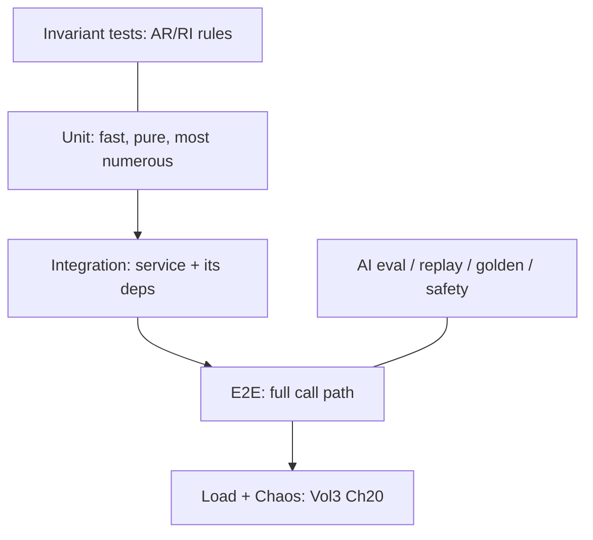
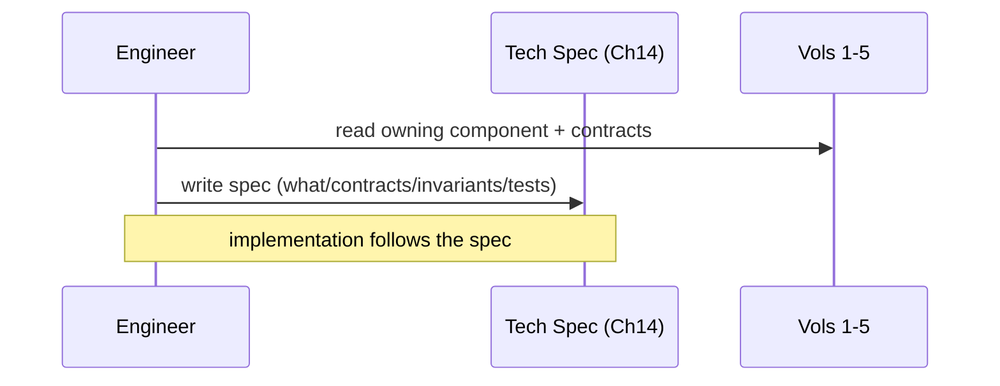
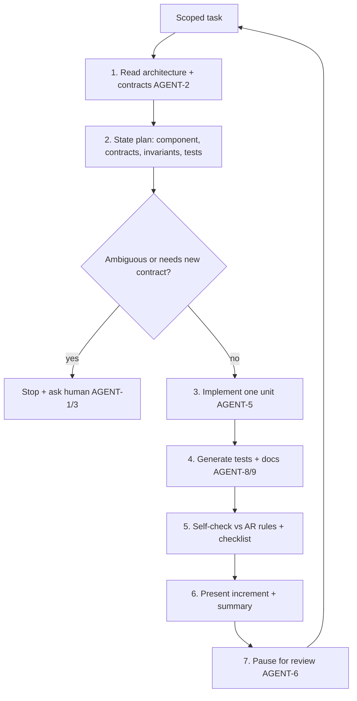
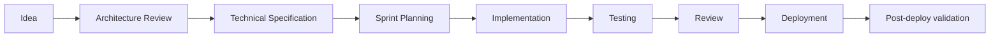

# VoiceOS v2 — Volume 6

## Engineering Standards, Developer Handbook & Implementation Guide

**Status:** Engineering Handbook (Living Document)
**Audience:** Software / AI / backend / platform engineers, SREs, QA, engineering managers — **and AI coding agents** (Claude Code, Cursor, Copilot, future AI IDEs).
**Scope:** How engineers and AI agents *build* VoiceOS according to Volumes 1–5: coding standards, architecture rules, project structure, workflows, testing, documentation, Git, releases, and engineering culture.
**Authority:** Volumes 1–5 are **immutable** and canonical. Volume 6 is **not** an architecture volume — it encodes Vols 1–5 as enforceable engineering practice. Where any standard here appears to conflict with Vols 1–5, Vols 1–5 win and this document is the bug.

---

## How Volume 6 relates to Volumes 1–5 (read first)

Volumes 1–5 define *what* VoiceOS is. Volume 6 defines *how to implement and evolve it without breaking the architecture*. Its central job is to make the architectural invariants **mechanically enforceable** — in lint rules, type contracts, tests, CI gates, code-review checklists, and AI-agent guardrails — so that the system the architecture describes is the system that actually gets built.

| Architectural source | Vol 6 encoding |
|---|---|
| Runtime invariants **RI-1…RI-8** (Vol 1 App. E) | Architecture Rules (Ch 4) + lint/test gates (Ch 9/12/17) |
| **Law of Authority** (Vol 1 RI-5 / Vol 2 Ch 6 / Vol 4 Ch 3) | Mandatory rule AR-3 (Ch 4); AI-dev standards (Ch 8); review checklist (Ch 21) |
| `DecisionEnvelope` / `ResponsePlan` contracts | Event/message + AI-dev standards (Ch 6/8); "always use" rules (Ch 4) |
| **Policy DSL / Policy Engine** (Vol 2 Ch 8 / Vol 4 Ch 4) | "Never hardcode policy" rule (Ch 4); config standards |
| Deterministic prompt (Vol 1 Ch 12 / RI-7) | Prompt-versioning + determinism tests (Ch 8/9) |
| Event log + lineage (Vol 3 Ch 3) | Event/correlation/trace standards (Ch 6) |
| Tenant isolation (Vol 4 Ch 6) | Architecture rule + review/security checklist (Ch 4/21) |
| Idempotency / commit-before-act (Vol 3 Ch 8 / RI-4) | API + data standards (Ch 5/7) |
| Deployment / capacity / runbooks (Vol 3 Ch 21–23) | CI/CD + playbooks (Ch 12/15/19) |
| SaaS multi-tenancy / config-over-customization (Vol 5) | Repo structure + architecture rules (Ch 2/4) |

**Operating principle:** *architecture-first, documentation-first, test-first.* No code is written before the relevant architecture (Vols 1–5) is read; no interface is invented that the architecture already defines; no merge happens without tests and docs. This applies identically to human engineers and AI agents — Chapters 13 and 22 make the agent obligations explicit.

---

## Document conventions

- **MUST / MUST NOT / SHOULD / MAY** carry RFC-2119 weight. A **MUST** is a CI-gate or review-blocker.
- Code examples are **Python 3.12+** unless noted (the backend default); illustrative, not copy-paste-complete.
- "The architecture" = Volumes 1–5. "An agent" = an AI coding tool. "Reviewer" = the human (or agent) performing code review.
- Rule IDs (e.g., **AR-3**, **CS-7**) are stable references usable in PRs, lint configs, and agent prompts.

---

## Table of Contents

| # | Chapter |
|---|---------|
| 1 | Engineering Philosophy |
| 2 | Repository Structure |
| 3 | Coding Standards |
| 4 | Architecture Rules (enforceable) |
| 5 | API Development Standards |
| 6 | Event & Message Standards |
| 7 | Data Modeling Standards |
| 8 | AI Development Standards |
| 9 | Testing Standards |
| 10 | Documentation Standards |
| 11 | Git Workflow |
| 12 | CI/CD Standards |
| 13 | AI Coding Agent Guidelines |
| 14 | Feature Development Workflow |
| 15 | Debugging & Troubleshooting |
| 16 | Performance Optimization |
| 17 | Code Quality Standards |
| 18 | Engineering Metrics |
| 19 | Engineering Playbooks |
| 20 | Sprint Methodology |
| 21 | Code Review Handbook |
| 22 | AI-Assisted Engineering |
| 23 | Engineering Culture |
| 24 | Engineering Decision Records |
| — | Appendix (glossary, templates, checklists) |

---
---

# Chapter 1 — Engineering Philosophy

## 1.1 Purpose

Establish the engineering values that govern every line of VoiceOS code. These are not aspirations; they are the lens through which code is written, reviewed, and accepted. When two values conflict, the ordering in §1.3 resolves it.

## 1.2 The prime directive

**Build the system the architecture describes — no more, no less.** VoiceOS's hard problems (real-time latency, deterministic authority, multi-tenant trust) are already solved in Vols 1–5. The engineer's job is faithful, high-quality implementation, not re-invention. Cleverness that violates an invariant is a defect, however elegant.

## 1.3 Core principles (in priority order)

1. **Correctness & safety first.** The Law of Authority, tenant isolation, and the runtime invariants (RI-1…RI-8) are non-negotiable. Code that risks them does not ship, regardless of other merits.
2. **Reliability.** Favor designs that fail safe, degrade gracefully (Vol 1 Ch 24), and recover deterministically (Vol 3 Ch 7). Bounded everything (RI-3).
3. **Readability & maintainability.** Code is read far more than written. Optimize for the next engineer (or agent) who must understand it under incident pressure. Clear beats clever.
4. **Simplicity.** The simplest design that satisfies the architecture wins. Complexity must earn its place with measured benefit. YAGNI: don't build for imagined futures (the architecture already scoped the real ones).
5. **Testability.** If it's hard to test, it's probably mis-designed. Pure functions, dependency injection, and clear seams are first-class.
6. **Performance where it matters.** The latency budget (Vol 1 Ch 23) is a contract. Optimize the hot path; don't micro-optimize cold paths at readability's expense (Ch 16).

> **Rationale & trade-off.** This ordering deliberately puts safety above performance and simplicity above feature-richness. In a regulated, real-time financial system, a fast-but-unsafe or clever-but-opaque solution costs more than it saves. The trade-off is occasionally writing more verbose, more defensive code than a non-regulated product would.

## 1.4 Documentation-first development

Before non-trivial code: write (or update) the design — what contract, which Vol 1–5 components, what invariants apply, what tests prove it. A short technical spec (Appendix template) precedes implementation. **Rationale:** thinking on paper is cheaper than thinking in code; the spec is the artifact reviewers and agents align on. **Trade-off:** small upfront cost; large savings in rework and review churn.

## 1.5 Architecture-first development

Read the relevant architecture (Vols 1–5) **before** writing code. Identify the owning component, its contracts (interfaces, data models, invariants), and its boundaries. Implement *within* them. **Never invent an interface the architecture already defines.** This is the single most important habit — most defects in a spec-complete system come from drifting off-contract.

## 1.6 Test-first (or test-alongside) development

Tests are written with the code, not after (Ch 9). Prefer writing the failing test that encodes the requirement first. **Rationale:** tests are executable specifications; they pin behavior and catch regressions an agent or refactor might introduce. **Trade-off:** slower first commit, dramatically cheaper change later.

## 1.7 AI-assisted development philosophy

VoiceOS is built with AI coding agents as first-class contributors. The philosophy:

- **Agents are powerful implementers, not architects.** They implement within the architecture (Vols 1–5) and these standards; they do not make architectural decisions (Ch 13/22).
- **Trust but verify.** All agent output is reviewed against the same bar as human output — plus agent-specific checks (no invented interfaces, no bypassed contracts; Ch 13/21).
- **Architecture is the guardrail.** The clearer the contracts (which Vols 1–5 provide), the more safely agents can move fast. Vol 6's rules exist partly so agents have unambiguous constraints.
- **Small, verifiable steps.** Agents implement one scoped unit at a time, generate tests + docs, and pause at milestones (Ch 13) — mirroring how this very specification was built.

## 1.8 What "good" looks like

A merged change: satisfies the architecture; is covered by meaningful tests; reads clearly with rationale where non-obvious; preserves every invariant; updates docs; and leaves the codebase simpler or no more complex than necessary. A reviewer should be able to say *"this is obviously correct and obviously within the architecture."*

## 1.9 Anti-patterns (rejected on sight)

- Re-implementing something Vols 1–5 already define (esp. the Conversation Engine, validators, policy).
- Putting business/authority logic where it doesn't belong (LLM, UI, controllers) — violates the Law of Authority.
- Blocking the real-time path (RI-1), unbounded buffers (RI-3), shared mutable state across threads (RI-2).
- Hardcoding policy/compliance values instead of using the Policy Engine (Vol 4 Ch 4).
- "Temporary" hacks without a tracked debt item (Ch 17).
- Speculative generality / premature abstraction.

## 1.10 Culture in one line

**Own it, document it, test it, keep it safe and simple — and leave it better than you found it.** (Expanded in Ch 23.)

---
---

# Chapter 2 — Repository Structure

## 2.1 Purpose

Define the canonical project layout so any engineer or agent can locate, place, and own code predictably. Structure mirrors the architecture: the bounded contexts and components of Vols 1–5 map to directories with clear ownership.

## 2.2 Repository strategy

VoiceOS uses a **monorepo** for the platform (services, engines, shared contracts, infra, docs) with independently deployable services inside it.

> **Decision (see EDR-V6-002).** Monorepo over polyrepo. **Rationale:** the volumes are tightly contract-coupled (`DecisionEnvelope`, `ResponsePlan`, event schemas); a monorepo makes cross-cutting contract changes atomic, keeps one source of truth for shared types, and simplifies agent navigation (the whole architecture is in one tree). **Trade-off:** needs strong CI selective-build + ownership boundaries to avoid a tangled "distributed monolith." We mitigate with enforced module boundaries (Ch 4) and CODEOWNERS.

## 2.3 Top-level layout

```text
voiceos/
├── README.md                  # entry point: what/why/how-to-run (Ch 10)
├── ARCHITECTURE.md            # index into Vols 1-6 + shared-primitive map
├── CODEOWNERS                 # ownership per path (enforced on PRs)
├── pyproject.toml             # tooling: ruff, mypy, pytest, build (Ch 3/17)
│
├── services/                  # independently deployable services
│   ├── media-gateway/         # Vol1 Ch3-4  (real-time transport, RTP/Twilio)
│   ├── audio-pipeline/        # Vol1 Ch5-6,21-22 (preproc, VAD, playback, output)
│   ├── gpu-scheduler/         # Vol1 Ch7 (admission control, OOM-by-construction)
│   ├── stt/                   # Vol1 Ch8
│   ├── llm-runtime/           # Vol1 Ch13
│   ├── tts/                   # Vol1 Ch15-20 (render, style, Veena, prosody)
│   ├── dialogue-manager/      # Vol1 Ch9
│   ├── conversation-engine/   # Vol1 Ch10 + Vol2 (intelligence layer)
│   ├── reliability/           # Vol3 (event bus, recovery, idempotency, health…)
│   ├── trust/                 # Vol4 (policy engine, authz, audit, ai-safety…)
│   └── platform/              # Vol5 (crm, collections, campaigns, billing…)
│
├── engines/                   # reasoning engines (Vol2) used by conversation-engine
│   ├── intent/  ├── strategy/  ├── negotiation/  ├── risk/
│   ├── empathy/ ├── planning/  ├── memory/        └── evaluation/
│
├── libs/                      # SHARED, versioned contracts + utilities
│   ├── contracts/             # the spine objects: ResponsePlan, DecisionEnvelope,
│   │                          #   TurnInput, AudioFrame, events… (Vol1 App.A)
│   ├── invariants/            # runtime-invariant guards/asserts (RI-1..8)
│   ├── policy/                # Policy Engine client (Vol4 Ch4) — never hardcode
│   ├── telemetry/             # metrics/logs/traces (Vol3 Ch15-17)
│   └── common/                # typed utilities, error types, result types
│
├── apis/                      # public + internal API definitions
│   ├── openapi/               # REST specs (Ch5)  ├── asyncapi/   # events (Ch6)
│   └── sdks/                  # generated client SDKs (Vol5 Ch16)
│
├── frontend/                  # admin portal, dashboards, white-label (Vol5)
│   ├── admin/  ├── analytics/  └── shared-ui/
│
├── ai/                        # AI assets (NOT model weights — those are artifacts)
│   ├── prompts/               # versioned prompt templates (Vol2 Ch19, deterministic)
│   ├── strategies/            # strategy configs (Vol2 Ch4)
│   ├── eval/                  # golden datasets, replay sets, eval harness (Ch9)
│   └── model-configs/         # approved model catalog (Vol5 Ch14)
│
├── infra/                     # IaC: terraform/helm/k8s (Vol3 Ch21-22)
│   ├── modules/  ├── environments/  └── policies/   # OPA/network policy
│
├── deploy/                    # deployment manifests, rollout configs (Vol3 Ch21)
├── config/                    # environment + runtime config (Vol1 App.D) — schema'd
├── scripts/                   # dev/ops scripts (idempotent, documented)
├── tests/                     # cross-service integration/e2e/load/chaos (Ch9)
│   ├── integration/ ├── e2e/ ├── load/ ├── chaos/ └── replay/
└── docs/                      # the handbook + ADRs + runbooks
    ├── architecture/          # Vols 1-6 (canonical)
    ├── adr/                   # architecture decision records (Ch10)
    ├── edr/                   # engineering decision records (Ch24)
    └── runbooks/              # ops runbooks (Vol3 Ch23, Vol4 Ch22)
```

## 2.4 Ownership (every directory has an owner)

`CODEOWNERS` maps each path to a team; PRs touching a path require that team's review (Ch 11/21). Ownership mirrors architecture:

| Path | Owner | Maps to |
|---|---|---|
| `services/media-gateway`, `audio-pipeline`, `gpu-scheduler` | Voice Runtime | Vol 1 |
| `services/conversation-engine`, `engines/*` | Conversation Intelligence | Vol 2 |
| `services/reliability` | Platform/SRE | Vol 3 |
| `services/trust`, `libs/policy` | Security & Governance | Vol 4 |
| `services/platform`, `frontend` | SaaS/Product | Vol 5 |
| `libs/contracts`, `libs/invariants` | **Architecture board (shared)** | Vols 1–5 |
| `ai/prompts`, `ai/strategies`, `ai/eval` | AI Engineering | Vol 2/Vol 5 Ch 14 |
| `docs/*` | All (per area) | Vol 6 |

> **`libs/contracts` and `libs/invariants` are protected.** Changes require architecture-board review (they encode cross-volume contracts). This is the mechanical enforcement of "never invent/bypass a contract" (Ch 4).

## 2.5 Module boundary rules

- A service MUST depend on `libs/contracts` for cross-service types — never copy a contract locally.
- A service MUST NOT import another service's internal modules; cross-service communication is via the defined API/events (Ch 5/6).
- `engines/*` are libraries consumed by `conversation-engine`; they MUST NOT call services directly except through injected clients.
- Dependency direction is enforced in CI (import-linter / module boundaries; Ch 12/17).

## 2.6 What does NOT live in the repo

Model weights, secrets, generated artifacts, and large datasets are **not** in Git. Weights/datasets live in artifact storage (referenced by version, Vol 5 Ch 14); secrets live in the vault (Vol 4 Ch 7). The repo contains *references + configs*, never the binaries or credentials. **Rule CS-secrets:** a secret in the repo is a P0 incident (Vol 4 Ch 17) and a blocked PR (Ch 12 secret scanning).

## 2.7 Naming & placement quick rules

- New shared type → `libs/contracts` (architecture-board PR).
- New reasoning capability → `engines/<name>` (Vol 2 alignment required).
- New platform feature → `services/platform/<context>` (Vol 5 bounded context).
- New prompt → `ai/prompts/<name>/vN` (versioned, Ch 8).
- Unsure? Ask: *which volume owns this concept?* That answers the directory.

---
---

# Chapter 3 — Coding Standards

## 3.1 Purpose

Define the language-level standards that make VoiceOS code uniform, safe, and reviewable. Python is the backend default; these standards are enforced by tooling (ruff, mypy, pytest) in CI (Ch 12/17). Uniformity is a feature: it lets any engineer or agent read any module.

## 3.2 Language & versions

- **Python 3.12+** for backend services/engines. **Rationale:** modern typing, performance, `asyncio` maturity.
- Type-checked with **mypy --strict** (or pyright strict). Formatted + linted with **ruff** (format + lint). These are MUST-pass CI gates (Ch 17).

## 3.3 Type hints (mandatory)

**CS-1 (MUST):** every public function, method, and module-level value is fully type-annotated. No untyped `def` in shipped code; no implicit `Any`.

```python
# GOOD — fully typed, contract-driven
async def build_prompt(plan: ResponsePlan, ctx: CustomerContext) -> ComposedPrompt:
    ...

# BAD — untyped, returns Any, hides the contract
async def build_prompt(plan, ctx):
    ...
```

- Use `libs/contracts` types for anything crossing a boundary (CS-2, MUST).
- Prefer precise types: `Literal`, `NewType`, `TypedDict`/dataclass/pydantic models over bare `dict`/`str`.
- Model "may fail" explicitly: a `Result`/`Either` type or typed exceptions — never silent `None` for errors (CS-3).

## 3.4 Naming

| Kind | Convention | Example |
|---|---|---|
| Module/file | `snake_case` | `prompt_builder.py` |
| Class/type | `PascalCase` | `ResponsePlan`, `GpuScheduler` |
| Function/var | `snake_case` | `build_prompt`, `played_offset` |
| Constant | `UPPER_SNAKE` | `MAX_RETRIES` |
| Private | leading `_` | `_reconcile_offset` |

**CS-4 (MUST):** names match the architecture's vocabulary exactly. A `ResponsePlan` is `ResponsePlan`, not `Plan`/`ResponsePayload`. Domain terms (DPD, PTP, barge-in, TTFT) keep their canonical spelling. **Rationale:** name drift is the leading cause of off-contract code and confuses agents grepping the architecture.

## 3.5 Imports & file organization

- Absolute imports within the monorepo; ordered/grouped (stdlib, third-party, first-party) — enforced by ruff.
- No wildcard imports. No circular imports (CI-checked).
- One public concept per file where reasonable; file name = primary export.
- Module layout: module docstring → imports → constants → types → public API → private helpers.

## 3.6 Async programming (critical — RI-1)

VoiceOS is real-time; async correctness is a safety matter.

**CS-5 (MUST):** the real-time/media path NEVER blocks (RI-1). No synchronous I/O, no `time.sleep`, no CPU-heavy work, no lock held across `await` on the media thread. Offload to workers / executors (Vol 1 App. E, Vol 3 Ch 9).

```python
# BAD — blocking call on an async path (violates RI-1)
def handle_frame(frame: AudioFrame) -> None:
    result = requests.post(url, ...)   # synchronous network I/O — forbidden

# GOOD — non-blocking, offloaded
async def handle_frame(frame: AudioFrame) -> None:
    await self._enqueue(frame)         # bounded queue (RI-3), returns fast
```

- Use `asyncio` structured concurrency (`TaskGroup`); never fire-and-forget without supervision.
- Every queue/buffer is **bounded** with an explicit overflow policy (CS-6, MUST — RI-3).
- Respect **single-writer** ownership of mutable state (CS-7, MUST — RI-2); cross-task communication via queues/messages, not shared mutation.

## 3.7 Error handling

- **CS-8 (MUST):** errors fail safe. In the runtime, an unhandled path degrades down a defined ladder (Vol 1 Ch 24) or ends cleanly — never undefined behavior, never dead air.
- Use specific exception types (from `libs/common`); never bare `except:`; never swallow exceptions silently.
- Authoritative effects use commit-before-act + idempotency (RI-4 / Vol 3 Ch 8) — see Ch 5/7.
- Wrap external calls with timeouts + circuit breakers (Vol 3 Ch 14); a slow dependency must fail fast, not block.

```python
try:
    plan = await engine.plan(turn)
except EngineError as e:
    logger.error("planning_failed", call_id=turn.call_id, error=str(e))
    return safe_fallback_turn(turn)        # fail safe (Vol1 Ch24)
# do NOT: except Exception: pass
```

## 3.8 Logging (structured)

- **CS-9 (MUST):** structured JSON logs via `libs/telemetry`, keyed with `call_id`, `correlation_id`, `trace_id` (Vol 3 Ch 16).
- **CS-10 (MUST):** NEVER log PII/secrets in clear — redaction at emission (Vol 4 Ch 10/16). A PII leak in logs is a P1.
- Log levels: ERROR (action needed), WARN (degraded), INFO (state transitions), DEBUG (dev only, sampled). No `print()`.
- Logging is async/non-blocking on the media path (RI-1).

## 3.9 Dependency management

- Pinned, hash-locked dependencies (`pyproject.toml` + lockfile). Reproducible builds (Ch 12).
- New dependencies require justification + security/license review (Vol 4 Ch 19 vendor assessment) in the PR.
- Prefer the standard library and existing `libs/*` before adding a dependency. Minimize the dependency surface (supply-chain risk, Vol 4 Ch 20).

## 3.10 Comments & docstrings

- Docstrings on every public symbol: what it does, key params/returns, and **which architecture contract/invariant it implements** (e.g., "Enforces RI-5: facts are re-read, never inferred").
- Comments explain **why**, not **what** (the code says what). Flag every non-obvious decision and every invariant touchpoint.
- TODOs MUST link a tracked issue (`# TODO(VOICE-1234): ...`); untracked TODOs fail review (Ch 17).

## 3.11 Frontend standards (brief)

Frontend (`frontend/*`) follows the analogous discipline: TypeScript strict, the design-system components (Vol 5 white-label), typed API clients generated from `apis/openapi`, no business/authority logic in the client (AR-2, Ch 4), and tenant-scoping respected in every request. Detailed FE standards live in `frontend/README.md`.

---
---

# Chapter 4 — Architecture Rules (Enforceable)

## 4.1 Purpose

Translate Volumes 1–5 into **mandatory, checkable engineering rules**. Each rule has an ID, a MUST/MUST-NOT statement, its architectural source, and how it is enforced (lint, type, test, review, or CI gate). Violating an **AR** rule blocks merge. These are the rules an AI agent is handed as hard constraints (Ch 13).

## 4.2 How rules are enforced

Each rule names an enforcement mechanism: **[type]** (compiler/mypy), **[lint]** (ruff/custom AST rule), **[test]** (required test), **[CI]** (pipeline gate), **[review]** (mandatory reviewer check, Ch 21). Where possible, rules are mechanized; the rest are review-blockers with explicit checklist items.

## 4.3 The mandatory rules

### Authority & conversation integrity

- **AR-1 — Never bypass the Conversation Engine. [review][test]**
  All business/state/decision logic flows through `conversation-engine` (Vol 1 Ch 10 / Vol 2). Controllers, the LLM runtime, the UI, and platform services MUST NOT make collections/state/authority decisions. *Source: Vol 1 Ch 10, Vol 2.* *Check: no business logic outside `conversation-engine`/`engines`; import-boundary lint + review.*

- **AR-2 — The LLM never owns business logic or authoritative facts. [review][test]**
  Money, state, consent, identity, and policy outcomes are computed deterministically and injected; the LLM only renders language. *Source: Law of Authority, Vol 1 RI-5 / Vol 2 Ch 6.* *Check: facts in `ResponsePlan` carry provenance; tests assert the model cannot originate an authoritative value (Ch 8/9).*

- **AR-3 — Never violate the Law of Authority. [review][test]**
  Authoritative facts are read from the system of record (Vol 5 Ch 4/5) and re-read on recovery (RI-5) — never inferred, never reconstructed by the model. *Source: Vol 1 RI-5, Vol 4 Ch 3.* *Check: provenance assertions; red-team tests (Vol 4 Ch 21) prove no prompt yields an unauthorized effect.*

- **AR-4 — Always use `ResponsePlan` as the unit of agent output. [type][review]**
  Every turn is produced as a sealed, versioned `ResponsePlan` (Vol 2 Ch 15); nothing reaches rendering/TTS without one. *Source: Vol 2 Ch 15.* *Check: `libs/contracts` types; the render path accepts only `ResponsePlan`.*

- **AR-5 — Always record decisions as `DecisionEnvelope` lineage. [type][test]**
  Every consequential decision emits a `DecisionEnvelope` (Vol 2 Ch 15) into the event log (Vol 3 Ch 3) — the shared reasoning/audit/replay/analytics substrate. *Source: Vol 2 Ch 15 / Vol 3 Ch 3 / Vol 4 Ch 11 / Vol 5 Ch 11.* *Check: decision points emit envelopes; lineage-coverage test.*

- **AR-6 — Never bypass Output Validation. [review][test]**
  Nothing reaches TTS without passing the Output Validator (Vol 1 Ch 14) / Output Evaluation (Vol 2 Ch 17). *Source: Vol 1 Ch 14.* *Check: render path is gated; test asserts unvalidated text cannot be synthesized.*

### Policy & compliance

- **AR-7 — Never hardcode policy/compliance values. [lint][review]**
  Regulatory rules, thresholds, `must_say`/`must_not_say`, retention, and entitlements come from the Policy Engine (Vol 4 Ch 4) / Policy DSL (Vol 2 Ch 8) — never literals in code. *Source: Vol 4 Ch 4, Vol 2 Ch 8.* *Check: lint flags suspected policy literals; review confirms Policy-Engine usage.*

- **AR-8 — Tenant isolation is absolute. [type][test][review]**
  Every data access, query, and resource use is tenant-scoped; cross-tenant access is impossible by construction. *Source: Vol 4 Ch 6 / Vol 5 Ch 2.* *Check: tenant predicate enforced at the data layer; isolation tests + pen-test (Vol 4 Ch 21). A breach is P0.*

### Runtime invariants (RI-1…RI-8)

- **AR-9 — Never block the real-time/media thread. [lint][review]** (RI-1) *Check: AST lint for sync I/O/sleep/blocking calls on async media paths; review.*
- **AR-10 — Single writer per mutable state. [review]** (RI-2) *Check: ownership documented per component (Vol 1 App. B); review.*
- **AR-11 — All buffers/queues bounded with overflow policy. [lint][review]** (RI-3) *Check: unbounded queue constructors flagged; review.*
- **AR-12 — Commit before externally-visible act. [test][review]** (RI-4) *Check: effect tests assert durable commit precedes action; idempotency keys present (Vol 3 Ch 8).*
- **AR-13 — Prompt building is deterministic. [test]** (RI-7) *Check: same sealed plan + versions ⇒ identical prompt (hash test, Vol 1 Ch 12).*
- **AR-14 — GPU work goes through the scheduler; no direct OOM-risking allocation. [review]** (RI-8) *Source: Vol 1 Ch 7. Check: inference via scheduler client only.*

### Idempotency, events, data

- **AR-15 — Authoritative effects are idempotent. [test]** Deterministic idempotency keys + atomic execute-and-record (Vol 3 Ch 8). *Check: duplicate-effect test = 0 duplicates.*
- **AR-16 — Events follow the event/lineage contract. [type][CI]** Naming, versioning, correlation/trace IDs per Ch 6. *Check: schema validation in CI (asyncapi).*
- **AR-17 — Migrations are backward-compatible + reversible. [CI][review]** (Ch 7) *Check: migration CI test (up/down, expand-contract).*

### Boundaries & secrets

- **AR-18 — No cross-service internal imports; communicate via API/events. [CI]** (Ch 2) *Check: import-linter.*
- **AR-19 — No secrets/PII in code, logs, or repo. [CI][lint]** *Source: Vol 4 Ch 7/10. Check: secret scanning + PII-in-log lint. A hit is P0/P1.*
- **AR-20 — Never invent an interface the architecture defines; reuse `libs/contracts`. [review]** *The anti-drift rule; primary agent guardrail (Ch 13).*

## 4.4 Rule conflicts & exceptions

If two rules appear to conflict, the safety/authority rules (AR-1…AR-8) win. **Exceptions require an EDR (Ch 24) + architecture-board approval** — there is no informal waiver. An undocumented violation is a defect, not a style choice.

## 4.5 Mechanization roadmap

Rules marked **[lint]/[type]/[CI]/[test]** are (or are being) mechanized so violations fail automatically; **[review]**-only rules are on the Code Review checklist (Ch 21) and the AI Coding checklist (Appendix). The goal: every AR rule eventually has an automated gate so neither humans nor agents can merge a violation.

---
---

# Chapter 5 — API Development Standards

## 5.1 Purpose

Standardize how APIs are designed and built so they're consistent, secure, evolvable, and inherit the platform's trust controls (Vol 4 Ch 12 / Vol 5 Ch 16). Applies to public/tenant APIs, internal service APIs, and WebSockets.

## 5.2 Design-first

**API-DS-1 (MUST):** APIs are designed spec-first — REST in `apis/openapi`, events in `apis/asyncapi` (Ch 6) — reviewed before implementation. SDKs/clients are generated from the spec (no hand-written drift). *Rationale:* the spec is the contract; codegen keeps server, client, and docs aligned.

## 5.3 REST conventions

- Resource-oriented, plural nouns: `/v1/campaigns`, `/v1/loans/{loan_id}/ptp`.
- Standard verbs/semantics: GET (safe), POST (create/action), PUT/PATCH (update), DELETE. GET MUST be side-effect-free.
- Status codes used correctly: 200/201/204, 400 (validation), 401/403 (authn/authz), 404, 409 (conflict), 422, 429 (rate limit), 5xx.
- Snake_case JSON fields matching `libs/contracts`. Timestamps ISO-8601 UTC. Money as minor units + currency, never floats.

## 5.4 Request validation (mandatory)

**API-DS-2 (MUST):** every request is schema-validated at the boundary (allow-list, size caps) before processing — the Vol 4 Ch 12 pipeline. Reject unknown/oversized/malformed input. Validation is the first line; never trust the client.

```python
class CreatePtpRequest(BaseModel):       # pydantic, strict
    amount: Money
    promised_date: date
    model_config = ConfigDict(extra="forbid")   # reject unknown fields
```

## 5.5 Response schemas & errors

- Typed response models; consistent envelope. List endpoints paginate (cursor-based, see §5.7).
- **Uniform error shape** (no leaking internals/stack traces):

```json
{ "error": { "code": "PTP_DATE_INVALID", "message": "promised_date must be in the future",
             "request_id": "01J...", "details": [] } }
```

- Error `code`s are stable, documented enums. `request_id` ties to the trace (Ch 6). Never return PII or secrets in errors (AR-19).

## 5.6 Versioning

**API-DS-3 (MUST):** public APIs are URL-versioned (`/v1`, `/v2`); changes are backward-compatible within a version. Breaking changes go to a new version with a deprecation window (Vol 5 Ch 16). Additive fields are non-breaking; removing/renaming/retyping is breaking.

## 5.7 Pagination

Cursor-based pagination for collections (stable under inserts): `?limit=50&cursor=...` → `{ items, next_cursor }`. Bound `limit` (default + max). Offset pagination only for small, stable admin lists.

## 5.8 Idempotency

**API-DS-4 (MUST):** all non-idempotent state-changing endpoints (esp. authoritative effects — PTP, payment, settlement) accept an `Idempotency-Key` and dedup via Vol 3 Ch 8. Retried requests return the original result, never a duplicate effect (AR-15).

```python
@router.post("/v1/loans/{loan_id}/ptp")
async def create_ptp(loan_id: LoanId, req: CreatePtpRequest,
                     idempotency_key: str = Header(...)) -> PtpResponse:
    return await collections.capture_ptp(_to_ptp(loan_id, req),
                                         IdempotencyKey(idempotency_key))   # Vol3 Ch8
```

## 5.9 Authentication & authorization

**API-DS-5 (MUST):** every endpoint authenticates (Vol 4 Ch 5) and authorizes via the PDP (Vol 4 Ch 6) with tenant scoping (AR-8). No endpoint is unauthenticated except explicitly public health checks. Service-to-service uses mTLS (Vol 4 Ch 5). Authz happens before business logic, not inside it.

## 5.10 Rate limiting & quotas

**API-DS-6 (MUST):** public endpoints enforce per-tenant/per-key rate limits + quotas (Vol 4 Ch 12 / Vol 3 Ch 4). 429 with `Retry-After`. Limits are policy-driven (AR-7), not hardcoded.

## 5.11 WebSocket conventions

- Authenticate on connect; authorize the session; validate every inbound frame (Vol 4 Ch 12).
- Bounded message size + per-connection rate limits; close on protocol abuse.
- Typed message envelopes with a `type` discriminator; versioned like REST.
- Backpressure-aware (don't unboundedly buffer outbound) — RI-3.

## 5.12 Performance & reliability

- Endpoints have latency budgets; the call-path ones respect Vol 1 Ch 23. Slow dependencies are timeout + breaker wrapped (Vol 3 Ch 14).
- Long operations are async with a status resource (202 + polling/webhook), never a blocked request.
- All endpoints emit metrics + traces (Ch 6, Vol 3 Ch 15/17).

## 5.13 API review checklist (gate)

Before merge, an API PR MUST satisfy: spec-first + codegen (API-DS-1); validation (API-DS-2); typed responses + uniform errors; correct versioning; idempotency where needed (API-DS-4); authn+authz+tenant scope (API-DS-5); rate limits (API-DS-6); pagination on collections; metrics/traces; docs updated (Ch 10). (Full checklist in Appendix.)

---

---
---

# Chapter 6 — Event & Message Standards

## 6.1 Purpose

Standardize how events and messages are named, versioned, contracted, and traced — so the event log (Vol 3 Ch 3) stays the reliable, replayable, auditable spine it is across Vols 2–5. Events are first-class contracts: getting them right is what makes deterministic replay (Vol 3 Ch 7), idempotency (Vol 3 Ch 8), audit (Vol 4 Ch 11), and analytics (Vol 5 Ch 11) work.

## 6.2 Event vs. message

- **Domain event** — a fact that happened (`ptp.captured`, `call.ended`). Immutable, appended to the event log (Vol 3 Ch 3), consumed by many. Past tense.
- **Command/queue message** — a request to do work (`send.sms`, `synthesize.tts`). Transient, queued (Vol 3 Ch 10), consumed once. Imperative.

**EV-1 (MUST):** know which you're emitting. Events describe the past and don't assume a consumer; commands request the future and target a handler.

## 6.3 Naming

**EV-2 (MUST):** events are `<aggregate>.<event>` in `snake_case`, past tense: `loan.dpd_updated`, `ptp.broken`, `consent.captured`, `decision.made`. Commands are `<verb>.<object>`: `dispatch.webhook`, `meter.usage`. Names match the architecture's vocabulary (CS-4). No abbreviations beyond the canonical domain set (DPD, PTP, RPC).

## 6.4 Event contracts & schema

**EV-3 (MUST):** every event has a versioned schema in `apis/asyncapi`, validated in CI (AR-16). Events use `libs/contracts` types. Required envelope on every event:

```python
class EventEnvelope(BaseModel):
    event_id: ULID                    # unique, sortable (also the dedup key, Vol3 Ch8)
    event_type: str                   # "ptp.captured"
    schema_version: int               # bump on breaking change (EV-5)
    tenant_id: TenantId               # tenant scoping (AR-8) — never optional
    occurred_at: datetime             # UTC
    correlation_id: str               # the turn/request (Ch 6.7)
    causation_id: str | None          # the event/command that caused this
    trace_id: str                     # distributed trace (Vol3 Ch17)
    payload: EventPayload             # typed per event_type
    # for lineage events:
    lineage_ref: LineageRef | None    # link to DecisionEnvelope (Vol2 Ch15)
```

## 6.5 Versioning & compatibility

**EV-4 (MUST):** evolve events **additively** within a `schema_version` — new optional fields only; never remove/rename/retype. **EV-5 (MUST):** a breaking change bumps `schema_version` and supports both versions through a migration window (consumers tolerate the old). *Rationale:* the event log is append-only and replayed historically (Vol 3 Ch 7) — old events must remain readable forever. **Consumers MUST ignore unknown fields** (forward-compat).

## 6.6 Domain events & lineage

**EV-6 (MUST):** every consequential decision emits a `DecisionEnvelope` event (AR-5) — the same object that is reasoning record (Vol 2), event-sourcing log (Vol 3), audit trail (Vol 4), and analytics substrate (Vol 5). Do **not** invent a parallel decision/audit event; reference the lineage (`lineage_ref`). **EV-7 (MUST):** authoritative-effect events (PTP, settlement, payment) are emitted commit-before-act (RI-4) and carry the idempotency key (Vol 3 Ch 8).

## 6.7 Correlation, causation, trace IDs

- **`correlation_id`** — groups everything for one logical operation (a turn/request). Set at ingress; propagated everywhere (RI-1 boundaries included).
- **`causation_id`** — the immediate cause (enables a causal graph for forensics).
- **`trace_id`** — the OpenTelemetry trace (Vol 3 Ch 17); spans link to it.

**EV-8 (MUST):** all three propagate across every thread/async/network/GPU hop (Vol 3 Ch 17). A broken correlation chain is a debuggability defect (Ch 15). Logs (Vol 3 Ch 16) carry the same IDs (CS-9).

## 6.8 Queue messages

- Commands are idempotent at the consumer (dedup by `event_id`/key, Vol 3 Ch 8) — at-least-once delivery is assumed (AR-15).
- Bounded queues + retry-with-backoff → DLQ (Vol 3 Ch 10). Poison messages dead-letter, never block.
- Priority + delay semantics per Vol 3 Ch 10; never starve latency-critical work.

## 6.9 Producing & consuming (patterns)

```python
# Producing a domain event (typed, enveloped, lineage-linked)
await events.emit(EventEnvelope(
    event_id=new_ulid(), event_type="ptp.captured", schema_version=1,
    tenant_id=ctx.tenant_id, occurred_at=utcnow(),
    correlation_id=ctx.correlation_id, causation_id=ctx.cause,
    trace_id=ctx.trace_id, payload=PtpCapturedV1(ptp_id=ptp.id, amount=ptp.amount),
    lineage_ref=plan.lineage_ref,                       # AR-5
))

# Consuming idempotently
async def on_ptp_captured(ev: EventEnvelope) -> None:
    if await dedup.seen(ev.event_id):     # Vol3 Ch8
        return
    ...                                   # process exactly once
```

## 6.10 Event standards checklist (gate)

Enveloped + typed (EV-3); past-tense name (EV-2); tenant-scoped (AR-8); versioned + additive (EV-4/5); lineage/idempotency where applicable (EV-6/7); IDs propagated (EV-8); schema in `apis/asyncapi` + CI-validated (AR-16); consumer idempotent (AR-15). (Full checklist in Appendix.)

---
---

# Chapter 7 — Data Modeling Standards

## 7.1 Purpose

Standardize database schemas, naming, migrations, relationships, indexing, and compatibility so data is correct, evolvable, tenant-isolated, and performant — consistent with the persistence design (Vol 3 Ch 5), tenant isolation (Vol 4 Ch 6), and encryption (Vol 4 Ch 8).

## 7.2 Store selection

Use the store the architecture assigns (Vol 3 Ch 5): Postgres for authoritative/relational (loans, PTPs, consent), the event log for events/lineage (Vol 3 Ch 3), Redis for hot/non-authoritative state (Vol 3 Ch 4), object storage for blobs/recordings. **DM-1 (MUST):** never make Redis authoritative; never put authoritative effects only in a cache.

## 7.3 Schema & naming

- Tables `snake_case`, plural: `loan_accounts`, `promise_to_pays`. Columns `snake_case`. PKs are ULIDs/UUIDs (sortable preferred), not auto-increment ints (shardability, no enumeration).
- **DM-2 (MUST):** every tenant-scoped table has a non-null `tenant_id` column, indexed, and enforced in every query (AR-8). Consider row-level security as defense-in-depth.
- Money as `(amount_minor BIGINT, currency CHAR(3))` — never float. Timestamps `timestamptz` (UTC). Enums as typed/checked values matching `libs/contracts`.

## 7.4 Relationships

- Model the domain faithfully (Vol 5 Ch 4–5): borrower/co-borrower/guarantor, loans→installments, ptp→loan. Foreign keys enforced; cascade rules explicit (esp. for erasure, Vol 4 Ch 9).
- **DM-3 (MUST):** relationships never cross tenants. A FK from tenant A's row to tenant B's is impossible by construction.

## 7.5 Indexing

- Index for the access patterns the architecture implies: tenant + DPD bucket (campaign selection, Vol 5 Ch 6), tenant + customer (context assembly, Vol 5 Ch 4), event log by `correlation_id`/`occurred_at` (forensics).
- **DM-4 (SHOULD):** justify each index (write cost vs read benefit); avoid redundant/unused indexes. Composite indexes lead with `tenant_id`.

## 7.6 Migrations

**DM-5 (MUST):** all schema changes are migrations (versioned, in-repo, reviewed) — never manual prod DDL. **DM-6 (MUST):** migrations are backward-compatible using **expand → migrate → contract** (AR-17), so rollout/rollback is zero-downtime (Vol 3 Ch 21):

1. **Expand:** add new column/table (nullable/defaulted), deploy code that writes both.
2. **Migrate:** backfill; switch reads to new.
3. **Contract:** stop writing old; later, drop old (separate migration, after a safe window).

```text
# BAD: rename column in one migration (breaks running old code mid-rollout)
ALTER TABLE loans RENAME COLUMN bal TO outstanding;     # ✗

# GOOD: expand-contract
# v1: ADD COLUMN outstanding ...; backfill; dual-write
# v2 (later): DROP COLUMN bal;                          # ✓
```

**DM-7 (MUST):** every migration has a tested rollback (down) and is exercised in CI (AR-17).

## 7.7 Versioning & backward compatibility

- Schemas evolve additively (mirror EV-4). Reads tolerate both shapes during migration.
- Authoritative records are append-friendly; correcting data is a new record/event + audit (Vol 4 Ch 11), not a silent in-place edit of history.

## 7.8 Security & privacy in data

- **DM-8 (MUST):** sensitive fields encrypted (Vol 4 Ch 8); high-sensitivity PII tokenized (Vol 4 Ch 10). Per-tenant keys enable crypto-shред erasure (Vol 4 Ch 9 / Vol 5 Ch 3).
- Retention metadata on PII tables drives automated retention (Vol 3 Ch 5). Erasure = crypto-shred + tombstone, never a history-rewriting delete of audit.

## 7.9 Data modeling checklist (gate)

Right store (DM-1); tenant_id present + indexed + enforced (DM-2/AR-8); money/time correct types; FKs + no cross-tenant refs (DM-3); justified indexes (DM-4); expand-contract migration with tested rollback (DM-5/6/7); encryption/tokenization for sensitive (DM-8); retention metadata. (Full checklist in Appendix.)

---
---

# Chapter 8 — AI Development Standards

## 8.1 Purpose

Standardize how engineers build and change the AI parts of VoiceOS — prompts, `ResponsePlan`/`DecisionEnvelope` usage, retrieval, memory, strategy, risk, prompt versioning, and model upgrades — so AI work stays inside the Law of Authority and the determinism/safety contracts (Vols 1–2, Vol 4 Ch 3/14). This chapter governs *building* the AI; runtime config is Vol 5 Ch 14.

## 8.2 The cardinal AI rule

**AI-DS-1 (MUST):** the model renders language; it never owns facts, money, state, policy, or decisions (AR-2/AR-3, Law of Authority). Every AI feature is designed so that a wrong or adversarial model output cannot cause an unauthorized effect — because the authoritative values are deterministic and the output is validated (Vol 1 Ch 14 / Vol 2 Ch 6/17). If you can't state how the Law of Authority holds for your feature, the design is wrong.

## 8.3 Prompt engineering

- **AI-DS-2 (MUST):** prompts are built by the deterministic Prompt Builder (Vol 1 Ch 12); same sealed plan + versions ⇒ identical prompt (RI-7, AR-13). No nondeterministic prompt assembly (no unsorted dict iteration, no wall-clock, no random) — enforced by the determinism test (Ch 9).
- **AI-DS-3 (MUST):** prompts are versioned artifacts in `ai/prompts/<name>/vN` (Vol 2 Ch 19); they contain **policy/instructions, never secrets** (a prompt is not a credential, Vol 4 Ch 13).
- Facts in the prompt come from `ResponsePlan` (provenance-tagged), not free text. Minimize/redact PII into prompts (Vol 2 Ch 19 / Vol 4 Ch 10).

## 8.4 `ResponsePlan` usage

- **AI-DS-4 (MUST):** every turn is a sealed `ResponsePlan` (AR-4) constructed by the Conversation Engine/engines — never assembled ad hoc in a controller or the LLM runtime. Populate `must_say`/`must_not_say` from the Policy Engine (AR-7), facts from the system of record (Vol 5 Ch 4–5).
- The plan is the **governed, auditable, billable, analyzable** unit (Vol 4 Ch 3 / Vol 5 Ch 11) — treat it as the contract it is.

## 8.5 `DecisionEnvelope` usage

- **AI-DS-5 (MUST):** every consequential decision emits a `DecisionEnvelope` with `{decision, confidence, reasoning, evidence, timestamp, source_engine, version}` (Vol 2 Ch 15) into the lineage (AR-5). This is what makes explainability (Vol 4 Ch 3), deterministic replay (Vol 3 Ch 7), and outcome attribution (Vol 5 Ch 11) work — it is not optional instrumentation.

## 8.6 Retrieval, memory, strategy, risk

- **Retrieval (Vol 2 Ch 20):** tenant-isolated knowledge bases (no cross-tenant retrieval, AR-8); retrieved facts are evidence, not authority. Cite/score; never let retrieval inject unverified authoritative claims.
- **Memory (Vol 2 Ch 10):** Working Memory is bounded (RI-3); Relationship Memory is the system of record's view, not model memory. Don't store authority in model-facing memory.
- **Strategy (Vol 2 Ch 4):** strategies are config-selected (Vol 5 Ch 14); strategy chooses *approach*, never overrides policy/risk (Four-Class Hierarchy, Vol 2 Ch 1).
- **Risk evaluation (Vol 2 Ch 6):** the Risk Engine can veto; it is never overridden by strategy or fluency. Output Evaluation (Vol 2 Ch 17) is ≥ as strict as Policy.

## 8.7 Prompt versioning & rollout

**AI-DS-6 (MUST):** prompt changes are versioned (Vol 2 Ch 19), validated for determinism (AR-13) + safety/compliance (Vol 4 Ch 3/14), and rolled out staged (test → canary → full) via the AI Config Platform (Vol 5 Ch 14) with rollback. Evaluate against golden sets + replay (Ch 9) before promotion. Never hot-edit a prod prompt without versioning.

## 8.8 Model upgrades

**AI-DS-7 (MUST):** model changes (STT/LLM/TTS) use the approved catalog (Vol 5 Ch 14), pass the eval suite (Ch 9: quality, latency budget Vol 1 Ch 23, safety Vol 4 Ch 14, determinism of the *path*), and roll out via canary with monitoring (Vol 5 Ch 11). A model upgrade is an EDR-worthy change (Ch 24) when it shifts behavior materially. Never swap a model without eval-gating.

## 8.9 AI testing (pointer)

AI changes require AI-specific tests (Ch 9.7): golden-dataset eval, conversation replay, determinism, safety/red-team (Vol 4 Ch 21), and latency-budget checks. AI code without these is incomplete.

## 8.10 AI development checklist (gate)

Law of Authority stated + held (AI-DS-1); deterministic versioned prompt, no secrets (AI-DS-2/3); sealed `ResponsePlan` (AI-DS-4); `DecisionEnvelope` emitted (AI-DS-5); retrieval/memory/strategy/risk within their contracts (8.6); staged + eval-gated rollout (AI-DS-6/7); AI tests present (Ch 9). (Full checklist in Appendix.)

---
---

# Chapter 9 — Testing Standards

## 9.1 Purpose

Define what "tested" means for VoiceOS so changes are safe to ship and regressions are caught automatically. Testing here is layered (unit → integration → e2e → load/chaos) plus **AI-specific** testing (eval, replay, golden datasets) and **invariant** testing (the AR/RI rules). Tests are the executable encoding of the architecture.

## 9.2 The testing pyramid (+ AI layer)



## 9.3 Unit testing

- **TEST-1 (MUST):** pure logic (engines, validators, planners, builders) is unit-tested in isolation with no I/O. Deterministic; milliseconds.
- Test behavior + contracts, not implementation details. One logical assertion-theme per test. Use builders/factories for `libs/contracts` objects.
- **Invariant unit tests** encode AR/RI rules: e.g., "Prompt Builder is deterministic" (AR-13), "Output Validator rejects out-of-envelope amount" (AR-6), "effect is idempotent" (AR-15).

## 9.4 Integration testing

- **TEST-2 (MUST):** each service is tested against its real dependencies (DB, Redis, event bus) via containers — not mocks for the things mocks hide (SQL, serialization, transactions). Cover tenant isolation (AR-8) explicitly.

## 9.5 End-to-end testing

- **TEST-3 (MUST):** the full call path (media → STT → engine → LLM → validate → TTS → playback) has e2e coverage using the audio-injection harness (Vol 3 Ch 20) against a prod-parity stack. Assert correct behavior **and** the latency budget (Vol 1 Ch 23).

## 9.6 Load & chaos testing

- **TEST-4 (MUST for runtime-affecting changes):** load + chaos via the Vol 3 Ch 20 framework. Acceptance gates: e2e first-audio p95 ≤ 1.5 s; **0 OOM, 0 recoverable-call drops, 0 duplicate effects**; no leaks under soak. Chaos kills components mid-load and asserts deterministic recovery (Vol 3 Ch 7).

## 9.7 AI evaluation, replay & golden datasets

- **TEST-5 (MUST for AI changes):**
  - **Golden datasets** (`ai/eval`): curated inputs → expected behaviors (intent, compliance, PTP handling). Versioned; reviewed.
  - **Conversation replay:** replay recorded calls (using recorded decisions, Vol 3 Ch 7) to detect behavioral regressions deterministically.
  - **Quality eval:** score against Vol 2 Ch 22 quality + Vol 4 Ch 14 safety (toxicity/bias/compliance/hallucination).
  - **Determinism:** assert prompt determinism (AR-13) and path reproducibility.
  - **Red-team:** prompt-injection/jailbreak suite (Vol 4 Ch 21) — assert **0 unauthorized effects** (Law of Authority holds).

## 9.8 Regression testing

- **TEST-6 (MUST):** every fixed bug gets a regression test that fails before the fix and passes after (Ch 19 playbook). Every confirmed AI failure adds a golden/replay case. The suite only grows.

## 9.9 Coverage expectations

- **TEST-7 (targets, enforced in CI where listed):**
  - Core logic (engines, validators, planners, contracts, `libs/*`): **≥ 90%** line + meaningful branch coverage. **[CI gate]**
  - Services overall: **≥ 80%**. **[CI gate]**
  - The runtime invariants (AR/RI) and authoritative effects: **100% of rules have an explicit test.** **[CI gate]**
  - Coverage is a floor, not a goal — a 90%-covered wrong test is worthless. Review judges test *quality* (Ch 21).

## 9.10 Test hygiene

- Tests are deterministic (no real time/network/randomness unless seeded); flaky tests are quarantined + fixed, never `@skip`-and-forgotten.
- Fast feedback: unit suite < 2 min locally; full CI suite bounded (Ch 12). Parallelizable.
- Test code is production code: typed, reviewed, owned.

## 9.11 Definition of Done (testing slice)

A change is not done until: new logic has unit tests; cross-component behavior has integration/e2e; AI changes have eval/replay/red-team; bugs have regression tests; coverage gates pass; invariant tests cover any AR/RI touched. (Full DoD in Ch 20.)

---
---

# Chapter 10 — Documentation Standards

## 10.1 Purpose

Define what must be documented, where, and how — so knowledge lives in the repo, not in heads, and so both new engineers and AI agents can self-serve. Documentation-first (Ch 1) means docs precede or accompany code, never trail it.

## 10.2 The documentation map

| Doc type | Lives in | When |
|---|---|---|
| Architecture (canonical) | `docs/architecture` (Vols 1–6) | source of truth; rarely changes |
| ADR (architecture decision) | `docs/adr` | any architecture-affecting decision |
| EDR (engineering decision) | `docs/edr` | any engineering-standard decision (Ch 24) |
| API docs | `apis/openapi` + `apis/asyncapi` | spec-first, generated (Ch 5/6) |
| Runbooks | `docs/runbooks` | per Vol 3 Ch 23 / Vol 4 Ch 22 |
| Service README | each service dir | what/why/run/own |
| Code docs | docstrings/comments | with the code (Ch 3) |
| Changelog | `CHANGELOG.md` per service | every release (Ch 11) |

## 10.3 ADRs & EDRs

- **DOC-1 (MUST):** any decision that affects the architecture gets an **ADR**; any decision that affects engineering standards gets an **EDR** (Ch 24). Format (Appendix template): Context · Alternatives · Decision · Trade-offs · Risks · Future. Immutable once accepted; superseded by a new record, never edited away. *Rationale:* decisions outlive their authors; the "why" prevents re-litigation and guides agents.

## 10.4 API documentation

- **DOC-2 (MUST):** APIs are documented by their `openapi`/`asyncapi` specs (Ch 5/6) — the single source, from which docs + SDKs generate. Hand-written API docs that can drift are forbidden. Every endpoint/event: purpose, schema, errors, examples, auth, idempotency.

## 10.5 Architecture docs & diagrams

- Architecture lives in Vols 1–6 (`docs/architecture`); feature specs reference them, never re-describe them.
- **DOC-3 (MUST):** non-trivial flows include a **Mermaid** diagram. Use the right type: `flowchart` (components/data flow), `sequenceDiagram` (interactions over time), `stateDiagram-v2` (lifecycles), `erDiagram` (data). Diagrams match the volume conventions so they read consistently. Keep diagrams in-repo (text, diff-able), never as opaque images.



## 10.6 Code comments & docstrings

Per Ch 3.10: docstrings on public symbols stating the contract/invariant implemented; comments explain *why*; TODOs link issues. **DOC-4 (MUST):** any code touching an AR/RI invariant names it in a comment (e.g., `# RI-5: re-read authoritative facts, never infer`) so reviewers and agents see the constraint at the point of code.

## 10.7 README standards

Every service README (DOC-5, MUST): one-paragraph purpose + which volume it implements; how to run/test locally; key contracts it owns/consumes; owner (CODEOWNERS); links to the relevant architecture chapters. A new engineer should run the service from the README alone.

## 10.8 Changelog

- **DOC-6 (MUST):** every service maintains a `CHANGELOG.md` (Keep-a-Changelog style) updated each release with Added/Changed/Fixed/Deprecated/Removed/Security, tied to semver (Ch 11). Breaking changes are called out loudly.

## 10.9 Documentation checklist (gate)

Spec written/updated (Ch 14); ADR/EDR if a decision was made (DOC-1); API specs updated + generated (DOC-2); Mermaid for non-trivial flows (DOC-3); docstrings + invariant comments (DOC-4); README current (DOC-5); changelog entry (DOC-6). (Full checklist in Appendix.)

---
---

# Chapter 11 — Git Workflow

## 11.1 Purpose

Define the version-control workflow so collaboration is safe, history is meaningful, and releases are controlled. The workflow is lightweight but strict where it protects the architecture (protected paths, required reviews).

## 11.2 Branching strategy

VoiceOS uses **trunk-based development with short-lived feature branches**.

> **Decision (EDR-V6-006).** Trunk-based over long-lived GitFlow branches. **Rationale:** short-lived branches + continuous integration reduce merge hell, keep the trunk releasable, and suit canary/progressive delivery (Vol 3 Ch 21). **Trade-off:** demands strong CI + feature flags (Vol 5 Ch 23) to merge incomplete work safely behind flags rather than in long branches.

- `main` is always releasable (green CI, deployable).
- Feature branches: `feature/VOICE-1234-short-desc`, short-lived (target < a few days), rebased on `main`.
- Fixes: `fix/VOICE-1234-...`; hotfixes: `hotfix/VOICE-1234-...` (§11.8).
- Incomplete-but-mergeable work hides behind a feature flag (Vol 5 Ch 23), not a long branch.

## 11.3 Commit messages

**GIT-1 (MUST):** Conventional Commits — `type(scope): summary`:

```text
feat(conversation-engine): add hardship-detection strategy hook
fix(gpu-scheduler): prevent admission race under burst (RI-8)
refactor(contracts): tighten ResponsePlan typing
test(idempotency): cover duplicate PTP replay (AR-15)
docs(adr): add EDR-0007 trunk-based branching
```

- Imperative summary ≤ ~72 chars; body explains *why* + references the issue (`VOICE-1234`) and any AR/RI touched. Atomic commits (one logical change). No "wip"/"fix stuff" on `main`.

## 11.4 Pull requests

**GIT-2 (MUST):** all changes land via PR — no direct pushes to `main` (branch protection). A PR (Appendix template):
- Links its issue; states what/why; lists architecture contracts/invariants touched; notes tests added; flags any AR exception (requires EDR).
- Is **small and focused** (reviewable in < ~400 lines diff where feasible; large mechanical changes called out).
- Passes all CI gates (Ch 12) before review is requested.

## 11.5 Code review & merge policy

- **GIT-3 (MUST):** ≥ 1 approving review from a CODEOWNER of every touched path; **2 reviewers** (incl. an architecture-board member) for `libs/contracts`, `libs/invariants`, security (`services/trust`, `libs/policy`), and any AR-touching change.
- Reviewer uses the Code Review Handbook checklist (Ch 21). Authority/safety findings (AR-1…AR-8) are blocking.
- **GIT-4 (MUST):** merge only when green CI + required approvals + resolved conversations. **Squash-merge** to `main` (clean, atomic history); the squash message follows GIT-1.
- AI-agent PRs follow the *same* gates plus the AI-agent checklist (Ch 13) — agent authorship is disclosed in the PR.

## 11.6 Keeping history clean

- Rebase feature branches on `main` (no merge-commit noise into the branch); squash on merge.
- Never rewrite published `main` history. Never force-push shared branches.

## 11.7 Release branches & semantic versioning

- **GIT-5 (MUST):** services version with **SemVer** `MAJOR.MINOR.PATCH`: MAJOR = breaking contract/API change (Ch 5/6/7), MINOR = additive feature, PATCH = fix. Tags are immutable (`service@vX.Y.Z`).
- Releases cut from `main` (optionally a short-lived `release/X.Y` for stabilization); rollout is canary→fleet (Vol 3 Ch 21, Vol 5 Ch 23). Each release updates the changelog (DOC-6).

## 11.8 Hotfixes

**GIT-6 (MUST):** production hotfixes branch from the released tag, get the **same** review/CI rigor (expedited, never skipped), merge to `main` (and forward-port), and deploy via the emergency-patch playbook (Ch 19). A hotfix that bypasses tests/review is itself an incident. Security hotfixes coordinate with incident response (Vol 4 Ch 17).

## 11.9 Protected paths (mechanical guardrail)

`libs/contracts`, `libs/invariants`, `libs/policy`, `services/trust`, and `ai/prompts` are **protected**: changes require the owning team + architecture-board review and extra CI (contract-compat, determinism, policy, security). *This is how "never invent/bypass a contract" (AR-20) and "never hardcode policy" (AR-7) are enforced at the VCS layer.*

## 11.10 Git workflow checklist (gate)

Branch named correctly; Conventional Commits (GIT-1); PR links issue + lists invariants touched (GIT-2); CI green; required CODEOWNER/board approvals (GIT-3); squash-merge (GIT-4); SemVer + changelog on release (GIT-5/DOC-6); hotfix rigor preserved (GIT-6). (Full checklist in Appendix.)

---

---
---

# Chapter 12 — CI/CD Standards

## 12.1 Purpose

Define the automated pipeline that turns a merge into a safely-deployed change. CI/CD is where the architecture rules (Ch 4) stop being aspirations and become gates: nothing reaches production without passing them. The pipeline is the enforcement arm of this entire handbook.

## 12.2 Pipeline stages (overview)

```mermaid
flowchart LR
    PR[PR opened] --> BUILD[Build + deps lock]
    BUILD --> STATIC[Static analysis: ruff, mypy, complexity, imports]
    STATIC --> SEC[Security: secret scan, SAST, deps/CVE, IaC scan]
    SEC --> TEST[Tests: unit→integration→e2e + invariant + coverage gates]
    TEST --> AIEVAL[AI eval: golden/replay/determinism/red-team (if AI touched)]
    AIEVAL --> ARTIFACT[Build artifact + sign + SBOM]
    ARTIFACT --> CANARY[Deploy canary]
    CANARY --> GATES[Health + perf gates Vol3 Ch12/19]
    GATES --> ROLLOUT[Progressive rollout Vol3 Ch21]
    GATES -.fail.-> ROLLBACK[Auto-rollback]
```

## 12.3 Build pipeline

- **CICD-1 (MUST):** reproducible builds — pinned, hash-locked deps (Ch 3.9); hermetic where possible. Same input ⇒ same artifact.
- Selective build: in the monorepo, build/test only affected services + their dependents (computed from the dependency graph) — fast feedback at scale.
- Artifacts are immutable, versioned (SemVer, Ch 11), signed, with an **SBOM** (supply-chain, Vol 4 Ch 20).

## 12.4 Static analysis (gate)

- **CICD-2 (MUST-pass):** `ruff` (format + lint), `mypy --strict` (Ch 3), import-linter (module boundaries AR-18), complexity limits (Ch 17), and **custom AST rules** for mechanizable AR rules (e.g., blocking-call-on-async-path AR-9, unbounded-queue AR-11, suspected policy literals AR-7). A failure blocks merge.

## 12.5 Security scanning (gate)

- **CICD-3 (MUST-pass):** secret scanning (AR-19 — a hit is P0, pipeline hard-stop), SAST, dependency CVE scan (fail on high/critical), IaC scan (`infra/` policies), container image scan. Ties to Vol 4 Ch 19/21. New/changed deps trigger license + vendor review.

## 12.6 Testing pipeline (gate)

- **CICD-4 (MUST-pass):** the test layers (Ch 9) run in order; coverage gates enforced (TEST-7: ≥90% core, ≥80% services, 100% of invariants have tests). e2e on a prod-parity ephemeral stack. Load/chaos (Vol 3 Ch 20) run on runtime-affecting changes + nightly. Flaky tests block (quarantine is a tracked debt item, not a silent skip).

## 12.7 AI evaluation pipeline (gate)

- **CICD-5 (MUST-pass when `ai/*`, prompts, engines, or models change):** golden-dataset eval, conversation replay (regression), determinism check (AR-13), safety/red-team suite (Vol 4 Ch 21 — **0 unauthorized effects** required), and latency-budget check (Vol 1 Ch 23). Quality must not regress beyond threshold vs baseline (Vol 2 Ch 22).

## 12.8 Deployment pipeline

- **CICD-6 (MUST):** deploys are **canary → progressive → full**, drain-aware (Vol 3 Ch 21), gated by health (Vol 3 Ch 12) + perf (Vol 3 Ch 19) on live canary traffic. Fleet rollouts extend per Vol 5 Ch 23. No manual prod deploys outside the pipeline (except the emergency-patch playbook, Ch 19, which still runs gates).
- Config + secrets injected at deploy from vault (Vol 4 Ch 7) — never baked into images (AR-19).
- Migrations run expand-contract (DM-6), gated and reversible.

## 12.9 Rollback

- **CICD-7 (MUST):** every deploy is reversible. Gate failure on canary auto-rolls-back (Vol 3 Ch 21). Rollback restores the prior signed artifact + prior AI-config/prompt versions (Vol 5 Ch 14). Target rollback < 5 min. Forward-fix only when rollback is impossible (and that's an incident-worthy state).

## 12.10 Release validation

- **CICD-8 (MUST):** post-deploy validation — synthetic canary calls, SLO checks (Vol 3 Ch 15), error-rate + duplicate-effect (must be 0) + audit-completeness checks (Vol 4 Ch 11). A release is "validated" only after these pass on real traffic, not at merge.

## 12.11 Pipeline-as-code & ownership

Pipelines are versioned in-repo, reviewed like code, and owned by Platform/SRE. Pipeline changes that relax a gate require an EDR (Ch 24) + architecture-board sign-off — a gate is a control, not a convenience.

## 12.12 CI/CD checklist (gate summary)

Reproducible build + SBOM (CICD-1); static analysis incl. AST AR-rules (CICD-2); security scans (CICD-3); test + coverage gates (CICD-4); AI eval if applicable (CICD-5); canary + health/perf gates (CICD-6); reversible (CICD-7); post-deploy validation (CICD-8). (Full checklist in Appendix.)

---
---

# Chapter 13 — AI Coding Agent Guidelines

## 13.1 Purpose

This chapter is the **operating manual for AI coding agents** (Claude Code, Cursor, Copilot, future AI IDEs) contributing to VoiceOS. It is binding: an agent's output is held to every standard in this handbook *plus* the agent-specific rules here. The rules exist because agents are fast, capable implementers that can also confidently drift off-contract — so the guardrails are explicit and the workflow is structured. (Human engineers benefit from reading this too; it formalizes good practice.)

## 13.2 The agent's role (and its limits)

- **AGENT-1 (MUST):** the agent **implements within** the architecture (Vols 1–5) and these standards. It does **not** make architectural decisions, invent contracts, or alter invariants. Architecture changes are a human-led ADR process (Ch 24); an agent may *draft* an ADR but not enact one.
- The agent is a powerful implementer and reviewer-assistant, not an architect. When the architecture is ambiguous, the agent **stops and asks**, rather than inventing.

## 13.3 Read architecture first (non-negotiable)

- **AGENT-2 (MUST):** before writing any code, the agent reads the relevant architecture — the owning volume/chapter, the contracts in `libs/contracts`, the invariants in `libs/invariants`, and the applicable AR rules (Ch 4). It states, in its plan, which component it's modifying and which contracts/invariants apply. *No code before context.*
- Practical: when a task involves a file/format, the agent reads the owning chapter and the existing module before editing — never pattern-matches from generic training.

## 13.4 Never invent interfaces; never bypass contracts

- **AGENT-3 (MUST — the cardinal agent rule, = AR-20):** if the architecture defines a type/interface/event, the agent **reuses it** from `libs/contracts` — it never creates a parallel `Plan`/`Envelope`/ad-hoc dict. If it thinks a needed contract is missing, it **stops and flags** for human/architecture-board decision (it does not invent one to keep moving).
- **AGENT-4 (MUST):** the agent never bypasses a contract or gate to "make it work" — not the Conversation Engine (AR-1), not Output Validation (AR-6), not the Policy Engine (AR-7), not tenant scoping (AR-8). A blocked path means the design is wrong, not the gate.

## 13.5 Work in small, verifiable units (one sprint/batch at a time)

- **AGENT-5 (MUST):** the agent implements **one scoped unit at a time** (one feature slice / one chapter-batch / one sprint task), not a speculative mega-change. It delivers a coherent, reviewable increment, then **pauses**.
- **AGENT-6 (MUST):** the agent **pauses at milestones** for human review — after a completed slice, before starting the next. It does not silently continue across major boundaries. *(This very specification was built exactly this way: batched, reviewed, continued on explicit go-ahead — that is the intended cadence.)*
- **AGENT-7 (MUST):** no speculative implementation — the agent builds what's specified, not imagined future needs (YAGNI, Ch 1). Unrequested scope expansion is reverted in review.

## 13.6 Generate tests and documentation (always)

- **AGENT-8 (MUST):** every code change the agent makes includes the tests the standards require (Ch 9) — unit/integration/e2e as applicable, invariant tests for any AR/RI touched, regression tests for bugs, AI eval for AI changes. Code without tests is incomplete and must not be presented as done.
- **AGENT-9 (MUST):** the agent updates docs (Ch 10) — docstrings with invariant citations (DOC-4), specs, API specs, changelog — as part of the same change, not "later."

## 13.7 Respect boundaries & protected paths

- **AGENT-10 (MUST):** the agent respects module boundaries (AR-18) and **protected paths** (Ch 11.9). Changes to `libs/contracts`, `libs/invariants`, `libs/policy`, `services/trust`, or `ai/prompts` are flagged as requiring architecture-board review — the agent proposes, humans approve.
- **AGENT-11 (MUST):** the agent never touches secrets/PII handling to "simplify" (AR-19); never weakens a safety/authority control; never disables a test or gate to pass CI.

## 13.8 The standard AI-assisted workflow



1. **Read** the architecture + existing code (AGENT-2).
2. **Plan** explicitly: component, contracts used, invariants in play, tests intended.
3. **Confirm** — if anything is ambiguous or a contract seems missing, stop and ask (AGENT-1/3).
4. **Implement** one scoped unit (AGENT-5/7).
5. **Test + document** in the same change (AGENT-8/9).
6. **Self-check** against the AR rules (Ch 4) and the AI Coding Checklist (Appendix).
7. **Present** the increment with a summary of what changed, which contracts/invariants it touched, and what remains.
8. **Pause** for human review before the next unit (AGENT-6).

## 13.9 Self-check before presenting (the agent's pre-flight)

The agent confirms, every time: no invented interfaces (AGENT-3); no bypassed contract/gate (AGENT-4); Law of Authority holds for any AI change (AI-DS-1); tenant scoping present (AR-8); invariants preserved (RI-1…8); tests + docs included (AGENT-8/9); scope matches the task (AGENT-7); protected paths flagged (AGENT-10). If any fails, it fixes or flags before presenting — it does not present known-incomplete work as done.

## 13.10 Disclosure & accountability

- **AGENT-12 (MUST):** agent-authored changes are disclosed in the PR (Ch 11). A **human remains accountable** for merged agent code (Vol 4 Ch 1 human accountability) — the human reviewer owns the decision to merge.
- Agent output gets the *same* review rigor as human output (Ch 21), plus the agent-specific checks above. There is no lower bar for agent code.

## 13.11 Why this works

These rules turn the architecture's clarity into agent velocity: because Vols 1–5 define the contracts precisely and Ch 4 makes the invariants explicit, an agent operating under AGENT-1…12 can implement quickly *and* safely — the guardrails prevent the failure mode (confident drift) while preserving the upside (fast, thorough implementation). The clearer the spec, the safer the agent.

---
---

# Chapter 14 — Feature Development Workflow

## 14.1 Purpose

Define the end-to-end path a change travels — from idea to production — with explicit engineering checkpoints. The workflow ensures every feature is architecturally sound, specified, tested, reviewed, and safely deployed, identically for human- and agent-led work.

## 14.2 The workflow



## 14.3 Stage 1 — Idea

Capture the problem + desired outcome (issue). **Checkpoint:** is this a config/policy change (Vol 5 Ch 13/14 — often no code) or a code change? Many "features" are configuration (config-over-customization, Vol 5 Ch 1) and skip most of this flow.

## 14.4 Stage 2 — Architecture review (checkpoint)

- **FDW-1 (MUST):** before specing, confirm the feature fits Vols 1–5. Which component owns it? Which contracts/invariants apply? Does it need a new contract or an architecture change?
- **If it requires an architecture change → ADR (Ch 24) + architecture-board approval first.** Most features do *not*; they implement within existing architecture. This checkpoint catches the dangerous case early.

## 14.5 Stage 3 — Technical specification (checkpoint)

- **FDW-2 (MUST):** write a tech spec (Appendix template): problem, design, components touched, contracts used (from `libs/contracts`), invariants in play (AR/RI), data/migration changes, API/event changes, test plan, rollout/rollback, risks. Reviewed before implementation.
- The spec is the alignment artifact for humans and agents; it is where "documentation-first" (Ch 1) happens.

## 14.6 Stage 4 — Sprint planning (checkpoint)

Break the spec into scoped, independently-reviewable tasks (one unit each — the agent-friendly granularity, AGENT-5). Estimate; sequence; identify what hides behind a feature flag (Vol 5 Ch 23). Define acceptance criteria + Definition of Done (Ch 20).

## 14.7 Stage 5 — Implementation

Implement per the spec, one task at a time (Ch 3/4 standards). Behind a feature flag if incomplete-but-mergeable (trunk-based, Ch 11). Tests + docs alongside (Ch 9/10). Agents follow Ch 13.

## 14.8 Stage 6 — Testing

All required layers (Ch 9) green, including invariant + AI eval where applicable. Coverage gates met. This is a Definition-of-Done component, not a separate phase that can be skipped.

## 14.9 Stage 7 — Review (checkpoint)

PR review (Ch 11/21) against the full checklist — architecture, security, reliability, AI logic, performance, compliance, tests, docs. Authority/safety findings block. Protected-path changes get architecture-board review.

## 14.10 Stage 8 — Deployment + validation

Canary → progressive → full (Vol 3 Ch 21 / Vol 5 Ch 23), gated; post-deploy validation (CICD-8). Feature flag flipped on per rollout plan. Monitor (Vol 3 Ch 15 / Vol 5 Ch 11) for regressions; roll back on gate failure.

## 14.11 Checkpoints summary

The four hard checkpoints — **Architecture review (FDW-1), Spec review (FDW-2), Code review (Ch 21), Deploy gates (CICD-6/8)** — are where a feature can be stopped/redirected. Skipping a checkpoint is a process violation, not a shortcut. The earlier a problem is caught, the cheaper it is — which is why architecture review comes first.

---
---

# Chapter 15 — Debugging & Troubleshooting

## 15.1 Purpose

Provide **developer debugging playbooks** for the failure classes engineers hit in VoiceOS. These complement the *ops* runbooks (Vol 3 Ch 23 mitigate live incidents) and the *governance* runbooks (Vol 4 Ch 22) — this chapter is about *finding root cause in code/behavior*, using the platform's own observability: traces (Vol 3 Ch 17), the decision lineage (Vol 2/3), structured logs (Vol 3 Ch 16), and metrics (Vol 3 Ch 15).

## 15.2 The universal first move

**DBG-1 (MUST):** start from the `correlation_id`/`trace_id` (Ch 6). Pull the distributed trace (Vol 3 Ch 17) to localize the stage, then the decision lineage (`DecisionEnvelope`s) to see *what the system decided and why*, then the structured logs for that correlation. The lineage makes most "why did it do that?" questions deterministically answerable — use it before guessing.

## 15.3 Playbook format

Each: **Symptom → First signals → Likely causes → Diagnosis → Fix + regression test.** Always end by adding a regression test (TEST-6) and, if systemic, feeding back to threat models/learning.

---

### DBG-P1 — Latency (first-audio budget breach)
- **Signals:** e2e first-audio p95 > 1.5 s (Vol 1 Ch 23 / Vol 3 Ch 15); a specific budget line regressed.
- **Likely causes:** LLM TTFT (prefix-cache miss), TTS first-chunk, GPU contention, prompt bloat, lost streaming overlap.
- **Diagnosis:** trace spans per budget line (Vol 1 Ch 23 / Vol 3 Ch 17) → find the regressed stage; check prefix-cache hit-rate (Vol 1 Ch 12/13), scheduler queue (Vol 1 Ch 7), prompt determinism/size (AR-13).
- **Fix:** restore cache hit-rate / scale the bottleneck / shrink first clause; if a deploy regressed it, rollback (CICD-7). Add a perf-gate case (Vol 3 Ch 19).

### DBG-P2 — Audio issues (glitches, gaps, echo)
- **Signals:** packet loss/jitter, audio gaps, PLC frames, ERLE drop (Vol 3 Ch 15).
- **Likely causes:** jitter-buffer tuning (Vol 1 Ch 4), AEC far-end-ref misalignment (Vol 1 Ch 5/21), playback underrun (Vol 1 Ch 21), **a blocking call on the media thread (RI-1 violation, AR-9)**.
- **Diagnosis:** check media-thread jitter metric; inspect for any sync I/O on the path (the AST lint should have caught it — if not, add the rule); verify played-offset/far-end-ref timing.
- **Fix:** remove blocking work (offload, RI-1); fix buffer/AEC timing. Regression: an RI-1 invariant test.

### DBG-P3 — STT failures / poor transcription
- **Signals:** STT errors, low confidence, WER-proxy drop, `fallback_active{stt}`.
- **Likely causes:** executor health (Vol 1 Ch 8), upstream audio quality (loss/jitter → DBG-P2), code-switch/language, GPU (DBG-P8).
- **Diagnosis:** trace STT span; check audio quality feeding it; confirm fallback engaged (Vol 3 Ch 13).
- **Fix:** address root (audio vs executor vs model); never "fix" by letting the model infer missing words (AR-3). Regression: replay case.

### DBG-P4 — LLM failures (errors, slow, bad output)
- **Signals:** LLM errors/timeouts, TTFT spikes, validation rejects rising.
- **Likely causes:** prompt nondeterminism (AR-13), context overflow (Vol 1 Ch 12), GPU/OOM-by-construction (Vol 1 Ch 7), provider/runtime fault.
- **Diagnosis:** determinism hash test; prompt size vs budget; scheduler/VRAM ledger; check whether output was correctly *rejected* by validation (that's the system working, not failing).
- **Fix:** restore determinism/size; scale/fallback (Vol 3 Ch 13). **Never** loosen Output Validation to pass bad output (AR-6).

### DBG-P5 — TTS failures (no/garbled audio, latency)
- **Signals:** TTS first-chunk latency, WS disconnects, `fallback_active{tts}`, playback underruns.
- **Likely causes:** Veena WS/executor (Vol 1 Ch 17), scheduler TTS queue (Vol 1 Ch 7), text normalization (Vol 1 Ch 15).
- **Diagnosis:** TTS span + WS health; check normalization for the failing utterance.
- **Fix:** reconnect/fallback voice (Vol 3 Ch 13); fix normalization. Regression: golden case.

### DBG-P6 — Redis failures / hot-state issues
- **Signals:** Redis errors, hot-state miss spikes, lock/rate-limit anomalies.
- **Likely causes:** cluster failover (Vol 3 Ch 4/13), **treating Redis as authoritative (DM-1 violation)**, key TTL/eviction.
- **Diagnosis:** cluster state; verify no authoritative data depends only on Redis (it must be rehydratable, Vol 3 Ch 7).
- **Fix:** rehydrate (Vol 3 Ch 7); if authoritative data was cache-only, that's a design bug — fix to the authoritative store (DM-1). Regression: recovery test.

### DBG-P7 — Database failures / data issues
- **Signals:** DB errors, replication lag, projection lag, constraint violations.
- **Likely causes:** failover (Vol 3 Ch 5/13), migration issue (DM-6), missing tenant predicate (AR-8!), lock contention.
- **Diagnosis:** replica health/lag; **check every failing query has a tenant predicate** (a missing one is a P0 isolation bug); inspect migration state.
- **Fix:** failover/promote (Vol 3 Ch 13); fix query scoping (P0); PITR if data loss (Vol 3 Ch 18). Regression: isolation test + the specific case.

### DBG-P8 — GPU issues (OOM, contention, executor crash)
- **Signals:** inference errors, `breaker_open{gpu}`, latency spikes; **any OOM is a red flag** (should be impossible, Vol 1 Ch 7).
- **Likely causes:** admission-control bug (an OOM means the OOM-by-construction guarantee was violated — Vol 1 Ch 7), executor crash, VRAM ledger drift.
- **Diagnosis:** scheduler logs + VRAM ledger; reproduce under the stress harness (Vol 3 Ch 20).
- **Fix:** fix the admission/ledger bug (file a sev — the invariant was breached); reroute/fallback in the meantime (Vol 3 Ch 13). Regression: a GPU-saturation chaos test asserting 0 OOM.

### DBG-P9 — Memory leaks
- **Signals:** steadily rising memory, eventual OOM-kill, soak-test drift (Vol 3 Ch 20).
- **Likely causes:** **unbounded structure (RI-3 / AR-11 violation)**, retained references, growing cache without eviction.
- **Diagnosis:** heap/alloc profiling (Ch 16); audit for unbounded queues/lists/dicts (the lint should catch most).
- **Fix:** bound the structure (RI-3); fix retention. Regression: add the leak signature to soak acceptance (Vol 3 Ch 20).

### DBG-P10 — Concurrency bugs (races, deadlocks, ordering)
- **Signals:** intermittent wrong state, hangs, duplicate effects, order-dependent failures.
- **Likely causes:** **shared mutable state across tasks (RI-2 / AR-10 violation)**, lock held across `await`, missing idempotency (AR-15), unordered processing where order matters (Vol 3 Ch 3).
- **Diagnosis:** identify the state with >1 writer (RI-2 violation); check for await-under-lock; verify idempotency keys on effects.
- **Fix:** enforce single-writer + message-passing (RI-2); make effects idempotent (Vol 3 Ch 8). Regression: a concurrency/idempotency test (these are the hardest — invest in the repro).

## 15.4 Debugging discipline

- **DBG-2 (MUST):** reproduce before fixing (use the stress/replay harness for runtime/AI bugs). A fix without a repro is a guess.
- **DBG-3 (MUST):** every fixed bug gets a regression test (TEST-6) and, if it was an invariant breach (RI/AR), a P-sev review of *how the gate missed it* — the gate gets strengthened so the class can't recur.
- Fix root cause, not symptom. "Made the error go away" without understanding why is forbidden — in a real-time financial system, the symptom often hides an invariant breach.

---
---

# Chapter 16 — Performance Optimization

## 16.1 Purpose

Define how to optimize VoiceOS performance methodically, within the latency budget (Vol 1 Ch 23) and performance-engineering discipline (Vol 3 Ch 19). Optimization is **measured, targeted, and budget-bound** — never speculative micro-tuning that harms readability (Ch 1).

## 16.2 The optimization loop

**PERF-1 (MUST):** measure → find the bottleneck → optimize it → re-measure → stop when within budget. Never optimize without a profile; never optimize a non-bottleneck. The budget (Vol 1 Ch 23) defines "done."

## 16.3 Profiling

- **PERF-2 (MUST):** profile before optimizing — traces (Vol 3 Ch 17) for distributed latency localization (which budget line), CPU/async profilers for hot functions, allocation profilers for memory (Ch 15 DBG-P9), DB query plans for slow queries.
- Profile in prod-parity conditions (the stress harness, Vol 3 Ch 20) — laptop numbers mislead.

## 16.4 Caching

- **PERF-3 (SHOULD):** cache where it measurably helps and correctness allows: prompt prefix cache (Vol 1 Ch 12/13 — the biggest TTFT lever), context prefetch (Vol 1 Ch 11 / Vol 2 Ch 21), policy-decision cache (Vol 4 Ch 4), read-mostly reference data.
- **PERF-cache-rule (MUST):** never cache authoritative facts in a way that lets the agent speak stale values — re-read on freshness boundary (RI-5). Caching must not break the Law of Authority.

## 16.5 Async optimization

- Maximize streaming overlap (Vol 1 Ch 23 §23.4 — overlap 4–6 so audio starts earlier). Avoid serialization where pipelining is possible.
- Ensure no accidental blocking (RI-1) — the #1 async perf + correctness bug (Ch 15 DBG-P2). Use connection pooling; batch where it doesn't hurt latency.

## 16.6 GPU optimization

- **PERF-4:** the scheduler (Vol 1 Ch 7) owns GPU efficiency — continuous batching (vLLM, Vol 1 Ch 13), prefix caching, latency-class priority, ≥80% util target (Vol 3 Ch 19). Optimize at the scheduler/runtime level, not by bypassing admission control (AR-14). Speculative decoding (future) is the next TTFT lever.

## 16.7 Memory optimization

- Bound everything (RI-3) — bounded buffers/Working Memory are also the leak defense (Ch 15 DBG-P9). Stream large data (don't materialize). Reuse buffers on the hot path. Profile allocations before optimizing.

## 16.8 Network optimization

- Connection reuse (mTLS handshake amortization, Vol 4 Ch 5); colocate chatty services intra-AZ (Vol 3 Ch 2); compress where it helps off the hot path; minimize round-trips (the context-assembly prefetch pattern, Vol 5 Ch 4).

## 16.9 Database optimization

- Index for access patterns (DM-4); lead composite indexes with `tenant_id`. Avoid N+1 (batch/join). Use read replicas for read-heavy analytics (Vol 3 Ch 5 / Vol 5 Ch 11). Keep transactions short. Profile with `EXPLAIN`. Partition large time-series (events, history) by time/tenant.

## 16.10 Optimization discipline

- **PERF-5 (MUST):** every optimization keeps a regression/perf-gate test (Vol 3 Ch 19) so the gain doesn't silently erode. Document the *why* (the bottleneck data) in the PR — an optimization without a measured justification is rejected (it may just be added complexity, anti-pattern Ch 1).
- Readability cost is weighed against measured benefit; a 2% gain that obscures critical logic is usually not worth it. Hot-path exceptions are documented.

---
---

# Chapter 17 — Code Quality Standards

## 17.1 Purpose

Define the objective quality bar — static analysis, linting, formatting, complexity, code smells, technical-debt handling, and refactoring — and how it's enforced (mostly automatically in CI, Ch 12). Quality here means *correct, readable, maintainable, and within the architecture* — not subjective taste.

## 17.2 Automated quality gates (the floor)

**CQ-1 (MUST-pass in CI):**
- **Format:** `ruff format` (zero diff). Formatting is not a review topic — it's automated.
- **Lint:** `ruff` clean (no disabled rules without an inline justification + issue).
- **Types:** `mypy --strict` clean (Ch 3, CS-1).
- **Boundaries:** import-linter clean (AR-18).
- **AR AST rules:** the mechanized architecture rules (Ch 4) clean.
- **Security/coverage:** per Ch 12 gates.

## 17.3 Complexity limits

- **CQ-2 (MUST):** cyclomatic complexity per function ≤ a set threshold (e.g., 10–12); function length and nesting bounded; file length bounded. Over-threshold = refactor or justified exception (with a comment + issue). *Rationale:* complexity is where bugs and misunderstanding hide; bounded complexity keeps code reviewable by humans and agents.

## 17.4 Code smells (caught in review, Ch 21)

Flagged smells: duplicated logic (extract); long parameter lists (group into a typed object); primitive obsession (use `libs/contracts` types, not bare strings/dicts for domain concepts); feature envy / misplaced logic (esp. business logic outside the engine — AR-1); deep nesting (early-return); magic numbers/strings (named constants or policy, AR-7); god objects (split by responsibility). A smell isn't always a blocker, but unaddressed smells accrue as debt.

## 17.5 Technical debt

- **CQ-3 (MUST):** debt is **tracked, not hidden**. A deliberate shortcut gets a `# TODO(VOICE-1234)` linked to a tracked issue labeled `tech-debt`, with the reason + intended fix. Untracked TODOs fail CI (Ch 3.10).
- Debt is reviewed each sprint (Ch 20); a debt budget is maintained (Ch 18 metric). **No "temporary" hack ships without a tracked paydown plan** (anti-pattern, Ch 1). Debt that touches an invariant (AR/RI) is high-priority by default.

## 17.6 Refactoring guidelines

- **CQ-4 (MUST):** refactors are behavior-preserving and **test-covered before starting** (the tests prove behavior is unchanged). Refactor in small, reviewable steps (separate PRs from feature changes — never mix refactor + behavior change, it makes review unsafe).
- Refactor toward the architecture (clearer contracts, better seams), never away from it. A refactor that changes a contract is an architecture change (ADR, Ch 24), not a refactor.
- The Boy Scout rule (Ch 1/23): leave touched code cleaner — but scoped (don't sneak a giant refactor into a feature PR).

## 17.7 Readability as a first-class metric

Code is optimized for the reader (Ch 1). Concretely: clear names (CS-4), small focused functions (CQ-2), early returns over deep nesting, explicit over implicit, the *why* in comments (Ch 3.10), and invariants named at their touchpoints (DOC-4). A reviewer who can't quickly understand a change requests clarification — opacity is a defect, not the reviewer's failing.

## 17.8 Quality in agent-authored code

Agent output meets the identical bar (Ch 13) — same gates, same complexity limits, same smell review. Agents tend to over-produce (speculative abstraction, AGENT-7) or subtly drift off-contract; review specifically checks scope-fit and contract-fidelity for agent PRs.

## 17.9 Code quality checklist (gate summary)

Format/lint/type/boundaries/AR-AST clean (CQ-1); complexity within limits (CQ-2); no unaddressed smells; debt tracked (CQ-3); refactors behavior-preserving + test-backed + separate (CQ-4); readable with invariants named. (Full checklist in Appendix.)

---

---
---

# Chapter 18 — Engineering Metrics

## 18.1 Purpose

Define the metrics that measure engineering health and velocity — so improvement is data-driven, not anecdotal. Metrics are for *learning and improving the system of work*, never for ranking individuals (that corrupts the signal, Ch 23). They blend industry-standard delivery metrics (DORA) with VoiceOS-specific signals (invariant-breach rate, AI-coding productivity).

## 18.2 Principles for metrics

- **MET-1:** measure outcomes (did we deliver safely + fast?), not activity (lines, hours). Goodhart's law is real — a metric that becomes a target stops being a good metric, so we watch trends + balance pairs (speed vs. stability), never optimize one in isolation.
- Metrics are team/system-level, transparent, and reviewed in retros (Ch 20). No individual leaderboards.

## 18.3 Delivery metrics (DORA)

| Metric | What | Target direction |
|---|---|---|
| **Deployment frequency** | how often we ship to prod | higher (small, frequent — trunk-based, Ch 11) |
| **Lead time / cycle time** | idea/commit → prod | lower |
| **Change failure rate** | % deploys causing incident/rollback | lower |
| **MTTR** | detect → recover (mirrors Vol 4 Ch 23) | lower |

Balanced as pairs: frequency + lead time (speed) against change-failure + MTTR (stability). Improving speed while stability degrades is *not* improvement.

## 18.4 Quality & reliability metrics

- **Build success rate** — % green pipelines (flaky-test signal if low).
- **Test coverage** — vs the Ch 9 floors (≥90% core / ≥80% services / 100% invariants-have-tests); a floor, not a goal.
- **Bug escape rate** — bugs found in prod vs pre-prod (tests/review effectiveness).
- **MET-2 (VoiceOS-specific) — invariant-breach rate:** count of AR/RI violations caught (in review/CI/prod). **Prod breaches of AR-1…AR-8 (authority/isolation) target 0** — any is a P0 + a gate-strengthening review (Ch 15 DBG-3). This is the most important quality metric — it measures whether the architecture is actually holding.

## 18.5 Process metrics

- **Code review time** — PR open → first review, → merge (fast review = flow; slow review = bottleneck).
- **Cycle time** — task start → done.
- **Technical debt** — tracked debt items, age, and the debt budget (Ch 17 CQ-3); trend matters more than absolute.
- **WIP** — work in progress (lower = better flow; limit it, Ch 20).

## 18.6 AI-coding productivity metrics

- **MET-3 (VoiceOS-specific):** for agent-assisted work — agent-authored PR throughput, **agent-PR rework/rejection rate** (how often agent output needs significant correction), agent-introduced invariant-breach rate (caught in review — target 0), and time-to-merge for agent PRs vs human. *Rationale:* these tell us whether agents are accelerating delivery *safely*; a high agent throughput with high rework or any invariant breach is a net negative. They also tune the agent guardrails (Ch 13/22).

## 18.7 What we do NOT measure

Lines of code, commit counts, hours, or any individual-productivity ranking. These are anti-signals that incentivize the wrong behavior (bloat, busywork, gaming) and erode the culture (Ch 23).

## 18.8 Using metrics

Metrics surface in dashboards + sprint retros (Ch 20). A degrading trend triggers a *systemic* investigation (why is the system of work producing this?), not blame. Targets are directional; the question is always "is the trend improving, and is the speed/stability balance healthy?"

---
---

# Chapter 19 — Engineering Playbooks

## 19.1 Purpose

Provide standard, repeatable procedures for the common engineering activities, so they're done consistently and safely regardless of who (or which agent) executes them. Each playbook is a checklist-driven sequence tied to the relevant standards. These complement the *ops* runbooks (Vol 3 Ch 23) and *governance* runbooks (Vol 4 Ch 22).

## 19.2 Playbook format

**Trigger → Steps → Gates → Done-when.** Every playbook ends at a Definition-of-Done (Ch 20) and updates docs/tests.

---

### PLAY-1 — New feature
**Trigger:** approved feature idea. **Steps:** architecture review (FDW-1) → tech spec (FDW-2) → sprint tasks (Ch 20) → implement behind flag (Ch 3/4) → tests (Ch 9) → docs (Ch 10) → PR + review (Ch 21) → canary→full (Vol 3 Ch 21) → validate (CICD-8). **Gates:** the four checkpoints (Ch 14.11). **Done-when:** DoD met, deployed, validated, flag managed.

### PLAY-2 — Bug fix
**Trigger:** confirmed bug. **Steps:** reproduce (DBG-2) → write failing regression test (TEST-6) → fix root cause (not symptom) → test passes → check whether an invariant was breached (if so, DBG-3: strengthen the gate) → PR + review → deploy. **Gates:** regression test required; root-cause confirmed. **Done-when:** fixed, regression-tested, gate strengthened if applicable.

### PLAY-3 — Production incident (engineering side)
**Trigger:** prod incident (paged via Vol 3 Ch 15 / Vol 4 Ch 16). **Steps:** mitigate first (ops runbook Vol 3 Ch 23 / rollback CICD-7) → then root-cause (Ch 15 using trace+lineage) → fix forward or confirm rollback → regression test → blameless post-mortem (Ch 20) with action items. **Gates:** mitigation before deep diagnosis; post-mortem mandatory for sev-1/2. **Done-when:** resolved, post-mortem filed, actions tracked. *Security/data incidents also follow Vol 4 Ch 17.*

### PLAY-4 — Refactoring
**Trigger:** debt/clarity need. **Steps:** ensure behavior is test-covered first (CQ-4) → refactor in small steps → tests stay green (behavior preserved) → separate PR from any feature change → review. **Gates:** no behavior change; tests prove it; not mixed with features. **Done-when:** cleaner, behavior identical, debt item closed (Ch 17).

### PLAY-5 — Model upgrade
**Trigger:** new STT/LLM/TTS version (approved catalog, Vol 5 Ch 14). **Steps:** eval-gate (Ch 9.7: quality, latency budget, safety/red-team, path determinism) → EDR if behavior shifts materially (Ch 24) → canary via AI Config (Vol 5 Ch 14) with monitoring (Vol 5 Ch 11) → promote or rollback. **Gates:** AI-eval pass (CICD-5); Law of Authority unaffected (AI-DS-1). **Done-when:** promoted with no quality/safety regression, or rolled back.

### PLAY-6 — Architecture change
**Trigger:** a genuine need to change a contract/invariant (rare). **Steps:** **ADR (Ch 24) + architecture-board approval FIRST** → update the owning volume (Vols 1–5) → update `libs/contracts`/`libs/invariants` (protected paths) → migrate consumers (expand-contract) → update Vol 6 rules if needed → full regression. **Gates:** board approval before code; cross-volume consistency preserved. **Done-when:** architecture + code + docs consistent; no volume contradicts another. *This is the only path that may alter Vols 1–5.*

### PLAY-7 — Emergency patch
**Trigger:** critical prod issue needing immediate fix. **Steps:** hotfix branch from released tag (GIT-6) → minimal fix → **gates still run** (expedited, never skipped) → expedited review (still ≥1 owner; 2 for protected paths) → deploy via pipeline → forward-port to `main` → post-mortem (Ch 20). **Gates:** tests + security scans + review — compressed, not bypassed. **Done-when:** patched, forward-ported, post-mortem filed. *A patch that skipped gates is itself an incident.*

## 19.3 Playbook discipline

**PLAY-rule (MUST):** follow the playbook; deviations are flagged and justified. Playbooks are living docs — updated after incidents/retros (Ch 20/23). When an agent executes a playbook (Ch 13), it follows the same steps + gates and pauses at the review checkpoint.

---
---

# Chapter 20 — Sprint Methodology

## 20.1 Purpose

Define the team process that turns specs into shipped, validated software predictably. VoiceOS uses lightweight iterative sprints emphasizing technical-design rigor, clear acceptance, and learning — tuned so both humans and agents (working in scoped units, AGENT-5) fit the cadence.

## 20.2 Cadence

Short fixed sprints (1–2 weeks). Each: planning → implementation (with design reviews as needed) → review/demo → retro. Trunk-based (Ch 11) means work merges continuously behind flags, not in a big end-of-sprint merge.

## 20.3 Sprint planning

- **SPRINT-1:** pull from a prioritized, spec-backed backlog (specs from Ch 14). Break work into **scoped, independently-reviewable tasks** (one-unit granularity — the same granularity agents need, AGENT-5). Limit WIP (Ch 18).
- Each task has clear acceptance criteria + an owner. Capacity-aware (don't over-commit). Tech debt + reliability work get explicit budget (not just features).

## 20.4 Story estimation

- Relative estimation (points) for flow forecasting, not precise time commitments. Estimate complexity + uncertainty + risk (esp. invariant/architecture risk — those get extra scrutiny).
- Large/uncertain items get a **technical design review** (§20.6) or a spike before estimation. "We don't understand it yet" is a valid output → spike.

## 20.5 Acceptance criteria & Definition of Done

- **SPRINT-2 (MUST):** every task has explicit acceptance criteria (what "works" means, testably).
- **Definition of Done (DoD)** — a task is *done* only when ALL hold:
  1. Code meets standards (Ch 3/4/17) — all AR/RI invariants preserved.
  2. Tests written + passing (Ch 9): unit/integration/e2e as applicable; invariant tests for AR/RI touched; AI eval for AI changes; regression for bugs. Coverage gates pass.
  3. Docs updated (Ch 10): docstrings, spec, API specs, changelog.
  4. PR reviewed + approved (Ch 21); protected-path board review if applicable.
  5. CI green (Ch 12); deployed (or behind a flag) + validated (CICD-8).
  6. No new untracked tech debt (Ch 17).

  *"Done" means done — not "code written." Anything less is in progress.*

## 20.6 Technical design reviews

- **SPRINT-3:** non-trivial/risky work gets a design review before implementation — the spec (FDW-2) is presented; reviewers check architecture fit (Vols 1–5), invariant impact, contracts used, test strategy, and rollout/rollback. Catches problems when they're cheap (Ch 14 checkpoint philosophy).

## 20.7 Post-mortems (blameless)

- **SPRINT-4 (MUST):** every sev-1/2 incident (and notable near-miss) gets a **blameless post-mortem** — timeline, root cause (technical + systemic: *why did the system of work allow it?*), and tracked action items (often: strengthen a gate, add a test, update a runbook). Focus on the system, never the person (Ch 23).
- Action items are tracked to closure (Ch 18 metric) and feed back into standards/gates/playbooks — this is how the org learns (Ch 23).

## 20.8 Retrospectives

Each sprint ends with a retro: what went well, what didn't, what to change — reviewing the metrics (Ch 18) as a team. Outcomes are concrete, owned process changes, not vague resolutions. Continuous improvement is a deliverable (Ch 23).

---
---

# Chapter 21 — Code Review Handbook

## 21.1 Purpose

Define how code review is done so it reliably catches what matters — architecture violations, security/safety issues, and reliability risks — while staying fast and respectful. Review is the human checkpoint where the architecture is defended (and the primary safety net for agent-authored code, Ch 13).

## 21.2 Review principles

- **REV-1:** review for **correctness, architecture-fit, safety, readability, and tests** — in that priority. Style is automated (Ch 17), so review spends its attention on what tools can't check.
- Be kind + specific (Ch 23): critique the code, not the author; explain *why*; suggest, don't just reject. Reviews are a teaching + alignment tool, not a gate-keeping ritual.
- **Fast:** first review promptly (Ch 18 metric); small PRs (Ch 11) make this possible. A blocked PR is flow stopped.

## 21.3 The review checklists (by dimension)

A reviewer works the relevant checklists. **Authority/safety/isolation findings (AR-1…AR-8) are always blocking.**

**Architecture (the most important):**
- [ ] Fits the owning volume (Vols 1–5); no architecture change smuggled in (if it is one → ADR, PLAY-6).
- [ ] Reuses `libs/contracts` — **no invented interface** (AR-20). No parallel `Plan`/`Envelope`/dict.
- [ ] No business/authority logic outside the Conversation Engine/engines (AR-1/2).
- [ ] Law of Authority holds (AR-3) — facts authoritative + provenance-backed; model owns nothing authoritative.
- [ ] `ResponsePlan` (AR-4) + `DecisionEnvelope` (AR-5) used; Output Validation not bypassed (AR-6).
- [ ] No hardcoded policy (AR-7); Policy Engine used.
- [ ] Module boundaries respected (AR-18); protected paths flagged for board review.

**Security & compliance:**
- [ ] Tenant isolation enforced on every access (AR-8) — *check every query for the tenant predicate*.
- [ ] Authn + authz before logic (API-DS-5); no unauthenticated surface.
- [ ] No secrets/PII in code/logs/errors (AR-19); redaction applied (Vol 4 Ch 10).
- [ ] Compliance rules via Policy Engine; consent/disclosure gates intact (Vol 4 Ch 2).
- [ ] Crypto/erasure handled per Vol 4 Ch 8/9 where relevant.

**Reliability:**
- [ ] RI-1 (no media-thread blocking), RI-2 (single-writer), RI-3 (bounded buffers) preserved.
- [ ] Commit-before-act + idempotency for effects (RI-4 / AR-15).
- [ ] Fails safe (Vol 1 Ch 24); timeouts + breakers on external calls (Vol 3 Ch 14).
- [ ] Recovery/migration is sound (DM-6; Vol 3 Ch 7).

**AI logic (for AI changes):**
- [ ] Deterministic versioned prompt, no secrets (AI-DS-2/3; AR-13).
- [ ] Retrieval/memory/strategy/risk within contracts (Ch 8.6); strategy can't override policy/risk.
- [ ] AI eval/replay/red-team present + passing (Ch 9.7).

**Performance:**
- [ ] Hot path respects the latency budget (Vol 1 Ch 23); no obvious regressions.
- [ ] Optimizations are measured + justified (PERF-5); caching doesn't break authority (16.4).

**Tests & docs:**
- [ ] Required test layers present + meaningful (Ch 9); invariant tests for AR/RI touched; coverage gates pass.
- [ ] Docs updated (Ch 10): docstrings + invariant comments (DOC-4), spec, API specs, changelog.

## 21.4 Reviewing agent-authored PRs

In addition to the above, for agent PRs (Ch 13): confirm **no invented interfaces** (AGENT-3), **no bypassed contracts/gates** (AGENT-4), **scope matches the task** (no speculative additions, AGENT-7), tests + docs included (AGENT-8/9), and protected paths flagged (AGENT-10). Agents drift confidently — review the *contract fidelity* and *scope* especially hard. The human reviewer is accountable for the merge (AGENT-12).

## 21.5 Approval & blocking

- ≥1 CODEOWNER approval per path; 2 (incl. board) for protected paths (GIT-3).
- **Blocking:** any AR-1…AR-8 (authority/isolation/safety) issue, missing required tests, security/PII finding, or unresolved architecture concern. These are non-negotiable.
- **Non-blocking (suggest):** style nits (should be automated anyway), minor readability, optional improvements — flagged but don't hold the PR.

## 21.6 Review etiquette

Assume good intent. Praise good work. Ask questions rather than dictate when unsure. Resolve disagreements via the architecture (Vols 1–5 are the arbiter) — if the architecture is genuinely ambiguous, that's an ADR discussion, not a PR-comment war. Keep it moving: review is a flow-critical activity.

---

---
---

# Chapter 22 — AI-Assisted Engineering

## 22.1 Purpose

Document best practices for using AI coding tools (Claude Code, Cursor, GitHub Copilot, future AI IDEs) effectively and safely on VoiceOS. Chapter 13 is the agent's binding operating manual; **this chapter is for the human engineer driving the agent** — how to prompt, verify, review, and guardrail AI-assisted work so it accelerates delivery without compromising the architecture.

## 22.2 The mental model

Treat the AI tool as a **fast, knowledgeable junior-to-senior implementer with no inherent judgment about *your* architecture** until you give it that context. It will produce plausible code quickly; it will also confidently invent interfaces and drift off-contract if unguided. Your job is to supply context (the architecture), constrain scope, and verify rigorously. The architecture's clarity (Vols 1–5) + this handbook's rules are what make the tool safe to rely on.

## 22.3 Prompting strategy

- **AIE-1:** give the agent the architecture context up front — point it at the owning volume/chapter, the relevant `libs/contracts`, and the applicable AR rules (Ch 4). The richer the context, the less it invents. (Agents that read architecture first, AGENT-2, produce dramatically better output.)
- Be specific + scoped: one unit of work, clear acceptance criteria, the contracts to use. Vague prompts → speculative, off-scope output (AGENT-7).
- Ask for the **plan first** (component, contracts, invariants, tests) before code — review the plan, then let it implement. This catches drift before it's written.
- Provide examples from the codebase (the agent should mirror existing patterns, not invent new ones).

## 22.4 Verification (trust but verify)

- **AIE-2 (MUST):** all agent output is verified to the same bar as human code (Ch 21) **plus** the agent-specific checks (Ch 13.9 / 21.4). Run the tests. Read the diff. Check contract fidelity + scope. Never merge agent code you haven't understood.
- Pay special attention to: invented interfaces (AGENT-3), bypassed contracts/gates (AGENT-4), missing tenant scoping (AR-8), Law-of-Authority violations (AI-DS-1), and silent scope expansion (AGENT-7). These are the characteristic agent failure modes.
- Run the agent's code through the full pipeline (Ch 12) — the gates catch what review misses. If the agent disabled a test or gate to pass CI (AGENT-11 violation), that's a hard stop.

## 22.5 Human review remains mandatory

- **AIE-3 (MUST):** a human reviews and is **accountable** for all merged agent code (AGENT-12 / Vol 4 Ch 1 human accountability). There is no "the AI wrote it" defense — the human who merged owns it. Agent authorship is disclosed in the PR.
- The human exercises the judgment the agent lacks: *is this the right thing to build, does it fit the architecture's intent, are the trade-offs acceptable?* The agent implements; the human decides.

## 22.6 Guardrails (how the system protects itself)

The architecture + this handbook are the guardrails that make agents safe:
- **Contracts** (`libs/contracts`) give the agent unambiguous interfaces to reuse (AGENT-3).
- **AR rules** (Ch 4) give explicit, often-mechanized constraints the agent must satisfy.
- **CI gates** (Ch 12) — incl. AST AR-rules + AI eval — catch violations automatically, agent or human.
- **Protected paths** (Ch 11.9) keep agents out of contract/invariant/policy code without board review (AGENT-10).
- **The scoped, paused workflow** (Ch 13.8) keeps agent work in reviewable increments.

*The clearer the architecture, the more autonomy an agent can safely have — which is exactly why VoiceOS invests so heavily in Vols 1–5 being precise.*

## 22.7 Architecture enforcement with agents

- Hand the agent the relevant AR rules as explicit constraints in the prompt (they're written to be machine-followable). 
- When the agent proposes something that would violate an invariant, treat it as a signal to either (a) correct the agent, or (b) if the agent found a genuine gap, open an ADR (PLAY-6) — sometimes the agent surfaces a real architectural question. But the agent never resolves it unilaterally (AGENT-1).

## 22.8 Tool-specific notes

- **Claude Code / agentic CLIs:** strongest at multi-file, contract-driven implementation when given architecture context + scoped tasks; use the plan-first + pause-at-milestone cadence (Ch 13.8).
- **Cursor / in-IDE agents:** good for in-context edits; still subject to all verification (AIE-2).
- **Copilot / completions:** treat completions as suggestions — verify every accepted block; completions are the easiest place for subtle off-contract drift to slip in.
- **Future AI IDEs:** the principles are tool-agnostic — context-first, scoped, verified, human-accountable, gate-enforced. Update this section as tools evolve, but the guardrails don't change.

## 22.9 Measuring AI-assisted effectiveness

Track the Ch 18 AI-coding metrics (MET-3): throughput, rework/rejection rate, agent-introduced invariant-breach rate (target 0), time-to-merge. Use them to tune *how* the team uses agents — more context, tighter scope, better guardrails — not to mandate or forbid usage. The goal is faster *and* safe; if agents aren't both, adjust the practice.

## 22.10 The bottom line

AI tools are powerful accelerators *because* VoiceOS has a precise architecture and explicit rules. Used with context, scope, verification, and human accountability, they let small teams build and maintain a large, complex system safely. Used carelessly, they generate plausible-looking off-contract code fast. This handbook exists to make the former the default. *(This very six-volume specification was built with an AI agent under exactly this discipline — scoped batches, architecture-first, reviewed and continued on explicit human go-ahead.)*

---
---

# Chapter 23 — Engineering Culture

## 23.1 Purpose

Define the values and behaviors that make the VoiceOS engineering org effective and sustainable. Standards (Ch 1–22) define *what* good engineering is; culture is *why* people do it and *how* they treat each other while doing it. Culture is what holds when no rule covers the situation.

## 23.2 Ownership

- **You own what you build** — through design, implementation, testing, deployment, and operation. "Throwing it over the wall" doesn't exist; the author is on the hook when it pages at 3 a.m. (and the team supports them).
- Ownership is also collective: the codebase is a shared asset. The Boy Scout rule (leave it better, Ch 17) is everyone's job. No "not my code."

## 23.3 Accountability (without blame)

- Engineers are accountable for their decisions + code — including merged agent code (Ch 22). Accountability means *owning outcomes and learning*, not *taking blame*.
- **Blameless culture:** when things break, we ask "how did the system of work allow this?" not "who screwed up?" (Ch 20 post-mortems). People who feel safe to surface mistakes make the system safer; people who fear blame hide problems until they're catastrophic. This is a deliberate, protected norm.

## 23.4 Documentation-first

We write things down (Ch 10). The spec before the code, the ADR for the decision, the runbook for the operation, the comment for the *why*. **Rationale:** knowledge in heads doesn't scale, doesn't survive turnover, and can't be read by an agent. Documentation-first is how a new engineer (or agent) contributes without tribal knowledge — the stated goal of this entire volume.

## 23.5 Testing-first

We test as we build (Ch 9), not after. Tests are how we move fast *safely* — they're the safety net that lets us refactor, upgrade models, and let agents contribute without fear. A culture that values tests ships fewer regressions and sleeps better. Skipping tests "to go faster" is a false economy we don't tolerate.

## 23.6 Continuous improvement

- Every sprint we reflect + improve the system of work (retros, Ch 20). Standards, gates, and playbooks evolve from what we learn — this handbook is a living document, not a stone tablet.
- We pay down debt deliberately (Ch 17), not just chase features. Sustainable pace > heroics; burnout-driven development produces the bugs that cause the incidents.

## 23.7 Learning culture & incident learning

- **Incidents are learning opportunities** (Ch 20 post-mortems). The goal of every incident is a stronger system: a new gate, a new test, a better runbook. An incident we don't learn from is wasted pain.
- We invest in understanding *why* the architecture is the way it is (Vols 1–5) — engineers who understand the *why* make better decisions and drift less. Reading the architecture is part of the job, not overhead.

## 23.8 Knowledge sharing

- We share what we learn — design reviews (Ch 20), thorough PR reviews as teaching (Ch 21), good docs (Ch 10), and helping each other. Hoarding knowledge for job security is an anti-pattern; a bus factor of one is a risk we actively eliminate.
- We're generous with context: when someone (or an agent) lacks the architectural background, we provide it rather than gatekeep.

## 23.9 Engineering values in one place

**Safety first. Own it end-to-end. Blameless accountability. Document the why. Test as you build. Improve every sprint. Learn from every incident. Share generously. Sustainable pace. Respect the architecture — and respect each other.**

## 23.10 How culture and architecture reinforce each other

The precise architecture (Vols 1–5) enables the culture: clear contracts make ownership tractable, explicit invariants make accountability fair (you knew the rule), and good docs make knowledge-sharing real. Conversely, the culture protects the architecture: people who own their code, test it, document it, and learn from incidents are the people who keep the invariants holding. Neither survives without the other.

---
---

# Chapter 24 — Engineering Decision Records (Volume 6)

Format: Context · Alternatives (and why rejected) · Decision · Trade-offs · Risks · Future evolution. Immutable once accepted; superseded by new EDRs, never edited away. (Architecture decisions are ADRs, Ch 10; these are *engineering-practice* decisions.)

### EDR-V6-001 — Architecture-first, documentation-first, test-first
- **Context.** A spec-complete system (Vols 1–5) is easy to drift from in implementation. **Alternatives.** Code-first/move-fast. **Decision.** Mandate reading architecture before code, spec before implementation, tests with code (Ch 1). **Trade-offs.** Upfront cost per change. **Risks.** Perceived slowness (offset by far less rework). **Future.** Tighter spec→code tooling.

### EDR-V6-002 — Monorepo
- **Context.** Tightly contract-coupled volumes. **Alternatives.** Polyrepo per service. **Decision.** Monorepo with enforced module boundaries + CODEOWNERS (Ch 2). **Trade-offs.** Needs selective-build CI + boundary enforcement. **Risks.** Distributed monolith (mitigated by AR-18 + protected paths). **Future.** Build-graph tooling at scale.

### EDR-V6-003 — Architecture rules as enforceable gates
- **Context.** Invariants (RI/Law of Authority/isolation) must not be silently violable. **Alternatives.** Convention + hope; review-only. **Decision.** Encode Vols 1–5 as AR rules (Ch 4) mechanized in lint/type/test/CI where possible, review-blocking otherwise. **Trade-offs.** Tooling investment. **Risks.** Un-mechanized rules rely on review (mitigated by checklists + the mechanization roadmap). **Future.** 100% AR-rule automation.

### EDR-V6-004 — Strict typing + automated quality floor
- **Context.** Uniformity + safety at scale, human + agent. **Alternatives.** Loose typing, manual style. **Decision.** mypy --strict + ruff + complexity/boundary/AST gates as MUST-pass CI (Ch 3/12/17). **Trade-offs.** Stricter than non-regulated norms. **Risks.** Friction (offset by fewer defects + agent-friendliness). **Future.** Richer custom AST rules for AR coverage.

### EDR-V6-005 — Layered testing incl. AI eval + invariant tests
- **Context.** Real-time + AI + regulated → correctness is paramount. **Alternatives.** Unit-only; manual QA. **Decision.** Pyramid + AI eval/replay/golden + red-team + invariant tests, with coverage floors as gates (Ch 9). **Trade-offs.** Test-writing effort. **Risks.** Slow suite (mitigated by selective build + parallelism). **Future.** Continuous/auto-generated eval.

### EDR-V6-006 — Trunk-based development + feature flags
- **Context.** Continuous, safe delivery suiting canary/progressive rollout. **Alternatives.** GitFlow long branches. **Decision.** Trunk-based, short branches, flags for incomplete work (Ch 11). **Trade-offs.** Requires strong CI + flag discipline. **Risks.** Flag debt (tracked, Vol 5 Ch 23). **Future.** Automated flag lifecycle.

### EDR-V6-007 — AI-assisted development as a first-class, guardrailed practice
- **Context.** Agents are powerful but drift-prone; VoiceOS is built with them. **Alternatives.** Ban agents; ungoverned agent use. **Decision.** Agents are first-class implementers under a binding operating manual (Ch 13) + human verification/accountability (Ch 22), bounded by the architecture + AR gates. **Trade-offs.** Verification overhead. **Risks.** Confident off-contract drift (mitigated by contracts + gates + scoped/paused workflow). **Future.** Deeper agent–gate integration; agent-readable spec formats.

### EDR-V6-008 — CI/CD gates as controls, not conveniences
- **Context.** Gates are where rules become real. **Alternatives.** Advisory checks; manual deploys. **Decision.** Mandatory gates (static/security/test/AI-eval/canary/validate); relaxing one needs an EDR + board sign-off (Ch 12). **Trade-offs.** Slower merges. **Risks.** Gate fatigue (mitigated by fast, selective pipelines). **Future.** More mechanized AR coverage; progressive-delivery automation.

### EDR-V6-009 — Documentation as code, decisions as records
- **Context.** Knowledge must survive turnover + be agent-readable. **Alternatives.** Wikis that rot; tribal knowledge. **Decision.** Docs in-repo, API/event docs generated from specs, decisions as immutable ADR/EDR (Ch 10/24). **Trade-offs.** Discipline to keep current (enforced via DoD). **Risks.** Drift (mitigated by generation + review gates). **Future.** Doc-freshness automation.

### EDR-V6-010 — Blameless, metrics-informed culture
- **Context.** Sustainable safety + velocity. **Alternatives.** Blame culture; individual-productivity metrics. **Decision.** Blameless post-mortems, system-level (not individual) metrics, continuous improvement (Ch 18/20/23). **Trade-offs.** Requires leadership commitment. **Risks.** Metric gaming (mitigated by balanced pairs + no individual ranking). **Future.** Richer flow analytics.

---
---

# Appendix — Glossary, Naming Conventions, Templates & Checklists

Reusable by both human engineers and AI coding agents. Copy templates verbatim; follow checklists as gates.

## A. Glossary (cross-volume)

| Term | Meaning | Source |
|---|---|---|
| **Law of Authority** | The model never owns authoritative facts/effects; they're computed deterministically + validated | Vol 1 RI-5 / Vol 2 Ch 6 / Vol 4 Ch 3 |
| **RI-1…RI-8** | Runtime invariants (thread purity, single-writer, bounded buffers, commit-before-act, Law of Authority, ordering/flush, deterministic prompt, no-OOM) | Vol 1 App. E |
| **`ResponsePlan`** | The sealed, versioned unit of agent output; governed/billable/analyzable | Vol 2 Ch 15 |
| **`DecisionEnvelope`** | A recorded decision `{decision, confidence, reasoning, evidence, timestamp, source_engine, version}`; reasoning/event-log/audit/analytics substrate | Vol 2 Ch 15 / Vol 3 Ch 3 |
| **`TurnInput`** | Normalized input to the intelligence layer for a turn | Vol 1 Ch 9 |
| **Conversation Engine** | Deterministic owner of state/business/authority logic | Vol 1 Ch 10 |
| **Output Validator / Output Evaluation** | The gate every utterance passes before TTS | Vol 1 Ch 14 / Vol 2 Ch 17 |
| **Policy Engine / Policy DSL** | Where compliance/security/commercial policy lives — never hardcoded | Vol 4 Ch 4 / Vol 2 Ch 8 |
| **Negotiation `Envelope`** | Bounds within which settlement/PTP negotiation operates (distinct from `DecisionEnvelope`) | Vol 2 Ch 5 |
| **DPD / PTP / RPC / EMI** | Days-past-due / promise-to-pay / right-party-contact / equated-monthly-installment | Vol 5 Ch 4–5 |
| **TTFT / barge-in / endpointing** | Time-to-first-token / caller interruption / end-of-turn detection | Vol 1 |
| **Tenant** | A customer financial institution; isolation is absolute | Vol 4 Ch 6 / Vol 5 Ch 2 |
| **Crypto-shred + tombstone** | Erasure method reconciling right-to-erasure with immutable audit | Vol 4 Ch 9 |
| **AR / RI / EV / DM / CS …** | Vol 6 rule-ID prefixes (Architecture Rule, Runtime Invariant, Event, Data Model, Coding Standard, …) | Vol 6 |

## B. Naming conventions (quick reference)

- Files/modules `snake_case`; classes/types `PascalCase`; functions/vars `snake_case`; constants `UPPER_SNAKE`; private `_leading`.
- Events `<aggregate>.<event>` past tense; commands `<verb>.<object>`.
- Tables plural `snake_case`; columns `snake_case`; PKs ULID/UUID; money `(amount_minor, currency)`; times `timestamptz` UTC.
- Branches `feature|fix|hotfix/VOICE-1234-short-desc`; commits Conventional Commits.
- Prompts `ai/prompts/<name>/vN`. Domain vocabulary matches the architecture exactly (CS-4).

## C. File template (Python module)

```python
"""<one-line purpose>. Implements <Vol X Ch Y>; enforces <RI-n / AR-n if applicable>."""
from __future__ import annotations
# stdlib / third-party / first-party imports (ruff-ordered)
from libs.contracts import ResponsePlan, CustomerContext   # reuse contracts (AR-20)

CONSTANT: Final = ...

class Thing:
    """<what>. Owns <state>; single-writer (RI-2)."""
    ...

async def do_thing(plan: ResponsePlan, ctx: CustomerContext) -> Result[Output, Error]:
    """<what/why>. RI-5: authoritative facts re-read, never inferred."""
    ...
```

## D. API endpoint template (REST)

```python
@router.post("/v1/<resources>", response_model=<Resp>)
async def create_<resource>(
    req: <Req>,                                  # pydantic strict, extra="forbid" (API-DS-2)
    subject: Subject = Depends(authenticate),    # Vol4 Ch5 (API-DS-5)
    idempotency_key: str = Header(...),          # API-DS-4 for effects
) -> <Resp>:
    await authorize(subject, "create", "<resource>")   # Vol4 Ch6 + tenant scope (AR-8)
    return await service.create(req, IdempotencyKey(idempotency_key))   # Vol3 Ch8
```

## E. ADR / EDR template

```markdown
# ADR-NNNN / EDR-NNNN: <title>
Status: Proposed | Accepted | Superseded by NNNN
Date: YYYY-MM-DD     Deciders: <names/board>

## Context
<forces, constraints, the architectural/engineering situation>
## Alternatives Considered
<option A — why rejected; option B — why rejected; …>
## Decision
<what we decided>
## Trade-offs
<what we gain / what we give up>
## Risks
<and mitigations>
## Future Evolution
<how this may change>
```

## F. Pull Request template

```markdown
## What & why
<summary> — closes VOICE-####
## Architecture
- Owning volume/chapter: <Vol X Ch Y>
- Contracts used (libs/contracts): <...>     (no invented interfaces — AR-20)
- Invariants touched (AR/RI): <... or none>
- Protected paths? <yes/no — board review if yes>
- AR exception? <no / EDR-#### attached>
## Tests
<unit/integration/e2e/invariant/AI-eval/regression — what was added>
## Docs
<docstrings, spec, API spec, changelog updated>
## Author
<human | AI-agent (tool) — human accountable: @name>   (AGENT-12)
## Checklist
- [ ] CI green  - [ ] tenant-scoped (AR-8)  - [ ] no secrets/PII (AR-19)
- [ ] Law of Authority holds (AI changes)  - [ ] Output Validation not bypassed
```

## G. Bug report template

```markdown
## Summary
## Severity (P0-P3)  — P0 if authority/isolation/security/data-loss
## Environment / tenant (no PII) / correlation_id / trace_id
## Steps to reproduce
## Expected vs actual
## Signals (trace span, lineage, logs, metrics)
## Suspected invariant breach? (RI/AR — if yes, mark P-sev)
```

## H. Feature specification template

```markdown
# Spec: <feature>  (VOICE-####)
## Problem & outcome
## Architecture fit (FDW-1)
- Owning component (Vols 1–5): ...   - New contract/architecture change? (→ ADR if yes)
## Design
- Components touched / contracts used / invariants in play (AR/RI)
- Data & migration (expand-contract) / API & event changes
## Test plan (Ch 9: unit/integration/e2e/AI-eval/invariant)
## Rollout & rollback (canary, flag, AI-config version)
## Risks & open questions
```

## I. Sprint planning template

```markdown
# Sprint N
## Goal
## Capacity / WIP limit
## Committed items (each: scoped task, owner, acceptance criteria, estimate)
## Tech-debt & reliability budget (explicit)
## Design reviews needed (SPRINT-3)
## Risks
```

## J. Code Review checklist (condensed — full in Ch 21)

```text
ARCHITECTURE  [ ] fits Vols1-5  [ ] reuses contracts (AR-20)  [ ] no biz logic outside engine (AR-1/2)
              [ ] Law of Authority (AR-3)  [ ] ResponsePlan/DecisionEnvelope (AR-4/5)  [ ] validation not bypassed (AR-6)
              [ ] no hardcoded policy (AR-7)  [ ] boundaries (AR-18)  [ ] protected paths flagged
SECURITY      [ ] tenant scope every query (AR-8)  [ ] authn+authz first  [ ] no secrets/PII (AR-19)  [ ] consent/compliance via policy
RELIABILITY   [ ] RI-1/2/3  [ ] commit-before-act + idempotent (RI-4/AR-15)  [ ] fails safe  [ ] timeouts/breakers  [ ] migration sound
AI (if appl.) [ ] deterministic prompt (AR-13)  [ ] retrieval/memory/strategy/risk in-contract  [ ] AI eval/replay/red-team
PERF          [ ] latency budget  [ ] optimizations measured  [ ] cache doesn't break authority
TESTS/DOCS    [ ] required layers + invariant tests  [ ] coverage gates  [ ] docstrings+invariant comments  [ ] API spec  [ ] changelog
AGENT (if appl.) [ ] no invented interfaces  [ ] no bypassed gates  [ ] scope matches task  [ ] tests+docs included
BLOCKING: any AR-1..8 issue, missing required tests, security/PII finding, unresolved architecture concern.
```

## K. AI Coding checklist (agent pre-flight — Ch 13.9)

```text
[ ] Read owning architecture + contracts + AR rules first (AGENT-2)
[ ] Stated plan: component, contracts, invariants, tests
[ ] No invented interface — reused libs/contracts (AGENT-3 / AR-20)
[ ] No bypassed contract or gate (AGENT-4)
[ ] Law of Authority holds for any AI change (AI-DS-1)
[ ] Tenant-scoped (AR-8); no secrets/PII (AR-19)
[ ] Invariants preserved (RI-1..8)
[ ] One scoped unit; no speculative scope (AGENT-5/7)
[ ] Tests + docs included (AGENT-8/9)
[ ] Protected paths flagged for board (AGENT-10)
[ ] Presented increment + summary; paused for review (AGENT-6); human accountable (AGENT-12)
```

## L. Production-readiness checklist

```text
[ ] Meets all standards (Ch 3/4/17); invariants preserved
[ ] All test layers pass incl. invariant + AI eval; coverage gates met
[ ] Load/chaos pass: e2e p95 ≤1.5s, 0 OOM, 0 recoverable drops, 0 duplicate effects, no leaks (Vol3 Ch20)
[ ] Observability: metrics/logs/traces wired (Vol3 Ch15-17); SLOs defined
[ ] Security: authz, tenant isolation, encryption, no secrets/PII; pen-test where applicable (Vol4)
[ ] Compliance: policy-driven, consent/disclosure gates, audit complete (Vol4 Ch2/11)
[ ] Recovery: idempotent effects, crash recovery, backup/DR (Vol3 Ch7/8/18)
[ ] Runbooks + dashboards in place (Vol3 Ch23 / Vol4 Ch18 / Vol5 Ch11)
[ ] Capacity sized; cost reviewed (Vol3 Ch22 / Vol5 Ch23)
[ ] Rollback tested; feature flag plan
```

## M. Release-readiness checklist

```text
[ ] SemVer bumped correctly (breaking→MAJOR) (GIT-5)
[ ] CHANGELOG updated (DOC-6); breaking changes called out + deprecation window (Ch5/6)
[ ] All CI gates green (Ch12); AI eval pass if AI changed (CICD-5)
[ ] Migrations expand-contract + rollback tested (DM-6)
[ ] Canary plan + health/perf gates (Vol3 Ch21); auto-rollback armed (CICD-7)
[ ] Post-deploy validation defined (CICD-8): SLOs, 0 duplicate effects, audit completeness
[ ] AI-config/prompt versions pinned + rollback-able (Vol5 Ch14)
[ ] Stakeholders/CS informed for tenant-visible changes (Vol5 Ch18)
```

---
---

# Final Cross-Volume Consistency Audit — Volume 6

A full pass across Vol 6 (Ch 1–24 + Appendix) and against the immutable Volumes 1–5, confirming every engineering standard *reinforces* the architecture rather than contradicting it. Findings and resolutions:

1. **Standards encode, never override, the architecture.** Every rule (AR/RI/CS/EV/DM/AI-DS/…) traces to a Vol 1–5 source and is stated as enforcement of it (Ch 4 especially). *Resolution:* consistent — Vol 6 is the enforcement layer; where Vol 6 and Vols 1–5 ever conflict, Vols 1–5 win (stated in the front matter) and the Vol 6 rule is the bug.

2. **Law of Authority enforcement.** AR-2/AR-3, AI-DS-1, the review checklist, the AI-eval red-team gate, and the caching rule (16.4) all enforce Vol 1 RI-5 / Vol 4 Ch 3. *Resolution:* consistent — Vol 6 adds *no* new authority concept; it makes the existing one mechanically un-violable (lint/test/gate/review).

3. **`ResponsePlan` / `DecisionEnvelope` fidelity.** AR-4/AR-5, EV-6, AI-DS-4/5 mandate reuse of the exact Vol 2 Ch 15 objects as the unit of output + the lineage; "never invent a parallel" is explicit (AGENT-3/AR-20). *Resolution:* consistent with the quadruple-duty role (V2 reasoning / V3 event-log / V4 audit / V5 analytics); Vol 6 forbids parallels at the VCS + review layer.

4. **Runtime invariants RI-1…RI-8.** Mapped to AR-9…AR-15 with named enforcement (AST lint, determinism test, idempotency test, review); the debugging playbooks (Ch 15) and review/perf chapters explicitly treat breaches (blocking media thread, OOM, cache-only authoritative data, shared mutable state) as invariant violations. *Resolution:* consistent — Vol 6 operationalizes Vol 1 App. E.

5. **Tenant isolation.** AR-8 + DM-2/DM-3 + the security review checklist + isolation tests enforce Vol 4 Ch 6 / Vol 5 Ch 2 at the query, schema, and review levels; a missing tenant predicate is called out as P0 in DBG-P7. *Resolution:* consistent — the most-checked invariant, mechanized + reviewed.

6. **Policy not hardcoded.** AR-7 + the lint for policy literals + protected `libs/policy` + the review checklist enforce Vol 4 Ch 4 / Vol 2 Ch 8. *Resolution:* consistent — compliance/commercial logic stays in the Policy Engine.

7. **Idempotency / commit-before-act.** AR-15 + API-DS-4 + EV-7 + DM + the reliability checklist enforce Vol 3 Ch 8 / RI-4. *Resolution:* consistent end to end (API → effect → event → test).

8. **Events / lineage / migrations.** EV rules align with Vol 3 Ch 3 (append-only, additive versioning, correlation/trace, lineage); DM-6 expand-contract aligns with Vol 3 Ch 21 zero-downtime. *Resolution:* consistent — the event log stays replayable + auditable; migrations stay safe.

9. **CI/CD ↔ deployment architecture.** Ch 12 canary→progressive + health/perf gates + auto-rollback directly reuse Vol 3 Ch 21/12/19 and Vol 5 Ch 23; AI-eval gate reuses Vol 2 Ch 22 + Vol 4 Ch 14/21. *Resolution:* consistent — the pipeline implements the architecture's deployment + safety model.

10. **AI-agent guidelines ↔ governance.** Ch 13/22 human-accountability mirrors Vol 4 Ch 1/15; agents route AI changes through Vol 5 Ch 14 governance + Vol 4 safety; protected paths mirror the architecture-board ownership of contracts/policy. *Resolution:* consistent — agents operate strictly within the trust + config governance already defined.

11. **`Envelope` terminology.** The glossary (App. A) explicitly distinguishes `DecisionEnvelope` (lineage) from the negotiation `Envelope` (Vol 2 Ch 5) — the same word-overload flagged in the Vol 2/3/4/5 audits. *Resolution:* carried forward correctly; no new ambiguity.

12. **Repo/ownership ↔ volumes.** The directory layout + CODEOWNERS (Ch 2) map 1:1 to the volumes/bounded contexts; protected paths correspond to the cross-volume contracts. *Resolution:* consistent — the codebase structure mirrors the architecture, aiding humans + agents.

13. **Testing ↔ all volumes.** Ch 9 layers map to Vol 3 Ch 20 (load/chaos), Vol 4 Ch 21 (red-team), Vol 2 Ch 22 (quality), Vol 1 Ch 23 (latency budget); invariant tests cover AR/RI. *Resolution:* consistent — tests are the executable form of the architecture's guarantees.

14. **No architecture redesign.** Vol 6 introduces process/standards only; the single path that may alter Vols 1–5 (PLAY-6 / ADR / architecture-board) is explicitly gated and rare. *Resolution:* consistent — Vols 1–5 remain immutable; Vol 6 governs *how* they're implemented + evolved.

15. **Templates & checklists.** The Appendix templates/checklists encode the AR/RI rules + DoD inline (PR, review, AI-coding, production/release readiness), so the architecture travels with the day-to-day artifacts. *Resolution:* consistent — the guardrails are embedded where work actually happens.

**Audit result:** Volume 6 is internally consistent (Ch 1–24 + Appendix) and consistent with the immutable Volumes 1–5. Every engineering standard reinforces the architecture: the runtime invariants, Law of Authority, tenant isolation, policy externalization, lineage, idempotency, and deployment/safety model are all encoded as enforceable rules, gates, tests, reviews, and templates — for human engineers and AI agents alike. No standard contradicts any volume; the one path that can change the architecture is explicitly gated. Vol 6 makes the architecture *buildable and self-preserving*.

---

## Volume 6 — Status: COMPLETE

Volume 6 (Engineering Standards, Developer Handbook & Implementation Guide) is complete: 24 chapters + a reusable Appendix (glossary, naming conventions, file/API/ADR/PR/bug/spec/sprint templates, and code-review / AI-coding / production-readiness / release-readiness checklists) + cross-volume audit. A new engineer or AI agent can now join VoiceOS and contribute production-quality code without tribal knowledge — reading the architecture (Vols 1–5), following the rules (Ch 4), and using the workflows, gates, and templates here.

This completes the full **VoiceOS v2 Engineering Specification** across six volumes:

- **Volume 1 — Core Voice Architecture** (frozen): the real-time voice runtime + contracts.
- **Volume 2 — Conversation Intelligence**: reasoning, planning, negotiation, memory, learning.
- **Volume 3 — Reliability & Distributed Systems**: durability, recovery, resilience, observability, ops.
- **Volume 4 — Compliance, Security & Governance**: the trust layer governing all of the above.
- **Volume 5 — SaaS Platform & Business Systems**: the commercial multi-tenant platform around the runtime.
- **Volume 6 — Engineering Standards & Developer Handbook**: how engineers and AI agents build, evolve, and preserve it all.

Volumes 1–5 define *what VoiceOS is* and *why*; Volume 6 defines *how it is built and kept true to itself*. The shared primitives carried across all six — the **Law of Authority** (RI-5), the **`DecisionEnvelope` lineage**, the **`ResponsePlan`**, the **tenant-isolation invariant**, the **Policy Engine**, and **RI-1…RI-8** — are defined in the architecture (1–5) and made mechanically enforceable in the handbook (6). The specification is now complete and self-consistent end to end: from an RTP packet at the Media Gateway, through deterministic real-time conversation, reliability, trust, and the commercial platform, to the engineering discipline (human and AI) that builds and maintains the whole — a single architecture that scales from one NBFC to a global enterprise platform.

*End of Volume 6 — Engineering Standards, Developer Handbook & Implementation Guide.*
*End of the VoiceOS v2 Engineering Specification (Volumes 1–6).*
