# VoiceOS v2 — Volume 7

## Operations, Deployment & Hyper-Scale Architecture

**Status:** Operations & Platform Engineering Handbook (Living Document)
**Audience:** Platform / DevOps / SRE / infrastructure / cloud engineers, operations teams, engineering managers, CTOs.
**Scope:** How VoiceOS is deployed, operated, monitored, scaled, recovered, secured, and continuously improved in production — from a single startup deployment to a globally distributed enterprise platform.
**Authority:** Volumes 1–6 are **immutable** and canonical. Volume 7 does not redesign runtime, intelligence, reliability, compliance/security, SaaS, or engineering standards. It is the **operations layer**: it runs, scales, and keeps alive the system those volumes define, and it operationalizes the deployment/reliability/security/cost foundations already established in Vol 3 (Ch 21–23), Vol 4 (Ch 22), Vol 5 (Ch 23), and Vol 6 (Ch 12).

---

## Relationship to Volumes 1–6 (read first)

Volumes 1–6 define *what VoiceOS is and how it is built*. Volume 7 defines *how it runs in production for years*. It consumes the prior volumes' contracts and operationalizes their operational primitives rather than re-inventing them:

| Vol 1–6 source | Vol 7 operational role |
|---|---|
| Latency budget — first-audio p95 ≤ 1.5 s (Vol 1 Ch 23) | The headline **SLO** monitored + error-budgeted (Ch 1, 7, 21) |
| Deployment: canary/drain-aware (Vol 3 Ch 21) | Operationalized as the deployment strategy + pipeline (Ch 4, 16) |
| Capacity planning (Vol 3 Ch 22) | Production capacity planning + forecasting (Ch 12) |
| Reliability runbooks (Vol 3 Ch 23) | Production runbooks, expanded for ops (Ch 19) |
| Metrics/logs/traces (Vol 3 Ch 15–17) | The monitoring/logging/tracing platforms (Ch 7, 9, 10) |
| Backup & DR, RPO≤5m/RTO≤30m (Vol 3 Ch 18) | Disaster recovery + business continuity (Ch 14, 20) |
| GPU Scheduler, OOM-by-construction (Vol 1 Ch 7) | GPU fleet management + autoscaling (Ch 6, 13) |
| Secrets/encryption/IR (Vol 4 Ch 7/8/17/22) | Operational security + secret/cert rotation (Ch 18) |
| SaaS operations, fleet rollout (Vol 5 Ch 23) | Release management across the tenant fleet (Ch 16) |
| Multi-region + residency (Vol 3 Ch 2/18, Vol 4 Ch 2) | Global scaling + data residency (Ch 17) |
| CI/CD gates (Vol 6 Ch 12) | The deployment pipeline gates this volume runs (Ch 4, 16) |
| Cost attribution (Vol 5 Ch 10/23) | Cost optimization, cost-per-conversation (Ch 15, 21) |
| Engineering standards (Vol 6) | IaC, runbooks, and ops code follow Vol 6 (Ch 3, 19) |

**Core operating principle:** Volume 7 changes *how the system is run*, never *what the system is*. Every SLO it defends traces to a Vol 1–5 guarantee; every runbook restores a Vol 1–5 behavior; every scaling action preserves the Vol 1–5 invariants (RI-1…RI-8, Law of Authority, tenant isolation). Operations is the discipline of keeping the architecture's promises true under real-world load, failure, and growth.

---

## How to read this document

Each chapter follows the fixed 20-section template (operations-flavored): 1 Purpose · 2 Responsibilities · 3 Design Goals · 4 Non-Goals · 5 Inputs · 6 Outputs · 7 Operational Interfaces · 8 Internal Components · 9 Data Flow · 10 Component Diagram · 11 Sequence Diagram · 12 Operational Procedures · 13 Configuration · 14 Performance Targets · 15 Failure Modes · 16 Recovery Procedures · 17 Monitoring & Observability · 18 Security Considerations · 19 Scalability · 20 Future Evolution.

Conventions: "the fleet" = all running infrastructure across regions; "a region" = a deployment locus (e.g., `ap-south-1`); SLOs/error budgets are defined in Ch 1 and referenced throughout. Operational procedures are written to be executed by an on-call engineer **or** an automated runbook/agent (Vol 6 Ch 13). RPO/RTO and SLO numbers are the canonical targets; tenant contracts (Vol 5 Ch 22) may tighten them per tier.

---

## Table of Contents

| # | Chapter | Domain |
|---|---------|--------|
| 1 | Operations Philosophy | principles |
| 2 | Production Topology | deployment |
| 3 | Infrastructure as Code | provisioning |
| 4 | Deployment Strategy | delivery |
| 5 | Kubernetes Architecture | orchestration |
| 6 | GPU Fleet Management | accelerators |
| 7 | Monitoring Platform | observability |
| 8 | Alerting Architecture | observability |
| 9 | Logging Platform | observability |
| 10 | Distributed Tracing | observability |
| 11 | Incident Management | response |
| 12 | Capacity Planning | scale |
| 13 | Autoscaling | scale |
| 14 | Disaster Recovery | resilience |
| 15 | Cost Optimization | economics |
| 16 | Release Management | delivery |
| 17 | Global Scaling | scale |
| 18 | Operational Security | security |
| 19 | Production Runbooks | response |
| 20 | Business Continuity | resilience |
| 21 | Operational Analytics | insight |
| 22 | Enterprise Operations | enterprise |
| 23 | Future Hyper-Scale Roadmap | evolution |
| 24 | Architecture Decision Records | rationale |
| — | Appendices (checklists, handbooks, templates) | reusable |

---
---

# Chapter 1 — Operations Philosophy

## 1.1 Purpose

Establish the operating principles that govern how VoiceOS runs in production: a production-first, automation-driven, SLO-governed, observability-led discipline. Every later chapter is an application of these principles. The goal is a platform that is **reliable, recoverable, scalable, secure, and economical** — for years, at scale, without heroics.

## 1.2 Responsibilities

- Define the operational tenets and the SLO/error-budget model that governs trade-offs.
- Establish the boundary: operations runs the system (Vols 1–6) and never alters it.
- Set the cultural defaults (automation over toil, blameless reliability, continuous verification) that the runbooks, on-call, and incident processes inherit.

## 1.3 Design Goals

- **Keep the architecture's promises true in production** — the SLOs trace to Vol 1–5 guarantees.
- **Operate at scale with bounded human effort** — automation and self-healing, not headcount, scale the platform.
- **Fail safe and recover fast** — bounded RPO/RTO, graceful degradation (Vol 1 Ch 24), deterministic recovery (Vol 3 Ch 7).

## 1.4 Non-Goals

- Not redesigning any Vol 1–6 component — operations is run-discipline, not architecture.
- Not manual operations as a default — manual steps are a transitional state on the way to automation.

## 1.5 Inputs

The Vol 1–6 architecture + contracts + SLO-relevant numbers (latency budget, availability, RPO/RTO), production telemetry (Vol 3 Ch 15–17), and business/cost signals (Vol 5 Ch 10/23).

## 1.6 Outputs

The operational principles, the SLO/error-budget definitions, and the run-boundary consumed by all later chapters.

## 1.7 Operational Interfaces

Philosophy-level; the cross-cutting operational contract is that every production change is automated, observable, and reversible:

```python
class OperationalChange(Protocol):
    def via_iac_or_pipeline(self) -> bool: ...   # no manual prod mutation (Ch 3/4)
    def is_observable(self) -> bool: ...          # emits metrics/logs/traces (Ch 7/9/10)
    def is_reversible(self) -> bool: ...          # rollback path exists (Ch 4/16)
```

## 1.8 Internal Components

The philosophy as the foundation under the ops stack:

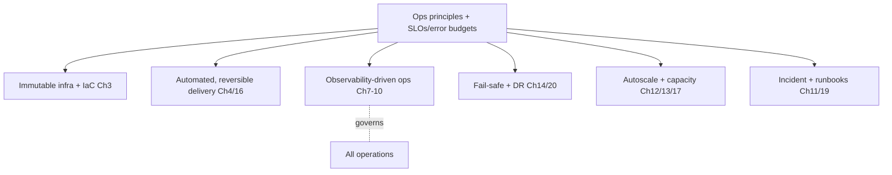

## 1.9 Data Flow

SLOs (from Vol 1–5 guarantees) are continuously measured by observability (Ch 7–10); the error budget (§1.12) governs the pace of change; automation (IaC + pipelines) executes all production changes reversibly; failures trigger graceful degradation + recovery (Ch 14/19); growth triggers autoscaling + capacity planning (Ch 12/13). Humans supervise via dashboards + on-call, intervening by runbook, not improvisation.

## 1.10 Component Diagram

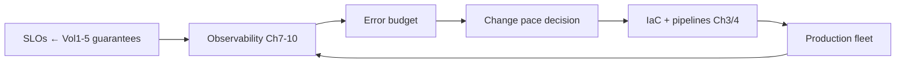

## 1.11 Sequence Diagram — error budget governs change

```mermaid
sequenceDiagram
    participant SLO as SLO monitor (Ch7)
    participant EB as Error budget
    participant REL as Release pipeline (Ch16)
    SLO->>EB: current attainment vs target
    alt budget remaining
        EB->>REL: proceed with rollouts (normal pace)
    else budget exhausted
        EB->>REL: freeze risky changes; prioritize reliability work
    end
    Note over EB: balances velocity vs stability objectively
```

## 1.12 Operational Procedures — the ten tenets

1. **Production-first mindset.** Code isn't done when it merges; it's done when it runs reliably in production (Vol 6 Ch 1 DoD extends here). Operability is a design input, not an afterthought.
2. **Automation over manual work.** Toil is the enemy. Anything done twice manually is a candidate for automation; manual prod mutation is forbidden (Ch 3/4). Humans make decisions; machines execute them.
3. **Reliability over heroics.** A platform that needs heroes is a broken platform. We engineer reliability (redundancy, graceful degradation Vol 1 Ch 24, deterministic recovery Vol 3 Ch 7) so 3 a.m. is quiet. Heroics are a signal to fix the system.
4. **Observability-driven operations.** You can't operate what you can't see. Every change and component emits metrics/logs/traces (Vol 3 Ch 15–17); decisions are data-driven (Ch 7–10).
5. **Immutable infrastructure.** Servers/containers are never mutated in place; they're replaced from versioned images (Ch 3). No snowflakes, no config drift, no "works on that node."
6. **Infrastructure as Code.** All infrastructure is declarative, versioned, reviewed, and reproducible (Ch 3). The environment is rebuildable from the repo.
7. **Continuous verification.** We continuously prove the system works — synthetic canary calls, health/perf gates (Vol 3 Ch 12/19), chaos engineering (Ch 20), DR drills (Ch 14). Untested resilience is assumed broken.
8. **Operational excellence.** Runbooks, post-mortems, on-call hygiene, and continuous improvement (Ch 11/19/20) are first-class. Every incident makes the system stronger (Vol 6 Ch 23).
9. **Error budgets.** Reliability is a budget, not an absolute (§1.13). The budget objectively balances velocity against stability and depoliticizes the "ship vs. stabilize" decision.
10. **SLO-driven engineering.** We define, measure, and defend Service Level Objectives (§1.13); SLOs — not vibes — drive operational priorities.

## 1.13 SLOs & error budgets (the governing model)

**Service Level Objectives (canonical; tenant tiers may tighten):**

| SLO | Target | Source |
|---|---|---|
| First-audio latency p95 | ≤ 1.5 s | Vol 1 Ch 23 |
| Availability (call success) | ≥ 99.95% | Vol 3 Ch 1 |
| Duplicate authoritative effects | 0 | Vol 3 Ch 8 |
| Committed-event loss | 0 | Vol 3 Ch 1 |
| RPO (data) | ≤ 5 min | Vol 3 Ch 18 |
| RTO (regional) | ≤ 30 min | Vol 3 Ch 18 |
| MTTD (high-sev) | < 5 min | Vol 4 Ch 23 |

- **Error budget** = `1 − SLO`. For 99.95% availability, ~21.6 min/month of unavailability is the budget. **Budget remaining → ship features at normal pace. Budget exhausted → freeze risky changes, prioritize reliability** (§1.11). This is a hard, objective rule (Ch 16), not a negotiation.
- **SLA vs SLO:** SLAs (contractual, Vol 5 Ch 22) are set *looser* than internal SLOs so we detect + fix before breaching a customer contract.

## 1.14 Configuration

```yaml
ops_philosophy:
  manual_prod_changes: forbidden
  infra: immutable + iac
  change_requirements: [automated, observable, reversible]
  slos: { first_audio_p95_ms: 1500, availability: 0.9995, dup_effects: 0, rpo_min: 5, rto_min: 30 }
  error_budget: enforced
  continuous_verification: [synthetic_calls, chaos, dr_drills]
```

## 1.15 Failure Modes

| Failure (of operations) | Effect | Handling |
|---|---|---|
| Manual prod change | Drift, unrepeatable | Forbidden; IaC + pipeline only (Ch 3/4) |
| Operating blind | Slow/wrong response | Observability-first (Ch 7–10); no deploy without telemetry |
| Hero-dependence | Burnout, bus factor | Engineer reliability + automation; blameless culture |
| Ignoring error budget | Velocity vs stability conflict | Budget is a hard gate (Ch 16) |

## 1.16 Recovery Procedures

Operational failures are themselves handled by the principles: drift → rebuild from IaC; blindness → restore observability before proceeding; budget exhaustion → reliability freeze. The meta-recovery is the post-mortem (Ch 11) that strengthens the system so the class can't recur.

## 1.17 Monitoring & Observability

The philosophy *is* observability-led: SLO attainment, error-budget burn, change frequency/failure rate, automation coverage (% of ops automated vs toil), and continuous-verification results are the top-level operational dashboard (Ch 21). The platform watches its own reliability posture continuously.

## 1.18 Security Considerations

Operations inherits the Vol 4 trust layer wholesale: every operational action is authenticated, authorized, and audited (Vol 4 Ch 6/11); operational access is least-privilege + JIT (Vol 4 Ch 6); the ops tooling is itself in-scope for threat modeling (Vol 4 Ch 20). Operating securely is non-negotiable (Ch 18).

## 1.19 Scalability

The principles are what make scale tractable: automation + immutable infra + SLO-governance let a small ops team run a large fleet. The philosophy holds from one node (Ch 2) to thousands of GPUs across global regions (Ch 23) — only the implementation scales, not the principles.

## 1.20 Future Evolution

Toward **autonomous operations** (Ch 23): self-healing infrastructure, predictive scaling, and AIOps that detect/diagnose/remediate within guardrails — the principles unchanged, the human increasingly supervising rather than executing.

---
---

# Chapter 2 — Production Topology

## 2.1 Purpose

Define the production deployment topologies VoiceOS supports — from a single node to globally distributed multi-region — and the trade-offs of each, so a deployment is sized and shaped correctly for its scale, latency, residency, and availability requirements. Topologies realize the logical architecture (Vol 3 Ch 2) physically.

## 2.2 Responsibilities

- Define the supported topologies: single-node, multi-node, GPU clusters, regional, multi-region, hybrid cloud, on-prem/enterprise.
- Specify the placement of each component plane (media/CPU, GPU, data, control) per topology.
- Preserve the architecture's separations (CPU/GPU planes Vol 1, data tiers Vol 3, trust boundaries Vol 4, tenant isolation) in every physical shape.

## 2.3 Design Goals

- **Right-sized:** the smallest topology that meets the requirement (cost-efficient); scale up only as needed.
- **Latency-aware:** components on the call hot path are colocated to protect the budget (Vol 1 Ch 23).
- **Residency- & availability-aware:** multi-AZ/multi-region for HA + data residency (Vol 4 Ch 2).

## 2.4 Non-Goals

- Not the logical architecture (Vol 3 Ch 2 owns it) — this is its physical realization.
- Not the autoscaling mechanics (Ch 13) or K8s details (Ch 5) — this is topology shape.

## 2.5 Inputs

Scale requirements (concurrent calls), latency/residency/availability requirements, deployment model (managed/private/on-prem, Vol 5 Ch 22), cost constraints.

## 2.6 Outputs

```python
class Topology:
    shape: Literal["SINGLE_NODE","MULTI_NODE","GPU_CLUSTER","REGIONAL","MULTI_REGION","HYBRID","ON_PREM"]
    regions: list[Region]; azs_per_region: int
    planes: dict[Plane, Placement]   # media/cpu, gpu, data, control
    ha: HALevel; residency: list[Region]
```

## 2.7 Operational Interfaces

```python
class TopologyManager:
    def provision(self, spec: TopologySpec) -> Topology: ...     # via IaC (Ch3)
    def expand(self, topology: Topology, target: ExpansionTarget) -> Topology: ...
    def validate(self, topology: Topology) -> ValidationReport: ...   # invariants preserved?
```

## 2.8 Internal Components

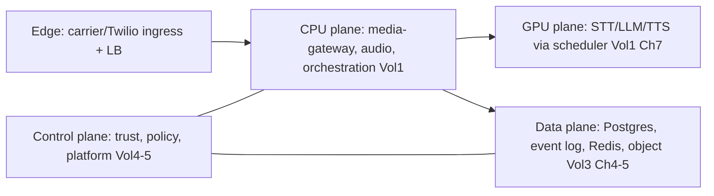

## 2.9 Data Flow

Carrier traffic enters at the edge (per region), routes to the CPU/media plane (hot path, colocated with the caller's region for latency), which calls the GPU plane (intra-AZ, < 5 ms hop) for inference and the data plane for state. The control plane (trust/policy/platform) governs across planes. Multi-region replicates data per residency (Vol 3 Ch 18) and routes callers to the nearest healthy region (Ch 17).

## 2.10 Component Diagram — multi-region (reference)

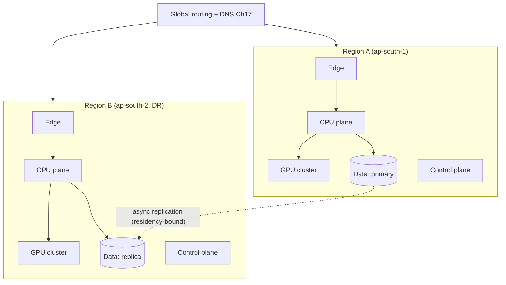

## 2.11 Sequence Diagram — regional call placement

```mermaid
sequenceDiagram
    participant C as Caller
    participant G as Global routing (Ch17)
    participant R as Nearest healthy region
    C->>G: inbound call
    G->>G: select region (latency + residency + health)
    G->>R: route to region edge
    R->>R: CPU plane → GPU plane (intra-AZ) → data plane
    Note over R: hot path colocated; budget preserved (Vol1 Ch23)
```

## 2.12 Operational Procedures — the topologies

- **Single-node** (dev/PoC/smallest tenant): all planes on one node (GPU + CPU + data). *Use:* trials, demos. *Trade-off:* no HA; not for production load. *Procedure:* one Compose/K8s manifest (Ch 3).
- **Multi-node** (small production): CPU plane + GPU plane + data on separate nodes, multi-AZ for HA. *Use:* single-region production up to mid scale. *Procedure:* K8s with node pools (Ch 5).
- **GPU cluster** (inference scale): a pool of GPU nodes behind the scheduler (Vol 1 Ch 7), CPU plane scaled separately. *Use:* high concurrent-call counts. *Procedure:* GPU node pool + fleet mgmt (Ch 6).
- **Regional** (single region, full HA): all planes redundant across ≥3 AZs; data with replicas (Vol 3 Ch 5). *Use:* production with strong single-region HA. *Procedure:* regional IaC module (Ch 3).
- **Multi-region** (HA + DR + residency): ≥2 regions, active-passive (DR) or active-active (Ch 17), data replicated per residency. *Use:* enterprise, DR (Ch 14), low-latency global (Ch 17). *Procedure:* multi-region IaC + global routing.
- **Hybrid cloud** (cloud + on-prem): e.g., control/data on-prem for residency, burst GPU in cloud. *Use:* regulated enterprises. *Trade-off:* network complexity. *Procedure:* hybrid networking + VPN/peering.
- **On-prem / air-gapped** (enterprise/private): full stack in the customer's DC (Vol 5 Ch 22 private deployment), possibly air-gapped. *Use:* highest-assurance enterprises. *Trade-off:* customer-managed infra; updates via controlled channel (Ch 22). *Procedure:* enterprise deployment package (Ch 22).

**TOP-1 (MUST):** every topology preserves the plane separations + invariants (CPU/GPU split, single-writer data, tenant isolation, trust boundaries). `validate()` rejects a topology that collapses a required separation.

## 2.13 Configuration

```yaml
topology:
  shape: regional        # single_node|multi_node|gpu_cluster|regional|multi_region|hybrid|on_prem
  regions: [ap-south-1]
  azs_per_region: 3
  planes:
    cpu: { multi_az: true }
    gpu: { pool: true, scheduler: vol1_ch7 }
    data: { primary_replica: true, multi_az: true }
    control: { multi_az: true }
  ha: zone_redundant
  residency: [IN]
```

## 2.14 Performance Targets

- Hot-path intra-AZ hop (CPU→GPU): **< 5 ms**.
- Cross-AZ (HA) latency: bounded, off the critical synthesis path where possible.
- Regional first-audio p95: ≤ 1.5 s (Vol 1 Ch 23) preserved in every production topology.

## 2.15 Failure Modes

| Failure | Effect | Handling |
|---|---|---|
| AZ loss | Partial capacity loss | Multi-AZ redundancy; reschedule (Ch 5/13) |
| Region loss | Regional outage | Multi-region failover (Ch 14) |
| Hot-path cross-region | Budget breach | Colocate hot path per region (TOP-1) |
| Topology collapses a plane | Invariant risk | `validate()` rejects (TOP-1) |

## 2.16 Recovery Procedures

AZ failure → K8s reschedules to healthy AZs (Ch 5) + autoscale (Ch 13). Region failure → DR failover to standby region (Ch 14, RTO ≤ 30 min). On-prem/air-gapped recovery follows the enterprise DR plan (Ch 22). Topology changes are IaC (Ch 3), so any topology is rebuildable.

## 2.17 Monitoring & Observability

Per-region/AZ health + capacity, hot-path latency by region, cross-AZ/region traffic, plane utilization, residency compliance. Regional health drives global routing (Ch 17) and DR decisions (Ch 14).

## 2.18 Security Considerations

Each topology preserves the Vol 4 trust boundaries + network segmentation (Vol 3 Ch 2): edge/CPU/GPU/data/control planes are isolated; east-west is mTLS (Vol 4 Ch 5); data residency is physically enforced by region placement (Vol 4 Ch 2). On-prem/air-gapped inherits all controls within the customer boundary.

## 2.19 Scalability

Topology is the scaling chassis: single-node → multi-node → GPU cluster → regional → multi-region is the growth path (no rewrite — same architecture, bigger shape). Hyper-scale (thousands of GPUs, many regions) is Ch 23.

## 2.20 Future Evolution

Cell-based topology (blast-radius cells per tenant cohort), edge inference points (Ch 17/23), and topology auto-shaping (the platform recommends/provisions the right topology from observed load). Migration paths in Ch 23.

---
---

# Chapter 3 — Infrastructure as Code

## 3.1 Purpose

Make all infrastructure declarative, versioned, reviewed, and reproducible — so any environment (dev → prod, any region, any topology) is built from code, not clicks. IaC is the mechanical enforcement of immutable infrastructure + reproducibility (Ch 1) and follows the engineering standards (Vol 6).

## 3.2 Responsibilities

- Define all infrastructure as code: cloud resources (Terraform), config/provisioning (Ansible), K8s apps (Helm), manifests, and local/dev (Docker Compose).
- Version, review, and test IaC like application code (Vol 6 Ch 11/12).
- Guarantee reproducible, drift-free environments; detect + remediate drift.

## 3.3 Design Goals

- **Reproducible:** the same code produces the same environment, every time, in any region.
- **Reviewed + gated:** IaC changes go through PR + CI (Vol 6 Ch 11/12) like any code — no console changes.
- **Drift-free:** the live environment always matches the code; drift is detected + corrected.

## 3.4 Non-Goals

- Not the topology design (Ch 2) — IaC implements it. Not the deployment strategy (Ch 4) — IaC provisions; pipelines deploy.

## 3.5 Inputs

Topology specs (Ch 2), environment definitions, the application artifacts (Vol 6 Ch 12), secrets references (Vol 4 Ch 7).

## 3.6 Outputs

```python
class IaCModule:
    name: str; tool: Literal["TERRAFORM","ANSIBLE","HELM","K8S","COMPOSE"]
    version: str; environment: Environment; state_ref: StateRef
    reproducible: bool; reviewed: bool
```

## 3.7 Operational Interfaces

```python
class IaC:
    def plan(self, module: IaCModule, env: Environment) -> Plan: ...    # preview changes
    def apply(self, plan: Plan) -> ApplyResult: ...                     # via pipeline only
    def detect_drift(self, env: Environment) -> DriftReport: ...
    def destroy(self, env: Environment, confirmation: Confirmation) -> None: ...
```

## 3.8 Internal Components

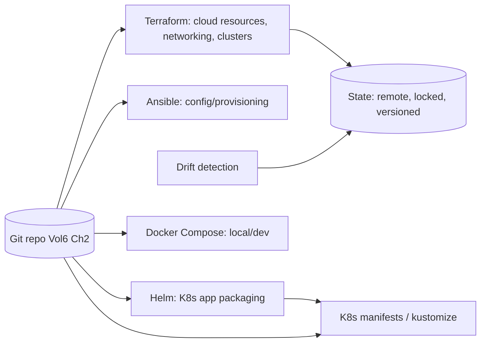

## 3.9 Data Flow

IaC lives in the repo (Vol 6 Ch 2). A change is PR'd, `plan` previews it in CI, review approves, and the pipeline `apply`s it (never a human at a console). State is remote, locked, and versioned. Drift detection continuously compares live vs. code and alerts/remediates. Layered: Terraform provisions cloud + clusters; Helm/manifests deploy apps; Ansible configures; Compose serves local dev.

## 3.10 Component Diagram

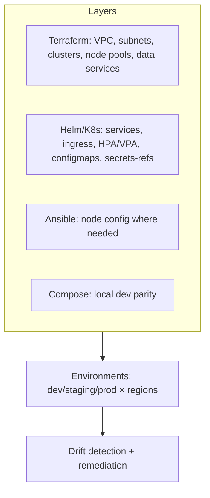

## 3.11 Sequence Diagram — gated infra change

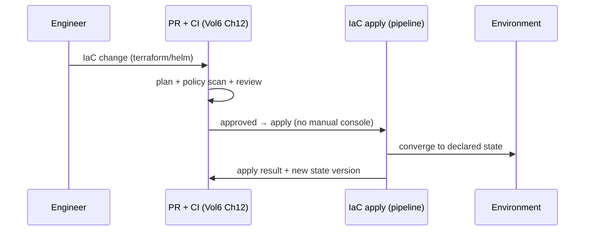

## 3.12 Operational Procedures

- **Provision an environment:** select topology (Ch 2) → `plan` → review → pipeline `apply` → validate (Ch 4 health gates).
- **Change infra:** PR the IaC → CI `plan` + IaC policy scan (OPA/`infra/policies`, Vol 6 Ch 12) + review → `apply` via pipeline.
- **Drift remediation:** drift detected → alert → re-`apply` from code (code is truth) → investigate how drift occurred (likely a forbidden manual change, Ch 1).
- **IaC-3 (MUST):** no manual production infrastructure changes — ever. A console change is drift + a process incident.
- **Environment parity:** dev/staging mirror prod via the same modules (different sizes) — parity prevents "works in staging" surprises.

## 3.13 Configuration

```yaml
iac:
  tools: { cloud: terraform, k8s_packaging: helm, config: ansible, local: docker_compose }
  state: { backend: remote, locked: true, versioned: true }
  apply_via: pipeline_only        # IaC-3
  drift_detection: continuous
  policy_scan: opa                # Vol6 Ch12
  environments: [dev, staging, prod]
```

## 3.14 Performance Targets

- `plan`: minutes. `apply`: bounded (large infra async). Drift detection: continuous/scheduled.
- Environment rebuild from code: hours (full region), proving reproducibility.

## 3.15 Failure Modes

| Failure | Effect | Handling |
|---|---|---|
| State corruption/lock loss | Apply conflicts | Locked remote state + backups |
| Drift | Live ≠ code | Detection + re-apply; forbid manual changes |
| Bad apply | Infra breakage | `plan` review + staged apply + rollback (revert + apply) |
| Secret in IaC | Leak | Secret refs only (Vol 4 Ch 7); scanning (Vol 6 Ch 12) |

## 3.16 Recovery Procedures

State issues → restore from state backup + reconcile. Bad apply → revert the IaC commit + re-apply (code is the source of truth, so recovery is a Git operation + apply). Full environment loss → rebuild from IaC (the ultimate DR backstop, Ch 14). Drift → re-apply.

## 3.17 Monitoring & Observability

IaC apply success/duration, drift incidents, plan/apply audit (who/what/when via Vol 4 Ch 11), policy-scan results, environment-parity checks. Drift frequency is a discipline signal (it should approach 0).

## 3.18 Security Considerations

IaC defines the security posture (network policies, IAM, segmentation) — so it's reviewed by security (Vol 6 Ch 11 protected paths analog). No secrets in IaC (refs to vault, Vol 4 Ch 7); state is encrypted + access-controlled (it can contain sensitive outputs); apply is authz'd + audited (Vol 4 Ch 6/11). IaC policy scanning enforces guardrails (e.g., no public buckets, encryption on).

## 3.19 Scalability

Modular IaC composes from single-node to multi-region (Ch 2) by parameterization, not duplication. Reusable modules scale the team's ability to manage many environments. Scales to the global fleet (Ch 17/23).

## 3.20 Future Evolution

GitOps (declarative, pull-based reconciliation — the cluster converges to Git continuously), policy-as-code maturity, and self-service infra (guard-railed templates tenants/teams provision from). Toward fully declarative, continuously-reconciled infrastructure.

---
---

# Chapter 4 — Deployment Strategy

## 4.1 Purpose

Define how application changes reach production safely and reversibly: blue-green, canary, rolling, and progressive deployments with feature flags and automatic rollback — operationalizing the Vol 3 Ch 21 deployment architecture and the Vol 6 Ch 12 pipeline into the running practice that achieves **zero dropped calls and zero-downtime** deploys.

## 4.2 Responsibilities

- Execute zero-downtime deployments using the right strategy per change risk.
- Gate rollouts on health + performance (Vol 3 Ch 12/19) and auto-rollback on regression.
- Coordinate feature flags (Vol 5 Ch 23) and drain-aware updates (Vol 3 Ch 21) so in-flight calls are never dropped.
- Manage fleet-wide rollout across tenants/regions (with Ch 16/17).

## 4.3 Design Goals

- **Zero downtime, zero dropped calls** — drain-aware, gated, reversible (Vol 3 Ch 21).
- **Progressive + gated** — blast radius grows only as confidence does; gates catch regressions early.
- **Automatic rollback** — a failing rollout reverts itself without human latency.

## 4.4 Non-Goals

- Not the pipeline gates themselves (Vol 6 Ch 12 defines them) — this orchestrates rollout using them.
- Not release scheduling/trains (Ch 16) — this is the deployment mechanism.

## 4.5 Inputs

Signed artifacts + SBOM (Vol 6 Ch 12), deployment strategy choice, health/perf gates (Vol 3 Ch 12/19), feature-flag state (Vol 5 Ch 23), AI-config/prompt versions (Vol 5 Ch 14).

## 4.6 Outputs

```python
class Deployment:
    artifact: ArtifactVersion; strategy: Literal["BLUE_GREEN","CANARY","ROLLING","PROGRESSIVE"]
    stage: RolloutStage; health: GateResult; perf: GateResult
    status: Literal["IN_PROGRESS","PROMOTED","ROLLED_BACK"]; drain_aware: bool
```

## 4.7 Operational Interfaces

```python
class Deployer:
    def deploy(self, artifact: ArtifactVersion, strategy: Strategy) -> Deployment: ...
    def promote(self, deployment: Deployment, to_stage: RolloutStage) -> None: ...
    def rollback(self, deployment: Deployment) -> None: ...    # auto or manual
    def drain(self, instance: InstanceId) -> None: ...          # Vol3 Ch21
```

## 4.8 Internal Components

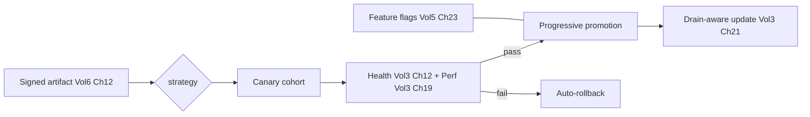

## 4.9 Data Flow

A signed artifact deploys via the chosen strategy. Canary routes a small fraction of live traffic to the new version; health + perf gates evaluate on real traffic. Passing canaries promote progressively (rolling/blue-green), draining old instances (finish in-flight calls, accept no new — zero dropped calls). A gate failure auto-rolls-back. Feature flags decouple deploy from release. AI-config/prompt versions roll out + roll back in lockstep (Vol 5 Ch 14).

## 4.10 Component Diagram

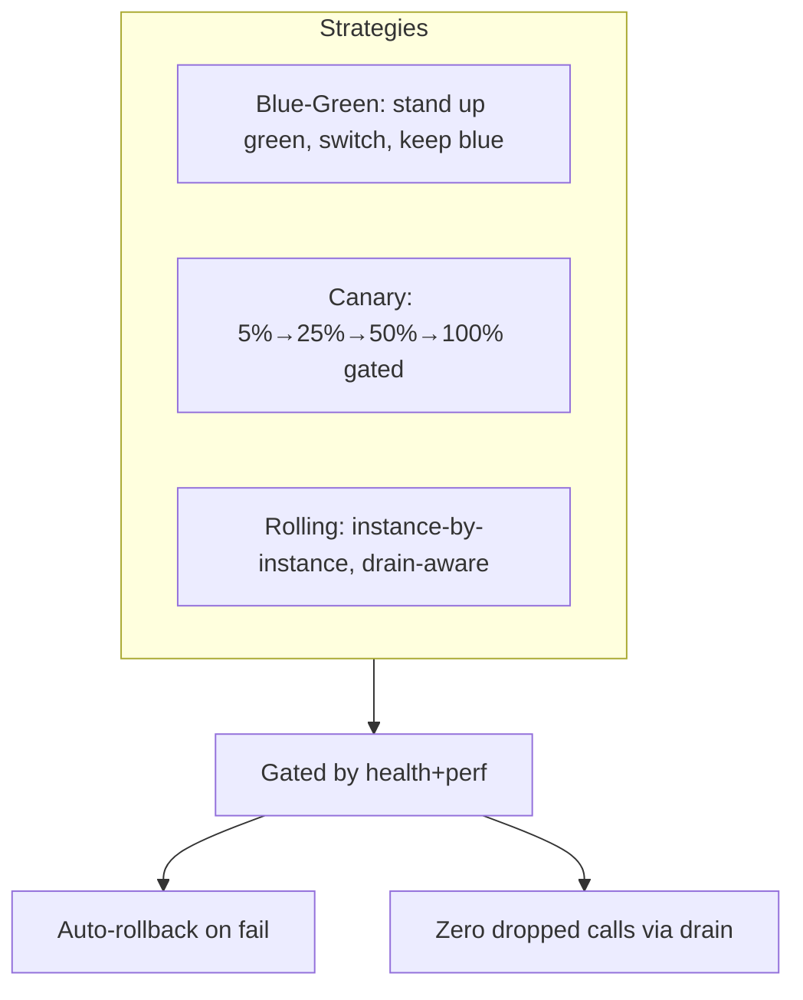

## 4.11 Sequence Diagram — canary with auto-rollback

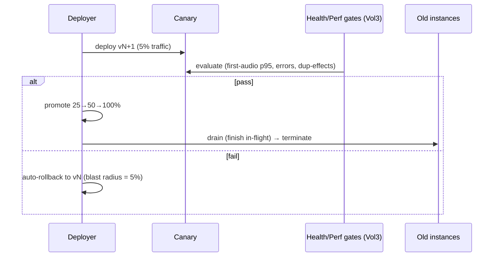

## 4.12 Operational Procedures

- **Choose strategy by risk:** low-risk/stateless → rolling; higher-risk → canary; risky/big-bang-avoidance → blue-green (instant switch + instant rollback). AI/prompt/model changes → canary + AI-eval gate (Vol 6 Ch 12 / Vol 5 Ch 14).
- **Standard deploy:** artifact → canary (5%) → gates → progressive (25/50/100) → drain old → validate (Ch 16 / CICD-8). Auto-rollback armed throughout.
- **DEP-1 (MUST):** every deploy is drain-aware (zero dropped calls) and reversible; no big-bang prod deploys. Migrations run expand-contract (Vol 6 DM-6), decoupled from code rollout.
- **Feature-flagged release:** deploy dark (flag off) → enable progressively per cohort (Vol 5 Ch 23) → monitor → full or disable. Decouples "deployed" from "released."

## 4.13 Configuration

```yaml
deployment:
  default_strategy: canary
  canary_steps_pct: [5, 25, 50, 100]
  gates: [health, perf]            # Vol3 Ch12/19
  auto_rollback: true
  drain_aware: true                # Vol3 Ch21 — zero dropped calls
  drain_timeout_s: 1800            # ≥ max call duration
  ai_config_lockstep: true         # Vol5 Ch14
  feature_flags: vol5_ch23
```

## 4.14 Performance Targets

- Dropped calls during deploy: **0** (drain).
- Canary → full: gated, typically < 1 h.
- Auto-rollback time: **< 5 min**.
- Zero-downtime: 100% of deploys.

## 4.15 Failure Modes

| Failure | Effect | Handling |
|---|---|---|
| Bad version | Regression on canary | Gates fail → auto-rollback (blast radius small) |
| Drain timeout | Lingering calls | Bounded drain → recover/teardown (Vol 3 Ch 7) |
| Migration coupling | Rollout stuck | Expand-contract decoupling (Vol 6 DM-6) |
| Flag misconfig | Wrong exposure | Policy-evaluated flags (Vol 5 Ch 23); audited |

## 4.16 Recovery Procedures

Gate failure auto-rolls-back to the prior signed artifact + AI-config version (< 5 min). Blue-green keeps the prior version warm for instant fallback. Stuck rollouts revert via blue-green or rollback. Drain stragglers recover via Vol 3 Ch 7. A bad deploy never reaches the full fleet (progressive + gates).

## 4.17 Monitoring & Observability

Rollout progress/stage, canary health/perf deltas vs baseline, drain durations, rollback events + reasons, dropped-call count (must be 0), version distribution across the fleet. Canary perf delta is the key promotion signal (Vol 3 Ch 19).

## 4.18 Security Considerations

Only signed, scanned artifacts deploy (Vol 6 Ch 12 supply-chain); deploys are authz'd + audited (Vol 4 Ch 6/11); secrets injected at deploy from vault (Vol 4 Ch 7), never in images. Rollback preserves security posture (prior version was also vetted). Deployment tooling is least-privilege.

## 4.19 Scalability

Deployment strategy is independent of fleet size; progressive rollout extends across tenants/regions (Ch 16/17 / Vol 5 Ch 23). Scales from one service to the global fleet with the same gated, reversible mechanics.

## 4.20 Future Evolution

Progressive delivery driven by SLO burn-rate (auto-pause/rollback on budget burn, Ch 1), automated canary analysis (statistical), and per-tenant deployment rings. Toward fully autonomous, SLO-aware delivery.

---
---

# Chapter 5 — Kubernetes Architecture

## 5.1 Purpose

Define how VoiceOS runs on Kubernetes in production: node pools (incl. GPU), scheduling, autoscaling (HPA/VPA), services, ingress, persistent volumes, secrets, and config — the orchestration substrate that realizes the topology (Ch 2) and runs the deployment strategy (Ch 4) while preserving the architecture's planes + invariants.

## 5.2 Responsibilities

- Define cluster structure: node pools (CPU/media, GPU, data-adjacent, system), labels/taints, scheduling.
- Configure workload primitives: Deployments/StatefulSets, Services, Ingress, PVs/PVCs, ConfigMaps, Secrets (vault-backed).
- Configure autoscaling (HPA/VPA + cluster autoscaler; GPU-aware, Ch 6/13).
- Preserve plane separation + tenant isolation + real-time requirements (RI-1) on K8s.

## 5.3 Design Goals

- **Plane-faithful scheduling:** CPU/media, GPU, and data workloads land on the right node pools (Vol 1 CPU/GPU split, Vol 3 data tiers).
- **Real-time-safe:** media/CPU pods get the resources + priority for RI-1 (no noisy-neighbor jitter on the hot path).
- **Elastic:** scale pods + nodes with load (Ch 13) without violating invariants.

## 5.4 Non-Goals

- Not GPU fleet internals (Ch 6) or autoscaling policy (Ch 13) — this is the K8s structure they use.
- Not the deployment strategy (Ch 4) — K8s is the substrate it runs on.

## 5.5 Inputs

Topology (Ch 2), workload specs (resources, affinity), GPU requirements (Ch 6), scaling policies (Ch 13), secrets refs (Vol 4 Ch 7), config (Vol 1 App. D).

## 5.6 Outputs

```python
class K8sWorkload:
    name: str; kind: Literal["DEPLOYMENT","STATEFULSET","DAEMONSET"]
    node_pool: NodePool; resources: ResourceSpec; affinity: Affinity
    hpa: HPASpec | None; vpa: VPASpec | None; priority_class: str
```

## 5.7 Operational Interfaces

```python
class K8sPlatform:
    def node_pools(self) -> list[NodePool]: ...
    def schedule(self, workload: K8sWorkload) -> Placement: ...
    def scale(self, workload: str, replicas: int) -> None: ...     # or via HPA
    def gpu_request(self, spec: GPUSpec) -> Allocation: ...        # Ch6
```

## 5.8 Internal Components

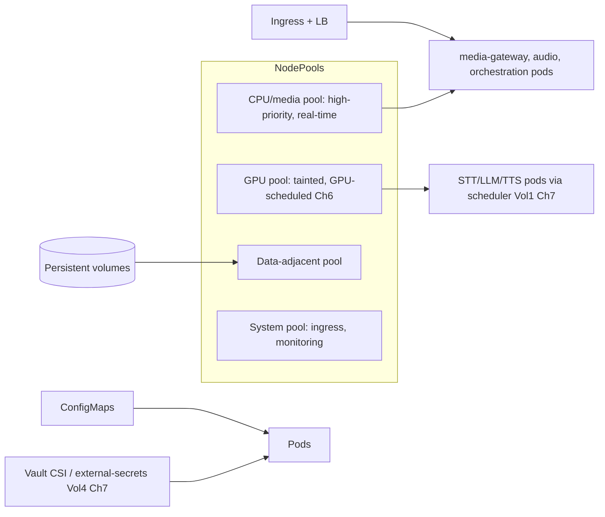

## 5.9 Data Flow

Ingress routes traffic to media/CPU pods (CPU pool, high priority for RI-1). Those pods call GPU pods (GPU pool, tainted so only inference lands there; scheduled via the Vol 1 Ch 7 scheduler) and data services. Secrets are injected from the vault via CSI/external-secrets (never plain K8s Secrets in Git, Vol 4 Ch 7). ConfigMaps carry non-secret config (Vol 1 App. D). HPA/VPA + cluster autoscaler adjust pods + nodes to load (Ch 13).

## 5.10 Component Diagram

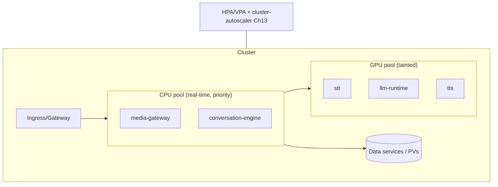

## 5.11 Sequence Diagram — GPU pod scheduling

```mermaid
sequenceDiagram
    participant CE as conversation-engine pod (CPU pool)
    participant SCHED as GPU Scheduler (Vol1 Ch7)
    participant GPUP as GPU pod (GPU pool)
    CE->>SCHED: inference request (admission-controlled)
    SCHED->>GPUP: dispatch (VRAM budget respected, OOM-by-construction)
    GPUP-->>CE: result (or admission-shed → fallback Vol3 Ch13)
    Note over GPUP: GPU pods on tainted pool; no CPU/media pods land here
```

## 5.12 Operational Procedures

- **Node pools:** CPU/media pool (high-priority `PriorityClass`, generous CPU, anti-affinity to spread, guaranteed QoS for RI-1); GPU pool (GPU node type, `nvidia.com/gpu` resource, taint `gpu=true:NoSchedule` so only inference tolerates it); data-adjacent + system pools separate.
- **K8S-1 (MUST):** media/CPU real-time pods are **Guaranteed QoS** (requests=limits) with a high PriorityClass — they must not be throttled/evicted by noisy neighbors (RI-1). No CPU-burstable hot-path pods.
- **K8S-2 (MUST):** GPU pods request GPUs via the device plugin and run under the Vol 1 Ch 7 scheduler's admission control — K8s schedules the *pod*; the scheduler arbitrates *VRAM* (OOM-by-construction preserved). Never oversubscribe VRAM via K8s alone.
- **Secrets:** vault-backed (CSI driver / external-secrets); never commit K8s Secret manifests with real values (Vol 4 Ch 7 / Vol 6 AR-19).
- **PVs:** StatefulSets for stateful data with appropriate storage classes; encrypted at rest (Vol 4 Ch 8).
- **Autoscaling:** HPA on the right signals (Ch 13 — often queue depth / concurrent calls, not just CPU); VPA for right-sizing; cluster autoscaler for nodes; GPU autoscaling per Ch 6/13.

## 5.13 Configuration

```yaml
kubernetes:
  node_pools:
    cpu_media: { priority: high, qos: guaranteed, taints: [], autoscale: true }
    gpu: { instance: gpu, resource: "nvidia.com/gpu", taint: "gpu=true:NoSchedule", autoscale: true }
    data: { storage_class: ssd-encrypted }
    system: { for: [ingress, monitoring] }
  hot_path_qos: guaranteed        # K8S-1 (RI-1)
  gpu_via_scheduler: vol1_ch7     # K8S-2
  secrets: vault_csi              # Vol4 Ch7
  hpa: { signals: [queue_depth, concurrent_calls, cpu] }   # Ch13
  vpa: enabled
```

## 5.14 Performance Targets

- Pod scheduling latency: seconds; node scale-up: minutes (cluster autoscaler) — pre-warm for spikes (Ch 13).
- Hot-path pod jitter: bounded (Guaranteed QoS, RI-1).
- GPU pod placement honors VRAM budget (0 OOM, Vol 1 Ch 7).

## 5.15 Failure Modes

| Failure | Effect | Handling |
|---|---|---|
| Node failure | Pod loss | K8s reschedules to healthy nodes; call recovery (Vol 3 Ch 7) |
| GPU pod OOM | Inference failure | Should be impossible (Vol 1 Ch 7); if seen, P-sev |
| Noisy neighbor on hot path | Jitter (RI-1 risk) | Guaranteed QoS + priority + anti-affinity (K8S-1) |
| Secret exposure | Security | Vault-backed only; no plaintext secrets (Vol 4 Ch 7) |
| Autoscale lag | Capacity shortfall | Predictive/scheduled scaling + headroom (Ch 13) |

## 5.16 Recovery Procedures

Node/pod failure → K8s reschedule + Vol 3 Ch 7 call recovery. Cluster issues → the cluster is IaC (Ch 3), rebuildable. GPU scheduling anomalies → reconcile via the Vol 1 Ch 7 ledger + reschedule. Stuck rollouts → Ch 4 rollback. Cluster-wide failure → DR to another region (Ch 14).

## 5.17 Monitoring & Observability

Node/pod health + resource usage per pool, scheduling latency, HPA/VPA actions, GPU allocation (Ch 6), hot-path pod throttling (should be 0, RI-1), pending pods (capacity signal). Feeds capacity planning (Ch 12) + autoscaling (Ch 13).

## 5.18 Security Considerations

Network policies enforce plane segmentation (Vol 3 Ch 2 / Vol 4); pod security standards (no privileged unless required, read-only rootfs); RBAC for cluster access (least-privilege, Vol 4 Ch 6); secrets via vault (Vol 4 Ch 7); images signed + scanned (Vol 6 Ch 12); tenant isolation preserved at the workload + network level. The control plane is access-restricted + audited.

## 5.19 Scalability

K8s scales pods (HPA) + nodes (cluster autoscaler) elastically; node pools scale independently (CPU vs GPU). Multi-cluster/multi-region for global scale (Ch 17). The substrate scales from a few nodes to thousands (Ch 23).

## 5.20 Future Evolution

Multi-cluster fleet management, topology-aware + latency-aware scheduling, GPU sharing/MIG for efficiency (Ch 6/15), and service-mesh maturity (mTLS, traffic policy). Toward a self-tuning orchestration layer.

---

---
---

# Chapter 6 — GPU Fleet Management

## 6.1 Purpose

Operate the GPU fleet that runs STT/LLM/TTS inference: pools, allocation, model loading/warm-up, affinity, failover, VRAM management, autoscaling, and capacity. This is the *operational* layer over the Vol 1 Ch 7 GPU Scheduler — it provisions and keeps healthy the GPUs the scheduler arbitrates, preserving OOM-by-construction (RI-8) at fleet scale.

## 6.2 Responsibilities

- Provision + maintain GPU pools (by model class / latency class) and keep models loaded + warm.
- Manage VRAM budgets at the fleet level (consistent with the Vol 1 Ch 7 per-node ledger).
- Handle GPU failover (node/card failure → reschedule/reroute), affinity (keep a model where its weights are warm), and GPU autoscaling (Ch 13).
- Feed GPU capacity signals to planning (Ch 12) + cost (Ch 15).

## 6.3 Design Goals

- **OOM-by-construction at scale:** the fleet never admits work it can't fit (RI-8) — the scheduler's guarantee, upheld fleet-wide.
- **Warm + fast:** models are pre-loaded + warmed so first-token/first-chunk latency stays in budget (Vol 1 Ch 23); no cold-start on the hot path.
- **Efficient:** high GPU utilization (≥ 80%, Vol 3 Ch 19) without starving latency classes.

## 6.4 Non-Goals

- Not the admission/scheduling algorithm (Vol 1 Ch 7 owns it) — this provisions + operates the GPUs it runs on.
- Not model architecture (Vol 1 Ch 8/13/17) — this loads + serves approved models (Vol 5 Ch 14).

## 6.5 Inputs

Inference demand (concurrent calls × model mix), the approved model catalog (Vol 5 Ch 14), GPU node availability, latency-class requirements (Vol 1 Ch 7), scaling signals (Ch 13).

## 6.6 Outputs

```python
class GPUFleet:
    pools: list[GPUPool]                       # by model class / latency class
    loaded_models: dict[GPUNode, list[ModelId]]; vram_ledger: dict[GPUNode, VRAMState]
    warm: dict[ModelId, bool]; utilization: float; headroom: float
```

## 6.7 Operational Interfaces

```python
class GPUFleetManager:
    def provision_pool(self, spec: GPUPoolSpec) -> GPUPool: ...
    def load_model(self, node: GPUNode, model: ModelId) -> LoadResult: ...   # + warm-up
    def drain_node(self, node: GPUNode) -> None: ...                         # for failover/maint
    def reschedule(self, node: GPUNode) -> RescheduleResult: ...             # on failure
    def vram_state(self, node: GPUNode) -> VRAMState: ...                    # reconciles Vol1 Ch7 ledger
```

## 6.8 Internal Components

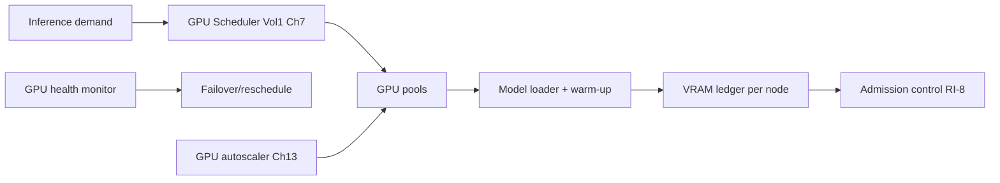

## 6.9 Data Flow

GPU nodes are provisioned into pools (per model/latency class). Models load + warm at startup (weights resident, KV/prefix caches primed). The Vol 1 Ch 7 scheduler admits inference only within each node's VRAM ledger (OOM-by-construction). Health monitoring detects failing GPUs → drain + reschedule + reroute (Vol 3 Ch 13 fallback covers the gap). The autoscaler adds/removes GPU nodes on demand signals (Ch 13). Affinity keeps a model's traffic on nodes where it's warm.

## 6.10 Component Diagram

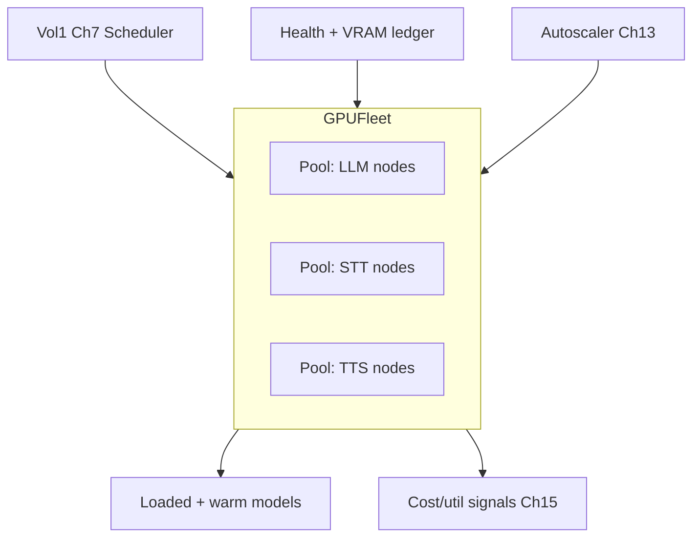

## 6.11 Sequence Diagram — GPU node failure → recovery

```mermaid
sequenceDiagram
    participant H as GPU health monitor
    participant F as Fleet manager
    participant S as Scheduler (Vol1 Ch7)
    participant FB as Fallback (Vol3 Ch13)
    H->>F: node N unhealthy (ECC errors / unresponsive)
    F->>S: remove N from admission pool
    F->>F: drain N; reschedule its models to warm capacity
    S->>FB: in-flight requests on N → reroute/fallback
    F->>F: autoscale replacement node; warm models
    Note over F: 0 OOM preserved; latency degrades gracefully not catastrophically
```

## 6.12 Operational Procedures

- **Provision a pool:** GPU node type per model class → load + warm models → register with scheduler (VRAM ledger initialized).
- **Model load/warm:** load weights → prime KV/prefix cache (Vol 1 Ch 12/13) → health-check inference → mark warm → admit. **GPU-1 (MUST):** never route hot-path traffic to a cold model (cold-start blows the budget).
- **Failover:** unhealthy GPU → drain + remove from admission → reschedule models to warm capacity → in-flight reroute/fallback (Vol 3 Ch 13) → autoscale replacement. **GPU-2 (MUST):** a GPU failure degrades gracefully (fallback/queue), never drops calls or OOMs.
- **VRAM management:** the fleet ledger reconciles with the Vol 1 Ch 7 per-node ledger; admission stays OOM-by-construction (RI-8). Drift in the ledger is a P-sev (the guarantee depends on it).
- **Affinity + bin-packing:** route a model's traffic to warm nodes; pack models to maximize utilization without breaching VRAM. MIG/sharing for small models (Ch 15) where it helps.

## 6.13 Configuration

```yaml
gpu_fleet:
  pools:
    llm: { node_type: gpu_large, models: [qwen3-8b], warm: true }
    stt: { node_type: gpu_med, models: [whisper-large-v3-turbo-fp8], warm: true }
    tts: { node_type: gpu_med, models: [veena], warm: true }
  scheduler: vol1_ch7            # admission control, OOM-by-construction (RI-8)
  warm_required_for_traffic: true   # GPU-1
  failover: { drain: true, reroute: vol3_ch13, autoscale_replacement: true }   # GPU-2
  utilization_target: 0.80       # Vol3 Ch19
  vram_ledger: reconciled
```

## 6.14 Performance Targets

- GPU utilization: **≥ 80%** (Vol 3 Ch 19) without latency-class starvation.
- Model warm-up: done before admission; **0 cold-starts on hot path** (GPU-1).
- OOM events: **0** (RI-8). Failover reroute: seconds (fallback covers).

## 6.15 Failure Modes

| Failure | Effect | Handling |
|---|---|---|
| GPU card fault (ECC/unresponsive) | Node capacity loss | Drain + reschedule + autoscale (GPU-2) |
| VRAM ledger drift | OOM risk | Reconcile; P-sev; admission stays conservative |
| Cold model on hot path | Latency breach | GPU-1: warm-before-admit |
| Fleet under-capacity | Queue/shed | Autoscale (Ch 13) + graceful shed (Vol 3 Ch 14) |
| Thermal/throttling | Latency rise | Monitor temps; rebalance; replace |

## 6.16 Recovery Procedures

GPU failure → drain + reschedule + autoscale replacement + warm (in-flight via fallback, Vol 3 Ch 13). Ledger drift → reconcile against actual VRAM + scheduler ledger; stay conservative until reconciled. Fleet-wide GPU shortage → shed lowest-priority + scale + (if regional) shift load (Ch 17). All while preserving 0 OOM + 0 dropped calls.

## 6.17 Monitoring & Observability

Per-GPU utilization/VRAM/temperature/ECC errors, model warm state, admission/shed rates (Vol 1 Ch 7), per-pool capacity + headroom, failover events, cost-per-GPU-hour (Ch 15). VRAM ledger health is critical (RI-8 depends on it). Feeds capacity (Ch 12) + autoscaling (Ch 13).

## 6.18 Security Considerations

GPU nodes run only approved, signed model artifacts (Vol 5 Ch 14 / Vol 6 Ch 12); model weights are access-controlled artifacts (not in repo). GPU pods are isolated (Ch 5 taints + network policy); tenant data in VRAM is transient + isolated (no cross-tenant residue — buffers cleared). Multi-tenant inference preserves isolation (Vol 4 Ch 6).

## 6.19 Scalability

GPU pools scale horizontally (add nodes, Ch 13); pools scale independently per model class. Multi-region GPU fleets (Ch 17). The path to thousands of GPUs (Ch 23) keeps the same scheduler + ledger + warm-before-admit discipline.

## 6.20 Future Evolution

MIG/fractional GPU + GPU sharing for small models (efficiency, Ch 15), speculative decoding + disaggregated prefill/decode (TTFT, Vol 1 Ch 13 future), heterogeneous accelerators (next-gen GPUs/ASICs), and predictive model placement. Toward a self-optimizing accelerator fleet.

---
---

# Chapter 7 — Monitoring Platform

## 7.1 Purpose

Provide complete, real-time visibility into every layer — infrastructure, applications, AI models, calls, GPU, network, storage, APIs, and business KPIs — built on Prometheus/Grafana/Alertmanager. This operationalizes the Vol 3 Ch 15 metrics architecture into the production monitoring platform that makes observability-driven operations (Ch 1) real.

## 7.2 Responsibilities

- Collect, store, and visualize metrics across all layers (the Vol 3 Ch 15 taxonomy, operationalized).
- Compute + display SLO attainment + error-budget burn (Ch 1).
- Feed alerting (Ch 8) and provide the dashboards on-call + leadership use.
- Correlate technical + business signals (cost-per-conversation, recovery rates — with Ch 21 / Vol 5 Ch 11).

## 7.3 Design Goals

- **Full-stack + correlated:** one platform spans infra → app → AI → calls → business, correlated by the same IDs (Ch 10).
- **SLO-centric:** the top-level view is SLO attainment + budget burn, not raw metrics.
- **Real-time + actionable:** fresh enough to drive sub-5-min detection (MTTD, Ch 1).

## 7.4 Non-Goals

- Not alerting logic (Ch 8) or logs/traces (Ch 9/10) — it's the metrics platform (it integrates with them).
- Not metric *definition* (Vol 3 Ch 15 owns the taxonomy) — it collects + presents them.

## 7.5 Inputs

Metrics from every component (Vol 3 Ch 15 instrumentation), GPU metrics (Ch 6), business signals (Vol 5 Ch 11), SLO definitions (Ch 1).

## 7.6 Outputs

```python
class MonitoringPlatform:
    metrics_store: PrometheusTSDB; dashboards: list[Dashboard]
    slo_status: dict[SLO, Attainment]; error_budget: dict[SLO, BudgetState]
    scrape_health: dict[Target, bool]
```

## 7.7 Operational Interfaces

```python
class Monitoring:
    def query(self, promql: str, range: TimeRange) -> Series: ...
    def slo_attainment(self, slo: SLO) -> Attainment: ...
    def error_budget(self, slo: SLO) -> BudgetState: ...
    def dashboard(self, name: str) -> Dashboard: ...
```

## 7.8 Internal Components

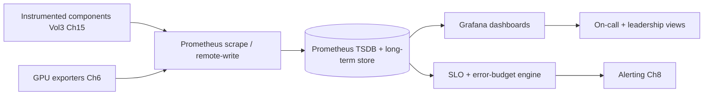

## 7.9 Data Flow

Components expose metrics (Prometheus format / remote-write); Prometheus scrapes/ingests into the TSDB (with long-term storage for trends, Ch 12/21). The SLO engine computes attainment + budget burn. Grafana visualizes layered dashboards (infra → app → AI → call → business). SLO/threshold breaches feed Alertmanager (Ch 8). High-cardinality + long-retention data may federate to a scalable backend (Thanos/Mimir/Cortex) at fleet scale.

## 7.10 Component Diagram

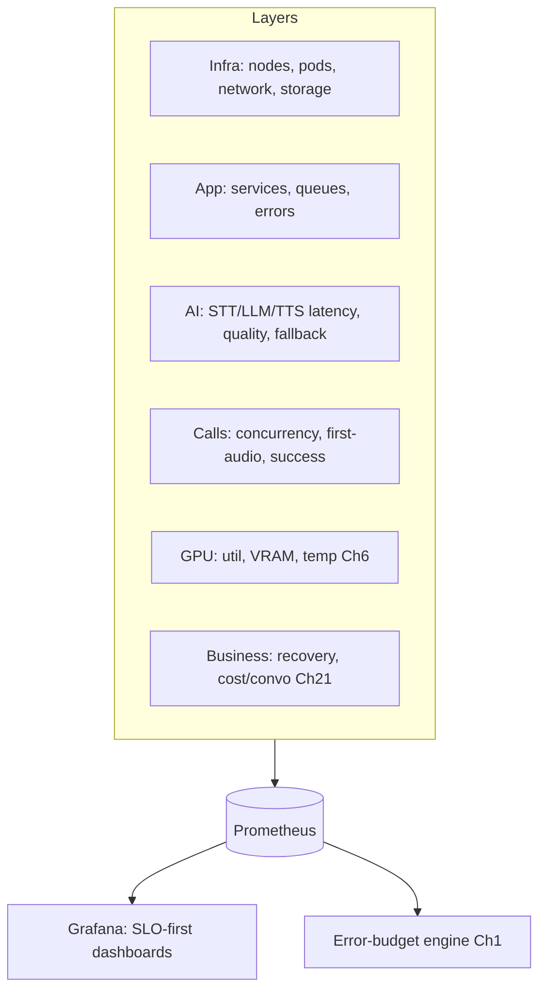

## 7.11 Sequence Diagram — SLO breach detection

```mermaid
sequenceDiagram
    participant C as Components
    participant P as Prometheus
    participant S as SLO engine
    participant A as Alertmanager (Ch8)
    C->>P: metrics (first-audio, errors, ...)
    P->>S: evaluate SLOs + budget burn
    alt breach / fast burn
        S->>A: fire alert (severity by burn rate)
    else healthy
        S->>S: update dashboards
    end
    Note over S: MTTD < 5 min (Ch1)
```

## 7.12 Operational Procedures

- **Onboard a component:** instrument per Vol 3 Ch 15 → expose metrics → add scrape config (IaC, Ch 3) → build/extend dashboard → define SLO/alert (Ch 8).
- **MON-1 (MUST):** every production component emits the standard metric set (RED: rate/errors/duration + resource + domain) with the standard labels (`tenant_id` where applicable, `region`, `service`, `version`) — no blind spots.
- **SLO dashboards:** the primary on-call view is SLO attainment + budget burn per service/region; drill-down to layer metrics. Leadership view = business + cost KPIs (Ch 21).
- **Cardinality hygiene:** bound label cardinality (no unbounded labels like raw IDs) — protects the TSDB (the metrics analog of RI-3).

## 7.13 Configuration

```yaml
monitoring:
  stack: { metrics: prometheus, dashboards: grafana, alerting: alertmanager }
  long_term_store: thanos          # trends for capacity/analytics (Ch12/21)
  standard_labels: [tenant_id, region, service, version]
  metric_pattern: RED + resource + domain    # MON-1
  slo_engine: { slos: from_ch1, budget_burn: multiwindow }
  cardinality_limits: enforced
  scrape_interval_s: 15
```

## 7.14 Performance Targets

- Metric freshness: ~15 s scrape; SLO eval near-real-time → MTTD < 5 min (Ch 1).
- Dashboard load: < 3 s. Query performance bounded (recording rules for heavy queries).
- Retention: hot (high-res, weeks) + long-term (downsampled, months/years for capacity/trends).

## 7.15 Failure Modes

| Failure | Effect | Handling |
|---|---|---|
| Prometheus down | Blind spot | HA pairs + federation; alert on scrape gaps |
| Cardinality explosion | TSDB OOM/slow | Cardinality limits (Ch 7.12); drop offending labels |
| Missing instrumentation | Blind component | MON-1 gate; onboarding checklist |
| Alert on stale data | False signal | Scrape-health checks; staleness handling |

## 7.16 Recovery Procedures

Prometheus HA + remote-write means a node loss doesn't lose visibility. TSDB issues → restore from long-term store / rebuild (metrics are re-derivable going forward). Cardinality incident → identify + drop the offending series, fix the emitter. Monitoring is itself IaC (Ch 3), rebuildable.

## 7.17 Monitoring & Observability

The platform monitors itself: scrape success, TSDB health/cardinality, query latency, rule-eval duration, dashboard usage. "Monitoring the monitoring" prevents silent blind spots (a down monitor is a high-sev — we can't operate blind, Ch 1).

## 7.18 Security Considerations

Metrics contain **no PII** (aggregates + IDs only — enforced like CS-10); dashboards are access-controlled (tenant data segregated; tenants see only their own, Vol 5 Ch 11); the monitoring stack is authz'd + audited (Vol 4 Ch 6/11). Business/cost dashboards are leadership-restricted. Metric endpoints are network-isolated (not public).

## 7.19 Scalability

Prometheus federation (Thanos/Mimir) scales to the global fleet's metric volume; recording rules + downsampling bound query cost; per-region collection with global aggregation. Scales to thousands of nodes/GPUs (Ch 23).

## 7.20 Future Evolution

SLO-burn-rate-driven automation (auto-pause deploys, Ch 4), ML anomaly detection (beyond static thresholds, Ch 8), and unified observability (metrics+logs+traces+events correlated in one pane, Ch 9/10). Toward predictive, self-correlating observability.

---
---

# Chapter 8 — Alerting Architecture

## 8.1 Purpose

Turn signals into the right human (or automated) action at the right time: alert severities, policies, escalation chains, suppression, grouping, and on-call routing — built on Alertmanager, integrated with monitoring (Ch 7) and incident management (Ch 11). Good alerting means real problems page fast and noise never does.

## 8.2 Responsibilities

- Define alert rules + severities (critical/warning/info) tied to SLOs + error budgets (Ch 1/7).
- Route alerts to on-call via escalation chains; group + deduplicate + suppress to kill noise.
- Integrate with incident management (Ch 11) and runbooks (Ch 19) so an alert links to its response.

## 8.3 Design Goals

- **Actionable, not noisy:** every alert is actionable + links a runbook; non-actionable alerts are deleted (alert fatigue is a reliability risk).
- **Severity-appropriate:** page humans only for things needing immediate human action; everything else is a ticket/dashboard.
- **Fast + reliable routing:** the right person is reached within the MTTD/response budget (Ch 1 / Vol 4 Ch 23).

## 8.4 Non-Goals

- Not metric collection (Ch 7) or incident process (Ch 11) — it's the bridge: signal → notification → response entry.

## 8.5 Inputs

SLO/threshold/burn-rate evaluations (Ch 7), on-call schedules, escalation policies, suppression/maintenance windows.

## 8.6 Outputs

```python
class Alert:
    name: str; severity: Literal["CRITICAL","WARNING","INFO"]
    slo: SLO | None; burn_rate: float | None; labels: dict[str,str]
    runbook: RunbookRef; routed_to: OnCallTarget; grouped_with: list[AlertId]
```

## 8.7 Operational Interfaces

```python
class Alerting:
    def fire(self, alert: Alert) -> None: ...
    def route(self, alert: Alert) -> OnCallTarget: ...        # by severity + schedule
    def suppress(self, matcher: Matcher, window: TimeWindow) -> None: ...   # maintenance
    def acknowledge(self, alert_id: AlertId, by: Engineer) -> None: ...
    def escalate(self, alert_id: AlertId) -> None: ...        # next in chain
```

## 8.8 Internal Components

```mermaid
flowchart LR
    RULES[Alert rules Ch7 SLO/burn] --> AM[Alertmanager]
    AM --> GROUP[Group + dedup]
    GROUP --> SUPPRESS[Suppress/inhibit/maintenance]
    SUPPRESS --> ROUTE[Route by severity + schedule]
    ROUTE --> ONCALL[On-call: page/Slack/email]
    ONCALL --> ESCALATE[Escalation chain]
    ESCALATE --> INCIDENT[Incident mgmt Ch11]
```

## 8.9 Data Flow

Monitoring (Ch 7) evaluates rules — preferring **multi-window burn-rate** SLO alerts (fast burn → page; slow burn → ticket) over static thresholds. Alertmanager groups related alerts (one incident, not 50 pages), suppresses during maintenance, inhibits downstream alerts when a root cause fires, and routes by severity to the on-call schedule. Unacknowledged criticals escalate up the chain. Critical alerts open an incident (Ch 11).

## 8.10 Component Diagram

```mermaid
flowchart TB
    subgraph Severities
        CRIT[CRITICAL: page now, SLO breach/fast burn]
        WARN[WARNING: ticket, slow burn/degradation]
        INFO[INFO: dashboard/log, awareness]
    end
    Severities --> POLICY[Alert policies]
    POLICY --> ROUTING[Grouping + suppression + routing]
    ROUTING --> RESPONSE[On-call → escalation → incident Ch11]
```

## 8.11 Sequence Diagram — critical alert + escalation

```mermaid
sequenceDiagram
    participant M as Monitoring (Ch7)
    participant AM as Alertmanager
    participant P as Primary on-call
    participant S as Secondary/EM
    M->>AM: SLO fast-burn (availability)
    AM->>AM: group + inhibit downstream
    AM->>P: page (severity CRITICAL) + runbook link
    alt ack within budget
        P->>AM: acknowledge → handle (Ch11/19)
    else no ack
        AM->>S: escalate (next in chain)
    end
```

## 8.12 Operational Procedures

- **Define an alert (ALERT-1, MUST):** every alert has a severity, an owner, a linked runbook (Ch 19), and a clear "what action this demands." No actionless alerts. Prefer SLO burn-rate alerting over raw thresholds.
- **Severities:** CRITICAL = immediate human action, SLO breach / fast budget burn / customer impact → **page**. WARNING = degradation / slow burn → ticket + Slack. INFO = awareness → dashboard/log, no notification.
- **On-call routing:** severity + schedule → primary; escalation chain (primary → secondary → EM) on no-ack within the budget. Follow-the-sun for global (Ch 17).
- **Noise control:** group by incident, inhibit downstream (don't page for symptoms when the cause already paged), suppress during planned maintenance (Ch 3/16). Tune relentlessly — page volume per on-call shift is a tracked metric.
- **Maintenance windows:** suppress expected alerts during planned ops; never suppress blindly (scope + time-bound).

## 8.13 Configuration

```yaml
alerting:
  tool: alertmanager
  severities: { critical: page, warning: ticket, info: dashboard }
  prefer: slo_burn_rate_multiwindow     # over static thresholds
  routing: { by: [severity, region, service], schedule: pagerduty_or_oncall }
  escalation: { chain: [primary, secondary, em], ack_timeout_min: 10 }
  grouping: by_incident
  inhibition: root_cause_suppresses_symptoms
  every_alert_requires: [severity, owner, runbook]   # ALERT-1
```

## 8.14 Performance Targets

- Critical page delivery: **< 1 min** from fire. Escalation on no-ack: ≤ 10 min.
- Detection-to-page contributes to MTTD < 5 min (Ch 1).
- Alert noise: low (actionable-only); page-per-shift tracked + minimized.

## 8.15 Failure Modes

| Failure | Effect | Handling |
|---|---|---|
| Alert storm | On-call overwhelmed | Grouping + inhibition + root-cause suppression |
| Alert fatigue | Real alerts missed | Actionable-only (ALERT-1); continuous tuning |
| Missed routing | No one notified | Escalation chain + dead-man's-switch (alert if alerting is silent) |
| Alertmanager down | No alerts | HA Alertmanager + heartbeat monitor |

## 8.16 Recovery Procedures

Alert storms → rely on grouping/inhibition; if overwhelmed, declare an incident (Ch 11) + all-hands. Alerting outage → HA cluster + an external dead-man's-switch (heartbeat that pages if the alert pipeline goes silent). Missed alerts → post-mortem (why did it not page?) → add/fix the rule. Alerting config is IaC (Ch 3).

## 8.17 Monitoring & Observability

Alert fire/ack/escalation/resolve rates, page volume per shift, false-positive rate, time-to-ack, suppression coverage, alerting-pipeline health (heartbeat). High false-positive or page volume triggers a tuning review (alert quality is a tracked reliability metric).

## 8.18 Security Considerations

Alerts contain no PII (IDs + metrics only); alert channels are access-controlled; security alerts (Vol 4 Ch 16) route to the security on-call + SOC. Alert config changes are reviewed + audited (Vol 4 Ch 11). The alerting path is itself monitored (a silenced alerting system could mask an attack).

## 8.19 Scalability

Alertmanager clusters + per-region routing scale with the fleet; grouping/inhibition keep human load bounded even as components multiply (the point of good alerting is constant human load under growing scale). Follow-the-sun on-call (Ch 17) scales coverage globally.

## 8.20 Future Evolution

ML-based alert correlation + noise reduction, auto-remediation for known patterns (alert → runbook auto-execute → page only if it fails, Ch 19/23), and predictive alerting (page before breach on forecast burn). Toward alerting that mostly fixes things before a human is needed.

---
---

# Chapter 9 — Logging Platform

## 9.1 Purpose

Provide centralized, structured, searchable logging across the fleet — with retention, archiving, redaction, and correlation IDs — on ELK/OpenSearch. This operationalizes the Vol 3 Ch 16 logging architecture into the production platform engineers use to investigate, with PII redaction (Vol 4 Ch 10) enforced at the platform level.

## 9.2 Responsibilities

- Collect + centralize structured logs from all components, correlated by `correlation_id`/`trace_id` (Vol 3 Ch 16 / Vol 6 Ch 6).
- Provide fast search + analysis; manage retention, archiving, and lifecycle.
- Enforce PII redaction (Vol 4 Ch 10) at ingestion — no sensitive data in searchable logs.

## 9.3 Design Goals

- **Structured + correlated:** JSON logs joinable by ID across services (Ch 10) — investigation is a query, not a grep across hosts.
- **Redacted by default:** PII never lands in the log store (redacted at source + ingestion).
- **Cost-bounded retention:** hot (searchable) + warm + cold (archived) tiers balance access vs cost.

## 9.4 Non-Goals

- Not metrics (Ch 7) or traces (Ch 10) — logs are the detailed event record (correlated with both).
- Not log *content* standards (Vol 3 Ch 16 / Vol 6 CS-9 own them) — it collects + serves them.

## 9.5 Inputs

Structured logs from components (Vol 3 Ch 16), redaction rules (Vol 4 Ch 10), retention policies (Vol 4 Ch 9 / Vol 3 Ch 5).

## 9.6 Outputs

```python
class LoggingPlatform:
    store: OpenSearchCluster; indices: list[Index]   # by date/service/tenant
    retention: dict[LogClass, Duration]; redaction_active: bool
    correlation_ready: bool   # joinable by correlation_id/trace_id
```

## 9.7 Operational Interfaces

```python
class Logging:
    def search(self, query: LogQuery, range: TimeRange) -> list[LogEntry]: ...
    def by_correlation(self, correlation_id: str) -> list[LogEntry]: ...   # full request story
    def by_trace(self, trace_id: str) -> list[LogEntry]: ...               # joins traces Ch10
    def archive(self, index: Index) -> ArchiveRef: ...
```

## 9.8 Internal Components

```mermaid
flowchart LR
    COMP[Components: structured JSON logs Vol3 Ch16] --> SHIP[Log shipper / agent]
    SHIP --> REDACT[Redaction pipeline Vol4 Ch10]
    REDACT --> INGEST[Ingest → OpenSearch]
    INGEST --> HOT[(Hot indices: searchable)]
    HOT --> WARM[(Warm)]
    WARM --> COLD[(Cold archive: object storage)]
    HOT --> KIBANA[OpenSearch Dashboards / search]
```

## 9.9 Data Flow

Components emit structured JSON logs (with correlation/trace IDs, Vol 6 CS-9/EV-8). A shipping agent forwards them through a **redaction pipeline** (Vol 4 Ch 10 — PII stripped/tokenized *before* storage) into OpenSearch hot indices. Engineers search/correlate by ID (joining metrics Ch 7 + traces Ch 10). Indices age hot → warm → cold (archived to object storage) per retention policy; cold satisfies long-term/compliance retention cheaply.

## 9.10 Component Diagram

```mermaid
flowchart TB
    SOURCES[All components] --> PIPELINE[Ship → Redact → Ingest]
    PIPELINE --> TIERS[Hot / Warm / Cold tiers]
    TIERS --> SEARCH[Search + correlation by ID]
    SEARCH --> INVESTIGATE[Debugging Vol6 Ch15 / Incidents Ch11]
    REDACT2[Redaction Vol4 Ch10] -.enforced.- PIPELINE
```

## 9.11 Sequence Diagram — incident investigation by correlation

```mermaid
sequenceDiagram
    participant E as Engineer (incident Ch11)
    participant L as Logging platform
    participant T as Tracing (Ch10)
    E->>L: search by correlation_id (from alert/trace)
    L-->>E: full structured story across services (redacted)
    E->>T: jump to trace_id for span timing
    Note over E: logs + traces + metrics correlated → root cause
```

## 9.12 Operational Procedures

- **LOG-1 (MUST):** redaction runs **before** storage — no PII/secrets in searchable logs (Vol 4 Ch 10 / Vol 6 CS-10). A PII-in-logs finding is a P1 + pipeline fix.
- **Investigate:** start from `correlation_id` (from an alert/trace) → `by_correlation` for the full request story → pivot to traces (Ch 10) / metrics (Ch 7). (This is the Vol 6 Ch 15 debugging entry point, at fleet scale.)
- **Retention/lifecycle:** hot (days–weeks, fast search), warm (weeks), cold/archive (months–years, compliance retention Vol 4 Ch 9). Index lifecycle management automates transitions.
- **Cost control:** sample high-volume DEBUG (not ERROR/audit); bound index size; the log store is a major cost line (Ch 15) — tier aggressively.

## 9.13 Configuration

```yaml
logging:
  stack: opensearch          # ELK-compatible
  ingestion: { shipper: fluent-bit, redaction: vol4_ch10_before_store }   # LOG-1
  correlation: [correlation_id, trace_id, tenant_id, region, service]
  tiers: { hot_days: 14, warm_days: 30, cold_archive_days: 365+ }
  ilm: automated
  sampling: { debug: 0.1, error: 1.0, audit: 1.0 }
  pii_in_store: forbidden    # P1 if violated
```

## 9.14 Performance Targets

- Log ingestion lag: seconds. Search (hot): sub-second–seconds.
- Redaction: inline, no PII leakage (100%).
- Retention cost: bounded via tiering + sampling.

## 9.15 Failure Modes

| Failure | Effect | Handling |
|---|---|---|
| Ingestion backlog | Delayed logs | Buffered shippers + backpressure; scale ingest |
| PII leak into store | Privacy breach (P1) | Redaction-before-store (LOG-1); audit + purge |
| Index/cluster overload | Slow/failed search | Tiering, ILM, shard management, scale-out |
| Log loss | Investigation gap | Buffered shipping; audit logs separately durable (Vol 4 Ch 11) |

## 9.16 Recovery Procedures

Ingestion backlog → buffered shippers drain when capacity returns (logs delayed, not lost). PII leak → purge affected indices + fix the redaction rule + incident (Vol 4 Ch 17). Cluster issues → scale/restore (platform is IaC, Ch 3). Note: **audit logs (Vol 4 Ch 11) are a separate, immutable, durable store** — operational logs are for debugging, not the compliance record.

## 9.17 Monitoring & Observability

Ingestion rate/lag, redaction-pipeline health (+ any PII-detection hits = alarm), search latency, index sizes + tier transitions, log-store cost. Redaction health is critical (a broken redactor = PII leak risk).

## 9.18 Security Considerations

PII redaction before storage is mandatory (LOG-1, Vol 4 Ch 10); log access is authz'd + audited (Vol 4 Ch 6/11) and tenant-segregated (tenants/support see only permitted scope); logs in transit + at rest encrypted (Vol 4 Ch 8); the log store is network-isolated. Operational logs are distinct from the immutable audit trail (Vol 4 Ch 11) — don't conflate.

## 9.19 Scalability

OpenSearch scales horizontally (shards/nodes); per-region clusters with optional global search; tiering + sampling bound volume + cost at fleet scale. Scales to the global fleet's log volume (Ch 23).

## 9.20 Future Evolution

Unified observability (logs+metrics+traces in one correlated platform, Ch 7/10), ML log anomaly detection, and natural-language log investigation (ask a question, get the correlated story). Toward query-by-intent investigation.

---
---

# Chapter 10 — Distributed Tracing

## 10.1 Purpose

Provide end-to-end request tracing across the distributed, real-time call path — telephony, AI inference, GPU, and cross-service hops — on OpenTelemetry. This operationalizes the Vol 3 Ch 17 tracing architecture so any call's full timeline is reconstructable, which is the backbone of latency debugging (Vol 6 Ch 15) and the latency budget's defense (Vol 1 Ch 23).

## 10.2 Responsibilities

- Propagate trace context across every hop (media → STT → engine → LLM → validate → TTS → playback), including async, network, and GPU boundaries (Vol 3 Ch 17 / Vol 6 EV-8).
- Capture spans with timing for each budget line (Vol 1 Ch 23) — telephony, inference, GPU queue/exec.
- Correlate traces with logs (Ch 9) + metrics (Ch 7) via shared IDs.

## 10.3 Design Goals

- **Complete + unbroken:** the trace covers the whole call path; a broken span chain is a debuggability defect (Vol 6 EV-8).
- **Budget-aligned:** spans map to the latency budget lines so a regression localizes instantly (Ch 7 DBG-P1).
- **Low-overhead:** tracing is sampled + cheap enough to run in production on the hot path (RI-1 — no blocking).

## 10.4 Non-Goals

- Not metrics/logs (Ch 7/9) — traces are the per-request timeline (correlated with both).
- Not trace *instrumentation* standards (Vol 3 Ch 17 / Vol 6 EV-8 own them) — it collects + presents.

## 10.5 Inputs

Spans + context from instrumented components (OpenTelemetry SDKs), sampling config, correlation IDs (Vol 6 Ch 6).

## 10.6 Outputs

```python
class Trace:
    trace_id: str; spans: list[Span]            # telephony, stt, engine, llm, gpu, tts, playback
    total_latency_ms: float; budget_lines: dict[BudgetLine, float]   # vs Vol1 Ch23
    correlation_id: str; tenant_id: TenantId
```

## 10.7 Operational Interfaces

```python
class Tracing:
    def trace(self, trace_id: str) -> Trace: ...
    def slowest(self, range: TimeRange, percentile: float) -> list[Trace]: ...   # p95/p99 calls
    def budget_breakdown(self, trace_id: str) -> dict[BudgetLine, float]: ...     # vs Vol1 Ch23
    def correlate(self, trace_id: str) -> CorrelatedView: ...                     # + logs/metrics
```

## 10.8 Internal Components

```mermaid
flowchart LR
    COMP[Instrumented components OTel] --> COLLECT[OTel Collector]
    GPUSPAN[GPU queue/exec spans Ch6] --> COLLECT
    TELSPAN[Telephony spans] --> COLLECT
    COLLECT --> SAMPLE[Tail/head sampling]
    SAMPLE --> STORE[(Trace store: Tempo/Jaeger)]
    STORE --> UI[Trace UI + budget breakdown]
    STORE --> CORR[Correlate w/ logs Ch9 + metrics Ch7]
```

## 10.9 Data Flow

Each component creates spans under a shared `trace_id`, propagating context across async/network/GPU hops (Vol 3 Ch 17). The OTel Collector receives spans (incl. telephony + GPU queue/exec timing), samples (tail-sampling keeps slow/errored traces), and stores them. Engineers view the full call timeline broken down by budget line (Vol 1 Ch 23) and pivot to correlated logs (Ch 9) + metrics (Ch 7). Slow-trace analysis (p95/p99) drives latency optimization (Vol 6 Ch 16).

## 10.10 Component Diagram

```mermaid
flowchart TB
    subgraph Spans
        TEL[Telephony: RTP/connect]
        STTS[STT inference]
        ENG[Engine/planning]
        LLMS[LLM: queue + TTFT + decode]
        GPUS[GPU: admission + exec Ch6]
        TTSS[TTS: first-chunk + render]
        PLAY[Playback]
    end
    Spans --> TRACE[End-to-end trace]
    TRACE --> BUDGET[Budget breakdown vs Vol1 Ch23]
    TRACE --> CORR2[Correlated w/ logs + metrics]
```

## 10.11 Sequence Diagram — latency regression localization

```mermaid
sequenceDiagram
    participant O as On-call (DBG-P1)
    participant TR as Tracing
    participant M as Metrics (Ch7)
    M->>O: first-audio p95 breach alert
    O->>TR: slowest() traces in window
    TR-->>O: budget breakdown → LLM-queue span regressed
    O->>O: correlate (Ch9) → GPU contention (Ch6)
    Note over O: localized to a budget line in minutes
```

## 10.12 Operational Procedures

- **TRACE-1 (MUST):** trace context propagates across **every** hop incl. GPU + async (Vol 6 EV-8). A broken trace is a fixable defect — the on-call path depends on unbroken traces.
- **Investigate latency:** alert (Ch 8) → `slowest()` traces → `budget_breakdown` to find the regressed budget line (Vol 1 Ch 23) → correlate to logs/metrics → root cause (Vol 6 Ch 15). This is the canonical latency-debugging flow.
- **Sampling:** tail-sampling keeps all errored + slow (p95+) traces + a baseline sample of normal — full fidelity where it matters, low cost overall. Never sample so aggressively that incidents lack traces.
- **AI/GPU spans:** capture TTFT, decode time, GPU admission wait + exec (Ch 6), TTS first-chunk — the AI-specific budget lines that dominate latency.

## 10.13 Configuration

```yaml
tracing:
  stack: opentelemetry
  collector: otel-collector
  store: tempo            # or jaeger
  propagation: w3c_tracecontext   # every hop incl GPU/async (TRACE-1)
  sampling: { strategy: tail, keep: [errors, slow_p95], baseline: 0.05 }
  spans: [telephony, stt, engine, llm_queue, llm_decode, gpu_admission, gpu_exec, tts_first_chunk, tts_render, playback]
  correlate_with: [logs_ch9, metrics_ch7]
```

## 10.14 Performance Targets

- Tracing overhead on hot path: minimal, non-blocking (RI-1).
- Trace availability for slow/errored calls: ~100% (tail sampling).
- Trace query: seconds. Budget breakdown: immediate.

## 10.15 Failure Modes

| Failure | Effect | Handling |
|---|---|---|
| Broken context propagation | Incomplete trace | TRACE-1; propagation tests (Vol 6 EV-8) |
| Collector overload | Dropped spans | Scale collector; sampling; buffering |
| Over-sampling | Missing incident traces | Tail-keep errors+slow; baseline floor |
| Clock skew | Misleading timing | NTP sync; relative span timing |

## 10.16 Recovery Procedures

Collector overload → scale + buffer (spans degrade gracefully, sampled). Broken propagation → fix the instrumentation gap (regression test, Vol 6 EV-8). Trace-store issues → tracing is IaC (Ch 3), rebuildable; going-forward traces resume. Tracing loss degrades debuggability but not the call path (RI-1 — tracing never blocks calls).

## 10.17 Monitoring & Observability

Span ingestion rate, trace completeness (broken-chain rate → should approach 0), collector health, sampling rate, trace-query latency. Trace completeness is a debuggability KPI (Vol 6 EV-8). Tracing monitors itself like the other observability pillars (Ch 7/9).

## 10.18 Security Considerations

Spans carry **no PII** (IDs + timing + metadata only — same bar as logs/metrics); trace access is authz'd + audited (Vol 4 Ch 6/11) + tenant-segregated; spans encrypted in transit (Vol 4 Ch 8). Trace attributes are reviewed to ensure no sensitive payloads leak into span tags.

## 10.19 Scalability

OTel Collector + trace store (Tempo/Jaeger) scale horizontally; tail-sampling bounds volume; per-region collection with global query. Scales to the global fleet's request volume (Ch 23).

## 10.20 Future Evolution

Unified observability (traces auto-correlated with logs+metrics+the `DecisionEnvelope` lineage in one pane, Ch 7/9), continuous profiling tied to traces, and AI-assisted root-cause (trace → suggested cause). Toward one-click (or zero-click) root-cause from any trace.

---
---

# Chapter 11 — Incident Management

## 11.1 Purpose

Define how production incidents are detected, classified, responded to, communicated, resolved, and learned from — the lifecycle, severities, escalation, comms, RCA, post-mortems, and runbook linkage. This unifies the operational response and ties to the security IR (Vol 4 Ch 17), the ops MTTR target (Vol 4 Ch 23), and the blameless culture (Vol 6 Ch 20/23).

## 11.2 Responsibilities

- Define the incident lifecycle (detect → triage → mitigate → resolve → learn) + severity levels.
- Coordinate response: incident commander, roles, escalation, and customer/stakeholder communication.
- Drive root-cause analysis + blameless post-mortems with tracked actions (Vol 6 Ch 20).
- Link every incident class to its runbook (Ch 19) and feed learnings back into gates/runbooks.

## 11.3 Design Goals

- **Fast + calm:** structured response (clear roles, runbooks) so MTTR is low and chaos is minimized.
- **Mitigate first, diagnose second:** restore service before deep RCA (customer impact is the priority).
- **Always learn:** every significant incident strengthens the system (a new gate/test/runbook).

## 11.4 Non-Goals

- Not the technical fixes themselves (Ch 19 runbooks / Vol 6 Ch 15) — this is the response *process*.
- Not security-incident specifics (Vol 4 Ch 17 owns those) — this coordinates with them.

## 11.5 Inputs

Alerts (Ch 8), telemetry (Ch 7/9/10), severity criteria, on-call + escalation (Ch 8), runbooks (Ch 19).

## 11.6 Outputs

```python
class Incident:
    incident_id: IncidentId; severity: Sev   # SEV1|SEV2|SEV3|SEV4
    status: Literal["DETECTED","MITIGATING","MITIGATED","RESOLVED","POSTMORTEM"]
    commander: Engineer; timeline: list[Event]; impact: ImpactAssessment
    runbook: RunbookRef | None; postmortem: PostmortemRef | None
```

## 11.7 Operational Interfaces

```python
class IncidentManagement:
    def declare(self, signal: Signal, severity: Sev) -> Incident: ...
    def assign_commander(self, incident_id: IncidentId, ic: Engineer) -> None: ...
    def update(self, incident_id: IncidentId, event: Event) -> None: ...   # timeline + comms
    def mitigate(self, incident_id: IncidentId, runbook: RunbookRef) -> None: ...
    def resolve(self, incident_id: IncidentId) -> None: ...
    def postmortem(self, incident_id: IncidentId) -> PostmortemRef: ...     # blameless
```

## 11.8 Internal Components

```mermaid
flowchart LR
    DETECT[Detect: alert Ch8] --> TRIAGE[Triage + severity]
    TRIAGE --> DECLARE[Declare incident + IC]
    DECLARE --> MITIGATE[Mitigate via runbook Ch19]
    MITIGATE --> COMMS[Comms: status + stakeholders]
    MITIGATE --> RESOLVE[Resolve]
    RESOLVE --> RCA[Root cause analysis]
    RCA --> PM[Blameless post-mortem Vol6 Ch20]
    PM --> ACTIONS[Tracked actions → strengthen gates/runbooks]
```

## 11.9 Data Flow

An alert (Ch 8) or signal triggers triage → severity classification → incident declared with an **Incident Commander** (IC). The IC coordinates mitigation (runbook, Ch 19), maintains the timeline, and drives comms (internal + customer/status page). After mitigation + resolution, RCA finds the cause (using traces/logs/metrics Ch 7–10), and a blameless post-mortem (Vol 6 Ch 20) produces tracked actions that feed back into gates, tests, and runbooks. Security incidents also invoke Vol 4 Ch 17.

## 11.10 Component Diagram

```mermaid
flowchart TB
    subgraph Lifecycle
        D[Detect] --> T[Triage/severity]
        T --> R[Respond: IC + roles]
        R --> M[Mitigate]
        M --> RES[Resolve]
        RES --> L[Learn: RCA + post-mortem]
    end
    Lifecycle --> RUNBOOKS[Runbooks Ch19]
    Lifecycle --> COMMS2[Comms + status page]
    L --> IMPROVE[Strengthen system Vol6 Ch23]
```

## 11.11 Sequence Diagram — SEV1 response

```mermaid
sequenceDiagram
    participant A as Alert (Ch8)
    participant IC as Incident Commander
    participant ENG as Responders
    participant CUST as Customers/status page
    A->>IC: SEV1 declared (availability breach)
    IC->>ENG: assign roles; open runbook (Ch19)
    IC->>CUST: initial status (impact + ETA)
    ENG->>ENG: mitigate (rollback/failover) → service restored
    IC->>CUST: resolved update
    IC->>IC: schedule blameless post-mortem (Vol6 Ch20)
```

## 11.12 Operational Procedures

- **Severity levels:** **SEV1** = major outage / SLO breach / broad customer impact / data-integrity or security event → all-hands, IC, customer comms. **SEV2** = significant degradation / partial impact. **SEV3** = minor/contained. **SEV4** = low/no customer impact. Severity sets response intensity + comms.
- **INC-1 (MUST):** **mitigate before deep diagnosis** — restore service first (rollback Ch 4, failover Ch 14, runbook Ch 19); root-cause after. Customer impact time is the thing to minimize.
- **Incident Commander:** every SEV1/2 has an IC (coordinates, decides, owns comms — not necessarily the most senior; the trained one). Clear roles (IC, ops lead, comms lead, scribe).
- **Communication:** timely internal updates + customer/status-page comms (honest, impact + ETA) for customer-facing incidents (with Vol 5 Ch 18). Regulatory notification if required (Vol 4 Ch 16).
- **Post-mortem (INC-2, MUST for SEV1/2):** **blameless** (Vol 6 Ch 20) — timeline, root cause (technical + systemic), and tracked action items (usually: strengthen a gate, add a test/alert, fix a runbook). Tracked to closure (Vol 6 Ch 18). Security incidents follow Vol 4 Ch 17 additionally.

## 11.13 Configuration

```yaml
incident_management:
  severities: { sev1: all_hands, sev2: significant, sev3: minor, sev4: low }
  incident_commander: required_for: [sev1, sev2]
  principle: mitigate_before_diagnose   # INC-1
  comms: { internal: continuous, customer: status_page, regulatory: vol4_ch16 }
  postmortem: { blameless: true, required_for: [sev1, sev2], actions_tracked: true }   # INC-2
  runbook_linked: true   # Ch19
  security_incidents_also: vol4_ch17
```

## 11.14 Performance Targets

- MTTD < 5 min (Ch 1 / Vol 4 Ch 23); MTTA (acknowledge) minutes; **MTTR within SLO/error-budget** (Ch 1).
- Post-mortem for SEV1/2: filed within days; actions tracked to closure.
- Customer comms for SEV1: initial update within the comms SLA.

## 11.15 Failure Modes

| Failure | Effect | Handling |
|---|---|---|
| No clear owner | Chaotic response | Mandatory IC (SEV1/2) |
| Diagnose-before-mitigate | Prolonged impact | INC-1: mitigate first |
| Poor comms | Customer/trust damage | Comms lead + status page + templates |
| No learning | Repeat incidents | Blameless post-mortem + tracked actions (INC-2) |
| Alert→no response | Missed incident | Escalation (Ch 8) + dead-man's-switch |

## 11.16 Recovery Procedures

Incident recovery *is* the mitigation runbook (Ch 19): rollback (Ch 4), regional failover (Ch 14), component recovery (Vol 3 Ch 7/13). Once mitigated, controlled root-cause + permanent fix (forward-fix or confirm rollback). The meta-recovery is the post-mortem action that prevents recurrence — that's how the system gets more reliable over time.

## 11.17 Monitoring & Observability

Incident frequency by severity + service, MTTD/MTTA/MTTR trends, error-budget impact per incident, post-mortem-action closure rate, repeat-incident rate (a repeat = the post-mortem didn't fix the class). These are core reliability metrics (Ch 21 / Vol 6 Ch 18).

## 11.18 Security Considerations

Security incidents coordinate with Vol 4 Ch 17 (containment, forensics, breach notification) — incident management provides the response framework; Vol 4 provides security specifics. Incident comms avoid leaking sensitive details; access to incident data is controlled + audited (Vol 4 Ch 11). The audit trail of the incident itself is preserved.

## 11.19 Scalability

The incident process scales with clear severities + roles + runbooks — it works for one engineer on a SEV3 and an all-hands SEV1. Follow-the-sun on-call (Ch 8/17) provides global coverage. As the fleet grows, automation (auto-mitigation, Ch 23) keeps human incident load bounded.

## 11.20 Future Evolution

Auto-mitigation for known patterns (alert → runbook auto-execute → human only if it fails, Ch 19/23), AI-assisted RCA (correlate signals → suggest cause), and predictive incident prevention (act on forecast SLO burn before impact). Toward incidents increasingly prevented or auto-resolved.

---

---
---

# Chapter 12 — Capacity Planning

## 12.1 Purpose

Forecast and provision the capacity VoiceOS needs — calls, GPU, CPU, storage, network, cost, and regional expansion — so the platform is never under-provisioned (SLO breach) nor wastefully over-provisioned (cost). This operationalizes the Vol 3 Ch 22 capacity model into a continuous production discipline feeding autoscaling (Ch 13) and cost (Ch 15).

## 12.2 Responsibilities

- Forecast demand (concurrent calls, by region/time) and translate it into resource needs (GPU/CPU/storage/network).
- Maintain headroom for spikes + failover; plan regional expansion ahead of demand.
- Feed targets to autoscaling (Ch 13), cost optimization (Ch 15), and global scaling (Ch 17).

## 12.3 Design Goals

- **Demand-driven + proactive:** provision ahead of forecast demand, not reactively after a breach.
- **Headroom-aware:** enough buffer for spikes + AZ/region failover without over-paying.
- **Cost-conscious:** the cheapest capacity that meets SLOs (right instance mix, Ch 15).

## 12.4 Non-Goals

- Not real-time scaling (Ch 13 autoscaling reacts in-the-moment) — this is forward planning.
- Not the capacity *model* derivation (Vol 3 Ch 22 owns it) — this runs it in production.

## 12.5 Inputs

Historical + real-time demand (Ch 7/21), growth signals (Vol 5 Ch 18/21 business), the Vol 3 Ch 22 capacity model, GPU/CPU/storage costs (Ch 15), regional expansion plans.

## 12.6 Outputs

```python
class CapacityPlan:
    horizon: Duration; projected_demand: dict[Region, ConcurrentCalls]
    required: dict[Resource, Quantity]   # gpu, cpu, storage, network
    headroom_pct: float; expansion: list[RegionExpansion]; cost_forecast: Money
```

## 12.7 Operational Interfaces

```python
class CapacityPlanning:
    def forecast(self, horizon: Duration) -> DemandForecast: ...
    def required_capacity(self, demand: DemandForecast) -> ResourcePlan: ...   # Vol3 Ch22 model
    def headroom(self, region: Region) -> float: ...
    def plan_expansion(self, region: Region, trigger: ExpansionTrigger) -> RegionExpansion: ...
```

## 12.8 Internal Components

```mermaid
flowchart LR
    HIST[Historical demand Ch21] --> FORECAST[Demand forecasting]
    BIZ[Business growth Vol5 Ch21] --> FORECAST
    FORECAST --> MODEL[Capacity model Vol3 Ch22]
    MODEL --> RESOURCES[Required GPU/CPU/storage/network]
    RESOURCES --> HEADROOM[+ headroom for spikes/failover]
    HEADROOM --> PROVISION[Provision ahead Ch3/13]
    HEADROOM --> COST[Cost forecast Ch15]
```

## 12.9 Data Flow

Historical + business-growth signals feed demand forecasting (per region, seasonality, campaign-driven spikes — collections has predictable monthly cycles, Vol 5 Ch 5). The Vol 3 Ch 22 model converts demand → resources (GPU-seconds, CPU, storage growth, network). Headroom is added for spikes + failover. The plan drives proactive provisioning (Ch 3/13), regional expansion, and cost forecasting (Ch 15).

## 12.10 Component Diagram

```mermaid
flowchart TB
    subgraph Forecasts
        CALLS[Call volume]
        GPUG[GPU growth]
        CPUG[CPU growth]
        STORAGE[Storage growth]
        NET[Network growth]
        COSTF[Cost growth]
        REGION[Regional expansion]
    end
    Forecasts --> PLAN[Capacity plan]
    PLAN --> AUTOSCALE[Autoscaling targets Ch13]
    PLAN --> EXPANSION[Region expansion Ch17]
    PLAN --> BUDGET[Cost/budget Ch15]
```

## 12.11 Sequence Diagram — proactive expansion

```mermaid
sequenceDiagram
    participant CP as Capacity Planning
    participant F as Forecast
    participant M as Capacity model (Vol3 Ch22)
    participant P as Provisioning (Ch3)
    CP->>F: forecast(horizon=90d)
    F-->>CP: demand ↑ in Region A (campaign season)
    CP->>M: required capacity
    M-->>CP: +N GPU nodes, +storage
    CP->>P: provision ahead of demand (IaC)
    Note over CP: SLO preserved; no reactive breach
```

## 12.12 Operational Procedures

- **CAP-1 (MUST):** maintain headroom ≥ the larger of (spike buffer) and (single-AZ or single-region failover capacity) — so losing an AZ/region doesn't breach SLOs (ties to Ch 14 DR).
- **Forecast cadence:** rolling forecasts (30/90/365-day) reviewed regularly; campaign-driven spikes (Vol 5 Ch 5–6) planned explicitly (collections volume spikes are predictable).
- **Provision ahead:** lead-time-aware — GPU nodes take time to provision + warm (Ch 6), so order ahead of the forecast curve, not at the breach.
- **Regional expansion:** triggered by sustained regional demand / latency / residency needs (Ch 17); planned with lead time.
- **Validate model:** back-test the capacity model (Vol 3 Ch 22) against actuals; tune. A model that under-predicts is a reliability risk; over-predicts is a cost risk.

## 12.13 Configuration

```yaml
capacity_planning:
  horizons: [30d, 90d, 365d]
  model: vol3_ch22
  headroom: { spike_buffer_pct: 30, failover: single_az_or_region }   # CAP-1
  campaign_aware: true        # Vol5 Ch5-6 predictable spikes
  provision_lead_time: gpu_aware
  expansion_triggers: [sustained_demand, latency, residency]
  back_test: enabled
```

## 12.14 Performance Targets

- Forecast accuracy: tracked + improved (back-tested vs actuals).
- Headroom maintained per CAP-1 at all times.
- Zero capacity-driven SLO breaches (the planning success metric).

## 12.15 Failure Modes

| Failure | Effect | Handling |
|---|---|---|
| Under-forecast | Capacity shortfall → SLO breach | Headroom (CAP-1) + autoscale (Ch 13) absorbs |
| Over-forecast | Wasted cost | Right-size; reserved/spot mix (Ch 15) |
| Spike unmodeled | Sudden shortfall | Spike buffer + burst autoscale + shed (Vol 3 Ch 14) |
| Slow provisioning | Late capacity | Lead-time-aware ordering; pre-warm |

## 12.16 Recovery Procedures

Forecast miss → autoscaling (Ch 13) + headroom absorb the gap in real time while planning catches up; sustained miss → emergency capacity add + model retune. Unmodeled spike → burst autoscale + graceful shedding (Vol 3 Ch 14, lowest-priority first) until capacity arrives. The combination of headroom + autoscale + shed means a forecast miss degrades gracefully, never catastrophically.

## 12.17 Monitoring & Observability

Demand vs forecast (accuracy), headroom per region (vs CAP-1), resource utilization trends, time-to-provision, capacity-driven incidents (should be 0), cost vs forecast. Headroom dropping below CAP-1 is an alert (proactive capacity signal).

## 12.18 Security Considerations

Capacity data (demand patterns) is business-sensitive — access-controlled; per-tenant demand respects isolation (Vol 4 Ch 6). Expansion into new regions respects residency law (Vol 4 Ch 2 / Ch 17). Capacity for security headroom (DDoS absorption, Vol 4 Ch 12) is part of the plan.

## 12.19 Scalability

Capacity planning is what *enables* scale — it's the forward-looking complement to autoscaling. The model + process scale from one region to the global fleet (Ch 17/23); per-region planning aggregates to a global capacity view.

## 12.20 Future Evolution

ML-driven forecasting (incorporating campaign calendars, seasonality, business pipeline), automated capacity provisioning (forecast → auto-order ahead, within guardrails), and capacity marketplaces (spot/reserved optimization, Ch 15). Toward self-planning capacity.

---
---

# Chapter 13 — Autoscaling

## 13.1 Purpose

Automatically adjust capacity in real time to match load — CPU, GPU, queue-based, predictive, and scheduled scaling — so the platform meets demand without manual intervention or over-provisioning. This is the real-time complement to capacity planning (Ch 12), built on K8s autoscaling (Ch 5) + the GPU fleet (Ch 6).

## 13.2 Responsibilities

- Scale CPU/media workloads (HPA/VPA, Ch 5) and GPU capacity (Ch 6) to live demand.
- Scale on the right signals: concurrent calls / queue depth (not just CPU), with predictive + scheduled scaling for known patterns.
- Preserve invariants while scaling (RI-1 hot-path QoS, OOM-by-construction on GPU scale).

## 13.3 Design Goals

- **Right-signal scaling:** scale on demand signals that lead the budget (queue depth, concurrent calls), not lagging CPU alone.
- **Ahead-of-spike:** predictive + scheduled scaling pre-warms before known demand (avoid cold-start latency, Ch 6 GPU-1).
- **Bounded + safe:** scaling respects min/max, invariants, and cost (no runaway scale).

## 13.4 Non-Goals

- Not capacity forecasting (Ch 12) — autoscaling reacts; planning provisions the envelope.
- Not the scheduling/QoS mechanics (Ch 5/6) — it drives replica/node counts within them.

## 13.5 Inputs

Real-time demand signals (concurrent calls, queue depth, GPU util — Ch 7), scaling policies, min/max bounds, predictive forecasts (Ch 12), schedules.

## 13.6 Outputs

```python
class ScalingAction:
    target: WorkloadOrPool; trigger: ScalingTrigger   # CPU|GPU|QUEUE|PREDICTIVE|SCHEDULED
    from_replicas: int; to_replicas: int; reason: str; bounded_by: Bounds
```

## 13.7 Operational Interfaces

```python
class Autoscaler:
    def scale_cpu(self, workload: str, signal: Signal) -> ScalingAction: ...    # HPA/VPA Ch5
    def scale_gpu(self, pool: GPUPool, signal: Signal) -> ScalingAction: ...    # Ch6
    def predictive_scale(self, forecast: ShortForecast) -> list[ScalingAction]: ...
    def scheduled_scale(self, schedule: Schedule) -> None: ...
```

## 13.8 Internal Components

```mermaid
flowchart LR
    SIGNALS[Signals: concurrent calls, queue depth, GPU util Ch7] --> AUTOSCALE[Autoscaling controller]
    FORECAST[Short-term forecast Ch12] --> AUTOSCALE
    SCHED[Schedules: known peaks] --> AUTOSCALE
    AUTOSCALE --> HPA[CPU: HPA/VPA Ch5]
    AUTOSCALE --> GPU[GPU: fleet scale Ch6]
    AUTOSCALE --> CLUSTER[Cluster autoscaler: nodes]
    BOUNDS[min/max + cost guardrails] --- AUTOSCALE
```

## 13.9 Data Flow

Real-time signals (concurrent calls, queue depth, GPU util) drive scaling decisions. CPU/media workloads scale via HPA (on call/queue signals, not just CPU) + VPA for right-sizing; GPU capacity scales via the fleet manager (Ch 6, warm-before-admit); the cluster autoscaler adds nodes. Predictive scaling pre-warms ahead of short-term forecasts (Ch 12); scheduled scaling handles known peaks (e.g., business hours, campaign launches). All bounded by min/max + cost guardrails.

## 13.10 Component Diagram

```mermaid
flowchart TB
    subgraph Triggers
        CPU2[CPU/utilization]
        QUEUE[Queue depth / concurrent calls]
        GPUU[GPU utilization]
        PRED[Predictive]
        SCHEDU[Scheduled]
    end
    Triggers --> CONTROLLER[Autoscaling controller]
    CONTROLLER --> SCALE[Scale pods + nodes + GPU pools]
    SCALE --> INVARIANTS[Preserve RI-1 QoS + OOM-by-construction]
```

## 13.11 Sequence Diagram — predictive GPU scale before peak

```mermaid
sequenceDiagram
    participant F as Forecast (Ch12)
    participant A as Autoscaler
    participant G as GPU fleet (Ch6)
    F->>A: demand rising in 15 min (campaign launch)
    A->>G: add GPU nodes now + warm models (ahead of spike)
    G-->>A: nodes warm + admitted to scheduler
    Note over A,G: capacity ready before traffic; no cold-start (GPU-1)
```

## 13.12 Operational Procedures

- **SCALE-1 (MUST):** scale on **leading demand signals** (concurrent calls, queue depth) for the call path — CPU alone lags and risks budget breach before scaling triggers.
- **GPU scaling:** scale GPU pools via Ch 6 with **warm-before-admit** (GPU-1) — predictive/scheduled pre-warm avoids cold-start latency. GPU scale-up has lead time → lead the demand.
- **Predictive:** short-term forecasts (Ch 12) + patterns (business hours, campaign calendars Vol 5 Ch 6) pre-scale. **Scheduled:** known recurring peaks scale on schedule (e.g., scale up before 9 AM collections window).
- **Bounds + guardrails:** min replicas (always-warm baseline), max (cost + safety ceiling), scale-down cooldown (avoid flapping), and drain-aware scale-down (Vol 3 Ch 21 — never drop calls when scaling in).
- **SCALE-2 (MUST):** scale-down is drain-aware (finish in-flight calls) and respects min-warm — never scale to cold on the hot path.

## 13.13 Configuration

```yaml
autoscaling:
  cpu: { controller: hpa, signals: [concurrent_calls, queue_depth, cpu], vpa: rightsizing }   # SCALE-1
  gpu: { via: ch6_fleet, warm_before_admit: true, lead_time_aware: true }   # GPU-1
  predictive: { source: ch12_forecast, patterns: [business_hours, campaigns] }
  scheduled: [pre_collections_window, campaign_launch]
  bounds: { min_warm: baseline, max: cost_ceiling, scale_down_cooldown_s: 300 }
  scale_down: drain_aware     # SCALE-2
```

## 13.14 Performance Targets

- Scale-up reaction (CPU): seconds–minute; (GPU, warm): ahead of spike via predictive (no cold-start).
- Zero dropped calls on scale-down (drain, SCALE-2).
- No flapping (cooldown); no budget breach due to scale lag (SCALE-1 + predictive).

## 13.15 Failure Modes

| Failure | Effect | Handling |
|---|---|---|
| Scale lag (CPU-only) | Budget breach before scaling | Leading signals (SCALE-1) + predictive |
| GPU cold-start on spike | Latency breach | Warm-before-admit + predictive pre-warm (GPU-1) |
| Flapping | Churn/cost | Cooldown + hysteresis |
| Scale-down drops calls | Dropped calls | Drain-aware (SCALE-2) |
| Runaway scale | Cost blowout | Max bounds + cost guardrails |

## 13.16 Recovery Procedures

Scale lag → headroom (Ch 12 CAP-1) absorbs while scaling catches up; persistent lag → tune signals/predictive. Flapping → increase cooldown/hysteresis. Runaway → max bounds cap it + alert. Scaling failures fall back to the planned headroom (Ch 12) — autoscaling + headroom together ensure graceful behavior under any scaling fault.

## 13.17 Monitoring & Observability

Scaling actions (up/down, trigger, from/to), scale-up latency, flapping rate, GPU warm state at scale, dropped-calls-on-scale-down (must be 0), cost impact of scaling, predictive accuracy. Scale lag correlated with budget breaches is the key tuning signal.

## 13.18 Security Considerations

Autoscaling respects tenant isolation (scaling doesn't co-mingle tenants); scale actions are authz'd + audited (Vol 4 Ch 6/11); scaling capacity includes security headroom (absorb DDoS rather than breach, Vol 4 Ch 12). Bounds prevent a demand-spike (or attack) from triggering unbounded cost.

## 13.19 Scalability

Autoscaling is the mechanism of elastic scale — it scales the fleet from baseline to peak continuously. Combined with capacity planning (Ch 12) + global scaling (Ch 17), it scales to hyper-scale (Ch 23). Per-region autoscaling aggregates to global elasticity.

## 13.20 Future Evolution

Fully predictive autoscaling (ML demand models driving pre-scaling), reinforcement-learning-tuned policies, and cross-region load-shifting autoscale (scale by moving traffic, not just adding capacity, Ch 17). Toward demand-anticipating, self-tuning elasticity.

---
---

# Chapter 14 — Disaster Recovery

## 14.1 Purpose

Ensure VoiceOS survives and recovers from major failures — region loss, data corruption, catastrophic outages — within defined RTO/RPO targets: regional failover, data recovery, service restoration, backup validation, and business continuity. This operationalizes the Vol 3 Ch 18 backup/DR architecture into tested, drilled production capability.

## 14.2 Responsibilities

- Provide regional failover (active-passive or active-active, Ch 17) within RTO ≤ 30 min.
- Recover data within RPO ≤ 5 min (from backups + replication, Vol 3 Ch 18) with integrity verification.
- Restore service in priority order; validate backups continuously; drill DR regularly.

## 14.3 Design Goals

- **Bounded RTO/RPO:** regional failover ≤ 30 min RTO, ≤ 5 min RPO (Vol 3 Ch 18) — met + proven by drills.
- **No data loss of committed effects:** committed authoritative state survives any single-region disaster (0 committed-event loss, Vol 3 Ch 1).
- **Tested, not assumed:** DR is drilled regularly — untested DR is assumed broken (Ch 1).

## 14.4 Non-Goals

- Not routine component recovery (Vol 3 Ch 7/13 — that's normal ops) — DR is catastrophic/regional recovery.
- Not the backup *mechanics* (Vol 3 Ch 18 owns them) — this operates failover + validates + drills.

## 14.5 Inputs

Backups + replication streams (Vol 3 Ch 18), region health (Ch 2/7), RTO/RPO targets, DR runbooks, residency constraints (Vol 4 Ch 2).

## 14.6 Outputs

```python
class DREvent:
    type: Literal["REGIONAL_FAILOVER","DATA_RECOVERY","SERVICE_RESTORE","DR_DRILL"]
    from_region: Region; to_region: Region
    rto_achieved: Duration; rpo_achieved: Duration; integrity_verified: bool
```

## 14.7 Operational Interfaces

```python
class DisasterRecovery:
    def failover(self, from_region: Region, to_region: Region) -> DREvent: ...
    def recover_data(self, point: RecoveryPoint) -> RecoveryResult: ...     # PITR, Vol3 Ch18
    def restore_services(self, priority: list[Service]) -> RestoreResult: ...
    def validate_backups(self) -> ValidationReport: ...
    def drill(self, scenario: DRScenario) -> DrillResult: ...
```

## 14.8 Internal Components

```mermaid
flowchart LR
    PRIMARY[(Primary region)] -. replication ≤5min RPO Vol3 Ch18 .-> STANDBY[(Standby region)]
    HEALTH[Region health Ch7] --> DETECT[Disaster detection]
    DETECT --> FAILOVER[Regional failover]
    FAILOVER --> ROUTING[Global routing → standby Ch17]
    BACKUP[(Backups + PITR)] --> RECOVER[Data recovery]
    VALIDATE[Backup validation] --> BACKUP
    DRILL[DR drills] --> ALL[Validate RTO/RPO]
```

## 14.9 Data Flow

The primary region replicates data to a standby (async, ≤ 5 min RPO, residency-bound — Vol 3 Ch 18 / Vol 4 Ch 2). Region-health monitoring (Ch 7) detects disaster; failover promotes the standby + redirects global routing (Ch 17) to it (≤ 30 min RTO). Data recovery uses point-in-time restore (Vol 3 Ch 18) with integrity verification. Services restore in priority order (call path first). Backups are continuously validated (a backup that won't restore is worthless); DR is drilled regularly to prove the numbers.

## 14.10 Component Diagram

```mermaid
flowchart TB
    subgraph DR
        FAILOVER2[Regional failover RTO≤30m]
        DATAREC[Data recovery RPO≤5m]
        RESTORE[Service restoration priority]
        VALIDATE2[Backup validation]
        BCP[Business continuity Ch20]
    end
    DR --> DRILLS[Regular DR drills]
    DRILLS --> PROOF[Proven RTO/RPO]
```

## 14.11 Sequence Diagram — regional failover

```mermaid
sequenceDiagram
    participant H as Health (Ch7)
    participant DR as DR controller
    participant S as Standby region
    participant R as Global routing (Ch17)
    H->>DR: primary region unhealthy (sustained)
    DR->>DR: decide failover (criteria met)
    DR->>S: promote standby (data ≤5min behind)
    DR->>R: redirect traffic → standby region
    R-->>DR: traffic flowing; service restored (≤30min RTO)
    Note over DR: committed effects intact; integrity verified
```

## 14.12 Operational Procedures

- **DR-1 (MUST):** failover achieves **RTO ≤ 30 min, RPO ≤ 5 min** with **0 committed-effect loss** — proven by drills, not assumed.
- **Regional failover:** disaster detected (sustained region failure) → promote standby → redirect routing (Ch 17) → verify data integrity (Vol 4 Ch 11 hash chain) → restore services in priority (media/call path → engine → platform).
- **Data recovery:** point-in-time restore (Vol 3 Ch 18) to the RPO boundary; verify integrity; reconcile the event log (deterministic replay, Vol 3 Ch 7) so no committed effect is lost or duplicated (AR-15).
- **Backup validation (DR-2, MUST):** continuously test that backups actually restore (automated restore-test) — an unvalidated backup is assumed broken. Validate replication lag stays within RPO.
- **DR drills (DR-3, MUST):** regular game-days exercising failover + recovery in a controlled way (incl. surprise drills), measuring actual RTO/RPO vs targets. Findings → fix gaps. This is continuous verification (Ch 1).
- **Residency:** failover targets respect data residency (Vol 4 Ch 2) — a region's standby is in a residency-permitted region.

## 14.13 Configuration

```yaml
disaster_recovery:
  rto_min: 30        # DR-1
  rpo_min: 5
  committed_effect_loss: 0
  replication: { mode: async, lag_target_min: 5, residency_bound: true }   # Vol3 Ch18 / Vol4 Ch2
  failover: { mode: active_passive, detection: sustained_region_failure, integrity_verify: true }
  backup_validation: continuous_restore_test    # DR-2
  drills: { cadence: regular, surprise: true, measure: [rto, rpo] }   # DR-3
  service_restore_priority: [media_call_path, engine, platform]
```

## 14.14 Performance Targets

- RTO ≤ 30 min, RPO ≤ 5 min (DR-1) — met in drills.
- Backup restore-test success: ~100% (DR-2).
- Committed-effect loss on failover: **0**.

## 14.15 Failure Modes

| Failure | Effect | Handling |
|---|---|---|
| Region loss | Regional outage | Failover to standby (DR-1) |
| Backup won't restore | Recovery failure | Continuous validation (DR-2) catches before needed |
| Replication lag > RPO | Data loss risk | Monitor lag; alert; throttle if needed |
| Untested DR | Surprise failure | Regular drills (DR-3) |
| Both regions affected | Broader outage | Multi-region (≥3 for critical) + BCP (Ch 20) |

## 14.16 Recovery Procedures

Region disaster → the failover procedure (§14.12) restores service in the standby within RTO. Data corruption → PITR to a clean point + event-log reconciliation. Failed backup discovered during recovery → escalate to next-oldest validated backup (which is why DR-2 validates continuously). Catastrophic multi-region → business continuity plan (Ch 20). Every DR recovery is followed by a post-mortem (Ch 11) + drill-gap closure.

## 14.17 Monitoring & Observability

Replication lag (vs RPO, alarmed), backup validation results (vs DR-2), region health, last-drill RTO/RPO achieved (vs targets), failover readiness. Replication lag exceeding RPO is a high-sev alert (data-loss risk). Drill results are tracked as a reliability KPI.

## 14.18 Security Considerations

DR preserves all security controls in the standby (encryption, isolation, audit — Vol 4); backups are encrypted (Vol 4 Ch 8) + access-controlled; failover respects residency (Vol 4 Ch 2 — no data crossing into a non-permitted region, even in disaster). Integrity verification (Vol 4 Ch 11) confirms no tampering during recovery. DR procedures are themselves authz'd + audited.

## 14.19 Scalability

DR scales per region-pair; active-active multi-region (Ch 17) provides DR + capacity simultaneously at scale. As regions multiply, DR becomes N-region resilience (lose any region, others absorb — Ch 23). The model scales with the global footprint.

## 14.20 Future Evolution

Active-active everywhere (no passive standby — every region serves + backs up others), sub-minute RPO (synchronous where latency allows), automated failover (within strict guardrails), and chaos-driven continuous DR validation (Ch 20). Toward continuously-proven, near-zero-RPO resilience.

---
---

# Chapter 15 — Cost Optimization

## 15.1 Purpose

Operate VoiceOS economically — optimizing GPU utilization, idle resources, autoscaling efficiency, instance mix (spot/reserved), batch processing, and caching (prompt/KV/response) — tracked against the north-star metric: **cost per successful conversation**. This operationalizes the Vol 5 Ch 10/23 cost model into continuous production discipline, never trading away SLOs or safety for cost.

## 15.2 Responsibilities

- Drive GPU efficiency (the dominant cost) — utilization, caching, right-sizing, sharing.
- Optimize instance economics: spot for interruptible, reserved/committed for baseline, on-demand for burst.
- Eliminate idle/waste; track + attribute cost per tenant + per conversation (Vol 5 Ch 10).
- Optimize without compromising SLOs, safety, or invariants (cost is subordinate to reliability + correctness).

## 15.3 Design Goals

- **Cost-per-conversation as north star:** optimize the unit economic, not just raw spend.
- **Efficiency without SLO compromise:** every optimization preserves the latency budget + availability + safety.
- **Attributable:** cost is attributed to tenants + conversations (Vol 5 Ch 10) so optimization + pricing are data-driven.

## 15.4 Non-Goals

- Not billing/pricing (Vol 5 Ch 9 owns them) — this optimizes the *cost* side.
- Not compromising SLOs/safety for cost — reliability + correctness are never traded for savings.

## 15.5 Inputs

Resource costs (GPU/CPU/storage/network), utilization (Ch 6/7), cost attribution (Vol 5 Ch 10), instance pricing (spot/reserved/on-demand), cache hit-rates (Vol 1 Ch 12/13).

## 15.6 Outputs

```python
class CostOptimization:
    cost_per_conversation: Money; gpu_efficiency: float; idle_pct: float
    instance_mix: dict[InstanceType, float]   # spot/reserved/on-demand
    cache_hit_rates: dict[CacheType, float]; recommendations: list[CostAction]; savings: Money
```

## 15.7 Operational Interfaces

```python
class CostOptimizer:
    def cost_per_conversation(self, range: TimeRange) -> Money: ...
    def gpu_efficiency(self) -> float: ...
    def optimize_instance_mix(self) -> InstancePlan: ...   # spot/reserved/on-demand
    def cache_effectiveness(self) -> dict[CacheType, float]: ...
    def recommend(self) -> list[CostAction]: ...
```

## 15.8 Internal Components

```mermaid
flowchart LR
    UTIL[GPU/CPU utilization Ch6/7] --> EFFICIENCY[Efficiency analysis]
    PRICING[Spot/reserved/on-demand] --> MIX[Instance mix optimization]
    CACHE[Prompt/KV/response caches Vol1 Ch12/13] --> HITRATE[Cache effectiveness]
    ATTRIB[Cost attribution Vol5 Ch10] --> CPC[Cost per conversation]
    EFFICIENCY & MIX & HITRATE --> CPC
    CPC --> ACTIONS[Optimization actions]
```

## 15.9 Data Flow

Utilization (Ch 6/7), instance pricing, cache hit-rates (Vol 1 Ch 12/13), and cost attribution (Vol 5 Ch 10) combine into the cost-per-conversation metric + efficiency analysis. Optimizations — raise GPU utilization (batching, sharing), increase cache reuse (prompt prefix, KV, response), shift interruptible work to spot, commit baseline to reserved, batch non-real-time work, eliminate idle — are recommended + applied, always SLO-gated. Savings + cost-per-conversation are tracked over time.

## 15.10 Component Diagram

```mermaid
flowchart TB
    subgraph Levers
        GPUEFF[GPU utilization ≥80%]
        IDLE[Eliminate idle]
        SPOT[Spot for interruptible]
        RESERVED[Reserved for baseline]
        BATCH[Batch non-real-time]
        PROMPTC[Prompt cache Vol1 Ch12]
        KVC[KV cache reuse Vol1 Ch13]
        RESPC[Response cache]
    end
    Levers --> CPC2[Cost per successful conversation ↓]
    CPC2 -.gated by.- SLO[SLOs + safety preserved]
```

## 15.11 Sequence Diagram — spot interruption handled

```mermaid
sequenceDiagram
    participant SPOT as Spot GPU node (batch/interruptible)
    participant CO as Cost optimizer
    participant SCHED as Scheduler (Vol1 Ch7)
    SPOT->>CO: interruption notice (2-min warning)
    CO->>SCHED: drain spot node; reschedule to on-demand/reserved
    Note over CO: real-time calls never on spot; only interruptible work
    SCHED-->>CO: work relocated; no SLO impact
```

## 15.12 Operational Procedures

- **COST-1 (MUST):** optimizations are **SLO- and safety-gated** — never reduce cost in a way that risks the latency budget, availability, or any invariant. Reliability + correctness outrank cost. (E.g., real-time calls never run on interruptible spot.)
- **GPU efficiency (biggest lever):** drive utilization ≥ 80% (Vol 3 Ch 19) via continuous batching (vLLM), prefix/KV caching (Vol 1 Ch 12/13), and MIG/sharing for small models — without latency-class starvation.
- **Caching:** maximize prompt-prefix cache + KV-cache reuse (Vol 1 Ch 12/13 — these cut both latency *and* cost) and response caching where correctness allows (never cache authoritative facts unsafely, Vol 6 16.4).
- **Instance mix:** reserved/committed for steady baseline (cheapest), spot for interruptible/batch only (with interruption handling — never the call path), on-demand for burst. Optimize the mix continuously.
- **Eliminate idle:** scale-down to min-warm (Ch 13), de-provision unused, right-size (VPA). Idle GPU is the most expensive waste.
- **Batch non-real-time:** analytics, eval, training, reporting run on cheaper/spot/off-peak capacity, off the real-time fleet.
- **Track cost-per-conversation:** the north-star — review trends, attribute by tenant (Vol 5 Ch 10), drive margin (Vol 5 Ch 21).

## 15.13 Configuration

```yaml
cost_optimization:
  north_star: cost_per_successful_conversation
  slo_gated: true        # COST-1 — never trade SLO/safety for cost
  gpu: { utilization_target: 0.80, batching: vllm, caching: [prefix, kv], sharing: mig_small_models }
  caching: { prompt_prefix: true, kv_reuse: true, response: where_safe }   # Vol1 Ch12/13 + Vol6 16.4
  instance_mix: { reserved: baseline, spot: interruptible_only, on_demand: burst }
  real_time_on_spot: forbidden
  batch_workloads: [analytics, eval, training, reporting]
  attribution: vol5_ch10
```

## 15.14 Performance Targets

- GPU utilization: ≥ 80% (Vol 3 Ch 19).
- Cost-per-conversation: tracked + trending down (efficiency improving with scale).
- Spot savings on interruptible work; reserved coverage of baseline; idle ≈ 0.
- **Zero SLO/safety regressions from cost actions** (COST-1).

## 15.15 Failure Modes

| Failure | Effect | Handling |
|---|---|---|
| Spot interruption on real-time | Dropped call (unacceptable) | Real-time never on spot (COST-1); spot = interruptible only |
| Over-aggressive scale-down | Cold-start latency | Min-warm + predictive (Ch 13/GPU-1) |
| Cache breaking correctness | Wrong/stale data | Never cache authoritative unsafely (Vol 6 16.4) |
| Under-utilized GPU | Cost waste | Batching, sharing, right-sizing |
| Cost-cut breaks SLO | Reliability loss | COST-1 gate blocks it |

## 15.16 Recovery Procedures

Spot interruption → reschedule interruptible work to on-demand (real-time unaffected by design). A cost optimization that regresses an SLO is rolled back immediately (COST-1 — reliability wins) + reviewed. Cache-correctness issue → invalidate + fix (re-read authoritative, RI-5). Cost spikes → attribution (Vol 5 Ch 10) localizes the driver → targeted optimization.

## 15.17 Monitoring & Observability

Cost-per-conversation (north star), GPU utilization + efficiency, idle %, instance-mix ratios + spot savings, cache hit-rates (Vol 1 Ch 12/13), cost by tenant + region (Vol 5 Ch 10), margin (Vol 5 Ch 21). Cost-per-conversation trend is a leadership KPI (Ch 21). Any SLO regression correlated with a cost action is alarmed.

## 15.18 Security Considerations

Cost optimization preserves all controls — spot/shared infra still enforces tenant isolation (Vol 4 Ch 6) + encryption (Vol 4 Ch 8); shared GPU (MIG) preserves tenant separation (no cross-tenant VRAM residue, Ch 6). Cost data is business-sensitive (access-controlled). Optimization never weakens security for savings (the security analog of COST-1).

## 15.19 Scalability

Efficiency *improves* with scale (better batching, pooling, reserved coverage, cache hit-rates) — cost-per-conversation should decline as the platform grows. The optimization levers scale to the global fleet (Ch 17/23); attribution scales per-tenant (Vol 5 Ch 10).

## 15.20 Future Evolution

ML-driven cost optimization (auto-tune instance mix + scaling + caching for min cost at SLO), carbon-aware scheduling (cost + sustainability), next-gen accelerator economics (Ch 23), and disaggregated serving for efficiency. Toward autonomous, SLO-bounded cost minimization.

---
---

# Chapter 16 — Release Management

## 16.1 Purpose

Coordinate how versioned changes — application, configuration, database migrations, and AI model/prompt releases — reach production safely across the tenant fleet: versioning, release trains, rollback, feature flags, and compatibility. This operationalizes the Vol 6 Ch 11/12 release discipline + Vol 5 Ch 23 fleet rollout + Ch 4 deployment strategy into the production release process.

## 16.2 Responsibilities

- Manage versioning (SemVer, Vol 6 GIT-5) + release cadence (trains) across services + the fleet.
- Coordinate application, config, migration, and AI-model/prompt releases (with Vol 5 Ch 14) as a coherent process.
- Enforce compatibility (backward-compatible contracts, Vol 6 Ch 5/6/7) + the error-budget gate (Ch 1).
- Orchestrate fleet-wide rollout (canary → cohort → fleet, Vol 5 Ch 23) with rollback.

## 16.3 Design Goals

- **Safe + reversible:** every release is gated (Vol 6 Ch 12), canary-first (Ch 4), and rollback-able.
- **Coordinated:** app + config + migration + AI versions release in compatible lockstep (no version skew breaking contracts).
- **Budget-governed:** the error budget (Ch 1) gates release pace — exhausted budget freezes risky releases.

## 16.4 Non-Goals

- Not the deployment mechanism (Ch 4 owns blue-green/canary/rollback) — this is the release *coordination*.
- Not CI gates (Vol 6 Ch 12 defines them) — this runs releases through them.

## 16.5 Inputs

Versioned artifacts (Vol 6 Ch 12), release schedule/trains, migration plans (Vol 6 DM-6), AI-config/prompt versions (Vol 5 Ch 14), error-budget state (Ch 1), feature flags (Vol 5 Ch 23).

## 16.6 Outputs

```python
class Release:
    version: SemVer; train: ReleaseTrain | None
    components: list[ComponentVersion]   # app, config, migration, ai_model, prompt
    rollout: RolloutPlan; compatibility_verified: bool; budget_ok: bool
    status: Literal["SCHEDULED","ROLLING","RELEASED","ROLLED_BACK","FROZEN"]
```

## 16.7 Operational Interfaces

```python
class ReleaseManagement:
    def schedule(self, release: Release, train: ReleaseTrain) -> None: ...
    def verify_compatibility(self, release: Release) -> CompatReport: ...   # contract compat
    def release(self, release: Release) -> RolloutResult: ...               # via Ch4 + Vol5 Ch23
    def rollback(self, release: Release) -> None: ...
    def freeze(self, reason: str) -> None: ...                              # budget exhausted (Ch1)
```

## 16.8 Internal Components

```mermaid
flowchart LR
    ARTIFACTS[Versioned artifacts Vol6 Ch12] --> COMPAT[Compatibility check Vol6 Ch5/6/7]
    COMPAT --> BUDGET[Error-budget gate Ch1]
    BUDGET --> TRAIN[Release train scheduling]
    TRAIN --> ROLLOUT[Fleet rollout Vol5 Ch23 + Ch4]
    MIGRATE[DB migrations Vol6 DM-6] --- ROLLOUT
    AIV[AI model/prompt versions Vol5 Ch14] --- ROLLOUT
    ROLLOUT --> ROLLBACK[Rollback]
```

## 16.9 Data Flow

Versioned artifacts (app/config/migration/AI) are checked for compatibility (backward-compatible contracts, Vol 6 Ch 5/6/7; expand-contract migrations, DM-6; AI determinism/safety, Vol 5 Ch 14). The error budget (Ch 1) gates: budget OK → proceed; exhausted → freeze risky releases. Releases roll out on trains (regular cadence) via canary → cohort → fleet (Vol 5 Ch 23 + Ch 4), with migrations decoupled (expand-contract) and AI versions in lockstep. Rollback reverts all components together.

## 16.10 Component Diagram

```mermaid
flowchart TB
    subgraph ReleaseScope
        APP[App versions]
        CONFIG[Config]
        MIGRATION[DB migrations]
        AIMODEL[AI models/prompts]
    end
    ReleaseScope --> COORD[Coordinated, compatible release]
    COORD --> GATED[Budget + compat gated]
    GATED --> FLEET[Canary→cohort→fleet Vol5 Ch23]
    FLEET --> REVERSIBLE[Rollback-able]
```

## 16.11 Sequence Diagram — release train with budget gate

```mermaid
sequenceDiagram
    participant RM as Release Management
    participant EB as Error budget (Ch1)
    participant RO as Rollout (Ch4/Vol5 Ch23)
    RM->>EB: check budget before train
    alt budget healthy
        RM->>RM: verify compatibility (contracts, migrations, AI)
        RM->>RO: canary → cohort → fleet (gated)
        RO-->>RM: released + validated (CICD-8)
    else budget exhausted
        EB->>RM: freeze risky releases (reliability priority)
    end
```

## 16.12 Operational Procedures

- **REL-1 (MUST):** the **error budget gates release pace** (Ch 1) — budget exhausted → freeze feature/risky releases, ship only reliability fixes, until recovered. Non-negotiable.
- **Release trains:** regular cadence (predictable releases) rather than ad-hoc; urgent fixes ride express trains / hotfix (Vol 6 GIT-6). Trains reduce coordination chaos.
- **Compatibility (REL-2, MUST):** verify backward-compatible contracts (Vol 6 Ch 5/6/7) — no version skew breaks a running consumer. Migrations expand-contract (DM-6, decoupled from code). AI versions lockstep with their config (Vol 5 Ch 14).
- **Fleet rollout:** canary (small tenant cohort) → progressive cohorts → full fleet (Vol 5 Ch 23) via Ch 4 mechanics, gated + auto-rollback. Tenant-tier-aware rings (enterprise tenants may opt for later rings).
- **AI model/prompt releases:** eval-gated (Vol 6 CICD-5) + canary via AI Config (Vol 5 Ch 14) + rollback — coordinated with app releases that depend on them.
- **Rollback:** revert all release components together (app + config + AI versions) to the prior compatible set; migrations stay forward-compatible (expand-contract) so rollback is safe.

## 16.13 Configuration

```yaml
release_management:
  versioning: semver               # Vol6 GIT-5
  cadence: release_trains
  budget_gate: enforced            # REL-1 (Ch1)
  compatibility: backward_compatible_required   # REL-2 (Vol6 Ch5/6/7)
  migrations: expand_contract      # Vol6 DM-6, decoupled
  ai_releases: { eval_gated: true, lockstep_config: vol5_ch14 }
  fleet_rollout: canary_cohort_fleet   # Vol5 Ch23
  rings: tenant_tier_aware
  rollback: all_components_together
```

## 16.14 Performance Targets

- Release cadence: regular + predictable (trains).
- Fleet rollout: gated, zero SLA violations (Vol 5 Ch 23).
- Rollback: < 5 min (Ch 4 / CICD-7), all components.
- Budget-gated freezes honored 100% (REL-1).

## 16.15 Failure Modes

| Failure | Effect | Handling |
|---|---|---|
| Version skew | Broken contract | Compatibility check (REL-2) + backward-compat |
| Migration couples rollout | Stuck/irreversible | Expand-contract (DM-6) |
| Release during budget exhaustion | Reliability risk | Budget gate freezes (REL-1) |
| AI/app version mismatch | Behavior break | Lockstep AI+config (Vol 5 Ch 14) |
| Bad fleet release | Multi-tenant impact | Canary + cohorts + auto-rollback (Ch 4) |

## 16.16 Recovery Procedures

Bad release → auto-rollback (Ch 4) of all components to the prior compatible set (< 5 min). Version skew → the compatibility gate should prevent it; if it slips, roll back + fix the contract. Budget exhaustion → freeze (REL-1) until reliability recovers. Migration issues → expand-contract makes rollback safe (old code still works against expanded schema). Every bad release → post-mortem (Ch 11) + gate strengthening.

## 16.17 Monitoring & Observability

Release frequency + success rate (DORA, Ch 21), rollout progress across the fleet, version distribution (skew detection), rollback rate + reasons, budget-gated freezes, compatibility-check results, AI-version/app-version alignment. Change-failure-rate + version skew are the key release-health signals.

## 16.18 Security Considerations

Only signed, scanned artifacts release (Vol 6 Ch 12 supply-chain); security patches get express-train priority (Ch 18); releases are authz'd + audited (Vol 4 Ch 6/11); rollback preserves security posture. AI releases pass safety eval (Vol 4 Ch 14) before fleet exposure. Release tooling is least-privilege.

## 16.19 Scalability

Release management scales across the tenant fleet (rings/cohorts, Vol 5 Ch 23) + services (trains) + regions (Ch 17). As tenants multiply, ring-based rollout keeps blast radius bounded. The process scales to thousands of tenants (Ch 23).

## 16.20 Future Evolution

SLO-burn-driven release automation (auto-freeze/throttle on budget burn), automated compatibility verification (contract testing in CI gates everything), per-tenant release preferences (maintenance windows, ring choice), and progressive delivery fully driven by live signals. Toward autonomous, budget-aware release orchestration.

---
---

# Chapter 17 — Global Scaling

## 17.1 Purpose

Scale VoiceOS across the globe: global routing, regional deployments, data residency, low-latency edge, CDN integration, and multi-region synchronization — so the platform serves callers worldwide with low latency, regulatory residency, and high availability. This operationalizes the Vol 3 Ch 2/18 multi-region foundations + Vol 4 Ch 2 residency + Vol 5 Ch 22 enterprise geography.

## 17.2 Responsibilities

- Route callers to the optimal region (latency + residency + health) via global routing.
- Operate regional deployments (Ch 2) with data residency (Vol 4 Ch 2) and multi-region synchronization (Vol 3 Ch 18).
- Minimize latency (regional placement, edge where viable, CDN for static); coordinate cross-region consistency.
- Provide global HA (region failure → reroute, with Ch 14 DR).

## 17.3 Design Goals

- **Low latency globally:** callers served from the nearest healthy, residency-compatible region (protect the budget, Vol 1 Ch 23).
- **Residency-compliant:** data stays in permitted regions (Vol 4 Ch 2) — routing + replication respect it absolutely.
- **Globally available:** region failure transparently reroutes (with DR, Ch 14) within SLO.

## 17.4 Non-Goals

- Not the regional topology internals (Ch 2) or DR mechanics (Ch 14) — this is the global coordination layer.
- Not residency *policy* (Vol 4 Ch 2 owns it) — this enforces it operationally in routing + replication.

## 17.5 Inputs

Caller location/region, region health + capacity (Ch 7/12), residency rules (Vol 4 Ch 2), latency measurements, routing policies.

## 17.6 Outputs

```python
class GlobalRouting:
    caller: CallerContext; selected_region: Region
    reason: RoutingReason   # latency | residency | health | capacity
    residency_compliant: bool; latency_estimate_ms: float
```

## 17.7 Operational Interfaces

```python
class GlobalScaling:
    def route(self, caller: CallerContext) -> GlobalRouting: ...   # latency+residency+health
    def region_health(self) -> dict[Region, Health]: ...
    def sync_status(self) -> dict[RegionPair, SyncState]: ...       # multi-region sync
    def residency_check(self, tenant: TenantId, region: Region) -> bool: ...   # Vol4 Ch2
```

## 17.8 Internal Components

```mermaid
flowchart LR
    CALLER[Caller] --> GLOBALROUTE[Global routing: latency+residency+health]
    GLOBALROUTE --> REGION[Selected region Ch2]
    RESIDENCY[Residency rules Vol4 Ch2] --> GLOBALROUTE
    HEALTH[Region health Ch7] --> GLOBALROUTE
    EDGE[Edge services / CDN] --> CALLER
    REGIONS[(Multi-region data)] -. residency-bound sync Vol3 Ch18 .- REGIONS
```

## 17.9 Data Flow

A caller is routed by global routing (GeoDNS / anycast / latency-based) to the nearest region that is healthy, has capacity, and is residency-compatible for that tenant (Vol 4 Ch 2). The call is served entirely within that region (hot path local, Vol 1 Ch 23). Data replicates across regions only within residency constraints (Vol 3 Ch 18). Static assets serve from CDN/edge. Region failure → routing redirects to the next-best region (with DR, Ch 14). Cross-region consistency is managed for global tenant data (within residency).

## 17.10 Component Diagram

```mermaid
flowchart TB
    subgraph Global
        ROUTE[Global routing]
        REGIONS2[Regional deployments Ch2]
        RESID[Data residency Vol4 Ch2]
        EDGE2[Edge / CDN]
        SYNC[Multi-region sync Vol3 Ch18]
    end
    Global --> LOWLAT[Low latency worldwide]
    Global --> COMPLIANT[Residency-compliant]
    Global --> HA[Global HA + failover Ch14]
```

## 17.11 Sequence Diagram — residency-aware routing

```mermaid
sequenceDiagram
    participant C as Caller (tenant T)
    participant GR as Global routing
    participant RES as Residency (Vol4 Ch2)
    participant R as Region
    C->>GR: inbound call
    GR->>RES: permitted regions for tenant T?
    RES-->>GR: [IN regions only]
    GR->>GR: nearest healthy IN region w/ capacity
    GR->>R: route (latency-optimal within residency)
    Note over GR: residency never violated, even for latency
```

## 17.12 Operational Procedures

- **GLOBAL-1 (MUST):** routing **never violates residency** (Vol 4 Ch 2) — residency constrains the candidate set *before* latency/health optimization. A residency-compatible region is always chosen, even if not the absolute nearest.
- **Global routing:** latency-based (nearest healthy region) within the residency-permitted set, capacity-aware (don't route to a saturated region), health-aware (skip unhealthy → DR, Ch 14).
- **Multi-region sync (GLOBAL-2):** replicate per Vol 3 Ch 18 within residency (≤ 5 min RPO); global tenant config/control data syncs (within residency); authoritative regional data stays regional. Monitor sync lag.
- **Edge/CDN:** static assets (frontend, Vol 5) via CDN; explore edge inference for ultra-low-latency markets (Ch 23) — but the authoritative + safety path stays in-region (Law of Authority unaffected).
- **Region expansion:** add regions for latency (underserved geographies), residency (new jurisdictions), or capacity (Ch 12) — provisioned via IaC (Ch 3).
- **Failover routing:** region unhealthy → reroute to next-best residency-compatible region (with DR, Ch 14).

## 17.13 Configuration

```yaml
global_scaling:
  routing: { strategy: latency_based, within: residency_permitted, capacity_aware: true, health_aware: true }
  residency: vol4_ch2          # GLOBAL-1 — constrains candidate regions first
  multi_region_sync: { mode: async, rpo_min: 5, within_residency: true }   # GLOBAL-2 / Vol3 Ch18
  edge: { cdn: static_assets, edge_inference: roadmap_ch23 }
  failover: next_best_compliant_region   # Ch14
  regions: [ap-south-1, ap-south-2, ...]
```

## 17.14 Performance Targets

- Caller routed to nearest compliant region → regional first-audio p95 ≤ 1.5 s (Vol 1 Ch 23) preserved globally.
- Routing decision: milliseconds (DNS/anycast).
- Cross-region sync lag: ≤ 5 min (RPO, GLOBAL-2).
- Region failover reroute: within DR RTO (Ch 14).

## 17.15 Failure Modes

| Failure | Effect | Handling |
|---|---|---|
| Residency violation in routing | Compliance breach | GLOBAL-1: residency constrains first |
| Region unhealthy | Local outage | Reroute to next-best compliant (Ch 14) |
| Sync lag > RPO | Data staleness | Monitor + alert; throttle; DR-aware |
| All compliant regions down | Tenant outage | Multi-region (≥2 compliant) + BCP (Ch 20) |
| Routing to saturated region | Latency/shed | Capacity-aware routing + autoscale (Ch 13) |

## 17.16 Recovery Procedures

Region failure → global routing reroutes to the next-best residency-compliant region (with DR failover, Ch 14) within RTO. Sync lag → alert + investigate (network/capacity); calls continue on regional authoritative data (no cross-region hot-path dependency). Saturated region → capacity-aware routing shifts new calls + autoscale (Ch 13). Routing itself is HA (no single point) + IaC (Ch 3).

## 17.17 Monitoring & Observability

Per-region traffic + latency + health + capacity, routing decisions (+ residency-compliance rate = 100%), cross-region sync lag (vs RPO), edge/CDN hit-rates, failover events, per-region first-audio latency. Residency-compliance is a hard compliance KPI; sync lag is a data-safety signal.

## 17.18 Security Considerations

Residency enforcement is a security/compliance control (Vol 4 Ch 2) — GLOBAL-1 guarantees data sovereignty even under failover. Cross-region traffic is encrypted (Vol 4 Ch 8 / mTLS); each region preserves full trust controls (Vol 4); global routing is DDoS-resilient (Vol 4 Ch 12, absorb at edge). Tenant isolation holds across regions (Vol 4 Ch 6). Edge/CDN serves only non-sensitive static assets.

## 17.19 Scalability

Global scaling is the top of the scaling hierarchy — add regions for geographic + capacity + residency scale; active-active multi-region provides scale + DR together. The model scales to many global regions (Ch 23). Per-region autoscaling (Ch 13) + global routing = elastic global capacity.

## 17.20 Future Evolution

Edge inference (ultra-low-latency at the network edge for the real-time path, while authority stays central, Ch 23), more regions + active-active everywhere, intelligent global load-shifting (route by cost + latency + carbon), and multi-cloud global presence (Ch 23). Toward a globally-distributed, edge-accelerated, residency-perfect platform.

---

---
---

# Chapter 18 — Operational Security

## 18.1 Purpose

Operate VoiceOS securely day-to-day: secret rotation, certificate renewal, access reviews, patch management, vulnerability management, and supply-chain security. This operationalizes the Vol 4 trust layer (Ch 7 secrets, Ch 8 crypto, Ch 19 vendor, Ch 20 supply-chain, Ch 22 governance runbooks) into continuous production security hygiene — security is not a state but a practice.

## 18.2 Responsibilities

- Rotate secrets + renew certificates automatically before expiry (Vol 4 Ch 7/8).
- Conduct periodic access reviews (least-privilege, Vol 4 Ch 6); patch + remediate vulnerabilities on SLA.
- Maintain supply-chain security (signed artifacts, SBOM, dependency CVEs — Vol 4 Ch 20 / Vol 6 Ch 12).
- Keep the operational attack surface minimal + monitored (Vol 4 Ch 16).

## 18.3 Design Goals

- **Automated + proactive:** secrets/certs rotate before expiry without human action; vulnerabilities patched on SLA, not when convenient.
- **Least-privilege, always:** access is minimal + reviewed + JIT; standing privilege is the exception.
- **Supply-chain integrity:** only signed, scanned, attested artifacts run in production.

## 18.4 Non-Goals

- Not the security architecture (Vol 4 owns it) — this operates it. Not incident response specifics (Vol 4 Ch 17) — this prevents + maintains.

## 18.5 Inputs

Secret/cert inventories + expiries (Vol 4 Ch 7/8), access grants (Vol 4 Ch 6), vulnerability feeds (CVEs), SBOMs (Vol 6 Ch 12), patch sources, threat intel.

## 18.6 Outputs

```python
class SecurityOpsState:
    secrets_rotated: dict[SecretId, Timestamp]; certs_valid: dict[CertId, Expiry]
    access_reviews: list[AccessReview]; vuln_status: dict[Severity, OpenCount]
    patch_compliance: float; supply_chain_verified: bool
```

## 18.7 Operational Interfaces

```python
class OperationalSecurity:
    def rotate_secret(self, secret_id: SecretId) -> RotationResult: ...      # Vol4 Ch7
    def renew_certificate(self, cert_id: CertId) -> RenewalResult: ...        # Vol4 Ch8
    def access_review(self, scope: ReviewScope) -> AccessReview: ...          # Vol4 Ch6
    def scan_vulnerabilities(self) -> VulnReport: ...
    def verify_supply_chain(self, artifact: ArtifactVersion) -> Attestation: ...
```

## 18.8 Internal Components

```mermaid
flowchart LR
    VAULT[Vault Vol4 Ch7] --> ROTATE[Secret rotation]
    PKI[PKI/cert manager Vol4 Ch8] --> RENEW[Cert renewal]
    IAM[Access Vol4 Ch6] --> REVIEW[Access reviews]
    SCAN[Vuln scanning] --> PATCH[Patch management]
    SBOM[SBOM + signing Vol6 Ch12] --> SUPPLY[Supply-chain verification]
    ROTATE & RENEW & REVIEW & PATCH & SUPPLY --> POSTURE[Security posture]
```

## 18.9 Data Flow

Secrets rotate on schedule (or on compromise) via the vault (Vol 4 Ch 7) — applications pick up new secrets without downtime. Certificates auto-renew before expiry (Vol 4 Ch 8). Access is reviewed periodically (revoke unused/excess, Vol 4 Ch 6). Vulnerability scans (infra, images, deps) feed patch management on severity-based SLAs. Supply-chain verification ensures only signed, SBOM-attested artifacts deploy (Vol 6 Ch 12). Posture is continuously monitored (Vol 4 Ch 16).

## 18.10 Component Diagram

```mermaid
flowchart TB
    subgraph SecurityOps
        SECRETS[Secret rotation]
        CERTS[Cert renewal]
        ACCESS[Access reviews]
        PATCH2[Patch mgmt]
        VULN[Vuln mgmt]
        SUPPLY2[Supply-chain security]
    end
    SecurityOps --> CONTINUOUS[Continuous security hygiene]
    CONTINUOUS --> MONITOR[Security monitoring Vol4 Ch16]
```

## 18.11 Sequence Diagram — automated secret rotation

```mermaid
sequenceDiagram
    participant SCH as Rotation scheduler
    participant V as Vault (Vol4 Ch7)
    participant APP as Services
    SCH->>V: rotate secret (scheduled / pre-expiry)
    V->>V: generate new version; keep old briefly
    V->>APP: new secret available (CSI/refresh)
    APP->>APP: adopt new secret (no downtime)
    V->>V: revoke old version after grace
    Note over V: zero-downtime rotation; no human handling of secrets
```

## 18.12 Operational Procedures

- **SECOPS-1 (MUST):** secrets + certificates rotate/renew **automatically before expiry** — an expired cert or stale secret causing an outage is a preventable incident. No manual secret handling (Vol 4 Ch 7).
- **Secret rotation:** scheduled rotation + immediate rotation on suspected compromise; zero-downtime adoption (grace window). Database/API/service credentials all rotate.
- **Certificate renewal:** automated (ACME/cert-manager) well before expiry; monitor days-to-expiry; alert on any cert approaching expiry without renewal.
- **Access reviews (SECOPS-2):** periodic least-privilege reviews (Vol 4 Ch 6) — revoke unused access, confirm role appropriateness, especially privileged + production access. JIT elevation for sensitive ops (no standing admin).
- **Patch management:** severity-based SLAs (critical CVE → patch in days, high → weeks); automated where safe (immutable infra rebuilds with patched images, Ch 3); emergency patches via the Vol 6 Ch 19 / Ch 16 express path.
- **Vulnerability management:** continuous scanning (infra, images, deps — Vol 6 Ch 12); triage by severity + exploitability; track to remediation; pen-test findings (Vol 4 Ch 21) tracked likewise.
- **Supply-chain (SECOPS-3):** only signed + SBOM-attested + scanned artifacts deploy (Vol 6 Ch 12 / Vol 4 Ch 20); dependency provenance verified; base images minimal + maintained.

## 18.13 Configuration

```yaml
operational_security:
  secret_rotation: { automated: true, pre_expiry: true, on_compromise: immediate }   # SECOPS-1
  cert_renewal: { automated: true, manager: cert-manager, alert_days_before: 30 }
  access_reviews: { cadence: quarterly, least_privilege: true, jit_elevation: true }   # SECOPS-2
  patch_sla: { critical_days: 3, high_days: 14, medium_days: 30 }
  vuln_scanning: continuous
  supply_chain: { signed: true, sbom: required, scanned: true }   # SECOPS-3
```

## 18.14 Performance Targets

- Zero outages from expired certs/secrets (SECOPS-1).
- Patch SLA compliance: high (critical CVEs within days).
- Access-review completion: 100% on cadence; excess access revoked.
- Supply-chain: 100% of prod artifacts signed + attested.

## 18.15 Failure Modes

| Failure | Effect | Handling |
|---|---|---|
| Cert/secret expiry | Outage | Automated pre-expiry renewal (SECOPS-1) + alerts |
| Excess standing access | Attack surface | Reviews + JIT (SECOPS-2) |
| Unpatched critical CVE | Exploitable | Patch SLA + automated rebuild |
| Unsigned artifact | Supply-chain risk | Signing/attestation gate (SECOPS-3) blocks deploy |
| Rotation breaks app | Service disruption | Grace window + zero-downtime adoption + test |

## 18.16 Recovery Procedures

Expired cert/secret (if prevention failed) → emergency rotate/renew (express path) + post-mortem on why automation missed it. Compromise → immediate rotation of affected secrets + Vol 4 Ch 17 IR. Critical CVE → emergency patch (Ch 16 express train). Supply-chain compromise → revoke + rebuild from verified source + IR. Security-ops failures feed the security monitoring + IR loop (Vol 4 Ch 16/17).

## 18.17 Monitoring & Observability

Secret/cert age + days-to-expiry (alarmed), rotation success, access-review completion + revocations, open vulnerabilities by severity + age (vs SLA), patch compliance, supply-chain attestation coverage, privileged-access usage (Vol 4 Ch 11 audit). Cert-expiry-approaching + critical-CVE-open are high-priority signals.

## 18.18 Security Considerations

This chapter *is* security — and it inherits the Vol 4 controls it operates: all actions authz'd + audited (Vol 4 Ch 6/11), secrets never exposed (Vol 4 Ch 7), least-privilege throughout. Operational-security tooling is itself hardened + monitored (a compromised rotation system is high-impact). Separation of duties for sensitive security ops (Vol 4 Ch 15).

## 18.19 Scalability

Automated security hygiene scales across the fleet (rotation/renewal/scanning are fleet-wide automated); access reviews scale via role-based grouping; supply-chain verification is per-artifact (scales with releases). The practices scale to the global fleet (Ch 23) without linear human growth.

## 18.20 Future Evolution

Fully automated remediation (CVE → auto-patched rebuild → canary deploy), continuous (not periodic) access certification, secretless architectures (workload identity), and supply-chain SLSA-level attestation maturity. Toward continuously-verified, self-hardening security operations.

---
---

# Chapter 19 — Production Runbooks

## 19.1 Purpose

Provide detailed, executable recovery procedures for the failure scenarios on-call engineers (and automated runbooks/agents) face in production: GPU failures, Redis/DB failures, STT/LLM/TTS degradation, Twilio outage, high latency, queue backlog, memory leaks, model crashes, network failures. These operationalize the Vol 3 Ch 23 reliability runbooks + Vol 6 Ch 15 debugging into the on-call's mitigation playbooks, linked from alerts (Ch 8) and incidents (Ch 11).

## 19.2 Responsibilities

- Maintain a runbook per major failure scenario: detect → assess → mitigate → verify → escalate.
- Link runbooks to alerts (Ch 8) + incidents (Ch 11) so response is immediate + consistent.
- Keep runbooks current (updated after incidents/drills, Vol 6 Ch 20) + executable (by human or automation).

## 19.3 Design Goals

- **Mitigation-first:** each runbook restores service fast (INC-1) before deep diagnosis.
- **Executable + unambiguous:** clear steps anyone on-call can follow under pressure (or an agent can automate).
- **Current + drilled:** runbooks reflect reality (updated post-incident); the critical ones are drill-tested (Ch 20).

## 19.4 Non-Goals

- Not root-cause debugging depth (Vol 6 Ch 15) — runbooks mitigate; RCA follows (Ch 11).
- Not the incident process (Ch 11) — runbooks are the mitigation content within it.

## 19.5 Inputs

The alert/symptom (Ch 8), telemetry (Ch 7/9/10), the relevant runbook, system controls (failover, rollback, scaling).

## 19.6 Outputs

```python
class RunbookExecution:
    runbook_id: RunbookId; scenario: str; steps_taken: list[Step]
    mitigated: bool; time_to_mitigate: Duration; escalated: bool; followup: list[Action]
```

## 19.7 Operational Interfaces

```python
class Runbooks:
    def get(self, scenario: Scenario) -> Runbook: ...
    def execute(self, runbook_id: RunbookId, context: IncidentContext) -> RunbookExecution: ...
    def automate(self, runbook_id: RunbookId) -> AutomationRef: ...   # auto-remediation (Ch23)
```

## 19.8 Internal Components

```mermaid
flowchart LR
    ALERT[Alert Ch8] --> SELECT[Select runbook by scenario]
    SELECT --> EXECUTE[Execute: detect→assess→mitigate→verify]
    EXECUTE --> ESCALATE[Escalate if not mitigated Ch11]
    EXECUTE --> AUTO[Auto-remediation where safe Ch23]
    EXECUTE --> FOLLOWUP[Follow-up → RCA Ch11]
```

## 19.9 Data Flow

An alert (Ch 8) names a scenario → the on-call opens the linked runbook → executes detect/assess/mitigate/verify using telemetry (Ch 7–10) + controls (failover Ch 14, rollback Ch 4, scaling Ch 13, fallback Vol 3 Ch 13). If mitigated, verify + hand to RCA (Ch 11); if not, escalate (Ch 8/11). Known-safe runbooks auto-execute (Ch 23), paging only on failure.

## 19.10 Component Diagram

```mermaid
flowchart TB
    subgraph RunbookLibrary
        RGPU[GPU failures]
        RREDIS[Redis failures]
        RDB[DB failures]
        RAI[STT/LLM/TTS degradation]
        RTWILIO[Twilio outage]
        RLAT[High latency]
        RQUEUE[Queue backlog]
        RMEM[Memory leaks]
        RCRASH[Model crashes]
        RNET[Network failures]
    end
    RunbookLibrary --> RESPONSE[Fast, consistent mitigation]
```

## 19.11 Sequence Diagram — runbook execution

```mermaid
sequenceDiagram
    participant A as Alert (Ch8)
    participant OC as On-call
    participant RB as Runbook
    participant SYS as System controls
    A->>OC: scenario X (e.g., GPU degradation)
    OC->>RB: open linked runbook
    RB->>SYS: mitigate (reroute/failover/scale/rollback)
    SYS-->>OC: service restored
    OC->>OC: verify SLO; hand to RCA (Ch11)
```

## 19.12 Operational Procedures — the runbooks

Each: **Detect → Assess → Mitigate → Verify → Escalate/Follow-up.** (Condensed; full steps in the Appendix runbook template + per-runbook docs.)

- **RB-GPU — GPU failures/degradation.** *Detect:* `breaker_open{gpu}`, inference errors, OOM (Ch 6). *Mitigate:* drain failed GPU + reschedule (Ch 6 GPU-2); reroute to warm capacity; fallback (Vol 3 Ch 13); autoscale replacement (Ch 13). *Verify:* inference healthy, 0 OOM. *Note:* an OOM = RI-8 breach → P-sev follow-up.
- **RB-REDIS — Redis failures.** *Detect:* Redis errors, hot-state misses (Vol 6 DBG-P6). *Mitigate:* failover to replica (Vol 3 Ch 4/13); rehydrate hot state (Vol 3 Ch 7 — it's non-authoritative, rebuildable). *Verify:* hot-state ops normal. *Note:* if anything authoritative depended only on Redis → DM-1 bug, file it.
- **RB-DB — Database failures.** *Detect:* DB errors, replication lag (Vol 6 DBG-P7). *Mitigate:* failover/promote replica (Vol 3 Ch 5/13); if data issue, PITR (Vol 3 Ch 18). *Verify:* writes/reads healthy, integrity (Vol 4 Ch 11). *Note:* check tenant-predicate bugs (AR-8).
- **RB-AI — STT/LLM/TTS degradation.** *Detect:* `fallback_active{*}`, latency/quality drop. *Mitigate:* engage fallback (Vol 3 Ch 13); reroute to healthy executors; rollback a recent AI release if correlated (Ch 16 / Vol 5 Ch 14). *Verify:* quality + latency restored. *Never* loosen Output Validation (AR-6).
- **RB-TWILIO — Twilio/carrier outage.** *Detect:* connection failures, carrier errors. *Mitigate:* failover to backup carrier/trunk if configured; status-page comms (Ch 11); queue outbound for retry. *Verify:* calls connecting. *Note:* external dependency — comms + failover are the levers.
- **RB-LAT — High latency (budget breach).** *Detect:* first-audio p95 > 1.5 s (Ch 7/10). *Mitigate:* trace to the regressed budget line (Ch 10 / DBG-P1); scale the bottleneck (Ch 13); rollback if deploy-correlated (Ch 4); restore cache hit-rate. *Verify:* p95 back in budget.
- **RB-QUEUE — Queue backlog.** *Detect:* queue depth rising, processing lag (Vol 3 Ch 10). *Mitigate:* scale consumers (Ch 13); shed lowest-priority (Vol 3 Ch 14); check for poison messages → DLQ. *Verify:* depth draining.
- **RB-MEM — Memory leaks.** *Detect:* rising memory, OOM-kills (Vol 6 DBG-P9). *Mitigate:* rolling-restart affected pods (immutable, safe — drain-aware); cap + reschedule. *Verify:* memory stable. *Follow-up:* find the unbounded structure (RI-3 breach) + regression test.
- **RB-CRASH — Model/process crashes.** *Detect:* crash loops, restarts. *Mitigate:* K8s restarts (Ch 5); if crash-looping, roll back the version (Ch 4/16); fallback (Vol 3 Ch 13) meanwhile. *Verify:* stable. *Follow-up:* RCA the crash.
- **RB-NET — Network failures.** *Detect:* connectivity errors, partition signals. *Mitigate:* reroute (healthy AZ/region, Ch 17); the system tolerates partitions per Vol 3 Ch 13; failover if regional (Ch 14). *Verify:* connectivity restored.

**RUNBOOK-1 (MUST):** every runbook is mitigation-first (INC-1), links its alert (Ch 8), and is updated after any incident where it was used (Vol 6 Ch 20). Stale runbooks are worse than none.

## 19.13 Configuration

```yaml
production_runbooks:
  scenarios: [gpu, redis, db, stt, llm, tts, twilio, latency, queue_backlog, memory_leak, model_crash, network]
  format: detect_assess_mitigate_verify_escalate
  linked_to: [alerts_ch8, incidents_ch11]
  mitigation_first: true       # RUNBOOK-1 / INC-1
  auto_remediation: where_safe  # Ch23
  update_after_incident: required
```

## 19.14 Performance Targets

- Time-to-mitigate within MTTR/error-budget (Ch 1) for each scenario.
- Runbook coverage: 100% of known major failure scenarios.
- Runbook freshness: updated after every use in an incident.

## 19.15 Failure Modes

| Failure | Effect | Handling |
|---|---|---|
| Stale runbook | Wrong/failed mitigation | Update-after-use (RUNBOOK-1); drills (Ch 20) |
| Missing runbook | Improvised response | Coverage requirement; add after first occurrence |
| Runbook doesn't mitigate | Prolonged incident | Escalate (Ch 11); revise runbook post-incident |
| Auto-remediation misfires | Wrong action | Guardrails + human-on-failure (Ch 23) |

## 19.16 Recovery Procedures

The runbooks *are* the recovery procedures for their scenarios. When a runbook fails to mitigate → escalate (Ch 11) → improvise with senior help → and revise the runbook in the post-mortem (Vol 6 Ch 20). When a new scenario appears (no runbook) → handle as an incident → write the runbook afterward (the library grows from experience).

## 19.17 Monitoring & Observability

Runbook usage frequency by scenario, time-to-mitigate per runbook, runbook success rate (mitigated without escalation), staleness (last-updated vs last-used), auto-remediation success. Frequently-used runbooks signal recurring problems to fix systemically (Vol 6 Ch 23).

## 19.18 Security Considerations

Runbook execution is authz'd + audited (Vol 4 Ch 6/11) — mitigation actions (failover, rollback, scaling) are privileged. Security-incident runbooks coordinate with Vol 4 Ch 17. Runbooks avoid embedding secrets (reference the vault, Vol 4 Ch 7). Auto-remediation runs under controlled, least-privilege identity with guardrails.

## 19.19 Scalability

Runbooks scale the on-call's effectiveness (consistent response regardless of who's on-call) and enable automation (Ch 23). As the fleet grows, auto-remediation of common scenarios keeps human incident load bounded. Runbooks are global (follow-the-sun on-call, Ch 8/17).

## 19.20 Future Evolution

Auto-remediation for the safe, common runbooks (alert → auto-execute → page only on failure, Ch 11/23), AI-assisted runbook selection + execution (Vol 6 Ch 13 agents running runbooks under guardrails), and self-updating runbooks (learn from each execution). Toward self-healing operations (Ch 23).

---
---

# Chapter 20 — Business Continuity

## 20.1 Purpose

Ensure VoiceOS — as a business-critical service for financial institutions — continues operating (or recovers within commitments) through major disruptions: business continuity planning, operational resilience, communication plans, customer notification, disaster simulations, and chaos engineering. This extends DR (Ch 14) from technical recovery to whole-business continuity, building on the Vol 3 Ch 20 chaos/stress framework.

## 20.2 Responsibilities

- Maintain the Business Continuity Plan (BCP): how the platform + organization keep operating through disruptions.
- Run disaster simulations + chaos engineering to prove resilience (continuous verification, Ch 1).
- Define communication + customer-notification plans for disruptions (with Vol 5 Ch 18 / Vol 4 Ch 16).
- Ensure operational resilience: no single point of failure, tested recovery, prepared organization.

## 20.3 Design Goals

- **Continuity, not just recovery:** the business keeps serving (degraded if needed) through disruption, not just recovers after.
- **Proven resilience:** chaos + simulations continuously validate the system survives real failures (untested = broken, Ch 1).
- **Prepared + communicative:** clear plans + comms so disruptions are handled calmly + customers stay informed.

## 20.4 Non-Goals

- Not technical DR mechanics (Ch 14 owns failover/recovery) — BCP is the broader continuity envelope.
- Not the incident process (Ch 11) — BCP is the preparedness + resilience-validation discipline.

## 20.5 Inputs

DR capabilities (Ch 14), resilience requirements, chaos/simulation scenarios (Vol 3 Ch 20), communication plans, customer SLAs (Vol 5 Ch 22), regulatory continuity obligations.

## 20.6 Outputs

```python
class BusinessContinuity:
    bcp: ContinuityPlan; resilience_validated: bool
    chaos_results: list[ChaosResult]; simulation_results: list[SimulationResult]
    comms_plans: dict[DisruptionType, CommsPlan]; rto_rpo_proven: bool
```

## 20.7 Operational Interfaces

```python
class ContinuityManagement:
    def run_chaos(self, scenario: ChaosScenario) -> ChaosResult: ...        # Vol3 Ch20
    def run_simulation(self, disaster: DisasterScenario) -> SimulationResult: ...
    def activate_bcp(self, disruption: Disruption) -> BCPActivation: ...
    def notify_customers(self, disruption: Disruption) -> NotificationResult: ...
```

## 20.8 Internal Components

```mermaid
flowchart LR
    BCP[Business Continuity Plan] --> RESILIENCE[Operational resilience]
    CHAOS[Chaos engineering Vol3 Ch20] --> VALIDATE[Validate resilience]
    SIM[Disaster simulations] --> VALIDATE
    VALIDATE --> GAPS[Find + fix gaps]
    COMMS[Comms + customer notification] --> BCP
    BCP --> ACTIVATE[Activate on disruption]
```

## 20.9 Data Flow

The BCP documents how the platform + org continue through disruption (technical failover Ch 14, degraded modes Vol 1 Ch 24, organizational response Ch 11). Chaos engineering (Vol 3 Ch 20) + disaster simulations continuously inject failures (component, AZ, region, dependency) to prove resilience + find gaps → fixed. Communication plans define internal + customer + regulatory notification. On a real disruption, the BCP activates: technical recovery + comms + degraded operation as needed.

## 20.10 Component Diagram

```mermaid
flowchart TB
    subgraph Continuity
        PLAN[BCP]
        RESIL[Operational resilience]
        COMMS2[Communication plans]
        NOTIFY[Customer notification]
        CHAOS2[Chaos engineering]
        SIM2[Disaster simulations]
    end
    Continuity --> PROVEN[Proven, prepared continuity]
    CHAOS2 & SIM2 --> CONFIDENCE[Confidence: resilience works]
```

## 20.11 Sequence Diagram — chaos game-day

```mermaid
sequenceDiagram
    participant T as Continuity team
    participant CH as Chaos (Vol3 Ch20)
    participant SYS as Production-like system
    participant OBS as Observability (Ch7-10)
    T->>CH: inject failure (e.g., kill a region)
    CH->>SYS: failure injected
    SYS->>SYS: failover (Ch14) + degrade gracefully
    OBS->>T: measure RTO/RPO/SLO impact
    T->>T: gaps found → fix → re-test
    Note over T: resilience proven, not assumed
```

## 20.12 Operational Procedures

- **BCP-1 (MUST):** resilience is **continuously verified** by chaos + simulations (Ch 1) — the platform's survival of component/AZ/region/dependency failures is proven on a schedule, not assumed. Drills include surprise game-days.
- **Chaos engineering:** regularly inject failures (component kills, AZ loss, dependency outage, latency injection, resource exhaustion) into production-like (and carefully, production) environments (Vol 3 Ch 20) → verify graceful degradation + recovery → fix gaps. Start small, expand blast radius with confidence.
- **Disaster simulations:** full DR drills (Ch 14, region failover), incident game-days (Ch 11), and tabletop exercises for organizational response. Measure actual RTO/RPO/SLO impact vs targets.
- **Communication plans:** predefined templates + channels for internal coordination, customer notification (status page + direct for enterprise, Vol 5 Ch 18), and regulatory notification (Vol 4 Ch 16) per disruption type. Practiced, not improvised.
- **BCP activation:** on major disruption → activate BCP (technical recovery Ch 14 + degraded operation + comms) → coordinate via incident management (Ch 11) → restore full service → post-mortem (Vol 6 Ch 20).
- **No single point of failure (BCP-2):** continuously audit for SPOFs (component, region, dependency, knowledge/bus-factor) + eliminate them.

## 20.13 Configuration

```yaml
business_continuity:
  bcp: maintained
  resilience_validation: continuous     # BCP-1
  chaos_engineering: { cadence: regular, scenarios: [component, az, region, dependency, latency, resource], surprise: true }
  simulations: [dr_drill, incident_gameday, tabletop]
  comms_plans: { internal: true, customer: status_page + direct, regulatory: vol4_ch16 }
  spof_audit: continuous                # BCP-2
  measure: [rto, rpo, slo_impact]
```

## 20.14 Performance Targets

- Resilience validated on cadence (chaos + sims); gaps fixed.
- RTO/RPO proven in drills (vs Ch 14 targets).
- Customer notification within comms SLA for disruptions.
- Zero un-audited SPOFs (BCP-2).

## 20.15 Failure Modes

| Failure | Effect | Handling |
|---|---|---|
| Untested resilience | Surprise failure in real disruption | Continuous chaos + sims (BCP-1) |
| SPOF | Single failure → outage | SPOF audit + elimination (BCP-2) |
| Poor disruption comms | Customer/trust damage | Practiced comms plans |
| BCP stale | Wrong response | Update post-drill/incident |
| Chaos causes real outage | Self-inflicted incident | Blast-radius control; start small; safeguards |

## 20.16 Recovery Procedures

Real disruptions activate the BCP (§20.12) — technical recovery (Ch 14) + degraded operation + comms, coordinated as an incident (Ch 11). Gaps found in chaos/sims are fixed before they're hit for real (the point of the practice). A chaos experiment causing real impact is halted (safeguards) + treated as an incident + reviewed. Continuity confidence comes from having recovered in drills many times.

## 20.17 Monitoring & Observability

Chaos/simulation cadence + results + gaps-found-vs-fixed, drill RTO/RPO achieved (vs targets), SPOF-audit findings, BCP freshness, comms-plan readiness. Resilience-validation coverage is a board-level reliability KPI (does the team know the platform survives X?).

## 20.18 Security Considerations

BCP includes security-disruption continuity (coordinate with Vol 4 Ch 17 IR); chaos/sims respect data protection (no real PII exposure in tests); comms avoid leaking sensitive details (Vol 4 Ch 16). Continuity planning covers security-team availability + the security toolchain's own resilience. Regulatory continuity obligations (RBI/DPDP) are met.

## 20.19 Scalability

Continuity practices scale with the platform — chaos + sims cover the growing fleet; comms plans scale per tenant tier; BCP covers global regions (Ch 17). As scale grows, resilience validation becomes more important (more components = more failure modes) and more automated (continuous chaos).

## 20.20 Future Evolution

Continuous (always-on) chaos in production (steady-state resilience verification), automated game-days, AI-driven resilience analysis (predict + probe weak points), and self-healing that makes many disruptions invisible (Ch 23). Toward a platform that proves its own continuity continuously.

---
---

# Chapter 21 — Operational Analytics

## 21.1 Purpose

Provide the analytics that measure operational + business health together — technical (uptime, latency, error rates, MTTR, MTBF, SLO attainment) and business (calls completed, collections recovered, revenue, customer growth, infrastructure cost, gross margin). This joins operational telemetry (Ch 7) with business analytics (Vol 5 Ch 11/21) so operations is understood in business terms (and vice versa).

## 21.2 Responsibilities

- Compute + present technical operational metrics (reliability, latency, recovery) over time.
- Compute + present business-operational metrics (volume, recovery, revenue, cost, margin).
- Correlate the two: cost-per-conversation, margin, reliability-vs-revenue — the unit economics + health of the platform-as-a-business.
- Feed leadership dashboards + capacity (Ch 12) + cost (Ch 15) + SLO governance (Ch 1).

## 21.3 Design Goals

- **Technical + business in one view:** operations measured in both reliability and money.
- **Trend + insight:** directional health (improving/degrading), not just point-in-time.
- **Decision-driving:** the metrics drive capacity, cost, reliability, and investment decisions.

## 21.4 Non-Goals

- Not raw metric collection (Ch 7) or tenant-facing business analytics (Vol 5 Ch 11/21) — this is the operational+business synthesis for the operator.
- Not billing (Vol 5 Ch 9) — it uses cost/revenue for operational insight.

## 21.5 Inputs

Operational metrics (Ch 7), incident data (Ch 11), business metrics (Vol 5 Ch 11/21), cost data (Ch 15 / Vol 5 Ch 10), SLO attainment (Ch 1).

## 21.6 Outputs

```python
class OperationalAnalytics:
    technical: TechnicalKPIs    # uptime, latency, error_rate, mttr, mtbf, slo_attainment
    business: BusinessKPIs      # calls_completed, recovered, revenue, customer_growth, infra_cost, gross_margin
    unit_economics: dict[str, Money]   # cost_per_conversation, margin_per_conversation
    trends: dict[Metric, TimeSeries]
```

## 21.7 Operational Interfaces

```python
class OpsAnalytics:
    def technical_kpis(self, range: TimeRange) -> TechnicalKPIs: ...
    def business_kpis(self, range: TimeRange) -> BusinessKPIs: ...
    def unit_economics(self, range: TimeRange) -> UnitEconomics: ...   # cost/margin per conversation
    def slo_attainment(self, range: TimeRange) -> dict[SLO, float]: ...
```

## 21.8 Internal Components

```mermaid
flowchart LR
    OPS[Operational metrics Ch7] --> TECH[Technical KPIs]
    INC[Incidents Ch11] --> TECH
    BIZ[Business metrics Vol5 Ch11/21] --> BUSINESS[Business KPIs]
    COST[Cost Ch15] --> UNIT[Unit economics]
    BUSINESS --> UNIT
    TECH & BUSINESS & UNIT --> DASH[Operational + exec dashboards]
```

## 21.9 Data Flow

Operational metrics (Ch 7) + incident data (Ch 11) yield technical KPIs (uptime, latency, error rate, MTTR, MTBF, SLO attainment). Business metrics (Vol 5 Ch 11/21) + cost (Ch 15) yield business KPIs (volume, recovery, revenue, growth, cost, margin) and unit economics (cost/margin per conversation). These combine into operational + executive dashboards that show the platform's reliability *and* economic health together, driving decisions (capacity, cost, investment).

## 21.10 Component Diagram

```mermaid
flowchart TB
    subgraph Technical
        UPTIME[Uptime]
        LATENCY[Latency]
        ERRORS[Error rates]
        MTTR2[MTTR]
        MTBF[MTBF]
        SLOATT[SLO attainment]
    end
    subgraph Business
        CALLS[Calls completed]
        RECOVERED[Collections recovered]
        REVENUE[Revenue]
        GROWTH[Customer growth]
        INFRACOST[Infra cost]
        MARGIN[Gross margin]
    end
    Technical & Business --> SYNTHESIS[Operational + business synthesis]
    SYNTHESIS --> DECISIONS[Capacity/cost/reliability/investment]
```

## 21.11 Sequence Diagram — unit-economics insight

```mermaid
sequenceDiagram
    participant OA as Ops Analytics
    participant O as Operational (Ch7/Ch15)
    participant B as Business (Vol5 Ch21)
    OA->>O: infra cost + conversation volume
    OA->>B: revenue + collections recovered
    OA->>OA: cost-per-conversation, margin-per-conversation, trend
    OA-->>OA: exec dashboard (reliability + economics together)
    Note over OA: ops decisions grounded in business impact
```

## 21.12 Operational Procedures

- **Technical KPIs:** uptime/availability (vs 99.95% SLO), latency (first-audio p95 vs budget), error rates, **MTTR** (incident recovery, Ch 11), **MTBF** (failure frequency), **SLO attainment + error-budget burn** (Ch 1). Reviewed in ops reviews + retros (Vol 6 Ch 20).
- **Business KPIs:** calls completed, collections recovered (Vol 5 Ch 5/11), revenue (Vol 5 Ch 9), customer growth (Vol 5 Ch 18), infrastructure cost (Ch 15), **gross margin** (revenue − infra cost). Reviewed by leadership.
- **Unit economics (OPS-AN-1):** **cost-per-successful-conversation** (Ch 15 north star) + margin-per-conversation, tracked as the core platform-economics metric — should improve with scale. Ties reliability (a failed call costs without revenue) to economics.
- **Correlation insights:** reliability vs revenue (downtime cost), cost vs growth (does margin improve with scale?), capacity vs demand (Ch 12). These drive investment decisions.
- **Cadence:** real-time operational dashboards (on-call), daily/weekly ops reviews, monthly business reviews. Different audiences, consistent data.

## 21.13 Configuration

```yaml
operational_analytics:
  technical: [uptime, latency_p95, error_rate, mttr, mtbf, slo_attainment, error_budget_burn]
  business: [calls_completed, collections_recovered, revenue, customer_growth, infra_cost, gross_margin]
  unit_economics: [cost_per_conversation, margin_per_conversation]   # OPS-AN-1
  dashboards: { operational: real_time, ops_review: weekly, business: monthly }
  sources: { technical: ch7+ch11, business: vol5_ch11/21, cost: ch15 }
```

## 21.14 Performance Targets

- Dashboard freshness: real-time (operational) to daily (business).
- Unit economics tracked + trending favorably (margin up, cost-per-conversation down with scale).
- SLO attainment ≥ targets (Ch 1); MTTR within budget.

## 21.15 Failure Modes

| Failure | Effect | Handling |
|---|---|---|
| Technical-only view | Ops decisions ignore business impact | Joined technical+business analytics |
| Stale data | Outdated decisions | Freshness per cadence + indicators |
| Vanity metrics | Wrong focus | Outcome + unit-economics focus (OPS-AN-1) |
| Cross-tenant leak in analytics | Privacy | Aggregation + isolation (Vol 4 Ch 6/9) |

## 21.16 Recovery Procedures

Analytics derive from durable sources (Ch 7 / Vol 5) — recomputable. Data-pipeline issues → backfill from sources. The analytics inform recovery prioritization (which incidents cost the most → prioritize those reliability investments). Stale dashboards → refresh + investigate the pipeline.

## 21.17 Monitoring & Observability

The analytics pipeline's own health (freshness, completeness), plus the meta-question: are the KPIs improving? Degrading SLO attainment, rising MTTR, falling margin, or worsening cost-per-conversation each trigger investigation. This is the platform's executive scorecard (reliability + economics).

## 21.18 Security Considerations

Business + cost analytics are operator-confidential (access-restricted); tenant data is aggregated + isolated (no cross-tenant exposure, Vol 4 Ch 6/9); no raw PII in operational analytics. Revenue/margin data is especially sensitive (leadership-only). Analytics access is audited (Vol 4 Ch 11).

## 21.19 Scalability

Operational analytics scale via the monitoring (Ch 7) + business-analytics (Vol 5 Ch 11/21) backends they synthesize; per-region + global aggregation; efficiency metrics improve with scale (the story the analytics should tell). Scales to the global fleet (Ch 23).

## 21.20 Future Evolution

Predictive operational analytics (forecast SLO/cost/margin), AI-driven insight (surface anomalies + opportunities automatically), and real-time unit economics (cost/margin per conversation live). Toward an analytics layer that proactively guides operational + business decisions.

---

---
---

# Chapter 22 — Enterprise Operations

## 22.1 Purpose

Operate VoiceOS for the largest, most-demanding customers: managed cloud, private cloud, air-gapped deployments, enterprise support, premium SLAs, dedicated clusters, and customer-specific operations. This operationalizes the Vol 5 Ch 22 enterprise platform — the operational practices that make VoiceOS deployable + supportable for major financial institutions with the strictest requirements.

## 22.2 Responsibilities

- Operate the deployment tiers (managed multi-tenant → dedicated cluster → private/air-gapped) with their distinct operational models.
- Deliver premium SLAs + enterprise support (dedicated, prioritized, with defined response times).
- Run customer-specific operations (dedicated clusters, customer maintenance windows, controlled updates).
- Operate air-gapped/on-prem deployments via controlled update + support channels.

## 22.3 Design Goals

- **Tier-appropriate operations:** each deployment tier gets the operational model + SLA it requires, on one architecture.
- **Premium reliability + support:** enterprise SLAs (tighter than standard) met + supported with dedicated response.
- **Controlled + compliant:** air-gapped/private deployments operated within the customer's boundary + compliance regime.

## 22.4 Non-Goals

- Not the enterprise platform architecture (Vol 5 Ch 22 owns it) — this operates it.
- Not standard multi-tenant ops (Ch 1–21 cover it) — this is the enterprise-specific layer.

## 22.5 Inputs

Deployment tier + SLA per enterprise customer (Vol 5 Ch 22), dedicated-cluster specs, customer maintenance windows, air-gap update packages, support tickets (Vol 5 Ch 18).

## 22.6 Outputs

```python
class EnterpriseOps:
    customer: TenantId; tier: Literal["MANAGED","DEDICATED","PRIVATE","AIR_GAPPED"]
    sla: SLATier; support_level: SupportLevel; dedicated_resources: ResourceSet
    maintenance_windows: list[Window]; update_channel: UpdateChannel
```

## 22.7 Operational Interfaces

```python
class EnterpriseOperations:
    def provision_dedicated(self, customer: TenantId, spec: DedicatedSpec) -> Cluster: ...
    def package_airgap_update(self, version: Version) -> AirgapPackage: ...   # controlled channel
    def enterprise_support(self, ticket: Ticket) -> SupportResponse: ...       # premium SLA
    def schedule_maintenance(self, customer: TenantId, window: Window) -> None: ...
```

## 22.8 Internal Components

```mermaid
flowchart LR
    subgraph Tiers
        MANAGED[Managed multi-tenant]
        DEDICATED[Dedicated cluster]
        PRIVATE[Private cloud]
        AIRGAP[Air-gapped on-prem]
    end
    Tiers --> OPSMODEL[Tier-specific ops model]
    OPSMODEL --> SLA[Premium SLAs]
    OPSMODEL --> SUPPORT[Enterprise support]
    AIRGAP --> CHANNEL[Controlled update channel]
```

## 22.9 Data Flow

Each enterprise customer is operated per their tier: managed (shared fleet, premium SLA + support), dedicated (isolated cluster, customer-specific ops + windows), private (in customer cloud, operated jointly/remotely), air-gapped (in customer DC, updates via controlled offline packages). Premium support routes enterprise tickets to dedicated, prioritized response (tighter SLAs, Vol 5 Ch 22). Maintenance respects customer windows. Air-gapped updates are packaged, verified, and applied through a controlled channel (no internet).

## 22.10 Component Diagram

```mermaid
flowchart TB
    subgraph EnterpriseOps
        DEDICATED2[Dedicated clusters]
        PREMIUM[Premium SLAs]
        SUPPORT2[Enterprise support]
        CUSTOMEROPS[Customer-specific ops]
        AIRGAPOPS[Air-gapped operations]
    end
    EnterpriseOps --> SAMEARCH[Same architecture, enterprise operational model]
    SAMEARCH --> CONTROLS[All Vol1-4 controls preserved]
```

## 22.11 Sequence Diagram — air-gapped update

```mermaid
sequenceDiagram
    participant E as Enterprise ops
    participant PKG as Update packager
    participant CUST as Customer (air-gapped DC)
    E->>PKG: package version N (signed, SBOM, verified)
    PKG-->>E: offline update bundle
    E->>CUST: deliver via controlled channel (no internet)
    CUST->>CUST: verify signature + apply (canary in-DC → full)
    CUST-->>E: update report (via controlled channel)
    Note over CUST: all gates run in-DC; same safety, offline
```

## 22.12 Operational Procedures

- **Tiered operations (ENT-1):** operate each tier per its model — managed (standard ops + premium SLA/support), dedicated (isolated cluster, customer windows, dedicated capacity), private (customer cloud, remote/joint ops), air-gapped (in-DC, controlled-channel updates). Same architecture (Vol 5 Ch 22), different operational envelope.
- **Premium SLAs (ENT-2):** enterprise SLAs are tighter than standard (Vol 5 Ch 22) — higher availability commitments, faster support response, defined RTO/RPO. Internal SLOs are set tighter still to protect them (Ch 1). Tracked + reported per customer.
- **Enterprise support:** dedicated support with prioritized routing + response-time SLAs; named contacts for top tiers; escalation to engineering. Proactive (health reviews, capacity planning with the customer).
- **Dedicated clusters:** isolated infrastructure per customer (Vol 5 Ch 22) — operated with the same automation (Ch 3/4) but customer-specific scheduling, windows, and capacity (Ch 12).
- **Air-gapped operations:** updates packaged offline (signed + SBOM + all gates run in-DC, Vol 6 Ch 12), delivered via controlled channel, applied canary-in-DC → full; monitoring + support via controlled channels; the customer's team operates with our runbooks (Ch 19) + support.
- **Maintenance windows:** respect customer-specified windows for dedicated/private/air-gapped; coordinate updates (Ch 16) around them.

## 22.13 Configuration

```yaml
enterprise_operations:
  tiers: [managed, dedicated, private, air_gapped]   # ENT-1 / Vol5 Ch22
  sla: { availability: tier_specific_tighter, support_response: tier_specific }   # ENT-2
  internal_slo: tighter_than_sla    # protect the contract (Ch1)
  dedicated_clusters: { isolated: true, customer_windows: true }
  air_gapped: { update_channel: controlled_offline, gates_run_in_dc: true, signed: true }
  enterprise_support: { dedicated: true, prioritized: true, named_contacts: top_tier }
```

## 22.14 Performance Targets

- Premium SLA attainment per customer (tighter than standard, met).
- Enterprise support response within SLA.
- Air-gapped update success via controlled channel.
- Dedicated cluster reliability ≥ managed (often higher, isolated).

## 22.15 Failure Modes

| Failure | Effect | Handling |
|---|---|---|
| Premium SLA breach | Contract + trust impact | Tighter internal SLOs + dedicated capacity/support |
| Air-gap update failure | Customer stuck on old version | In-DC canary + rollback; controlled-channel support |
| Dedicated cluster incident | Single-customer outage | Same DR (Ch 14) + dedicated response |
| Support SLA miss | Customer dissatisfaction | Prioritized routing + escalation |

## 22.16 Recovery Procedures

Enterprise incidents get prioritized response (dedicated support + engineering escalation) + the standard recovery mechanics (Ch 14/19) applied to their tier. Air-gapped recovery uses in-DC DR + controlled-channel support (the customer's team executes runbooks Ch 19 with our guidance). Dedicated-cluster DR follows Ch 14 within that customer's footprint. SLA breaches trigger post-mortems (Ch 11) + customer-facing RCA.

## 22.17 Monitoring & Observability

Per-enterprise-customer SLA attainment, support response times + ticket health (Vol 5 Ch 18), dedicated-cluster health, air-gapped deployment versions + update status (via controlled channel), premium-customer satisfaction. Enterprise SLA attainment is a top business KPI (Ch 21). Air-gapped visibility is necessarily controlled-channel (limited but present).

## 22.18 Security Considerations

Enterprise tiers often have *stricter* security (private/air-gapped = maximum isolation) — all Vol 4 controls preserved + often enhanced (customer-managed keys/BYOK Vol 5 Ch 22, dedicated isolation, residency Vol 4 Ch 2). Air-gapped = no internet attack surface (but controlled-channel integrity is critical). Enterprise support access to customer environments is least-privilege + audited + customer-consented (Vol 4 Ch 6/11).

## 22.19 Scalability

Enterprise operations scale via the same automation across tiers — managed scales with the fleet; dedicated/private/air-gapped scale per customer (more customers = more dedicated footprints, operated with the same tooling). The tiered model scales from one enterprise to many on one architecture (Vol 5 Ch 22).

## 22.20 Future Evolution

More self-service for enterprise (customer-operated with our tooling), richer air-gapped automation (controlled-channel CI/CD), sovereign-cloud + sovereign-AI options, and customer-managed everything (keys, residency, operations) with our support. Toward enterprise deployments that are maximally isolated yet fully supported.

---
---

# Chapter 23 — Future Hyper-Scale Roadmap

## 23.1 Purpose

Define the evolution path from today's deployment to global hyper-scale: thousands of GPUs, millions of conversations, many global regions, edge inference, federated AI, multi-cloud, and autonomous/self-healing operations — with concrete migration paths. This is the operational north star; it changes *scale + autonomy*, never the architecture (Vols 1–6 hold throughout).

## 23.2 Responsibilities

- Define the hyper-scale target state + the staged migration path to it.
- Ensure each evolution preserves the architecture's invariants + contracts (Vols 1–6) — scale is additive, not a rewrite.
- Identify the operational capabilities (autonomy, multi-cloud, edge) that hyper-scale requires + their roadmap.

## 23.3 Design Goals

- **Scale without rewrite:** the same architecture (Vols 1–6) scales from one node to hyper-scale by growing, not redesigning.
- **Increasing autonomy:** as scale grows, operations become more autonomous (self-healing) to keep human load bounded.
- **Clear migration paths:** each leap (more GPUs/regions/clouds/edge) has a concrete, low-risk path.

## 23.4 Non-Goals

- Not redesigning the architecture (Vols 1–6 are immutable) — this scales + automates it.
- Not speculative research — these are engineering evolution paths, staged + grounded.

## 23.5 Inputs

Current scale + growth trajectory (Ch 12/21), technology evolution (accelerators, edge, multi-cloud), the architecture's scaling properties (Vols 1–6), autonomy opportunities (AIOps).

## 23.6 Outputs

```python
class HyperScaleRoadmap:
    stages: list[ScaleStage]   # current → thousands of GPUs → millions of convos → global → autonomous
    migration_paths: dict[Capability, MigrationPath]
    invariants_preserved: bool   # always true (Vols1-6)
```

## 23.7 Operational Interfaces

Roadmap-level; the operative contract is that every scale evolution is validated against the invariants:

```python
class ScaleEvolution(Protocol):
    def preserves_invariants(self) -> bool: ...   # RI-1..8, Law of Authority, isolation (Vols1-6)
    def migration_path(self) -> MigrationPath: ...  # staged, reversible
    def autonomy_level(self) -> AutonomyLevel: ...
```

## 23.8 Internal Components

```mermaid
flowchart LR
    NOW[Current scale] --> GPUS[Thousands of GPUs]
    GPUS --> CONVOS[Millions of conversations]
    CONVOS --> GLOBAL[Many global regions]
    GLOBAL --> EDGE[Edge inference]
    GLOBAL --> MULTICLOUD[Multi-cloud]
    EDGE & MULTICLOUD --> FEDERATED[Federated AI]
    ALL[All stages] --> AUTONOMOUS[Autonomous + self-healing ops]
    AUTONOMOUS -.preserves.- INVARIANTS[Vols1-6 invariants]
```

## 23.9 Data Flow

The platform scales in stages: GPU fleet → thousands (Ch 6 scheduler + fleet scale); conversations → millions (autoscaling Ch 13 + capacity Ch 12 + multi-region Ch 17); regions → many (global scaling Ch 17); inference → edge (ultra-low-latency, authority central); infra → multi-cloud (resilience + reach); AI → federated (privacy-preserving cross-region learning); operations → autonomous (self-healing). Each stage preserves the invariants (validated) and has a migration path.

## 23.10 Component Diagram

```mermaid
flowchart TB
    subgraph HyperScale
        THOUSANDS[Thousands of GPUs]
        MILLIONS[Millions of conversations]
        REGIONS3[Global regions]
        EDGE2[Edge inference]
        FEDERATED2[Federated AI]
        MULTICLOUD2[Multi-cloud]
        AUTONOMOUS2[Autonomous ops]
        SELFHEAL[Self-healing infra]
    end
    HyperScale --> SCALE[Hyper-scale on the same architecture]
    SCALE --> INVARIANTS2[Vols1-6 preserved]
```

## 23.11 Sequence Diagram — self-healing operation

```mermaid
sequenceDiagram
    participant OBS as Observability (Ch7-10)
    participant AIOPS as Autonomous ops
    participant RB as Runbook automation (Ch19)
    participant H as Human (supervisor)
    OBS->>AIOPS: anomaly / failure detected
    AIOPS->>RB: auto-execute known-safe runbook (guardrailed)
    alt remediated
        RB-->>AIOPS: resolved; log + learn
    else fails/unknown
        AIOPS->>H: escalate (human decides)
    end
    Note over AIOPS: humans supervise; automation handles the known
```

## 23.12 Operational Procedures — the roadmap stages

- **Stage 1 — Thousands of GPUs.** *Path:* scale the GPU fleet (Ch 6) horizontally; multi-cluster GPU management; the Vol 1 Ch 7 scheduler + VRAM ledger discipline holds (OOM-by-construction at any scale). MIG/sharing + next-gen accelerators for efficiency (Ch 15). *Invariant:* RI-8 preserved.
- **Stage 2 — Millions of conversations.** *Path:* autoscaling (Ch 13) + capacity planning (Ch 12) + multi-region (Ch 17); cell-based architecture (tenant-cohort cells bound blast radius). *Invariant:* isolation + latency budget preserved per cell.
- **Stage 3 — Many global regions.** *Path:* region expansion (Ch 17) with residency (Vol 4 Ch 2); active-active everywhere (DR + capacity together, Ch 14). *Invariant:* residency + data sovereignty absolute.
- **Stage 4 — Edge inference.** *Path:* push latency-critical inference toward the network edge for ultra-low first-audio, **while authoritative facts + safety stay central** (Law of Authority unaffected — the edge renders, the core decides). *Invariant:* Law of Authority + Output Validation central.
- **Stage 5 — Federated AI.** *Path:* privacy-preserving cross-region/cross-tenant learning (Vol 2 Ch 18 learning + Vol 4 privacy) — improve models without centralizing sensitive data. *Invariant:* privacy + isolation + Law of Authority preserved.
- **Stage 6 — Multi-cloud.** *Path:* abstract infra (IaC Ch 3 already cloud-portable) → run across clouds for resilience + reach + economics. *Invariant:* all controls preserved per cloud.
- **Stage 7 — Autonomous + self-healing ops.** *Path:* progressively automate runbooks (Ch 19) → auto-remediation → AIOps (detect/diagnose/remediate within guardrails, humans supervising). *Invariant:* every autonomous action is bounded, observable, reversible, audited (Ch 1) — autonomy never bypasses safety/authority/isolation.

**HYPER-1 (MUST):** every hyper-scale evolution **preserves the Vols 1–6 invariants** (RI-1…8, Law of Authority, tenant isolation, the contracts) — proven, not assumed. Scale + autonomy are additive; the architecture is constant.

## 23.13 Configuration

```yaml
hyperscale_roadmap:
  stages: [thousands_gpus, millions_conversations, global_regions, edge_inference, federated_ai, multi_cloud, autonomous_ops]
  invariant_preservation: mandatory     # HYPER-1 (Vols1-6)
  edge: { renders_at_edge: true, authority_central: true }   # Law of Authority preserved
  autonomy: { bounded: true, observable: true, reversible: true, audited: true, human_supervised: true }
  migration: staged_reversible
```

## 23.14 Performance Targets

- Linear-ish cost-per-conversation improvement with scale (efficiency, Ch 15).
- SLOs preserved at every scale stage (latency budget holds from 1 to millions).
- Increasing automation coverage (% ops autonomous) with bounded human load.

## 23.15 Failure Modes

| Failure | Effect | Handling |
|---|---|---|
| Scale breaks an invariant | Architecture violation | HYPER-1: validate invariants at each stage |
| Edge breaks Law of Authority | Safety violation | Authority stays central (Stage 4 rule) |
| Autonomy misacts | Wrong automated action | Bounded + reversible + human-supervised (Stage 7) |
| Multi-cloud inconsistency | Control gaps | All controls preserved per cloud (validated) |

## 23.16 Recovery Procedures

Each scale stage inherits the recovery mechanics of the chapters it builds on (GPU Ch 6, autoscale Ch 13, DR Ch 14, global Ch 17). Autonomous operations fail safe — an automation that can't remediate escalates to humans (never acts beyond its guardrails). A scale evolution that threatens an invariant is halted + reworked (HYPER-1). The architecture's recovery guarantees (Vol 3) hold at every scale.

## 23.17 Monitoring & Observability

Scale metrics (GPUs, conversations, regions, clouds), invariant-preservation validation per stage, autonomy coverage + auto-remediation success/escalation rates, cost-per-conversation trend (should improve with scale), edge/federated/multi-cloud health. The key question at every stage: are the invariants holding + is efficiency improving?

## 23.18 Security Considerations

Hyper-scale preserves + must strengthen security (more scale = bigger target): all Vol 4 controls hold at every stage; edge inference keeps sensitive authority central (smaller edge attack surface); federated AI is privacy-preserving by design; multi-cloud preserves controls per cloud; autonomous ops are least-privilege + audited (a compromised automation is high-impact, so guardrails + monitoring are essential). Security scales with the platform, never lags it.

## 23.19 Scalability

This chapter *is* scalability's roadmap — it defines how every prior chapter's scaling properties compose into hyper-scale. The thesis: because the architecture (Vols 1–6) was designed with the invariants + contracts that hold at any scale, hyper-scale is an operational evolution (grow + automate), not an architectural one (rewrite). That is the payoff of the seven-volume design.

## 23.20 Future Evolution

Beyond this roadmap: fully autonomous operations (self-designing, self-optimizing, self-healing within guardrails), next-generation accelerators + inference paradigms, and planetary-scale conversational AI — all on the same architectural foundation. The architecture is built to outlast many generations of implementation + scale. *The roadmap's end state is a platform that runs itself, safely, at global scale — supervised by humans, governed by the invariants, evolving for years.*

---
---

# Chapter 24 — Architecture Decision Records (Volume 7)

Format: Context · Alternatives (and why rejected) · Selected architecture · Trade-offs · Risks · Future evolution. Immutable once accepted. These record the major *operational* decisions (operations analog of the engineering EDRs in Vol 6 Ch 24).

### ADR-V7-001 — Kubernetes as the orchestration substrate
- **Context.** Need elastic, declarative orchestration for a real-time, GPU-heavy, multi-region platform. **Alternatives.** VMs + custom orchestration (reinventing K8s); serverless (unfit for real-time + GPU + stateful media); Nomad (smaller ecosystem). **Selected.** Kubernetes with plane-faithful node pools, Guaranteed-QoS hot path (RI-1), GPU pool via the Vol 1 Ch 7 scheduler (Ch 5). **Trade-offs.** K8s complexity. **Risks.** Misconfiguration (mitigated: IaC Ch 3 + K8S-1/2 rules). **Future.** Multi-cluster fleet, topology-aware scheduling.

### ADR-V7-002 — GPU orchestration: K8s places pods, the Vol 1 Ch 7 scheduler arbitrates VRAM
- **Context.** OOM-by-construction (RI-8) must hold at fleet scale. **Alternatives.** K8s GPU sharing alone (can oversubscribe VRAM → OOM); one-pod-per-GPU (wasteful). **Selected.** K8s schedules GPU pods for *placement*; the Vol 1 Ch 7 scheduler admission-controls *VRAM* (Ch 6, K8S-2). **Trade-offs.** Two-layer GPU management. **Risks.** Ledger drift (mitigated: reconciliation, P-sev). **Future.** MIG/fractional + next-gen accelerators.

### ADR-V7-003 — Deployment: canary-first, drain-aware, auto-rollback
- **Context.** Zero dropped calls + zero downtime for a real-time platform. **Alternatives.** Big-bang deploys; recreate. **Selected.** Blue-green/canary/rolling/progressive, drain-aware (Vol 3 Ch 21), gated (Vol 6 Ch 12), auto-rollback (Ch 4, DEP-1). **Trade-offs.** Rollout complexity. **Risks.** Drain stragglers (bounded + recovered, Vol 3 Ch 7). **Future.** SLO-burn-driven progressive delivery.

### ADR-V7-004 — Autoscaling on leading demand signals
- **Context.** CPU-only scaling lags + breaches the latency budget. **Alternatives.** CPU-threshold HPA; manual scaling. **Selected.** Scale on concurrent-calls/queue-depth + predictive + scheduled, GPU warm-before-admit (Ch 13, SCALE-1, GPU-1). **Trade-offs.** Signal complexity. **Risks.** Mis-tuned predictive (mitigated: headroom CAP-1). **Future.** ML/RL-tuned autoscaling.

### ADR-V7-005 — Monitoring stack: Prometheus/Grafana + SLO-first
- **Context.** Full-stack, SLO-governed observability. **Alternatives.** Proprietary APM only (cost, lock-in); logs-only. **Selected.** Prometheus/Grafana/Alertmanager + SLO/error-budget engine + long-term store (Ch 7), with OpenSearch logs (Ch 9) + OTel traces (Ch 10). **Trade-offs.** Self-managed stack effort. **Risks.** Cardinality (mitigated: limits). **Future.** Unified observability + ML anomaly detection.

### ADR-V7-006 — Alerting: burn-rate, actionable-only, runbook-linked
- **Context.** Avoid alert fatigue; page only for action. **Alternatives.** Static-threshold alerts (noisy); page-everything. **Selected.** Multi-window SLO burn-rate alerts, severity-tiered, grouped/inhibited, every alert runbook-linked (Ch 8, ALERT-1). **Trade-offs.** Burn-rate tuning. **Risks.** Under-alerting (mitigated: dead-man's-switch). **Future.** ML correlation + auto-remediation.

### ADR-V7-007 — Disaster recovery: multi-region, RTO≤30m/RPO≤5m, drilled
- **Context.** Survive region loss with bounded data loss + 0 committed-effect loss. **Alternatives.** Single-region + backups (slow recovery); synchronous multi-region everywhere (latency cost). **Selected.** Async replication ≤5min RPO, regional failover ≤30min RTO, continuous backup validation, regular drills (Ch 14, DR-1/2/3). **Trade-offs.** Standby cost. **Risks.** Untested DR (mitigated: mandatory drills). **Future.** Active-active everywhere, sub-minute RPO.

### ADR-V7-008 — Cost optimization: SLO-gated, cost-per-conversation north star
- **Context.** Operate economically without compromising reliability/safety. **Alternatives.** Cost-first (risks SLOs); ignore cost (unsustainable). **Selected.** SLO- and safety-gated optimization (real-time never on spot, caching never breaks authority), GPU efficiency + caching + instance-mix, tracked as cost-per-conversation (Ch 15, COST-1). **Trade-offs.** Optimization effort. **Risks.** Over-optimization (mitigated: COST-1 gate). **Future.** ML + carbon-aware optimization.

### ADR-V7-009 — Global deployment: latency routing within residency
- **Context.** Low global latency + absolute data residency. **Alternatives.** Single region (latency/residency fail); latency-only routing (residency violation). **Selected.** Residency constrains the candidate region set *first*, then latency/health/capacity optimize within it (Ch 17, GLOBAL-1); multi-region sync within residency. **Trade-offs.** Not always the absolute-nearest region. **Risks.** Residency misconfiguration (mitigated: GLOBAL-1 + audit). **Future.** Edge inference (authority central).

### ADR-V7-010 — Hyper-scale: scale + automate, never redesign
- **Context.** Grow from one deployment to global hyper-scale over years. **Alternatives.** Re-architect at each scale tier (costly, risky). **Selected.** The same architecture (Vols 1–6) scales by growing + automating; every evolution preserves the invariants (Ch 23, HYPER-1); operations trend autonomous/self-healing. **Trade-offs.** Requires disciplined invariant validation at each stage. **Risks.** Invariant erosion under scale pressure (mitigated: HYPER-1 validation). **Future.** Autonomous operations; planetary scale on the same foundation.

---
---

# Appendices — Reusable Operational Assets

Reusable by on-call engineers, SREs, platform teams, and automated runbooks/agents. Checklists are gates; handbooks are references; templates are copy-and-fill.

## A. Production-Readiness Checklist

```text
ARCHITECTURE & INVARIANTS
[ ] Runs the Vol1-6 architecture unmodified; invariants preserved (RI-1..8, Law of Authority, isolation)
[ ] Topology right-sized (Ch2); plane separations intact (TOP-1)
RELIABILITY
[ ] Multi-AZ HA; no un-audited SPOF (BCP-2)
[ ] Load/chaos pass (Vol3 Ch20): first-audio p95 ≤1.5s, 0 OOM, 0 dropped calls, 0 dup effects, no leaks
[ ] Graceful degradation + deterministic recovery verified (Vol1 Ch24 / Vol3 Ch7)
[ ] DR: RTO≤30m / RPO≤5m proven in drill (Ch14, DR-1); backups validated (DR-2)
OBSERVABILITY
[ ] Metrics/logs/traces wired (Ch7/9/10); standard labels (MON-1); PII redacted (LOG-1)
[ ] SLOs defined + dashboards live (Ch1/7); alerts actionable + runbook-linked (Ch8, ALERT-1)
SCALE & COST
[ ] Autoscaling on leading signals (Ch13, SCALE-1); GPU warm-before-admit (GPU-1)
[ ] Capacity headroom ≥ spike/failover (CAP-1); cost-per-conversation tracked (Ch15)
SECURITY & COMPLIANCE
[ ] Authn/authz/tenant-isolation/encryption (Vol4); secrets vaulted + rotating (SECOPS-1)
[ ] Certs auto-renew; supply chain signed+SBOM (SECOPS-3); residency enforced (GLOBAL-1)
[ ] Audit complete (Vol4 Ch11); compliance gates (Vol4 Ch2)
DELIVERY
[ ] Deploy drain-aware + reversible (DEP-1); CI gates green (Vol6 Ch12)
[ ] Migrations expand-contract + rollback tested (Vol6 DM-6)
RESPONSE
[ ] Runbooks exist + linked (Ch19); on-call + escalation set (Ch8); incident process ready (Ch11)
```

## B. Go-Live Checklist

```text
[ ] Production-readiness checklist (A) fully passed
[ ] SLOs + SLAs agreed (Ch1 / Vol5 Ch22); error budget configured
[ ] Capacity provisioned + headroom verified (Ch12); autoscaling tested (Ch13)
[ ] DR drill passed for this deployment (Ch14)
[ ] Monitoring dashboards + alerts validated with synthetic calls (Ch7/8)
[ ] Runbooks reviewed; on-call briefed; escalation chain confirmed (Ch8/19)
[ ] Rollback + feature-flag plan ready (Ch4 / Vol5 Ch23)
[ ] Customer comms + status page ready (Ch11 / Vol5 Ch18)
[ ] Security sign-off (Vol4); residency confirmed (GLOBAL-1); pen-test where applicable (Vol4 Ch21)
[ ] Go/no-go reviewed; rollback criteria explicit
```

## C. Release Checklist

```text
[ ] SemVer correct; breaking→MAJOR (Vol6 GIT-5); changelog updated
[ ] Compatibility verified (REL-2); migrations expand-contract (DM-6); AI versions lockstep (Vol5 Ch14)
[ ] All CI gates green (Vol6 Ch12); AI eval pass if AI changed (CICD-5)
[ ] Error budget healthy → release; exhausted → freeze (REL-1)
[ ] Canary plan + health/perf gates + auto-rollback armed (Ch4)
[ ] Fleet rollout rings defined (Vol5 Ch23); tenant windows respected (Ch22)
[ ] Post-deploy validation defined (CICD-8): SLOs, 0 dup effects, audit completeness
[ ] Rollback rehearsed (all components together)
```

## D. Deployment Checklist

```text
[ ] Signed, scanned artifact + SBOM (Vol6 Ch12)
[ ] Strategy chosen by risk (canary/blue-green/rolling) (Ch4)
[ ] Drain-aware (DEP-1) — zero dropped calls; drain timeout ≥ max call duration
[ ] Health + perf gates configured (Vol3 Ch12/19); auto-rollback on
[ ] Secrets injected from vault at deploy (Vol4 Ch7); none in image (AR-19)
[ ] Migrations decoupled (expand-contract); AI-config/prompt versions pinned
[ ] Observability confirmed live for the new version
[ ] Rollback path verified before promote
```

## E. Incident-Response Checklist

```text
DETECT/DECLARE: [ ] severity set (SEV1-4) [ ] incident declared + IC assigned (SEV1/2) [ ] runbook opened (Ch19)
MITIGATE FIRST (INC-1): [ ] mitigate (rollback/failover/scale/fallback) before deep diagnosis [ ] service restored
COMMUNICATE: [ ] internal updates [ ] customer/status page (customer-facing) [ ] regulatory if required (Vol4 Ch16)
RESOLVE: [ ] verify SLO restored [ ] confirm 0 data loss / 0 dup effects [ ] integrity verified (Vol4 Ch11)
LEARN (INC-2): [ ] blameless post-mortem (SEV1/2) [ ] root cause (technical+systemic) [ ] actions tracked → strengthen gate/test/runbook
SECURITY: [ ] if security incident, invoke Vol4 Ch17
```

## F. On-Call Handbook (reference)

```text
SCOPE: own production health for your shift; respond within ack budget; mitigate first (INC-1).
TOOLS: dashboards (Ch7), alerts (Ch8), logs (Ch9), traces (Ch10), runbooks (Ch19).
FIRST MOVES on a page: ack → open linked runbook → assess via trace/lineage (DBG-1) → mitigate → verify → escalate if needed.
ESCALATION: primary → secondary → EM (Ch8); declare incident for SEV1/2 (Ch11); never hesitate to escalate.
AUTHORITY: you may roll back (Ch4), failover (Ch14), scale (Ch13), engage fallback (Vol3 Ch13) — all authz'd + audited.
HYGIENE: keep the timeline; hand off cleanly; file follow-ups; update the runbook after use (RUNBOOK-1).
DON'T: don't bypass safety/authority controls to mitigate; don't silence alerts blindly; don't skip the post-mortem.
WELLBEING: reliability over heroics (Ch1) — if the system needs heroics, that's a bug to file, not a badge.
```

## G. SRE Handbook (reference)

```text
MISSION: keep the architecture's promises (SLOs) true in production, with bounded toil.
SLOs/ERROR BUDGETS (Ch1): measure attainment; budget governs change pace; exhausted → freeze risky work (REL-1).
TOIL: automate anything done twice; manual prod change is forbidden (Ch3); track automation coverage.
RELIABILITY WORK: capacity (Ch12), autoscaling (Ch13), DR drills (Ch14), chaos (Ch20), runbook automation (Ch19/23).
OBSERVABILITY: own the SLO dashboards; ensure every component is observable (MON-1); no blind spots.
INCIDENTS: drive blameless post-mortems (Ch11); every incident strengthens a gate/test/runbook.
CHANGE: gate releases on budget + compatibility (Ch16); canary + auto-rollback (Ch4).
CULTURE: blameless, data-driven, sustainable; partner with dev (Vol6) — shared ownership of production.
```

## H. Capacity-Planning Template

```text
# Capacity Plan — <region/global> — <horizon>
DEMAND FORECAST: concurrent calls (by region/time); seasonality + campaign calendar (Vol5 Ch5-6)
RESOURCE TRANSLATION (Vol3 Ch22 model): GPU-seconds, GPU nodes, CPU, storage growth, network
HEADROOM (CAP-1): spike buffer __% ; failover capacity (single AZ/region)
INSTANCE MIX (Ch15): reserved (baseline), spot (interruptible), on-demand (burst)
PROVISIONING: lead-time-aware order schedule (GPU warm-up included)
COST FORECAST (Ch15): projected spend + cost-per-conversation
EXPANSION TRIGGERS: sustained demand / latency / residency
VALIDATION: back-test vs actuals; accuracy
```

## I. Post-Mortem Template (blameless)

```text
# Post-Mortem — <incident> — <date> — SEV<n>
SUMMARY: what happened, customer impact, duration
TIMELINE: detect → declare → mitigate → resolve (with timestamps)
IMPACT: SLO/error-budget burn; calls/tenants affected; data integrity (0 loss confirmed?)
ROOT CAUSE: technical cause + systemic cause ("why did the system of work allow it?")
WHAT WENT WELL / WHAT DIDN'T
INVARIANT CHECK: was any RI/AR/Law-of-Authority breached? (if yes → high-priority)
ACTION ITEMS: [owner, due] — usually: strengthen a gate, add a test/alert, fix a runbook, eliminate a SPOF
FOLLOW-UP: tracked to closure (Vol6 Ch18); blameless — system, not person
```

## J. Runbook Template

```text
# Runbook — <scenario>
TRIGGER/ALERT: <linked alert (Ch8)>
SYMPTOMS/SIGNALS: <metrics/logs/traces that indicate this>
SEVERITY GUIDANCE: <when this is SEV1/2/3>
DETECT: <how to confirm>
ASSESS: <scope/impact; key signals via trace+lineage (DBG-1)>
MITIGATE (first, INC-1): <ordered steps: rollback/failover/scale/fallback>
VERIFY: <how to confirm service restored; SLO check; 0 dup effects>
ESCALATE: <when + to whom (Ch8/11)>
FOLLOW-UP: <RCA pointer; update this runbook after use (RUNBOOK-1)>
AUTOMATION: <safe to auto-remediate? guardrails? (Ch23)>
```

## K. Operational Dashboard Definitions

```text
SLO DASHBOARD (primary on-call): availability, first-audio p95, error rate, dup-effects(=0), error-budget burn — by service/region
CALL HEALTH: concurrent calls, success rate, first-audio latency breakdown (budget lines, Ch10), fallback rates
GPU FLEET (Ch6): utilization, VRAM/ledger, temp/ECC, warm state, admission/shed, cost/GPU-hr
INFRA (Ch5): node/pod health by pool, scheduling latency, hot-path throttling(=0), pending pods
DATA (Vol3): DB/replica health, replication lag (vs RPO), event-log lag, Redis health
DELIVERY (Ch4/16): rollout progress, canary deltas, rollback events, version distribution
INCIDENTS (Ch11): active incidents, MTTD/MTTA/MTTR, error-budget impact, repeat rate
SECURITY (Ch18): cert/secret expiry, open CVEs by severity, access reviews, supply-chain attestation
COST (Ch15): cost-per-conversation, GPU efficiency, instance mix, idle%, by tenant/region
EXECUTIVE (Ch21): SLO attainment, calls/recovery/revenue, infra cost, gross margin, unit economics
```

## L. SLO/SLA Template

```text
# Service Level Objective/Agreement — <service/tenant tier>
SLI (indicator): <what is measured, e.g., first-audio latency; call success>
SLO (internal target): <e.g., p95 ≤ 1.5s; availability ≥ 99.95%>   ← drives error budget (Ch1)
SLA (customer commitment): <looser than SLO, e.g., 99.9%>   ← contractual (Vol5 Ch22)
ERROR BUDGET: 1 − SLO; policy on exhaustion (freeze risky changes, REL-1)
MEASUREMENT WINDOW: <rolling 28d>; EXCLUSIONS: <planned maintenance>
CANONICAL SLOs: first-audio p95 ≤1.5s; availability ≥99.95%; 0 dup effects; 0 committed-event loss; RPO≤5m; RTO≤30m; MTTD<5m
```

## M. Infrastructure Sizing Guides

```text
PRINCIPLE: size from concurrent calls → resources via the Vol3 Ch22 model; add headroom (CAP-1).
PER-CALL (reference, validate per deployment): media/CPU per concurrent call; GPU-seconds per call by model (STT/LLM/TTS, Vol1 Ch7-17)
GPU POOLS (Ch6): nodes = ceil(peak concurrent inference / per-node capacity) + headroom; warm models resident
CPU/MEDIA POOL (Ch5): Guaranteed-QoS sizing for peak concurrent calls + RI-1 headroom; high priority
DATA (Vol3 Ch5): Postgres sized for write/read + replicas; event-log throughput; Redis for hot-state working set
NETWORK: per-call bandwidth (RTP) × peak concurrency + replication + headroom
HEADROOM: ≥ max(spike buffer, single-AZ/region failover)  (CAP-1)
TOPOLOGY BY SCALE (Ch2): single-node (PoC) → multi-node → GPU cluster → regional → multi-region
COST CHECK (Ch15): validate cost-per-conversation at the sized capacity; optimize instance mix
```

---
---

# Final Cross-Volume Consistency Audit — Volume 7

A full pass across Vol 7 (Ch 1–24 + appendices) and against the immutable Volumes 1–6, verifying deployment contracts, runtime/intelligence/reliability/security/SaaS architecture, and engineering standards. Findings and resolutions:

1. **Operations runs, never redesigns.** Every Vol 7 chapter operates a Vol 1–6 capability (deploy, scale, recover, secure, observe) without altering it; the one path that could change the architecture is explicitly excluded (Ch 23 HYPER-1 preserves invariants; architecture changes remain a Vol 6 PLAY-6/ADR matter). *Resolution:* consistent — Vol 7 is the run-layer; Vols 1–6 immutable.

2. **SLOs trace to architecture guarantees.** Every SLO (first-audio p95 ≤1.5s, availability ≥99.95%, 0 dup effects, 0 committed-event loss, RPO≤5m, RTO≤30m) traces to its source (Vol 1 Ch 23, Vol 3 Ch 1/8/18). *Resolution:* consistent — Vol 7 defends Vol 1–5 promises, inventing no new ones.

3. **RI-1 (real-time purity) operationalized.** K8s Guaranteed-QoS + high-priority hot-path pods (K8S-1), no-blocking deploy/scale (drain-aware), and tracing-never-blocks all preserve RI-1 at the infrastructure layer. *Resolution:* consistent — the real-time invariant survives orchestration + scaling.

4. **RI-8 (OOM-by-construction) preserved at fleet scale.** GPU pods are placed by K8s but VRAM-arbitrated by the Vol 1 Ch 7 scheduler (K8S-2 / ADR-V7-002); the fleet ledger reconciles with the per-node ledger; any OOM is a P-sev breach. *Resolution:* consistent — the GPU safety guarantee holds from one GPU to thousands.

5. **Law of Authority untouched by operations.** No operational action (caching Ch 15/16.4, edge inference Ch 23 Stage 4, scaling, failover) lets the model originate authoritative facts; edge renders while authority stays central; caches never serve stale authoritative values. *Resolution:* consistent — operations cannot weaken the cornerstone control.

6. **Tenant isolation across the fleet.** Topology (TOP-1), K8s network policy + pools, GPU isolation (no cross-tenant VRAM residue), multi-region routing, cost-shared/spot infra, and analytics all preserve Vol 4 Ch 6 isolation. *Resolution:* consistent — isolation holds under every operational shape + optimization.

7. **Reliability primitives reused, not reinvented.** Deploy (Vol 3 Ch 21), capacity (Vol 3 Ch 22), runbooks (Vol 3 Ch 23), metrics/logs/traces (Vol 3 Ch 15–17), backup/DR (Vol 3 Ch 18), fallback (Vol 3 Ch 13), idempotency (Vol 3 Ch 8) are all operationalized, never duplicated. *Resolution:* consistent — Vol 7 is the production face of Vol 3.

8. **Security operationalized from Vol 4.** Secrets/cert rotation (Vol 4 Ch 7/8), access reviews (Vol 4 Ch 6), supply-chain (Vol 4 Ch 20), residency (Vol 4 Ch 2), audit (Vol 4 Ch 11), IR coordination (Vol 4 Ch 17), MTTD/MTTR (Vol 4 Ch 23) are all run-discipline over the Vol 4 architecture. *Resolution:* consistent — operations inherits + maintains the trust layer wholesale.

9. **SaaS + fleet operations align with Vol 5.** Fleet release rings (Vol 5 Ch 23), cost attribution (Vol 5 Ch 10), enterprise tiers + SLAs (Vol 5 Ch 22), residency (Vol 5 Ch 22), business analytics (Vol 5 Ch 11/21), customer comms (Vol 5 Ch 18) are operationalized in Ch 16/15/22/17/21/11. *Resolution:* consistent — Vol 7 runs the Vol 5 platform across the tenant fleet.

10. **Engineering standards honored.** IaC, runbooks, and ops automation follow Vol 6 (typed, reviewed, gated, CI-deployed); deployment runs the Vol 6 Ch 12 gates; agents operating runbooks follow Vol 6 Ch 13. *Resolution:* consistent — operations is built + run to the Vol 6 standards.

11. **Error budget governs change (Vol 6 + Vol 7).** The Ch 1 error-budget model gates release pace (REL-1, Ch 16) and deploy pace (Ch 4) — the operational enforcement of the Vol 6 Ch 1 reliability philosophy. *Resolution:* consistent — one budget model from engineering through operations.

12. **`DecisionEnvelope` lineage as operational forensics.** Incident debugging (DBG-1), tracing (Ch 10), and analytics (Ch 21) use the lineage (Vol 2/3) for root-cause + attribution — the same object, now an operational tool. *Resolution:* consistent — the quintuple-duty object (reasoning/event-log/audit/analytics/**ops-forensics**) gains an operational consumer without changing.

13. **`Envelope` terminology.** Vol 7 references the negotiation `Envelope` (Vol 2 Ch 5) nowhere ambiguously; `DecisionEnvelope` (lineage) is the one used operationally. *Resolution:* no ambiguity introduced; consistent with prior audits.

14. **Template adherence.** All 24 chapters follow the 20-section operations template (with operational §7/§12/§16/§17/§18/§20); diagrams use the established Mermaid conventions; cross-volume references (Vol 1–6 Ch N) verified. *Resolution:* consistent — structurally uniform with the specification.

15. **Hyper-scale preserves everything.** Ch 23's roadmap (thousands of GPUs, millions of conversations, global/edge/federated/multi-cloud, autonomous ops) is gated by HYPER-1 (invariants preserved at every stage), with autonomy bounded/observable/reversible/audited. *Resolution:* consistent — scale + autonomy are additive; the architecture is the constant.

**Audit result:** Volume 7 is internally consistent (Ch 1–24 + appendices) and consistent with the immutable Volumes 1–6. It operates the system those volumes define — deploying, scaling, monitoring, recovering, securing, and economically running it — without redesigning any of it. Every SLO defends a Vol 1–5 guarantee; every operational primitive reuses Vol 3/4/5/6 (deployment, reliability, security, fleet, standards) rather than reinventing it; every scaling + optimization + autonomy step preserves the invariants (RI-1…8, Law of Authority, tenant isolation, the contracts). No inconsistencies remain. Volume 7 makes the architecture *runnable, recoverable, scalable, secure, and economical — for years, from one node to global hyper-scale.*

---

## Volume 7 — Status: COMPLETE

Volume 7 (Operations, Deployment & Hyper-Scale Architecture) is complete: 24 chapters (each on the full 20-section operations template) + thirteen reusable appendices (production-readiness, go-live, release, deployment, incident-response checklists; on-call + SRE handbooks; capacity-planning, post-mortem, runbook, SLO/SLA templates; dashboard definitions; sizing guides) + cross-volume audit. It is the definitive operations manual for deploying, operating, and scaling VoiceOS from a single deployment to a globally distributed enterprise platform.

---

# VoiceOS v2 — Engineering Specification COMPLETE (Volumes 1–7)

With Volume 7 complete, **Volumes 1–7 collectively form the complete engineering blueprint** for designing, building, securing, operating, and evolving VoiceOS over many years:

- **Volume 1 — Core Voice Architecture** *(frozen)*: the real-time voice runtime + contracts.
- **Volume 2 — Conversation Intelligence**: reasoning, planning, negotiation, memory, learning.
- **Volume 3 — Reliability & Distributed Systems**: durability, recovery, resilience, observability.
- **Volume 4 — Compliance, Security & Governance**: the trust layer governing all of the above.
- **Volume 5 — SaaS Platform & Business Systems**: the commercial multi-tenant platform.
- **Volume 6 — Engineering Standards & Developer Handbook**: how engineers + AI agents build it.
- **Volume 7 — Operations, Deployment & Hyper-Scale Architecture**: how it runs in production, at scale, for years.

The seven volumes form one coherent, layered system, interlocking through a small set of shared primitives carried end to end and now spanning the full lifecycle:

- the **Law of Authority** (RI-5) — facts originate in the system of record (V5), the model never owns them (V1–2), it's governed (V4), enforced in code (V6), and preserved by every operational action incl. edge inference (V7);
- the **`DecisionEnvelope` lineage** — reasoning record (V2), event-sourcing log (V3), audit substrate (V4), business analytics (V5), enforced contract (V6), and operational forensics (V7);
- the **`ResponsePlan`** — the governed, billable, analyzable, testable, deployable unit of agent output;
- the **tenant-isolation invariant** — absolute from the runtime (V1–4) through multi-tenancy (V5), code (V6), and the fleet (V7);
- the **Policy Engine** — hosting conversational, security, commercial, and operational policy alike;
- and the **runtime invariants RI-1…RI-8** — defined in V1, governed in V4, enforced in V6, and preserved at hyper-scale in V7.

VoiceOS v2 is now specified end to end and lifecycle-complete: from an RTP packet arriving at the Media Gateway, through deterministic real-time conversation, reliability, the trust layer, and the commercial platform, to the engineering discipline that builds it and the operations that run it — from a single startup node to thousands of GPUs serving millions of conversations across global regions, on one architecture that holds its invariants at every scale, designed to be built, operated, and evolved for years.

*End of Volume 7 — Operations, Deployment & Hyper-Scale Architecture.*
*End of the VoiceOS v2 Engineering Specification (Volumes 1–7) — the complete blueprint.*
