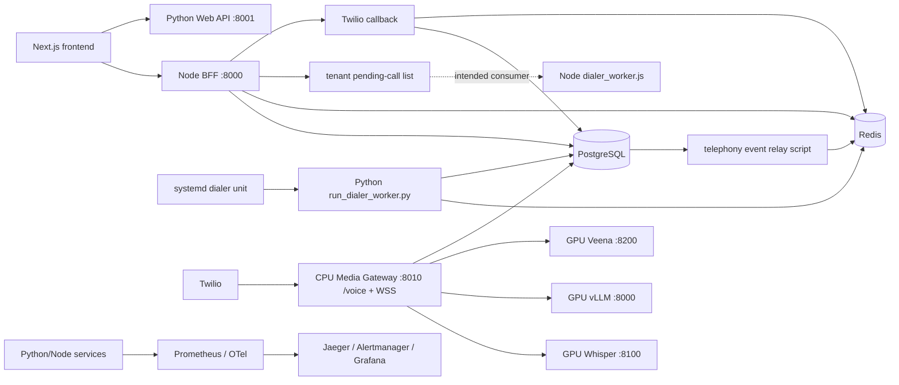

# VoiceOS Level-2 System Understanding Audit

Audit date: 2026-09-26 (Asia/Kolkata)  
Repository: `/data/data/com.termux/files/home/VoiceOS-w2-cleanup-checkout`  
Required/found HEAD: `237bc09206de9b1127375f7fc69641c9c374cc7a`  
Checkout state: detached HEAD; local `origin` points to `/data/data/com.termux/files/home/VoiceOS`.  
Scope: read-only architecture and integration audit. No source, test, deployment, or configuration was changed. This report is the only file created for this audit.

## Point 2 — authoritative integration decision (recorded before implementation)

**Decision:** use the Node `dialer_worker.js` path as the single authoritative production campaign dialer for the current W2 contract. Preserve the Python `src/services/dialer` implementation and `scripts/jobs/run_dialer_worker.py` as legacy/standalone code, but remove the Python worker from the production dialer service launch. No Python dialer code is to be deleted in this reconciliation.

**Evidence:**

1. The W2-specific contract document `docs/architecture/level2-telephony.md` explicitly declares `tenant/campaign/lead → Redis tenant queue → dialer_worker.js → Twilio Calls API → Python /voice → signed admission → media WSS → BFF /dialer/callback → durable call_attempts/active_calls + Redis completion` and calls outbound Twilio, number mapping, durable attempts, callbacks and CPS “wired into live path.”
2. `bff.js::pushToRedisQueue()` produces `voiceos:pending_calls:{tenant_id}` with lead, campaign, pipeline and tenant identity. `dialer_worker.js` consumes the same tenant list and writes `call_attempts` before Twilio invocation; it backfills CallSid afterward.
3. Node `TwilioDialer` selects an ACTIVE, outbound-enabled Twilio number scoped to tenant and campaign, applies the W2 tenant CPS limiter, points Twilio to the Python Media Gateway `/voice` admission route, and sets BFF `/dialer/callback` with lead/campaign/tenant correlation.
4. BFF callback is the W2 durable callback owner: it validates Twilio signature, locks/correlates `call_attempts` by CallSid, enforces tenant/lead/pipeline consistency and transition ordering, persists canonical telephony event/outbox state, and emits the pipeline completion signal.
5. The Python worker service currently launched by `scripts/systemd/voiceos-dialer-worker.service` instead BLPOPs `voiceos:dialer:cmds`; no producer was found. Python dialer reads `campaign_leads` and uses a static global `TWILIO_CALLER_ID`, so it cannot execute the BFF lead queue or satisfy the W2 tenant caller-ID/callback/event path as wired.

**Reconciliation plan:** (a) change the existing systemd dialer unit to launch the Node worker in explicit production mode with the same environment file; (b) retain, but identify as legacy, the Python command worker and its isolated queue; (c) connect the already implemented outbox relay to a supervised periodic systemd timer, keeping the W2 event consumer explicitly deferred as the W2 contract states; (d) test BFF enqueue, worker queue consumption and tenant/campaign/lead identity, W2 number selection, attempt/CallSid/callback/event contracts with deterministic fakes; (e) repair only proven W1 health/monitoring composition defects; (f) rerun W1/W2 regressions and report infra runtime gates as BLOCKED. No scheduler, pacing, campaign concurrency, rotation, or new retry-engine behavior is in this decision.

**Boundary:** this is a deployment/process reconciliation of the W2 contract, not a claim that Node dialer execution or production telephony was observed. Runtime remains unverified until the real Redis/PostgreSQL/Twilio/media environment is exercised.

## 1. Evidence and confidence rules

This audit distinguishes source composition from an actually running process. `CONNECTED_AND_EXECUTED` means the source has a caller and a deployment entrypoint; it does not mean this deployment was observed running. `CONNECTED_BUT_NOT_RUNTIME_VERIFIED` means source/deployment wiring is visible but no runtime execution was observed. `IMPLEMENTED_BUT_DISCONNECTED`, `DUPLICATE_IMPLEMENTATION`, `LEGACY/UNUSED`, `TEST_ONLY`, `CONFIG_ONLY`, and `UNKNOWN` identify other evidence states. Operational behavior is classified as `SOURCE_IMPLEMENTED`, `TESTED`, `RUNTIME_VERIFIED`, or `UNKNOWN`.

Evidence in this report comes from source, imports/calls, route composition, unit/integration tests, service files, Helm/Kubernetes/Docker/IaC, configuration, and the limited local environment probe. No production host, Twilio account, CPU/GPU node, live database, or deployed monitoring system was accessible. Therefore no production/runtime success is inferred from code or manifests.

## 2. Repository and baseline

- Git root: `/data/data/com.termux/files/home/VoiceOS-w2-cleanup-checkout`.
- HEAD exactly matches the required baseline: `237bc09206de9b1127375f7fc69641c9c374cc7a`.
- Branch: detached HEAD (no branch name returned by `git branch --show-current`).
- `origin` fetch/push URL: local checkout `/data/data/com.termux/files/home/VoiceOS`, not a GitHub URL.
- Working tree at audit start: 29 modified tracked files, all associated with the preceding W2 cleanup, and one pre-existing untracked `docs/runbooks/w3-production-dialer-verification.md`. These were preserved. The tracked modifications are listed at the end.
- Repository contains raw SQL migrations `scripts/db/migrations/001`–`017`, `037`–`042`, and Alembic versions under `scripts/db/migrations/alembic/versions`, including W2 revisions through `0048`.
- Major top-level areas: `.github`, `api-specs`, `architecture`, `deployment`, `docker`, `docs`, `documentation`, `evaluation`, `frontend`, `implementation`, `infra`, `monitoring`, `scripts`, `src`, `tests`. There is also checked-in `node_modules` in this checkout.
- Main configuration/build files include `pyproject.toml`, `package.json`, `jest.config.js`, `docker-compose.yml`, `.github/workflows/ci.yml`, `.github/workflows/release.yml`, `infra/helm/voiceos-platform/`, `infra/terraform/`, `deployment/{cpu,gpu}/`, `scripts/systemd/`, and `monitoring/`.

### Local runtime availability

The environment is Termux, not the deployment CPU/GPU host. `redis-cli` and `psql` binaries are present, but Docker, `systemctl`, and `mongosh` are unavailable. TCP connections were refused at local ports: PostgreSQL 5432, Redis 6379, MongoDB 27017, BFF 8000, Web API 8001, Media Gateway 8010, GPU STT 8100, GPU TTS 8200, Prometheus 9090, and Jaeger 16686 (also LLM 8000, evaluator 8300). This is evidence only about this local environment.

## 3. System overview

VoiceOS is a multi-tenant voice collections/calling platform. Its source combines a Node/Express BFF and dialer code, a Python Starlette API and service/repository layer, a Next.js frontend, a Python CPU media/call runtime, GPU-hosted STT/LLM/TTS inference services, PostgreSQL/Redis/MongoDB support, telephony integrations, CRM/collections/billing/analytics services, and operational/configuration assets.

The intended broad flow is:



The dotted Node dialer edge is implemented in source, but the installed systemd unit launches the Python worker instead. Consequently this diagram depicts competing/configured code paths, not a verified live end-to-end dialer.

## 4. Runtime processes and deployment truth

| Process | Entry point and declared command | Port / dependencies | Evidence and status |
|---|---|---|---|
| Node BFF | `scripts/systemd/voiceos-bff.service` → `/usr/bin/node bff.js` | Port 8000; PostgreSQL, Redis, JWT secret; Twilio webhook secret where configured | HTTP listener/source and unit connected; not runtime observed. |
| Python Web API | `voiceos-webapi.service` → `uvicorn src.services.web_api.main:create_app --factory --host 0.0.0.0 --port 8001 --workers 1` | 8001; PostgreSQL, optional Redis, Google OAuth, RSA session key | Composition root exists. Current baseline test collection showed application construction errors (`health_live` undefined) in API route registration; see §16. |
| CPU voice runtime | `voiceos-voice-runtime.service` → `python deployment/cpu/app.py --serve` | Default 8010; Twilio credentials, PostgreSQL/Redis/CRM, GPU STT/LLM/TTS endpoints | This is a concrete composition root creating the Twilio Media Streams app and shared call dependencies; no host runtime observed. |
| Python dialer worker | `voiceos-dialer-worker.service` → `python scripts/jobs/run_dialer_worker.py` | PostgreSQL, Redis, Twilio settings; blocks on `voiceos:dialer:cmds` | Unit exists. No producer of this command-list key was found in the inspected application paths. It is not the Node campaign pending-list consumer. |
| Node campaign dialer | `dialer_worker.js` main entry | PostgreSQL, Redis, Twilio, media gateway | Implements Redis queue consumption, Twilio dialer and pipeline tracking, but no service unit or Kubernetes workload launching this entrypoint was found. `IMPLEMENTED_BUT_DISCONNECTED` from declared deployment. |
| Frontend | `voiceos-frontend.service` → `/usr/bin/node_modules/.bin/next start --port 3000` | 3000; BFF and Web API via Next rewrites | Unit exists; executable path is unusual and was not verifiable on target host. |
| GPU LLM | `deployment/gpu/systemd/voiceos-llm.service` → vLLM Qwen2.5-7B-FP8 | 8000; GPU/model files | Declared service; not runtime observed. |
| GPU STT | `voiceos-stt.service` → `deployment/gpu/services/stt/server.py` | 8100; Whisper large-v3-turbo/GPU | Declared service; not runtime observed. |
| GPU TTS | `voiceos-tts.service` → `deployment/gpu/services/tts/server.py` | 8200; Veena/SNAC/GPU | Declared service; not runtime observed. |
| GPU evaluator | `voiceos-evaluator.service` → evaluator server | 8300; Qwen Omni/GPU | Explicit evaluation/founder-audio path; not part of customer media composition. |
| Telephony event relay | `scripts/telephony/telephony_event_relay.js` | PostgreSQL outbox and Redis list | One-shot `runOnce()` script; no deployment launcher found. Its code claims/marks outbox rows and pushes `voiceos:telephony:events:{tenant}`. |
| Daily aggregation / monthly invoicing / SLA | `infra/helm/voiceos-platform/templates/cronjob-*.yaml` and scripts | PostgreSQL | Helm CronJobs are configuration evidence; no job execution observed. |
| Monitoring | `monitoring/`, `infra/k8s/observability/`, `scripts/k8s/exporters.yaml` | Prometheus, exporters, OTel Collector, Jaeger, Alertmanager, Grafana, Loki | Primarily K8s manifests/config; Docker Compose also supplies a limited local dependency stack. No monitor process reachable locally. |
| Backup jobs | `scripts/systemd/voiceos-{mongodb-backup,vault-snapshot,backup-verification}.{service,timer}` | MongoDB/Vault/filesystem | Declared systemd timers; no timer execution/runtime evidence here. |

`docker-compose.yml` is a local dependency stack (PostgreSQL, Redis, MongoDB/Percona exporter, Prometheus/Grafana as configured), not a complete application launcher. Helm has many service subcharts, but generic charts/images do not prove that every Python service module has a process entrypoint. Current artifacts describe a mixed systemd + Kubernetes deployment intent; the active authoritative production target cannot be established without deployment access.

## 5. End-to-end lead and campaign flow

### Node BFF path

1. Frontend campaign/import calls route through `frontend/lib/api/campaigns.ts` and Next rewrites (`frontend/next.config.ts`) to Node BFF. BFF handlers in `bff.js` authenticate the request, select tenant scope, write campaign/import/lead rows, apply qualification/distribution, and emit lead execution events.
2. The BFF `distributeLeadToPipeline` path (around `bff.js:458–542`) writes lead state/events and pushes JSON onto `voiceos:pending_calls:{tenant_id}` (`bff.js:518`). Import paths write to `leads`; CRM matching queries `customer_contacts`/`customers` in PostgreSQL. This is an internal CRM association, not evidence of a live third-party CRM connector.
3. `dialer_worker.js` declares that same per-tenant pending list as its input and includes retry, callback, active-call, pipeline completion, lock, heartbeat and reconciliation key patterns. It creates Twilio calls and writes attempt/call state through PostgreSQL. Its source is connected to the BFF queue contract, but no production unit was found launching it.
4. The actual systemd dialer unit launches the Python `scripts/jobs/run_dialer_worker.py`. That worker BLPOPs `voiceos:dialer:cmds` and dispatches Python `DialerSessionManager`. The Python dialer seeds work from `CampaignLeadRepository.find_queued_for_campaign` and uses `dialer:queue:{tenant}:{campaign}` sorted sets. No producer for `voiceos:dialer:cmds` was found. Python composition (`deployment/cpu/app.py::build_dialer_services`) also uses one `TWILIO_CALLER_ID` environment value.

Thus the lead-import/pending-list/Node dialer path and deployed Python worker path are not one demonstrated execution chain. There are two lead representations (`leads` and `campaign_leads`), separate Redis work formats, different callers, and competing dialer/caller-ID behavior.

### Outcome and callback paths

- Node BFF `POST /dialer/callback` validates Twilio signatures when configured (production fails closed when the token is missing), requires CallSid/CallStatus, correlates a durable `call_attempts` row, validates pipeline/lead/tenant association, applies state ordering/idempotency, updates durable state, and emits a canonical event/outbox record. It also pushes `voiceos:pipeline:completed:{pipeline_id}` for the Node pipeline.
- The Python API separately defines `/dialer/twilio/status` and resolves CallSid using `dialer:sid:{CallSid}` in Redis, but the dialer session manager is an optional API dependency. `src/services/web_api/main.py::create_app()` does not pass `dialer_session_manager`, so these dialer routes are omitted in that composition.
- The Node Twilio dialer and Python `TwilioOutboundCallService` are competing outbound providers. Node selects tenant/campaign phone numbers via the W2 number resolver; Python uses a global static caller ID. The declared systemd process selects Python.
- `scripts/telephony/telephony_event_relay.js` claims PostgreSQL outbox records with `FOR UPDATE SKIP LOCKED`, retries with exponential delay, dead-letters after bounded attempts, then pushes to a tenant Redis list. It is not shown launched or consumed by an installed worker in the deployment inventory. This is an implemented event boundary, not a verified downstream business consumer.

## 6. Inbound and outbound telephony boundary

### Inbound / media admission

`deployment/cpu/app.py::serve()` creates `create_twilio_media_stream_app(deps)` and binds Uvicorn. `src/services/media_gateway/twilio_ws_entrypoint.py` provides HTTP `/voice`, WSS `/twilio/media-stream`, and health routes. `/voice` validates Twilio signature using configured credentials, resolves the E.164 number with `TelephonyNumberResolver`, checks number lifecycle/direction/tenant/campaign association, and issues a short-lived one-use admission token bound to CallSid and AccountSid. Twilio receives TwiML with a Stream URL and token parameter. The WebSocket `start` event verifies/consumes that token and establishes the `CallOrchestrator` context.

`AdmissionRegistry` is in-memory and explicitly not restart-persistent. A restart between HTTP admission and WebSocket start invalidates outstanding admission tokens. This is source behavior/risk, not evidence that a restart occurred.

### Outbound

The Node path constructs `TwilioDialer`, obtains an active tenant-owned outbound phone number compatible with campaign/provider, calls Twilio, and targets the media gateway `/voice` and BFF `/dialer/callback`. The Python path uses `TWILIO_CALLER_ID`, TwiML app URL, callback URL, `DialerEngine` and `DialerSessionManager`. The deployment unit selects the Python worker while the BFF queue selects the Node worker, so the intended authoritative deployed path is unresolved.

### W2 telephony contract map

| Concern | Authoritative-looking code path | Other path / integration note |
|---|---|---|
| Number ownership and inbound/outbound eligibility | `src/services/telephony/number_resolver.py` and SQL table `telephony_phone_numbers`; used by CPU media `/voice` | Node `TwilioDialer` also uses tenant/campaign number selection. Python dialer global caller ID bypasses this rotation boundary. |
| Twilio account validation / webhook signature | Media Gateway `/voice`; BFF callback; Twilio helpers | Python status callback exists separately and is conditional on API injection. |
| CallSid durable correlation | BFF callback → `call_attempts` SQL row | Python uses `dialer:sid:{CallSid}` Redis mapping. |
| Canonical state | W2 telephony call-state/provider modules and `call_attempts` | Node campaign worker also has its own execution/pipeline state. |
| CPS | `telephony_cps.js` increments `voiceos:twilio:cps:{tenant}:{epoch_second}` with 2-second expiry; Node dialer calls it | It is not evidence of provider enforcement by the Python worker path. |
| Recording | Media Gateway recording lifecycle/storage boundary + PostgreSQL metadata | Actual object store/runtime not available. |
| Call event | BFF callback → `telephony_call_events`/`telephony_event_outbox` → one-shot relay → Redis tenant list | Relay launcher and consumer not found in deployment. |
| Callback scheduling | BFF callback zset `voiceos:callback_calls:{tenant}` and Python callback APIs | Consumers and durable scheduling authority differ; campaign worker launch unresolved. |
| Media admission / WSS | Python CPU Media Gateway | Connected to `voiceos-voice-runtime.service`; not runtime verified. |

## 7. Audio and inference path

The concrete CPU composition is in `deployment/cpu/app.py`: `build_shared_call_dependencies()` constructs media/audio session services, preprocessor, STT service, conversation engine, telephony resolver, recording manager, OTel tracer and VAD factory. It derives inference endpoints from `GPU_NODE_HOST` and configured service ports. The media gateway then creates `CallOrchestrator` per WebSocket.

Execution represented in `src/services/media_gateway/twilio_ws_entrypoint.py`:

1. Twilio JSON media frames are received by the WebSocket adapter and decoded from μ-law to PCM.
2. `_pump_inbound()` feeds `AudioPreprocessor` and VAD. CPU VAD is Silero ONNX when configured; an Energy VAD fallback is present in source.
3. Speech segments are sent to STT (`WhisperHTTPAdapter` / streaming adapter) over HTTP to GPU Whisper.
4. `CallOrchestrator._run_turns()` coordinates speech hypotheses and calls the conversation engine.
5. The conversation engine uses the vLLM adapter against `/v1/chat/completions`; response clauses pass through Hindi/script conversion and Veena TTS at `/synthesize`.
6. Audio is streamed back as μ-law frames through the Twilio WebSocket adapter.

The GPU evaluator is a separate service and is not imported by the CPU customer-call composition. Model manifests/systemd files describe GPU process intent. Timeouts, retries and circuit breakers live in the adapter/scheduler layers; their runtime behavior is unverified. No GPU endpoint responded in this environment, so the complete AI path is `CONNECTED_BUT_NOT_RUNTIME_VERIFIED`.

Conversation intent, planning, negotiation, memory, empathy/emotion, sales strategy, adaptive conversation and voice persona code under `src/engines/` / `src/services/conversation_engine/` includes Level-3 behavior. It is part of or adjacent to the live engine composition, but is explicitly outside this audit's implementation scope and must not be altered as part of Level-2 integration work.

## 8. Data ownership and persistence

| Entity/domain | Main persisted representation | Writers/readers and authority assessment |
|---|---|---|
| Tenant, organization, user, role | PostgreSQL (`tenants`, organization/user/role tables; repository classes in `src/libs/repositories`) | Python tenant/user services and Node auth/admin SQL both read/write overlapping records. PostgreSQL is intended authority; enforcement is application-side. |
| Customer, contact, party | PostgreSQL `customers`, `customer_contacts`, parties; Python CRM repositories/services | Node lead import also queries customer/contact tables for matching. No deployed external CRM synchronization worker was evidenced. |
| Loan/account, EMI, PTP, settlement | PostgreSQL tables from migrations 002/003 and repositories (`loan_account`, `emi_schedule`, `promise_to_pay`, settlement) | Python collections/conversation commit path; database authority intended. |
| Campaign, pipeline | PostgreSQL `campaigns`, `pipelines` | Node BFF direct SQL and Python CampaignService/CampaignRepository both expose campaign operations. Overlapping API/business logic. |
| Lead | PostgreSQL `leads` (migration 013) and `campaign_leads` (migration 012) | BFF import/queue path uses `leads`; Python dialer repository uses `campaign_leads`. Distinct records and lifecycle create a reconciliation/authority gap. |
| Call attempt / active call / disposition | PostgreSQL `call_attempts`, `active_calls`, `call_dispositions` | Node callback/dialer and Python dialer/media call paths overlap. Redis CallSid lookup also exists in Python. |
| Phone numbers, recording, telephony events | PostgreSQL `telephony_phone_numbers`, telephony recording/event/outbox/DLQ tables | W2 migrations define durable boundary. Runtime and relay consumer not verified. |
| Callback | PostgreSQL callback requests/scheduling plus Redis callback zset/list paths | Multiple producer/consumer contracts; durable versus queue authority needs Point 2 integration proof. |
| Billing/subscription/usage/invoice | PostgreSQL usage, invoices, subscription and repository/service layer | Python billing services and Node admin/API SQL coexist. Payment provider is not production-verified; `.env` indicates a placeholder/stub integration. |
| Analytics/reporting | PostgreSQL daily aggregates/results and analytics/BI services | Python aggregation/reporting plus direct BFF campaign queries. Metrics/data reconciliation unverified. |
| MongoDB documents | MongoDB index/backup/exporter config references `response_plans`, `decision_envelopes`, `call_transcripts`, `call_lineage` | No application `MongoClient` usage found under `src`; Mongo appears primarily configured for indexes, backup and monitoring, with app ownership/writers unresolved. |
| Secrets | Vault paths/config and `src/libs/secrets`, `scripts/vault/gen_env.py` | Python Web API has a Vault-or-environment helper for Google secret; CPU environment generation consumes Vault. GPU config says inference services use environment secrets. Actual runtime retrieval/rotation unverified. |

Two migration systems are present: raw ordered SQL under `scripts/db/migrations/` and Alembic under `scripts/db/migrations/alembic/`. Alembic revisions include legacy/core and W2 linear history ending at `0048` per repository tests/docs. Operationally, the selected migration runner and deployment sequencing must be established before Point 2 changes.

## 9. Redis inventory and semantics

| Pattern | Producer / consumer | Scope and semantics visible in code | Recovery caveat |
|---|---|---|---|
| `voiceos:pending_calls:{tenant}` | BFF `LPUSH`; Node worker `BRPOP` | Tenant list; queue payload contains lead/campaign/pipeline | Node consumer has no declared production launcher; list claim is not coupled to the Python worker. |
| `voiceos:retry_calls:{tenant}` | Node dialer retry path | Tenant sorted set with scheduled timestamps | Source declares retry/recovery; no live Redis evidence. |
| `voiceos:callback_calls:{tenant}` | BFF scheduling and Node worker | Tenant sorted set / scheduled callback payload | Producer/consumer behavior spans BFF and unlaunched Node worker. |
| `voiceos:active_calls:{tenant}` | Node worker | Tenant hash for active-call tracking | Reconciliation code exists; runtime unavailable. |
| `voiceos:pipeline:completed:{pipeline}` | BFF callback pushes; Node worker consumes | Pipeline list with expiry set by BFF | Consumer is on unlaunched worker path. |
| `voiceos:call:lock:{lead}:{campaign}` (worker helper takes identity) | Node worker | TTL lock for duplicate control | Key is not tenant-prefixed in the declared pattern; correctness depends on globally unique IDs and implementation arguments. |
| `voiceos:worker:{id}:alive` | Node worker heartbeat; BFF status reads | TTL heartbeat (worker code uses 90s expiry) | Worker deployment mismatch means status may be stale/empty. |
| `voiceos:reconcile:{attempt}` | Node crash reconciliation | TTL lock (`EX 120`) | No runtime recovery evidence. |
| `dialer:queue:{tenant}:{campaign}` | Python DialerQueue/Session | Sorted set; configured 48-hour expiry in current cleanup source | No producer for Python command list found; separate queue namespace. |
| `voiceos:dialer:cmds` | Python worker BLPOP | Global command list, no tenant in key itself | No producer found. |
| `dialer:sid:{CallSid}` | Python dialer writes; Python webhook reads | CallSid mapping with 24-hour TTL | Separate correlation from durable SQL callback path. |
| `voiceos:twilio:cps:{tenant}:{epoch-second}` | `telephony_cps.js` | INCR, key TTL 2 seconds, tenant-scoped CPS bucket | Called by Node worker only; Redis unavailable. |
| `voiceos:telephony:events:{tenant}` | Event relay `LPUSH` | Tenant Redis list | No consumer/deployment was found for this list. |
| `voiceos-events`, `dlq:{stream}`, `voiceos:dedup:*` | `src/libs/event_bus` | Redis Streams, dead-letter stream, dedup key | Separate generic event bus from telephony event outbox relay. |
| `voiceos:revoked_jti:{jti}`, API/login rate keys, idempotency keys | Node BFF | TTL revocation, rate counters, idempotency response cache | Application auth/rate behavior depends on Redis availability; actual fail mode varies by helper. |
| `voiceos:lock:*`, fencing keys, `voiceos:ratelimit:*` | `src/libs/redis_client` | Shared lock/fencing/rate-limit abstractions | Coexists with bespoke BFF/dialer keys. |
| model/feature/config, PII token keys | AI config/feature flags/PII tokenizer | Namespaced tenant keys; PII token TTL guard | Usage is service-specific; no single Redis inventory/owner registry was found. |

`docker-compose.yml` configures Redis persistence (AOF) but also a 512 MB maxmemory with `allkeys-lru`; eviction may remove queue/state keys. This is a configuration risk, not an observed data loss. Redis abstractions are duplicated: generic event bus, Python dialer queue, Node dialer lists/zsets/hashes, and CPS/idempotency/rate-limit helpers.

## 10. API, frontend, authentication and tenant boundaries

### Process/API surface

- Node `bff.js` owns `/auth/*`, `/health/*`, `/system/health`, campaign/pipeline/lead imports and distribution, admin/team/enrichment, campaign analytics, dialer status/history/queue/recording access, `/dialer/twiml`, `/dialer/callback`, and callback scheduling. It uses direct `pg.Pool` queries and ioredis.
- Python `src/services/web_api/api.py::create_web_api()` declares auth/health, tenant/team/HITL, campaigns and lifecycle, platform/admin, billing, CRM, collections, leads/imports, reports, analytics, alerts/ops intelligence/System-X, optional dialer routes, call summary and pending callbacks. Many route groups are conditionally appended only when a service dependency is passed.
- Python `src/services/web_api/main.py::create_app()` composes database-backed campaign, CRM, billing, analytics, reporting, compliance, admin and ops services. It does not pass a dialer session manager, lead-intake service, telephony callback service, or a number of optional route services. The optional `/campaigns/{id}/dialer/*` and `/dialer/twilio/status` routes are therefore absent from this production composition.
- Frontend uses Next.js (`frontend/`), `frontend/lib/api/fetch-client.ts`, campaign/admin/client API modules, and rewrites in `frontend/next.config.ts`: `/bff/*` to Node port 8000 and `/webapi/*` to Python port 8001.

### Authentication/authorization

- Node login in `bff.js` issues HS-signed JWTs; middleware validates token/revocation and populates tenant/user/role, `requireRole` gates platform actions, and SQL predicates commonly include `tenant_id`.
- Python Web API uses `WebSessionCodec` RSA RS256 sessions and Starlette middleware/tenant permission dependencies. Python session tokens are not the same contract as Node HS JWTs.
- Frontend `proxy.ts` checks cookie presence/actor kind for routing but is not the cryptographic authorization boundary; backend validation is expected.
- Google OAuth endpoints are in Python Web API. The frontend invitation/start link uses `NEXT_PUBLIC_BFF_URL/auth/google/start`, while the inspected Node BFF route list does not implement that endpoint. This is an API routing mismatch candidate.
- Tenant boundaries are mostly enforced in application handlers and SQL predicates; no PostgreSQL RLS policy was found. Security depends on every direct SQL/repository caller preserving the tenant predicate. Public Twilio callback/voice endpoints rely on Twilio signature, CallSid correlation and media admission boundary.

Classification: both API stacks are source-connected to frontend/deployment, but auth/session and route ownership are duplicated and inconsistent. No authenticated end-to-end browser/API flow was run.

## 11. CRM, billing, analytics and compliance

- **CRM/collections:** `src/services/crm` and customer/party repositories power Python `/crm/customers`; `src/services/collections` contains loan, EMI, escalation and PTP logic. The Web API composition wires CRM and escalation. Node lead import performs internal customer matching. `integration_platform` exists, but no launched third-party CRM synchronization process was evidenced. CRM integration is therefore partial/internal, not a verified external sync.
- **Billing:** `src/services/billing` and `src/libs/repositories/billing.py` implement subscription, entitlement, usage and invoice services; Python admin routes and BFF admin routes overlap. Helm has monthly-invoicing CronJob. Payment connector is documented/configured as a stub/placeholder; no real settlement/reconciliation runtime observed.
- **Analytics/BI:** Python analytics aggregation, campaign/call analytics, realtime, BI warehouse/dashboard and reporting/export modules exist. Web API composes several; Node BFF has direct campaign summary queries. CronJobs declare daily aggregation. No source-of-truth reconciliation or running aggregation was verified.
- **Compliance/security:** consent, audit, PII tokenization, compliance monitoring, policy engine, governance, authz/RBAC and security scripts exist. The media consent gate is part of the media path source. Cross-tenant database enforcement remains application-level in inspected paths; live policy enforcement and retention/deletion were not run.

## 12. Observability and recovery

- Python telemetry: `src/libs/observability`, Prometheus-client metrics, OTel tracer, and W2 telephony/STT/media metric call sites. Node BFF has `/metrics` and in-process counters; Node worker also has an in-process counter map.
- Prometheus: `monitoring/prometheus/prometheus.yml` scrapes app and exporter targets including BFF, GPU, MongoDB exporter and node/Redis/PostgreSQL exporters. Alert rules live under `monitoring/prometheus/alert_rules/`; Alertmanager config under `monitoring/grafana/alerts/` and K8s scripts.
- Traces: `monitoring/tracing/otel-collector.yml` receives OTLP 4317/4318, exports to Jaeger collector; Jaeger config uses Badger and deployment manifest specifies native span TTL `168h0m0s` (`infra/k8s/observability/otel-jaeger.yaml`). This is configured, not proof of received, persisted, or expired traces.
- Logs: Fluent Bit/Loki configs and query examples exist; K8s Fluent Bit manifests exist.
- W1 monitoring/backup/recovery includes system health/readiness, systemd restart limits, MongoDB exporter, Vault snapshot, Mongo dump, backup artifact verification, restore scripts/runbooks and Prometheus alerts. All are implementation/config evidence. W1 prior automated scope was reported green (Python 304 passed; Jest 74 passed; SIGTERM 9 passed; focused coverage 91.78%; selected mypy clean; 6 integration passed and 8 skipped for DB services). Runtime was explicitly BLOCKED. Current baseline API app-construction errors mean W1 health route integration should be revalidated after fixing that independently in Point 2.

## 13. Test and verification baseline

Evidence inherited from the preceding W2 cleanup verification on this exact SHA/worktree, before this audit (no audit changes to code):

- W2 Python scoped tests: 243 passed; 1 GPU integration skipped because `GPU_NODE_HOST` was unset.
- Jest W2: 12 suites, 72 tests passed.
- W2 Ruff scope clean; direct W2 mypy clean (16 source files); full transitive mypy had 18 out-of-scope imported errors.
- Alembic CLI blocked by missing `libdl.so`; repository migration graph tests passed.
- Real Redis CPS integration not executed because Redis unavailable (setup errors were explicitly not counted as test passes).
- W2 runtime and real Twilio/media/inference remained blocked.

Read-only baseline probes executed in the preceding audit stage:

1. Python focused dialer/campaign command in Ubuntu Proot, `pytest ... -q -p no:cacheprovider --no-cov`: 80 passed, 8 errors. All 8 errors came from Starlette Web API app construction at `src/services/web_api/api.py:330`, `NameError: health_live is not defined`; affected API campaign tests did not execute their bodies.
2. Jest `./node_modules/.bin/jest --runInBand tests/jest/bff/campaigns.test.js tests/jest/bff/dialer.test.js tests/jest/dialer_worker`: 6 suites, 42 passed, 11 failed. Failures were campaign test identifiers such as `c-001`/`no-such-id` rejected by `requireUUID` with 400 while those expectations asked for 404/200/409. Dialer and worker suites passed. This is a baseline failure; it was not corrected here.

These test results are not runtime evidence. The API test setup error and BFF expectation mismatch are concrete findings to triage in Point 2, without assuming the test or implementation is at fault before contract review.

## 14. Duplicate, disconnected and competing implementations

| Components | Actual observed/source path | Other path | Risk / classification |
|---|---|---|---|
| Dialer work execution | systemd launches Python `run_dialer_worker.py` reading `voiceos:dialer:cmds` | BFF writes `voiceos:pending_calls:{tenant}` for `dialer_worker.js` | Queue producer/consumer mismatch; campaign path not shown to execute. |
| Caller ID | Python deployed composition uses global `TWILIO_CALLER_ID` | Node `TwilioDialer` selects tenant/campaign number from W2 phone-number table | Tenant-aware W2 contract not applied by declared worker. |
| Leads | BFF import/distribution uses `leads` | Python dialer uses `campaign_leads` | Duplicate business representations; no synchronization proof. |
| CallSid lookup | BFF callback queries durable SQL `call_attempts` | Python callback resolves Redis `dialer:sid:*` | Competing correlation and callback state authority. |
| Campaign API | Node BFF direct SQL routes | Python CampaignService/API routes | Duplicate campaign state transitions and authorization contracts. |
| User sessions | Node HS JWT | Python RSA WebSessionCodec | Separate identity/session trust contracts; frontend paths may mix them. |
| Event delivery | W2 PostgreSQL telephony outbox + one-shot telephony relay | Generic Redis Streams event bus/DLQ | Separate event systems; telephony relay lacks shown launcher/consumer. |
| MongoDB | Mongo configured for replica set, indexes, backups/exporter | No application Mongo client usage found under `src` | Database role/data ownership unclear; likely config-only or legacy for app traffic. |
| Service chart vs app process | Helm subcharts for many service names | Most Python domains are library modules; concrete app entrypoints are few | Chart presence does not prove a runnable per-domain service image/command. |
| TwiML/media entry | BFF `/dialer/twiml` constructs stream TwiML with public websocket URL | Node TwilioDialer invokes Media Gateway `/voice`; Python `/voice` mints signed admission | Distinct media admission routes may bypass the W2 signed path depending on TwiML configuration. |

## 15. Workstream map (Level 2)

Statuses below describe source and available evidence at this audit; tracker claims are not accepted as runtime evidence.

| Workstream | Source areas/evidence | Integration and tests/runtime status |
|---|---|---|
| W1 Production stabilization | Health, systemd, monitoring, exporter, backup/restore, OTel/Jaeger and runbooks | Automated suite previously reported green for executable scope; DB integration partly skipped; runtime BLOCKED. Current API `health_live` app-construction error requires Point 2 investigation. |
| W2 Real telephony production layer | `src/services/telephony`, `media_gateway`, STT, call state/number resolver, SQL migrations 037–048, BFF callbacks | Scoped automated regression reported green. Media composition has a service entrypoint; actual deployed dialer and callbacks split across Python/Node paths. Twilio/Redis/DB/GPU runtime BLOCKED. |
| W3 Production dialer | `dialer_worker.js`, Python dialer, campaign scheduler/lifecycle, queue/retry/callback code | Existing source is fragmented and Node worker not declared launched; Python worker listens on an unproduced command key. Not ready for implementation until Point 2 integration resolves authority. |
| W4 CRM integration | CRM, collections, integration platform, customer repositories | Internal CRM service exists; external connector/reconciliation runtime not demonstrated. |
| W5 Billing/commercial | Billing services/repositories, metering, invoices, payment | Partial source/API; provider integration and usage reconciliation unverified; payment stub/placeholder. |
| W6 Tenant administration | tenant management, org/user services, admin portal, RBAC | Broad source/API exists; duplicated auth/API stores and live lifecycle isolation unverified. |
| W7 Customer dashboard | `frontend/` Next.js app, client/admin modules | Source exists; route/auth mismatch candidates; no browser E2E/runtime verification. |
| W8 Analytics/BI | analytics, BI, reporting, dashboards | Source and CronJobs exist; correctness against authoritative call/billing data unverified. |
| W9 Compliance/governance | compliance monitoring, consent, policy/governance, audit, PII | Source and tests exist; deployed enforcement/retention/data-rights proof absent. |
| W10 Security hardening | auth/authz, JWT/mTLS, Vault/secrets, rate limiting, security tests/scripts | Controls exist; dual sessions and code-level tenant isolation are risks; production scan/runtime proof absent. |
| W11 Scalability | queues, worker/concurrency code, K8s/IaC, load tests | Artifacts exist; actual capacity and queue durability not measured; Redis eviction policy risk. |
| W12 Multi-GPU/compute | GPU scheduler/fleet monitoring, model services, manifests | Source/config exists; GPU service routing/failover/drain not runtime verified. |
| W13 Deployment engineering | systemd, Helm, Terraform, Docker Compose, CI/release scripts | Multiple deployment models and image/chart mismatch candidates; no staging promotion/rollback evidence. |
| W14 Data platform | PostgreSQL, raw SQL/Alembic, Mongo config, Redis, event bus, reporting | Multiple migration tracks and duplicate lead/call paths; authority and runtime reconciliation incomplete. |
| W15 Model/voice infrastructure | STT/LLM/TTS adapters and GPU servers, VAD/audio preprocessing | Concrete media composition is wired in source; GPU/runtime latency, failover and model rollback unverified. No Level-3 improvements in scope. |
| W16 Customer onboarding | signup/OAuth/invitation/admin/campaign/import flows | Partial routes/UI; OAuth path mismatch candidate; no end-to-end self-service verification. |
| W17 Operational support | admin, alerts, System-X, monitoring, runbooks | Source/config exists; incident/recovery workflow and service launch integration unverified. |
| W18 Cost optimization | `src/services/cost_optimizer`, ops analytics, GPU metrics | Source exists; end-to-end tenant/call cost attribution and margin evidence absent. |

## 16. Level-2 / Level-3 boundary

Level-2 infrastructure/business execution includes stabilization, telephony, campaign/dialer execution, CRM, billing, tenant administration, dashboard, analytics, compliance, security, scaling, GPU/compute orchestration, deployment, data, model/voice serving infrastructure, onboarding, operational support, and cost measurement.

Level-3 behavior includes deeper conversational intent/reasoning, adaptive persuasion, negotiation and objection strategy, relationship/customer memory, emotion/context interpretation, autonomous conversation optimization, sales strategy, conversation learning/RL, coaching, and voice/persona/Hinglish fine-tuning. Relevant code families include `src/engines/intent`, `goal_planner`, `dialogue_policy`, `negotiation`, `memory`, `emotion`, `empathy`, `adaptive_conversation`, `sales`, `strategy`, `prompt_builder`, and conversation-engine prompt/policy behavior. This audit did not alter them. Point 2 must preserve their existing interfaces while validating the infrastructure call path.

## 17. Failures, recovery and evidence classification

| Area | Source behavior | Evidence class now | Unknown/unverified |
|---|---|---|---|
| systemd restart | Units set `Restart=on-failure`, restart delay, start limits, stop timeout | SOURCE_IMPLEMENTED; some W1 config tests previously TESTED | No process restart/recovery drill in this environment. |
| DB/Redis readiness | Python health aggregator checks PostgreSQL and optional Redis; BFF has health/readiness routes | SOURCE_IMPLEMENTED; Python API construction error blocks current route test | No DB/Redis endpoint available. |
| dialer crash recovery | Node reconciler queries stale calls, uses per-attempt Redis locks; Python engine/session state and callback lookup exist | SOURCE_IMPLEMENTED; relevant tests exist/run as prior W2 | Actual worker path not aligned with queue producer; no crash drill. |
| webhook idempotency/order | BFF callback SQL lock/call state logic; W2 tests reported green | TESTED in scoped suite | Twilio callback ordering and persistence not exercised live. |
| media disconnect/shutdown | WebSocket lifecycle and W2 carrier-close fix in current cleanup delta | TESTED in targeted/full W2 suite per preceding verification | Real carrier stream and process shutdown not exercised. |
| event outbox retry/DLQ | Relay uses stale claim recovery, bounded attempts and DLQ | SOURCE_IMPLEMENTED; unit tests in repository | No relay process launch or Redis consumer proven; DB/Redis unavailable. |
| backup/restore | Mongo/Vault backup scripts, verification and restore runbooks/scripts | SOURCE_IMPLEMENTED; earlier W1 tests reported | No live snapshot, integrity check or restore drill. |
| GPU/provider errors | Adapters contain timeout/retry/error classification/circuit behavior | SOURCE_IMPLEMENTED; scoped adapter tests | No GPU/Twilio service available for runtime evidence. |

## 18. Concrete Point 2 work required (not performed here)

1. Select and document one production dialer entrypoint. Align systemd/Kubernetes launch, BFF queue producer, lead table, queue key/payload, caller-ID resolver, attempt persistence and callback path. Prove the chosen worker actually claims a campaign lead.
2. Decide whether `leads` or `campaign_leads` is authoritative and define a migration/synchronization contract; ensure a single idempotent durable attempt state bridges campaign work to W2 telephony.
3. Wire the signed Media Gateway `/voice` admission path for every outbound Twilio request. Audit/remove ambiguity from BFF `/dialer/twiml` versus `/voice`; ensure production stream URL and public signature URL agree.
4. Choose the durable CallSid/callback authority. Reconcile Python Redis `dialer:sid:*` callback path with BFF SQL `call_attempts` path; ensure event outbox relay has a supervised launcher and a real idempotent consumer.
5. Fix and verify Web API composition/health route construction (`health_live`/`health_ready` undefined in current API route registration), then rerun health/readiness and Web API tests. Diagnose the 11 BFF campaign Jest failures against the actual UUID contract.
6. Resolve Node HS JWT versus Python RSA WebSession session issuance/validation and route target so frontend login leads to a valid authenticated API session. Verify OAuth route target.
7. Establish database migration authority/order (raw SQL versus Alembic), and test against the actual PostgreSQL schema; verify Redis key TTL, persistence, eviction policy, tenant scoping, queue durability and consumer recovery.
8. Determine MongoDB's intended application data owner; either identify its real writers/readers and runtime, or explicitly deprecate the disconnected app data contract (as a later authorized change).
9. Verify actual deployment target and image/command mapping. Reconcile systemd and Helm service definitions, frontend executable path, images/build workflow, ports, health probes, secrets/Vault, and jobs.
10. With infrastructure supplied, perform staged end-to-end inbound and outbound calls and observe CallSid, media, STT/LLM/TTS, recording, SQL state, outbox, Redis consumer, metrics/traces, and recovery. Only then classify runtime/production behavior.

### Dependencies to preserve before W3–W18

- W2 number ownership/resolution, provider failure contract, call-state transitions, CallSid correlation, signed admission, media WebSocket, callback idempotency, CPS limiter, recording boundary, timezone/calling-window policy, telephony metrics and canonical event schema.
- W1 health/readiness, supervised process lifecycle, monitoring/alerting, backup/restore, trace context and operational runbooks.
- One canonical tenant/user/session identity contract and tenant predicates; migration chain/ownership; durable lead/call/attempt identities; Redis key and event semantics.
- Existing Level-3 conversation-engine contracts must remain stable while infrastructure routing is corrected.

## 19. Direct answers

1. **What is VoiceOS?** A multi-tenant voice collections/calling platform with web/API, campaign/lead, telephony/media, inference, CRM/collections, billing, analytics and operations code.
2. **Major components?** Node BFF, Python Web API/service layer, Next frontend, Python CPU media/call composition, Node and Python dialer implementations, GPU STT/LLM/TTS, PostgreSQL, Redis, configured MongoDB, observability and deployment tooling.
3. **What actually runs?** Source declares systemd CPU/GPU processes and Helm jobs/services. No target host could be inspected; locally none of the app/DB/GPU/monitor ports responded. Actual production process state is UNKNOWN.
4. **What does not run?** No local services ran. In deployment declarations, Node `dialer_worker.js` and telephony event relay have no matching service launcher; most charted service domains are libraries unless an image provides a real entrypoint.
5. **Real end-to-end path?** A source-level BFF lead list can reach Node worker queue contract, but the declared systemd worker is Python on another command queue and lead model. Full campaign-to-customer path is not proven integrated.
6. **Telephony path?** Python CPU Media Gateway has concrete `/voice` → signed admission → WSS → CallOrchestrator composition. Outbound paths conflict between Node tenant-aware TwilioDialer and Python static caller ID. Runtime blocked.
7. **AI path?** CPU media composition calls GPU Whisper, vLLM and Veena endpoints after CPU preprocessing/VAD; output streams back through Twilio. Source wired, endpoints unavailable.
8. **Dialer path?** Two competing workers; systemd selects Python, while BFF queue connects to Node code. No complete authoritative path identified.
9. **CRM path?** Python CRM/collections is composed into Web API; Node does SQL matching. No external CRM connector worker was evidenced.
10. **Billing path?** Python billing services/admin APIs and PostgreSQL usage/invoices exist, plus Helm monthly job; Node admin overlap and payment-provider stub remain.
11. **Authoritative databases?** PostgreSQL is intended authority for transactional business records; Redis is operational queue/cache/limit state. MongoDB application data authority is unclear; source consumers were not found.
12. **Authoritative Redis?** No single authority across dialer: Node lists/zsets, Python sorted-set/command queue, generic event streams and telephony event lists coexist.
13. **Authoritative deployment?** Unresolved mixed systemd/Helm intent; systemd units clearly specify CPU/GPU commands, but no production deployment was accessible.
14. **Duplicates?** Dialers, lead tables/queues, callback/CallSid correlation, campaign APIs, auth/session systems, event bus/outbox, caller-ID selection, and multiple migration tracks.
15. **Disconnected?** Node dialer launch, telephony relay launch/consumer, optional Python dialer routes in main composition, Mongo app data path, several generic service charts.
16–17. **Are W1/W2 integrated?** W1 operational artifacts are present and automated checks previously passed in executable scope, but runtime blocked; one current Web API app construction defect threatens health routes. W2 has passing scoped automated evidence, but telephony runtime is blocked and dialer integration is partial/disconnected at deployment.
18. **W1/W2/future W3 contracts?** W1 supplies health/supervision/observability/recovery; W2 supplies phone-number, provider, call state, admission, media, callback, CPS, recording and event boundaries; W3 must consume these, but cannot safely proceed until worker/queue/data authority is reconciled.
19–21. **Missing/broken/unverified?** A single launched dialer path, lead/attempt authority, relay consumer, API health construction, auth interoperability, migration deployment authority, Mongo ownership, and real runtime evidence. Broken baseline checks are the Web API `health_live` NameError and 11 campaign Jest expectation failures. Many operational behaviors remain unverified.
22–23. **Level 2/3?** W1–W18 execution/operations are Level 2; conversational reasoning, persuasion, memory, emotion, learning and voice-persona adaptation are Level 3.
24. **Do not change yet:** Level-3 engine behavior; W1/W2 business contracts; queue/migration/auth ownership until Point 2 establishes the authoritative execution design.
25. **Point 2 corrections:** those in §18, performed only after review/authorization and then tested as one integrated path.
26. **Preserve before W3–W18:** the dependencies listed in §18, particularly W2 trust boundaries, tenant identity, state/event schemas, migrations, and W1 operational safeguards.

## 20. System status

- **Architecture understanding:** INCOMPLETE. Major source/deployment structure and critical paths are mapped, but the user requested an entire-repository audit; code volume and inaccessible deployment state leave unresolved runtime and several module-level details.
- **Runtime architecture mapped:** YES, at source/configuration level; actual production runtime state UNKNOWN.
- **W1 integration:** PARTIAL. Operational components/config/tests exist; no runtime evidence, and current Web API health route registration has a reproducible construction failure.
- **W2 integration:** PARTIAL. Media/telephony boundaries are composed in source and scoped tests passed, but outbound worker, callback and queue authorities diverge; actual carrier path not tested.
- **Major duplicate implementations:** Python/Node dialers; `leads`/`campaign_leads`; Python/Node callbacks and CallSid maps; BFF/Web API campaign and auth/session systems; Redis queue/event abstractions; raw SQL/Alembic migrations.
- **Major disconnected implementations:** Node campaign worker lacks deployment launcher; Python dialer command queue has no identified producer; event relay lacks launcher/consumer; Mongo app data has no source client; optional Python dialer API is not composed by `main.py`.
- **Critical integration risks:** campaign work may not reach the deployed dialer; static caller ID can bypass tenant number selection; media admission URLs differ; callback authority duplicates; event outbox has no demonstrated relay consumer; API sessions differ; health route construction failure; tenant isolation is application-enforced.
- **Critical missing components:** an evidenced single end-to-end deployed dialer/lead/telephony contract and runtime test; supervised event relay/consumer; authoritative data/migration/identity integration decisions.
- **Runtime blockers:** no reachable CPU/GPU deployment, Twilio credentials/number/webhook ingress, Redis/PostgreSQL/MongoDB/Vault, object storage, Docker/systemd, or monitoring stack in the current environment.
- **W3 readiness:** NOT READY. Point 2 must reconcile the real process/queue/data/caller-ID/callback integration and validate W1/W2 boundaries before production dialer implementation.

## Appendix A — W2 cleanup working-tree delta preserved

Modified tracked files:

```text
src/services/dialer/dnd.py
src/services/dialer/engine.py
src/services/dialer/queue.py
src/services/dialer/session.py
src/services/media_gateway/admission.py
src/services/media_gateway/consent_gate.py
src/services/media_gateway/metrics.py
src/services/media_gateway/recording_lifecycle.py
src/services/media_gateway/twilio_ws_entrypoint.py
src/services/stt/adapters/whisper_adapter.py
src/services/stt/adapters/whisper_http_adapter.py
src/services/stt/adapters/whisper_streaming_adapter.py
src/services/stt/metrics.py
telephony_callback_policy.js
telephony_provider_failure.js
tests/integration/services/test_twilio_tenant_routing.py
tests/integration/services/test_whisper_http_adapter_integration.py
tests/jest/bff/dialer.test.js
tests/unit/services/test_dialer.py
tests/unit/services/test_media_gateway_consent_gate.py
tests/unit/services/test_phase7_dialer_worker.py
tests/unit/services/test_recording_lifecycle.py
tests/unit/services/test_telephony_metrics.py
tests/unit/services/test_telephony_migrations.py
tests/unit/services/test_telephony_phone_numbers.py
tests/unit/services/test_twilio_admission.py
tests/unit/services/test_twilio_ulaw_framing.py
tests/unit/services/test_twilio_ws_entrypoint.py
tests/unit/services/test_whisper_http_adapter.py
```

Pre-existing untracked file: `docs/runbooks/w3-production-dialer-verification.md`. It was not edited during this audit. Audit-created file: `docs/audits/level2-system-understanding.md`.
