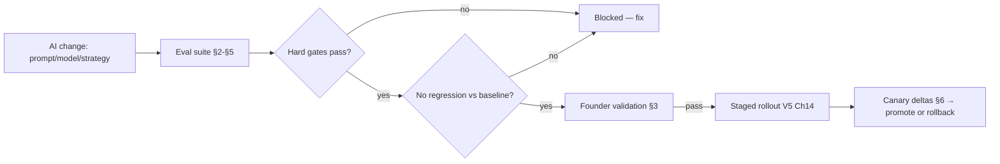

# VoiceOS v2 — Documentation Suite

## Document 10 — AI Evaluation Handbook

**Type:** Canonical AI-quality measurement reference (documentation layer over Volumes 1–7)
**Status:** Living reference · **Owner:** AI Engineering · **Governance:** Security & Governance (safety)
**Authority:** Volumes 1–7 are immutable + canonical. This handbook **consolidates** how AI quality is measured — V2 Ch22 (quality scoring), V4 Ch14 (AI safety), V1 Ch17/23 (MOS/latency), V2 Ch6/17 (risk/output evaluation) — and ties to the Testing Catalog (DocSuite-08) + AI-eval CI gate (V6 CICD-5). It defines no new behavior; the volumes are authoritative. Citations: `V<n> Ch<c>`.

> **Why this exists.** AI changes (prompts, models, strategies) must be proven safe + non-regressive before reaching production. Evaluation is the gate (V6 CICD-5): golden datasets + conversation replay + safety/red-team + the scores below, run before any staged rollout (V5 Ch14). **The Law of Authority red-team (0 unauthorized effects) is the non-negotiable bar.**

---

## 1. Evaluation principles

- **Gate, not afterthought.** AI changes pass evaluation before canary (V6 CICD-5); quality/compliance must not regress vs baseline.
- **Multi-dimensional.** No single score — conversation, negotiation, compliance, empathy, voice, latency, and safety are scored together (a fluent-but-non-compliant agent fails).
- **Grounded + reproducible.** Evaluation uses versioned **golden datasets** + deterministic **conversation replay** (V3 Ch7 recorded decisions) so results are comparable across versions.
- **Human + automated.** Automated scores + **founder validation** (qualitative expert judgment) together gate pilot/release.

## 2. The score set

> Each score has a definition, a method, and a bar. Bars are directional; exact thresholds are tuned + tracked on the eval dashboard (§5). Regression beyond threshold blocks promotion.

### 2.1 Conversation quality  *(V2 Ch22)*
- **Measures.** Coherence, relevance, goal progression, turn-taking, naturalness.
- **Method.** Rubric scoring over golden + replayed conversations (automated + sampled human).
- **Bar.** ≥ baseline; no regression.

### 2.2 Negotiation quality  *(V2 Ch5)*
- **Measures.** Appropriate option exploration **within the Negotiation Envelope**, hardship sensitivity, path to a sound PTP — without pressure.
- **Method.** Scenario suite + replay; envelope-adherence check.
- **Bar.** **0 out-of-envelope offers** (hard); negotiation-quality ≥ baseline; PTP-appropriateness up or flat.

### 2.3 Collections effectiveness  *(V5 Ch5/11)*
- **Measures.** Business outcome — RPC, PTP rate, kept-PTP, recovery — attributed via `DecisionEnvelope` lineage (V5 Ch11).
- **Method.** Outcome analytics over pilots/cohorts (not just per-call scores).
- **Bar.** Outcomes ≥ baseline; improvements causally attributable (not at the expense of compliance/empathy).

### 2.4 Compliance score  *(V4 Ch2/14)*
- **Measures.** Verification-before-disclosure, mandatory disclosures, calling-window adherence, no harassment, Law-of-Authority adherence.
- **Method.** Compliance scenario suite + red-team (V4 Ch21).
- **Bar.** **0 pre-verification disclosures; 100% mandatory-disclosure completeness; 0 unauthorized effects** — all hard gates.

### 2.5 Emotion score  *(V2 Ch13 / V1 Ch19)*
- **Measures.** Correct detection of customer emotion + appropriate tone response (delivery), without overriding policy.
- **Method.** Labeled emotion set; rendering check (→ DocSuite-07).
- **Bar.** Emotion-appropriateness ≥ baseline; **policy never overridden by tone** (hard).

### 2.6 Empathy score  *(V2 Ch7)*
- **Measures.** Validating, patient, respectful handling — especially under distress/frustration.
- **Method.** Rubric over distress/frustration scenarios + human sampling.
- **Bar.** ≥ baseline; distress de-escalation effective.

### 2.7 Pronunciation score  *(V1 Ch15–20 / DocSuite-07)*
- **Measures.** Correct, consistent pronunciation of terms/amounts/dates/names/brands; normalization applied.
- **Method.** Pronunciation golden set (DocSuite-08 §11).
- **Bar.** Accuracy targets met; **forbidden pronunciations = 0** (DocSuite-07 §8).

### 2.8 Latency score  *(V1 Ch23 / V3 Ch19)*
- **Measures.** First-audio + per-budget-line latency under load.
- **Method.** Traced calls (V3 Ch17); perf gate.
- **Bar.** **first-audio p95 ≤ 1.5 s**; no budget-line regression.

### 2.9 MOS (Mean Opinion Score)  *(V1 Ch17)*
- **Measures.** Perceived voice quality/naturalness.
- **Method.** Rated samples (human + proxy metrics).
- **Bar.** MOS ≥ target; no audio artifacts.

### 2.10 Interruption handling  *(V1 Ch6/21)*
- **Measures.** Barge-in responsiveness — stop-on-interrupt, correct re-planning, no talk-over.
- **Method.** Barge-in scenario suite.
- **Bar.** Clean barge-in handling; played-offset coherence (RI-6).

### 2.11 Hallucination detection  *(V4 Ch14 / V2 Ch17)*
- **Measures.** The model asserting unsupported facts — should be impossible for *authoritative* facts (Law of Authority) and minimized elsewhere.
- **Method.** Fact-grounding checks; red-team prompts attempting to elicit invented facts/amounts.
- **Bar.** **0 unauthorized/authoritative-fact hallucinations** (Law of Authority hard gate); general hallucination ≤ threshold.

### 2.12 Risk score  *(V2 Ch6)*
- **Measures.** The Risk Engine's veto behavior — does it correctly veto unsafe/non-compliant responses without over-blocking?
- **Method.** Risk scenario suite; precision/recall of vetoes.
- **Bar.** No unsafe response passes (Output Evaluation ≥ Policy, V2 Ch17); over-blocking within tolerance.

## 3. Founder validation process

- **Purpose.** Expert human judgment (founder/domain lead) on real-world quality + collections appropriateness — the qualitative complement to automated scores.
- **Process.** Curated + live-sampled conversations → reviewed against the founder-validation rubric (template DocSuite-12) → **Founder Validation Report** with pass/fail + notes + required fixes.
- **Gate.** Blocking for pilot + major AI changes; "brutal honesty over validation" is the explicit stance.

## 4. Pilot acceptance criteria

A pilot is accepted (go) only when ALL hold:
1. All automated scores ≥ baseline; **all hard gates pass** (0 unauthorized effects, 0 pre-verification disclosure, 100% disclosures, 0 out-of-envelope, latency budget).
2. Collections effectiveness (§2.3) meets the pilot target over a sufficient sample.
3. Founder validation (§3) = pass.
4. No safety/compliance incidents in the pilot (V4 Ch16/17).
5. Operational SLOs held during the pilot (V7 Ch1).

*Failing any hard gate is an automatic no-go regardless of other scores.*

## 5. Regression benchmarks & golden datasets

- **Golden datasets** (`ai/eval`, V6 Ch9): versioned, reviewed input→expected-behavior sets per dimension (conversation, negotiation, compliance, pronunciation, emotion, risk). The suite only grows — every confirmed AI failure adds a case.
- **Conversation replay** (V3 Ch7): recorded calls replayed deterministically (using recorded decisions) to detect behavioral regressions across prompt/model versions.
- **Regression benchmarks:** each AI change is scored vs the immediately-prior baseline; regression beyond threshold on any dimension blocks promotion (V6 CICD-5).
- **Determinism:** prompt determinism (RI-7/AR-13) is asserted as part of eval (a non-deterministic prompt fails the gate).

## 6. Evaluation dashboards

- **Per-dimension trend** (each §2 score over versions) — promotion requires no regression.
- **Hard-gate panel** (0 unauthorized effects, 0 pre-verification disclosure, 100% disclosure, 0 out-of-envelope, latency budget) — any red = blocked.
- **Canary deltas** (V5 Ch14): live canary scores vs baseline during staged rollout.
- **Collections-outcome panel** (V5 Ch11): RPC/PTP/recovery attributed via lineage.
- Dashboards feed the AI-config rollout decision (V5 Ch14) + operational analytics (V7 Ch21).

## 7. The evaluation gate (lifecycle)

## 8. Relationship to other documents
- **Tests that produce these scores:** Testing Catalog (DocSuite-08).
- **What is evaluated:** Prompt Library (DocSuite-06), Voice Style (DocSuite-07).
- **Rollout the gate governs:** AI Configuration Platform (V5 Ch14).
- **Safety basis:** V4 Ch14 (AI safety), V2 Ch6/17 (risk/output evaluation), Law of Authority (V4 Ch3).

---

## Version history & change log

| Version | Date | Change | Owner |
|---|---|---|---|
| 1.0 | (initial) | AI Evaluation Handbook consolidated from V2 Ch22 / V4 Ch14 / V1 Ch17/23 | AI Engineering / Documentation |

**Change-log policy:** any new eval dimension/metric/gate in a volume MUST be recorded here. The suite consistency audit (DocSuite-12) verifies AI evaluation is documented.

*End of Document 10 — AI Evaluation Handbook.*
